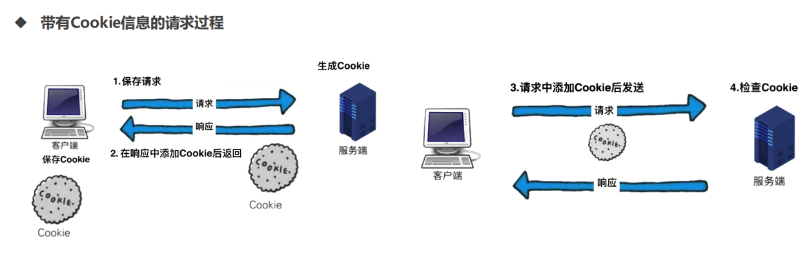
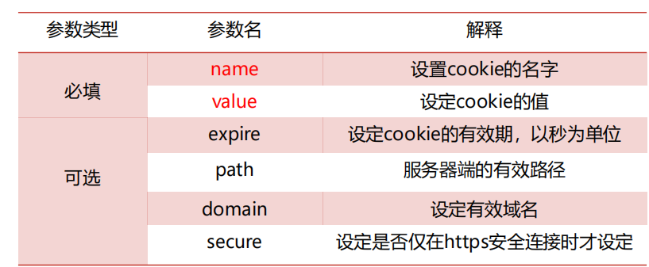
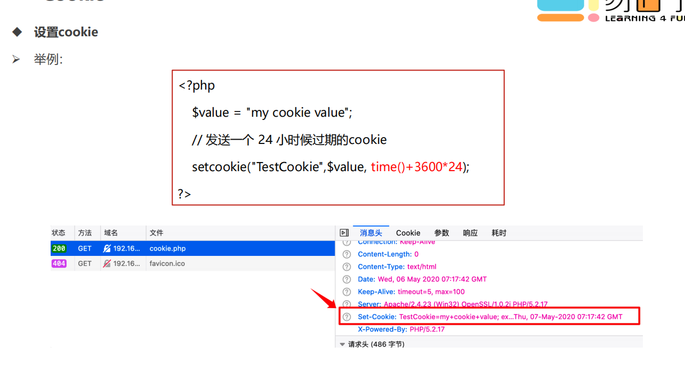
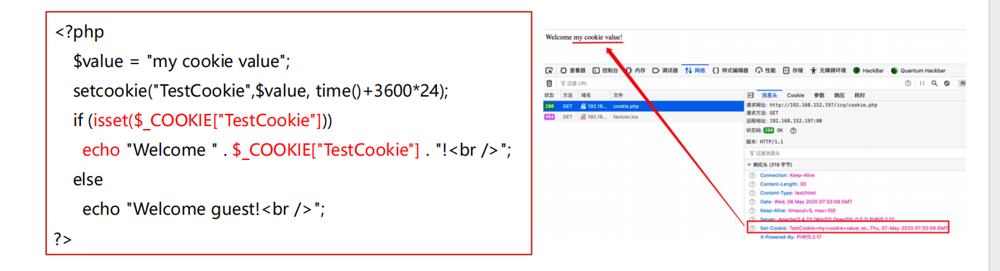
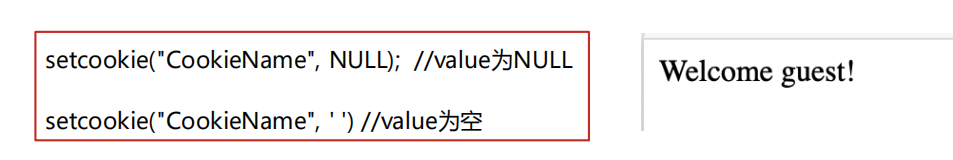
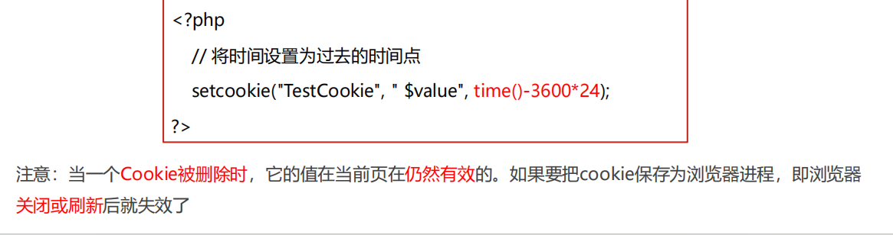
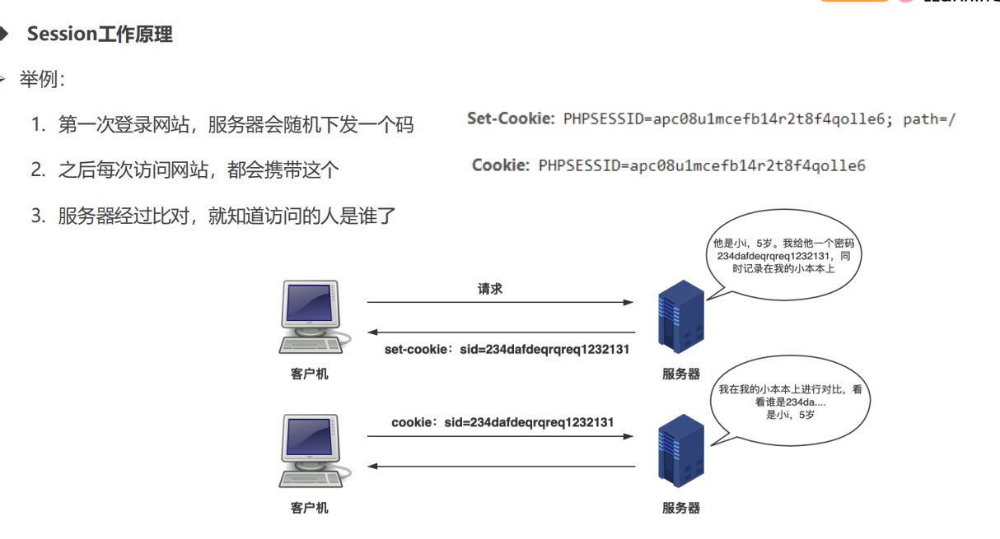
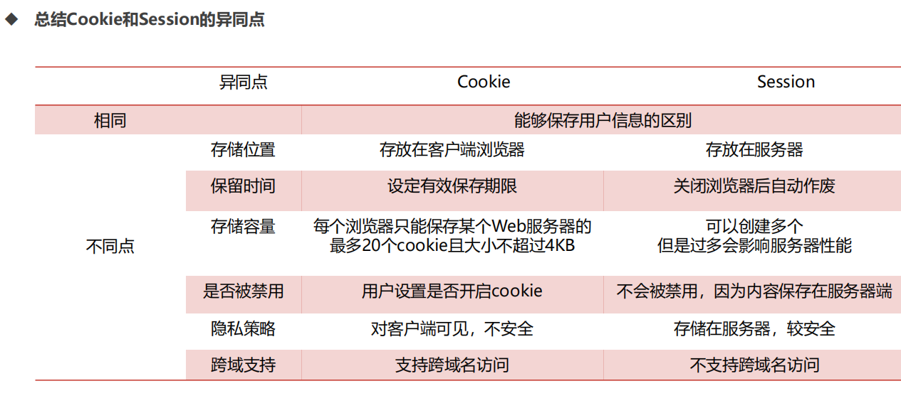

# 会话控制cookie和session

什么是cookie？

• cookie是在http协议下，服务器或脚本可以维护客户端信息的一种方式

• cookie是web服务器保存在用户本地的文件，它可以包含有关用户的信息。当用户访问服务器时，服务器可以接收到

用户的cookie信息

• 如果浏览器上cookie太多，超过了系统所允许的范围，浏览器将自动对它进行删除

​​

‍

1. Cookie 会根据从服务器端发送的响应报文内 Set-Cookie 的部字段信息， 通知客户端保存Cookie
2. 当下次客户端再往该服务器发送请求时， 客户端会自动在请求报文中加入 Cookie 值后发送出去
3. 服务器端发现客户端发送过来的 Cookie 后， 会去检查究竟是从哪一个客户端发来的连接请求， 然后对比服务器上的记录，

最后得到之前的状态信息

设置cookie

➢ PHP用setcookie函数来设置cookie

• Cookie 在传输过程中，是HTTP 协议头的一部分，用于浏览器和服务器之间传递信息

• 所以必须在任何属于HTML文件本身的内容输出之前调用SetCookie()函数，调用该函数前不能有任何内容

➢ setcookie函数语法

➢ 参数解释

setcookie(name,value,expire,path,domain,secure)

​​

‍

​​

接收和处理cookie

➢ PHP中获取cookie信息的方法

• PHP对cookie有很好的支持，在接收的时候PHP会自动从web服务器接收HTTP头并且分析它

• PHP 的 $_COOKIE 超全局变量用于取回 cookie 的值

​​

删除cookie

➢ 删除cookie的两种方法

1. 调用只带有name参数的SetCookie，将value置为空，即可删除​​

2.设置Cookie的失效时间，应当使过期日期变更为过去的时间点

​

‍

cookie注意事项

1. SetCookie()之前不能有任何html输出，空格、空白行都不行
2. SetCookie()后，在当前页调用echo $_COOKIE["name"]不会有输出，必须刷新或到下一个页面才可以看到

Cookie值

3. 使用Cookie的限制，一个浏览器能创建的Cookie数量最多为30个，并且每个不能超过4KB，每个WEB站点能设

置的Cookie总数不能超过20个

4. Cookie是保存在客户端的，如果用户禁用了Cookie，那么cookie也就失效了
5. cookie的生命周期到了，cookie就会失效
6. 设置一个 cookie 时失效时间为time( )那么在页面浏览完之后就被删除

‍

‍

‍

Session概述

➢ 什么是Session？

• Session译为“会话”，其本义是指有始有终的一系列动作/消息

• Web中的Session指的就是用户在浏览某个网站时，从进入网站到浏览器关闭所经过的这段时间，也就是用户浏览这

个网站所花费的时间

• 因此Session实际上是一个特定的时间概念，Session默认的生命周期为20分钟

➢ Session的作用

• Session可以用于身份认证，程序状态记录，页面之间的参数传递等

• 因为HTTP协议无状态，为了在服务器保持客户端的状态，就需要使用Session

​

Session工作原理

• Session的工作原理比较简单，当客户端访问服务器时，服务器根据需要设置Session，将会话信息保存在服务器上，

同时将唯一标识Session的session_id传递到客户端浏览器

• 浏览器将这个session_id保存在cookie中，这个session_id相当于无过期时间的Cookie

• 以后浏览器每次请求都会额外加上这个session_id，在服务器根据这个session_id，就能获取到客户端的数据状态

• 如果客户端浏览器意外关闭，服务器保存的Session数据不是立即释放，此时数据还会存在，只要知道session_id，就

可以继续通过请求获得此Session的信息

• 但是Session的保存有一个过期时间，一旦超过规定时间没有客户端请求时，服务器就会清除这个Session，保存在服

务器/var/lib/php/session/ 文件夹中

‍

​​

基本步骤

第一步：开始一个会话

• 相关函数：Session_start() 开始一个会话或者返回已经存在的会话

• 说明：

1. 这个函数没有参数，且返回值均为true
2. 如果使用基于cookie的session，那么在使用Session_start()前浏览器不能有任何输出

第二步：注册一个会话变量

• PHP中使用 $_SESSION[ 'xxx' ]=xxx 注册SESSION全局变量，和GET、POST、COOKIE的使用方法相似

➢ 第三步：使用会话变量

• 要使一个会话变量在某个范围内可以使用，必须首先使用session_start()函数启动一个会话

• 然后，就可以通过 $_SESSION 超级全局数组访问这个变量了

• 举例：

显示会话变量：echo $_SESSION['xxx'];

判断一个变量是否是注册的会话变量if(isset($_SESSION['xxx’]))

第四步：注销变量并销毁会话

• 删除指定session： unset ($_SESSION[ 'xxx' ])

• 一次注销所有session： $_SESSION=array() ，将一个空数组赋值给$_SESSION

• 结束当前的会话，并清空会话中的所有资源： session_destroy()

• 注意： PHP默认的session是基于cookie的，如果要删除cookie的话，必须借助setcookie()函数

‍

‍

‍

‍

‍

‍

​​
