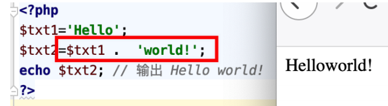
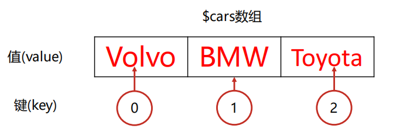
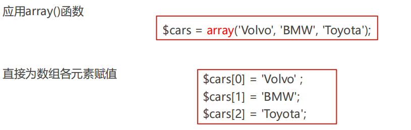
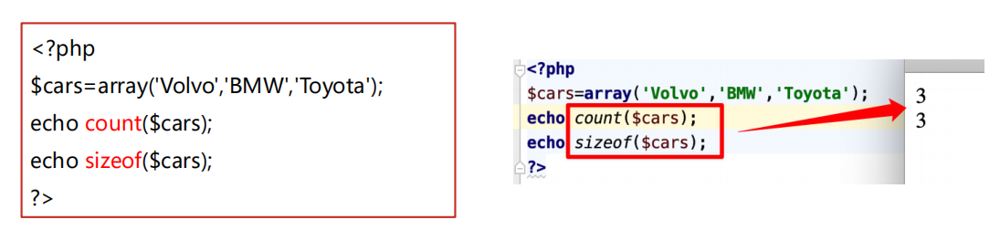
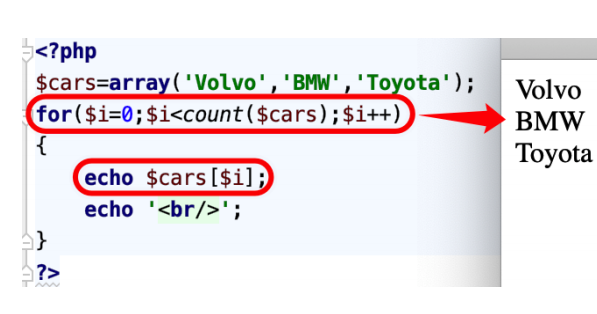
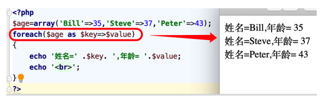
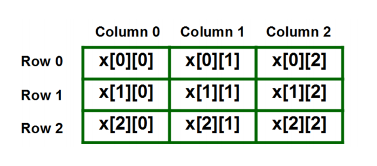
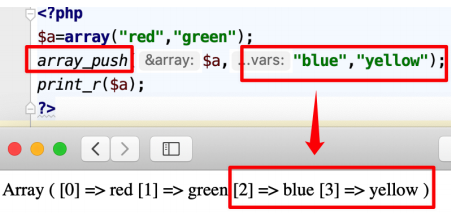
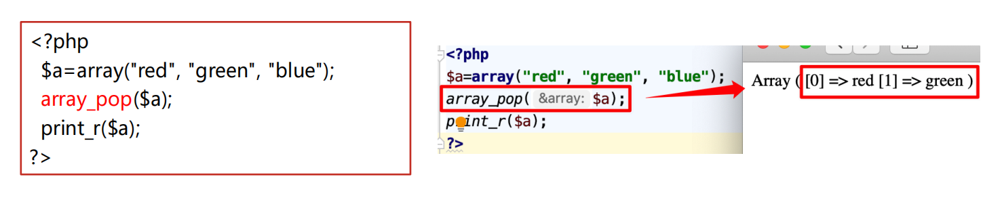

# PHP Hypertext Preprocessor超文本预处理器

> 类C语言，混合了C、Java、Perl语言的特点
>
> 弱类型语言

##### 语言规则

* PHP脚本可放置于文档中的任何位置
* PHP脚本以 <?php 开头，以 ?> 结尾，语句以分号（;）结尾
* &lt;script language=&quot;php&quot;&gt;phpcode;&lt;/script&gt; script脚本格式
* &lt;?phpcode;?&gt; 短标签格式—配置文件php.ini中的short_open_tags=On开启
* PHP 文件通常包含 html 标记 及 PHP 脚本代码，默认扩展名是 '.php
* 变量名大小写敏感，所有关键字和用户定义的喊户名、类名均不区分大小写
* 注释符：单行注释`//和#`​,多行注释`/* */`​

‍

‍

##### 变量

> 弱类型变量，不需要事先声明，可以通过赋值将其初始化为任何数据类型

###### 变量规则

* 变量以​ $ ​符号开头，其后是变量的名称
* 变量名称必须以字母或下划线开头，而不能以数字开头
* 变量名称只能包含字母、数字和下划线（A-z、0-9 以及 _）
* 变量名称区分大小写，建议用小写
* PHP没有创建变量的命令，变量会在首次为其赋值时自动被创建
* PHP是一门类型松散的语言，在为变量赋值时，不必声明变量的数据类型，PHP 会自动把变量转换为相应的数据类

##### 输出

输出方法：`echo()`​ `echo`​ `print()`​ `die()`​ `printf()`​ `var_dump()`​ `print_r()`​

##### 数据类型

###### 字符串String

> 使用单引号或双引号扩住
>
> 单引号：程序不会对字符串进行解析。如果字符串中包含变量，也只输出变量名，而不会输出变量值 --纯文本尽量使用单引号
>
> 双引号：对字符串进行解析，如果字符串中包含变量，则会对变量进行解析而输出变量的值

###### 整数integer

###### 浮点数 float

TRUE 或 FALSE，不区分大小写

###### 布尔型 boolean

###### NULL值

##### 运算符

###### 算数运算符

|运算符|含义|
| --------| ------|
|+|加|
|-|减|
|*|乘|
|/|除|
|%|模|

用括号来改变运算符的优先级

###### 字符串运算符

|运算符|含义|
| --------| ------|
|.|串接|

​​

###### 赋值运算符

|运算符|等同于|描述|
| :------: | :---------: | :------------------------------: |
|x = y|x = y|左操作数被设置为右侧表达式的值|
|x += y|x = x + y|加|
|x -= y|x = x - y|减|
|x *= y|x = x * y|乘|
|x /= y|x = x / y|除|
|x %= y|x = x % y|余数|
|a .= b|a = a . b|连接两个字符串<br />|

###### 递增递减运算符

|运算符|名称|
| --------| --------|
|++ $x|前递增|
|$x ++|后递增|
|-- $x|前递减|
|$x --|后递减|

###### 比较运算符

|运算符|含义|
| -------------------------------------------| -------------------------------------------|
|==|弱类型等于|
|===|值和类型等于|
|！=|弱不等于|
|<>|不等于|
|!==|值和类型都不等|
|>|大于|
|<|小于|
|>=|大于等于|
|<=|小于等于|

###### 逻辑运算符

|运算符|描述|
| ------------| ---------------------------------------------------|
|and|两者为true都为true|
|&&||
|or|至少一个为true则为true|
|\|\|||
|xor 异或|有且仅有一个为true|
|！ 非|不为true-》true|

##### 数组

必须先创建，创建数组的基本方法是应用array()函数

> 数组实体：键、值
>
> ​
>
> 分类：
>
> 索引数组：key连续的整数
>
> 关联数组：key指定的值，字符串

‍

###### 索引数组

创建： 

​​

获取长度 count() sizeof() 均返回数组的长度（元素个数）

​​

遍历：

​​

###### 关联数组

创建：1.array()函数，键与值之间是 => 符号  2.直接赋值

注意：键为字符串时，要用 ' ' 括住，且区分大小写

用 foreach 循环

```bash
<?php
$age=array('Bill'=>35,'Steve'=>37,'Peter'=>43);
foreach($age as $key=>$value)
{
echo '姓名=' .$key. ',年龄= '.$value;
echo '<br>';
}
?>
```

​​

###### 多维数组

​​

```bash
<?php
// 2维数组: 
$cars = array 
( 
array("Volvo",100,96), 
array("BMW",60,59), 
array("Toyota",110,100) 
); 
echo $cars[0][0];
?>
```

###### 基本操作

增加和删除

1.赋值增加

```bash
$arrays=array("age"=>"25");
$arrays["name"]=“jack";
```

2.array_push()函数追加数组元素（入栈）

```bash
<?php
 $a=array("red","green");
 array_push($a,"blue","yellow");
 print_r($a);
?>
```

​​

3.array_pop()返回数组的最后一个元素(出栈)

​​

数组排序

sort  根据数组升序

rsort 根据数组降序

ksort 根据键升序

krsort根据键降序

asort 根据值升序

arsort 根据值降序

##### 函数

## 函数

​​

### 传递参数

* **被传入的参数--实参，函数定义的参数--形参**
* **传参形式：按值传递、按引用传递--传地址、默认参数**

**	**按值传递

```
function example($m){
    $m=$m*5+10;
    echo '函数内参数：'.$m;
}
$m=1;
example($m);
echo '函数wai参数:'.$m;
```

**	**默认参数

```
function example($m,$n=""){
    $m=$m+$n;
    echo $m.'<br>';
}

example(5,5);
example(5);

```

### 返回值

**	**return语句返回值，函数定义不需要声明返回值；

### 作用域

**	**每个函数创建一个新的作用域

**	**作用域决定了这些变量的可访问性，函数内部定义的变量从函数外部是不可访问的

* **局部作用域**
* **全局作用域**

**全局变量 global**

```
$x=5;
$y=6;
function myTest(){
   global $x,$y;  
    //就近原则，使用的局部变量，遮盖了全局变量
   $x=5;
   $y=6;
   $y=$x+$y;
}
myTest();
echo $y.'<br>';
myTest();
echo $y;
```

### 函数库

​​

**字符串**

​​

```
$str='hello world';
echo strlen($str).'<br>';
echo substr($str,1,7).'<br>';
echo strstr($str,'w').'<br>';
print_r(explode(' ',$str));
echo '<br>';
echo trim(' sf sf ').'<br>';
echo md5('admin123');
```

**时间日期**

​​

```
var_dump(checkdate(2,29,2024));
echo date('Y-m-d H:i:s');
```

[date()的参数](https://www.runoob.com/php/php-date.html)

## 类和对象

* **类--功能集合菜单，有同样特征并展现同样行为的对象的集合，是一种用户定义类型**
* **描述：**
* **属性--描述类成员的变量**
* **方法--类成员可执行的动作**

### 创建类--声明类

**创建类--关键字class 类名{}**

### 实例化对象

**实例化对象：$变量名= new 类名称**

**PS：通过同一个类的创建的两个对象不能产生同样的对象；不能通过new命令从一个对象创建另一个对象**

**对象属性--值：$对象名-&gt;属性名称**

```
class mm{
    var $max;
    var $min;
    function big(){
        if($this->max >=  $this->min){
            return $this->max;
        }else{
            return $this->min;
        }

    }
}
$big=new mm;//实例化对象
$big->max=6;//对象属性赋值
$big->min=5;
echo $big->big();//访问对象的成员方法
```

### $this关键字

**$this关键字用来****访问当前对象**中的**对象属性**和**对象方法**的**系统变量**

**仅能在****当前对象**中使用，$this是在对象中特殊的一种**使用构造函数和变量的方法**

## FORM表单处理

**	**用于采集和提交用户输入的信息

### 表单

* **结构**

```
<form name="name" method="post/get" action="url" enctype="value"> //表单元素
</form>
```

**属性**

* **action属性--表单提交的位置（对应的php程序或动态网页的名称）**

  ```
  //提交表单时，由web服务器上的echo.php程序来处理用户所提交的数据
  <from action="echo.php" method="GET">
  ```
* **method属性--向服务器发送输入信息时的使用方法（默认get**

  * **GET方法**

    ```
    get方式URL后面拼接参数

    用？和&隔开，然后把字符串传送到服务器端

    传送数据长度限制2字节

    不具有保密性，不适合保密内容，不能传送非ASCII码的字符
    ```

    ​​
  * **POST方法**

    ```
    输入的信息会进行包装，不依赖于URL
    提交的信息都在后台传输，安全性高
    不会将传递的参数值显示到地址栏，用户数据的长度没有限制
    适用于保密或者大量数据传输到服务器
    ```

    ​​

​​

### 例题

```
//用户和密码长度大于5，用户名只能包含数字字母下划线
<script>
    function checkData(obj) {
        if (obj.username.value.length < 6 || obj.password.value.length < 6) {
            alert('用户名或密码长度不符合要求');
            return false;
        } else {
            return true;
        }
    }

    function checkName(obj) {
        var regex = /^[a-zA-Z_0-9]\w{5,}$/;
        if (regex.test(obj.username.value) == false) {
            alert("用户名不符合要求!");
            return false;
        } else {
            return true;
        }
    }
</script>

<body>
    <form action="..\php\day02.php" method="get" onsubmit="return (checkData(this)&&checkName(this))">
        <p>用户名:<input type="text" name="username"></p>
        <p>密码:<input type="password" name="password"></p>
        <input type="submit" value="提交">
    </form>
</body>
```

### 服务端接收数据

​​

## 文件处理

### 打开文件--fopen()

**格式：fopen(文件路径或URL网址,方式)**

​​

### 文件读取

**	**fread()--读取指定长度字符串

```
<?php
$handle=fopen("sh.txt","r");
//filesize（）指定文件长度
$str=fread($handle,filesize("sh.txt"));
echo $str;
fclose($handle);
?>
```

**	**fgets()--读取文件一行内容

```
<?php
$file=fopen("sh.txt","r");
//判断文件指针是否指向末尾
while(!feof($file)){
//读取完后指针会指向下一行
    $str=fgets($file);  
    echo $str.'<br>';
}
fclose($handle);
?>
```

**	**feof()--检测是否已达到文件末尾

​​

### 文件写入--fwrite()

```
//w有内容写入并覆盖，没内容创建文件写入
//a+续写在内容尾部
$file=fopen("a.txt","w");  
$data="hello world!";
fwrite($file,$data);
fclose($file);
```

### 文件关闭--fclose()

### rewind()指针回文件头

### fseek()移动指针

```
$file=fopen("sh.txt","a");
$data="hello world!";
fwrite($file,$data);
$file=fopen("sh.txt","r");
fseek($file,0);
while((!feof($file))){
    $str=fgets($file);
    echo $str.'<br>';
}
fclose($file);
```
