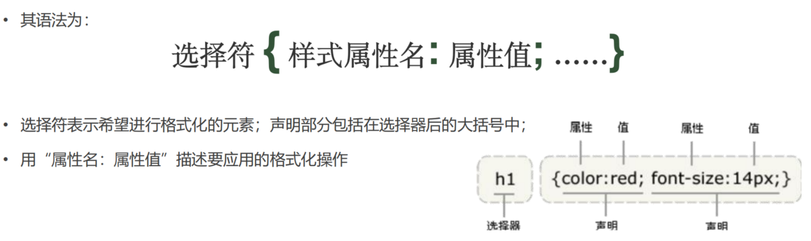
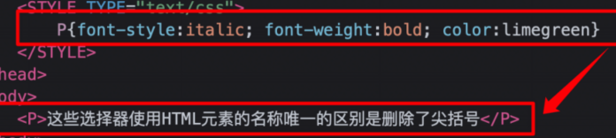
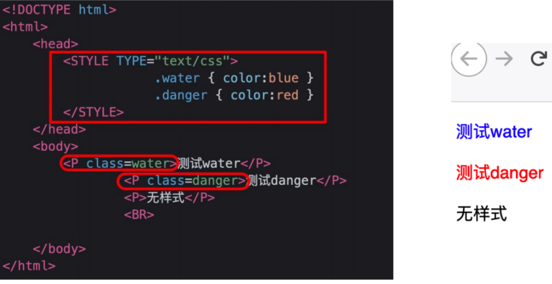
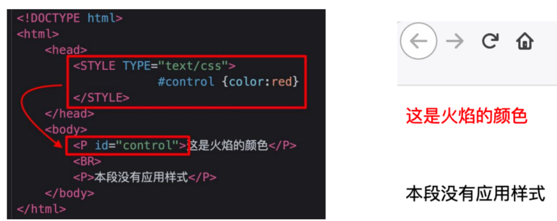
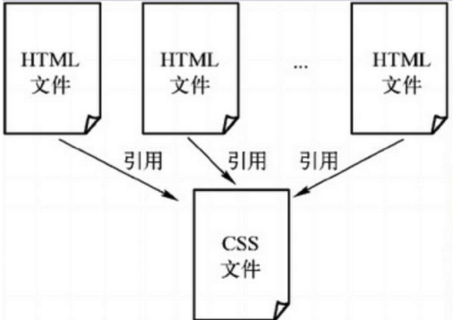

# CSS 层叠样式

‍

CSS规则由两部分组成:选择符和声明，而声明又由属性和属性值组成

语法：

​​

#### 引用方式

##### 内联样式--在HTML元素中使用 "style" 属性；

```bash
<p style=“display:none”></p>
```

##### 内部样式--在HTML文档头部<head>区域使用<style>元素，包含CSS

```bash
<style type="text/css">
选择符 { 样式属性:属性值; 样式属性:属性值;……}
选择符 { 样式属性:属性值; 样式属性:属性值;……}
</style>
```

|选择符|说明|实例|
| :----------: | :----------------------------------: | :-----------------------------------------------------------------------------------------------------------: |
|类型选择符|选择符是HTML标记的名称<br />p{}|​​|
|类选择符|使用HTML元素的class属性<br />class---.|​​|
|ID选择符|使用HTML的ID属性<br />id---#|​​|

‍

‍

##### 外部引用--使用外部CSS，通过<link>标签引入外部的CSS文件

解决很多页面需要引用到同样的样式

​​

格式

链入外部样式表文件

```bash
<link rel="stylesheet" type="text/css" href="样式表文件的地址">
```

导入外部样式表文件

```bash
<style type="text/css">
@import url(样式表的地址)；
选择符 { 样式属性:属性值; 样式属性:属性值;……}
选择符 { 样式属性:属性值; 样式属性:属性值;……}
……
</style>
```

##### 优先原则

同一选择符：按就近原则

不同选择符：内联 > ID > 类 > 类型 > 外部
