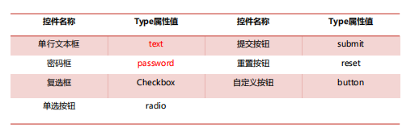

# HTML 超文本标记语言（Hyper Text Markup Language）

> 不是编程语言，是一种标记语言  
> 用来描述网页

##### 基础语法

​​

常用标签

|说明|标签|举例|
| ------| ----------------| --------------------------------------------|
|标题|<h1>-<h6>|​`<h2>标题</h2>`​|
|段落|<p>|​`<p>段落</p>`​|
|链接|<a>|​`<a href="test.html">链接</a>`​<br />|
|图像||​``​|
|列表|<ul><ol>|​`<ul><li>标题</li></ul>`​|
|表格|table tr th td|​`<table></table>`​创建表格<br />`<tr></tr><td></td>`​创建行和格<br />`<th></th>`​创建表格头<br />|

表格 

colspan属性  用于规定单元格横跨的列数  

rowspan属性 用于规定单元格横跨的行数

‍

属性

​​

### 表单

​`<form></form>`​

#### 语法结构：

action 提交到的位置

Method 提交方法，get post

Enctype  编码格式

```bash
<form action="www,baidu.com" method="get"enctype="application/x-www-form-urlencoded">
```

#### 表单域标记符

##### 1.`<input>`​

不同控件的type

​​

##### 2.`<input>.....</input>`​​

###### 单行文本框

```bash
<INPUT type= "text" name="文本框名称" value="文本框值”size="文本框的宽度
maxlength="文本框中能输入的最大长度”>
```

###### 密码框

```bash
<INPUT type="password" name="密码框名称" value=“密码”size=“宽度"maxlength="能输入的最大长度”>
```

###### 提交按钮

```bash
<INPUT type="submit"name="名称"value=“提示字符">
```

###### 自定义按钮

```bash
<INPUT type="button" name="名称"value=“提示字符”>
```

##### 3.`<textarea>...</textarea>`​​​

###### 格式：

```bash
<TEXTAREA name="名称"rows="最大可视行数”cols=“最大可视列数”>默认多行文本</TEXTAREA>
```

##### 4.`<select>和<option>`​​

###### 格式：

```bash
<SELECT name=""size=""
<OPTlON value="">选项1 </ OPTION>
<OPTION value="">选项2 </OPTION>
</SELECT>
```

‍
