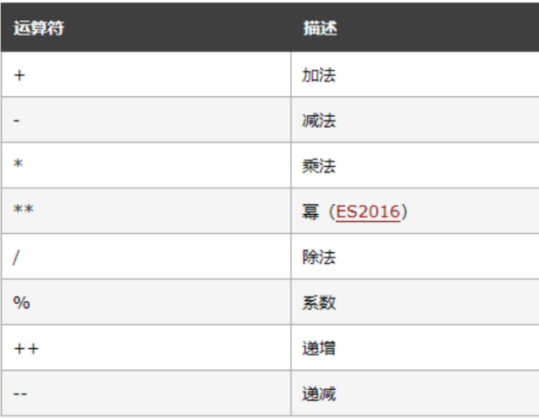

# JavaScript 

> 是脚本语言、弱类型语言， 是一种轻量级的编程语言
>
> 开发环境：不需要编译成二进制，而是以文本的形式存在。记事本、EditPlus、Dreamweaver都可以开发；
>
> 运行环境： JavaScript依赖于浏览器，即浏览器是JavaScript的运行环境，当前主流的浏览器都可以运行

‍

## 基本

### 引用方式

##### 嵌入HTML文件中

任何位置都行

```bash
<script type="text/javascript">
 //此处为JavaScript代码
</script>
```

##### 定义在专门的外部文件

将 JavaScript 代码写在一个独立的脚本文件（扩展名为.js)中，在页面中使用时直接导入该脚本文件即可

```bash
<script type="text/javascript" src="要导入的js文件.js"> </script>
```

### 变量

是可变的，用来存储程序所需的数据

##### 声明&初始化

```bash
var <variable_name>; //变量名须为有效标识符，声明
var <variable_name> = value;   //初始化

栗子
var name = "小i";
var age = 5
```

###### 注意事项

* 变量名只能包含字母、数字、下划线、$
* 变量建议以字母开头
* 变量也能以 $ 和 _ 符号开头（不推荐这么做）
* 变量名称对大小写敏感（y 和 Y 是不同的变量）
* 变量可以使用短名称（比如 x 和 y），也可以使用描述性更好的名称（比如 age, sum, totalvolume）

‍

* 使用 window.alert() ​弹出警告框。
* 使用​ document.write() ​方法将内容写到 HTML 文档中。
* 使用 innerHTML 写入到 HTML 元素。
* 使用​ console.log() ​写入到浏览器的控制台。

###### 输出数据

### 数据类型

数值、字符串、布尔值

以typeof 运算符 检测基本数据类型

```bash
<head>
<title>标题</title>
<script>
var x;
x=10;
x="Hello World";
x=false;
document.write(typeof x);
</script>
</head>
<body>
<p id=“main”>这是个弱类型的语言</p>
</body>
```

‍

##### 常规运算符

​​

##### 赋值运算符

​​

​​

##### 逻辑运算符

​​

##### 条件运算控制语句

###### if

​​

###### if、else

​​

​​

###### switch case

​​​​

###### 三元运算符?:

##### 循环控制语句

###### for语句

​​

for/in语句

```bash
for( var in object)｛
 //执行的代码块
｝
var：指定的变量可以是数组元素，也可以是对象的属性
object：指定迭代的对象
```

‍

###### while语句

执行流程：先判断条件，如果为真便重复执行循环体语句；直到条件为假时才结束循环，并继续执行循环程序外的后续语句

do。。。while

执行流程：先执行循环体语句，然后测试while中的条件，如果测试条件为true，就再次执行循环体语句，直到测试结果为false时，就退出循环

```bash
do{
//循环体语句;
}while(测试条件);
```

‍

**区别**

* do-while是先执行循环中的语句，然后再判断条件是否为真，如果为真则继续循环，如果为假则终止循环。因此对于do-while语句来说至少要执行一次循环语句
* while语然是先判断条件是否为真，为真则执行循环语句，若不为真，则终止循环。因此对于while语句来说可能一次也不会执行循环体语句

###### break&continue语句

* break 语句：

  * break 语句退出直接封闭它的switch、while、do while或for语句
  * 当多个 switch、while、do while 或 for语句彼此嵌套时，break语句只应用于最里层的语句，直接跳出当前循环
* continue 语句：

  * continue语句，开始直接封闭它的 while、do while或for语句的一次新迭代，进入下一次循环
  * 当多个 while、do while 或 for 语句互相嵌套时，continue语句只应用于最里层的语句

### 函数

函数名可包含字母、数字、下划线和美元符号（规则与变量名相同）

##### 声明语法

###### 不带参数

```bash
function 函数名( ){
 //函数体; 
}
function：定义函数的关键字
函数名：自定义的一个名字
函数体：要封装的代码，它可以完成某个特定的功能
```

###### 带参数的函数

```bash
function 函数名 (参数1，参数2，...... )
{
 //函数体; 
}
参数名是自定义的，参数可以有多个，根据需要设定参数
参数之间用(逗号)，隔开
```

###### 带返回值的函数

```bash
function 函数名 (参数1，参数2，...... )
{
 //函数体; 
 return 返回值。//返回函数运行后的结果值，return是关键词，后面的值叫做返回值
}
注意：1、函数的返回值可以是任何数据类型
 2、函数体内必须有return语句，函数才有返回值
 3、调用函数时，返回值可以接收返回值，也可以不接收返回值
```

‍

##### 函数调用

###### 不带参数的

如果在<script>…</script>中调用，那么直接在需要的位置写函数名即可调用

```bash
<script>
 //调用的函数
</script>
```

如果在HTML文件中调用，如通过点击按钮或超链接调用定义好的函数

按钮调用

```bash
<form>
<input type=“button” value=“点击” onclick="函数名"> 
</form>
```

超链接调用

```bash
<a href="javascript:函数名">调用函数</a>
```

###### 带参数的

* 在调用带参数的函数时，一定要给参数传值，有几个参数，就要传几个值。
* 参数和值之间按照顺序 一一对应，参数可以使任何数据类型
* 注意：函数声明时，小括号内写的是参数名；调用时，小括号内写的是给参数传的值

###### 带返回值的函数调用

​​

### 对象

> 对象：是属性和方法的组合
>
> 属性：是对象所拥有的一组外观特征，一般为名词
>
> 方法：是对象可以执行的功能，一般为动词

建立对象语法：新建对象名称 = new 对象类型

​​

##### Object对象

* Object对象提供了一种创建自定义对象的简单方式，不需要程序员再次定义构造函数。
* 由于在程序运行时可为JavaScript对象添加属性，因此使用Object对象很容易创建出自定义对象

```bash
<script>
var person=new Object();
person.name="tony";
person.age=15;
function getAttr(attr){
alert(person[attr]);
}
getAttr("name");
getAttr("age");
</script>
```

###### Data对象

创建Date对象，可以获取计算机中的时间

于脚本总是在客户端中运行，而不是服务器，所以获取的是本地计算机的时间

方法

|方法|功能|
| :-----------: | :-----------------------------------------------------: |
|getDate|返回一个月中的某一天（1~31）|
|getDay|返回一周中的某一天（0~6），0为周日，1为周一，以此类推|
|getFullYear|以四位数返回年份|
|getHours|返回小时（0~23）|
|getMinutes|返回分钟（0~59）|
|getSeconds|返回秒数（0~59）|
|getMonth|返回月份（0~11），0为一月，1为二月，以此类推|
|getTime|返回1970年1月1日至今的毫秒数|

每个Date实例对象都只是计算机的一个毫秒级快照，换言之，Date对象只是保存了它被创建时的时间信息，如果希望

总是显示当前最新时间，就需要不停地获取时间快照。

###### Math对象

|方法|功能|
| :-------------------------: | :---------------------------------------------------: |
|Math.abs(number)|返回number的绝对值|
|Math.ceil(number)|对number向上取整，如Math.ceil(67.6)返回值是68|
|Math.floor(number)|对number向下取整，如Math.ceil(67.6)返回值是67|
|Math.max(number1,number2)|返回number1与number2中的较大值|
|Math.min(number1,number2)|返回number1与number2中的较小值|
|Math.random()|返回0和1之间的伪随机数，可能为0，但总是小于1，[0,1)|
|Math.round(number)|返回最接近number的整数|
|Math.sqrt(number)|number的平方根|

‍

‍

‍

‍

‍

‍

‍

‍

###### Array对象

JavaScript中提供一个名为Array的内部对象来创建数组。  
通过调用Array对象的各种方法，可以方便地对数组进行排序、删除和合并等操作。  
Array有多种形式的构造函数，因此利用Array对象创建数组的方式有多种，下面列出了最常用的三种方式:

```bash
var arr=new Array();
var arr=new Array(4);
var arr=new Array(1,2,3);

栗子
将Array对象中的数组元素排序后，循环输出每个元素的索引号和
<script>
var arr=new Array(3,3.4,“abc",2,1);
arr.sort(); //排序
for(var i=0;i<arrlength;i++){
document.write(i+":"+arr[i]+"<br />");}
</script>
```

###### String对象

> String是动态对象，需要创建对象实例后才能使用它的属性或方法  
> 注意:某字符串使用单引号或双引号标注时，可以被当作字符串对象实例进行处理，从而直接调用String对象的属性和方法

‍

常用属性

length 用于计算字符串中的字符个数

​​

常用方法 主要用于搜索字符串中的字符、转换字符的大小写、分割字符串以及截取子字符串

|名称|描述|
| -------------| -----------------------------------------------|
|charAT|返回字符串对象中指定索引处的字符，索引从0开始|
|indexOf|返回某个子字符串在目标字符串中首次出现的位置|
|substr|从指定索引位置开始截取指定长度的字符串|
|substring|返回指定索引范围内的字符串|
|toLowerCase|把字符串转化为小写|
|toUpperCase|把字符串转化为大写|
|split|返回按照指定分隔符拆分的若干子字符串数组|

‍

‍

‍

‍

‍

‍

### 字符串

##### 创建字符串方法

1.String和new一起使用，创建的是一个字符串对象  var str = new String()  
2.内建函数，使用 String()类型函数可以构造字符串  var str = String()  
3.直接量，使用双引号或单引号包含任意长度的文本  var str ='文本'

​​

##### 常用方法

|类别|名称|描述|示例|
| :-------------------------------: | :------------------------: | :----------------------------------: | ------------------------------------------------------|
|方法|toLowerCase、toUpperCase|转小写、转大写|​​|
||indexOf|查找字符串，返回索引值|​​|
||substring|返回被操作字符串的一个子字符串||
||substr|返回被操作字符串的一个子字符串|​​|
||split|将字符串按照指定的分割符分割成数组|​​|
||trim|清空空格|​​|
||match|查找指定的值，返回匹配的值|​​|
||search|检索字符串首次出现的位置|​​|
||replace|替换指定字符|​​|

### 数组

> 数组是一个值的集合  
> 每个值都有一个索引号，我们称之为下标，下标从0开始，每个下标都对应一个值
>
> ​​

##### 语法

创建数组时不指定长度:var 数组名 = new Array();  
创建数组时指定长度:var 数组名=new Array(长度值);

‍

PS:

创建的新数组是空数组没有值，如输出则显示undefined  
虽然创建数组指定了长度，但实际上数组都是可变长度的，也就是说即使指定了长度，仍然可以将元素存储在规定长度以外

##### 数组赋值

​​

**注意:数组存储的数据可以是任何类型的**

‍

##### 遍历循环数组

注意：数组的length属性还可以赋值，而数组的长度会根据length的变化而变化

```bash
var num = new Array(66,80,90,77,59)
for(var i=0;i<num.length;i++){
document.write(num[i] + "<br>");
```

#### 常用方法

数组是Object类型，所有数组具有属性和方法

|类别|名称|描述|示例|
| :-------------------------------: | :---------: | :----------------------------------------------------------: | ----------------------------------------------------------|
|属性|length|设置或返回数组中元素的数目|​​|
|方法|push()|将新元素添加到一个数组的尾部，并返回数组的新长度值|​​​​|
||pop()|移除数组中的最后一个元素并返回该元素|​​​​|
||sort()|对数组排序|​​​​|
||reverse()|对数组进行反转（注意：不是倒序）|​​|
||concat()|返回一个新数组，这个新数组是由多个数组组合而成的|​​|
||join()|把数组的所有元素放入一个字符串中，通过一个的分隔符进行分隔|​​|
||split()|将一个字符串分割成一个数组|​​|

### DOM

> DOM (Document Object Model) 称为文档对象模型，是一个表示和处理文档的应用程序接口（API）
>
> 可以用于动态访问、更新文档的内容、结构和样式

##### 节点树

将网页中文档的对象关系规划为节点层级，构成它们之间的等级关系，这种各对象间的层次结构被称为节点树

通常把DOM树中的每个元素称为节点（Node）

一个文档的树形结构就是由各种不同的节点组成的，文档对象节点树有以下特点：

1. 每个节点树有一个根节点
2. 除了根节点，每个节点都有一个父节点
3. 每个节点都可以有许多的子节点
4. 具有相同父节点的节点叫做“兄弟节点”

​​​​

##### 节点访问

###### ①访问指定元素

常用方法

|类型|方法|说明|示例|
| -------------------------------------------| --------------------------| --------------------------------------------------| -------------------------------------------------------------------------------------------------------------|
|访问指定节点<br />|getElementById()|获取拥有指定ID的第一个元素对象的引用|​​|
||getElementsByTagName()|获取带有指定标签名的元素对象集合|​​|
||getElementsByName()|获取带有指定名称的元素对象集合||
||getElementsByClassName()|获取指定class的元素对象集合（不支持IE6~8浏览器）||

‍

‍

‍

‍

‍

‍

‍

‍

##### ②访问相关元素

常用方法

|属性|说明|
| :---------------: | :--------------------: |
|parentNode|元素节点的父节点|
|childNodes|元素节点的子节点数组|
|firstChild|第一个子节点|
|lastChild|最后一个子节点|
|previousSibling|前一个兄弟节点|
|nextSibling|后一个兄弟节点|

‍

## 事件

> javascript与HTML之间交互就是通过事件实现的，事件就是文档或浏览器窗口中发生的一些特定的交互瞬间
>
> 事件在浏览器中是以对象的形式存在的，即event，触发一个事件，就会产生一个事件对象event
>
> 该 event 对象包含着所有与事件有关的信息，包括导致事件的元素、事件的类型以及其他与特定事件相关的信息

##### 监听方法

1. ###### 绑定HTML元素属性：

    ```bash
    <p id= "xxx" onclick= "changeSize()" >绑定HTML元素属性</p>
    ```
2. ###### 绑定DOM对象属性：

    ```bash
    document.getElementById("xxx").onclick=function()
    ```

‍

### 常用事件

|事件|说明|示例|
| -------------| ------------------------------------------------------------------| ---------------------------------------------------------------------------------|
|onclick|鼠标单击页面元素时触发的事件|​​|
|onload|在页面加载完成后立即发生|​​|
|onunload|用户关闭或刷新网页时触发事件|​​|
|onblur|指光标或者焦点离开元素后触发的事件|​​|
|onchange|指输入框的值发生了变化或者改变下列列表框的选项会触发onchange事件|​​|
|onmouseover|指鼠标移入页面元素时触发的事件|​​|
|onmouseout|是指鼠标移出页面元素时触发的事件||

‍

‍

‍

‍

‍

‍
