# 网络通信协议

> 协议  --  语言  通信  --  聊天  数据  --  内容
>
> ‍

#### OSI国际互连

Open System Internet 开放系统互连参考模型，是由ISO国际标准化组织定义的，它是灵活的、稳健的和可操作的模型，并不是协议

目的是规范不同系统的互联标准，是两个不同的系统能够较容易的通信，而不是需要改变底层的硬件或软件的逻辑

##### 七层模型

###### 封装和解封过程

* 封装：自上而下

  ​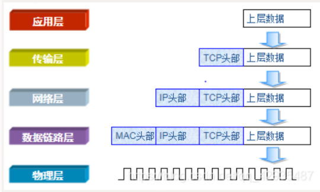​
* 解封：自下而上

  ​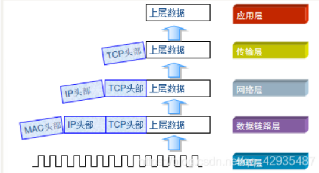​

###### 组成

* 物理层

  比特 传输比特流 提供物理通路，二进制数据传输
* 数据链路层

  帧  逻辑连接、硬件地址寻址、差错校验等
* 网络层

  数据包 路径选择，网络连接的多路复用、差错的检测和恢复、排序与流量控制
* 传输层

  报文段/用户数据包 提供端到端之间可靠透明的数据传输。分组与重组、差错控制与流量控制，保证数据传输正确完整性

  通信防火墙：通信包过滤
* 会话层

  会话连接的恢复与释放，对会话进行分段、同步等
* 表示层

  数据加密、压缩、语法表示与连接管理
* 应用层

  用户应用程序和协议

  WAF Web Application Firewall

#### 分层模型TCP/IP

##### 数据链路层

###### ARP地址解析协议

发现逻辑地址与物理地址的映射关系

* 报文

  * 分类

    * ARP请求报文
    * ARP应答报文
  * 格式  
    ​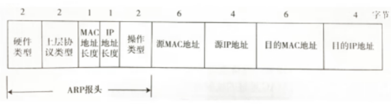​

    * 硬件类型（2B）：值为1为以太网地址
    * 上层协议类型（2B)：0x800表示IP协议
    * MAC地址长度（1B)
    * IP地址长度（1B)
    * 操作类型（2B）

      * 1   ARP请求报文
      * 2  ARP应答报文
    * 源MAC地址（6B)
    * 源IP地址（4B)
    * 目的MAC地址（6B）

      * 表示接收方设备的硬件地址，请求报文字段值全为0  ---   任意地址
      * 不知道这个MAC地址，广播，字段值全为f
    * 目的IP地址（4B）
* 缓存表

  * 表项<IP地址，MAC地址>

    IP到MAC映射关系，<u>局域网内的通信基于MAC地址</u>
  * 工作原理

    * 在需要发送数据时，主机会根据数据包的目的IP地址信息，然后在ARP缓存表中查找对应的MAC地址，最后通过网卡将数据发送出去
    * 如果缓存表中没有找到对应的数据，会发送ARP Request的广播给本地网络的所有设备，发送过去的包中目标MAC地址为全1，查看ip是否对应，不是则丢包，是则返回ARP Reply的单播，将自己的MAC地址作为响应发送回去，并且MAC地址会放入缓存表中
  * 生存时间一般20min
  * 通过arp -a命令查看主机中ARP缓存表

##### 网络层

###### IP网际互连协议

> 提供无状态的、不可靠的，无连接的数据传送服务，端对端

* 报文

  * 首部部分

    * 组成

      * 固定部分（20B）

        * 版本（4b)

          * 0x0100 ipv4
          * 0x0110  ipv6
        * 首部长度(4b)

          * 表示包括选项在内的IP头部字段的长度
        * 区分服务（8b）

          * DSCP  质量控制
          * ECN    报告网络拥堵情况
        * 总长度（16b）

          * 数据包最大长度2^16-1=65535字节
          * 但受数据链路层协议的影响，总长度不超过最大传送单位MTU=1500字节
        * 标识（16b）

          * 标识数据报，每产生一个数据包其值+1
        * 标志（3b）

          * 用于标识数据报是否分片
          * 第一位没有使用
          * 第二位DF表示是否分段

            * 0   不允许分段
            * 1    允许分段
          * 第三位MF表示是否还有分段

            * 0   最后一个分段
            * 1    后面还有分段
        * 片偏移（13b）

          * 分段在原文中相对位置，以8个字节为偏移单位，除了最后一个分片，其他偏移值都是8B的整数倍
        * TTL生存时间（8b）

          * 表示寿命，每经过一个路由器，TTL减1，当TTL=0时，丢弃数据报
          * 设置TTL目的：为了防止数据报在网络中无限的循环转发
        * 协议(8b)

          * 1   ICMP
          * 2  IGMP
          * 6  TCP
          * 17 UDP
          * 47 GRE
          * 50 ESP
        * 首部检验和(16b)

          * 检验IP数据报头，保证首部数据的完整性，每经过一个路由器都要重新计算报头校验和
        * 源IP地址（32b）
        * 目的IP地址（32b）
      * 可变部分

        * 组成

          * 可选片段
          * 填充
        * 长度的可变，最多包含40B，但以 32bit 为界，不足时插入值为 0 的填充字节。保证 IP 首部始终是 32bit 的整数倍。
        * 支持各种选项，提供扩展余地，用来支持排错、测量以及安全措施
    * IP报头信息用于知道网络设备对报文进行路由和分片

      * 同一网段内的数据转发通过链路层即可实现，
      * 而跨网段的数据转发需要使用网络设备的路由功能，分片是由数据包超过一定长度时，需要被划分或不同的片段使其能够在网络中传输
  * 数据部分

###### ICMP协议

* ipv4协议簇的子协议，用于在IP主机、路由器之间传递控制消息

  控制消息：网络通不通、主机是否可达、路由是否可用

  不传输用户数据，提供IP包无法传输时提供报告
* 报文

  * 组成

    * IP报头（≥20B）
    * ICMP报头（≥8B)

      * 类型（1B) 目前定义了14种

        * 1~127   差错报文

          * 0  回送应答 Echo Reply
          * 3  目标不可达 Destination Unreachable

            路由器或主机不能传递数据使用
          * 4  源点抑制 Source Quench

            代码值为0，则是一个控制流量的角色
          * 5  重定向或改变路由 Redirect
          * 8 响应请求 Echo Request

            通常用ping来操作，用来测试网络连接
          * 9  路由公告
          * 10 路由请求
          * 11 超时 Time Exceeded

            * 代码值

              * 0  传输超时
              * 1   重组分段超时
          * 13 时间戳请求 **​ ​**Timestamp Request​
          * 14 时间戳应答 Timestamp Reply
          * 17 地址子网请求
          * 18 地址子网应答
        * ≥128    信息报文
      * 代码（1B)

        * 表示对应的ICMP报文的代码
      * 校验和（2B)

        * 查看在传输过程中是否出差错
        * 计算方法和ip报头校验计算一样
      * 标识（2B)

        * 仅适用于回显请求和应答icmp报文
        * 对于目标不可达和超时等字段值全为0
      * 序号（2B）​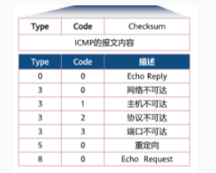​
    * ICMP报文

###### IGMP协议

> 用于IP网络中的组播组成员管理。组播是一种允许单一数据源发送数据到多个接收者的网络传输方式，常用于流媒体、视频会议、网络电视（IPTV）等应用。
>
> IGMP的主要目的是让组播路由器能够了解哪些主机加入了哪个组播组，从而有效地转发组播数据。

* IGMP版本

  * **IGMPv1**：是最初的版本，只提供了<u>基本的组成员查询和报告机制</u>。
  * **IGMPv2**：在IGMPv1的基础上增加了<u>离开组播组的功能</u>，并提供了更有效的查询和报告<u>过程。</u>
  * **IGMPv3**：进一步增强了<u>协议</u>，<u>允许主机报告它想要接收或拒绝哪些组播源的流量。</u>

##### 传输层

###### TCP传输控制协议

> 特点：面向连接的端到端协议，提供可靠传输服务（文件分段，在传输数据前必须先建立会话，进行流量控制），拥塞机制、滑动窗口、重传机制
>
> ‍

* TCP端口号

  * 系统端口

    * IANA 互联网数字分配机构
    * 范围：1-1023
    * 举个栗子（应用层）
  * 登记端口

    * 范围：1024-49151
    * 需要按规定手续办理登记
  * 客户端口

    * 范围：49152~65535
    * 客户动态使用，进程通信结束，系统收回端口
* 数据段格式

  * 数据段头

    * 是TCP为了实现端到端可靠传输
    * 组成

      * 源端口（16位）
      * 目的端口（16位）
      * 序号（32位）

        * 每个数据字节都要按顺序进行编号
      * 确认号（32位）

        * 指期望接受到下一个数据段的第一个字节序号
      * 数据偏移（4位）

        * 即首部长度，指出数据起始处距离TCP报文段的起始处有多远，数据偏移单位4字节
      * 保留（6位）

        * 目前置为0
      * 紧急URG（1位）

        * 紧急指针控制位，URG=1 表明紧急指针字段有效，高速系统此报文段由紧急数据，应及时传送
      * 确认ACK（1位）

        * 1 确认字段有效
        * 0 无效
      * 推送PSH（1位）

        * 1 要求接收端尽快把该数据段提交给应用程序
        * 0 可以先缓存
      * 复位RST（1位）

        * 用于重置、释放一个混乱的传输连接，为1 重新建立新的传输连接
      * 同步SYN（1位）

        * 1 表示一个连接请求或连接接受报文
      * 终止FIN（1位）

        * 1 该报文段的发送端的数据已经发送完毕，并要求释放运输连接
      * 窗口字段（16位）

        * 用来存储传入数据段的窗口大小，即发送者当前还可以接收的最大字节数
      * 检验和（16位）

        * 检验范围包含首部和数据连部分
        * 在计算检验和时，要在TCP报文段的前面加上12字节伪首部
      * 紧急指针字段（16位）

        * URG=1才有意义
  * 数据

    * 指由应用层来的用户数据
* **三次握手**

  * 客户端发送标有SYN的数据段，同步位SYN=1，序列号seq=a，SYN_SENT状态

    * 希望能够建立连接
  * 服务端恢复标识SYN+ACK的数据段，SYN=1，使ACK=1，序列号seq=b，确认序列号为客户端的序列号ack=a+1，服务器此时进入SYN_RCVD状态

    * 表示对客户端SYN报文的确认
  * 客户端发送ACK的数据段，使ACK=1，此时客户端进入ESTABLISHD状态，序列号seq=a+1 确认序列号为服务端的序列号ack=b+1

    * 表示对服务端的SYN报文的确认，在服务端收到ACK就会进入到ESTABLISHD状态
* **四次挥手**

  * 客户端发送 FIN的数据段，释放报文首部FIN=1，序列号seq=a

    * 客户端进入FIN_WAIT_1状态，等待对方确认。
  * 服务端回应标识符ACK的数据段，序列号seq=b，确认号ack=a+1

    * 此时处于半关闭状态，若服务端向客户端发送数据，客户端仍可以接收
    * 客户端收到ACK后进入FIN_WAIT_2状态
  * 服务端发送FIN和ACK数据段给客户端的，发送FIN=1，ACK=1，seq=b，ack=a+1

    服务端进入LAST_ACK状态
  * 客户端向服务端发送确认，进入TIME_WAIT状态，ACK=1，seq=a+1，ack=b+1

    在TIME_WAIT状态中，客户端会等待足够长的时间（通常是2MSL，即最大报文生存时间的两倍），以确保服务端收到了最后的ACK报文。之后，客户端才会关闭连接。

###### UDP用户数据包协议

* 特点

  * 无连接，不需要建立连接
  * 最大努力交付，不保证可靠交付，也不使用拥塞控制--不可靠，无拥塞控制
  * 面向报文，适用于多媒体通信要求
  * 支持一对一、一对多、多对多的交互通信
  * 首部开销小，只有8B
* 报头格式

  * 源端口（16位）
  * 目的端口（16位）
  * 长度（16位）
  * 校验和（16位）

    * 在进行校验和计算时，需要UDP数据报头部前加上12字节的伪头部，然后对整个UDP头部和“数据”部分进行校验

###### 区别

1. 连接性：

    * **TCP** 是面向连接的协议。在数据传输之前，需要建立一个TCP连接，这个过程称为“三次握手”。
    * **UDP** 是无连接的协议。它不需要在数据传输之前建立连接，数据可以直接发送。
2. 可靠性

    * **TCP** 提供可靠的服务。它确保数据包的顺序传输，并且通过确认（ACK）和重传来保证数据的可靠到达。
    * **UDP** 不保证数据的可靠性。它可能会丢失、重复或到达顺序错误，但UDP协议本身不提供重传机制。
3. 数据流控制

    * **TCP** 有流量控制机制，如滑动窗口协议，可以调节发送数据的速率，以避免网络拥塞。
    * **UDP** 没有流量控制。它以应用程序设定的速率发送数据，不管接收方是否能够处理。
4. 拥塞控制

    * **TCP** 有拥塞控制机制，如慢启动、拥塞避免、快重传和快恢复，以减少网络拥塞。
    * **UDP** 没有拥塞控制。它不考虑网络拥塞，这可能导致网络状况恶化。
5. 数据包大小

    * **TCP** 数据包的大小受限于最大传输单元（MTU），并且通常有一个固定的大小。
    * **UDP** 数据包大小也受限于MTU，但它可以发送不同大小的数据包。
6. 头部开销：

    * **TCP** 头部较大，通常为20字节，如果使用选项字段，可能会更大。
    * **UDP** 头部较小，只有8字节。
7. 用途

    * **TCP**用于Web浏览、电子邮件、文件传输等
    * **UDP**用于视频会议、在线游戏、实时音视频流等
8. 速度

    * **TCP** 通常比UDP慢，因为它需要时间建立连接，并且有更多的机制来确保数据的可靠传输。
    * **UDP** 通常比TCP快，因为它直接发送数据，没有建立连接和可靠性保证的开销。

‍

##### 应用层

###### FTP文件传输协议

> 基于客户端-服务器模型

FTP在传输文件时使用两个并行的TCP连接：控制连接和数据连接。

* **控制连接**：用于传输命令和应答，通常使用TCP端口21。

* **数据连接**：用于实际传输文件数据，可以使用TCP端口20（主动模式）或由客户端随机选择的高位端口（被动模式）。

  * **主动模式（PORT）**：FTP服务器主动发起数据连接到客户端。
  * **被动模式（PASV）**：FTP客户端发起数据连接到服务器。端口1024-65535

* FTP协议本身不提供加密，因此数据在传输过程中可能会被窃听。
* 为了提高安全性，可以使用FTP over SSL/TLS（FTPS）或SFTP（SSH文件传输协议）。

###### Telnet协议--远程登录

> * **明文传输**：Telnet的一个主要缺点是它以明文形式传输数据，包括用户名和密码，这使得它非常不安全，容易受到网络窃听。作为替代，SSH（Secure Shell）被广泛推荐，因为它提供了加密的通信。端口22
> * **端口**：Telnet服务通常使用TCP端口23。
> * **功能**：除了基本的命令行交互，Telnet还支持一些其他功能，如命令历史、字符处理、以及不同终端类型之间的协商。

**远程登录命令**

* Windows：---对应到3389端口

  * 开启远程桌面功能命令

    ```bash
    #启用远程桌面功能
    dism /online /Enable-Feature:RemoteDesktop /Quiet
    Enable-WindowsOptionalFeature -Online -FeatureName "RemoteDesktop" -NoRestart

    #允许远程连接
    reg add "HKLM\SYSTEM\CurrentControlSet\Control\Terminal Server" /v fDenyTSConnections /t REG_DWORD /d 0 /f

    #重启远程桌面服务
    net stop TermService
    net start TermService
    ```
  * 远程连接命令

    ```bash
    mstsc
    mstsc /v:目标计算机的IP地址或主机名
    #如：mstsc /v:192.168.1.100
    ```
* kali远程命令--扫描端口发现3389就可以利用远程端口

  ```bash
  rdesktop 192.168.1.100
  ```

‍

‍

###### SMTP：25

* 简单传输邮件传输协议（邮箱漏洞利用，伪造有箱头）
* C/S模式
* 原理：客户端通过连接到服务器上的SMTP端口来发送邮件，服务器监听该端口以接收邮件发送请求

###### SNMP:161,162(trap) 简单网络管理协议（没啥漏洞）

###### DNS协议

> 将域名解析到IP地址
>
> 协议端口   53
>
> 工作模式  C/S，可以输入nslookup命令查询域名对应的IP地址

* 域名

  * 主机名.域名   --完全限定域名（FQDN）
  * 树状结构  
    ​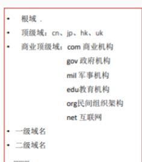​
* 查询分类

  * 方式

    * 递归查询

      * 客户机向本地DNS服务器查询发起的为递归查询
    * 迭代查询

      * 本地DNS服务器与根等其他DNS服务器的解析过程
  * 内容

    * 正向解析

      * 域名→IP
    * 反向解析

      * IP→域名
* 报文

  * 会话标识
  * 标志

    * Query/Response（1）

      * 指明数据报是DNS查询还是回应

        * 0  查询
        * 1   响应
    * Opcode（4）

      * 用来定义消息中请求类型

        * 一般是0表示标准查询
    * Authoritative Answer 权威应答（1）

      * 1  表示响应是由域内权威域名服务器发出
    * TC（1）

      * 指响应数据太长，无法装入数据报被截断
    * Recurision Desired 递归期望 （1）

      * 说明DNS客户端在DNS解析服务器不含所请求信息的情况下，要求进行递归查询
    * Recurision Available 可用递归 （1）

      * 说明域名解析服务器支持递归查询
    * zero（3）

      * 保留
    * rcode（4）

      * 在DNS响应中指明错误，0表示没有错
  * 问题计数
  * 回答计数

###### DHCP  动态主机配置协议Dynamic host configuration protocol

* 协议端口：UDP  67服务端/68客户端
* 作用：自动分配IP地址，提供可靠安全简单的TCP/IP网络配置，减少工作量，避免ip冲突，提高地址利用率
* 工作模型：C/S
* 原理（租约过程）

  * 四步骤

    * 客户机发送DHCP Discovery 广播包 客户机广播请求IP地址（包含MAC地址）

      * 使用0.0.0.0作为源地址发送广播，查询有哪些DHCP Server
    * 服务器响应DHCP Offer 广播包 服务器响应提供的IP地址（但无子网掩码、网关等参数）
    * 客户机发送DHCP Request ​广播包 客户机选择IP
    * 服务器发送DHCP ACK ​广播包 服务器确定租约，并提供网卡详细参数、ip、掩码、网关、DNS、租期等
* 续约

  * 50%租期过后

    * 客户机会再次发送DHCP Request包进行续约
  * 87.5%租期过后

    * 再次发送DHCP Request包进行续约，如果仍未响应则释放IP地址，之后重新发送DHCP Discovery广播来获取IP地址
  * 当任何服务器无响应时，自动分配一个IP为169.254.X.X/16

    * 属于全球统一无效地址，用于临时的内网通信
* 客户机命令

  * ipconfig  /release    释放IP（取消租约，或手动配置IP，也可以释放租约）
  * ipconfig  /renew      重新获取IP（有IP时，发送Request续约，无IP时发送Discovery重新获取IP）
* 报文

  * OP操作代码（1B）

    * 1  请求
    * 2  回应
  * 硬件类型（1B)

    * 0x01  以太网硬件地址
  * 硬件长度（1B)
  * 跳数（1B）
  * 事务ID（4B）

    * 匹配一个请求和响应的ID
  * 消耗时间秒（2B）

    * 客户端第一次向DHCP服务器发送地址请求后的时间
  * 标志（2B）
  * 客户端IP（4B)
  * 你的IP（4B)
  * 服务器IP地址（4B)
  * 网关IP地址（4B)
  * 客户端硬件地址

‍

###### TFTP：69 简单文件传输协议

###### HTTP:80端口

* 基本

  * HTTP版本有v0.9、v1.0，目前常用1.1版本
  * HTTP是在TCP协议的基础上，网页打开会传输很多数据，TCP提供传输控制，按顺序或交付数据，在此也可以用于传输视频、音频等。
* 浏览器输入URL发生了什么

  ​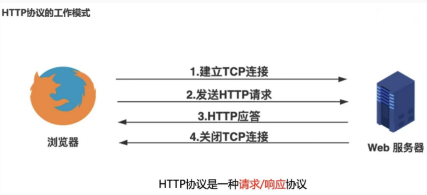​

  * URL概念

    * URL （Uniform Resource Locator） 统一资源定位符
    * 是互联网上用来标识某一处资源的地址
    * URL中是域名的话，格式： 协议：//域名/访问文件的API

      ​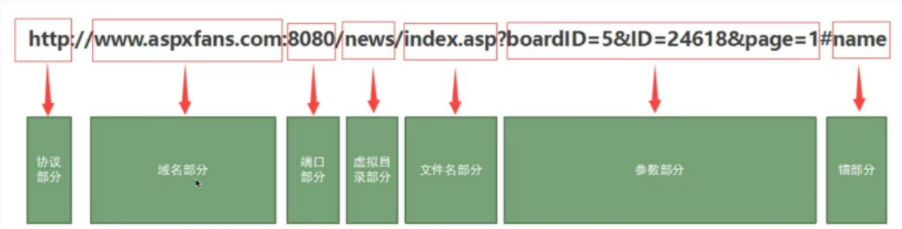​

      * 协议部分。不区分大小写
      * 身份认证。指从服务器获取资源需要账号密码
      * 服务器地址。可以是域名，可以是ipv4或ipv6地址
      * 服务端口。默认80
      * 虚拟目录。
      * 文件名。
      * 参数部分。？后面的参数部分使用的是GET传参，其中&是用来区分多个传参的
      * 锚部分。注释部分，’#‘表示注释

        * 搜索框中语法： `inurl“#” 用来查看URL中带有#的路径`​​  ---使用的谷歌语法--信息收集
    * URL编码作用将符号进行转换防止出现歧义
  * 工作模式

    * 1.解析URL

      * 解析URL得到的参数，将域名和需要请求的资源分离开来，从而了解需要请求的是那个服务器，请求什么资源等。
    * 2.浏览器封装HTTP请求报文

      ​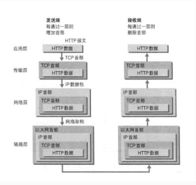​

      * 解析URL之后可以确定目标服务器和文件名，而后根据这些消息封装成HTTP请求报文发送出去​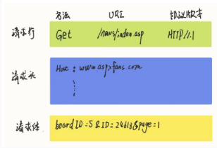​
      * 常见请求的方法是GET请求，而post请求一般是在请求体里面
    * 3.DNS域名解析获取IP地址（UDP协议的基础上进行）

      ​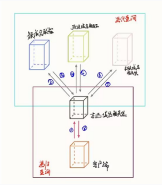​

      * 封装好后，还需要从DNS中获取目标服务器的IP地址，如果是IP地址就不用经过这一步骤
      * 解析过程

        * 1）查找浏览器的DNS缓存，其中有一份域名和ip的对应表
        * 2）若未查找到，则搜索操作系统的DNS缓存
        * 3）PS：/etc/hosts文件优先级会高于操作系统DNS缓存

          如果没有找到，操作系统会在/etc/hosts文件中查询，这个文件允许系统管理员手动将域名映射到特定的IP地址。
        * 4）还没找到，则操作系统会将域名发送给本地域名服务器，本地域名服务器或查看自己的DNS缓存，查找到则返回结果

          * （PS：主机和本地域名域名服务器之间的查找方式是递归查询）
        * 5）若本地域名服务器未找到，则会向<u>*上级域名服务器*</u>进行查询，通过以下方式进行迭代查询

          * （PS：本地域名服务器和其他域名服务器之间的查询是迭代，防止根域名服务器压力过大）
          * 本地域名服务器会向根域名服务器（是最高层次）发起请求，如果根域名未找到，根域名会通知本地域名去顶级域名服务器找

            * 本地域名有顶级域名的地址后对其发起请求，如果顶级域名未找到，获取权限域名服务器的地址

              * 本地域名获得权限的地址对其发起请求，最终获得所要域名的IP地址
        * 6）本地域名服务器获得的IP地址返回给操作系统，同时将IP缓存起来
        * 7）操作系统将IP地址返回给浏览器，同时自己将IP地址缓存起来

          * 其中ipconfig /displaydns可以进行查看操作系统上的域名缓存，清空缓存 ipconfig /flushdns
        * 8）从而浏览器获得与域名相对应的IP地址，并将其存放在浏览器中
    * 4.建立TCP连接

      * 获得目标IP地址之后，要建立TCP连接，HTTP是在TCP的基础上进行的，网页打开会传输很多数据，TCP提供传输控制，按顺序或交付数据，在此也可以用于传输视频、音频等。所以要保证双方都具有可靠的接收和发送能力
      * 三次握手

        * 第一次握手：客户端向服务端发送SYN包；
        * 第二次握手：服务端收到客户端的SYN包后，向客户端发送ACK包表示确认收到，同时发送SYN包表示询问是否收到他发送的确认包，即ACK+SYN包；
        * 第三次握手：客户端收到ACK+SYN包后，向服务端发送ACK包表示自己已经收到；
        * 待服务端收到ACK包后，两方成功建立连接
    * 5.浏览器发送请求

      * 此时的浏览器和目标服务器之间建立了一个可靠的虚拟通道，故浏览器就可以发送http请求。

        * PS：HTTP 请求报文或者响应报文在 TCP 连接通道上进行传输的时候，由于这些报文比较大，为了更容易和准确可靠的传输，TCP 会将 HTTP 报文按序号分割成若干报文段并加上 TCP 首部，分别进行传输。接收方在收到这些报文段后，按照序号以原来的顺序重组 HTTP 报文。
      * 1）负责传输的IP协议

        * TCP协议所进行的各个操作都是通过IP协议进行传输的，IP协议会将这些操作的数据添加IP首部分装成IP数据包再进行传输。
        * PS：IP协议射出的网络层规定：数据报通过怎样的路径（传输路线）才能达到对方计算机，并传送给对方。
      * 2）使用ARP协议凭借MAC地址通信

        * IP 协议的作用是把各种数据包传送给对方而要保证确实传送到对方那里，则需要满足各类条件，其中必要的两个就是 IP 地址 和 MAC 地址（用来唯一标识一个接入网络的设备）。
        * 网络指定IP地址方向。源IP地址和目标IP地址在传输过程中是不会变化的。
        * 数据链路层是基于MAC地址。从线路上来看源MAC地址和目的MAC地址是会不断地发生变化的
    * 6.服务器响应请求

      * 服务器按顺序将这些收到的报文段重组HTTP请求报文，然后处理并返回一个HTTP响应。
    * 7.四次挥手断开连接

      * 浏览器和服务器不在发送数据后，四次挥手断开TCP连接。
      * 四次挥手

        * 第一次挥手（主动关闭方发送FIN）

          * 主动关闭方发送一个FIN（Finish）标志的TCP段，用来通知对方它已经完成了发送数据，并希望关闭到对方的数据传输。
        * 第二次挥手（被动关闭方发送ACK）

          * 被动关闭方收到这个FIN段后，发送一个ACK（Acknowledgment）段作为应答，确认已经收到了对方的FIN请求。此时，被动关闭方仍然可以发送未发送完的数据。
        * 第三次挥手（被动关闭方发送FIN）

          * 当被动关闭方也完成了数据发送后，它发送自己的FIN段，请求关闭到主动关闭方的数据传输。
        * 第四次挥手（主动关闭方发送ACK）

          * 主动关闭方收到被动关闭方的FIN段后，发送一个ACK段作为应答，确认已经收到了对方的FIN请求。在发送完这个ACK后，主动关闭方会等待一个时间间隔（称为TIME_WAIT状态），以确保被动关闭方收到了最后的ACK。
        * 在TIME_WAIT状态结束后，连接正式关闭。这个TIME_WAIT状态是为了确保在网络中由于延迟而可能出现的旧TCP段不会对新连接产生影响。
    * 8.浏览器显示界面

      * 浏览器收到服务器返回的数据包，根据浏览器的渲染机制对相应的数据显示界面
* 特点

  * 1.支持c/s模式

    * 请求/响应
  * 2.简单快速

    * 只需要传送请求方法和路径
    * 协议简单，http服务器程序规模小，通信速度快
  * 3.灵活

    * 允许任意类型的数据对象，传输类型由<u>Content-Type加以标记</u>
  * 4.无状态

    * 无状态是指协议对于事务处理没有记忆能力
    * cookie和SESSION的作用就是标记
    * 缺少状态需要前面的东西就需要重传，导致数据量增大
* HTTP报文

  方法格式

  ​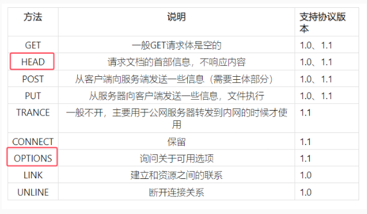​

  * Options方法可以用来发现服务器支持哪些方法  ---Options漏洞
  * GET格式

    * 请求报文​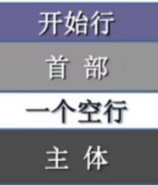​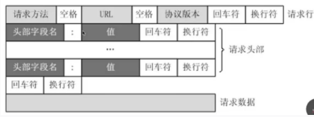​​
  * post方法

    ​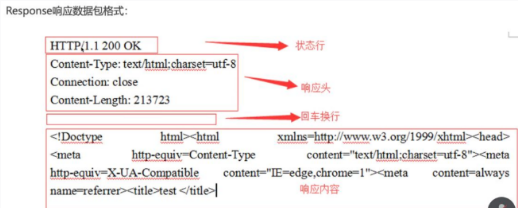​
  * 状态码

    * 1XX：信息性响应-表示请求已接收，继续处理

      * 100 Continue：服务器已经收到请求的初始部分，客户端应该继续发送请求
      * 101 Switching Protocols：服务器根据客户端请求切换协议
      * 102 Processing：服务器已经收到并处理请求，但无响应可用
    * 2XX：成功响应

      * 200 OK：请求成功，并返回请求的数据
      * 201 Created： 请求成功，并创建了新的资源
      * 202 Accepted： 已接受，但尚未处理
      * 203 NON-Authoritatice Information： 请求成功，但返回的元信息来自缓存或本地副本，可能不是最新
      * 204 No Content： 请求成功，但没有返回任何内容
      * 205 Reset Content：请求成功，客户端应重置视图
    * 3XX： 重定向

      * 300 Multiple Choices： 表示多个选择，通常会有一个选项表
      * 301  Move Permanently： 永久重定向，中间件配置
      * 302 Found： 临时重定向，页面跳转
      * 303 See Other： 对请求的响应可以在另一个URL找到
      * 304 Not Modified： 资源未修改，可以直接使用缓存版本
      * 307 Temporary Redirect： 请求的资源临时从不同的URL响应请求
    * 4XX：客户端错误状态码

      * 400 Bad Request： 请求有误，服务器无法理解
      * 401 Unauthorized：请求需要用户认证
      * 403 Forbidden: 服务器理解请求，但拒绝执行
      * 404 Not Found：服务器找不到请求的资源
      * 405 Method Not Allowed： 请求行中指定的方法不允许对请求的URL进行访问
    * 5XX：服务器错误状态码

      * 500 Internal Server Error： 服务器内部错误，无法完成请求
      * 501 Not Implemented： 服务器不支持请求的功能
      * 502 Bad Gateway： 作为网关或代理的服务器，从上游服务器收到无效响应
      * 503 Service Unavailable：服务器暂时无法处理请求，可能过载或维护
      * 504 Gateway Timeout：作为网关或代理的服务器，没有及时从上游服务器收到响应
      * 505 HTTP Version Not Support：服务器不支持请求的HTTP协议版本
  * 常见字段

    * host：指定服务器的域名和端口号

      * 如果服务器对Host头验证不严格，攻击者可能会使用伪造的Host头进行服务器端请求伪造（SSRF）攻击。
    * User-agent ​：描述发起请求的浏览器类型、操作系统、软件版本等信息

      * 攻击者可能会修改User-Agent字段来绕过基于User-Agent的访问控制或指纹识别。
    * Accept：表示**客户端**可以接收的响应内容类型，优先级从左到右一次递减。/表示为任何类型那个。内容类型用MIME表示。也叫媒体类型

      * 攻击者可能会通过修改Accept头来诱导服务器返回非预期内容，这可能有助于信息泄露或服务器端内容发现。
    * Accept-Language：指定客户端接收的语言，按优先级排列，其中q表示相对优先级
    * Accept-Endocding：表示客户端支持的内容编码方式

      * 攻击者可能会利用服务器端处理压缩编码时的缺陷，例如通过发送无效的压缩数据来触发缓冲区溢出。
    * Authorization： 提供认证信息，通常是一个令牌，用于验证请求者的身份
    * Connection:close ：指示客户端或服务器在响应完成后应该关闭TCP连接

      * 连接状态：close和keep-alive，在http/1.1默认是Keep-Alive
    * Referer字段:表示发起请求的原始地址，用于统计和分析请求来源

      * 攻击者可以伪造Referer字段来绕过某些依赖于Referer字段的访问控制策略。
    * cookie字段
    * cookie：区分

      * aspsessionid
      * jspSESSION
      * 攻击者可能会尝试窃取或伪造cookie来绕过会话管理，例如通过XSS攻击、CSRF攻击或会话固定。
    * Content-Type：发送端（客|服）发送的实体数据的数据类型，也是MIME类型
    * content-length ：实体主体大小
    * X-Forwarded-For:

      * 绕过方法：虽然不是标准的HTTP头字段，但攻击者可能会伪造这个字段来绕过基于IP地址的访问控制。
    * client-ip：用于表示发起请求的客户端的IP地址

      * 攻击者可能会伪造这个字段来绕过基于IP地址的访问控制。
* GET和POST区别

  * GET请求

    * 参数和值不安全，都在URL上
    * 长度限制，默认4096个
    * 缓存机制，将页面内容缓存到浏览器中，如果请求一样的
  * POST请求

    * 比较安全，参数和值在请求体中
    * 长度无限制
    * 无缓存机制

###### HTTPS：443端口

> 	在 HTTP 传输过程中，中间人能看到并且修改 HTTP 通讯中所有的请求和响应内容，所以使用 HTTP 是非常的不安全的。为了防止中间人攻击，这里就升级HTTP--》https（secure http）
>
> 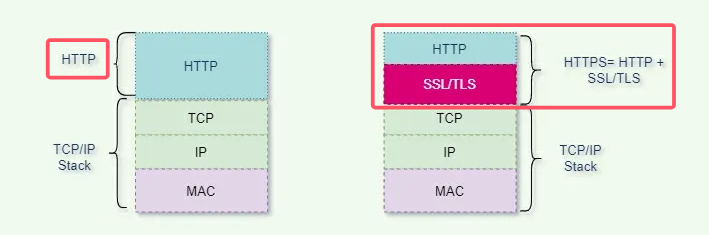

* 基本

  * TLS/SSL

    ​`SSL`​是个加密套件，负责对`HTTP`​的数据进行加密。`TLS`​是`SSL`​的升级版。

    * SSL 安全套接层 Secure Socket Layer

      用于在客户端和服务器之间建立加密链接，确保在互联网上传输的数据保持私密性和完整性。

      工作原理

      * 使用公钥和私钥的组合来加密数据。

        服务器拥有一个公钥和一个私钥，公钥是公开的，私钥是保密的。
      * 当客户端连接到一个支持SSL的服务器时，服务器会向客户端发送其公钥。
      * 客户端使用这个公钥来加密一个随机的密钥，然后发送给服务器。这个随机密钥将用于加密后续的所有通信。
      * 服务器使用其私钥解密这个随机密钥，然后双方使用这个密钥进行对称加密通信。

      功能:数据加密、数据完整性、认证

      SSL证书

      * SSL证书是由可信的证书颁发机构（CA）签发的，它包含了服务器的公钥和其他身份信息。
      * 浏览器会验证SSL证书的有效性，以确保连接的安全性。
      * SSL证书分为几种类型，包括域验证（DV）、组织验证（OV）和扩展验证（EV）。
    * TLS 传输层安全 Transport Layer Security

      用于在互联网上提供通信安全，确保在两个通信应用程序之间传输的数据保持机密性和完整性

      工作原理

      * **握手过程**：TLS通信开始于一个握手过程，客户端和服务器交换加密参数和身份验证信息。
      * **密钥交换**：使用公钥加密技术（如Diffie-Hellman密钥交换）来安全地交换会话密钥。
      * **数据传输**：握手完成后，使用对称加密算法（如AES）来加密数据传输。
      * **完整性验证**：使用消息认证码（MAC）或哈希函数（如SHA）来验证数据的完整性。

      特点

      * **加密**：保护数据在传输过程中不被窃听。
      * **认证**：确保通信双方的身份，防止中间人攻击。
      * **完整性**：确保数据在传输过程中没有被篡改。
      * **向前保密**：即使私钥被泄露，之前通信的加密数据仍然保持安全。

      TLS证书

      * TLS证书是由证书颁发机构（CA）签发的，用于在握手过程中验证服务器的身份。
      * 证书包含了服务器的公钥、服务器的身份信息以及CA的数字签名。

‍

‍

‍

‍

‍

‍
