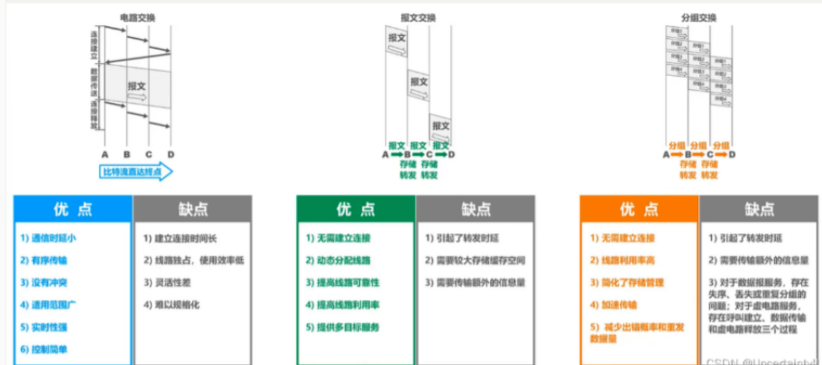
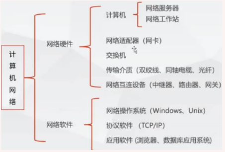
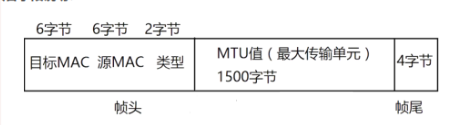
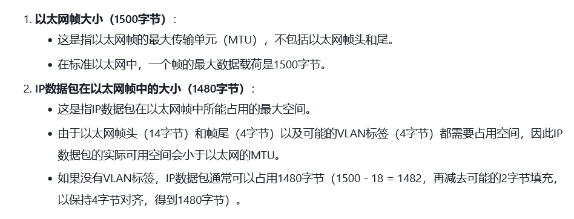
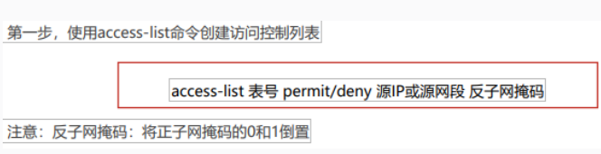
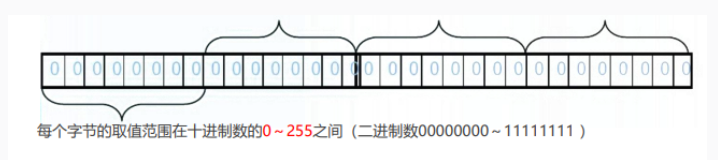
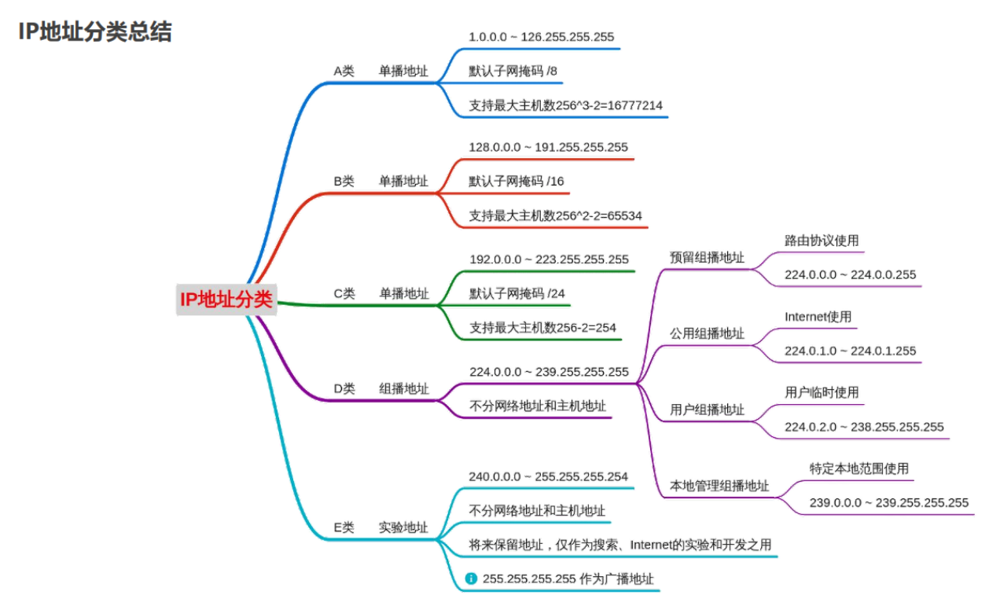

# 计算机网络

# 基础

##### 网络

局域网LAN

城域网MAN

广域网WAN

##### 信息交换方式​

​

‍

## 设备

​​

##### 传输介质

双绞线

T568A线序 白绿 绿 白橙 蓝 白蓝 橙 白棕 棕

T5688线序 白橙 橙 白绿 蓝 白蓝 绿 白棕 棕

##### 网络设备

###### 集线器

信息分值、信号放大、集中管理

###### 网卡

负责计算机中的数字信号转换成电或光信号

###### 交换机

* 基于MAC地址识别协议，二层（链路层），三层（网络层）

  * 以太网帧结构1518字节  
    ​

    * 目的MAC地址6B
    * 源MAC地址6B
    * 上层协议类型type 2B

      * 用于识别上层协议，为上层提供服务
      * 0x0800的帧代表IP协议帧
      * 0x0806的帧代表ARP协议帧
    * 数据字段

      * 网络层数据，最小长度46字节，最大长度MTU值（最大传输单元）1500字节
    * 循环冗余检验字段FCS

      * 错误检测机制
  * PS：​​
* 工作原理

  * 收到一个帧后，首先学习帧中的源MAC地址来形成MAC地址表
  * 检查帧中的目标MAC地址，并匹配MAC地址表

    * 匹配则单播转发
    * 无匹配则除接收端口外，广播转发
  * MAC地址表老化时间默认300S
* VLAN技术

  * 原理

    * 对网络进行一个安全的隔离、分隔广播域，减少广播风暴
    * 在物理网络上划分出逻辑网，对应OSI模型第二层
    * 一个VLAN=一个广播域=一个网段
  * 作用

    * 安全性，减少保密信息遭到破坏的可能性
    * 节约成本，无昂贵的网络升级
    * 提高性能，将二层网络划分成多个广播域，减少不必要的数据流
    * 缩小广播域，减少一个广播域上的设备数量
    * 提高管理效率
  * trunk

    * 概念

      * 在两个网络设备之间，承载多于一种VLAN的端到端的连接，将VLAN延伸到整个网络
      * 允许所有vlan数据通过trunk链路
      * 通过数据帧上加标签，来区分不同VLAN数据
    * 标签

      * ISL标签：Cisco私有的，标签大小30字节
      * 802.1q标签：公有协议，所有厂家都支持，标签大小4字节，属于内部标签

###### 路由器

* 根据网络层地址寻路径，网络管理、IP分配、路由，承担网关功能
* 路由表是维护路由条目的集合，以及做出路径选择
* ACL访问控制列表

  * 工作原理：读取第三层及第四层包头中的信息，根据预先定义好的规则对<u>包进行过滤</u>
  * 作用

    * 提供网络访问的基本安全手段
    * 可以控制数据流量
    * 控制通信量
  * 分类

    * 标准访问控制列表

      * 根据数据包的源IP地址来允许或拒绝数据包--只对源地址进行过滤
      * 表号1~99
      * PS:设置的ACL规则一条都没匹配上，就会默认被丢弃，所以在后面都会加上access-list 表号 permit any
      * ​​
    * 扩展访问控制列表

      * 基于源和目的地址、传输协议和应用端口号进行过滤
      * 每个条件都必须匹配，才会施加允许和拒绝条件
      * 使用扩展ACL可以实现更加精确的流量控制
      * 列表号100~199
    * 其他种类

      * 基于MAC地址
      * 基于时间
* NAT转换

  * 静态NAT

    * 在地址转换设备上手动将一个地址转换成另一个不同的地址，静态地址转换一对一，适用于内部服务器向外部提供服务（WEB、FTP等）需要建立服务器内部地址到固定合法地址静态映射
    * 命令

      * ①标记端口连接内网

        * (config-if)ip nat inside
      * ②标记端口连接外网

        * (config-if)ip nat outside
      * ③配置inside local address 和 inside global address 的静态转换表

        * (config)ip nat inside source static local-ip global-ip
  * 动态NAT

    * 手动定义两个地址池，一个允许转换的内部地址池，一个外部地址池，动态映射，只能提供一对一转换，向外部提供服务
    * 命令

      * ①定义一个IP地址池

        * Router(config)#ip nat pool 地址池名 公网起始地址 公网结束地址 netmask 子网掩码
      * ②定义一个标准的访问控制列表，只有和这个列表匹配的地址才会进行NAT转换

        * Router(config)#access-list 表号 permit 地址 反子网掩码
      * ③定义动态NAT，把和列表匹配的内部本地地址，用地址池中的地址建立NAT映射

        * Router(config)#ip nat inside source list ACL表号 pool 地址池名字
      * ④标记网络的内部和外部接口

        * Router(config)#ip nat {inside loutside}
  * 端口地址转换PAT

    * 多个本地地址使用全局地址进行转换，通过不同端口号区分不同连接，多对一转换
    * 命令

      * ①标记内部接口和外部接口

        * Router(config)#ip nat {inside |outside}
      * ②定义IP访问控制列表

        * Router(config)#access-list 表号 permit 地址 反子网掩码
      * ③定义地址池

        * Router(config)#ip nat pool 地址池名 起始地址 结束地址 netmask 子网掩码
      * ④配置多复用动态转换条目

        * Router(config)#ip nat inside source list ACL表号 地址池名 overload //overload表示使用端口复用技术

###### 网关

* 协议网关：负责转换两种完全不同的协议体系
* 应用网关：在两种不同格式间翻译数据的系统
* 安全网关：防止网络资源被泄露或损害

##### 所有的设计思想

**高内聚低耦合**--分层思想，尽可能独立完成自己的功能，模块间的复杂程度越低越好

##### IP地址

* 唯一标识，是一段网络编码，32位
* 格式

  * ​​
  * 32个二进制，分4组，每组转成十进制（0~255），用.隔开
* 分类

  * 原因

    * 有效利用地址空间
    * 便于管理
    * 隔离广播和通信，减少网络拥塞
    * 处于安全方面考虑
  * 将IP地址的主机号部分划分成两部分，拿出一部分来标识子网，另一部分仍然作为主机号 划分后IP地址由三部分组成:网络号+子网号+主机号
  * 分配主机ip换算后要-2（网络号和**广播号**）
  * 分类

    * 国际标准组织ISPO定义分类

      组成：网络号+主机号

      ​​

      * A

        * 0和127作为特殊地址

          * 0.0.0.0  默认路由
          * 127.0.0.1  本地回环地址
        * 最大主机数：256*256*256-2=166777214
        * 用于大型网络
        * 私有地址10.0.0.0/8
        * 保留地址128.0.0.0/24
      * B

        * 除开169.254.X.X   --DHCP功能自动获取一个IP，DHCP服务器发生故障，或响应太长时间超出系统规定时间，系统分配的ip
        * 用于中型网络
        * 私有地址172.16.0.0/16
        * 保留地址169.254.0.0/16
      * C

        * 私有地址192.168.0.0/24
        * 用于小型网络
      * D  组播地址

        * 不分网络地址和主机地址，第一个字节最高位固定是1110
        * 无子网掩码 ，224.0.0.0-239.255.255.255
      * E

        * 也不分，最高固定是11110
        * 保留地址240.0.0.0-255.255.255.254 用于Internet科研
        * 广播地址255.255.255.255
    * 无分类编址CIDR--有效分配IP地址

      采用可变长度的子网掩码VSLM

      CIDR聚合

      * 目的是要减少路由表的条目数量 一个路由表条目告诉一个路由器向哪里发送流量
      * 聚合就是将相邻的多个IP前缀合并成一个短前缀，使其覆盖更多的地址空间
      * 优点：减少路由表大小、延长ipv4地址寿命、提高路由效率

‍
