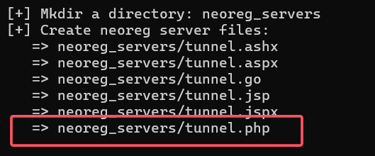

# 代理 proxy

> 运行一个网络终端通过这个服务与另一个网络终端进行非直接的连接

##### 代理类别

HTTP代理

SOCKS代理

Telnet代理

SSL代理

##### 代理工具

EarthWorm

reGeorg（http代理）

Proxifier（win）

Sockscap64（win）

ProxyChains（Linux）

##### 区分正向和反向

> 正向：用于代表内部网络用户向Internet上的服务器（web服务器）发出连接请求，并接收响应结果，执行该代理功能服务器
>
> * 代理客户端，隐藏真实客户
> * ​​
>
> 反向：代表外部网络用户向内部服务器发出请求，接收来自Internet上用户的连接请求，并将这些请求转发给内部网络上的服务器，然后从内部服务器上得到响应返回给Internet上请求连接的客户
>
> * 代理服务器，隐藏真实的服务器，负载均衡服务器
> * ​​

​​

# Socks代理

Socks代理中有一个交互协议，当准备访问一个网站时，浏览器会先发送一个访问目标的基本信息（URL和服务端口）给Socks服务端

Socks服务端解析了这个信息后，会代替浏览器去访问目标网站，并将结果返回给浏览器端

##### 代理和端口转发区别

|代理|端口转发|
| ------------------------| ------------------------|
|需要Socks协议支持|无需协议支持|
|一对多，帮他人访问网络|一对一，访问主机某端口|

## NEO-reGerorg

> * 把内网服务器的端口通过http/https隧道转发到本机，形成一个回路
>
> * 它利用webshell建立一个Socks代理进行内网穿透，服务器必须支持aspx、php或jsp这些web程序中的一种
>
> * reGeorg分为服务端和客户端
>
> 工作原理：python客户端在本地监听一个端口，提供Socks服务，并将数据通过http/https协议发送到服务端上，并从服务端上用socket实现转发
>
> ​​

##### 下载

下载地址：https://github.com/sensepost/reGeorg

Python2+urllib3库

```bash
python -m pip install urllib3
pip install urllib3
```

##### 步骤

连接蚁剑

​​

本地启动neoreg.py 设置密码生成tunnel.php并上传到WEB服务器

```bash
python neoreg.py generate -k password
```

​​

使用neoreg.py连接web服务器，在本地建立sock5代理,去访问内网的网站

```bash
python3 neoreg.py -k password -u http://192.168.2.5/tunnel.php
```

‍

‍

‍

​​

## msf route

获取会话-》获取内网地址-》在msf中添加内网网段的路由

路由添加方法

```bash
run autoroute -s 内网网段 #添加去往内网网段的转发路由
run autoroute -p #查看路由的添加情况
```

## ProxyChains代理

> 开源代理工具，通过一个用户定义的代理列表前置连接指定的应用程序，支持HTTP、Socks4 Socks5类型

##### 下载

https://github.com/rofl0r/proxychains-ng

##### 配置文件

/etc/proxychains.conf

* 删除dynamic_chain前面的注释符
* 在最底部添加要代理的服务器`SOCKS5 127.0.0.1 1080`​

##### 使用

* 测试代理服务器是否能正常工作

  ```bash
  cp /usr/lib/proxychains3/proxyresolv /usr/bin/
  proxyresolv www.baidu.com
  ```
* 使用proxychains启动任意软件

  命令格式：proxychains [软件名]

  ```bash
  proxychains sqlmap -u xxxx  #启动sqlmap
  proxychains msfconsole      #启动msf
  proxychains Firefox         #启动Firefox
  ```

### Proxifier

> 一款Socks5客户端，可以让不支持通过代理服务器工作的网络程序能通过https或Socks代理或代理链
>
> 支持socks4 socks5 http代理协议 支持tcp UDP协议 可以指定端口 ip 域名 程序等运行模式

##### 配置使用

代理服务器配置：IP地址和端口号

​​

设置代理规则

​​

### sockscap

##### 配置和使用

​​

​​

## Windows客户端代理工具

## 实验

### reGeorg+Proxifier连接内网3389

​​

##### 步骤

1. 上传tunnel.php文件

    ‍
2. 渗透主机进行配置

    * 执行cmd，监听6666端口 `python reGeorgSocksProxy.py -u http://ip/tunnel.nosoket.php -p 6666`​
    * 打开proxifier代理工具设置代理：`profile-proxy servers:127.0.0.1:6666 socks5代理`​
    * 配置代理规则 `profile-proxification rules`​
3. 通过代理远程连接

‍

### 边界代理基础实验

获取shell，扫描到还有另一个网卡，及内网主机

上传msf马到目标主机获取meterpreter

添加路由

```bash
meterpreter> run port/multi/manage/autoroute
```

使用msf自带的socks代理模块

```bash
background
use auxiliary/server/socks5
设置参数运行
```

修该proxychains的配置文件为msf中设置的端口

```bash
vi /etc/proxychains
socks5 攻击机ip 端口
```

进而对内网进行渗透

### http代理

shell连接-发现内网

上传tunnel.php，进而代理转发

修改proxychains配置文件

扫描内网存活主机端口
