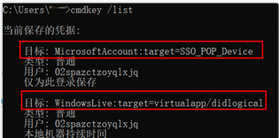
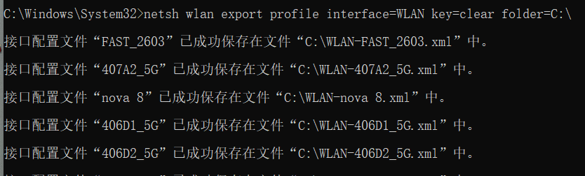
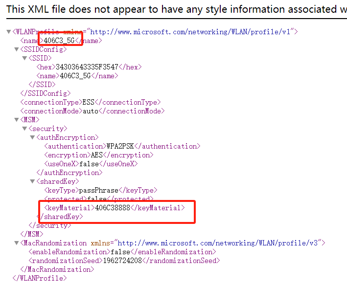
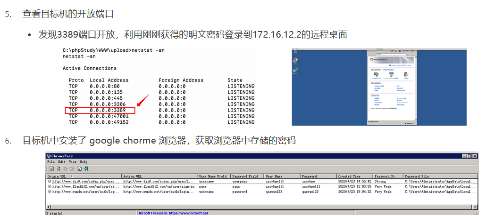
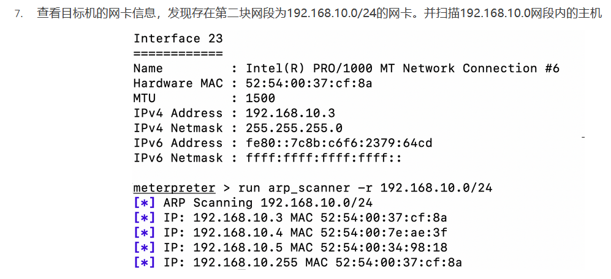
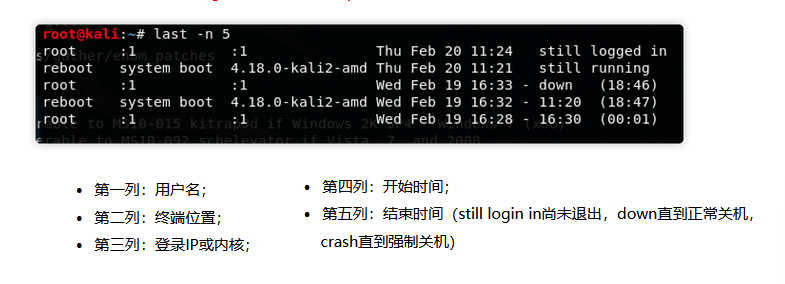

# 内网信息收集

##### 收集内容

* 内网基础信息

  * 网段信息：对渗透的内网进行拓扑、分区
  * 大小：了解整个公司的网络分布与组成，寻找内核业务
* 核心业务信息

  * OA系统、邮件服务器、网络监控系统等
* 其他

  * Windows主机
  * Linux主机

### 常用方法

#### 主动扫描

##### 使用ping命令

优点：方便，一般不会引起流量检测设备的报警

缺点：扫描速度慢，目标开启防火墙可能导致结果不准确

##### 使用nmap

	icmp扫描

```bash
	nmap -sn -PE -n -v -N result.txt 目标IP
参数说明：-sn 不进行端口扫描;-PE 进行icmp echo扫描;-n不进行反向解析;-v 输出调试信息;-oN 输出
```

	arp扫描

```bash
nmap -sn -PR -n -v 目标IP
-PR代表arp扫描，在内网中arp扫描速度最快而且准确率较高
```

##### 使用netDiscover扫描（arp扫描工具，可主动可被动嗅探）

```bash
netdiscover -i eth0 -r 目标ip
参数说明:-i:指定一个接口:-r:指定扫描范围
注意:netdiscover时间越久越精确，可以发现某一台主机在一段时间内介入了那些网段，从而发现其他新的网段地址
```

##### 用nbscan工具（快速扫描，同时获得netbios）

nbtscan -r 目标IP

‍

#### 常用端口和服务探测

内网拓扑架构分析：如DMZ、管理网、生产网、测试网

##### 扫描开放端口

nmap探测

nmap -Pn -n 目标IP地址

masscan扫描

masscan -p 端口号 目标IP地址 --rate=10000 #用10kps的速度扫描网络端口

##### 扫描操作系统

NSE脚本

nmap --script smb-os-discovery.nse -p 445 目标IP地址

smb-os-discovery.nse脚本通过smb来探测操作系统、计算机名、工作组名、工作组名、域名等等信息

‍

nmap -O IP地址 探测操作系统版本

扫描主机存在的CVE漏洞

nmap --scriptvuln 目标IP地址

#### 常见命令收集

|命令|说明|
| :--------------------------------------------------: | :----------------------: |
|net user|本机用户列表|
|net view|查询同一域内的机器列表|
|net localgroup administrators|本机管理员|
|net user /domain|查询域用户|
|net group /domain|查询域里面的工作组|
|net group “domain admins" /domain|查询域管理员用户组|
|net localgroup administrators /domain|登陆本机的域管理员|
|net localgroup administrators workgroup \user /add|域用户添加到本机|
|net group “Domain controllers"|查看域控制器|

Dsquery命令

|含义|命令|
| ------------------------| ---------------------------------------------------------------------------------|
|列出域中内所有机器名|dsquery computer domainroot -limit 65535 && net group"domain computers" /domain|
|列出该域内所有用户名<br />|dsquery user domainroot -limit 65535 && net user /domain|
|列出该域内网段划分<br />|dsquery subnet|
|列出该域内分组<br />|dsquery group && net group /domain|
|列出该域内组织单位<br />|dsquery ou|
|列出该域内控制器|dsquery server && net time /domain|

‍

##### 主要收集内容

系统管理员密码

其他用户的session，3389，ipc连接记录以及各用户回收站信息收集

浏览器密码和cookies的获取

windows无线密码获取

数据库密码获取

host文件，dns缓存信息

杀毒软件，补丁，进程，网络代理信息

共享文件夹，web服务器配置文件等

计划任务，账号密码策略，锁定策略

‍

## 后渗透信息收集

##### 工具

mimikatz

wce

getpass

QuarkPwDump

reg-sam

pwdump7

‍

#### Windows

##### cmdkey 

用于保存用户名和密码的凭证

命令：cmdkey /list

​​

获取方式：使用netpass.exe可得到密码

##### 回收站信息获取

进入回收站文件夹 ：`cd C:\$RECYCLE.BIN`​

该文件夹是隐藏文件夹，直接使用`dir /ah`​查看内容，a显示具有指定属性的文件，h代表隐藏文件

##### 获取无线网络密码

命令`netsh wlan export profile interface=WLAN key=clear folder=C:\`​

​​

​​

##### 获取浏览器的cookies和存储密码（Chrome为例）

存储位置

```bash
%localappdata%\google\chrome\USERDATA\default\cookies
%localappdata%\google\chrome\USERDATA\default\Login Data
chrome的用户信息保存在本地文件为 sqlite 数据库 格式
```

使用mimikatz读取内容

```bash
mimikatz.exe privilege::debug log "dpapi::chrome
/in:%localappdata%\google\chrome\USERDATA\default\cookies /unprotect"
```

##### IE浏览器的代理信息查看（wpad）

命令`reg query "HKEY_CURRENT_USER\Software\Microsoft\Windows\CurrentVersion\internet Settings"`​

‍

‍

##### metasploit收集

|作用|模块|
| ----------------------------| -------------------------------------------|
|获取目标主机的磁盘分区情况|post/windows/gather/forensics/enum_drives|
|判断目标主机是否为虚拟机|post/windows/gather/checkvm|
|查看开启的服务|post/windows/gather/enum_services|
|查看安装的应用|post/windows/gather/enum_applications|
|查看共享|post/windows/gather/enum_shares|
|查看目标主机最近的操作|post/windows/gather/dumplinks|
|查看补丁信息|post/windows/gather/enum_patches|
|导出多个信息|scraper|

##### 步骤实验

拿取到shell之后，查看当前权限，上传lazagne.exe，获取密码

* laZagne适用于获取存储在本地计算机上的大量密码的开源应用程序，LaZagne的作用就是找到常用的一些软件的密码

  命令：LaZagne.exe all >re.txt

查看re.txt-》获取adminstrator的哈希值和连接VPN的账号密码

上线msf生成远控，并使用mimikatz获取明文密码

```bash
load mimikatz
kerberos
```

​​

​​

#### Linux

##### history命令

显示历史执行命令，范围1000条命令，可在/etc/profile文件自定义HISTSIZE的变量值

history -c 命令清空所有命令的历史记录

可以使用"! 编码数字"的方式执行某一次命令

##### last命令

用于查看所有系统近期的登录记录，查看该程序的log，可以获知谁曾经或者企图连接系统

执行last命令，它会读取/var/log目录下的名为wtmp的文件，并把该文件记录的登录系统或终端的用户名全部显示

​​

##### arp信息

命令`arp -vn`​

可以聚类检查是否有超同组业务意外的arp地址

mac地址对应的ip是固定的，可以检查是否有mac和ip不一致的，如有就是arp欺骗

##### hosts文件

位置：`/etc/hosts`​

用于存储“域名/主机名到ip映射的关系”的数据

##### metasploit

|作用|模块|
| --------------------------| --------------------------------------|
|判断目标主机是否为虚拟机|post/linux/gather/checkvm|
|查看配置信息|post/linux/gather/enum_configs|
|查看网络|post/linux/gather/enum_network|
|查看共享|post/linux/gather/enum_protections|
|查看系统和用户信息|post/linux/gather/enum_system|
|查看目标主机最近的操作|post/linux/gather/enum_users_histroy|
|得到linux中的hash|post/linux/gather/hashdump|

‍
