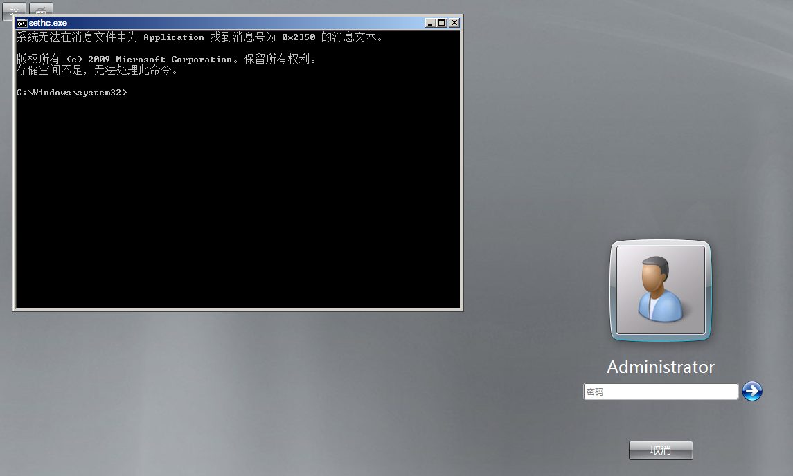
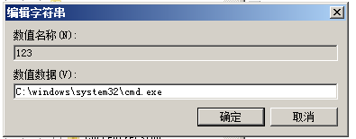

# Windows后门

> **常见后门**
>
> shift后门
>
> 启动项、计划任务
>
> 映像劫持
>
> 影子账户
>
> 远控软件

### shift后门-老方式

> 在winodws中有一些辅助功能，能在用户未登录系统之前就通过组合键来启动
>
> ‍
>
> Windows粘滞键
>
> * 5下shift键，Windows运行system32 的sethc.exe，启动粘滞键
> * c:\windows\system32\sethc.exe
> * ​​

‍

##### 原理

1. 把cmd.exe更名为sethc.exe，并且把原来的sethc.exe替换掉。
2. 在登录界面连续按下5次shift键后，系统会以system权限运行cmd.exe。
3. cmd.exe 就具有了管理权限，之后只要利用cmd增加一个管理员用户就可以登录进去，实现隐藏后门

##### 步骤

保存一个sethc.exe文件

```bash
move C:\WINDOWS\system32\sethc.exe C:\WINDOWS\system32\sethc.exe.bak
```

​​

替换

```bash
copy C:\WINDOWS\system32\cmd.exe C:\windows\system32\sethc.exe   //如果没指定生成的文件，会直接覆盖copy的第二个参数，相当于将第二个参数换成了第一个参数，但是文件外部名称没变
```

​​

‍

进入登录界面，5次shift键

​​

创建用户

```bash
net user gua 1qaz@WSX /add && net localgroup administrators gua /add
```

​​​

​​​

‍

在cmd窗口如果出现拒绝访问

​​​​

解决方法：需要将目录下的所有目录和文件、子目录下的所有者更改为管理员组（administrators）命令，

```bash
takeown  /f  c:\windows\system32\*.*  /a  /r  /d  y  # 获取整个文件夹及其下面子目录文件的所属权
cacls c:\windows\system32\*.* /T /E /G administrators:F # 将所有c:\windows\system32\目录下的文件、子文件夹的NTFS权限修改为仅管理员组(administrators)完全控制(删除原有NTFS权限设置)
```

‍

##### 防御

1. 禁用该 sethc.exe 功能 或者在 “控制面板”中关闭“连续按5次shift键时启用粘滞键选项
2. 使用权限约束 sethc.exe，使任何人都不能访问它

​​​​

‍

### 映像劫持 IFEO（Image File Execution Opions）

> 高版本的Windows版本中替换的文件收到了系统的保护，所以需要映像劫持
>
> 映像劫持，是为了一些在默认系统环境中运行时可能引发错误的程序执行体提供特殊的环境设定。由于这个项主要是用来调试程序用的，对一般用户意义不大，默认是只有管理员和local system有权读写修改

##### 步骤

1.注册新建一个项

注册表regedit

​`HKEY_LOCAL_MACHINE\SOFTWARE\Microsoft\Windows NT\CurrentVersion\lmage File Execution Option ​`​下添加一个项 seth.exe

2.创建sethc.exe 增加值 debugger

3.键值设置为恶意程序的路径

​​

​​​

##### 其中可以劫持的程序：

* 设置中心：C:\windows\system32\utilman.exe 快捷键：windows+U
* 屏幕键盘：C:\windows\system32\osk.exe
* 放大镜：C:\windows\system32\Magnify.exe 快捷键：windows+加减号

### 计划任务后门

> 计划任务后门分为<u>管理员权限</u>和<u>普通权限</u>
>
> * 计划任务在
>
> Windows7 及之前--》 at 命令
>
> Windows8 等高版本--》 schtasks 命令
>
> ‍
>
> * at命令是只会打开一个后台进程，而schtasks命令是将定时的任务在前台执行

‍

##### 步骤

```bash
schtasks  /create/tn "chrom" /tr cmd.exe /sc minute /mo 1    //每分钟执行一次cmd.exe
```

​

一分钟后弹窗

​​

### 注册表自启动后门

> 通过修改注册表实现自启动需要运行程序，和映像劫持类似
>
> 最常见的在指定键值添加一个新的键值类型为 REG SZ，数据项中添写需要运行程序的路径即可以启动

##### 步骤

打开注册表中HKEY_LOCAL_MACHINE/SOFTWARE/Microsoft/Windows/CurrentVersion/Run

​​

添加键值类型REG_SZ

​​

添加cmd路径即可

​​

cmd.exe 实现了开机后自动启动

​​

### 影子用户

> 影子用户顾名思义就是一个隐藏用户，只能通过注册表查看这个用户，其它方式找不到这个用户的信息  
> 影子账户可以获得管理员的权限，且不容易被发现

##### 步骤

创建隐藏用户

​​

通过注册表regedit

整体路径：计算机\HKEY_LOCAL_MACHINE\SAM\SAM\Domains\Account\Users\Names\Administrator

先给SAM权限当前用户的读取权限，重新打开

​​​​

修改`test$`​的权限为administrator的（将administrator的F复制给test$）

​​​​

将Names中的 test$ 和 对应的 Users 中的目录进行右键导出

​​

创建的隐藏账号test$删除

​​

双击导出的两个注册表就创好了

​​

‍
