# 日志分析

### Windows日志

> 1.事件日志
>
> 2.IIS日志
>
> 3.FTP日志
>
> 4.数据库日志
>
> 5.邮件服务日志

- Windows事件日志文件实际上是以特定的数据结构的方式存储内容，其中包括有关系统，安全，应用程序的记录
- 每个记录事件的数据结构中包含了9个元素(可以理解成数据库中的字段):日期/时间、事件类型、用户、计算机、事件ID、来源、类别、描述、数据等信息
- 日志存放在`C:\windows\system32\winevt\logs`
- 查看方法:`win+r -> eventvwr.msc`

****

#### 事件日志

- 分类:`应用程序日志`,`系统日志`,`安全日志`,`转发事件`
- 1.`应用程序日志`

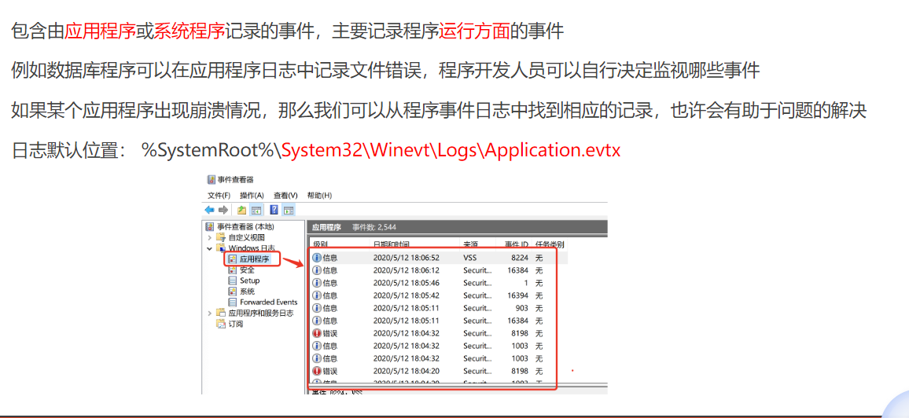

- 2.`系统日志`

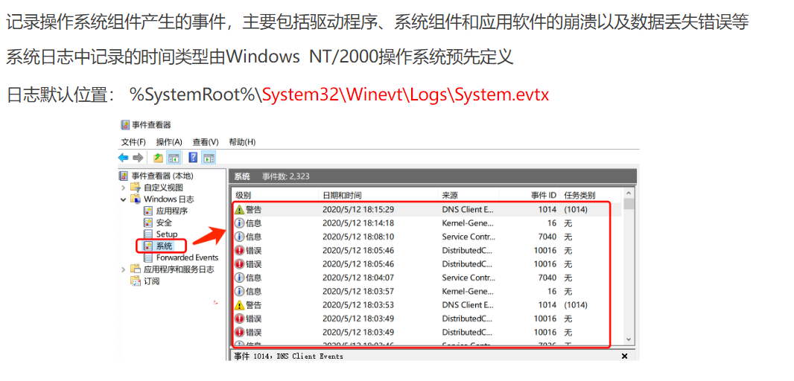

- 3.`安全日志`

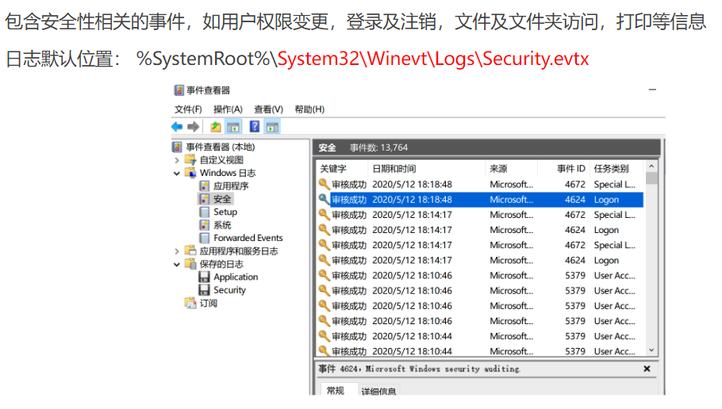

****

#### 常见事件日志分析

> 1.用户登录/注销事件
>
> 2.远程访问事件(RDP)
>
> 3.无线网络接入
>
> 4.USB移动介质插入或拔出


****

### Linux日志

> 1.内核及系统日志
>
> 2.用户日志
>
> 3.程序日志

- 日志默认保存位置:`/var/log/`

- 查看日志配置情况:`more /etc/rsyslog.conf`
- 定时任务相关日志:`var/log/cron`
- 打印信息日志:`/var/log/cups`
- 开机自检信息:`/var/log/dmesg`
- 邮件信息:`/var/log/mailog`
- 系统重要信息:`/var/log/message`
- 记录登录错误信息日志:`/var/log/btmp`
- 永久记录所有用户的登录:`/var/log/wtmp`
- 记录当前已经登陆的用户信息:`/var/log/utmp`
- 记录验证和授权信息:`/var/log/secure`
- 主配置文件:`/etc/rsyrslog.conf`和`/etc/rsyslog.d`

****

```bash
# 获取爆破本机ip的字典
grep "Failed password" /var/log/secure|perl -e 'while($_=<>){ /for(.*?) from/; print "$1\n";}'|uniq -c|sort -nr   

# 显示爆破本机ssh的ip
sudo grep "Failed password" secure | awk '{print $(NF-3)}' | sort | uniq -c | sort -nr

# 查看哪些成功登录的
grep "Accepted" /var/log/secure   
```


****


- 常见日志文件分析

  - 记录最后一次信息:`/var/log/lastlog`

  

- 登录用户的信息:`/var/log/utmp`-> `w`显示正在登录用户的信息


- 记录每个用户登录退出...信息:`/var/log/wtmp`


- 登录失败日志:`/var/log/btmp`


- 系统日志信息:`/var/log/messages`

```bash
# 仅看错误或告警信息
egrep -ri 'errorwarn' /var/log/messages
```

- 系统启动日志:`/var/log/boot.log`

```bash
# 查看
cat /var/log/boot.log
```

****

### 中间件日志

> 1.错误日志
>
> 2.访问日志
>
> 3.传输日志
>
> 4.Cookie日志

#### Apache日志分析

- 位置`/var/log/httpd/access_log`

- 查看ip

```bash
cat access_log | awk '{print $1}'
```


- 显示访问前10的ip地址

```bash
cat access_log | awk '{print $1}'|sort|uniq -c|sort -nr|head -10
```


- 显示指定时间后的日志

```bash
# 查看10月15号以后的日志
awk '$4 >= "[15/Oct/2024:00:00:00"' access_log
```

- 显示指定的ip连接情况

```bash
grep "2024:05" access_log | awk '{print $4}' | sort | uniq -c | sort -nr
```

- 查看指定ip做了什么

```bash
cat access_log |grep 192.168.2.1| awk '{print $1 "\t"$8"\t"$11}'| sort|uniq -c|sort -nr|more
```


- 查看最近访问量最高的文件

```bash
cat access_log |tail -n 10000|awk '{print $7}'|sort|uniq -c |sort -nr|more
```


****

#### IIS日志分析

- 日志文件默认位置
  - IS7.5:%SystemDrive%\inetpub\logs\LogFiles
  - lS6.0:%systemroot%\system32\logfiles\w3svc1\

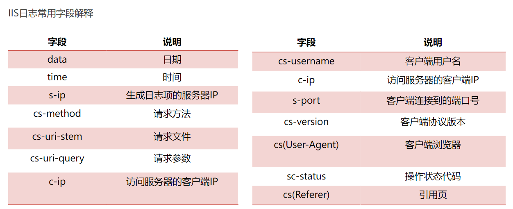

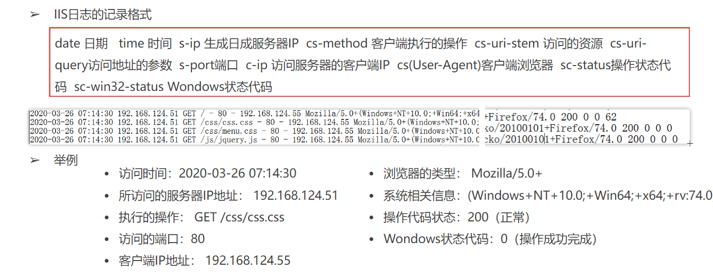

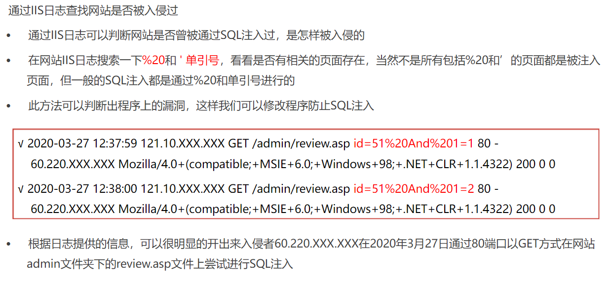

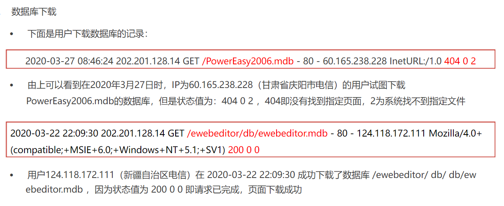

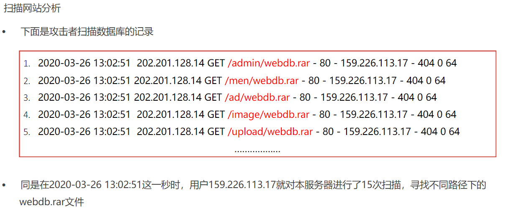

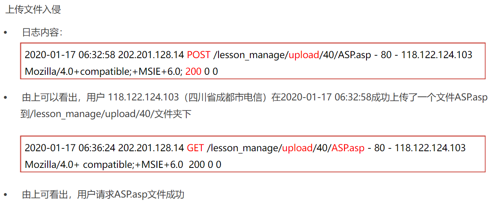

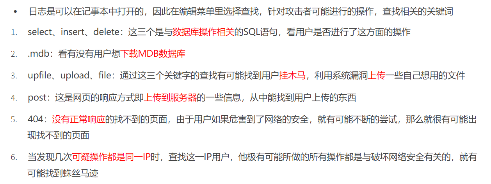

****

### 数据库日志

#### MySQL数据库日志

> 1.错误日志
>
> 2.查询日志
>
> 3.慢查询日志
>
> 4.二进制日志

- 通过命令查看错误的日志文件

```mysql
show global variables like '%log_error';
```


- 位置/etc/my.cnf

```bash
cat /etc/my.cnf
```


- 常见的`错误日志`


- `查询日志`

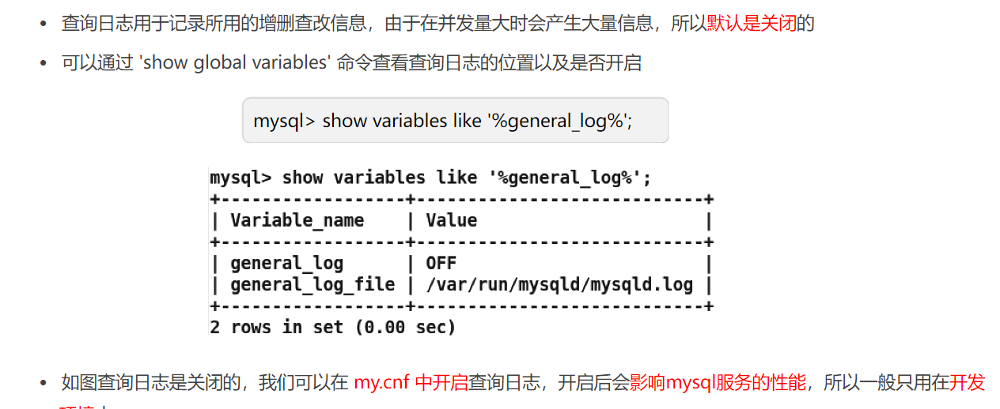

```mysql
# 查询日志是否开启
SHOW VARIABLES LIKE '%general_log%';
```


- 开启日志


- `慢查询日志`(防止盲注)

```sql
# 查看慢查询日志是否开启
show global variables like '%slow%';
```


- 开启慢查询日志

```sql
SET GLOBAL slow_query_log = 'ON';
SET GLOBAL slow_query_log_file = '/var/log/mysql/mysql-slow.log';
SET GLOBAL long_query_time = 2;
```


- `二进制日志`(用于记录修改数据或有可能引起数据改变的语句)

```bash
# 查询是否开启,位置 /etc/my.cnf
show variables like 'log_bin';
```


- 开启方式(没有实现)

```sql
[mysqld]
log_bin = mysql-bin    					 # 二进制日志文件路径和前缀
server_id = 1                          # 为 MySQL 实例分配唯一的 server_id
binlog_format = ROW                    # 日志格式，可以是 STATEMENT、ROW 或 MIXED
```

