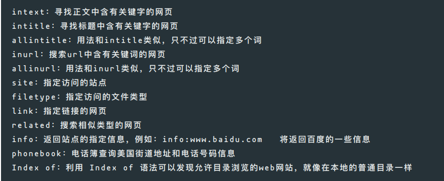

### 谷歌语法



#### 1. **site**

把搜索范围限定在特定站点中，如site：某某.com。用来搜索某个域名下的所有被搜索引擎收录的文件，适用于所有的搜索引擎。

```
site：baidu.com
```

#### 2. **domain**

查找跟某一网站相关的信息或反向链接，目前此指令只适用于百度，例如：在百度上提交搜索“`domain:www.mahaixiang.cn`”，所搜索的结果就的关于`www.mahaixiang.cn`网站的反向链接。

```
domain:www.mahaixiang.cn	//关于www.mahaixiang.cn网站的反向链接
```

#### 3. **link**

查询网站外链的搜索指令

```
Link:www.mahaixiang.cn
```

#### 4. **inurl**

inurl:指令用于搜索查询词出现在url中的页面，inurl指令支持中文和英文。

```
inurl:网络安全 		//url中包含关键字‘网络安全’
网络安全 inurl:research	//url中包含'research'的网络安全页面
```

#### 5. **and**

利用and表示前后两个关键词是“与”的逻辑关系.

```
渗透测试 and 网络工程		//同时包含
```

#### 6. **or**

利用or(|)表示前后两个词是“或”的逻辑关系。

```
渗透测试 or 网络工程	//包含渗透测试或者网络工程的网页
```

#### 7. **双引号（””）**

把搜索词放在双引号中，代表完全匹配搜索一个词，包括顺序。

```
"SEO博客"		
```

#### 8. **减号（-）**

减号代表搜索不包含减号后面的词的页面，使用这个指令时减号前面必须是空格，减号后面没有空格，紧跟着需要排除的词。

```
网络安全 -filetype:pdf		//排除pdf文档
Python -教程		//排除包含教程的页面
intitle:"云计算" -intitle:"AWS"	//排除标题包含AWS的云计算
```

#### 9. **星号（\*）**

星号是常用的通配符，也可以用在搜索中代表任何文字使用。

#### 10. **intitle**

intitle: 指令返回的是页面title中包含关键词的页面。

```
intitle:"网络安全"	
```

#### 11. **info**

提交info:url，将会显示需要查询网站的一些信息。

#### 12. **filetype**

filetype命令对搜索对象的文件类型做限制，冒号后是文档格式。限制查询结果仅返回特定文件类型的网页

```
密码 filetype:pdf		//返回包含关键字'密码'的pdf
```

| 文档格式                       |
| ------------------------------ |
| pdf、txt、doc、ppt、xls、rtf等 |