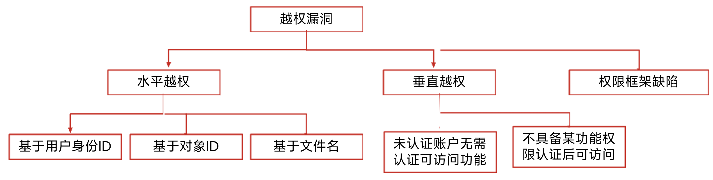
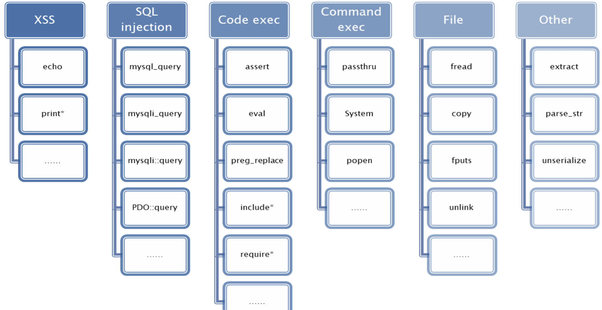
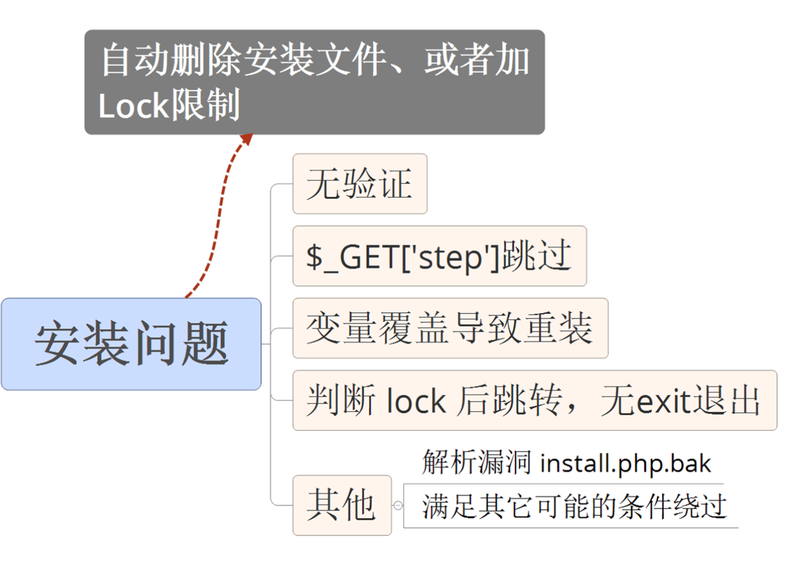
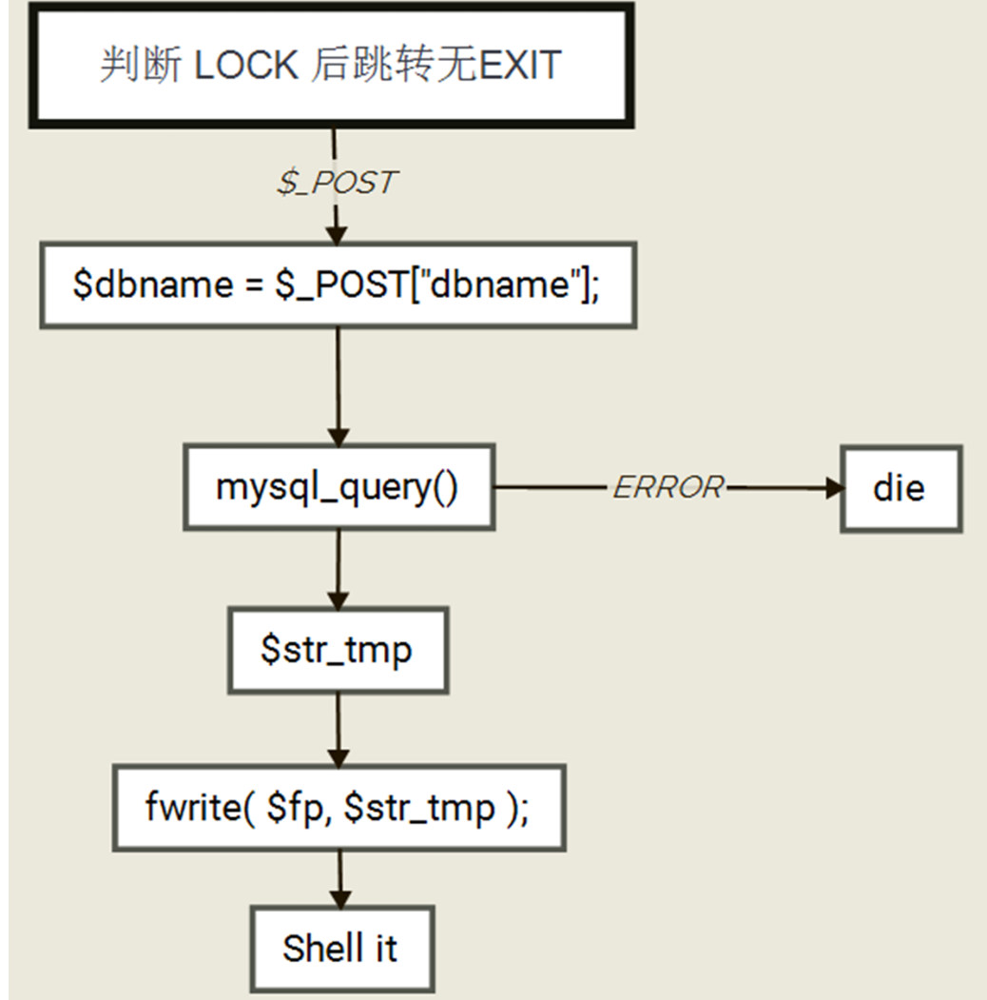
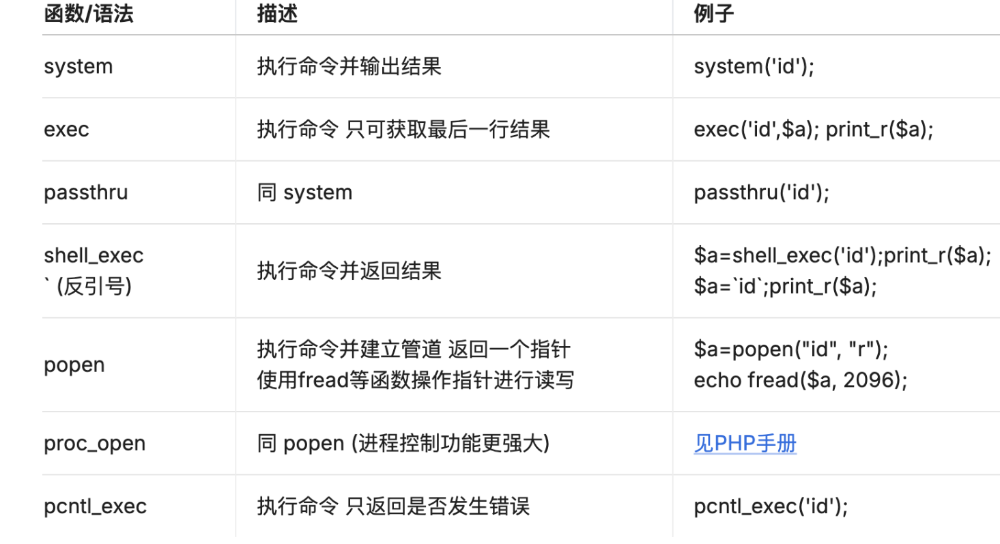

# 第一天

## 逻辑漏洞

### 	1. 业务逻辑漏洞

#### (1). 概述

##### a. 产生

* 由于程序逻辑不严谨或者太过复杂，导致一些逻辑分支不能正常处理或处理错误，统称为业务逻辑漏洞

##### b. 关注重点

* 业务流程
* HTTP/HTTPS请求分析

##### c. 常见漏洞

* **身份认证安全**、支付逻辑漏洞(数据篡改)、**任意密码找回**、验证码突破、接口调用安全、**未授权访问**、**权限绕过**

#### (2). 身份认证安全

* 有些网站对身份认证模块**没有做好安全防护**，导致漏洞产生

##### a. 暴力破解

###### ①测试方法

* 在没有验证码或者一次验证码可以多次使用时
  1. 爆破用户名：提示**用户名不存在时**
  2. 已知用户名：提示**输入密码错误**
  3. 使用一个常用密码：进行**密码喷洒**

###### ②修复方法

1. 增加验证码：使用复杂验证码，并且登录失败变换验证码
2. 限制登录频率：超过一定次数后锁定账户
3. 二次验证：添加手机验证码或邮箱验证码

##### b. 撞库

###### ①测试方法

* 通过手机互联网已泄露的用户和密码信息，生成**对应的字典**，**尝试批量登录其他**网站后，得到一系列可以登陆的用户，通过**部分用户多个网站使用同一个密码**的现象，**对其他网站**进行尝试登录

###### ②修复方法

##### c. 身份伪造

###### ①Cookie伪造

1. 测试方法
   1. 使用同一个账户登录，找到一个**可以证明身份**的页面
   2. 拦截刷新包，观察**Cookie值是否能修改**
   3. 数据包放行，页面显示为修改后信息，则存在该漏洞
2. 修复方法
   * 对客户端标识的用户信息采取**Session会话认证**

###### ②Session会话固定攻击

* 诱骗受害者使用**攻击者指定的Session Id**的攻击手段，利用了服务器的session不变的机制

1. 测试方法
   1. 攻击者通过某种手段(XSS、嗅探等)**重置用户的Session Id**，然后监听用户会话状态
   2. 目标用户携带攻击者设定的Session Id登录站点
   3. 攻击者通过Session Id获得合法会话
2. 修复方法
   1. 每次登陆成功后**重新生成Session**

##### d. 加密测试

* 有些网站在**前端加密**，然后传到**后台直接和数据库里面的值**作对比，这时抓包就知道加密方式，然后暴力破解

###### ①测试方法

* 用账号密码**登录，抓包**，查看是否通过**加密方式**对账号密码进行处理

###### ②修复方法

* 将加密**对比的方法**放到**后台去执行**

#### (3). 数据篡改

###### ①业务一致性

1. 手机号篡改
2. 邮箱和用户名篡改
3. 订单ID篡改
4. 商品编号更改
5. 用户ID篡改

###### ②业务数据安全

1. 金额数据篡改
2. 商品数量篡改
3. 最大数量限制突破
4. 本地JS参数篡改

### 2. 业务授权安全

* 授权是指是对**特定资源的读写权限**

#### (1). 未授权

* 用户**未通过认证授权**的情况，能够**直接访问需要通过认证**才能访问到的页面或信息

#### (2). 越权

* 开发人员在对数据进行操作时**对客户端请求的数据过分相信**而**遗漏了**权限的判定

##### a. 发生位置

1. 修改、重置、找回账户密码
2. 查看、修改其他账户未公开的信息，例如个人资料、文件、数据、程序等
3. 与账户关联的权限操作

##### b. 分类



##### ①水平越权

* 相同权限的不同用户可以互相访问

###### ②垂直越权

* 权限低的用户可以**访问权限较高**的用户，或者权限较高(非管理员)用户可以查看大量低权限用户详细信息

##### c. 检测

1. 查看所有涉及到账户操作是否有**除了UID之外的验证**方式，没有则构造UID(username,email,userid等)访问
2. 如果有**验证参数**，能**预知或猜取**，则存在漏洞

##### d. 修复

1. 所有涉及到用户信息的操作需要**验证用户身份**
2. 特别敏感的操作应该进行**二次验证**

# 第二天

## 逻辑漏洞

### 1. 业务逻辑漏洞

#### (1). 任意密码找回

##### a. 用户凭证暴力破解

* 常见的是找回密码的验证码是**4位**，并且**服务器没有加以限制**，我们可以通过**爆破出验证码**的方式来找回密码

###### ①测试手法

1. 验证码的位数：``4 or 6``，验证码有效时间``1min - 15min``
2. **验证码爆破**防护绕过

###### ②修复建议

1. 增加验证码**复杂性和长度**
2. **限制**请求**修改次数**

##### b. 返回凭证

###### ①形式

1. url返回凭证
2. 抓包返回凭证
3. 凭证在页面中

###### ②测试方法

1. url返回凭证：使用Firefox的firebug**查看请求链接**，看链接中是否有验证码登密码找回凭证
2. 抓包直接返回：根据手机号找回密码后**抓包**，验证码直接或加密显示在``verifycode=xxx``中
3. 在页面中：通过密保问题找回密码**，查看源码**，问题和答案就在源码中显示

##### c. 邮箱弱token

###### ①Unix时间戳+MD5

* 发现邮箱中重置密码的链接，有字符串被md5加密，解密后类似于1491293277(**10位数字**)，判断为**Unix时间戳**
* 重置他人密码只需要用他人邮箱发送**重置密码邮件**，在短时间内对**Unix时间戳暴力破解**，即可获得重置密码的链接

###### ②用户名

* 重置密码链接直接使用**用户名进行区别**，改变用户名即可更改他人密码

###### ③服务器时间

* 利用两个账号同时点击找回密码，去邮箱查看找回密码的链接，发现随机token只相差1-2，即考虑为服务器时间。
* 利用**一个未知账号**和**一个已知账号**，**同时点击**找回密码，稍微**遍历随机token**，即可构造出未知密码的找回链接

##### d. 用户凭证

###### ①短信验证码

1. **通过他人手机号**找回密码，抓包，将他人手机号**替换成自己的手机号**，获取验证码，提交后即可修改他人密码
2. 通过自己手机号找回密码，抓包，将数据包中的username替换成他人用户名，提交后即可修改他人密码

###### ②邮箱token

* 通过邮箱找回密码，访问链接重置密码，输入**新密码提交时抓包**，虽然有token，但任然可以直接修改用户ID进而修改密码

##### e. 重新绑定

###### ①手机绑定

1. 给已知账户绑定手机，发现**绑定手机的URL链接中有uid参数**，**修改uid参数为他人**，即可实现将他人账户绑定上自己手机号，从而实现修改密码
2. **修改个人资料处抓包**，修改**userid为他人，修改手机号为自己**，即可实现将他人账户绑定上自己手机号，从而实现修改密码

###### ②邮箱绑定

* 通过邮箱找回密码，U**RL链接中修改用户ID为他人**，邮箱不变，之后通过链接将他人账户绑定为自己的邮箱，从而实现修改密码

##### f. 服务器验证

###### ①最终提交步骤

* 使用邮箱找回密码，通过**链接到达修改密码页面**，修改密码后提交、抓包，获得**UID参数并修改为他人**，从而实现修改密码

###### ②验证逻辑为空

* 通过密码保护问题找回密码，抓包，将**密保问题删除，直接修改密码**，提交(**密保问题和新密码在同一页面**)

##### g. 跳过验证

1. 密码找回页面，先**记住最终修改密码的URL**，再使用他人用户名进行密码找回，但**直接跳转**至最终页面，实现修改密码
2. 修改密码页面抓包，修改其中的`username_cookie`为其他用户，或是将`step`**修改为最终步骤**,从而跳过验证步骤

##### h. 本地验证

1. 本地服务器**直接通过**服务器返回的**状态码**进行判断是否成功跳转
2. .发送短信等**验证信息**的动作**在本地执行**，可以通过**修改request**包进行控制

##### i. token可控

###### ①实例

1. 通过邮箱找回密码，抓包查看提交验证码后的返回数据，有加密字符串，但和后面重新设置新密码URL连接中的加密字符串一样，所以可以利用该加密字符串
2. 根据上面提交验证码的抓包，**修改User**为其他用户(可能存在md5加密)，发送，就可以**返回其他用户的加密字符串**
3. 重新返回到找回密码首页，利用**其他用户找回**，在输入验证码处直接**修改URL链接，加入加密字符串**，可以直接绕过验证码

##### j. 注册覆盖

* 注册**重复的用户名**，能够注册成功，相当于修改了密码

##### k. Session覆盖

* 同一浏览器，首先输入**自己的账户**进行邮箱密码找回，**进入邮箱查看链接**，接着输入**他人账户**，进行密码找回，**返回**刚刚**自己的邮箱点击链接**，由于**Session覆盖**导致了，这个**链接成为了修改他人密码的链接**，从而修改他人密码

#### (2). 验证码突破

##### a. 暴力破解验证码

###### ①方法

1. 有的验证码输入正确一次，在一定的时间内不用再次输入
2. 有的验证码输入正确一次，会在session中设定一个值，告诉用户你已经通过了验证码验证
3. 逻辑颠倒，先对比账号密码是否正确，在对比验证码是否正确

###### ②修复建议

1. 提要验证码的长度、复杂度
2. 限制错误登录次数、有效时间

##### b. 时间、次数突破

* 重复提交携带验证码的数据包，查看返回包，判断次数

###### ①测试方法

* 抓取正确登录信息的数据包**，重复提交该数据包**，查看是否登录成功，登陆成功则存在验证码重复使用问题

##### c. 回显测试

* 验证码直接由客户端生成，在回显中显示，可通过浏览器工具直接查看

###### ①测试方法

1. 在源码中显示：源代码审计
2. 在Cookie中显示：抓包时分析Cookie中是否有验证码

##### d. 绕过测试

* 逻辑设计缺陷，比如**直接删除COOKIE或验证码参数**可绕过，当**验证不通过清空session**时，**验证码参数为空**时绕过等

###### ①测试方法

1. 抓包，删除验证码字段看是否可以成功发送
2. 正常流程中记录验证码后的数据包，替换目标中的内容，直接发送，查看是否可以直接绕过验证码

#### (3). 接口调用安全

##### a. 重放攻击

* 在**短信、邮件调**用业务或**生成业务**数据环节中(短信验证码、邮件验证码、订单生成、评论提交等)，对其业务环节进行**调用(重放)测试**

###### ①分类

* 短信轰炸
* 恶意注册

###### ②修复

1. 对评论提交等操作**采用验证码机制**，防止生成数据业务被恶意调用
2. 短信/邮件接口，需要**对接调用频率进行控制**或者上限限制
3. 每一个订单(接口访问)使用**唯一的token**，提交一次后token失效

##### b. 内容编辑

* 点击获取短信验证码，**抓包可以修改短信内容**，实施下一步攻击

###### ①修复

* 从客户端获取手机号、邮箱等账号信息，要与Session中的凭证进行核验，验证通过后才允许进行业务操作

##### c. 接口调用遍历

* 通过接口**传入id参数，返回对应id的信息**，如果接口请求**合法性校验不严**，很容易出现**非授权访问或越权访问**

###### ①修复

1. 在session中存储当前用户的凭证或id，只有**传入凭证或id值与session一致时**才返回结果
2. 涉及**身份校验的接口，不要直接明文传输**，可以将敏感信息在服务端关联到用户标识ID，在客户端保存用户标识ID并提交到服务端，服务端根据ID取出对应信息后进行校验

##### d. 接口未授权

* 敏感功能的接口需要对访问者的身份进行验证，验证通过后才允许调用此接口。若接口未做身份验证或校验不严，可能会导致非授权访问或者越权调用

###### ①修复

1. 采用**Token一次性校验**的方式，只有Token验证通过才返回接口数据
2. 接口被调用时，服务端**对会话状态进行验证**，如果已登录则返回接口数据，否则返回自定义错误信息
3. **未授权访问接口做session认证**，并对用户访问的**每一个URL做身份鉴别**，正确的校验用户id及token等
4. 服务器端需**校验身份唯一性**，访问**接口来源验证**，不同身份只能增删改查自己的信息

# 第三天

## 代码审计

### 1. 概述

#### (1). 含义

* 根据应用程序源代码，从结构、脆弱性以及缺陷等方面进行审查，最终输出代码审计报告，完善应用程序，提高自身安全水平

#### (2). 优点

1. 发现更多**隐蔽的**安全漏洞
2. **企业合规性**要求
3. 提高企业整体**安全水平**
4. 提高企业**安全开发编码规范**

#### (3). 相关配置

##### a. php.ini

* php的默认选项配置表，可以更改

##### b. configuration

* 配置可被设定的范围

#### (4). 工具

##### a. 辅助工具

1. Notepad++编辑器
2. Seay源码审计系统

##### b. 其他工具

1. UltraEdit
   * 轻量级代码编辑器，支持十六进制查看及编辑，可**直接修改exe等文件**，支持打开大文件，可直接执行代码
2. ZendStudio
   * 内置一个强大的**php代码调试**工具，代码**提示功能强大**，支持6种以上语言。
3. RIPS(代码审计工具)
   * 使用简单，可以**自动生成漏洞利用payload**
   * http://rips-scanner.sourceforge.net/
4. Burpsuite
5. 浏览器扩展
6. 编码转换及加解密
   * seay代码审计系统**自带编码**，burp的Decoder功能
7. 正则调试功能
   * seay、灵者正则调试

#### (5). 流程

1. 获得源码
2. 安装环境
3. 查看网站结构
   * 了解该程序的大致目录
4. 查找程序入口
   * 了解程序的业务逻辑
5. 寻找配置文件
   * 类似于config.php的文件，保存数据库相关信息,查看**数据库编码方式**(宽字节注入)以及变量**引用方式**(双引号执行)
6. 过滤功能
   * 通过**公共函数**文件和**安全过滤**等文件，了解过滤位置、绕过方式、过滤方式(GPC、正则、替换、addslasher)

#### (6). 方法

1. 通读源码
   * 应用文件结构 => 关键文件代码 => 配置文件 => 首页文件 => 入口文件 => 功能审计
2. 定向功能分析法
   * 分析程序有哪些功能，**根据功能**进行漏洞检测与测试
3. 敏感函数参数回溯

#### (7). 配置项和危险函数

##### a. 配置项

* **php.ini**配置项规定了**各种环境的条件**

| 模式           | 设定范围                                          |
| -------------- | ------------------------------------------------- |
| PHP_INI_USER   | 用户脚本(例如ini_set())、注册表(5.3起)、.user.ini |
| PHP_INI_PERDIR | php.ini、.htaccess、httpd.conf                    |
| PHP_INI_SYSTEM | php.ini、httpd.conf                               |
| PHP_INI_ALL    | 可在任何地方设定                                  |

##### b. 常见配置

###### ①register_global

1. 作用
   * 设定全局变量的自动注册，**默认关闭**
2. 版本特性
   * 自5.3.0废弃，5.4.0移除，5.2.0中默认开启

3. 配置影响

   * **变量覆盖漏洞**，既可以成为下文**绕过身份认证**的方法，也可以突破其他已保护的变量**产生新漏洞**，如sql注入

4. 不安全实例

   ```php
   <?php
   	$username=$_GET['username'];
   	$password=$_GET['password'];
   	if(($username==='admin')&&($password==='123456')){
         $authorized=true;//可以通过[URL]?authorized=1,直接传入authorized变量的值进行覆盖从而任意用户登录
       }
   ?>
   ```

###### ②safe_mode

* 相似配置还有：safe_mode_exec_dir、disable_classes=、disable_functions=fopen、unlink

1. 作用

   * 禁用了php的一些危险的内置函数，如system、exec等，**默认关闭**

2. 版本特性

   * 自5.3.0废弃，5.4.0移除

3. 配置影响

   * 在找到**可执行命令**时，可以**先检测环境的配置**

4. 不安全实例

   ```php
   <?php
   	$commend=$_GET['commend'];
   	system("{$commend}");
   ?>
   ```

###### ③display_error

1. 作用

   * 将显示php产生的错误，**默认开启**

2. 版本特性

   * 在php中默认开启，但是真实的站点发布后一般是关闭的

3. 配置影响

   | 报错设置项            | 含义                                       |
   | --------------------- | ------------------------------------------ |
   | error_reporting=E_ALL | 将错误级别显示为最高                       |
   | error_log= [path]     | 自定义错误日志的位置，必须对web用户可写入  |
   | log_errors=on         | 将错误日志输出到文件，而不是直接输出到前端 |

4. 不安全实例

   ```
   站点关闭后未关闭display_error，呢么就会暴露服务器的目录信息，增加sql注入的风险
   ```

##### c. 危险函数




### 2. 安装漏洞审计

#### (1). 概述

* 一般php程序都有一个初始安装的功能，可能有以下漏洞

  1. 无验证功能，任意重装覆盖

  2. $_GET['step']跳过限制步骤

  3. 变量覆盖导致重装

  4. 判断lock后跳转无exit

  5. 解析install.php.bak漏洞

  6. 其他特定功能绕过漏洞

     

#### (2). 审计思路

1. 定向功能分析法，直接从安装问题找漏洞

2. 判断Lock后面有没有exit()，如果没有，看代码重装部分有什么漏洞

   

### 3. 命令注入漏洞

#### (1). 分类

1. 可以直接传入命令执行并返回结果
   * system()、exec()、shell_exec()、passthru()、反引号
2. 可以传入命令执行，但无结果返回
   * popen()、proc_open()
3. 需要开启pcntl扩展
   * pcntl_exec()

#### (2). 函数作用



#### (3). 多命令执行语法

#### 

```php
<?php
//1. system，自带输出
if(isset($_GET['cmd'])){
    $cmd= $_GET['cmd'];
    system($cmd);
    echo '<br><br>';
}
//2. exec，无输出，且仅输出最后一行
if(isset($_GET['cmd'])){
    $cmd= $_GET['cmd'];
    print exec($cmd);
    echo '<br><br>';
}
//3.shell_exec，无回显
if(isset($_GET['cmd'])){
    $cmd= $_GET['cmd'];
    echo shell_exec($cmd);
    echo '<br><br>';
}
//4. passthru，直接将结果输出
if(isset($_GET['cmd'])){
    $cmd= $_GET['cmd'];
     passthru($cmd);
     echo '<br><br>';
}
//5. popen，返回一个文件指针
if(isset($_GET['cmd'])){
    $cmd= $_GET['cmd'].">>1.txt";
     popen($cmd,'r');
     echo '<br><br>';
}
//6. 反引号，原理是调用的shell_exec函数
if(isset($_GET['cmd'])){
    $cmd= $_GET['cmd'];
    print `$cmd`;
    echo '<br><br>';
}
?>
```

#### (3). 多命令执行语法

##### a. windows

| 命令格式                 | 含义                                           |
| ------------------------ | ---------------------------------------------- |
| command1**&**command2    | 先后执行，无论command1是否成功                 |
| command1**&&**command2   | 先后执行，command1成功，才执行command2         |
| command1**\|\|**command2 | 先后执行，command1失败，才执行command2         |
| command1**\|**command2   | \|是管道符，将command1的执行结果传递给command2 |

##### b. Linux

| 命令格式                 | 含义                                       |
| ------------------------ | ------------------------------------------ |
| command1**;**command2    | 先后执行，无论command1是否成功             |
| command1**&&** command2  | 先后执行，command1成功，才执行command2     |
| command1**&**command2    | 先执行command1并放置后台，在执行command2   |
| command1**\|\|**command2 | 先后执行，command1失败，才执行command2     |
| command1**\|**command2   | 管道符，将command1的执行结果传递给command2 |

#### (4). 审计思路

搜索目标函数 => 分析过滤 => 构造恶意字符串 => 执行 => 根据返回值判断 
