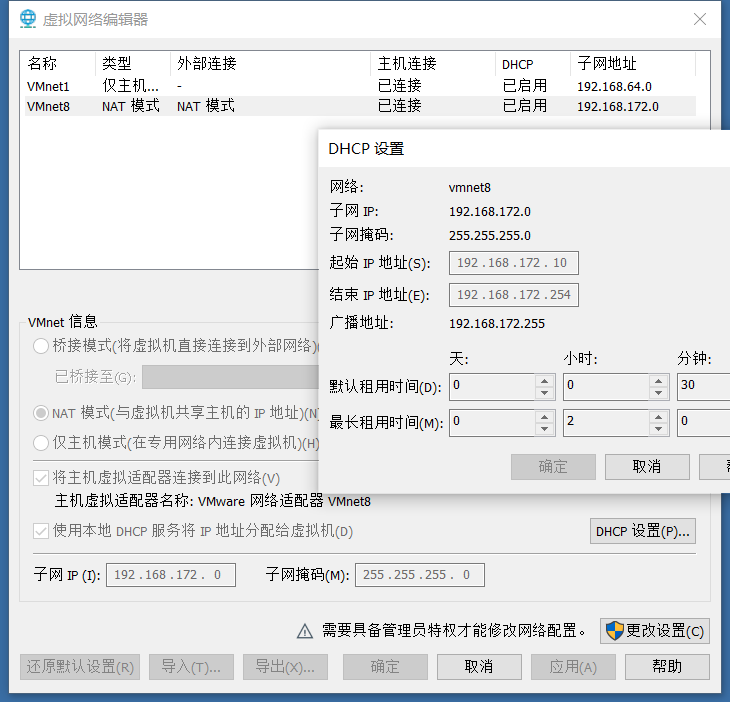

### 上午

#### 1 .三种网络模式

* 桥接模式：与主机位于同一网段，可同外界进行通讯，适用于设备数较少的情况(即<254)
* NAT转换模式：与主机位于不同网段，可同外界进行通讯
* 主机模式：只能和主机进行通讯

#### 2.克隆

* **链接克隆**——>基于源机器引用操作，储存占用少
* 完整克隆——>完整复制一份，储存占用大

#### 3.快照

* 保留当前的生产状态或环境

#### 4.导入\导出 

vmware导出的为ovf格式文件

#### 5.Linux基本操作

*  使用指令

  | 指令名 | 含义                      |
  | ------ | ------------------------- |
  | cat    | 查看文件内容              |
  | vim    | 使用vim编辑器模式打开文件 |

* vim使用

  1. 一般模式：正常进入vim即为一般模式

  2. 编辑模式：键入 a、i、o  进入，按ESC退出

  3. 命令模式：键入 :   进入，按ESC退出

     * 命令模式常用指令

       | 指令名 | 含义             |
       | ------ | ---------------- |
       | :wq    | 保存并退出       |
       | :q！   | 强行退出且不保存 |
       | :w     | 保存当前修改     |
       | :q     | 退出当前文件     |

       基本信息

       兴趣爱好——令人认识

       分享印象深刻的事情——培养讲故事的能力

       本人座位：12号

### 下午

#### 1. 配置静态IP地址

* 改网关配置文件

  1. 使用root权限输入vim /etc/sysconfig/network-scripts/ifcfg-ens33并修改或添加以下内容

     ```
     BOOTPROTO="static"
     ONBOOT="yes"
     GATETAY=192.168.172.2
     IPADDR=192.168.172.100
     NETMASK=255.255.255.0
     DNS1=114.114.114.114
     DNS2=8.8.8.8
     ```

  2. 使用root权限输入vim /etc/sysconfig/network并添加以下内容

     ```
     NETWORKING=yes
     GATEWAY=192.168.172.2
     ```

* 改DNS配置

  

* 重启网络服务设置

  ```
  使用root权限输入systemctl restart network.service
  ```

#### 2. 打开远程桌面连接

* win+R输入mstsc 打开远程桌面
* 输入要连接电脑的IP地址、账户名和密码

#### 3. windows相关命令

* net user [用户名] [要修改的密码](建议为A1B2C3..)
* whoami ：在当前条件下的用户是谁
* who i am：最初条件下的用户是谁

#### 4. 各系统的ip地址

* Centos：192.168.172.100
* WindowsServer2008:192.168.172.150

#### 5.安装WindowsServer2008流程

1. 安装镜像

2. 安装驱动器D

   * 手动安装

   * 指令安装

     Device Install Service

     Device Setup Manager

3. 分配静态IP

4. 关闭防火墙

   * 手动关闭

   * 指令关闭

     systemctl stop firewalld

     systemctl disable firewalld

5. 在开始菜单的计算机选项右键菜单的属性中开启允许远程控制选项

6. 安装安全补丁

7. 重启，在虚拟机设置里将CD和软盘切换为自动检测

8. 安装VMWareTools