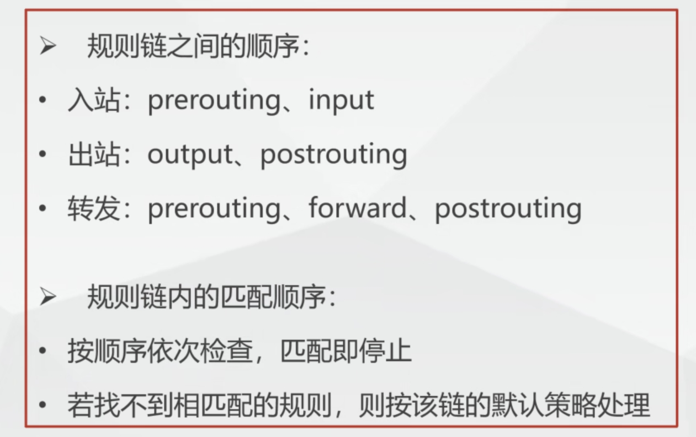

## 上午

### 1. iptables防火墙

#### 1. 含义

* 不是真正的防火墙，而是客户端代理

#### 2. 结构

*  iptables -> tables -> chains -> rules

* 规则链

  | 链名        | 说明         |
  | ----------- | ------------ |
  | input       | 入站数据过滤 |
  | output      | 出站数据过滤 |
  | forward     | 转发数据过滤 |
  | prerouting  | 路由前过滤   |
  | postrouting | 路由后过滤   |

* 

#### 3. 语法

```
iptables -t filter -I INPUT -p icmp -j REJECT
```

#### 4. 参数

* -p 指定协议类型，例如tcp、udp、icmp

* -j 数据包常见控制类型

| 参数   | 含义                       |
| ------ | -------------------------- |
| ACCEPT | 允许通过                   |
| REJECT | 拒绝通过，必要时会给出提示 |
| DROP   | 直接丢弃，不予回应         |
| LOG    | 记录日志信息               |

* -t 指定表
* -I 在链的开头或指定序号，插入一条规则
* -m 表示启用扩展功能，一般与-p配合使用
* -d 指定IP地址
* --deport 知道目的端口
* -D 删除链内指定序号的一条规则
* -F 里清空所有规则

注意：

1. 不指定表名时，默认指filter表
2. 不指定链名时，默认指表内所有链
3. 选项、链名、控制类型使用大写字母，其余小写字母

#### 5. 规则查看

* -L 列出所有规则条目
* -n 以数字形式显示地址、端口信息
* -I 以更详细的方式显示规则信息

* 指令

```
iptables -t filter -I OUTPUT -p icmp -j REJECT  //通过ping命令
iptables -n -L OUTPUT  //查看OUTPUT链
iptables -n -L INPUT  //查看INPUT链
iptables -D OUTPUT 1  //删除output链第一条规则
```

### 2. Linux操作命令

#### 1. 常用指令

| 指令     | 含义                                                         |
| -------- | ------------------------------------------------------------ |
| pwd      | 显示当前目录                                                 |
| hostname | 显示当前主机名及用户名                                       |
| whoami   | 显示当前用户                                                 |
| halt     | 立刻关机(需要root权限)                                       |
| poweroff | 立刻关机                                                     |
| shutdown | -c：取消前一个关机指令 -h：关机 -r：重启(后可跟24时制，分钟，now) |
| init     | 0：关机，3：纯文本模式，5：图像模式，6：重新启动             |

#### 2.文件操作指令 

##### 	1. cd

* 切换指令

```
cd ~  //进入用户家目录
cd ~用户名  //进入用户家目录
cd -  //进入上次所在目录
```

##### 	2. ls

* 显示目录下的文件

| 参数 | 含义               |
| ---- | ------------------ |
| la   | 全部列出，包括隐藏 |
| lR   | 递归且列表列出     |
| ll   | 列表列出文件       |

##### 	3. mkdir

* 创建文件夹

```
mkdir -p test1/test2
mkdir -m=777 test  //赋予test文件夹777权限
rmdir test  //删除文件夹
```

##### 	4. touch

* 创建或修改文件

| 参数   | 含义                                                         |
| ------ | ------------------------------------------------------------ |
| **-a** | **修改访问时间**                                             |
| **-c** | **修改时间参数(状态修改时间、访问时间、数据修改时间)**       |
| **-d** | **后跟预修订的日期(只修改访问时间、数据修改时间，状态修改时间变更为当前服务器时间)** |
| -m     | 只修改数据修改时间                                           |
| -t     | 后跟预修订访问时间及状态修改时间(YYMMDDhhmm)                 |
| **-r** | **复制指定文件的时间戳给新文件 touch -r 1.txt test.txt**     |

##### 	5. stat

* 查看文件状态

##### 	6. cat

```
cat test1.txt  //查看test1.txt内容
cat test1.txt test2.txt > test3.txt将test1.txt和test2.txt的内容合并且覆盖显示到test3.txt中 
```

##### 	7. rm

| 参数 | 含义     |
| ---- | -------- |
| -f   | 强制删除 |
| -i   | 提示删除 |
| -r   | 递归删除 |

##### 	8. more

##### 	9. head

| 参数        | 含义                |
| ----------- | ------------------- |
| -n K        | 显示前K行，默认10行 |
| -c K        | 显示前K字节         |
| -v [文件名] | 显示文件名          |

##### 	10. tail (同head)

创建文件方式

```
1. touch test.txt
2. echo "hello,world" > test.txt
3. cat > test.txt
```


## 下午

### 1. 常用

#### 1. grep

| 参数   | 含义                       |
| ------ | -------------------------- |
| **-c** | **列出包含内容的行数**     |
| **-w** | **把包含内容作为字符查找** |
| -i     | 忽略大小写                 |
| -l     | 列出带有匹配行的文件名     |
| **-n** | **列出行号**               |
| **-v** | **列出没有匹配的行**       |

#### 2. Linux命令行快捷键

| 操作    | 含义                                         |
| ------- | -------------------------------------------- |
| ctrl +U | 清空至行首                                   |
| ctrl +K | 清空至行尾                                   |
| ctrl +L | 清屏                                         |
| ctrl +C | 中断执行                                     |
| ctrl +Z | 后台挂起(jobs列出作业,fg %[数字] 开启作业几) |
| ctrl +D | 退出Shell                                    |

#### 3. tar

| 参数   | 含义                                  |
| ------ | ------------------------------------- |
| **-c** | **将多个文件或目录打包 (打包时用)**   |
| **-f** | **指定压缩后的文件名**                |
| -v     | 显示打包或解包具体过程(可视化)        |
| -t     | 只查看tar包中有那些文件或目录         |
| **-x** | **解包.tar文件**                      |
| **-z** | **打包同时压缩(打包文件常跟后缀.gz)** |

* 打包目录时，-cf必不可少，其余可选择

```
tar -vcf test.tar test  //将test目录打包成test.tar
```

#### 4. zip

| 参数   | 含义                     |
| ------ | ------------------------ |
| **-r** | **递归**                 |
| -m     | 压缩文件后，删除原始文件 |
| -v     | 可视化                   |
| -d     | 删除压缩包里面的某项文件 |
| -u     | 往压缩包里面添加新文件   |
| -q     | 压缩时不显示命令执行过程 |

* 打包目录时，-r必不可少

```
zip -vr test.zip test //将test目录打包为test.zip
```

#### 5. unzip

| 参数     | 含义                        |
| -------- | --------------------------- |
| **-d**   | **指定解压目录**            |
| -n       | 不覆盖已存在文件            |
| -l       | 显示压缩包内容              |
| -v       | 显示压缩包更多数据          |
| -t       | 检测是否损坏                |
| -x a.txt | 解压文件，但不解压a.txt文件 |

```
unzip test.zip  //将test.zip解压
```

#### 6. find

* 路径

  | 参数 | 命令          |
  | ---- | ------------- |
  | ~    | 表示$HOME目录 |
  | .    | 表示当前目录  |
  | /    | 表示根目录    |

* 选项

  | 参数      | 命令                               |
  | --------- | ---------------------------------- |
  | **-name** | 按照名字查找  可用通配符*来查找    |
  | -operm    | 安装权限查找                       |
  | -prune    | 不在当前指定目录寻找               |
  | **-user** | 文件属主来查找                     |
  | -group    | 文件所属组来查找                   |
  | -nogroup  | 查找无有效所属组的文件(后不跟参数) |
  | -nouser   | 查找无有效属主的文件(后不跟参数)   |
  | -type     | 按照文件类型查找                   |

#### 7. 连接SSH

```
ssh 用户名@ip地址
ssh root@192.168.172.150
```

#### 8. Vim使用

* 输入模式

| 按键              | 作用                |
| ----------------- | ------------------- |
| Page Up/Page Down | 向上/向下翻页       |
| 退格键Backspace   | 删除光标前一个字符  |
| DEL               | 删除光标后一个字符  |
| Home / End        | 移动光标到行首/行尾 |
| Insert            | 输入/替换模式切换   |

* 一般模式

  1. 光标移动方法

     | 按键      | 作用            |
     | --------- | --------------- |
     | Ctrl + f  | 相当于Page Down |
     | Ctrl + b  | 相当于Page Up   |
     | 0 / Home  | 移动到行首      |
     | $ / End   | 移动到行尾      |
     | G         | 移动到文件尾    |
     | gg        | 移动到文件首    |
     | n + Enter | 光标向下移动n行 |

  2. 搜索替换

     | 按键  | 作用                   |
     | ----- | ---------------------- |
     | /word | 向光标下寻找字符"word" |
     | ?word | 向光标上寻找字符“word” |
     | n     | 重复前一个搜寻动作     |
     | N     | 反向进行前一个搜寻动作 |

     

  3. 删除、复制与粘贴

     | 按键      | 作用                                    |
     | --------- | --------------------------------------- |
     | x / X     | 相当于Del / Backspace                   |
     | dd        | 删除当前行                              |
     | ndd       | 删除光标向下n行                         |
     | yy        | 复制当前行                              |
     | nyy       | 复制光标向下n行                         |
     | p / P     | 粘贴在光标下一行 / 上一行               |
     | u         | 复原前一个动作，相当于Windows的ctrl + z |
     | Ctrl + r  | 重做上一个动作，相当于Windows的ctrl + y |
     | .(小数点) | 重复上一个动作                          |


​	
