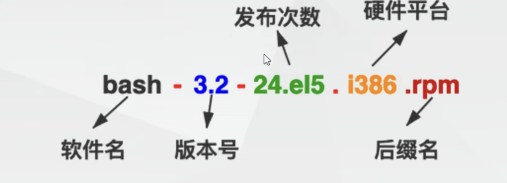
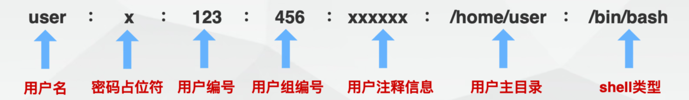
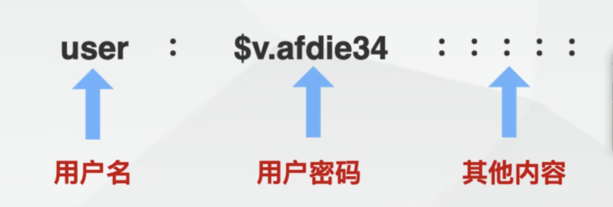
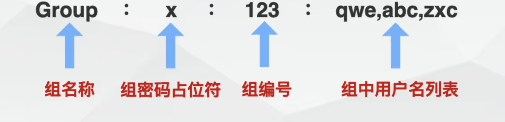
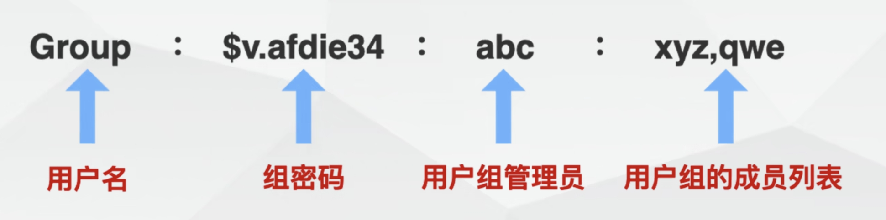

## 上午

### 1. 软件管理

####  	1.安装方式

* 软件包管理工具(yum)

* rpm二进制包

* 源码安装

####  	2. yum

1. 定义

   * 基于**RPM包**构建的软件更新机制，可以自动**解决包之间的依赖关系**

2. 源存放目录

   * /etc/yum.repos.d 是所有yum源默认存放目录，所有源文件以.repo结尾

3. yum常用选项

   | 参数    | 作用     |
   | ------- | -------- |
   | install | 安装软件 |
   | update  | 升级软件 |
   | remove  | 卸载软件 |
   | clean   | 清除缓存 |

4. 安装过程

   * 搜索

   ```
   yum search [软件名]
   ```

   * 安装

   ```
   yum install [软件名]
   ```

   * 升级

   ```
   yum update [软件名]
   ```

   * 卸载

   ```
   yum remove [软件名]
   ```

5. 换源

```
sudo wget -O /etc/yum.regczpos.d/CentOS-Base.repo http://mirrors.aliyun.com/repo/Centos-7.repo  //换源
//换源失败，尝试下面两步
sudo yum clean all  
sudo yum makecache
```

6. 其他用法

```
yum info [软件包名]  //查看软件详细信息
yum list installed  //查看已经安装的所有文件
yum update  //更新所有软件(不存在的会与云端同步，存在的会替换下载链接)
yum check-update  //检查可更新的软件
```

#### 	3. RPM软件包

1. 定义

2. 命名格式

   

3. 基本用法

```
rpm -q[子选项] 软件名
```

| 参数 | 作用                                       |
| ---- | ------------------------------------------ |
| -q   | 仅查询是否有安装                           |
| -qa  | 列出已经安装的软件                         |
| -ql  | 列出该软件所有的文件与目录所在的完整文件名 |
| -qR  | 列出与该软件有关的相依软件所含的文件       |

4. 安装软件选项及参数

| **参数** | **含义**                   |
| -------- | -------------------------- |
| **-i**   | **安装指定的rpm文件**      |
| **-v**   | **显示安装过程的详细信息** |
| -h       | 以 # 显示安装的进度        |
| -U       | 用指定的.rpm文件升级同名包 |
| **-e**   | **卸载软件**               |

```
//在线安装
rpm -ivh http|ftp://xxx.com/xx.rpm
//本地安装
rpm -ivh xx.rpm  
```

#### 	4. 源代码安装

1. 定义

   * 通过tar包安装
   * 不能直接运行，需编译可执行成二进制文件

2. 优点

   * 获取最新版本，及时修复Bug
   * 灵活定制软件功能

3. 应用场合

   * **较新版本**的应用程序大都以源码形式发布
   * 功能无法满足需求时可自定义
   * 便于添加新功能

4. 安装过程

   1. 安装前，仔细阅读Readme

   2. 解压源码，跳转到源码解压目录，输入./configure，配置安装目录

      ```
      ./configure --prefix=/usr/local/webserver
      ```

   3. 使用make进行编译(前提是产生了Makefile文件)，作用是生成二进制文件

      ```
      make
      ```

   4. 安装二进制文件(即将二进制文件复制到相应的目录)

      ```
      sudo make install
      ```

   5. 启动安装好的服务进行测试

      ```
      /usr/local/webserver/bin/apachectl start
      ```

   6. 在解压目录删除安装产生的临时文件

      ```
      make clean
      ```

   7. 在解压目录卸载已安装程序(前提Makefile指定过uninstall)

      ```
      make uninstall
      ```

### 2. Linux搭建LAMP环境

1. LAMP概述

   * 是一种常用来搭建动态网站或服务器的开源软件

2. LAMP组件

   * Linux
   * Apache：Web服务器
   * MySQL
   * PHP

3. 搭建过程

   1. 安装httpd(Apache环境)

   ```
   1.yum -y install httpd httpd-devel httpd-manual mod_ssl
   2.systemctl start httpd  //启动httpd服务
   3.systemctl enable httpd  //开机自启httpd服务
   
   systemctl status httpd  //查看httpd服务的情况
   ```

   2. 安装mysql数据库

   ```
   1.yum -y install mariadb-server mariadb
   2.systemctl start mariadb //启动数据库服务
   3.systemctl enable mariadb  //开机自启数据库服务
   ```

   3. 安装PHP语言环境

   ```
   1.yum -y install php php-common php-gd php-mbstring php-mcrypt php-devel php-xml
   2.systemctl restart httpd  //重启httpd服务
   ```

   4. 将源代码放入/var/www/html文件夹中
   5. 网页输入地址启动服务

#### 3. 其他指令

```
kill -9 [pid]  //结束进程
lsof -i:80  //查看80端口的进程
systemctl start httpd  //启动httpd服务
systemctl enable httpd  //开启httpd服务
systemctl status httpd  //查看httpd服务的情况
ps -aux //获取Linux上的进程信息 a:所有，u:用户
```


## 下午

### 1. Linux用户与用户组

#### 	1. 用户

  		1. 概念
  		2. 分类
  	   * 虚拟用户：不能登录系统，方便于管理系统，如**bin**、adm、**nologin**、nobody用户等
  	   * 超级用户
  	   * 普通用户

#### 	2. 用户组

 	1. 概念
 	 * 具有相同权限的一组用户
 	 * 对用户**进行管理**及**访问控制权限**的手段
 	2. 用户与用户组关系
 	 * 一对一
 	 * 一对多
 	 * 多对一
 	 * 多对多

#### 	3. 相关文件配置

1. /etc/passwd 存储当前系统中所有用户的信息

   * 
   * 


2. /etc/shadow存储当前系统中所有用户的密码信息

   

   

3. /etc/group存储当前系统中所有用户组的信息

* 
* 

4. /etc/gshadow存储用户组密码的一类信息

* 
* 

#### 2.  相关命令

 	1. 用户

| 命令                           | 含义                       |
| ------------------------------ | -------------------------- |
| useradd [用户名]               | 创建用户                   |
| useradd -g [组名] [用户名]     | 创建用户并指定用户组       |
| useradd [用户名] -s xxx        | 创建用户并指定登录后的操作 |
| usermod -g [用户组] [用户名]   | 修改用户所在用户组         |
| usermod -l [新用户名] [用户名] | 修改用户名                 |
| userdel [用户名]               | 删除用户                   |
| userdel -r [用户名]            | 删除用户包括用户家目录     |

| 命令             | 含义                                      |
| ---------------- | ----------------------------------------- |
| passwd [用户名]  | 修改用户密码                              |
| gpasswd [用户组] | 修改用户组密码                            |
| su [用户名]      | 切换用户身份                              |
| id [用户名]      | 显示用户信息(组名,组编号,用户名,用户编号) |
| whoami           | 显示当前登录用户名                        |

```
useradd -g test test2 -s /sbin/nologin  //创建用户test2并添加进用户组test而且指定用户为虚拟用户
```

  2. 用户组

     | 命令                          | 含义                   |
     | ----------------------------- | ---------------------- |
     | groupadd [组名]               | 添加用户组             |
     | groupadd -g [组编号] [组名]   | 添加用户组时指定组编号 |
     | groupmod -n [新组名] [旧组名] | 修改用户组名           |
     | groupmod -g [组编号] [组名]   | 修改用户组编号         |
     | groupdel [组名]               | 删除用户组             |

     

