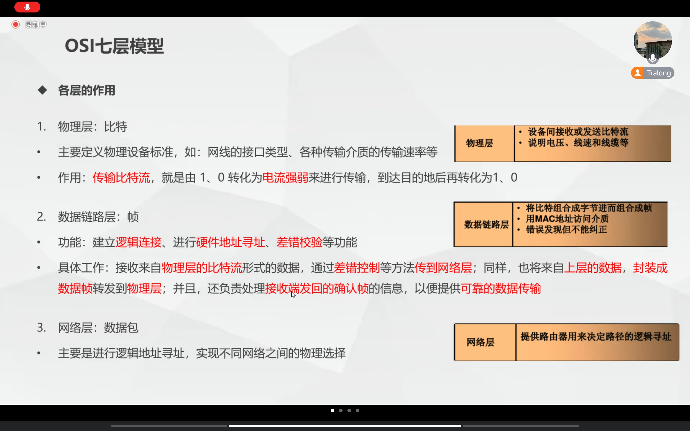
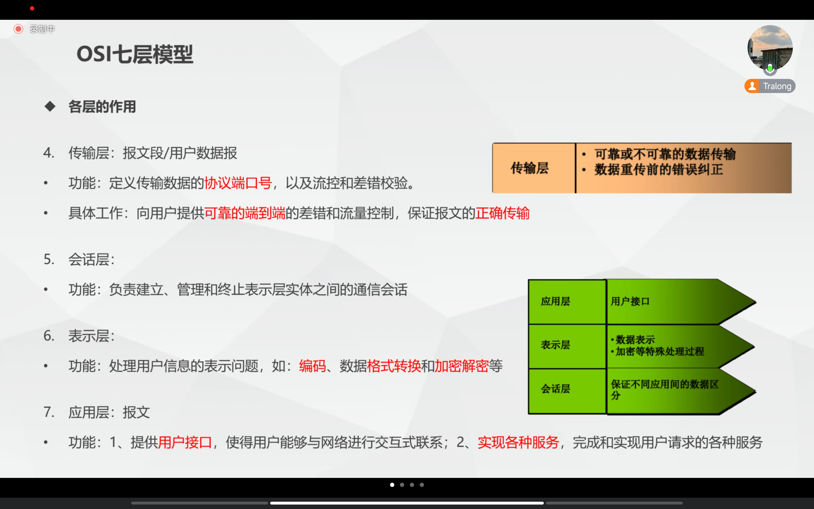
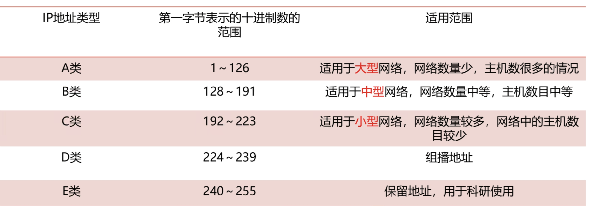
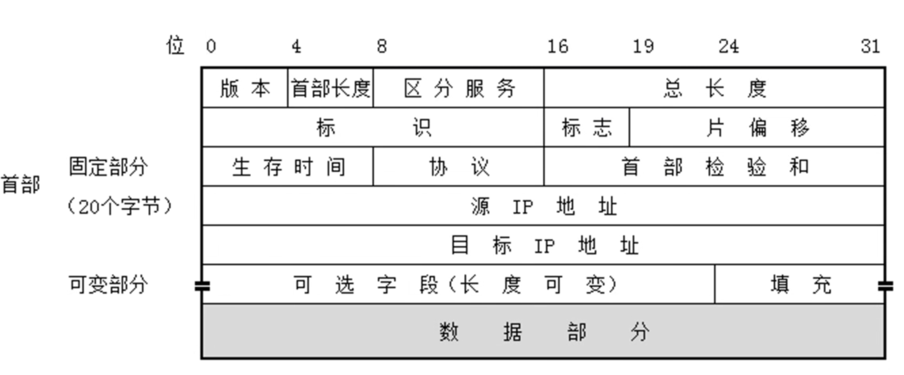
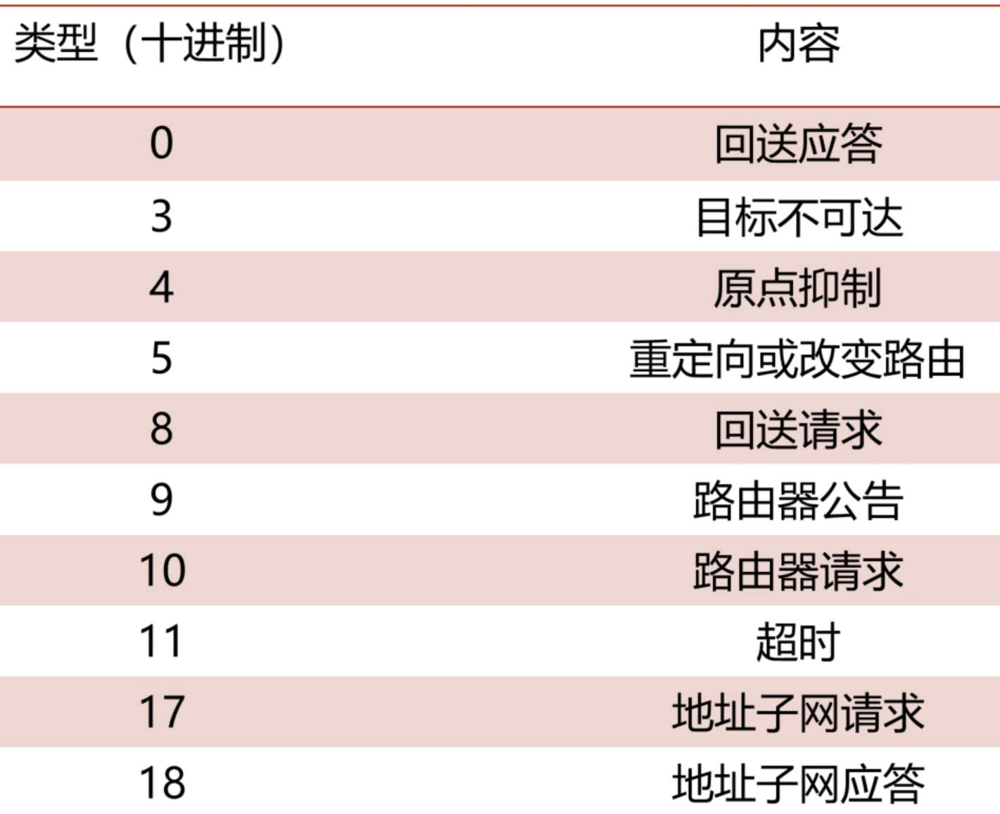
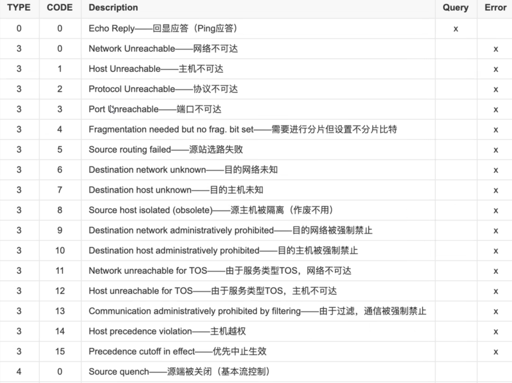

# 第2周

## 一、第1天

### 1. 认识网络

#### (1). 分类

##### 	a. 覆盖范围

* 局域网
* 城域网
* 广域网

##### 	b. 拓扑结构

* 总线网
* 环形网
* 星型网

##### 	c.使用范围

* 公用网
* 专用网 

#### (2). 组成

##### 	a. 网络硬件

* 计算机：网络服务器、网络工作站
* 网络适配器：即网卡
* 交换机
* 传输介质：双绞线、同轴电缆、**光纤**
* 网络互联设备：中继器、**路由器**、网关

##### 	b. 网络软件

* 网络操作系统：Windows、Unix
* 协议软件：TCP/IP
* 应用软件：浏览器、数据库应用系统

### 2. 网络模型

#### (1). OSI七层模型

##### a. 介绍

* 国际标准化组织(ISO)于1984颁布了开放系统互连(OSI)参考模型

##### b. 分层

###### ①. 物理层

* 单位：比特
* 功能：传输**比特流**，与电信号相互转化

###### ②. 数据链路层

* 单位：帧
* 功能：建立逻辑连接。进行**硬件寻址**、差错校验等功能

###### ③. 网络层

* 单位：数据包
* 功能：进行**逻辑寻址**，实现不同网络的物理选择

###### ④. 传输层

* 单位：报文段/用户数据报

* 功能：定义传输数据的**协议**(TCP、UDP)和**端口号**，保证报文的正确传输

###### ⑤. 会话层

* 功能：**建立、管理和终止**表示层实体之间的通信**会话**

###### ⑥. 表示层

* 功能：处理数据的表示，如编码、**加解密**和格式转换等

###### ⑦. 应用层

* 功能：提供**接口**，实现各种**服务**
<div style="display: inline-block;">




#### (2). TCP/IP协议模型

##### a. 介绍

* 是一个**协议族的统称**，包括了IP协议、ICMP协议、TCP协议、以及http、ftp、pop3、https协议等

##### b. 端口及协议号

###### ①. 端口号

* **HTTP：80**
* **HTTPS：443**
* POP3：110
* **FTP：20/21**
* SMTP：25
* Telnet：23
* **SSH：22**
* server：445
* **RDP：3389**
* **DNS：53**
* **DHCP：67/68**

###### ②. 协议号

* TCP：6
* UDP：17

##### c. 分层

###### ①. 网络接口层

1. 物理层：接收信号并将其转化为**比特流**，传递给数据链路层
2. 数据链路层：接收**数据帧**(**以太帧**)，去除数据链路层头部与尾部，将**数据包**传递给网络层

###### ②. 网络层

* 接收**数据包**，去除网络层头部，将**报文段**传递给传输层

###### ③. 传输层

* 接受**报文段**，去除传输层头部，将**数据**传递给应用层

###### ④. 应用层

* 接收**数据**并交给应用程序处理


## 二、第2天

### 1. 网络层

#### 	(1). ip地址

##### 	a. 概念

* 每一台计算机一个唯一的编号
* **唯一标识**，是一段**网络编码**，由32位组成

##### 	b. 格式

* 4个字节
* 常用点分十进制表示

##### 	c. 分类

###### ①A类

* 格式：第1个字节为网络地址，后3个字节为主机地址

* 范围：1.0.0.0 - 126.255.255.255

* 数量：256^3-2（一亿六千万多个）

###### ②B类

* 格式：前2个字节为网络地址，后2个字节为主机地址
* 范围：128.0.0.0 - 191.255.255.255
* 数量：256^2-2

###### ③C类

* 格式：前3个字节为网络地址，最后1个字节为主机地址
* 范围：192.0.0.0 - 223.255.255.255
* 数量：256-2

###### ④D类

* 格式：不划分网络地址与主机地址，第一个字节前4位固定位**1110**
* 范围：224.0.0.0 - 239.255.255.255
* 作用：作为**组播地址**，**无子网掩码**

###### ⑤E类

* 格式：不划分网络地址与主机地址，第一个字节前5位固定位**11110**
* 范围：240.0.0.0-255.255.255.255
* 作用：用于Internet科研(实验地址)

##### d. 特殊分类

1. 0.0.0.0：是所有**不清楚的主机和目的网络的**集合

2. 255.255.255.255：作为本网段内的**广播地址**

3. 127.0.0.1：**环回地址**，别名**Localhost**，**Windows下整个127.0.0.x均为环回地址**

4. 169.254.x.x：DHCP发生故障或响应时间太长时的地址

5. 私有地址
   1. 10.x.x.x

   2. 172.16.x.x ~ 172.31.x.x

   3. 192.168.x.x


##### e. 适用范围



#### (2). 子网

##### 	a. 划分原因

* 有效利用地址空间
* 便于管理
* 可以隔离广播和通信，减少网络拥塞
* 出于安全方面的考虑

##### 	b. 划分方法

* 主机号拿出一部分来**标识子网**，另一部分任然做**主机号**
* 组成：**网络号 + 子网号 + 主机号** 

#### (3). 子网掩码

##### 	a. 介绍

* 不能单独存在，结合**IP地址**一起使用
* 将某个IP地址划分为**网络地址**和**主机地址两**部分

##### 	b. 确定规则

* 凡是IP地址的**网络和子网标识**部分，都用**二进制1**标识
* 凡是IP地址的**主机标识**部分，都用**二进制0**表示

##### 	c. 三种运算方式

###### 	①. 与运算( & )

###### 	②. 或运算( | )

###### 	③. 异或运算( ^ )

* 值不同为1，否则为0

```
 IP地址：11000000 10101000 00001010 11010111 => 192.168.10.215
子网掩码：11111111 11111111 11111111 00000000 => 255.255.255.0
与运算(&)
网络地址：11000000 10101000 00001010 00000000 => 192.168.10.0
```

#### 	(4). 无分类编址(CIDR)

##### 	a. 介绍

* 消除了传统的**A类、B类和C类地址**以及**划分子网**的概念
* 采用各种长度的“**网络前缀**”代替网络号和子网络号

##### 	b. 格式

* 采用**斜线记法**，分为**网络前缀**和**主机号**两部分
* 例如：127.14.35.7/20 

##### 	c. CIDR聚合

###### 	①. 聚合目的

* 将相邻的多个IP前缀合并为一个短前缀
* 聚合后的网段**刚好包含**合并前网段的所有地址

###### 	②. 聚合过程

```
1、2个前缀相同的网络可以聚合成一个网络
10111110 10111010 11011011 01011|000  => 190.186.219.88/29
10111110 10111010 11011011 01010|000  => 190.186.219.80/29
2、聚合之后
10111110 10111010 11011011 0101|0000  => 190.186.219.80/28
```

#### 	(5). 路由寻址

#####  a. 步骤

1. 主机A判断和主机B是否在同一个网络
2. 不在，则根据路由表规则，进行交接请求处理
3. 路由器判断主机B是否在主机A的F0/0网段，在则转发给对应主机(聚合因素)
4. 不在，查找其它接口，并继续判断
5. 都不存在，则废弃该消息

####  (6). GNS指令

```
1. 路由器配置
configure terminal   => conf t 	//c从用户模式进入全局模式
interface f 0/0  	=> int f 0/0	//进入端口进行配置
ip add 192.168.1.1 255.255.255.0	
no shutdown		//开启端口，默认是关闭
end		//保存退出（只本次生效）
wr	//将配置固定

2.PC配置
ip 192.168.71.45/24 192.168.71.1
save  //将配置保存至配置文件，下次启动自动加载
```

#### (7). 命令行配置模式

##### a用户模式

###### ①. 功能

* 用户模式是最基本的模式，用户可以查看设备的基本状态和一些非配置性的命令。无法进行配置更改。

###### ②常用命令

* `show`、`ping`、`traceroute` 等。

###### ③操作符

```
Switch>` 或 `Router>
```

##### b.特权模式

###### ①. 功能

* 特权模式允许执行更高级别的命令，包括查看详细信息和进入全局配置模式。需要通过输入 `enable` 命令从用户模式进入特权模式

###### ②常用命令

* 所有 `show` 命令、`copy`、`debug`、`reload` 等。

###### ③操作符

```
Switch#` 或 `Router#
```

##### c.全局配置模式

###### ①. 功能

* 在全局配置模式下，可以配置整个设备的系统参数和功能设置

###### ②常用命令

* `hostname`、`interface`、`router`、`line`、`ip` 等。

###### ③操作符

* ```
  Switch(config)#` 或 `Router(config)#
  ```

## 三、第4天

### 1. TCP/IP协议栈

####  (1). ARP协议

##### 	a. 介绍

* 将**IP地址**解析为**以太网MAC地址**的协议

##### 	b. 工作原理

1. 主机A在当前局域网**广播** **ARP请求数据报**，包含本机IP和MAC以及对方IP
2. 局域网每一台主机**接收并验证**，验证失败的主机则**废弃**该数据报
3. 验证成功的主机以**单播**返回**ARP响应报文**，包含接收方的**IP地址**和**MAC地址**

##### 	c. ARP缓存表

* 包含**IP地址**到**MAC地址**的映射关系

##### 	d. ARP报文格式

1. 操作类型：1代表请求报文，2代表响应报文
2. 源MAC地址
3. 源IP地址
4. 目的MAC地址
5. 目的IP地址

#### (2). IP协议

##### 	a. 格式

* 首部前一部分**固定20字节**，后一部分**可选字段长度可变**
* 

##### 	b. 重要字段分析

* 协议：占8位

  | 协议号 | 协议名 |
  | ------ | ------ |
  | 1      | ICMP   |
  | 6      | TCP    |
  | 17     | UDP    |

#### (3). ICMP协议

##### 	a. 介绍

* IPv4协议簇中的一个子协议，用于在**IP主机**与路由器之间传递控制信息
* 控制信息：**网络通不通**、**主机是否可达**、**路由是否可用**

##### 	b. 作用

* 在IP包无法传输时提供**差错报告**

##### 	c. 格式

* 包含在**IP数据报中**

##### 	d. 类型及含义
<div style="display: inline-block;">




##### 	(1). 重要字段结构

* 目的MAC地址

* 源MAC地址

* 上层协议

  | 字段   | 协议      |
  | ------ | --------- |
  | 0x0800 | IP协议帧  |
  | 0x0806 | ARP协议帧 |

### 3. 交换机

#### 	(1). 工作原理

1. 主机A把数据发送到交换机A，交换机A查找**MAC地址表**并**记录**主机A的MAC地址，有则返回直接发送给主机B，没有则向**所有端口**发送**广播**
2. 交换机B接收到交换机A的广播帧，**查找MAC地址表**并记录主机A的MAC地址，有则直接发送给主机B，没有则向**所有端口**发送**广播**
3. 交换机B某一端口的主机B接收到广播帧，通过**单播**发送ARP请求给交换机B
4. 交换机B向交换机A**发送**主机B的数据帧并**记录**主机B的MAC地址
5. 交换机A向主机A**转发**交换机B的数据帧并**记录**主机B的MAC地址
6. 主机A收到回复请求

#### 	(2). 基本配置

* 配置主机名：hostname

  ```
  hostname icq
  ```

* 设置登录密码：password

  ```
  line console 0  #进入控制台
  password icq	#设置登录口令
  login		#允许登录
  exit		#退出控制台
  ```

* **保存配置：write**

* 重启设备：reload

* 设置用户特权密码

  ```
  conf t
  enable password 密码 (明文密码)
  enable secret 密码 (密文)
  write
  ```

* 查看MAC缓存表

  ```
  show mac-address-table
  ```

* **查看接口状态列表**

  ```
  show ip int brief
  ```

* 手工关闭接口

  ```
  shutdown
  ```

* **手工开启接口**

  ```
  no shutdown
  ```

* 删除配置

  ```
  命令前加： no
  ```

* 清除初始化配置

  ```
  erase startup-config
  ```

### 4. 路由器

#### 	(1). 路由表

##### 	a. 直连网段 

* 配置IP地址 -> 端口处于UP状态 -> 形成直连路由

##### 	b. 非直连网段

* 需要静态路由或者动态路由，将网段添加到路由表中

#### 	(2). 静态路由

* 手动配置，缺乏灵活性

```
格式：
ip route 目标网段 子网掩码 下一跳IP

Router>enable
Router#configure terminal
Router(config)#ip route 192.168.0.0 255.255.255.0 192.168.1.2  //表示把寻找192.168.0.0网段的信息发送给另一个端口192.168.1.2
Router(config)#ip route 0.0.0.0 0.0.0.0 下一跳IP  //表示任何网络都交给下一跳处理
```

### 5. VLAN

#### (1). 含义

* 在**物理网络**上划分出的**逻辑网络**，对应OSI第二层

* 不受端口物理位置限制

#### (2). 作用

 	1. 减少保密信息遭到破坏的可能性
 	2. 节约成本，无需升级网络
 	3. 极高管理效率
 	4. 缩小广播域，减少一个广播域上的设备数量
 	5. 提高性能，减少不必要的数据流

#### (3). 配置

```
vlan x  //创建编号为x的vlan区域
switchport access vlan x  //到交换机端口配置，将端口添加至vlan区域
```

```
1.在交换机上换分vlan
Switch>enable
Switch#configure terminal
Switch(config)#vlan 2
Switch(config-vlan)#name v2
Switch(config-vlan)#exit
Switch(config)#vlan 3
Switch(config-vlan)#name v3
Switch(config-vlan)#exit

2.为交换机的端口分配vlan
Switch(config)#interface f0/1
Switch(config-if)#switchport mode access
Switch(config-if)#switchport access vlan 2
Switch(config-if)#exit
Switch(config)# interface f0/2
Switch(config-if)#switchport mode access
Switch(config-if)#switchport access vlan 3
Switch(config-if)#exit
Switch(config)#interface f0/3
Switch(config-if)#switchport mode access
Switch(config-if)#switchport access vlan 2
Switch(config-if)#exit
```

#### (4). VLAN Trunk

##### a. 介绍

* 将不同交换机划分的VLAN连接在一起

##### b. 配置

```
int f0/x
switchport mode trunk
exit

1.在两个交换机连接的接口上分别开启Trunk模式
Switch(config)#interface f0/4
Switch(config-if)#switchport mode trunk
Switch(config-if)#switchport trunk allowed vlan 2,3
Switch(config-if)#exit
```


## 四、第5天

### 1. 访问控制列表

#### 	(1). 含义

* 应用于**路由器接**口的指令列表，用于指定哪些数据包**可以转发**，哪些数据包**需要拒绝**

#### 	(2). 作用

* 提供**网络访问**的基本安全手段
* 控制**数据流量**
* 控制通信量

#### 	(3). 工作原理

* 读取第三层及第四层包头中的信息（**协议、目的地址与目的端口、源地址与源端口）**
* 根据预先**定义好的规则**对包进行过滤（**包过滤**）

#### 	(4). 分类

##### 		a. 基本类型

* **标准**访问控制列表
  * 只使用数据包的**源地址**来**允许或拒绝**数据包
  * 访问控制列表号从**1~99**

* **扩展**访问控制列表

##### 		b. 其他类型

* **基于MAC地址**的访问控制列表
* **基于时间**的访问控制列表

#### 	(5). 标准ACL配置

##### a. 创建策略

```
configure terminal
access-list 1 deny 202.100.10.1 0.0.0.0 //创建策略1，拒绝202.100.10.1的主机访问
```

##### b. 应用策略

```
configure terminal
interface f0/0
ip access-group 1 in  //将策略1配置到f0/0的流入流量控制
```

##### c. 实例

```
R1(config)#access-list 1 deny 192.168.10.0 0.0.0.255	//拒绝192.168.10.0网段的数据包
R1(config)#access-list 1 deny 192.168.40.2 0.0.0.0		//拒绝192.168.40.2地址的数据包
R1(config)#access-list 1 permit any		//允许除以上之外的数据包通过
R1(config)#int g0/2		
R1(config-if)#ip access-group 1 out		//在g0/2端口的流出流量上配置ACL

R2(config)#access-list 2 deny 192.168.10.2 0.0.0.0		//拒绝192.168.10.2地址的数据包
R2(config)#access-list 2 permit any		//允许除此之外的数据通过
R2(config)#int g0/0
R2(config-if)#ip access-group 2 in		//在g0/0端口的流入流量上配置ACL

show access-lists		//显示路由器上的ACL表
show ip interface gigabitEthernet 0/0	//显示端口的信息
```

## 五、第6天

### 1. NAT转换

####  (1). 原因

* 合法的IP地质资源**即将耗尽**
* 通过NAT技术将**私网地址**转换成**公网地址**
* 可以有效的**隐藏内部局域网中的主机**，具有一定的安全保护作用

####  (2). 原理

1. 改变**IP包头**
2. 报文从**私有网络**进入公网时，将**源IP地址**替换成公网IP
3. 响应包从服务端发回出口网关时，网关将目的地址改为**原内网地址**

####  (3). 类型

##### 	a. 静态NAT

* 手动转换
* **一对一转换**
* 适用于内部服务器**向外部提供服务**(WEB、FTP)

##### 	b. 动态NAT

* 手动定义2个地址集，一个**允许转换的内部地址集**，一个**外部地址集**，转换设备**动态的**实现地址映射
* 一对一转换
* 适用于内部用户访问外部资源时，以及适用于**租用的地址数量较多**时

##### 	c. 端口地址转换PAT

* 多个本地地址使用相同的全局地址进行转换，只通过**不同的端口**进行区分
* **多对一转换**
* 适用于**地址数很少**，**用户很多**时

#### (4). 配置

#####   a. 静态NAT

###### 	  ①. 配置步骤

1. 在出口路由器上配置静态转换表

   ```
   Router(config)#ip nat inside source static local-ip global-ip  
   ```

2. 标记哪个端口连接内网

   ```
   Router(config-if)#ip nat inside 
   ```

3. 标记哪个端口连接外网

```
Router(config-if)#ip nat outside  
```

###### 	  ②. 配置实例

```
Router>enable
Router#configure terminal
Router(config)#ip nat inside source static 192.168.10.2 110.110.1.1
Router(config)#interface s0/1/0
Router(config-if)#ip nat outside
Router(config-if)#exit
Router(config)#
Router(config)#interface f0/0
Router(config-if)#ip nat inside
Router(config-if)#exit
```

#####  b. 动态NAT

###### 	  ①. 配置步骤

1. 定义一个IP地址池

```
Router(config)#ip nat pool 地址池名 公网起始地址 公网结束地址 netmask 子网掩码
```

2. 定义一个ACL，只有和这个列表匹配的地址才会进行NAT转换

```
Router(config)#access-list 表号 permit 地址 反子网掩码
```

3. 定义动态NAT，把和列表匹配的内部本地地址，用地址池中的地址建立NAT映射

```
Router(config)#ip nat inside source list ACL表号 pool 地址池名字
```

4. 标记网络的内部和外部接口

```
Router(config-if)#ip nat inside|outside
```

###### 	  ②. 实例

```
Router>enable
Router#configure terminal
Router(config)#access-list 1 permit 192.168.23.0 0.0.0.255
Router(config)#ip nat pool natpool 110.110.1.3 110.110.1.6 netmask 255.255.255.0
Router(config)#ip nat inside source list 1 pool natpool
Router(config)#interface s0/1/0
Router(config-if)#ip nat outside
Router(config-if)#exit
Router(config)#interface f0/0
Router(config-if)#ip nat inside
```

#####   c. PAT

###### 	  ①. 配置步骤

1. 定义IP访问控制列表

   ```
   Router(config)#access-list 表号 permit IP地址 反子网掩码
   ```

2. 配置多复用动态转换条目

   ```
   Router(config)#ip nat inside source list ACL表号 地址池名 overload //overload表示使用端口复用技术
   ```

3. 标记外部接口和内部接口

   ```
   Router(config-if)#ip nat inside|outside
   ```

###### 	  ②. 实例

```
Router>enable
Router#configure terminal
Router(config)#access-list 1 permit 192.168.23.0 0.0.0.255
Router(config)#ip nat inside source list 1 interface s0/1/0 overload
Router(config)#interface s0/1/0
Router(config-if)#ip nat outside
Router(config-if)#exit
Router(config)#interface f0/0
Router(config-if)#ip inside
```

