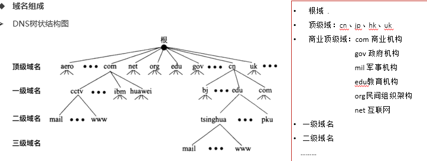
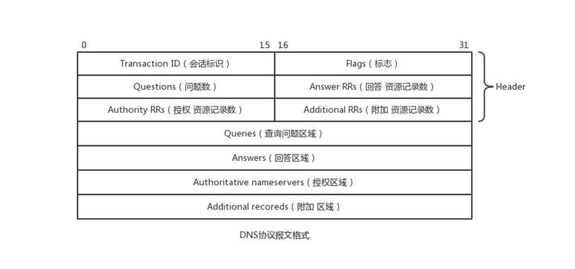
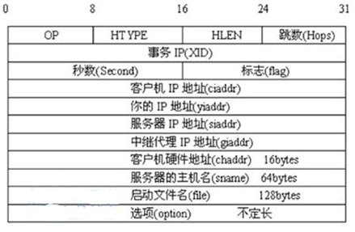

# 第3周


## 一、传输、应用层

### 1. 传输层协议

#### (1). TCP

##### 	a. 介绍

* 面向连接的、可靠的、基于字节流的传输层通信协议

##### 	b. 主要特点

* **面向连接**的传输协议
* 仅支持**单播传输**
* 提供**可靠交付**
* 基于**字节流**

##### 	c. 数据段格式

###### 	 ①. 源端口和目的端口

* 各占16位

###### 	 ②. 序号

* 占32位

###### 	 ③. 确认号

* 占32位

###### 	④. 数据偏移

###### 	 ⑤. 确认位ACK

###### 	 ⑥ 复位RST

###### 	 ⑦. 同步位SYN

###### 	 ⑧. 终止位FIN

##### 	d. 端口

###### 	 ①. 系统端口号

范围：0~1023

* FTP：21
* TELNET：23
* SMTP：25
* DNS：53
* HTTP：80
* HTTPS：443

###### 	 ②. 登记端口号

###### 	 ③. 动态端口号

##### 	e. 连接建立

###### 	 ①. 三次握手

###### 	 ②. 四次挥手

##### 	f. 可靠传输原理

###### 	 ①. 无差错情况

###### 	 ②. 超时重传

* 发送方保存发送分组的副本
* 分组和确认分组必须编号
* 超时计时器重传时间大于平均往返时间

###### 	 ③. 确认包丢失

* 丢弃重复数据包
* 接收方重新发送确认

###### 	 ④. 确认包迟到

#### (2). UDP

#####   a. 介绍

* 无链接传输层协议

#####   b. 主要特点

* 发送数据之前**不需要建立连接**
* **不保证**可靠交付
* **面向报文的**
* 支持一对一、一对多、多对一和多对多

#####   c. 数据报格式

###### 	 ①. 源端口

###### 	  ②. 目的端口

###### 	  ③. 长度

###### 	  ④. 校验和

#### (3).  TCP与UDP异同点

##### 	a. 相同点

* 都是传输层协议
* 都需要开放端口

##### 	b. 差异点


### 2. 应用层协议

####  (1). DNS协议

#####   a. 介绍

* 将**域名**解析到**IP地址**的一种协议
* DNS协议基于**TCP/UDP**协议的，端口**53**
* 采用**客户机/服务端**模式运行在通信的端系统之间
* 可以输入**nslookup**命令查询域名对应**IP地址**

#####   b. 域名组成 



#####   c. DNS解析

###### 	  ①. 查询方式

1. 递归查询
   * 客户机向本地DNS服务器查询，由本地DNS服务器进行跳转(**客户机只发起一次请求**)
2. 迭代查询
   * 客户机向本地DNS服务器查询，返回结果未命中，客户机继续向下一级DNS服务器发起请求(**客户机发起多次请求**)

###### 	  ②. 查询内容

1. 正向解析
   * 已知域名，解析IP地址
2. 反向解析
   * 已知IP地址，解析域名

###### ③. 字段含义



####  (2). DHCP协议

##### 	a. 介绍

* 简化主机IP配置管理的TCP/IP标准协议
* 协议端口：**UDP 67 / 68**
* **自动分配**IP地址，并提供安全可靠、简单的TCP/IP网络配置

##### 	b. 原理

1. 客户机**广播请求IP地址**
2. 服务器**响应**提供的IP地址
3. 客户机**选择IP**
4. 服务器**确定了租约**，并提供网卡详细参数

##### 	c. 字段含义



## 二、HTML

### 3. 超文本标记语言HTML

####  (1). 概述

#####   a. 基本语法

```
<font size= "1" color="red">文字内容</font>
```

#####   b. 简单标签

| 标签    | 说明                     |
| ------- | ------------------------ |
| <html.> | 标签体内囊括整个网页     |
| <body.> | 标签体内为整个网页内容   |
| <h1.>   | 标签体内文本被标记为标题 |
| <p.>    | 标签体内文本被标记为段落 |
| <br.>   | 换行                     |

```html
<!DOCTYPE html>
<html>
<meta charset="UTF-8">
    <head>
        <title>百度搜索</title>
    </head>
    <body>
        <h1>hello world</h1>
        <p>1234551</p>
    </body>
</html>
```


#### (2). 表格

| 标签     | 说明         |
| -------- | ------------ |
| <table.> | 创建一个表格 |
| <tr.>    | 创建表格的行 |
| <td.>    | 创建表格的列 |
| <th.>    | 创建表格头   |

```html
<!DOCTYPE html>
<html>
<meta charset="UTF-8">
    <head>
        <title>百度搜索</title>
    </head>
    <body>
        <table border="2">
            <tr>
                <td>OP</td>
                <td>宆P</td>
                <td>舟P</td>
            </tr>
            <tr>
                <td>Saber</td>
                <td>Archer</td>
                <td>Lancer</td>
            </tr>
        </table>
        <br>
    </body>
</html>
```

#### (3). 表单

#####   a. <form.>

```html
<form action="https://www.baidu.com" method="get" enctype="application/x-www-form-urlencoded">
     <input type="text"><br>
     <button type="submit">提交</button>
     <br>
</form>
```

#####   b. <input.>

* 语法

```html
<input type = "text" name="文本框名称" value="文本框值" size="文本框宽度" maxlength="文本框能输入的最大长度">
```

* type值

  

#####   c. <TEXTAREA.>

* 标记为文本输入区域,可自由调节大小

```html
<textarea name="名称" rows="最大可视行数" cols="最大可视列数">这是默认聊天内容</textarea>
```

#####   d. <SELECT.>和<OPTION.>

* 标记为选择框

  

```html
<select name="职业选择" size="1">
    <option value="11">Saber</option>
    <option value="22">Lancer</option>
    <option value="33">Archer</option>
</select>
```

####   (4). 元素属性

| 元素  | 值               | 含义               |
| ----- | ---------------- | ------------------ |
| calss | classname        | 规定元素的类名     |
| id    | id               | 规定元素的唯一id   |
| style | text             | 规定样式           |
| title | style_definition | 规定元素的额外信息 |

## 三、CSS

###   1. CSS层叠样式

#### 	(1). 介绍

* 用来装饰HTMl，是对HTML标记的拓展，可以进一步美化页面

####   (2). 特点

* 功能强大、页面布局、可以重用、易于维护

####   (3). 语法

* 由选择符和声明组成，声明由属性和属性值组成

* 用“属性名：属性值”描述

  

* 

#### 	(4). 引用方式

##### 	  a. 内联样式

* 在HTML元素中使用"style"属性

* ```html
  <p style="display:none"></p>
  ```

##### 	  b. 内部样式表

* 在HTML文档头部<.head>区域使用<.style>元素，包括CSS

  ```html
  <style type="text/css">
      选择符{样式属性：属性值；样式属性：属性值；......}
      选择符{样式属性：属性值；样式属性：属性值；......}
  </style>
  ```

  

* 

| 选择符           | 形式          |
| ---------------- | ------------- |
| 类选择符(class)  | .Genshin {  } |
| 类型(标签)选择符 | Genshen {  }  |
| ID选择符         | #Genshen {  } |

#####  c. 外部引用

* 使用外部css样式文件，通过<.link>标签引入

###### 	  ①. 链入外部样式表文件

```html
<link rel="stylesheet" type="text/css" herf="CSS样式文件表地址">
```

###### 	  ②. 导入外部样式表文件

```html
<style type="text/css">
	@import url(样式表地址);
    选择符{样式属性：属性值；样式属性：属性值；......}
    选择符{样式属性：属性值；样式属性：属性值；......}
    ......
</style>
```

### 	2. 样式表冲突

#### 	(1).概念 

* 当多种样式作用于同一标记的同一属性时，发生样式表冲突

#### 	(2). 优先原则

* 就近原则
* 内联 > ID > 类 > 类型 > 外部

## 四、Javascript

### 1. JS

####   (1). 作用

* 为网页的各种动作行为进行编程

####   (2). 定义与使用

##### 	  a. 嵌入HTML中

* 建议放在<.head><./head>标签中

```html
<<script type="text/javascript">
	//写js代码
</script>
```

##### 	  b. 外部js文件

```html
<script type="text/javascript" src="js文件地址"></script>
```

####   (3). 变量声明

* 只能包含数字、字母、下划线、$
* 不能以数字开头
* 名称对大小写敏感
* 建议遵守驼峰规则命名

####   (4). 输出方式

| 方式                              | 解读                         |
| --------------------------------- | ---------------------------- |
| alert()                           | 在页面弹出警告框             |
| document.write()                  | 写到HTML文档中，覆盖其他输出 |
| getElementById().innerHTML = 内容 | 写入到HTML元素               |
| console.log()                     | 写入到浏览器控制台           |

####   (5). 常规运算符

##### 	a. 算术运算符

| 运算符 | 含义     | 例子   | x(y)运算结果(y=10时) |
| ------ | -------- | ------ | -------------------- |
| +      | 加法运算 | x=y+2  | 12                   |
| -      | 减法运算 | x=y-2  | 8                    |
| *      | 乘法运算 | x=y*2  | 20                   |
| **     | 指数运算 | x=y**2 | 100                  |
| /      | 除法运算 | x=y/2  | 5                    |
| %      | 取余运算 | x=y%2  | 0                    |
| ++     | 值递增   | y++    | 11                   |
| --     | 值递减   | y--    | 9                    |

##### 	b. 赋值运算符

* x=10,y=5

| 运算符 | 含义             | 例子 | 运算结果 |
| ------ | ---------------- | ---- | -------- |
| =      | 右侧的值赋给左侧 | x=y  | x=5      |
| +=     | 等同于x=x+y      | x+=y | x=15     |
| -=     | 等同于x=x-y      | x-=y | x=5      |
| *=     | 等同于x=x*y      | x*=y | x=50     |
| /=     | 等同于x=x/y      | x/=y | x=2      |
| %=     | 等同于x=x%y      | x%=y | x=0      |

##### 	c. 字符串连接符

* 使用 + 运算符连接多个字符串变量

```js
txt1="What a very";
txt2="nice day";
txt3=txt1+txt2; //txt3 = What a verynice day
```

##### 	d. 字符串与数字相加

* 返回的值是拼接后的字符串

```js
x=5+5;	//x = 10
y="5"+5;	// y = 55
z="Hello"+5;	//z = Hello5
x,y, 和 z 输出结果为:
```

#### (6). 条件语句

##### 	a. if

* 当指定条件为 true 时，使用该语句来执行代码

###### 	  ①. 语法

```js
if (condition){
    当条件为 true 时执行的代码
}
```

###### 	  ②. 实例

```js
if (time<20){
    x="Good day";
}
else{
    x="Good evening";
}
```

##### 	b. if...else

###### 	  ①. 语法

```js
if (condition){
    当条件为 true 时执行的代码
}
else{
    当条件不为 true 时执行的代码
}
```

###### 	  ②. 实例

```js
if (miles <=3) {
    console.log('20 元/每公里')
    unit =  20
}else {
    console.log('15 元/每公里')
    unit =  15
}
```

##### c. if...else if...else

###### 	  ①. 语法

```js
if (condition1){
    当条件 1 为 true 时执行的代码
}
else if (condition2){
    当条件 2 为 true 时执行的代码
}
else{
  当条件 1 和 条件 2 都不为 true 时执行的代码
}
```

###### 	  ②. 实例

```js
if (time<10){
    document.write("<b>早上好</b>");
}
else if (time>=10 && time<20){
    document.write("<b>今天好</b>");
}
else{
    document.write("<b>晚上好!</b>");
}
```

##### d. switch

###### 	  ①. 语法

```js
switch(n){
    case 1:
        执行代码块 1
        break;      
    case 2:      
        执行代码块 2      
        break;      
    default:
        n 与 case 1 和 case 2 不同时执行的代码
}
```

###### 	  ②. 实例

```js
//显示今天的星期名称
var day=new Date().getDay();
switch (day){
    case 0:
        x="Today it's Sunday";
        break;
    case 1:
        x="Today it's Monday";
        break;
    case 2:
        x="Today it's Tuesday";
        break;
    case 3:
        x="Today it's Wednesday";
        break;
    case 4:
        x="Today it's Thursday";
        break;
    case 5:
        x="Today it's Friday";
        break;
    case 6:
        x="Today it's Saturday";
        break;
}
```

#### (7). 循环语句

##### 	  a.while()

###### 	  ①. 语法

* 检查条件，为 true 时， 就执行花括号中的代码

```js
while (条件){
 需要执行的代码
}
```

###### 	  ②. 实例

```js
while (i<5){
  x=x + "The number is " + i + "<br>";
  i++;
}
```

##### 	  b. do...while()

###### 	  ②. 语法

* 先执行一次代码体，然后再进行判断是否执行

```js
 do{
  需要执行的代码
 }while (条件);
```

###### 	  ①. 实例

```js
do{
  x=x + "The number is " + i + "<br>";
  i++;
}while (i<5);
```

##### 	  c. for()

###### 	①. 语法

```js
for (语句 1; 语句 2; 语句 3){
  被执行的代码块
}
//语句 1 （代码块）开始前执行
//语句 2 定义运行循环（代码块）的条件，循环继续与否判定表达式
//语句 3 在循环已被执行之后执行
```

###### 	②. 实例

```js
for (var i=0; i<5; i++){
  x=x + "The number is " + i + "<br>";
}
```

##### 	d. 终止循环

###### 	  ①. break

* 直接**跳出循环**，继续执行下一段代码

###### 	  ②. continue

* **结束本次**循环，接着执行下一次循环

####   (8). 函数

##### 	a. 定义方式

###### 	  ①. function关键字

1. 基本语法

   ```js
   function 函数名() {
       函数体
       return 表达式
   }
   ```

2. 应用实例

   ```html
   <!DOCTYPE html>
   <html>
   <head>
     <meta charset="UTF-8">
     <title></title>
   </head>
   <body>
   	<button type="button" onclick="showWorkTime()">点击</button>
   	<p id="result"></p>
   </body>
   <script>
         function work(hours) {
           hours=prompt("请输入时间")
           if (hours <= 40) {
             return '正常强度';
           } else if (hours <=60) {
             return '中等强度';
           } else {
             return '高强度';
           }
         }
         function showWorkTime(){
            result = work();
           document.getElementById('result').innerText = result;
         }
   </script>
   </html>
   ```


###### 	  ①. 函数赋给变量

1. 基本语法

   ```js
   var 函数名 = function(形参列表) {
       函数体
       return 表达式
   }
   ```

2. 应用实例

   ```html
   <!DOCTYPE html>
   <html>
   <head>
     <meta charset="UTF-8">
     <title></title>
   </head>
   <script>
     var worktime = function work(hours) {
       hours=prompt("请输入时间")
       if (hours <= 40) {
         return '正常强度';
       } else if (hours <=60) {
         return '中等强度';
       } else {
         return '高强度';
       }
     }
     document.write(worktime())
   </script>
   <body>
   </body>
   </html>
   ```

##### 	b. 调用方式

###### 	  ①. 作为函数

```js
function myFunction(a, b) {
    return a * b;
}
myFunction(10, 2);           // myFunction(10, 2) 返回 20
```

###### 	  ②. 作为方法

* 可以将函数定义为**对象的方法**

```js
var myObject = {
    firstName:"John",
    lastName: "Doe",
    fullName: function () {
        return this.firstName + " " + this.lastName;
    }
}
myObject.fullName();         // 返回 "John Doe"
```

###### 	  ③. 使用构造函数

* 如果函数调用前使用了 **new** 关键字, 则是调用了构造函数，是JavaScript**重新创建的对象**

```js
// 构造函数:
function myFunction(arg1, arg2) {
    this.firstName = arg1;
    this.lastName  = arg2;
}
// This creates a new object
var x = new myFunction("John","Doe");
x.firstName;                             // 返回 "John"
```

####   (9). 对象

##### 	a. 内置对象

###### 	  ①. Date

* 日期对象可以进行比较

| 方法        | 功能                                   |
| ----------- | -------------------------------------- |
| getDate     | 返回一个月中的某一天(1~31)             |
| getDay      | 返回一周中的某一天(0 - 周日，6 - 周六) |
| getFullYear | 返回年份(四位数)                       |
| getHours    | 返回小时(0 ~ 23)                       |
| getMinutes  | 返回分钟(0 ~ 59)                       |
| getSeconds  | 返回秒数(0 ~ 59)                       |
| getMonth    | 返回月份(0 - 一月，11 - 十二月)        |
| getTime     | 返回1970年1月1日至今的毫秒数           |

######   ②. Math

| 方法                | 功能                   |
| ------------------- | ---------------------- |
| Math.abs(number)    | 取绝对值               |
| Math.ceil(number)   | 向上取整               |
| Math.floor(number)  | 向下取整               |
| Math.max(num1,num2) | 返回较大值             |
| Math.min(num1,num2) | 返回较小值             |
| Math.random()       | 返回随机数[0,1)        |
| Math.round(number)  | 返回最接近number的整数 |
| Math.sqrt(number)   | 求平方根               |

###### 	  ③. String

1. 介绍

   * 是动态对象，需要先创建实例对象
   * 使用引号，会直接当做字符串对象实例处理

2. 常用属性

   * length：字符长度

3. 常用方法

   | 方法名                   | 功能                       |
   | ------------------------ | -------------------------- |
   | charAt(index)            | 返回指定索引处的字符       |
   | indexOf(index)           | 返回字符首次出现索引       |
   | substr(index1,index2)    | 从指定索引开始截取指定长度 |
   | subString(index1,index2) | 返回指定索引范围内的字符串 |
   | toLowerCase              | 转为小写                   |
   | toUpperCase              | 转为大写                   |
   | split("分隔符")          | 按照分隔符拆分为字符串数组 |
   | trim                     | 清空空格                   |
   | match                    | 查找指定的值，返回匹配的值 |
   | search                   | 检索字符串首次出现的位置   |
   | replace(str1,str2)       | 用str2代替str1             |

##### b. Object自定义对象

######   ①. 定义方式

```js
1. 语法：
方法1
var 对象名 = new Object();		//实例化对象
对象名.属性名 = 值				//定义实例的一个属性
对象名.函数名 = function(){}	  //定义一个函数

方法2
var 对象名 = {
属性名：值, 		// 定义属性
属性名：值, 		// 定义属性 , 注意有,号
函数名：function(){} // 定义函数
};

2. 实例：
方法1
var person = new Object();
console.log("person 类型=" + typeof(person));//object
person.name = "韩顺平";	//增加一个属性 name
person.age = 20;	//增加一个属性
person.say = function () {		//增加函数
}

方法2
var person = {
    name: "老韩", //说明多个属性和函数之间，使用,隔开
    age: 20, 
    hi: function () {
    console.log("hi ");
    },
    sum: function (n1, n2) {
    return n1 + n2;
    }
}
```

######   ②. 访问方式

```js
1. 语法
对象名.属性名
对象名.函数名();

2. 实例
name = person.name;	//调用属性
person.say();		//访问方法
```

##### c. 宿主对象

* 第三方提供的对象
* BOM、DOM

##### d. 数组对象

###### 	  ①. 含义

* 使用单独的变量名来存储一系列的值

###### 	  ②. 创建方式

```js
1.常规方式:
var myCars = new Array();
myCars[0] = 'Saber'
myCars[1] = 'Lancer'
myCars[2] = 'Archer'

2.简洁方式:
var myCars = new Array('Saber','Lancer','Archer');

3. 直接使用：
var myCars = ['Saber','Lancer','Archer']
```

###### 	  ③. 访问方式

```js
var name = myVars[0];
myCars[0] = 'Archer';
```

###### 	  ④. 数组属性

| 属性        | 含义                         |
| ----------- | ---------------------------- |
| conctructor | 返回创建数组对象的原型函数   |
| length      | 设置或返回数组元素的个数     |
| prototype   | 允许向数组对象添加属性或方法 |

###### 	  ⑤. 常用方法

| 方法         | 方法                                         |
| ------------ | -------------------------------------------- |
| concat()     | 连接任意个数组                               |
| copyWithin() | 从数组指定位置拷贝元素到数组的另一个指定位置 |
| every()      | 检测数组元素的每个元素是否都符合条件         |
| indexOf()    | 返回元素索引                                 |
| find()       | 返回符合传入测试条件的数组元素               |
| fill()       | 使用固定值填充数组                           |
| isArray()    | 判断对象是否为数组                           |
| join()       | 把数组所有元素放入一个字符串                 |
| map()        | 通过指定函数处理数组并返回                   |
| push()       | 末尾添加，返回新长度                         |
| pop()        | 末尾删除，返回删除元素                       |
| reverse()    | 反转数组元素顺序                             |

### 2. DOM

####   (1). 介绍

* 文档对象模型，可以用于**动态访问**、**更新**文档的内容、结构和样式

* 将文档中的对象关系规划为**节点层级**，使用树的层级关系

####   (2). 节点访问

##### 	a. 通过方法访问

| 访问方法              | 解释                     |
| --------------------- | ------------------------ |
| getElementById        | 通过id获取元素           |
| getElementByTagName   | 通过标签名获取元素(集合) |
| getElementByName      | 通过Name值获取元素(集合) |
| getElementByClassName | 通过Class获取元素(集合)  |

```html
<!DOCTYPE html>
<html lang="en">
<head>
    <meta charset="UTF-8">
    <title>Title</title>
</head>
<body>
    <p id="first">第一段文字为黑色</p>
    <p id="second">第二段文字为黑色</p>
    <p id="third">第三段文字为黑色</p>
</body>
<script type="text/javascript">
    var x = document.getElementById("second");
    x.style.color= "red";
    document.write(x.innerHTML);
</script>
</html>
```

##### 	b. 通过属性访问

| 属性            | 说明                 |
| --------------- | -------------------- |
| parentNode      | 元素节点的父节点     |
| childNodes      | 元素节点的子节点数组 |
| firstChild      | 第一个子节点         |
| lastChild       | 最后一个子节点       |
| previousSibling | 前一个兄弟节点       |
| nextSibling     | 后一个兄弟节点       |

```html
<!DOCTYPE html>
<html lang="en">
<head>
    <meta charset="UTF-8">
    <title>Title</title>
</head>
<body>

<table>
    <tr>
        <td id="id_1" class="class1">John</td>
        <td id="id_2" class="class1">Marry</td>
        <td id="id_3" class="class1">Tom</td>
    </tr>
</table>
</body>
<script type="text/javascript">
// 描述子节点的前后顺序
function Des(){
    let list = document.getElementsByTagName("td");
    document.write("修改前的 ID：" + list[0].id + "<br>");
    list[0].id = "id_4";
    list[1].id = "id_5";
    list[2].id = "id_6";
    document.write("修改后的 ID：" + list[0].id + "<br>");
    document.write("父元素是：" + list[0].parentNode.tagName + "<br>");
    document.write("第一个子元素是：" + list[0].parentNode.firstElementChild.id + "<br>");
    document.write("最后一个子元素是：" + list[0].parentNode.lastElementChild.id + "<br>");
    document.write("前一个兄弟子元素是：" + list[1].previousElementSibling.id + "<br>");
    document.write("后一个兄弟子元素是：" + list[1].nextElementSibling.id + "<br>");
}
Des();

</script>
</html>
```

### 3. 事件event

####   (1). 概述

####   (2). 监听方法

##### 	a. 绑定HTMl元素属性

```html
<p id="xxx" onclick = "changeSize()">绑定HTML元素属性</p>
```

##### 	b. 绑定DOM对象属性

```js
document.getElementById('xxx').onclick = function()
```

####   (3). 常见事件

| 事件        | 说明                               |
| ----------- | ---------------------------------- |
| onclick     | **鼠标单击**时                     |
| onload      | 页面**加载完成**时                 |
| onunload    | 页面**关闭或刷新网页**时           |
| onblur      | 光标**离开元素**后                 |
| onchange    | 输入框或下拉列表的**值发生变化时** |
| onmouseover | 鼠标**移入**页面元素               |
| onmouseout  | 鼠标**移出**页面元素               |

##### 	a. onclick

* 鼠标单击页面元素时触发的时间

```html
<!DOCTYPE html>
<html lang="en">
<head>
    <meta charset="UTF-8">
    <title>事件练习</title>
</head>
<body >
  性别：<input type="radio" name="gender" value="男" onclick="showGender(this)"/>男
  <input type="radio" name="gender" value="男" onclick="showGender(this)"/>女<br>
</body>
<script>
  function showGender(obj){
    alert("您选择的性别是： " + obj.value);
  }
</script>
</html>
```

##### 	b. onload

* 页面加载完成时会触发的事件

```html
<!DOCTYPE html>
<html lang="en">
<head>
    <meta charset="UTF-8">
    <title>事件练习</title>
</head>
<body >
</body>
<script>
  window.onload = function () {
     alert("Welcome ICQ");
  }
</script>
</html>
```

##### 	c. onblur

* 在元素失去焦点时触发

```html
<!DOCTYPE html>
<html lang="en">
<head>
    <meta charset="UTF-8">
    <title>事件练习</title>
</head>
<body >
    <label for="textPwd">请输入密码：</label>
  <input type="password" id="textPwd" onblur="checkPwd()">
</body>
<script>
  function checkPwd(){
     let inputElement = document.getElementById("textPwd");
     let inputValue = inputElement.value;
     if (inputValue.length < 6){
       alert("密码必须满足至少6位");
     }
</script>
</html>
```

##### 	d. onchange

* 改变元素的值并且失去焦点时触发，适用于表单元素<.input>、<.textarea>、<.select>

```html
<!DOCTYPE html>
<html lang="en">
<head>
    <meta charset="UTF-8">
    <title>事件练习</title>
</head>
<body >
    <select onchange="changeLink(this)">
        <option value="请选择">请选择</option>
        <option value="http://www.letv.com">乐视网高清</option>
        <option value="https://www.bilibili.com/">BiliBili</option>
    </select>
</body>
<script>
  function changeLink() {
       let list = document.getElementsByTagName("option");
       for (let i = 0; i < list.length; i++) {
           let url = list[i].value;
           window.location = url;
       }
   }
</script>
</html>
```

##### 	e. onmouseover和onmouseout

* 在鼠标移入或移出元素时触发

```html
<!DOCTYPE html>
<html lang="en">
<head>
    <meta charset="UTF-8">
    <title>事件练习</title>
</head>
<body >
    
<p>函数bigImg()在鼠标移动到图片时触发</p>
<p>函数normalImg()在鼠标移出图片时触发</p>
</body>
<script>
  function bigImg(obj){
    alert("千万不要移出图片哦！");

  }
  function normalImg(obj){
      window.location = "https://www.bilibili.com/video/BV1hq4y1s7VH/?spm_id_from=333.337.search-card.all.click&vd_source=8210db227612cb9ca16c7045c2540810";
  }
</script>
</html>
```

