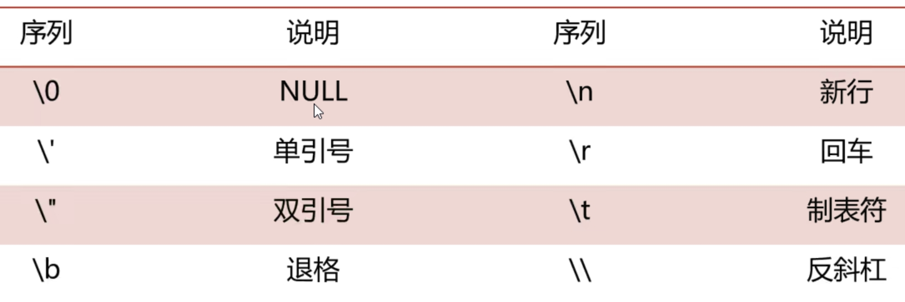
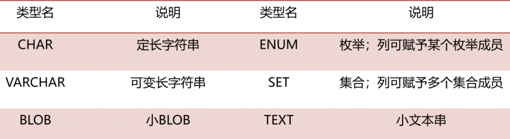
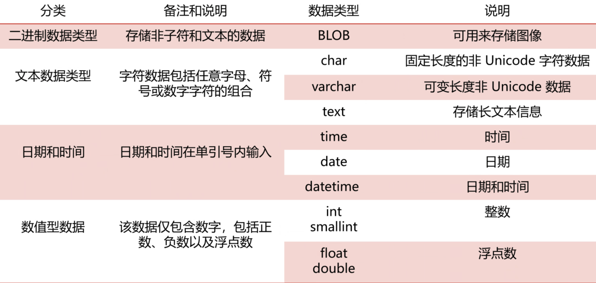
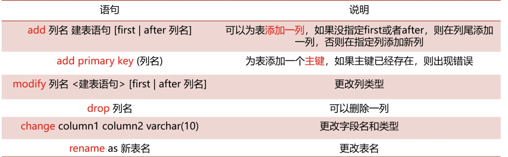
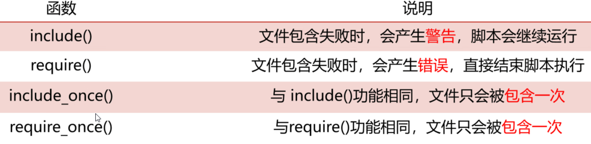
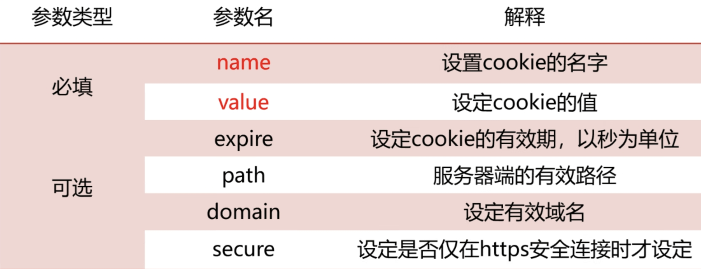
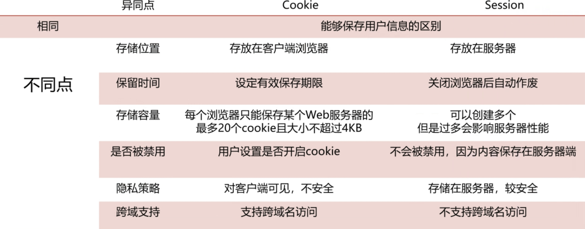

# 第四周

## 一. 第一天

###  1. PHP

####   (1). 介绍

####   (2). 语言规则

* 可放置于文档中的任何位置

##### 	a. 格式

* **以<.?php 开头，以 ?> 结尾**
* **script脚本格式**：<.script language="php">phpcode;<.script>
* 短标签格式：<.?phpcode;?>，需在配置文件php.ini文件中使short_open_tags=On
* ASP风格：<.%phpcode;%>需在配置文件php.ini文件中使asp_tags=On
* 简洁风格：<.?=code;?>

##### b. 大小写敏感

* 关键字、函数名和类名不区分大小写
* 只有**变量区分大小写**

#### (3). 注释

* 单行注释#
* 单行注释// ：vscode快捷键ctrl + /
* 多行注释/* */：vscode快捷键alt + shift + A

#### (4). 变量

- 变量以 **$ 符号开始**，后面跟着变量的名称
- 变量名必须以字母或者下划线字符开始
- 变量名只能包含**字母**、**数字**以及**下划线**
- 变量**使用不必声明**，随创随用
- **严格区分大小写**

####   (5). 输出方法

* echo()：允许**一个或多个**字符串
* print()：只允许**一个**字符串
* die()：程序执行到此停止执行
* var_dump()：输出变量的**内容及数据类型**
* printf()：用于**格式化输出**
* print_r()：用于输出**数组或对象**的结构和内容

### 2. 数据类型

####   (1). 字符串

* 需要用**双引号或单引号**括住
* 单引号——程序**不会**对字符串进行**解析**
* 双引号——**会对字符串进行解析**，如果字符串包含变量，会对变量进行解析
* **纯文本内容**时，建议用**单引号**

####   (2). 整数(nteger)

####   (3). 浮点数(float)

* 带小数点或**指数形式**

####   (4). 布尔型(boolean)

* 只有两个值TRUE或FLASE，**不区分大小写**

####   (5). NULL值

* 当变量为空时自动赋为NULL

###  3. 运算符

####  (1). 算数运算符

| 运算符 | 含义     | 例子(x = 10, y = 6) | 运算结果        |
| ------ | -------- | ------------------- | --------------- |
| +      | 加法运算 | x + y               | 16              |
| -      | 减法运算 | x - y               | 4               |
| *      | 乘法运算 | x * y               | 60              |
| /      | 除法运算 | x / y               | 1.6666666666667 |
| %      | 取余运算 | x % y               | 4               |

####  (2). 字符运算符

| 运算符 | 名称 | 例子                   | 结果           |
| ------ | ---- | ---------------------- | -------------- |
| .      | 串接 | echo ("Hello"."Ketty") | 输出HelloKetty |

####   (3). 赋值运算符

| 运算符 | 等同于    | 运算结果           |
| ------ | --------- | ------------------ |
| x = y  |           | 将右边的值赋给左边 |
| x += y | x = x + y | 加法运算           |
| x -= y | x = x - y | 减法运算           |
| x *= y | x = x * y | 乘法运算           |
| x /= y | x = x / y | 除法运算           |
| x %= y | x = x % y | 取余运算           |
| a .= b | a = a . b | 连接ab两个字符串   |

####   (4). 比较运算符

| 运算符 | 名称     |
| ------ | -------- |
| ==     | 等于     |
| ===    | 全等于   |
| !=     | 不等于   |
| <>     | 不等于   |
| !==    | 不全等   |
| >      | 大于     |
| <      | 小于     |
| >=     | 大于等于 |
| <=     | 小于等于 |

####   (5). 逻辑运算符

| 运算符 | 名称 | 描述                                              |
| ------ | ---- | ------------------------------------------------- |
| and    | 与   | **两者同为真**，返回True，否则返回Flase           |
| or     | 或   | **有一个为真**，返回True，否则返回Flase           |
| xor    | 异或 | 两个**有且只有一个**为真，返回True，否则返回Flase |
| &&     | 与   | 两者同为真，返回True，否则返回Flase               |
| \|\|   | 或   | 有一个为真，返回True，否则返回Flase               |
| ！     | 非   | 对**结果取相反**运算                              |

####   (6). 条件判断

##### 	a. if

###### 	  ①. 语法

```php
if(condition){
    //代码块
}
```

###### 	  ②. 实例

```php
$count = 75;
if($count > 60){
    echo '合格';
}
```

##### 	b. switch

###### 	  ①. 语法

```php
switch (expression) {
    case value1:
        // 代码块1
        break;
    case value2:
        // 代码块2
        break;
    // 更多的 case 语句
    default:
        // 如果没有匹配的值
}
```

###### 	  ②. 实例

```php
// 找到2024年有31天的月份，使用switch  
$year = 2024;
switch (true) {
    case in_array(date('n', strtotime("$year-01-01")), [1, 3, 5, 7, 8, 10, 12]):
        echo "1月\n";
    case in_array(date('n', strtotime("$year-03-01")), [1, 3, 5, 7, 8, 10, 12]):
        echo "3月\n";
    case in_array(date('n', strtotime("$year-05-01")), [1, 3, 5, 7, 8, 10, 12]):
        echo "5月\n";
    case in_array(date('n', strtotime("$year-07-01")), [1, 3, 5, 7, 8, 10, 12]):
        echo "7月\n";
    case in_array(date('n', strtotime("$year-08-01")), [1, 3, 5, 7, 8, 10, 12]):
        echo "8月\n";
    case in_array(date('n', strtotime("$year-10-01")), [1, 3, 5, 7, 8, 10, 12]):
        echo "10月\n";
    case in_array(date('n', strtotime("$year-12-01")), [1, 3, 5, 7, 8, 10, 12]):
        echo "12月\n";
        break;
    default:
        echo "没有找到拥有 31 天的月份。\n";
        break;
}
```

####   (7). 三元运算符

##### 	a. 语法

```php
condition ? value of true : value of flase
```

##### 	b. 实例

```php
$count = 74;
$grade = ($count >= 60? '及格'.'<br>' : '不及格'.'<br>');
echo $grade;
```

###  4. 数组

####   (1). 介绍

* 数组的每一项**实质都是键值对**
* PHP分为**索引数组**和**关联数组**

####   (2). 取值

##### 	a. 语法

* 键值位于[]中

```php
value = 数组名[key]
```

##### 	b. 实例

```php+HTML
<?php
$cars = array('Volvo','BMW','Toyota');
echo 'I like '.$cars[0].'<br>';
echo 'He likes '.$cars[1].'<br>';
?>
```

####   (3). 分类

##### 	a. 索引数组

* key为连续的整数

###### 	  ①. 创建实例

```php
$cars=array("Volvo","BMW","Toyota");
echo count($cars);
```

###### ②. 获取长度

* count()
* sizeof()

```php
$cars = array('Volvo','BMW','Toyota');
echo count($cars);
echo sizeof($cars);
```

###### 	  ③. 循环遍历

```php
$cars=array("Volvo","BMW","Toyota");
$arrlength=count($cars);
for($x=0;$x<$arrlength;$x++){
    echo $cars[$x];
    echo "<br>";
}
```

##### 	b. 关联数组

* key为指定的值，**通常为字符串**

###### 	  ①. 创建方法

```php
//方法1
$age=array("Peter"=>"35","Ben"=>"37","Joe"=>"43");
//方法2
$age['Peter']="35";
$age['Ben']="37";
$age['Joe']="43";
```

###### 	  ②. 实例

```php
<?php
$age=array("Peter"=>"35","Ben"=>"37","Joe"=>"43");
echo "Peter is " . $age['Peter'] . " years old.";
?>
```

###### 	  ③. 循环遍历

```php
$age=array("Peter"=>"35","Ben"=>"37","Joe"=>"43");
foreach($age as $x=>$x_value){
    echo "Key=" . $x . ", Value=" . $x_value;
    echo "<br>";
}
/* 创建一个包含学生信息的多维数组，其中每个学生都有一个名字、年龄和成绩，
    使用foreach便利这个数组，并输出每个学生的名字、年龄和成绩
    */
$students = array(
    array('name' =>"路人甲",'age' => 16,'grade' => 80),
    array('name' =>"路人乙",'age' => 17,'grade' => 60),
    array('name' =>"路人丙",'age' => 18,'grade' => 100),
    array('name' =>"路人丁",'age' => 20,'grade' => 40),
    array('name' =>"路人戊",'age' => 8,'grade' => 87)
    );
foreach($students as $student){
    echo 'Name: ' . $student['name'] . "<br>";
    echo 'age: ' . $student['age'] . "<br>";
    echo 'grade: ' . $student['grade'] . "<br>";
    echo '<br>';
}
```

####   (4). 多维数组

```php
<?php
// 4. 多维数组练习题
/* 创建一个包含学生信息的多维数组，其中每个学生都有一个名字、年龄和成绩，
    使用foreach便利这个数组，并输出每个学生的名字、年龄和成绩
    */
$students = array(
    array('name' =>"路人甲",'age' => 16,'grade' => 80),
    array('name' =>"路人乙",'age' => 17,'grade' => 60),
    array('name' =>"路人丙",'age' => 18,'grade' => 100),
    array('name' =>"路人丁",'age' => 20,'grade' => 40),
    array('name' =>"路人戊",'age' => 8,'grade' => 87)
    );
foreach($students as $student){
    echo 'Name: ' . $student['name'] . "<br>";
    echo 'age: ' . $student['age'] . "<br>";
    echo 'grade: ' . $student['grade'] . "<br>";
    echo '<br><br>';
}
?>
```

####   (5). 基本操作

##### 	a. 添加

* array_push()
* 通过**入栈方式**在数组末尾插入一个或多个元素
* 适用于**键为自动生成**的情况

###### 	  ①. 语法

```php
array_push(array,value1,value2)
```

###### 	  ②. 实例

```php
<?php
// 练习数组的添加操作
$a = array('red','green');
array_push($a,'blue','yellow');
print_r($a);
?>
```

##### 	b. 删除

* array_pop()
* 通过**出栈方式**从数组**末尾删除一个**元素
* 适用于**键为自动生成**的情况

###### 	  ①. 语法

```php
arrar_pop(array)
```

###### 	  ②. 实例

```php
<?php
$a = array('red','green','blue');
array_pop($a);
print_r($a);
?>
```

##### 	c. 排序

###### 	  ①. 基本排序

* sort()：升序
* rsort()：降序

###### 	  ②. 按数组的键

* ksort()：按照键，升序，对关联数组
* krsort()：按照键，降序，对关联数组

###### 	  ③. 按数组的值

* asort()：按照值，升序，对关联数组
* arsort()：按照值，降序，对关联数组

### 5. 函数

####   (1). 定义和调用

##### 	a. 语法

```php
function 函数名称(参数1，参数2...){
    //代码块
    return 返回值;
}
```

##### 	b. 调用

```php
函数名(参数);
$abc = 函数名(参数);
```

####   (2). 传递参数

* 被传入的参数称为实参，函数定义的参数成为形参

##### 	a. 分类

###### 	①. 按值传递

* 在函数内部的操作不会影响到实参

```php
function example($m){
    $m = $m * 5 + 10;
    echo '在函数内：'.$m;
}
example($m);
echo('<br>');
$m = 1;
echo "在函数外：$m";
```

###### 	②. 按引用传递

###### 	③. 默认参数

* 在定义形参时，可以指定某个参数为可选参数，将**可选参数放在列表末尾**，并指定默认值

```php
function example($m,$n='2'){
    $m = $m + $n;
    echo "在函数内：".$m;
}
example(5,6);
example(5);
```

##### 	b. 返回值

####   (3). 作用域

* 每个函数创建了一个**新的作用域**

#####   a. 局部作用域

#####   b. 全局作用域 

* 使用global关键字修饰

####   (4). 标准函数库

| 类型         | 说明           | 语法           |
| ------------ | -------------- | -------------- |
| gettype      | 获取变量类型   | empty(变量)    |
| **empty**    | 判断是否为空   | gettype(变量)  |
| is_array     | 判断是否为数组 | is_array(变量) |
| isset        | 判断是否被赋值 | isset(变量)    |
| unset        | 销毁变量       | unset(变量)    |
| **var_dump** | 打印变量信息   | var_dump(变量) |

### 6. 类和对象

####   (1). 类

* 具有**同样特征**并展现**同样行为**的对象的集合

##### 	a. 描述

* 属性：**描述类成员**的变量
* 方法：类成员**可以执行的动作**

##### 	b. 优点

* 数据**结构清晰**
* 代码**灵活性**好
* 代码的**可重用性**

##### 	c. 创建

###### 	  ①. 方法

* 在要创建的**类名前**加上**关键字class**代表声明

###### 	  ②. 语法

```php
class class_name{
    var 属性1;
    var 属性2;
    function function_name1{
        //代码体
    }
    function function_name2{
        //代码体
    }
}
```

####   (2). 对象

##### 	a. 创建(实例化)

* 实例化 -> 使用类
* 创建对象 -> 在类名上加上**关键字new**

```php
$变量名 = new 类名称;
```

##### 	b. this关键字

* 作用范围是当前作用域

## 二. 第二天

### 1. 表单

####   (1). 介绍

* 用于采集和提交用户信息
* 提交信息到服务器(后端)进行验证

####   (2). 结构

```html
<form name="name" method='post/get' action='url' enctype='value'>
    //表单元素
</form>
```

* 可以包含文本框、按钮、单选框、复选框、下拉框等元素

####   (3). 属性

##### 	a. action

###### 	  ①. 语法

```php+HTML
<form action=url>
```

* action属性的值表示该表单**提交位置**
* action的值一般是**php程序**或**动态网页的名称**

###### 	  ②. 实例

```php+HTML
<form action='echo.php' method='GET'>
    //表单内容
</form>
```

##### 	b. method

###### 	  ①. POST

* $_POST
* 适用于发送**保密**或**较大数据量**内容
* 长度**没有限制**
* 用户输入的信息**无法在浏览器被直接看到**

```php+HTML
<form name='test' action='post.php' method='post'>
    <label for="username">username</label>
    <input id='username' type='text' name='user' value='please input your username!!!'><br><br>
   	<label for="password">password</label>
    <input id='password' type='password' name='pass' value=''><br><br>
    <input type='submit' name='submit' value='submit'>
</form>

php文件：
<?php
    $user = $_GET['user'];
    $pass = $_GET['pass'];
    if (empty($user) || empty($pass)){
        echo '<script>alert("username and password are empty!!!");
        window.history.back(-1)</script>';
    }
    else{
        echo 'username: '.$user;
        echo '<br>';
        echo 'password: '.$pass;
    }
?>
```

###### 	  ②. GET

* $_GET
* **不具有保密性**,传输**速度快**
* 输入长度受到限制(**2K字节**)
* 表单提交信息作为字符串附加在action后面
* 参数使用 ？或 & 隔开

```php+HTML
<form action = 'get2.php' name = 'test' method="GET">
        UserName: <input type="text" name="uname"/>
        Password: <input type="password" name="pass"/>
        <input type="submit" name="submit" value="提交"/>
</form>
```

###### 	  ③.request

* $_REQUEST

* 支持两种发送过来的请求，即**post和get都可以接受**

####   (4). 表单练习

```php+html
html文件：
<!DOCTYPE html>
<html lang="en">
    <meta charset="UTF-8">
    <head>
        <title>login</title>
    </head>
    <body>
        <form id="form" action = 'login.php' method = 'GET' onsubmit="return judgement()">
            username:<input id='username' type='text' name='user'><br>
            password:<input id='password' type='password' name='pass'><br>
            <input type='submit' name='submit' value='submit'>
        </form><br><br>
    </body>
    <!-- 判断用户名和密码是否为空、密码长度大于5位、用户名的格式 -->
    <script>
        function judgement(){
            var form = document.getElementById('form');
            var username = document.getElementById('username').value;
            var password = document.getElementById('password').value;
            // 输入用户名时，只能是字母、数字和下划线的组合
            var regex = /^[\w]+$/;
            if(username =='' || password==''){
                alert('用户和密码为空！');
                return false;
            }
            else if(password.length <= 5){
                alert('密码长度要大于5！');
                return false;
            }
            else if(!regex.test(username)){
                alert('用户名只能是字母、数字、下划线的组合！');
                return false;
            }else{
                alert('验证通过！');
                return true;
            }
    }
    </script>
</html>

php文件：
<?php
    $user = $_GET['user'];
    $pass = $_GET['pass'];
    if (empty($user) || empty($pass)){
        echo '<script>alert("username and password are empty!!!");
        window.history.back(-1)</script>';
    }
    else{
        echo 'username: '.$user;
        echo '<br>';
        echo 'password: '.$pass;
    }
?>
```

### 2. 文件处理

####   (1). 文件访问

##### 	a. 基础概念

* 对文件操作包括创建、写入、读取文本文件等

##### 	b. 流程

1. 打开文件
2. 读取或写入文件
3. 关闭文件

####   (2). 文件打开

##### 	a. fopen()

###### 	  ①. 解释

* 用来打开文件，打开成功返回一个句柄，失败返回false

###### 	  ②. 语法

```php
fopen(string name, string mode) //第一个参数为文件路径或URL网址，第二个为打开方式
```

###### 	  ③. 实例

```php
//1. 相对路径
$file = fopen("../test.txt","r");
//2. 绝对路径
$file = fopen("C:/Users/26254/Desktop/123.txt","r");
```

####   (3). 文件读取

##### 	a. 常用函数

| 函数名                  | 含义                                                       |
| ----------------------- | ---------------------------------------------------------- |
| fread()                 | 读取**整个文件**或**指定长度**字符串，可用于二进制文件读取 |
| **fgets()**             | 读取**一行字符**                                           |
| fgetss()                | 读取**一行字符**，并去掉所有HTML和PHP标记                  |
| fgetc()                 | 读取一个字符                                               |
| **file_get_contents()** | 将文件读入字符串                                           |
| file()                  | 将文件读入数组                                             |
| readfile()              | 将文件读取并输出到缓冲区                                   |
| **feof()**              | 判断文件指针是否到结尾                                     |
| ftell()                 | 显示文件指针位置                                           |

##### 	b. fread()

###### 	  ①. 解释

* 可读取**指定长度**的文件内容，file为**文件句柄**

###### 	  ②. 语法

```php
fread(file,length)
```

###### 	  ③. 实例

```php
$handle1 = fopen("1.txt","r");
$str = fread($handle1,filesize("1.txt"));
echo $str;
fclose($handle1);
```

##### 	c. fgets()

###### 	  ①. 解释

* 读取**文本文件**中的**一行**

###### 	  ②. 语法

```php
fgets(file)	//file规定要读取打开的文件
```

###### 	  ③. 实例

```php
$file = fopen("1.txt","r");
while(!feof($file)){    //读取文件的每一行,读取完后指针会指向下一行
    $str = fgets($file);
    echo $str.'<br>';
}
fclose($file);
echo '<br><br>';
```

##### 	d. file_get_contents()

###### 	  ①. 解释

* 用于读取文件内容的函数

###### 	  ②. 语法

```php
file_get_contents( $filename,$context,FILE_APPEND)
```

###### 	  ③. 实例

```php
echo file_get_contents('1.txt');    
$file = '2.txt';//文件不存在则会创建一个新文件
$content = "\n"."hello world";
if(file_put_contents($file,$content,FILE_APPEND)){  //FILE_APPEND代表追加模式，不写默认覆盖
    echo "success<br>";
}
echo "<pre>" .file_get_contents($file)."<pre>" ; //加上<pre>标签来换行
```

####   (4). 文件写入

##### 	a. fwrite()

###### 	  ①. 解释

* 将**一个字符串**写入到文本文件中

###### 	  ②. 语法

```php
fwrite(file, string, length, mode)	//1.写入的文件 2.写入的内容 3.写入的最大字节数 4.写入模式
```

###### 	  ③. 实例

```php
$file = '1.txt';
$handle = fopen($file,'a');
$data = "\n".'This is the data';
fwrite($handle,$data);
fclose($handle);
```

##### 	b. file_put_contents()

###### 	  ①. 解释

* 将一个字符串写入文本文件，**文件不存在则会创建**

###### 	  ②. 语法

```php
file_put_contents( $file,$data)
```

###### 	  ③. 实例

```php
echo file_get_contents('1.txt');    
$file = '2.txt';//文件不存在则会创建一个新文件
$content = "\n"."hello world";
if(file_put_contents($file,$content,FILE_APPEND)){  //FILE_APPEND代表追加模式
    echo "success<br>";
}
echo "<pre>" .file_get_contents($file)."<pre>" ; //加上<pre>标签来换行
```

####   (5). 文件关闭

##### 	  a. fclose()

###### 	  ①. 解释

* 在文件读写完毕后，**必须关闭文件**

###### 	  ②. 语法

```php
fclose($file);
```

###### 	  ③. 实例

```php
$file = fopen("text.txt","r");
//执行的代码
fclose($file);
```

####   (6). 基本操作

##### 	a. 文件操作

###### 	  ①. 基本函数

| 函数          | 语法                              | 说明                         |
| ------------- | --------------------------------- | ---------------------------- |
| **copy()**    | copy(源文件，目的文件)            | 复制文件                     |
| **unlink()**  | unlink(目标文件)                  | 删除文件                     |
| **rename()**  | rename(旧文件名，新文件名)        | 重命名或移动文件，重命名目录 |
| ftruncate()   | ftruncate(目标文件资源，截取长度) | 截断到指定长度               |
| file_exists() | file_exsits(目标文件名)           | 判断文件(文件夹)是否存在     |
| is_file()     | is_file(文件名)                   | 判断指定的路径存在且为文件   |

###### 	  ②. 实例

```php
if(copy("1.txt","bak.txt")){
    echo "文件复制成功";
}else{
    echo '文件复制失败';
}
rename("bak.txt","cxk.txt");
unlink("cxk.txt");
```

##### 	b. 文件属性

###### 	  ①. 基本函数

| 函数名         | 说明                               |
| -------------- | ---------------------------------- |
| **filesize()** | 返回文件**大小**，只读             |
| filetype()     | 返回文件**类型**(文件或目录)，只读 |
| filectime()    | 返回创建时间戳                     |
| filemtime()    | 返回修改时间戳                     |
| **realpath()** | 返回**绝对路径**                   |
| pathinfo()     | 以数组形式返回文件路径和文件名信息 |

###### 	  ②. 实例

```php
$file = '1.txt';
echo "<br>文件名: ".basename($file);
$patharr= pathinfo($file);
echo "<br>文件扩展名: ".$patharr['extension'];
echo "<br>文件属性: ".filetype($file);
echo "<br>文件路径: ".realpath($file);
echo "<br>文件大小: ".filesize($file);
echo "<br>文件创建日期: ".date("Y-m-d H:i:s",filectime($file));
echo "<br>文本内容: ".file_get_contents($file);
```

##### 	c. 目录操作

| 函数名             | 说明                     | 实例                       |
| ------------------ | ------------------------ | -------------------------- |
| mkdir(filename)    | 新建目录                 | mkdir('temp')              |
| rmdir(dirname)     | 删除目录(必须为空)       | rmdir('data')              |
| getcwd(void)       | 取得当前文件目录         | echo getcwd()              |
| chdir(dirname)     | 改变当前目录             | chdir('../')               |
| opendir(path)      | 打开目录，返回目录指针   | $dirh = opendir('temp')    |
| closedir()         | 关闭目录，参数为文件指针 | closedir($dirh)            |
| readdir()          | 遍历目录                 | $file = readdir($dirh)     |
| scandir(path,sort) | 数组形式遍历目录         | $arr = scandir('D:\ICQ',1) |

## 三. 第三天

###   1. Mysql

#### 	(1). 登录

```
mysql (-h host_name) (--port portid) -u user_name -p
```

#### 	(2). 常用命令

| 命令            | 含义                     |
| --------------- | ------------------------ |
| show databases; | 显示所有数据库           |
| use dbname;     | 选定默认数据库           |
| show tables;    | 显示当前数据库中的所有表 |
| DESC table;     | 显示表的字段             |
| \c              | 放弃正在输入的命令       |
| \h              | 显示命令清单             |
| \q              | 退出mysql数据库          |
| \s              | 查看Mysql服务器状态信息  |

#### 	(3). 数据类型

##### 	  a. 数字型

###### 	  ①. 整型int

* 可以由**十进制**或**十六进制**表示

###### 	  ②. 浮点型float

##### 	  b. 字符串

* 由**单引号**或**双引号**括起来的**字符或者数字**

* 字符串中要用**转义字符**才能表示的**特殊符号**

  

##### 	  c. 日期和时间值

* 存储时间值
* 按**“年-月-日”**顺序

##### 	  d. NULL值

* **无类型**的值，表示“空”

#### 	(4). 列类型

##### 	  a. 数字型

| 类型名    | 说明  | 类型名  | 说明                   |
| --------- | ----- | ------- | ---------------------- |
| TINYINT   | 1字节 | BIGINT  | 8字节                  |
| SMALLINT  | 2字节 | FLOAT   | 单精度(4字节)浮点数    |
| MEDIUMINT | 3字节 | DOUBLE  | 双精度(8字节)浮点数    |
| INT       | 4字节 | DECIMAL | 用户指定精度和小数位数 |

##### 	  b. 字符串型



##### 	  c. 常用类型



#### 	(5). 常用SQL语句

#####  	a. 创建数据库

###### 	  ①. 说明

* 创建一个指定数据库，该数据库已经存在则会创建失败

###### 	  ②. 语法

```
create database 数据库名
```

###### 	  ③. 实例

```
mysql> create database genshin_impact;
Query OK, 1 row affected (0.13 sec)
```

##### 	b. 创建表

###### 	  ①. 说明

* 在当前数据库下创建一个数据表

###### 	  ②. 语法

```
create table [表名] (
列名1 列类型 (列的完整性约束),
列名2 列类型 (列的完整性约束),
...
列名n 列类型 (列的完整性约束)
);
```

###### 	  ③. 实例

```
mysql> create table characters(
    -> id int(10),
    -> name varchar(255),
    -> element varchar(50),
    -> weapon varchar(100),
    -> level int(10)
    -> );
Query OK, 0 rows affected (0.05 sec)
```

##### 	c. 查看字段

###### 	  ①. 说明

* 用于显示表的创建结构

###### 	  ②. 语法

```
desc [表名];
```

###### 	  ③. 实例

```
desc student;
```

##### 	d. 删除表操作

###### 	  ①. 说明

* 从数据库中删除给定的表，如果给出 if exists字句，则删除不存在的表不会报错

###### 	  ②. 语法

```
drop table [if exists] [表名1][,表名2]...
```

###### 	  ③. 实例

```
drop table student;
```

##### 	e. 删除数据库

###### 	  ①. 说明

* 删除给定的数据库

###### 	  ②. 语法

```
drop database [if_exists] [数据库名];
```

###### 	  ③. 实例

```
drop database laffrex;
```

##### 	f. 更改表结构

###### 	  ①. 语法

```
alter table [表名] action;
```

###### 	  ②.action值



###### 	  ③. 实例

```
mysql> alter table student change student_garde student_grade int(10);
Query OK, 0 rows affected (0.04 sec)
Records: 0  Duplicates: 0  Warnings: 0
```

#####  g. 插入数据行

###### 	  ①. 说明

* 向表中插入数据，如果没有字段名，则默认向所有字段添加值

###### 	  ②. 语法

```
insert into [表名] （[列名]） values (值列表)；
```

###### 	  ③. 实例

```
1.单行插入：
mysql> insert into characters values (1001,"刻晴","雷","单手剑",80);
Query OK, 3 rows affected (0.04 sec)

2. 多行插入：
mysql> insert into characters values (1001,"刻晴","雷","单手剑",80),(1002,"胡桃","火","长枪",90),(1003,"莫娜","水","法器",70);
Query OK, 3 rows affected (0.04 sec)
```

##### 	h. 更新数据行

###### 	  ①. 说明

* 如果不带where子句，则更新所有行数据

###### 	  ②. 语法

```
update [表名] set [列名 = 更新值] (where = [更新条件]);
```

###### 	  ③. 实例

```
mysql> update characters set level = 80 where name = "莫娜";
Query OK, 1 row affected (0.01 sec)
```

##### 	i. 删除数据行

###### 	  ①. 说明

* 如果不带where子句，删除表中所有记录，但是表不被删除

###### 	  ②. 语法

```
delete from [表名] (where [删除条件]);
```

###### 	  ③. 实例

```
mysql> delete from characters where level < 80;
Query OK, 0 rows affected (0.00 sec)
```

### 2. php连接数据库

####   (1). 流程

1. 连接数据库
2. 选择数据库
3. 执行数据操作
4. 关闭结果集
5. 关闭数据库连接

####   (2). 方法

##### 	a. 连接数据库

###### 	  ①. 低版本

1. 语法

   ```php
   mysql_connect('hostname','username','password')
   ```

2. 实例

   ```php
   $conn =  mysql_connect("localhost","root","root");
   ```

###### 	  ②. 高版本

1. 语法

   ```php
   new mysqli("localhost","root","root")
   ```

2. 实例

   ```php
   $conn = new mysqli("localhost","root","root");
   ```

##### 	b. 选择数据库

###### 	  ①. 低版本

1. 语法

   ```php
   mysql_select_db(string数据库名[,resource link_identifier]);
   或
   mysql_query("use数据库名"[,resource link_identifier])；
   ```

2. 实例

   ```php
   $conn = mysql_connect("localhost","root","root");
   if(mysql_select_db("laffrex",$conn)){
       echo "select database success!".'<br>';
   }else{
       echo "select database field!".'<br>';
   }
   mysql_close($conn);
   ```

###### 	  ②. 高版本

1. 语法

   ```php
   $conn->select_db("数据库名")
   ```

2. 实例

   ```php
   $conn = new mysqli("localhost","root","root");
   if($conn->select_db("laffrex")){
       echo "select database success!".'<br>';
   }else{
       echo "select database field!".'<br>';
   }
   $conn->close();
   ```

##### 	c. 操作数据库

###### 	  ①. 低版本

1. 语法

   ```php
   mysql_query(string query[, resource link_identifier]);
   ```

   * select查询成功返回结果集，失败返回“false”
   * insert、delete、update成功返回true，失败返回false

2. 实例

   ```php
   $conn = mysql_connect("localhost","root","root");
   mysql_select_db("laffrex",$conn);
   $result = mysql_query("insert into characters values('1001','刻晴','雷','单手剑',90)",$conn);
   mysql_close($conn);
   ```

###### 	  ②. 高版本

##### 	d. 关闭数据库

###### 	  ①. 低版本

```php
$conn = mysql_connect("localhost","root","root");
mysql_close($conn);
```

###### 	  ②. 高版本

```php
$conn = new mysqli("localhost","root","root");
$conn->close();
```

#####   e. 读取内容

###### ①. mysql_query()

###### ②. mysql_fetch_array()

1. 含义

* 从数组结果集中获取信息

2. 语法

   ```php
   mysql_fetch_array(data,array_type)
   ```

   * data: **resource类型的参数**，传入的是由mysql_query()函数返回的**数据指针**
   * array_type:**规定返回哪种结果** MYSQL_NUM/NYSQL_ASSOC  默认为MYSQL_BOTH

###### ③. mysql_fetch_row()

1. 含义

* 从和制定的结果标识关联的结果集中**获取一行数据**并作为**数组**返回

2. 语法

   ```php
   mysql_fetch_row(data)
   ```

###### ④. mysql_num_rows

1. 含义

* 获取由**select语句**查询到的结果集中的**行的数目**

2. 语法

```php
mysql_num_rows(data)
```

```php
$conn = mysql_connect("localhost","root","root");
    mysql_select_db("laffrex",$conn);
    $sql = 'select * from unit1';
    $result = mysql_query($sql);
    while($row = mysql_fetch_array($result)){
        print_r($row);
    }
    mysql_close($conn);
```

### 3. 文件包含

####   (1). 概念

* 可以在服务器**执行文件前插入另一个文件的内容**
* 提供不同文件**相互调用**的一种方法

####   (2). 相关语句



##### 	a. include

* 使用**相对路径**把**外部文件**组合进当前文件

* 文件不存在，发出警告，继续执行

* ```php
  include "filename";
  ```

##### 	b. require

* 基本同include一样

* 文件不存在，发出**报错**，停止运行

* ```php
  require "filename";
  ```

##### 	c. include_once

* 若找到资源文件且**第一次加载**，返回**整数1**

* 若资源文件**非第一次加载**，返回**TRUE**

* 文件不存在，发出**警告**，继续执行

* ```php
  include_once "filename";
  ```

##### 	d. require_once

* 导入文件前检查**是否在该文件其他地方被调用**，是则不重复调用，否则输出

* ```php
  require_once "filename";
  ```


## 四、第四天

### 1. 会话控制

#### (1). 会话概念

* **客户端**与**服务器**之间连续发生的一系列请求和响应过程

#### (2). 实现方法

##### a. cookie

##### b. session

#### (3). cookie

##### 	a. 概述

* 在http协下，**维护**客户端信息的一种方式
* 可以保存在用户**本地的文件**，包含用户信息
* 浏览器上cookie超出数量限制时，会**自动删除**

##### 	b. 设置

###### 	  ①. 解释

* 在调用setcookie()函数之前，**不能有任何的输出内容**
* setcookie()函数必须**放于html标签之前**

###### 	  ②. 语法

```php
setcookie(name,value,expire,path,domain.secure);
```

###### 	  ③. 参数



###### 	  ④. 实例

```php
<?php
$value = "你好";
$cookie = setcookie(test,$value,time()+3600*24);
echo $cookie;
?>
```

##### c. 接受和处理

###### 	  ①.描述

* PHP会**自动**从web服务器**接受HTTP头**并**分析**它
* 超全局变量$_COOKIE用于取回cookie的值

###### 	  ②. 实例

```php
$value = "my cookie value";
    setcookie("TestCookie", $value,time()+3600*24);
    if(isset($_COOKIE['TestCookie'])){
        echo "Welcome". $_COOKIE["TestCookie"]. "!<br>";
    }else{
        echo "Welcome guest!<br>";
    }
```

##### d. 删除cookie

###### 	  ①. setCookie()

* 将value值设置为空

```php
setcookie("CookieName",NULL)  	//将value值设置为NULL
setcookie("CookieName",'')		//将value值设置为空
```

###### 	  ②.失效时间

* 使过期日期变更为过去的时间点
* 当Cookie**被删除**时，在**当前页面任然有效**，除非把cookie保存为浏览器进程

```php
setcookie("TestCookie","value",time()-3600*24);
setcookie("TestCookie","value",time());		//只对生成cookie这一秒生效
```

##### e. 注意事项

1. setcookie()必须**在html输出任何内容之前**
2. 可以使用**time()立即设置失效**
3. 一个**浏览器最多30个**Cookie，且每个不超过4KB；每个**WEB站点最多20个**
4. 用户禁用cookie，则cookie失效
5. 设置失效时间为time()，在**页面浏览完之后**被删除

#### (4). session

##### a. 概述

* **有始有终**的一系列**动作/消息**
* **进入网站**到**浏览器关闭**这段时间
* 默认生命周期为**20分钟**

##### b. 作用

* 用于**身份认证**、程序状态记录、页面**参数传递**
* 为了在**服务器保持客户端**的状态

##### c. 基本使用

###### ①. 启动会话

* 开始一个会话，或返回**已经存在**的会话
* 没有参数，返回值**固定为ture**
* 使用基于cookie的session，使用前html一样不能有任何输出

```php
session_start()
```

###### ②. 注册会话变量

* 注册SESSION全局变量，和GET、POST、COOKIE等方法相同

```php
$_SESSION['xxx'] = xxx; 
```

###### ③. 使用会话变量

```php
echo $_SESSION['xxx'];
```

###### ④. 销毁

* 删除**指定session**:  unset($_SESSION['user']);
* 一次注销**所有session**:   $_SESSION= array();
* 结束**当前会话**，并清空会话中的所有资源:  session_destroy();
* PHP**默认**的session是**基于cookie**的，如果要删除cookie，必须借助setcookie()函数

```php
unset($_SESSION['user']); //销毁原来注册的某个变量
session_destroy();	//销毁整个Session
```

###### ⑤. 实例

```php
<?php
session_start();    //启动session的初始化
$_SESSION['user'] = 'ICQ';  //注册session并赋值
echo $_SESSION['user']; 
?>
```

#### (5). 异同点


